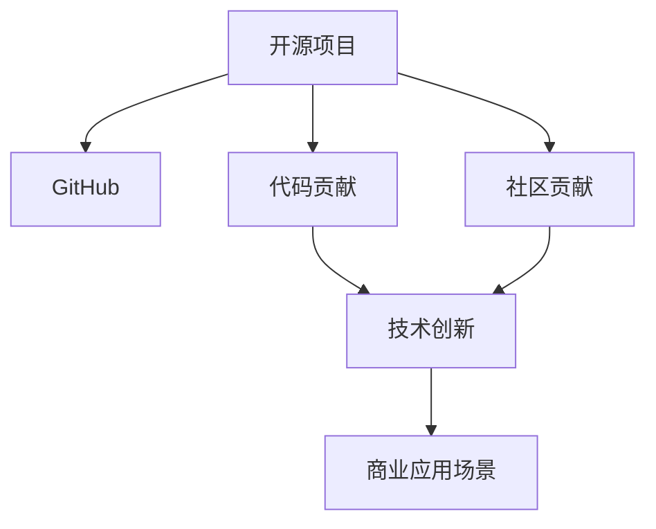

                 

# 开源项目：提升影响力与机会

> 关键词：开源项目, 影响力, 开发者社区, 社区贡献, 代码贡献, 技术创新, 商业应用

## 1. 背景介绍

### 1.1 问题由来

近年来，开源项目在全球软件开发中扮演着越来越重要的角色。无数开发者在开源平台上贡献代码、文档和创新，通过协作创造出前所未有的软件和解决方案。然而，开源项目的影响力仍然存在局限性，一些高质量的开源项目未能获得足够的关注和应用。本文将探讨如何提升开源项目的影响力，帮助开发者发现和利用开源机会，实现更大的技术创新和商业价值。

### 1.2 问题核心关键点

为了提升开源项目的影响力，我们首先需要明确几个关键点：

- **高质量代码**：优秀的开源项目必须提供高质量、稳定可靠的代码，以吸引持续的贡献者和用户。
- **积极社区互动**：一个活跃的开源社区能够吸引更多的贡献者和用户，维护项目的活跃度。
- **清晰项目文档**：高质量的项目文档和用户指南是用户理解和使用开源项目的重要保障。
- **商业应用场景**：开源项目需要找到能够带来商业价值的实际应用场景，增强其市场竞争力。

## 2. 核心概念与联系

### 2.1 核心概念概述

为了更好地理解如何提升开源项目的影响力，本节将介绍几个关键概念：

- **开源项目(Open Source Project)**：指在开源许可协议下发布的源代码和相关文档，允许任何人自由地使用、修改和分发。
- **GitHub**：全球最大的代码托管平台，提供版本控制、协作开发、代码审查、问题跟踪等功能。
- **社区贡献(Community Contribution)**：指开发者为开源项目贡献代码、文档、测试用例等，以推动项目的发展。
- **代码贡献(Code Contribution)**：指开发者提交的代码更改，是开源项目迭代和优化的基础。
- **技术创新(Technical Innovation)**：指通过开源项目实现的新技术、新算法或新应用场景，推动技术前沿的进步。
- **商业应用场景(Commercial Use Case)**：指开源项目在实际商业环境中的应用，如产品、服务或解决方案的实现。

这些概念之间的逻辑关系可以通过以下Mermaid流程图来展示：



这个流程图展示了开源项目通过社区贡献和代码贡献实现技术创新，进而找到商业应用场景的逻辑路径。

## 3. 核心算法原理 & 具体操作步骤
### 3.1 算法原理概述

提升开源项目影响力的算法原理主要包括以下几个方面：

- **社区激励机制**：通过奖励、认证等机制，激励社区成员积极参与项目的贡献。
- **代码质量控制**：采用代码审查、代码审计等手段，保证代码的稳定性和可维护性。
- **版本管理和更新机制**：采用有效的版本控制和发布机制，确保项目迭代的连续性和稳定性。
- **用户互动和反馈**：通过用户文档、论坛、邮件等方式，收集用户反馈，不断优化项目。

### 3.2 算法步骤详解

提升开源项目影响力的具体操作步骤包括：

1. **选择合适的开源许可证**：根据项目的商业目标和法律需求，选择合适的开源许可证，如GPL、Apache、MIT等。
2. **创建高质量的代码仓库**：在GitHub或其他代码托管平台上创建项目仓库，确保代码的组织结构清晰，命名规范。
3. **建立活跃的社区**：创建项目网站和论坛，鼓励用户参与讨论，建立开发者社区。
4. **积极收集用户反馈**：通过问卷调查、用户文档和论坛等方式，收集用户对项目的反馈和建议。
5. **定期发布更新**：按照预定的发布计划，定期发布项目更新和改进。
6. **寻找商业合作伙伴**：与商业公司建立合作关系，寻找项目在商业环境中的应用场景。

### 3.3 算法优缺点

提升开源项目影响力的算法具有以下优点：

- **提升代码质量**：通过代码审查和用户反馈，不断优化代码质量，确保项目的稳定性和可维护性。
- **增强社区凝聚力**：活跃的社区和积极的社区互动，能够吸引更多的开发者和用户，共同推动项目发展。
- **促进技术创新**：项目中融入新技术和创新点，推动技术前沿的发展。

同时，该算法也存在一些局限性：

- **资源消耗较大**：维护高质量社区和代码质量需要投入大量时间和资源。
- **商业化难度高**：一些开源项目可能难以找到直接的商业应用场景，难以实现商业价值。

### 3.4 算法应用领域

提升开源项目影响力的算法广泛应用于各类开源项目，包括但不限于：

- **Web开发框架**：如Django、Flask等，通过社区贡献和代码贡献，不断改进功能和性能。
- **移动应用开发**：如React Native、Flutter等，通过社区贡献和代码贡献，推动跨平台应用的普及。
- **数据处理和分析**：如Apache Hadoop、Spark等，通过社区贡献和代码贡献，提升数据处理和分析能力。
- **人工智能和机器学习**：如TensorFlow、PyTorch等，通过社区贡献和代码贡献，推动人工智能技术的发展。

## 4. 数学模型和公式 & 详细讲解 & 举例说明

### 4.1 数学模型构建

为了更严格地分析提升开源项目影响力的过程，我们建立一个数学模型。设开源项目的影响力为 $I$，社区成员数量为 $C$，代码贡献数量为 $D$，技术创新数量为 $T$，商业应用场景数量为 $B$。

则模型的目标函数为：

$$
I = f(C, D, T, B)
$$

其中 $f$ 为影响力与社区、代码、技术和商业应用场景之间的复杂函数关系。

### 4.2 公式推导过程

为了简化问题，我们假设 $f$ 为线性函数，即：

$$
I = k_1C + k_2D + k_3T + k_4B
$$

其中 $k_1, k_2, k_3, k_4$ 为正系数，表示社区、代码、技术和商业应用场景对影响力的贡献比例。

### 4.3 案例分析与讲解

考虑一个开源数据库管理系统MySQL。该项目通过社区贡献、代码贡献、技术创新和商业应用场景的共同作用，提升了其影响力。

1. **社区贡献**：MySQL有活跃的开发者社区，通过邮件列表、论坛、Gitter等渠道，鼓励开发者积极参与贡献。社区贡献的数量 $C$ 对影响力的提升有显著贡献。
2. **代码贡献**：MySQL定期发布更新，修复已知问题，添加新功能。代码贡献的数量 $D$ 直接影响项目质量和稳定性。
3. **技术创新**：MySQL引入了一些创新技术，如InnoDB存储引擎、XtraBackup备份工具等，提升了项目的竞争力。技术创新数量 $T$ 对项目的影响力有重要影响。
4. **商业应用场景**：MySQL被广泛应用于企业级数据库，支持多种操作系统和数据库管理系统，商业应用场景数量 $B$ 对项目的影响力有显著贡献。

根据上述分析，我们可以推断出：

$$
I = k_1C + k_2D + k_3T + k_4B
$$

其中 $k_1, k_2, k_3, k_4$ 的值需要通过实际数据进行估计和验证。

## 5. 项目实践：代码实例和详细解释说明
### 5.1 开发环境搭建

在进行开源项目实践前，我们需要准备好开发环境。以下是使用Python进行Django开发的示例环境配置流程：

1. **安装Python**：从官网下载并安装Python，确保版本为3.6或以上。
2. **安装Django**：在终端输入 `pip install django` 安装Django框架。
3. **创建Django项目**：在终端输入 `django-admin startproject myproject` 创建一个新的Django项目。
4. **创建Django应用**：在项目目录中创建一个新的Django应用 `python manage.py startapp myapp`。
5. **安装开发工具**：安装开发工具如PyCharm、VS Code等。

完成上述步骤后，即可在新的开发环境中进行Django项目的开发。

### 5.2 源代码详细实现

下面以Django项目为例，展示如何使用Python进行代码贡献。

1. **创建虚拟环境**：
   ```bash
   python -m venv venv
   source venv/bin/activate
   ```

2. **创建Django应用**：
   ```bash
   python manage.py startapp blog
   ```

3. **编写代码**：在 `blog` 应用目录下，创建 `views.py` 文件，编写代码：

   ```python
   from django.shortcuts import render
   from django.http import HttpResponse

   def index(request):
       return render(request, 'blog/index.html', {'context': {'name': 'Django'}})
   ```

4. **提交代码**：在GitHub上创建一个新的仓库，将代码提交到仓库中。

5. **创建文档**：在 `blog` 应用目录下，创建 `urls.py` 文件，编写代码：

   ```python
   from django.urls import path

   urlpatterns = [
       path('', views.index, name='index'),
   ]
   ```

6. **发布更新**：使用 `python manage.py makemigrations` 和 `python manage.py migrate` 发布更新。

### 5.3 代码解读与分析

让我们再详细解读一下关键代码的实现细节：

**views.py文件**：
- `index(request)` 函数：定义了Django应用的视图函数，用于处理HTTP请求。

**urls.py文件**：
- `urlpatterns` 列表：定义了应用中的路由规则，将视图函数与URL进行映射。

**5.4 运行结果展示**

运行 `python manage.py runserver` 启动Django开发服务器，访问 `http://127.0.0.1:8000/`，可以看到输出内容为 "Django"。

## 6. 实际应用场景

### 6.1 开发者社区

开源项目的开发者社区是推动项目发展的关键因素。一个活跃的社区能够吸引更多的开发者参与贡献，推动项目的不断改进和优化。

**案例**：Apache Hadoop项目通过邮件列表、GitHub Issue和Confluence等工具，建立了强大的开发者社区。社区成员积极参与贡献，修复问题，添加新功能，推动了Hadoop项目的快速发展。

### 6.2 商业应用场景

找到商业应用场景是提升开源项目影响力的重要途径。通过与商业公司合作，将项目应用于实际产品和服务中，能够显著提升项目的影响力和市场竞争力。

**案例**：MySQL被广泛应用于企业级数据库，支持多种操作系统和数据库管理系统。商业应用场景的广泛应用，使得MySQL成为全球最受欢迎的数据库管理系统之一。

### 6.3 教育培训

开源项目在教育培训中也发挥着重要作用。通过使用开源项目进行教学，能够让学生更好地理解技术原理和实际应用。

**案例**：Django框架通过开源社区的持续贡献，不断改进和优化。Django的文档和示例项目成为Python Web开发教学的重要参考，帮助学生掌握Web开发技术。

### 6.4 未来应用展望

伴随开源项目的不断发展和技术的进步，未来开源项目的市场和影响力将进一步提升。

1. **AI和机器学习**：开源AI和机器学习框架如TensorFlow、PyTorch等，将继续推动人工智能技术的发展，带来更多的创新和应用场景。
2. **物联网(IoT)**：开源物联网项目如OpenWrt、Home Assistant等，将推动智能家居、工业物联网等领域的创新。
3. **区块链**：开源区块链项目如Ethereum、Hyperledger等，将推动数字货币、智能合约等技术的发展。
4. **云计算**：开源云计算项目如Kubernetes、Apache Hadoop等，将推动云计算技术的普及和应用。

## 7. 工具和资源推荐
### 7.1 学习资源推荐

为了帮助开发者系统掌握开源项目的影响力提升，这里推荐一些优质的学习资源：

1. **《开源开发：从概念到实践》**：一本详细介绍开源开发流程和最佳实践的书籍，涵盖开源项目的管理、贡献和发布等环节。
2. **《GitHub入坑指南》**：一份详细介绍GitHub使用技巧和开源项目管理的指南，帮助开发者快速上手开源项目。
3. **《Django文档》**：Django官方文档，提供详细的代码示例和API参考，帮助开发者学习和使用Django框架。
4. **《Python网络爬虫开发实战》**：一本详细介绍Python爬虫开发和开源项目应用的书籍，涵盖Web数据采集和分析等技术。
5. **《开源社区的运作与成长》**：一本详细介绍开源社区管理和成长的书籍，帮助开发者建立和维护活跃的开源社区。

通过对这些资源的学习实践，相信你一定能够快速掌握开源项目的影响力提升的精髓，并用于解决实际的开源问题。

### 7.2 开发工具推荐

高效的开发离不开优秀的工具支持。以下是几款用于开源项目开发的工具：

1. **Git**：版本控制工具，支持分支管理、代码合并和版本追踪。
2. **GitHub**：代码托管平台，提供版本控制、协作开发、代码审查、问题跟踪等功能。
3. **PyCharm**：Python IDE，提供代码补全、调试、测试等开发工具。
4. **Jupyter Notebook**：Jupyter Notebook是一种交互式编程环境，支持Python、R等语言，非常适合数据科学和开源项目的开发。
5. **Docker**：容器化工具，支持应用打包、部署和扩展，适用于开源项目的分布式部署。

合理利用这些工具，可以显著提升开源项目的开发效率，加快创新迭代的步伐。

### 7.3 相关论文推荐

开源项目和社区的研究方向多种多样，以下是几篇奠基性的相关论文，推荐阅读：

1. **《开源社区的结构、成长与演进》**：一篇详细介绍开源社区结构、成长和演进的论文，探讨开源社区的影响力和特征。
2. **《开源项目的生命周期研究》**：一篇研究开源项目生命周期的论文，分析开源项目的迭代和优化过程。
3. **《Django框架的应用与扩展》**：一篇详细介绍Django框架应用的论文，探讨Django在Web开发中的实践和创新。
4. **《开源项目的技术演进与创新》**：一篇研究开源项目技术演进与创新的论文，探讨开源项目的技术发展和应用。
5. **《Django文档的开发与优化》**：一篇研究Django文档开发与优化的论文，探讨Django文档的改进和维护。

这些论文代表了大规模开源项目和社区的研究方向，通过学习这些前沿成果，可以帮助研究者把握学科前进方向，激发更多的创新灵感。

## 8. 总结：未来发展趋势与挑战

### 8.1 总结

本文对提升开源项目影响力的方法进行了全面系统的介绍。首先阐述了开源项目的影响力和社区贡献、代码贡献、技术创新和商业应用场景等关键点。其次，从原理到实践，详细讲解了提升开源项目影响力的数学模型和公式，给出了代码贡献的完整代码实例。同时，本文还探讨了开源项目在开发者社区、商业应用场景和教育培训等实际应用场景中的应用，展示了开源项目的巨大潜力。

通过对这些资源的系统梳理，可以看到，提升开源项目的影响力是大规模开源项目持续发展的关键。开发者需要系统学习相关知识，积极参与开源社区，不断贡献代码和技术，方能实现更大的技术创新和商业价值。未来，伴随开源技术的不断进步，开源项目的影响力和应用范围必将进一步扩大。

### 8.2 未来发展趋势

展望未来，开源项目的影响力提升将呈现以下几个发展趋势：

1. **开源项目的标准化**：随着开源项目的不断发展和应用，将逐渐形成统一的标准和规范，提升项目的互操作性和可移植性。
2. **开源项目的生态化**：开源项目的生态化发展，将使得更多的第三方组件和服务能够无缝集成，提升项目的综合竞争力。
3. **开源项目的全球化**：开源项目将覆盖全球各个地区，提供多元化的解决方案和服务。
4. **开源项目的商业化**：开源项目与商业公司合作的趋势将不断加强，促进商业化应用的推广。

以上趋势凸显了开源项目影响力提升的广阔前景。这些方向的探索发展，必将进一步提升开源项目的市场竞争力，加速开源技术的产业化进程。

### 8.3 面临的挑战

尽管开源项目影响力提升已经取得了显著成就，但在迈向更加智能化、普适化应用的过程中，它仍面临着诸多挑战：

1. **开源项目的版本管理**：开源项目的版本管理较为复杂，容易导致分支混乱、代码冲突等问题。
2. **开源项目的社区维护**：开源项目的社区维护需要大量时间和资源，社区成员的流失可能影响项目的持续发展。
3. **开源项目的商业应用**：一些开源项目可能难以找到直接的商业应用场景，难以实现商业价值。
4. **开源项目的代码质量**：开源项目的代码质量需要持续提升，避免因代码质量问题导致项目的稳定性不足。

尽管如此，开发者需要积极应对这些挑战，寻找解决方案，推动开源项目的持续发展。

### 8.4 研究展望

未来，在提升开源项目影响力的研究中，我们需要进一步探索以下方向：

1. **开源项目的自动化管理**：通过自动化工具和技术，提升开源项目的版本管理、代码审查等环节的效率和质量。
2. **开源项目的社区激励机制**：建立更加完善的社区激励机制，吸引更多的开发者和用户参与贡献。
3. **开源项目的商业化路径**：探索更加多样化的商业化路径，帮助开源项目实现更大的商业价值。
4. **开源项目的开源化进程**：推动更多的商业技术和解决方案开源化，提升技术的透明度和可复用性。

这些研究方向将引领开源项目影响力的提升，为开源技术的普及和应用提供新的动力。

## 9. 附录：常见问题与解答

**Q1：如何选择合适的开源许可证？**

A: 选择合适的开源许可证需要考虑项目的目标和需求。一般来说，如果项目需要自由地使用、修改和分发，可以选择GPL、Apache等开源许可证。如果项目需要商业化应用，可以选择MIT、BSD等宽松的商业友好的开源许可证。

**Q2：开源项目的社区激励机制有哪些？**

A: 开源项目的社区激励机制包括：
1. **贡献者认证**：通过认证表彰贡献者，如贡献徽章、贡献证书等。
2. **奖励计划**：提供资金、礼品卡等激励措施，鼓励开发者积极贡献。
3. **社区活动**：组织线上线下活动，如Meetup、Hackathon等，增强社区凝聚力。

**Q3：如何提高开源项目的代码质量？**

A: 提高开源项目的代码质量可以通过以下措施：
1. **代码审查**：通过代码审查，检查代码的规范性和可读性，避免潜在的错误和漏洞。
2. **代码审计**：定期进行代码审计，检查代码的稳定性和可维护性，确保项目的安全性。
3. **文档完善**：编写详细的代码文档和API参考，帮助开发者理解和使用项目。

**Q4：开源项目如何找到商业应用场景？**

A: 开源项目找到商业应用场景可以通过以下途径：
1. **行业合作**：与商业公司建立合作关系，将项目应用于实际产品和服务中。
2. **开源社区推广**：通过开源社区的推广，吸引更多的商业公司和开发者关注项目。
3. **技术讲座和培训**：组织技术讲座和培训，向商业公司展示项目的价值和应用前景。

**Q5：如何维护开源项目的社区？**

A: 开源项目的社区维护可以通过以下措施：
1. **活跃的社区活动**：组织线上线下活动，增强社区成员的参与感和凝聚力。
2. **及时回应问题**：在社区中及时回应开发者的问题和建议，推动项目的发展。
3. **贡献者激励**：提供贡献者认证、奖励计划等激励措施，吸引更多的开发者参与贡献。

这些问题的解答，希望能够帮助开发者更好地理解开源项目的影响力提升，积极参与开源社区的建设，推动开源项目的持续发展。

---

作者：禅与计算机程序设计艺术 / Zen and the Art of Computer Programming

