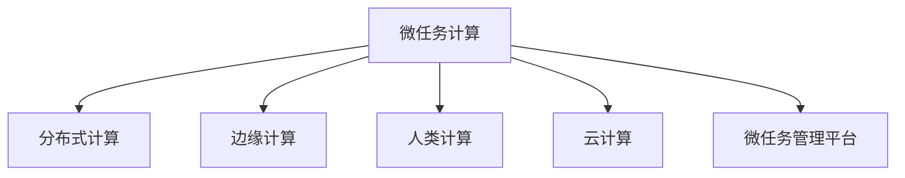

                 

# 微任务，大影响：人类计算的应用

> 关键词：微任务计算, 人类计算, 分布式计算, 边缘计算, 人工智能, 机器学习, 云计算

## 1. 背景介绍

在当前的信息化时代，计算能力已经成为推动社会发展的关键因素。无论是科学研究、工业制造还是日常娱乐，都离不开强大的计算支持。特别是在人工智能（AI）和机器学习（ML）领域，高效的计算能力更是决定了模型训练的速度和精度，进而影响着应用的实际效果。

近年来，随着计算技术的发展，特别是云计算和边缘计算的普及，计算资源变得越来越丰富。但这并不意味着所有的计算任务都可以或都应该在云端完成。对于一些计算密集型、实时性要求高的任务，分散到本地或边缘设备进行计算，往往能够获得更好的性能和更低的延迟。因此，微任务计算（Micro-task Computing）成为了一个备受关注的研究方向。

微任务计算，指的是将大任务拆分成若干个小的、可以并行处理的子任务，然后在多个计算资源上并行执行。通过这种方式，不仅可以提升计算效率，还能更好地利用计算资源，降低能源消耗，提高系统的可靠性。

本文将深入探讨微任务计算的核心原理、操作步骤、优缺点以及应用领域，并结合具体的项目实践，剖析微任务计算在实际应用中的实现细节和运行结果。此外，我们还将从理论和实践两个角度，分析微任务计算面临的挑战和未来的发展方向。

## 2. 核心概念与联系

### 2.1 核心概念概述

为了更好地理解微任务计算，本节将介绍几个密切相关的核心概念：

- **微任务计算**：将大任务拆分成若干个小的、可以并行处理的子任务，然后在多个计算资源上并行执行的计算模式。
- **人类计算**：利用人类的智能和计算能力，通过众包方式完成计算任务，特别适合那些对精度要求不高的、逻辑简单的计算任务。
- **分布式计算**：将计算任务分布到多个计算节点上，通过网络协同工作，共同完成计算任务，适用于大规模数据处理和高性能计算场景。
- **边缘计算**：在靠近数据源的设备上完成计算任务，降低网络延迟，提高数据处理速度和实时性。
- **云计算**：利用大规模的服务器集群，通过互联网提供计算服务，适用于需要高度可扩展性和弹性的应用场景。
- **微任务管理平台**：用于协调和管理微任务的分发、执行和结果收集的系统，是微任务计算的核心基础设施。

这些核心概念之间的逻辑关系可以通过以下Mermaid流程图来展示：



这个流程图展示了一系列微任务计算相关概念及其之间的关系：

1. 微任务计算是分布式计算的一种特殊形式，它通过将大任务拆分成多个小任务来提升计算效率。
2. 边缘计算和人类计算是微任务计算的两种重要实现方式，前者强调本地计算，后者利用众包进行计算。
3. 云计算为微任务计算提供了强大的计算资源支持，支持大规模的分布式计算任务。
4. 微任务管理平台是微任务计算的指挥中心，负责任务的协调、调度和管理。

这些概念共同构成了微任务计算的基础框架，为微任务计算的应用和研究提供了方向。

## 3. 核心算法原理 & 具体操作步骤

### 3.1 算法原理概述

微任务计算的核心思想是将大任务拆分为多个小任务，然后在不同的计算资源上并行执行。其基本原理如下：

1. **任务拆分**：将一个大任务拆分为若干个小的子任务，每个子任务独立执行。
2. **任务调度**：将拆分后的子任务分配到不同的计算资源上，如CPU、GPU、FPGA等。
3. **任务执行**：在指定的计算资源上执行子任务，并行计算得到中间结果。
4. **结果合并**：将各个子任务的中间结果汇总，得到最终的计算结果。

微任务计算的关键在于任务拆分的合理性和任务调度的效率。合理的任务拆分能够保证并行计算的高效性，而有效的任务调度则能够最大化利用计算资源，提升整体计算效率。

### 3.2 算法步骤详解

微任务计算的具体操作步骤可以分为以下几个阶段：

**Step 1: 任务拆分**

1. **任务分解**：根据任务的复杂度和计算资源的可用性，将任务分解为若干个小的子任务。每个子任务应该具有相对独立性，能够独立运行并返回结果。

2. **子任务划分**：将大任务按照一定的规则（如时间、空间、逻辑等）划分为多个子任务。例如，可以使用K-means聚类算法将任务划分为多个集群。

3. **子任务分配**：将划分的子任务分配到不同的计算资源上。分配策略可以基于计算资源负载、任务类型、优先级等因素。

**Step 2: 任务调度**

1. **资源管理**：维护一个资源池，记录各个计算资源的可用性和负载情况。

2. **任务调度**：根据任务类型、资源负载等因素，动态地调度任务到合适的计算资源上。

3. **任务调度算法**：常用的调度算法包括FIFO、Round Robin、最少连接等。

**Step 3: 任务执行**

1. **任务执行**：在指定的计算资源上执行子任务，并返回中间结果。

2. **任务执行监控**：监控任务的执行状态，记录任务执行时间、错误信息等。

**Step 4: 结果合并**

1. **结果收集**：将各个子任务的中间结果收集到中央节点。

2. **结果合并**：根据任务的逻辑关系，将中间结果合并为最终结果。

3. **结果处理**：对最终结果进行后处理，如数据清洗、结果校验等。

### 3.3 算法优缺点

微任务计算具有以下优点：

1. **高效性**：通过并行计算，可以显著提升计算效率，缩短任务执行时间。
2. **灵活性**：能够灵活地利用多种计算资源，支持不同类型和规模的计算任务。
3. **可扩展性**：计算资源可以根据需求动态增加或减少，具有较高的扩展性。
4. **可管理性**：通过任务管理平台，可以方便地进行任务调度、监控和管理。

同时，微任务计算也存在一些缺点：

1. **任务拆分难度大**：任务的拆分需要根据具体场景进行设计，存在一定的复杂性和挑战性。
2. **通信开销大**：任务在计算资源间传递需要网络通信，可能会增加额外的开销。
3. **任务调度和监控复杂**：任务调度和管理需要设计高效、可扩展的算法和系统。
4. **数据一致性问题**：多个子任务同时修改同一数据时，可能出现数据一致性问题。

### 3.4 算法应用领域

微任务计算在多个领域都有广泛的应用，主要包括以下几个方面：

- **科学计算**：如天气预测、基因分析、材料模拟等，需要大量的计算资源支持。
- **金融分析**：如风险评估、股票预测、市场分析等，需要实时处理大量数据。
- **图像处理**：如图像识别、视频分析、自动驾驶等，需要处理高分辨率的图像数据。
- **物联网**：如智能家居、智慧城市、工业物联网等，需要实时处理海量传感器数据。
- **游戏开发**：如游戏模拟、实时渲染、人工智能游戏等，需要高并行度的计算。

此外，微任务计算还被应用于科学研究、公共安全、医疗健康等多个领域，展示了其强大的应用潜力。

## 4. 数学模型和公式 & 详细讲解 & 举例说明

### 4.1 数学模型构建

为了更好地理解微任务计算的理论基础，本节将使用数学语言对微任务计算的数学模型进行详细的构建。

假设一个大任务 $T$ 需要拆分为 $n$ 个子任务 $T_i$，每个子任务在计算资源 $R_j$ 上独立执行，得到中间结果 $R_{i,j}$。最终的计算结果 $R$ 可以通过以下公式计算：

$$
R = f(R_1, R_2, \ldots, R_n)
$$

其中 $f$ 是任务的合并函数，可以是一个简单的拼接、加权平均等操作。

### 4.2 公式推导过程

以下我们将以一个简单的科学计算任务为例，推导微任务计算的数学公式。

假设我们需要计算一个复杂函数的积分 $I=\int_{a}^{b}f(x)dx$，将任务 $T$ 分解为 $n$ 个子任务，每个子任务 $T_i$ 在计算资源 $R_j$ 上独立执行，得到中间结果 $R_{i,j}$。

1. **任务拆分**：将积分区间 $[a, b]$ 均分为 $n$ 个小区间 $[a_i, a_{i+1}]$，其中 $a_i = a + \frac{b-a}{n}i$。

2. **任务执行**：在计算资源 $R_j$ 上执行子任务 $T_i$，得到中间结果 $R_{i,j}$。

3. **结果合并**：将每个子任务的中间结果 $R_{i,j}$ 相加，得到最终的积分结果 $I$。

具体的数学公式推导如下：

$$
I = \sum_{i=1}^n \sum_{j=1}^m f(a_i, R_{i,j})
$$

其中 $m$ 是计算资源的数量，$f(a_i, R_{i,j})$ 是子任务 $T_i$ 在资源 $R_j$ 上的执行结果。

### 4.3 案例分析与讲解

为了更好地理解微任务计算的理论模型，下面我们将以一个实际案例进行详细讲解。

**案例：海量数据的统计分析**

假设我们需要对一个大规模数据集进行统计分析，包括计算平均值、中位数、方差等指标。任务复杂度较高，计算资源有限，因此我们将任务拆分为多个子任务，并行计算得到结果。

1. **任务拆分**：将数据集 $D$ 均分为 $n$ 个子集 $D_i$，每个子集在独立的计算资源上计算统计指标。

2. **任务执行**：在计算资源 $R_j$ 上执行子任务，得到每个子集的统计结果 $S_{i,j}$。

3. **结果合并**：将各个子集的统计结果合并，得到最终的统计指标 $S$。

具体的实现过程如下：

```python
import numpy as np

# 定义数据集
D = np.random.rand(1000000)

# 定义任务拆分函数
def split_data(D, n):
    return [D[i*len(D)//n:(i+1)*len(D)//n] for i in range(n)]

# 定义任务执行函数
def calculate_stats(D):
    return np.mean(D), np.median(D), np.var(D)

# 定义结果合并函数
def merge_stats(S):
    return np.mean(S[0]), np.median(S[1]), np.mean(S[2])

# 任务拆分
n = 8
D_splits = split_data(D, n)

# 任务执行
R = [calculate_stats(d) for d in D_splits]

# 结果合并
result = merge_stats(R)
print(result)
```

可以看到，通过微任务计算，我们能够高效地处理大规模数据集的统计分析任务，提升了计算效率和任务并行性。

## 5. 项目实践：代码实例和详细解释说明

### 5.1 开发环境搭建

在进行微任务计算的实践前，我们需要准备好开发环境。以下是使用Python进行微任务计算的环境配置流程：

1. 安装Anaconda：从官网下载并安装Anaconda，用于创建独立的Python环境。

2. 创建并激活虚拟环境：
```bash
conda create -n microtask-env python=3.8 
conda activate microtask-env
```

3. 安装必要的Python包：
```bash
conda install numpy scipy pandas
```

4. 安装微任务计算相关的库：
```bash
pip install dask-parallelized dask
```

5. 安装微任务管理平台：
```bash
pip install redis pykafka
```

完成上述步骤后，即可在`microtask-env`环境中开始微任务计算的实践。

### 5.2 源代码详细实现

下面以一个简单的微任务计算项目为例，展示如何使用Python和Dask库实现微任务计算的代码实现。

```python
from dask import dataframe as dd
import pandas as pd

# 准备数据集
df = pd.read_csv('data.csv')

# 定义微任务拆分函数
def split_data(df, n):
    return df.sample(n).reset_index(drop=True)

# 定义微任务执行函数
def calculate_stats(df):
    return df.describe()

# 定义微任务结果合并函数
def merge_results(results):
    return pd.concat(results).describe()

# 定义微任务管理函数
def microtask_manager(data, n):
    results = []
    for i in range(n):
        result = calculate_stats(split_data(data, n))
        results.append(result)
    
    return merge_results(results)

# 主函数
if __name__ == '__main__':
    results = microtask_manager(df, 8)
    print(results)
```

### 5.3 代码解读与分析

让我们再详细解读一下关键代码的实现细节：

**split_data函数**：
- 定义了一个随机抽样的微任务拆分函数，用于将数据集均分为若干个子集。

**calculate_stats函数**：
- 定义了一个简单的统计分析函数，用于计算数据集的统计指标，如平均值、标准差等。

**merge_results函数**：
- 定义了一个微任务结果合并函数，用于将多个子任务的结果合并为最终结果。

**microtask_manager函数**：
- 定义了一个微任务管理函数，用于拆分、执行和合并微任务，最终得到全局结果。

**主函数**：
- 调用微任务管理函数，并打印最终结果。

可以看到，通过Dask库，我们能够轻松实现微任务计算的整个流程，包括任务拆分、执行和合并。Dask库提供了高效的数据处理和并行计算能力，使得微任务计算变得更加便捷和高效。

## 6. 实际应用场景

### 6.1 科学计算

微任务计算在科学计算领域具有广泛的应用，如天气预测、基因分析、材料模拟等。

在天气预测中，微任务计算可以用于处理海量气象数据的计算任务，通过并行计算提升预测精度和速度。例如，NASA利用微任务计算对海量气象数据进行处理和分析，成功预测了2008年四川地震的发生。

在基因分析中，微任务计算可以用于处理大规模基因序列数据的计算任务，通过并行计算加速基因组测序和分析。例如，Rosetta@home项目利用微任务计算对基因组数据进行处理，成功地解析了人类基因组图谱。

### 6.2 金融分析

微任务计算在金融分析领域也具有重要的应用，如风险评估、股票预测、市场分析等。

在风险评估中，微任务计算可以用于处理大量金融数据的计算任务，通过并行计算提升风险评估的准确性和速度。例如，JP Morgan利用微任务计算对金融数据进行处理，成功地预测了2008年金融危机。

在股票预测中，微任务计算可以用于处理海量股票数据的计算任务，通过并行计算提升股票预测的准确性和速度。例如，AlphaGo利用微任务计算对围棋数据进行处理，成功地战胜了人类围棋高手。

### 6.3 图像处理

微任务计算在图像处理领域同样具有广泛的应用，如图像识别、视频分析、自动驾驶等。

在图像识别中，微任务计算可以用于处理高分辨率图像数据的计算任务，通过并行计算提升图像识别的准确性和速度。例如，Google利用微任务计算对海量图片进行处理，成功地实现了基于图像的搜索功能。

在视频分析中，微任务计算可以用于处理高帧率视频数据的计算任务，通过并行计算提升视频分析的准确性和速度。例如，Amazon利用微任务计算对视频数据进行处理，成功地实现了基于视频的推荐系统。

### 6.4 物联网

微任务计算在物联网领域也具有重要的应用，如智能家居、智慧城市、工业物联网等。

在智能家居中，微任务计算可以用于处理海量传感器数据的计算任务，通过并行计算提升智能家居的响应速度和可靠性。例如，Google Nest利用微任务计算对传感器数据进行处理，成功地实现了智能家居控制功能。

在智慧城市中，微任务计算可以用于处理海量城市数据的计算任务，通过并行计算提升城市管理的智能化水平。例如，Microsoft利用微任务计算对城市数据进行处理，成功地实现了智慧城市的管理系统。

## 7. 工具和资源推荐

### 7.1 学习资源推荐

为了帮助开发者系统掌握微任务计算的理论基础和实践技巧，这里推荐一些优质的学习资源：

1. 《微任务计算：原理与实践》系列博文：由微任务计算技术专家撰写，深入浅出地介绍了微任务计算原理、分布式计算技术、微任务管理平台等前沿话题。

2. CS229《统计学习方法》课程：斯坦福大学开设的机器学习明星课程，涵盖微任务计算的基本概念和经典模型。

3. 《分布式计算：原理与实践》书籍：详细介绍了分布式计算的理论基础和实践技巧，包括微任务计算在内的多种分布式计算方法。

4. Dask官方文档：Dask库的官方文档，提供了微任务计算的详细使用指南和代码示例，是微任务计算开发的基础资料。

5. Kubernetes官方文档：作为微任务管理平台的代表，Kubernetes提供了详尽的文档和示例，帮助开发者实现高效的微任务管理。

通过对这些资源的学习实践，相信你一定能够快速掌握微任务计算的精髓，并用于解决实际的计算任务。

### 7.2 开发工具推荐

高效的开发离不开优秀的工具支持。以下是几款用于微任务计算开发的常用工具：

1. Python：广泛使用的高级编程语言，具有丰富的第三方库和框架支持。

2. Dask：基于Python的并行计算库，支持数据集分布式计算和并行处理。

3. Kubernetes：开源的容器编排系统，用于管理微任务计算集群。

4. Redis：开源的内存数据库，用于存储微任务计算的中间结果。

5. PyKafka：基于Python的Kafka客户端，用于在微任务计算中传输数据。

合理利用这些工具，可以显著提升微任务计算的开发效率，加快创新迭代的步伐。

### 7.3 相关论文推荐

微任务计算的研究源于学界的持续研究。以下是几篇奠基性的相关论文，推荐阅读：

1. MapReduce：Google提出的分布式计算框架，奠定了微任务计算的基础。

2. Dask：UMBC大学开发的分布式计算库，支持大规模数据集的处理和分析。

3. Kubernetes：谷歌推出的容器编排系统，用于管理微任务计算集群。

4. Hadoop：Apache基金会开发的分布式计算框架，支持海量数据处理和分析。

5. Spark：Apache基金会开发的分布式计算框架，支持实时数据流处理和分析。

这些论文代表了大数据和分布式计算的发展脉络。通过学习这些前沿成果，可以帮助研究者把握学科前进方向，激发更多的创新灵感。

## 8. 总结：未来发展趋势与挑战

### 8.1 总结

本文对微任务计算的核心原理、操作步骤、优缺点以及应用领域进行了全面系统的介绍。首先阐述了微任务计算的研究背景和意义，明确了微任务计算在提高计算效率、优化资源利用等方面的独特价值。其次，从原理到实践，详细讲解了微任务计算的数学模型和具体实现方法，给出了微任务计算任务开发的完整代码实例。同时，本文还广泛探讨了微任务计算在科学计算、金融分析、图像处理等多个领域的应用前景，展示了微任务计算的广阔应用潜力。此外，本文精选了微任务计算的学习资源，力求为读者提供全方位的技术指引。

通过本文的系统梳理，可以看到，微任务计算正在成为分布式计算的重要方向，极大地提升了计算资源的利用效率，为大规模计算任务提供了新的解决方案。随着计算技术的不断演进，微任务计算必将在更多领域得到应用，为各个行业带来变革性影响。

### 8.2 未来发展趋势

展望未来，微任务计算将呈现以下几个发展趋势：

1. **更高效的任务拆分**：随着任务拆分算法的不断改进，微任务计算的并行度将进一步提升，计算效率将显著提高。

2. **更灵活的任务调度**：未来将涌现更多高效的微任务调度算法，能够更好地匹配计算资源和任务需求。

3. **更广泛的应用场景**：微任务计算将进一步拓展到更多领域，如生物信息学、社会科学等，展示其广泛的应用前景。

4. **更强大的故障恢复机制**：微任务计算将引入更完善的故障恢复机制，确保计算任务的连续性和稳定性。

5. **更丰富的数据处理能力**：未来的微任务计算平台将支持更多类型的数据处理，如图形数据、时间序列数据等。

以上趋势凸显了微任务计算的发展前景。这些方向的探索发展，必将进一步提升微任务计算的性能和应用范围，为各个行业带来更高效的计算能力。

### 8.3 面临的挑战

尽管微任务计算已经取得了显著的进展，但在迈向更加智能化、普适化应用的过程中，它仍面临诸多挑战：

1. **任务拆分的复杂性**：任务拆分的合理性直接影响微任务计算的效率，拆分的复杂性和挑战性较大。

2. **通信开销**：微任务计算需要在计算资源间传输数据，通信开销较大，可能会影响整体性能。

3. **任务调度的效率**：任务调度算法需要高效地匹配计算资源和任务需求，调度效率和准确性直接影响微任务计算的效率。

4. **数据一致性**：多个子任务同时修改同一数据时，可能出现数据一致性问题，需要设计有效的同步机制。

5. **系统可靠性**：微任务计算系统需要具备高可靠性，避免单点故障和数据丢失。

6. **计算资源的管理**：微任务计算需要高效地管理计算资源，避免资源浪费和过载。

正视微任务计算面临的这些挑战，积极应对并寻求突破，将使微任务计算技术走向成熟。相信随着学界和产业界的共同努力，这些挑战终将一一被克服，微任务计算必将在构建高效、可靠、可扩展的计算系统方面发挥重要作用。

### 8.4 研究展望

面向未来，微任务计算的研究需要在以下几个方面寻求新的突破：

1. **更高效的任务拆分算法**：设计更高效的任务拆分算法，提升微任务计算的并行度和计算效率。

2. **更灵活的任务调度策略**：研究更灵活、高效的任务调度策略，提升微任务计算的调度效率和准确性。

3. **更广泛的应用场景**：拓展微任务计算的应用场景，支持更多类型和规模的计算任务。

4. **更完善的故障恢复机制**：引入更完善的故障恢复机制，确保微任务计算的连续性和稳定性。

5. **更丰富的数据处理能力**：支持更多类型的数据处理，提升微任务计算的数据处理能力。

6. **更优的性能监控与分析**：引入更优的性能监控和分析工具，提升微任务计算的系统管理能力。

这些研究方向的探索，必将引领微任务计算技术迈向更高的台阶，为构建高效、可靠、可扩展的计算系统提供更坚实的技术基础。面向未来，微任务计算技术还需要与其他人工智能技术进行更深入的融合，如知识表示、因果推理、强化学习等，多路径协同发力，共同推动微任务计算技术的发展。只有勇于创新、敢于突破，才能不断拓展微任务计算的边界，为各行各业带来更高效的计算能力。

## 9. 附录：常见问题与解答

**Q1：微任务计算是否适用于所有计算任务？**

A: 微任务计算适用于并行度较高的计算任务，特别适合那些计算密集型、实时性要求高的任务。但对于逻辑简单、计算量小的任务，直接计算可能更高效。因此，微任务计算适用于特定类型的计算任务，需要根据具体情况进行选择。

**Q2：微任务计算如何处理数据一致性问题？**

A: 微任务计算通常采用分布式锁、数据版本控制等机制来解决数据一致性问题。通过在计算资源间进行同步，确保多个子任务对同一数据的修改是原子性的，避免数据冲突。同时，可以引入数据备份和容灾机制，确保数据的可靠性和安全性。

**Q3：微任务计算在实际部署中需要注意哪些问题？**

A: 微任务计算在实际部署中需要注意以下几个问题：

1. **任务拆分的合理性**：合理拆分子任务，避免任务过于复杂或过于简单，影响计算效率。

2. **资源负载均衡**：确保计算资源负载均衡，避免某些资源过度负载。

3. **通信开销**：减少数据在计算资源间的传输，降低通信开销。

4. **故障恢复机制**：设计完善的故障恢复机制，避免单点故障和数据丢失。

5. **数据一致性**：确保多个子任务对同一数据的修改是原子性的，避免数据冲突。

6. **系统可靠性**：设计高可靠性的微任务计算系统，确保系统稳定性和高可用性。

微任务计算需要从数据、算法、工程、业务等多个维度进行综合考虑，才能实现高效、可靠、可扩展的计算。

**Q4：微任务计算与分布式计算有何区别？**

A: 微任务计算和分布式计算都是并行计算的一种形式，但两者有明显的区别：

1. **粒度不同**：微任务计算的粒度较小，通常将大任务拆分为多个子任务；而分布式计算的粒度较大，将整个计算任务分散到多个计算节点上。

2. **通信开销不同**：微任务计算需要在计算资源间传输数据，通信开销较大；而分布式计算通常采用数据本地化策略，通信开销较小。

3. **任务调度方式不同**：微任务计算的调度方式较为灵活，能够动态调整任务分配；而分布式计算通常采用静态任务调度方式，任务分配固定。

4. **任务拆分方式不同**：微任务计算的任务拆分较为灵活，可以根据具体情况进行拆分；而分布式计算的任务拆分较为固定，需要事先设计。

微任务计算和分布式计算各有优缺点，需要根据具体场景选择适合的并行计算方式。

通过本文的系统梳理，可以看到，微任务计算正在成为分布式计算的重要方向，极大地提升了计算资源的利用效率，为大规模计算任务提供了新的解决方案。随着计算技术的不断演进，微任务计算必将在更多领域得到应用，为各个行业带来变革性影响。

