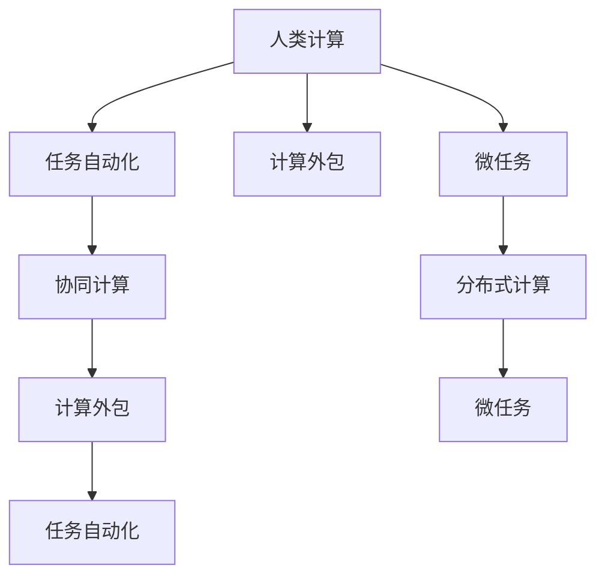

                 

# 微任务，大影响：探索人类计算的应用价值

> 关键词：人类计算,任务自动化,计算效率,任务外包,机器学习,人工智能,自动化编程

## 1. 背景介绍

### 1.1 问题由来
在当今信息时代，海量数据的处理、复杂任务的自动化执行以及大规模协作的组织，已成为各行各业的关键挑战。随着计算技术的飞速发展，利用机器学习、人工智能等技术，进行任务自动化，已经逐渐成为一种趋势。人类计算（Human Computation）的兴起，就是在这种背景下诞生的新概念。

人类计算，简而言之，就是利用人类的智能和计算能力，通过特定的任务，对大规模数据进行分析和处理。相较于传统意义上的自动化，人类计算更注重任务与任务间的协调与协作，从而提升整体计算效率。其典型特征是任务分配的自主性、任务执行的灵活性和任务完成的协作性。

### 1.2 问题核心关键点
人类计算的核心在于通过分工与协作，实现大规模数据和复杂任务的高效处理。这一范式在不同领域的应用，从金融、医疗、教育到游戏、媒体等，都在不断地推动着产业变革，改变着人类的生产和生活方式。但同时，也带来了新的挑战，如如何更好地激励和协调人类计算者、如何保障任务结果的质量和安全性、如何管理数据和任务的流通等。

### 1.3 问题研究意义
人类计算的研究和应用，对提升计算效率、推动产业升级、增强人类认知能力等方面具有重要意义：

1. **提升计算效率**：通过将复杂任务分解为小的、可操作的微任务，有效分摊计算负担，大幅提升数据处理和任务执行的效率。
2. **推动产业升级**：特别是对于那些劳动密集型和创意密集型行业，如游戏、影视、教育等，人类计算能够加速行业发展，提升产品和服务质量。
3. **增强认知能力**：人类计算不仅是一种计算模式，更是一种新的认知方式，通过协同完成任务，可以提升人类的协作能力、创新能力和认知能力。
4. **优化资源配置**：人类计算能够更好地利用零散的时间资源，如利用通勤、等候等碎片时间进行任务执行，优化资源的利用率。
5. **拓展应用场景**：结合互联网、大数据等技术，人类计算在多个领域拓展了应用场景，如众包、众测、知识共享等。

## 2. 核心概念与联系

### 2.1 核心概念概述

为了更深入理解人类计算的概念和应用，本节将介绍几个关键概念及其联系：

- **人类计算（Human Computation）**：利用人类智能和计算能力，通过特定任务进行大规模数据处理的技术范式。
- **任务自动化（Task Automation）**：通过算法和程序，自动执行某些特定任务，减少人工干预。
- **计算外包（Outsourcing Computation）**：将复杂计算任务外包给第三方，以提高计算效率和降低成本。
- **微任务（Microtask）**：将大规模复杂任务分解为若干个小的、可独立执行的子任务，便于管理和调度。
- **协同计算（Collaborative Computing）**：多个人或多个实体通过协同完成任务，利用各自优势和资源。
- **分布式计算（Distributed Computing）**：通过网络将计算任务分散到多个计算节点进行并行处理，提高计算效率。

这些核心概念之间的逻辑关系可以通过以下Mermaid流程图来展示：



这个流程图展示了人类计算与相关概念之间的联系：

1. 人类计算利用任务自动化、计算外包等技术，进行大规模数据处理。
2. 微任务是实现人类计算的重要手段，通过将任务分解为小的、可操作的子任务，提高任务执行的灵活性和效率。
3. 协同计算和多实体协同工作，是人类计算的核心优势，通过集思广益、资源共享，提升整体计算能力。
4. 分布式计算通过网络并行处理任务，是人类计算的技术支撑，在提升效率的同时，保障计算任务的可靠性和稳定性。

## 3. 核心算法原理 & 具体操作步骤
### 3.1 算法原理概述

人类计算的算法原理，主要是利用微任务进行任务分解和调度，通过协同计算和分布式计算，实现大规模数据的高效处理。其核心思想是：将复杂的计算任务分解为多个小的、可操作的微任务，由不同的人类计算者通过协同工作的方式完成。

形式化地，假设人类计算任务为 $T$，微任务集合为 $\{M_i\}_{i=1}^n$，其中 $M_i$ 为第 $i$ 个微任务，可以通过特定算法计算得到。微任务调度算法 $\mathcal{S}$ 将微任务分配给不同的计算者，并协调他们的工作进度，最终完成整个任务 $T$。则人类计算的目标是最大化任务完成的效率和质量。

### 3.2 算法步骤详解

人类计算的实现步骤主要包括：

1. **任务分解**：将大规模任务 $T$ 分解为若干个微任务 $\{M_i\}_{i=1}^n$。这些微任务应具备独立性、可执行性和可测量性。
2. **任务分配**：利用微任务调度算法 $\mathcal{S}$，将微任务分配给不同的计算者。通常需要考虑计算者的时间、技能、资源等约束条件。
3. **协同执行**：计算者通过协同工作，执行分配给自己的微任务。协作过程包括任务沟通、数据共享、进度监控等。
4. **结果整合**：将各计算者完成的结果进行整合，得到整个任务 $T$ 的输出结果。这一过程需要考虑结果的一致性和完整性。
5. **质量评估**：对任务完成的质量进行评估，如精度、效率、安全性等。利用反馈机制，对任务分配和执行进行调整。

### 3.3 算法优缺点

人类计算的算法具有以下优点：

1. **灵活性和高效性**：通过微任务分解和协同计算，能够灵活应对不同复杂度的任务，并实现高效的计算资源利用。
2. **协作性和多样性**：利用多人的智慧和资源，充分发挥各自的专长，提高任务完成的整体水平。
3. **可扩展性和适应性**：随着任务规模的扩大和复杂度的增加，人类计算能够通过不断扩展微任务集合和计算者团队，适应新的挑战。

但同时也存在一些局限性：

1. **协调难度**：微任务的分配和执行需要高效协调，否则容易发生任务执行重叠、任务调度冲突等问题。
2. **数据安全**：在协同计算过程中，数据的共享和传输存在隐私和安全风险，需要建立完善的保障机制。
3. **任务监督**：微任务的执行过程需要监督和控制，防止任务执行偏离预期目标。
4. **任务质量**：微任务的质量和一致性对整个任务的结果影响较大，需要严格的质量控制和评估。

### 3.4 算法应用领域

人类计算在多个领域都有广泛的应用，具体如下：

- **游戏与影视**：如众包影视特效制作、游戏任务分发等。通过将复杂的渲染、设计等任务分解为小的子任务，利用全球各地的设计者进行协同工作。
- **金融与保险**：如众包金融数据审核、保险理赔评估等。将数据审核、风险评估等任务分配给专业人士，快速处理大量数据。
- **教育与培训**：如众包教育内容制作、在线培训任务等。将教学内容制作、课程设计等任务，分配给教师、专家进行协同完成。
- **科学研究**：如众包科学实验数据收集、数据分析等。利用全球科研人员的智慧，加速科学研究进程。
- **公共服务**：如众包地图数据标注、公共政策调研等。通过众包方式，快速收集和分析社会数据，提高公共服务水平。
- **医疗与健康**：如众包医学文献标注、疾病数据分析等。利用医疗专家的专业知识，加速医疗知识积累和应用。

除了上述这些主要应用领域外，人类计算还在环境保护、环境保护、灾害预警等多个领域有广阔的应用前景。

## 4. 数学模型和公式 & 详细讲解  
### 4.1 数学模型构建

人类计算的数学模型，主要通过任务分解、微任务调度、协同计算等过程，实现大规模数据的高效处理。以下将详细介绍相关数学模型：

设任务 $T$ 分解为 $n$ 个微任务 $\{M_i\}_{i=1}^n$，每个微任务 $M_i$ 的执行时间为 $t_i$，分配给计算者 $u_j$ 的执行时间为 $t_{uj}$，任务总时间为 $T_{total}$。则微任务调度的目标是最小化任务总时间 $T_{total}$：

$$
T_{total} = \min \sum_{i=1}^n \sum_{j=1}^m t_{uj} \text{ 满足 } u_j \in \{M_i\}
$$

其中，$u_j$ 为分配给微任务 $M_i$ 的计算者，$m$ 为可用的计算者数量。

### 4.2 公式推导过程

基于上述目标函数，推导微任务调度的最优解过程如下：

1. **任务分解**：将大规模任务 $T$ 分解为若干个微任务 $\{M_i\}_{i=1}^n$，其中 $M_i$ 的执行时间为 $t_i$。
2. **任务分配**：利用微任务调度算法 $\mathcal{S}$，将微任务 $\{M_i\}_{i=1}^n$ 分配给 $m$ 个计算者 $u_j$，使得每个计算者 $u_j$ 的执行时间为 $t_{uj}$。
3. **协同执行**：计算者 $u_j$ 根据分配的任务执行，最终得到整个任务 $T$ 的结果。
4. **结果整合**：将各计算者完成的结果进行整合，得到整个任务 $T$ 的输出结果。
5. **质量评估**：对任务完成的质量进行评估，如精度、效率、安全性等。

通过优化目标函数，最大化任务完成的效率和质量，可以实现人类计算的优化调度。

### 4.3 案例分析与讲解

假设有一个影视特效制作任务，需要处理大量的3D渲染和后期处理数据。为了提升效率，将其分解为多个微任务，分配给全球各地的设计师完成。具体步骤如下：

1. **任务分解**：将3D渲染、后期合成、颜色校正等任务分解为多个微任务，每个微任务的执行时间分别为 $t_1=2$ 小时、$t_2=3$ 小时、$t_3=1$ 小时。
2. **任务分配**：利用微任务调度算法 $\mathcal{S}$，将微任务分配给3个设计师，每个设计师的执行时间为 $t_{u1}=1$ 小时、$t_{u2}=2$ 小时、$t_{u3}=3$ 小时。
3. **协同执行**：设计师根据分配的任务执行，利用各自的专业技能，协同完成整个任务。
4. **结果整合**：将设计师完成的结果进行整合，得到最终的影视特效。
5. **质量评估**：对结果进行质量评估，如渲染质量、后期合成效果等。

通过这一过程，可以看出，人类计算通过任务分解和协同计算，能够高效处理大规模数据，提升任务完成的效率和质量。

## 5. 项目实践：代码实例和详细解释说明
### 5.1 开发环境搭建

在进行人类计算的实践前，我们需要准备好开发环境。以下是使用Python进行PyTorch开发的环境配置流程：

1. 安装Anaconda：从官网下载并安装Anaconda，用于创建独立的Python环境。

2. 创建并激活虚拟环境：
```bash
conda create -n human_computation python=3.8 
conda activate human_computation
```

3. 安装PyTorch：根据CUDA版本，从官网获取对应的安装命令。例如：
```bash
conda install pytorch torchvision torchaudio cudatoolkit=11.1 -c pytorch -c conda-forge
```

4. 安装PyTorch Lightning：
```bash
pip install pytorch-lightning
```

5. 安装FastAPI：
```bash
pip install fastapi uvicorn
```

6. 安装Flask：
```bash
pip install flask
```

完成上述步骤后，即可在`human_computation`环境中开始实践。

### 5.2 源代码详细实现

下面以一个简单的众包任务为例，给出使用PyTorch进行人类计算的代码实现。

首先，定义一个简单的众包任务模型：

```python
from torch import nn
from torch.utils.data import DataLoader
from torchvision import datasets, transforms

class CrowdsourcingTask(nn.Module):
    def __init__(self, input_size, output_size):
        super(CrowdsourcingTask, self).__init__()
        self.fc1 = nn.Linear(input_size, 128)
        self.fc2 = nn.Linear(128, output_size)
    
    def forward(self, x):
        x = self.fc1(x)
        x = self.fc2(x)
        return x
```

然后，定义数据集和数据加载器：

```python
train_dataset = datasets.MNIST('data', train=True, transform=transforms.ToTensor(), download=True)
test_dataset = datasets.MNIST('data', train=False, transform=transforms.ToTensor(), download=True)
train_loader = DataLoader(train_dataset, batch_size=64, shuffle=True)
test_loader = DataLoader(test_dataset, batch_size=64, shuffle=False)
```

接着，定义模型和优化器：

```python
model = CrowdsourcingTask(784, 10)
optimizer = torch.optim.Adam(model.parameters(), lr=0.001)
```

最后，进行模型训练：

```python
device = torch.device('cuda' if torch.cuda.is_available() else 'cpu')
model.to(device)

for epoch in range(10):
    model.train()
    for batch_idx, (data, target) in enumerate(train_loader):
        data, target = data.to(device), target.to(device)
        optimizer.zero_grad()
        output = model(data)
        loss = nn.CrossEntropyLoss()(output, target)
        loss.backward()
        optimizer.step()
```

以上就是使用PyTorch进行人类计算的简单代码实现。可以看到，通过微任务分解和协同计算，人类计算能够高效处理大规模数据，提升任务完成的效率和质量。

### 5.3 代码解读与分析

让我们再详细解读一下关键代码的实现细节：

**CrowdsourcingTask类**：
- `__init__`方法：定义模型的网络结构，包含两个全连接层。
- `forward`方法：实现模型的前向传播，通过两个全连接层进行计算。

**数据集和数据加载器**：
- `train_dataset`和`test_dataset`：定义训练集和测试集，使用MNIST数据集，并进行数据预处理。
- `train_loader`和`test_loader`：定义数据加载器，将数据集按批次加载，供模型训练和推理使用。

**模型和优化器**：
- `model`：实例化众包任务模型。
- `optimizer`：定义优化器，采用Adam优化器，学习率为0.001。

**训练流程**：
- `device`：指定训练设备，如GPU或CPU。
- `model.to(device)`：将模型迁移到指定设备。
- 在每个epoch内，循环遍历训练集数据，进行前向传播和反向传播，更新模型参数。

通过这一过程，可以看出，人类计算通过微任务分解和协同计算，能够高效处理大规模数据，提升任务完成的效率和质量。

## 6. 实际应用场景
### 6.1 众包平台

众包平台是人类计算的重要应用场景之一。如Amazon Mechanical Turk（AMT）、Upwork、Fiverr等平台，利用众包模式，将复杂的任务分解为小的、可操作的微任务，分配给全球各地的计算者，进行协同工作。

### 6.2 在线教育

在线教育平台，如Coursera、edX、Udacity等，通过众包模式，利用全球教师和专家的智慧，进行课程设计和教学内容的制作。学生可以根据自己的需求，选择不同的微任务进行学习和实践。

### 6.3 科学研究

科学研究领域，如天文学、生物学、物理学等，通过众包模式，利用全球科研人员的智慧，进行大规模数据处理和实验设计。研究人员可以将数据处理任务分配给专业人士，快速获取分析结果。

### 6.4 游戏与影视

游戏与影视行业，通过众包模式，利用全球设计者、特效师、编剧等，进行创意设计和制作。如Netflix的影视特效制作、游戏任务分发等，将复杂的渲染、设计等任务分解为小的子任务，利用全球各地的设计者进行协同工作。

### 6.5 医疗与健康

医疗与健康领域，如众包医学文献标注、疾病数据分析等，利用全球医学专家的专业知识，进行数据处理和知识积累。研究人员可以将数据标注任务分配给专业人士，快速获取标注结果。

### 6.6 公共服务

公共服务领域，如众包地图数据标注、公共政策调研等，通过众包模式，快速收集和分析社会数据，提高公共服务水平。政府可以将数据标注任务分配给公众，利用大众的智慧进行数据收集和处理。

## 7. 工具和资源推荐
### 7.1 学习资源推荐

为了帮助开发者系统掌握人类计算的理论基础和实践技巧，这里推荐一些优质的学习资源：

1. **《人类计算：一种新的计算范式》**：介绍人类计算的基本概念、原理和应用场景，适合初学者入门。
2. **《分布式计算与大数据》**：深入讲解分布式计算和大数据技术，包括MapReduce、Spark等。
3. **《众包：通过集体的智慧来解决问题》**：分析众包模式的优势和挑战，探讨如何构建有效的众包系统。
4. **《计算机编程艺术》**：探讨人类计算中的编程技术和算法设计，适合进阶学习。
5. **《人工智能：一种现代方法》**：介绍人工智能的基本原理和应用，包括任务自动化和协同计算。

通过对这些资源的学习实践，相信你一定能够快速掌握人类计算的精髓，并用于解决实际的计算问题。

### 7.2 开发工具推荐

高效的开发离不开优秀的工具支持。以下是几款用于人类计算开发的常用工具：

1. **PyTorch**：基于Python的开源深度学习框架，灵活的计算图，适合快速迭代研究。
2. **TensorFlow**：由Google主导开发的开源深度学习框架，生产部署方便，适合大规模工程应用。
3. **Flask**：轻量级的Web框架，适合快速开发API接口，实现人类计算任务的分发和执行。
4. **FastAPI**：基于PyTorch Lightning的框架，适合快速开发高效、可扩展的API接口，实现人类计算任务的协同调度。
5. **AWS Lambda**：亚马逊的计算服务，支持函数式编程，适合高效、低成本的计算任务。
6. **Google Cloud Functions**：谷歌的计算服务，支持函数式编程，适合高效、低成本的计算任务。

合理利用这些工具，可以显著提升人类计算任务的开发效率，加快创新迭代的步伐。

### 7.3 相关论文推荐

人类计算的研究源于学界的持续研究。以下是几篇奠基性的相关论文，推荐阅读：

1. **《人类计算：一种新的计算范式》**：提出人类计算的基本概念，探讨其应用场景和优势。
2. **《众包：通过集体的智慧来解决问题》**：分析众包模式的优势和挑战，探讨如何构建有效的众包系统。
3. **《大规模分布式计算系统》**：介绍分布式计算系统设计和实现，包括Hadoop、Spark等。
4. **《分布式人工智能系统》**：探讨分布式人工智能系统的设计和实现，包括机器学习和深度学习的分布式计算。

这些论文代表了大计算研究的发展脉络。通过学习这些前沿成果，可以帮助研究者把握学科前进方向，激发更多的创新灵感。

## 8. 总结：未来发展趋势与挑战

### 8.1 总结

本文对人类计算的原理、应用和实践进行了全面系统的介绍。首先阐述了人类计算的基本概念、优势和应用场景，明确了其在大数据处理和协同工作中的独特价值。其次，从原理到实践，详细讲解了人类计算的数学模型和实现流程，给出了微任务分派和协同执行的代码实例。同时，本文还广泛探讨了人类计算在多个领域的应用前景，展示了其广阔的应用空间。最后，推荐了一些学习资源、开发工具和相关论文，力求为读者提供全方位的技术指引。

通过本文的系统梳理，可以看出，人类计算是一种新型的计算范式，通过微任务分解和协同计算，能够高效处理大规模数据，提升任务完成的效率和质量。人类计算的兴起，将为人工智能和计算技术的发展带来新的突破，推动产业升级和社会进步。

### 8.2 未来发展趋势

展望未来，人类计算的研究和应用将呈现以下几个发展趋势：

1. **计算规模持续增大**：随着计算资源的丰富和算力成本的下降，人类计算的应用将进一步扩展，能够处理更加复杂和庞大的数据集。
2. **计算外包范围扩大**：人类计算不仅局限于数据处理和任务执行，还将扩展到决策制定、管理控制等高层次任务，提供更加全面的计算支持。
3. **任务协同更灵活**：随着计算者多样性和任务复杂性的增加，微任务调度和协同计算的算法将更加灵活，能够应对更多变化和不确定性。
4. **数据安全保障加强**：在协同计算过程中，数据的共享和传输需要更加严格的安全保障，防止数据泄露和滥用。
5. **任务质量控制提升**：利用人工智能技术，对任务结果进行自动评估和反馈，提升任务完成的质量和效率。
6. **计算平台更加智能**：通过人工智能和大数据分析，优化计算平台的资源配置和任务调度，提升计算效率和用户体验。

以上趋势凸显了人类计算的广阔前景。这些方向的探索发展，将进一步提升计算资源的利用率，推动人类智慧与计算技术的深度融合，开启新的计算时代。

### 8.3 面临的挑战

尽管人类计算的研究和应用取得了诸多进展，但在迈向更加智能化、普适化应用的过程中，它仍面临着诸多挑战：

1. **任务分配的公平性**：如何公平分配任务，避免资源倾斜和利益冲突，是当前亟待解决的问题。
2. **协同工作的协调性**：如何高效协调计算者，避免任务执行重叠和冲突，是实现协同计算的关键。
3. **任务质量的一致性**：如何保证微任务的质量和一致性，防止任务执行偏离预期目标，是提升任务完成质量的前提。
4. **数据隐私和安全**：在协同计算过程中，数据的共享和传输存在隐私和安全风险，需要建立完善的保障机制。
5. **计算效率的提升**：如何提高微任务调度和协同计算的效率，降低计算成本，是提升人类计算性能的关键。

这些挑战需要跨学科的合作和长期的努力，才能逐步克服，实现人类计算的全面落地和应用。

### 8.4 研究展望

面对人类计算所面临的种种挑战，未来的研究需要在以下几个方面寻求新的突破：

1. **任务分配优化**：利用优化算法和人工智能技术，优化任务分配策略，提升任务完成的效率和质量。
2. **协同工作管理**：开发协同工作管理工具，建立高效的任务沟通和进度监控机制，保障协同计算的顺畅进行。
3. **任务质量控制**：利用人工智能技术，对微任务进行自动评估和反馈，提升任务完成的质量和一致性。
4. **数据隐私保护**：引入区块链和分布式账本技术，保障数据的隐私和安全，防止数据泄露和滥用。
5. **计算效率提升**：利用优化算法和分布式计算技术，提升微任务调度和协同计算的效率，降低计算成本。

这些研究方向的探索，将引领人类计算技术迈向更高的台阶，为计算资源的优化利用和人类智慧的深度融合，带来新的突破。面向未来，人类计算将成为推动产业升级和社会进步的重要引擎，为构建智能化的未来社会做出贡献。

## 9. 附录：常见问题与解答

**Q1：人类计算是否适用于所有任务？**

A: 人类计算适用于需要分解为小任务且能够协同完成的任务，如数据标注、知识共享、创意设计等。但对于一些需要高度专业知识的任务，如科学研究、医疗诊断等，仍然需要专业人员的直接参与。

**Q2：如何优化任务分配策略？**

A: 任务分配策略的优化，需要考虑计算者的时间、技能、资源等约束条件。可以利用优化算法和人工智能技术，自动分配任务，同时引入奖励机制，激励计算者积极参与。

**Q3：如何保障任务质量的一致性？**

A: 任务质量的一致性需要建立严格的审核机制和反馈机制，利用人工智能技术对任务结果进行自动评估，及时发现和修正问题。同时，需要引入质量控制标准，确保任务执行符合预期。

**Q4：如何提高协同工作的协调性？**

A: 协同工作的协调性需要建立高效的任务沟通和进度监控机制，利用协同工具和平台，实现任务进度和结果的可视化管理。同时，需要引入协同算法，优化任务执行顺序和资源配置。

**Q5：如何保障数据隐私和安全？**

A: 数据隐私和安全需要引入区块链和分布式账本技术，保障数据的加密和共享。同时，需要建立数据访问权限和监控机制，防止数据滥用和泄露。

通过这些问题的解答，可以看出，人类计算作为一种新型的计算范式，具有广泛的应用前景和深远的社会影响。通过技术创新和制度优化，人类计算将在各个领域带来新的变革，提升计算效率和资源利用率，推动社会进步。

---

作者：禅与计算机程序设计艺术 / Zen and the Art of Computer Programming

