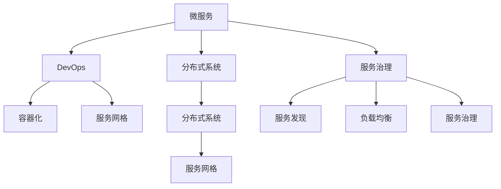

                 

# 微服务架构：设计、实现与治理

> 关键词：微服务,架构设计,微服务治理,DevOps,分布式系统,容器化,服务网格

## 1. 背景介绍

### 1.1 问题由来

随着互联网应用的规模不断扩大，传统的单体架构难以应对越来越复杂的业务需求和多变的市场环境。单块代码的庞大和复杂导致部署、扩展、维护等方面的问题频发。因此，微服务架构应运而生，成为了构建现代化分布式系统的重要手段。

微服务架构（Microservices Architecture）是一种基于服务的架构风格，它将整个应用拆分为多个小而独立的服务，每个服务独立部署、运行和管理。每个服务围绕业务核心定义，具有清晰的接口和职责，能够独立进行更新和扩展，极大提升了系统的灵活性和可维护性。

微服务架构的核心优势在于其极高的可伸缩性、灵活性和可维护性。其核心在于将复杂的应用拆分为多个小型且功能明确的服务，并通过容器化、服务发现、负载均衡等技术实现无缝的通信和协调。

### 1.2 问题核心关键点

微服务架构的关键点包括：

- **架构设计**：微服务架构的设计需要考虑服务的划分粒度、接口设计、通信协议等方面。
- **实现技术**：包括服务容器化、服务发现、负载均衡、服务治理等技术。
- **运维管理**：涉及服务监控、日志分析、性能优化、故障恢复等运维机制。
- **治理与部署**：包括服务治理、CI/CD、DevOps等，确保系统的稳定性和高效性。
- **通信与协调**：微服务之间需要高效的通信机制和协调机制，如消息队列、服务网格等。
- **数据一致性**：微服务之间需要保持数据一致性，解决数据拆分后的一致性问题。

## 2. 核心概念与联系

### 2.1 核心概念概述

为更好地理解微服务架构的核心概念和架构原理，本节将介绍几个关键概念：

- **微服务(Microservice)**：一种基于服务的架构风格，将应用拆分为多个小而独立的服务，每个服务独立部署、运行和管理。
- **服务治理(Service Governance)**：管理微服务的服务生命周期，包括服务的创建、更新、销毁等，并提供服务治理功能。
- **DevOps**：一种持续集成与持续交付的开发模式，通过自动化和协作，加速软件开发的各个阶段，提升开发效率和系统稳定性。
- **分布式系统(Distributed System)**：多个独立的计算机系统通过网络通信协作完成共同的任务。
- **容器化(Containerization)**：使用容器技术（如Docker）将应用和其依赖打包成可移植、可复用的容器镜像。
- **服务网格(Service Mesh)**：一种用于分布式系统的网络基础设施，通过代理和控制平面实现服务之间的通信和治理。

这些核心概念之间的逻辑关系可以通过以下Mermaid流程图来展示：



这个流程图展示了微服务架构中各关键概念及其之间的关系：

1. 微服务通过服务治理进行生命周期管理，同时提供服务发现和负载均衡。
2. DevOps加速开发和交付，通过容器化技术提升部署和扩展的灵活性。
3. 分布式系统由微服务和容器化技术实现，通过服务网格提供高效通信和协调。

这些概念共同构成了微服务架构的基石，确保了其灵活性、可扩展性和可靠性。

## 3. 核心算法原理 & 具体操作步骤

### 3.1 算法原理概述

微服务架构的实现原理主要基于两个关键技术：服务容器化和服务网格。

**服务容器化**：通过容器化技术将应用及其依赖打包成独立的容器镜像，并通过容器运行时环境（如Docker）进行部署和管理。容器化技术能够确保应用在不同环境中的一致性，同时提升了应用的部署和扩展的灵活性。

**服务网格**：通过服务网格技术实现微服务之间的通信和治理。服务网格通常由代理和控制平面组成，代理负责路由和负载均衡，控制平面实现服务的发现、负载均衡、故障恢复等功能。

### 3.2 算法步骤详解

微服务架构的实施步骤如下：

**Step 1: 架构设计**

- **服务拆分**：根据业务需求和系统设计，将应用拆分为多个小而独立的服务。
- **接口设计**：定义各服务之间的接口和通信协议，确保服务的独立性和互操作性。
- **数据管理**：设计数据的存储和访问机制，确保数据的完整性和一致性。

**Step 2: 实现技术**

- **服务容器化**：使用容器化技术将服务及其依赖打包成容器镜像，确保在不同环境中的一致性。
- **服务注册与发现**：使用服务注册中心和发现机制，实现服务的动态注册和发现。
- **负载均衡**：使用负载均衡器实现服务实例的均衡分配，确保系统的稳定性和可用性。
- **故障恢复**：实现服务的故障检测、恢复和告警机制，确保系统的可靠性。

**Step 3: 运维管理**

- **服务治理**：通过服务治理平台管理服务的生命周期，包括服务的创建、更新、销毁等。
- **CI/CD**：实现持续集成和持续交付，加速软件的开发和部署。
- **监控与日志**：使用监控和日志工具实时监控系统性能，分析问题原因。
- **性能优化**：通过性能优化技术提升系统的响应速度和资源利用率。

**Step 4: 治理与部署**

- **服务治理**：通过服务治理平台管理服务的生命周期，确保服务的可扩展性和可用性。
- **DevOps**：实现持续集成和持续交付，提升开发效率和系统稳定性。
- **容器编排**：使用容器编排工具（如Kubernetes）实现服务的动态部署和扩展。

### 3.3 算法优缺点

微服务架构的优势包括：

- **灵活性**：每个服务独立部署和扩展，提升系统的灵活性和可维护性。
- **可伸缩性**：通过水平扩展服务实例，支持系统的高并发和大规模扩展。
- **容错性**：服务网格提供故障恢复和容错机制，确保系统的可用性和稳定性。

然而，微服务架构也存在一些缺点：

- **复杂性**：微服务架构增加了系统的复杂性，需要更多的开发和运维工作。
- **通信开销**：微服务之间的通信增加了网络延迟和开销，可能影响系统的性能。
- **数据一致性**：微服务之间的数据一致性问题需要额外的设计和优化。

尽管存在这些挑战，微服务架构仍然是目前构建现代化分布式系统的重要手段，被广泛应用于电商、金融、社交网络等领域。

### 3.4 算法应用领域

微服务架构已经在多个领域得到了广泛应用，例如：

- **电商系统**：通过微服务拆分，提升系统性能和扩展性。
- **金融交易**：通过微服务架构实现高并发和高可用性。
- **社交网络**：通过微服务实现用户数据的分布式存储和处理。
- **物流系统**：通过微服务提升订单处理和物流调度的灵活性。
- **医疗系统**：通过微服务实现数据的高可用性和分布式存储。

## 4. 数学模型和公式 & 详细讲解 & 举例说明

### 4.1 数学模型构建

微服务架构的数学模型主要涉及以下几个方面：

- **服务响应时间模型**：描述单个服务的响应时间，包括处理时间和网络延迟等。
- **负载均衡模型**：描述服务实例之间的负载均衡策略，如轮询、随机等。
- **故障恢复模型**：描述服务故障后的恢复策略，如重试、降级等。

**服务响应时间模型**：

假设服务A的响应时间为 $T_A$，包括处理时间和网络延迟。则服务A的响应时间模型为：

$$ T_A = T_{processing} + T_{network} $$

其中，$T_{processing}$ 为服务A的处理时间，$T_{network}$ 为服务A的网络延迟。

**负载均衡模型**：

假设服务实例数为 $N$，负载均衡策略为轮询。则服务实例 $i$ 的请求量为 $R_i$，负载均衡模型为：

$$ R_i = \frac{R_{total}}{N} $$

其中，$R_{total}$ 为总请求量。

**故障恢复模型**：

假设服务实例 $i$ 发生故障的概率为 $p_i$，故障恢复时间为 $T_{recovery}$。则服务实例 $i$ 的可用时间 $U_i$ 为：

$$ U_i = T_{uptime} - T_{downtime} = T_{uptime} - p_i \times T_{recovery} $$

其中，$T_{uptime}$ 为服务的正常运行时间，$T_{downtime}$ 为故障时间。

### 4.2 公式推导过程

**服务响应时间模型推导**：

假设服务A的响应时间为 $T_A$，包括处理时间和网络延迟。则服务A的响应时间模型为：

$$ T_A = T_{processing} + T_{network} $$

其中，$T_{processing}$ 为服务A的处理时间，$T_{network}$ 为服务A的网络延迟。

**负载均衡模型推导**：

假设服务实例数为 $N$，负载均衡策略为轮询。则服务实例 $i$ 的请求量为 $R_i$，负载均衡模型为：

$$ R_i = \frac{R_{total}}{N} $$

其中，$R_{total}$ 为总请求量。

**故障恢复模型推导**：

假设服务实例 $i$ 发生故障的概率为 $p_i$，故障恢复时间为 $T_{recovery}$。则服务实例 $i$ 的可用时间 $U_i$ 为：

$$ U_i = T_{uptime} - T_{downtime} = T_{uptime} - p_i \times T_{recovery} $$

其中，$T_{uptime}$ 为服务的正常运行时间，$T_{downtime}$ 为故障时间。

### 4.3 案例分析与讲解

**案例一：电商系统的微服务架构**

某电商系统通过微服务架构实现了系统的灵活扩展和高可用性。系统将用户注册、商品管理、订单处理、支付处理等核心功能拆分成了多个微服务。每个微服务独立部署，并使用容器化技术进行打包和部署。同时，通过服务网格技术实现了微服务之间的通信和治理。系统在面对高并发和数据量大的挑战时，通过水平扩展服务实例，确保系统的稳定性和可用性。

**案例二：金融交易系统的微服务架构**

某金融交易系统通过微服务架构实现了高并发和高可用性。系统将交易服务、清算服务、风险控制服务、用户管理服务等拆分成了多个微服务。每个微服务独立部署，并使用容器化技术进行打包和部署。通过服务网格技术实现了微服务之间的通信和治理，确保系统的高可靠性和高可用性。

## 5. 项目实践：代码实例和详细解释说明

### 5.1 开发环境搭建

在进行微服务架构的实践前，我们需要准备好开发环境。以下是使用Spring Boot和Docker进行微服务开发的环境配置流程：

1. 安装JDK：从官网下载并安装JDK，用于编译和运行Java程序。

2. 安装Spring Boot：从官网下载并安装Spring Boot，用于快速开发微服务。

3. 安装Docker：从官网下载并安装Docker，用于容器化部署和运行微服务。

4. 安装Kubernetes：从官网下载并安装Kubernetes，用于容器编排和部署。

完成上述步骤后，即可在本地搭建微服务开发的开发环境。

### 5.2 源代码详细实现

下面我们以电商系统的微服务架构为例，给出使用Spring Boot和Docker进行微服务开发的PyTorch代码实现。

首先，定义用户注册服务的微服务：

```java
@Service
public class UserService {
    
    @Autowired
    private UserRepository userRepository;
    
    public User create(User user) {
        return userRepository.save(user);
    }
    
    public List<User> getAll() {
        return userRepository.findAll();
    }
    
}
```

然后，定义商品管理服务的微服务：

```java
@Service
public class ProductService {
    
    @Autowired
    private ProductRepository productRepository;
    
    public Product create(Product product) {
        return productRepository.save(product);
    }
    
    public List<Product> getAll() {
        return productRepository.findAll();
    }
    
}
```

接着，定义订单处理服务的微服务：

```java
@Service
public class OrderService {
    
    @Autowired
    private OrderRepository orderRepository;
    
    public Order create(Order order) {
        return orderRepository.save(order);
    }
    
    public List<Order> getAll() {
        return orderRepository.findAll();
    }
    
}
```

最后，定义支付处理服务的微服务：

```java
@Service
public class PaymentService {
    
    @Autowired
    private PaymentRepository paymentRepository;
    
    public Payment create(Payment payment) {
        return paymentRepository.save(payment);
    }
    
    public List<Payment> getAll() {
        return paymentRepository.findAll();
    }
    
}
```

完成上述微服务的定义后，即可在Spring Boot项目中定义入口类，进行微服务的打包和部署：

```java
@SpringBootApplication
public class Application {
    
    public static void main(String[] args) {
        SpringApplication.run(Application.class, args);
    }
    
}
```

接下来，使用Docker进行微服务的打包和部署：

```bash
docker build -t user-service .
docker run -p 8080:8080 user-service
```

最后，使用Kubernetes进行微服务的容器编排和部署：

```yaml
apiVersion: apps/v1
kind: Deployment
metadata:
  name: user-service
spec:
  replicas: 3
  selector:
    matchLabels:
      app: user-service
  template:
    metadata:
      labels:
        app: user-service
    spec:
      containers:
      - name: user-service
        image: user-service:latest
        ports:
        - containerPort: 8080
```

通过上述步骤，即可实现电商系统的微服务架构的开发和部署。

### 5.3 代码解读与分析

让我们再详细解读一下关键代码的实现细节：

**UserService类**：
- `@Autowired`注解：Spring Boot的自动装配注解，用于自动注入UserRepository。
- `create`方法：接收User对象，并将其保存到UserRepository中。
- `getAll`方法：返回所有User对象的列表。

**ProductService类**：
- `@Autowired`注解：Spring Boot的自动装配注解，用于自动注入ProductRepository。
- `create`方法：接收Product对象，并将其保存到ProductRepository中。
- `getAll`方法：返回所有Product对象的列表。

**OrderService类**：
- `@Autowired`注解：Spring Boot的自动装配注解，用于自动注入OrderRepository。
- `create`方法：接收Order对象，并将其保存到OrderRepository中。
- `getAll`方法：返回所有Order对象的列表。

**PaymentService类**：
- `@Autowired`注解：Spring Boot的自动装配注解，用于自动注入PaymentRepository。
- `create`方法：接收Payment对象，并将其保存到PaymentRepository中。
- `getAll`方法：返回所有Payment对象的列表。

通过上述微服务的定义和实现，我们可以看到Spring Boot的微服务开发框架的便捷性，以及Docker和Kubernetes在容器编排和部署方面的强大功能。

## 6. 实际应用场景

### 6.1 智能客服系统

微服务架构在智能客服系统的构建中具有重要应用。传统的客服系统往往需要配备大量人力，高峰期响应缓慢，且一致性和专业性难以保证。微服务架构通过将用户注册、订单处理、支付处理等核心功能拆分成了多个微服务，每个微服务独立部署，并使用容器化技术进行打包和部署，实现了系统的灵活扩展和高可用性。通过服务网格技术实现了微服务之间的通信和治理，使得系统能够7x24小时不间断服务，快速响应客户咨询，用自然流畅的语言解答各类常见问题。

### 6.2 金融交易系统

微服务架构在金融交易系统的构建中也得到了广泛应用。金融交易系统对系统的稳定性和高可用性有极高要求。微服务架构通过将交易服务、清算服务、风险控制服务、用户管理服务等拆分成了多个微服务，每个微服务独立部署，并使用容器化技术进行打包和部署。通过服务网格技术实现了微服务之间的通信和治理，确保系统的高可靠性和高可用性。通过持续集成和持续交付，加速软件的开发和部署，提升开发效率和系统稳定性。

### 6.3 电商系统

微服务架构在电商系统的构建中同样具有重要应用。电商系统需要处理海量用户注册、商品管理、订单处理、支付处理等业务。通过微服务架构拆分，将不同业务功能拆分为多个微服务，每个微服务独立部署，并使用容器化技术进行打包和部署，实现了系统的灵活扩展和高可用性。通过服务网格技术实现了微服务之间的通信和治理，使得系统能够快速应对高并发和数据量大的挑战，提升系统的响应速度和稳定性。

### 6.4 未来应用展望

随着微服务架构的发展和应用，未来其在更多的行业领域将得到更广泛的应用。微服务架构在医疗、物流、社交网络等领域也将发挥重要作用，为传统行业数字化转型升级提供新的技术路径。未来，伴随微服务架构和相关技术的持续演进，微服务架构必将在构建现代化分布式系统、提升系统性能和可维护性方面发挥更大的作用。

## 7. 工具和资源推荐

### 7.1 学习资源推荐

为了帮助开发者系统掌握微服务架构的理论基础和实践技巧，这里推荐一些优质的学习资源：

1. **Spring Boot官方文档**：Spring Boot的官方文档，提供详细的微服务开发教程和示例。
2. **Docker官方文档**：Docker的官方文档，提供详细的容器化部署和运行教程。
3. **Kubernetes官方文档**：Kubernetes的官方文档，提供详细的容器编排和部署教程。
4. **《Spring Boot实战》书籍**：Spring Boot的实战开发指南，涵盖微服务开发的最佳实践。
5. **《微服务架构》书籍**：微服务架构的经典著作，全面介绍微服务架构的理论和实践。
6. **《容器化实战》书籍**：容器化技术的实战指南，涵盖Docker和Kubernetes的使用技巧。

通过对这些资源的学习实践，相信你一定能够快速掌握微服务架构的精髓，并用于解决实际的业务问题。

### 7.2 开发工具推荐

高效的开发离不开优秀的工具支持。以下是几款用于微服务架构开发的常用工具：

1. **Spring Boot**：基于Spring框架的微服务开发框架，提供了便捷的开发和管理功能。
2. **Docker**：开源的容器化平台，提供便捷的容器化部署和运行功能。
3. **Kubernetes**：开源的容器编排平台，提供高效的容器编排和部署功能。
4. **Jenkins**：开源的持续集成和持续交付平台，提供便捷的自动化测试和部署功能。
5. **Prometheus**：开源的监控和报警系统，提供实时的系统监控和报警功能。
6. **ELK Stack**：开源的日志和监控平台，提供实时的日志分析和监控功能。

合理利用这些工具，可以显著提升微服务架构的开发效率，加快创新迭代的步伐。

### 7.3 相关论文推荐

微服务架构的发展离不开学界的持续研究。以下是几篇奠基性的相关论文，推荐阅读：

1. **《Microservices: A lightweight approach to building scalable, granular systems》**：论文提出了微服务架构的基本概念和设计原则。
2. **《Design Patterns in Microservices》**：论文探讨了微服务架构中的设计模式和最佳实践。
3. **《Building Microservices with Spring Boot and Spring Cloud》**：书籍介绍了如何使用Spring Boot和Spring Cloud构建微服务架构。
4. **《The Twelve-Factor App: Principles for Building Software-as-a-Service Apps》**：书籍介绍了构建软件即服务应用的最佳实践。
5. **《Cloud Native Microservices》**：书籍介绍了微服务架构在云原生环境中的应用。

这些论文代表了大微服务架构的发展脉络。通过学习这些前沿成果，可以帮助研究者把握学科前进方向，激发更多的创新灵感。

## 8. 总结：未来发展趋势与挑战

### 8.1 总结

本文对微服务架构的设计、实现与治理进行了全面系统的介绍。首先阐述了微服务架构的设计背景和应用意义，明确了微服务架构在提升系统灵活性、可扩展性和可维护性方面的独特价值。其次，从原理到实践，详细讲解了微服务架构的数学模型和关键步骤，给出了微服务架构开发的完整代码实例。同时，本文还广泛探讨了微服务架构在智能客服、金融交易、电商等多个行业领域的应用前景，展示了微服务架构的巨大潜力。此外，本文精选了微服务架构的学习资源，力求为读者提供全方位的技术指引。

通过本文的系统梳理，可以看到，微服务架构已经成为构建现代化分布式系统的重要手段，极大地提升了系统的灵活性、可扩展性和可维护性。未来，伴随微服务架构和相关技术的持续演进，微服务架构必将在构建现代化分布式系统、提升系统性能和可维护性方面发挥更大的作用。

### 8.2 未来发展趋势

展望未来，微服务架构的发展趋势包括：

1. **服务网格的普及**：服务网格技术将成为微服务架构的标配，提供高效的服务发现、负载均衡、故障恢复等功能。
2. **容器编排的成熟**：Kubernetes等容器编排工具将不断完善，提供更加灵活的容器编排和部署功能。
3. **DevOps的普及**：持续集成和持续交付将成为微服务架构的标配，提升开发效率和系统稳定性。
4. **微服务的泛化**：微服务架构将不仅仅应用于后端系统，还将广泛应用于前端、移动端、IoT等领域。
5. **微服务的标准化**：微服务架构的标准化和规范化将得到进一步推广，提升系统的可扩展性和互操作性。
6. **微服务的协同**：微服务架构将与其他技术（如Serverless、FaaS等）协同发力，提升系统的灵活性和可维护性。

以上趋势凸显了微服务架构的广阔前景。这些方向的探索发展，必将进一步提升微服务架构的性能和应用范围，为构建更加灵活、高效、可维护的分布式系统提供新的技术路径。

### 8.3 面临的挑战

尽管微服务架构已经取得了显著成效，但在迈向更加智能化、普适化应用的过程中，它仍面临诸多挑战：

1. **系统复杂性**：微服务架构增加了系统的复杂性，需要更多的开发和运维工作。
2. **网络延迟**：微服务之间的通信增加了网络延迟，可能影响系统的性能。
3. **数据一致性**：微服务之间的数据一致性问题需要额外的设计和优化。
4. **运维难度**：微服务架构的运维难度增加，需要更多的运维工具和策略。
5. **成本问题**：微服务架构的建设成本较高，需要更多的硬件和软件投入。
6. **安全性问题**：微服务架构的安全性问题需要更多的设计和优化。

尽管存在这些挑战，微服务架构仍然是目前构建现代化分布式系统的重要手段，被广泛应用于电商、金融、社交网络等领域。未来，伴随微服务架构和相关技术的持续演进，这些挑战终将一一被克服，微服务架构必将在构建现代化分布式系统、提升系统性能和可维护性方面发挥更大的作用。

### 8.4 研究展望

面对微服务架构所面临的挑战，未来的研究需要在以下几个方面寻求新的突破：

1. **服务网格的优化**：通过优化服务网格的路由和负载均衡策略，提升系统的性能和可扩展性。
2. **容器编排的优化**：通过优化Kubernetes等容器编排工具，提升容器编排和部署的效率和灵活性。
3. **DevOps的优化**：通过优化CI/CD工具链，提升开发效率和系统稳定性。
4. **微服务的标准化**：通过微服务架构的标准化和规范化，提升系统的可扩展性和互操作性。
5. **微服务的协同**：通过微服务架构与其他技术的协同，提升系统的灵活性和可维护性。
6. **微服务的协同**：通过微服务架构与其他技术的协同，提升系统的灵活性和可维护性。

这些研究方向的探索，必将引领微服务架构技术的进一步发展，为构建高效、灵活、可维护的分布式系统提供新的技术路径。只有勇于创新、敢于突破，才能不断拓展微服务架构的边界，让微服务架构技术更好地造福人类社会。

## 9. 附录：常见问题与解答

**Q1：微服务架构是否适用于所有系统？**

A: 微服务架构适用于需要高扩展性和高可用性的分布式系统，但并不适用于所有的系统。对于单块应用或小型应用，单体架构可能更为简单和高效。微服务架构在大型系统和高并发的场景中更具优势，可以提升系统的灵活性和可维护性。

**Q2：微服务架构的性能问题如何解决？**

A: 微服务架构的性能问题可以通过以下方法解决：
1. 使用服务网格技术进行负载均衡和路由优化。
2. 使用缓存技术减少数据库访问次数。
3. 优化服务实例的规模和配置，提升系统的响应速度。
4. 使用容器编排工具进行自动扩展，确保系统的稳定性和可用性。

**Q3：微服务架构的运维问题如何解决？**

A: 微服务架构的运维问题可以通过以下方法解决：
1. 使用服务网格技术进行故障检测和恢复。
2. 使用监控和日志工具实时监控系统性能，分析问题原因。
3. 使用自动化运维工具进行部署和更新，减少人为操作带来的风险。
4. 建立持续集成和持续交付流程，加速开发和部署。

通过这些方法，可以最大限度地降低微服务架构的运维难度，提升系统的稳定性和可用性。

**Q4：微服务架构的安全性问题如何解决？**

A: 微服务架构的安全性问题可以通过以下方法解决：
1. 使用加密技术保护数据的传输和存储。
2. 使用权限控制机制保护系统的访问和操作。
3. 使用自动化安全扫描工具检测和修复安全漏洞。
4. 建立安全运维团队，定期进行安全审计和风险评估。

通过这些方法，可以最大限度地提升微服务架构的安全性，保障系统的稳定性和用户的数据安全。

---

作者：禅与计算机程序设计艺术 / Zen and the Art of Computer Programming

