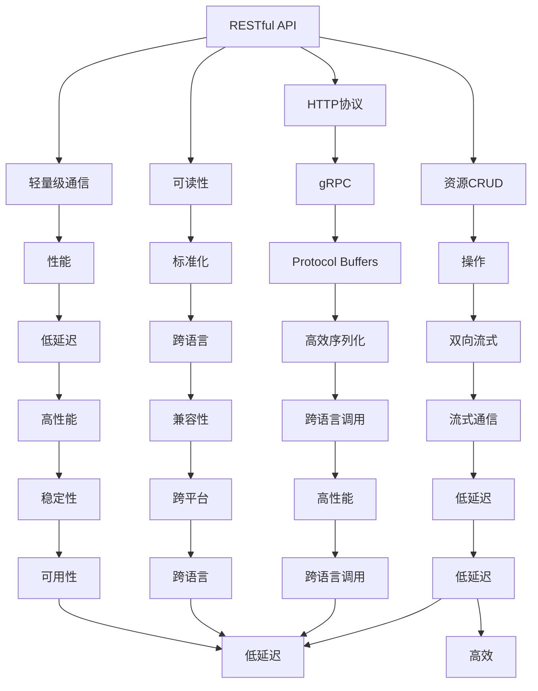

                 

# 微服务通信：gRPC与RESTful API

> 关键词：微服务, RESTful API, gRPC, 服务端通信, 分布式系统, 性能优化, 跨语言调用, 低延迟, 服务治理

## 1. 背景介绍

### 1.1 问题由来

随着微服务架构的普及，企业系统架构越来越多地被划分为细粒度的服务单元，每个服务独立部署、运行，并且与其他服务通过网络通信。然而，这种服务间通信的复杂性和异构性带来了诸多挑战，如何高效、稳定、安全地进行服务间通信成为了微服务架构中的重要问题。

### 1.2 问题核心关键点

微服务通信的核心问题可以总结为：

- 数据传输格式：如何选择轻量级、易解析的通信协议？
- 跨语言调用：如何在不同的编程语言之间进行无缝调用？
- 服务发现与注册：如何快速发现和注册服务？
- 服务治理：如何保障服务间通信的可用性、可靠性与性能？
- 数据传输安全：如何保障通信数据的机密性、完整性和不可抵赖性？

针对这些挑战，RESTful API和gRPC成为了目前最为流行的两种服务端通信协议。RESTful API是REST架构风格下的轻量级通信协议，具有良好的标准化和可读性。gRPC则是由Google开发的高性能、跨语言的通信协议，能够提供比RESTful API更高的通信效率和性能。

本文将深入分析RESTful API和gRPC的原理与特点，并对比它们的优缺点与应用场景，力求为微服务架构下的服务端通信提供指导。

## 2. 核心概念与联系

### 2.1 核心概念概述

为了更好地理解RESTful API和gRPC，我们先介绍几个核心概念：

- **RESTful API**：使用HTTP协议进行通信，采用REST架构风格，通过资源、动作（CRUD）进行操作的轻量级通信协议。
- **gRPC**：由Google开发的高性能、跨语言的通信协议，基于Protocol Buffers，提供双向流式通信、跨语言调用支持、自动序列化与反序列化等功能。
- **Protocol Buffers (PB)**：由Google开发的高效二进制序列化格式，支持多语言编码，常用于gRPC的序列化和反序列化。

这些概念之间的逻辑关系可以通过以下Mermaid流程图来展示：



这个流程图展示了两者的核心概念及其之间的关系：

- RESTful API通过HTTP协议进行通信，操作资源（CRUD），具有轻量级、可读性强的特点。
- gRPC基于Protocol Buffers，提供双向流式通信、跨语言调用支持，具有高效、高性能、跨语言的特点。

## 3. 核心算法原理 & 具体操作步骤
### 3.1 算法原理概述

RESTful API和gRPC的原理分别基于不同的设计理念和技术栈。RESTful API基于HTTP协议，采用REST架构风格，强调资源、动作的分离。gRPC则基于Protocol Buffers，提供高性能的序列化和反序列化，支持双向流式通信、跨语言调用。

**RESTful API**：
- 使用HTTP协议进行通信，操作资源（CRUD），支持多种HTTP方法（GET、POST、PUT、DELETE等）。
- 采用轻量级JSON/XML数据格式，易于解析和生成。
- 支持REST架构风格，遵循标准的资源命名规则和动作命名规则。

**gRPC**：
- 基于Protocol Buffers进行序列化和反序列化，提供高效的通信协议。
- 支持双向流式通信，提供高吞吐量和低延迟的通信体验。
- 提供跨语言调用支持，支持多种编程语言和操作系统。
- 提供自动序列化和反序列化，提高通信效率。

### 3.2 算法步骤详解

RESTful API和gRPC的操作流程基本相似，分为以下几个关键步骤：

**Step 1: 确定通信协议**
- RESTful API基于HTTP协议进行通信，使用标准化的JSON/XML数据格式。
- gRPC基于Protocol Buffers进行通信，提供高效的序列化和反序列化。

**Step 2: 设计资源和动作**
- RESTful API通过资源和动作进行通信，遵循标准的资源命名规则和动作命名规则。
- gRPC同样使用资源和动作进行通信，通过定义的Method和Service进行调用。

**Step 3: 实现服务接口**
- RESTful API通过HTTP请求和响应进行通信，实现服务接口需要编写HTTP请求和响应处理程序。
- gRPC通过定义的Service和Method进行通信，实现服务接口需要编写Protocol Buffers的Service和Method。

**Step 4: 实现客户端**
- RESTful API通过HTTP请求和响应进行通信，实现客户端需要编写HTTP客户端代码。
- gRPC通过Protocol Buffers进行通信，实现客户端需要编写Protocol Buffers的客户端代码。

**Step 5: 部署与测试**
- RESTful API和gRPC的服务端和客户端都可以在多种编程语言和操作系统上部署和运行。
- 在部署前需要进行测试，确保服务端和客户端能够正确通信。

### 3.3 算法优缺点

RESTful API和gRPC各有优缺点，具体如下：

**RESTful API的优缺点：**

- **优点**：
  - 使用标准化的HTTP协议和JSON/XML数据格式，具有良好的可读性和可扩展性。
  - 支持多种HTTP方法和资源命名规则，灵活性高。
  - 支持跨语言和跨平台，易于与其他系统集成。

- **缺点**：
  - 由于HTTP协议是文本协议，通信效率较低。
  - 数据传输格式较大，不适用于大数据传输。
  - 网络不稳定时，通信性能不稳定。

**gRPC的优缺点：**

- **优点**：
  - 基于Protocol Buffers进行序列化和反序列化，通信效率高。
  - 支持双向流式通信，提供高吞吐量和低延迟的通信体验。
  - 支持跨语言调用，方便在不同编程语言间进行通信。

- **缺点**：
  - 序列化和反序列化的复杂性较高，需要定义Protocol Buffers的Schema。
  - 不支持跨域通信，需要在服务端进行跨域处理。
  - 对网络要求较高，需要稳定的网络环境。

### 3.4 算法应用领域

RESTful API和gRPC在不同应用领域各有优势，具体如下：

**RESTful API的应用领域：**

- 轻量级Web应用：适合简单的Web应用，易于实现和维护。
- API接口服务：适合构建RESTful API接口，方便其他系统调用。
- 移动端应用：适合构建移动端应用，提供轻量级的Web接口。

**gRPC的应用领域：**

- 高性能后端服务：适合构建高性能的后端服务，提供高吞吐量和低延迟的通信体验。
- 大数据应用：适合大数据应用，提供高效的序列化和反序列化。
- 分布式系统：适合构建分布式系统，提供稳定、可靠的通信。

## 4. 数学模型和公式 & 详细讲解 & 举例说明

### 4.1 数学模型构建

**RESTful API**：
- 通信协议：HTTP协议。
- 数据格式：JSON/XML。

**gRPC**：
- 通信协议：Protocol Buffers。
- 数据格式：二进制序列化。

### 4.2 公式推导过程

**RESTful API的通信模型：**
- HTTP请求和响应：
$$
\begin{align*}
\text{HTTP请求} &= \text{请求方法} + \text{请求路径} + \text{请求参数} \\
\text{HTTP响应} &= \text{状态码} + \text{响应头部} + \text{响应内容}
\end{align*}
$$

**gRPC的通信模型：**
- Protocol Buffers序列化与反序列化：
$$
\begin{align*}
\text{序列化} &= \text{消息类型} + \text{消息字段} + \text{消息数据} \\
\text{反序列化} &= \text{消息类型} + \text{消息字段} + \text{消息数据}
\end{align*}
$$

### 4.3 案例分析与讲解

**RESTful API案例：**

假设有一个简单的Web应用，提供用户登录功能。RESTful API的实现如下：

- 服务端：
  - HTTP请求：`POST /login`
  - 请求参数：`username`、`password`
  - 响应内容：`{"status": "success", "message": "登录成功"}`

- 客户端：
  - 发送HTTP请求：`POST /login`，包含`username`、`password`
  - 解析HTTP响应：`{"status": "success", "message": "登录成功"}`

**gRPC案例：**

假设有一个高性能的后端服务，提供用户数据查询功能。gRPC的实现如下：

- 服务端：
  - Protocol Buffers定义：
    ```protobuf
    service User {
      rpc ListUsers(UserListRequest) returns (UserListResponse) {}
    }
    message UserListRequest {
      repeated string user_ids = 1;
    }
    message UserListResponse {
      repeated User users = 1;
    }
    message User {
      string id = 1;
      string name = 2;
    }
    ```
  - 服务端实现：
    ```python
    class User(UserListResponse):
        def ListUsers(self, request):
            users = []
            for user_id in request.user_ids:
                user = User()
                user.id = user_id
                user.name = f"User {user_id}"
                users.append(user)
            return UserListResponse(users)
    ```

- 客户端：
  - Protocol Buffers定义：
    ```protobuf
    message UserListRequest {
      repeated string user_ids = 1;
    }
    message UserListResponse {
      repeated User users = 1;
    }
    message User {
      string id = 1;
      string name = 2;
    }
    ```
  - 客户端实现：
    ```python
    import grpc
    from generated_code import UserStub

    channel = grpc.insecure_channel('localhost:50051')
    stub = UserStub(channel)
    response = stub.ListUsers(UserListRequest(user_ids=['1', '2', '3']))
    for user in response.users:
        print(user.id, user.name)
    ```

## 5. 项目实践：代码实例和详细解释说明

### 5.1 开发环境搭建

要搭建RESTful API和gRPC的项目环境，我们需要以下工具和库：

- **Python**：选择3.7或更高版本。
- **Django**：用于RESTful API开发。
- **Protocol Buffers**：用于gRPC开发。
- **Google Protocol Buffer Compiler (protoc)**：用于生成Protocol Buffers的代码。
- **Grpcio**：用于gRPC的开发和部署。

### 5.2 源代码详细实现

**RESTful API示例：**

- 服务端：
  ```python
  from django.http import JsonResponse

  def login(request):
      username = request.POST.get('username', '')
      password = request.POST.get('password', '')
      # 这里进行实际的登录验证逻辑
      response = {'status': 'success', 'message': '登录成功'}
      return JsonResponse(response)
  ```

- 客户端：
  ```python
  import requests

  response = requests.post('http://localhost:8000/login', {'username': 'user1', 'password': 'pass1'})
  print(response.json())
  ```

**gRPC示例：**

- 服务端：
  ```python
  import grpc
  from generated_code.user import UserStub

  class UserServer(grpc.ServerServicer):
      def ListUsers(self, request, context):
          users = []
          for user_id in request.user_ids:
              user = User()
              user.id = user_id
              user.name = f"User {user_id}"
              users.append(user)
          return UserListResponse(users)

  server = grpc.server(futures.ThreadPoolExecutor(max_workers=10))
  server.add_insecure_port('[::]:50051')
  server.addServicer_to_port(UserServer(), '/user/User')
  server.start()
  server.wait_for_termination()
  ```

- 客户端：
  ```python
  import grpc
  from generated_code.user import UserStub

  channel = grpc.insecure_channel('localhost:50051')
  stub = UserStub(channel)
  response = stub.ListUsers(UserListRequest(user_ids=['1', '2', '3']))
  for user in response.users:
      print(user.id, user.name)
  ```

### 5.3 代码解读与分析

RESTful API和gRPC的代码实现相对简单，主要涉及HTTP请求和响应处理、Protocol Buffers的序列化和反序列化。RESTful API通过HTTP请求和响应进行通信，代码简单易懂，易于维护。gRPC通过Protocol Buffers进行通信，代码稍微复杂一些，但提供了高效、高性能的通信体验。

## 6. 实际应用场景

### 6.1 智能客服系统

在智能客服系统中，RESTful API和gRPC都能提供高效、可靠的服务端通信。RESTful API通过标准的HTTP协议和JSON/XML数据格式，方便与其他系统集成，提供良好的用户体验。gRPC则提供高吞吐量和低延迟的通信体验，适合处理复杂的客户交互场景。

### 6.2 金融风控系统

在金融风控系统中，RESTful API和gRPC都发挥了重要作用。RESTful API通过标准的HTTP协议和JSON/XML数据格式，方便与其他系统集成，提供良好的用户体验。gRPC则提供高效、高性能的通信体验，适合处理复杂的风险评估和决策。

### 6.3 分布式系统

在分布式系统中，RESTful API和gRPC都得到了广泛应用。RESTful API通过标准的HTTP协议和JSON/XML数据格式，方便与其他系统集成，提供良好的用户体验。gRPC则提供高吞吐量和低延迟的通信体验，适合处理复杂的分布式任务。

### 6.4 未来应用展望

随着微服务架构的不断发展，RESTful API和gRPC的应用将越来越广泛。未来，RESTful API和gRPC将进一步融合，提供更加灵活、高效的通信方式，支持更复杂、更智能的微服务系统。同时，基于RESTful API和gRPC的微服务治理工具也将不断涌现，为微服务系统的管理、监控、优化提供支持。

## 7. 工具和资源推荐

### 7.1 学习资源推荐

要深入学习RESTful API和gRPC，可以参考以下学习资源：

- **RESTful API**：
  - RESTful API设计与开发：《RESTful Web Services》一书，详细介绍了RESTful API的设计和实现。
  - Django RESTful Framework官方文档：提供了RESTful API的开发示例和最佳实践。

- **gRPC**：
  - gRPC官方文档：提供了gRPC的开发、部署和调试指南。
  - Protocol Buffers官方文档：提供了Protocol Buffers的详细使用方法和最佳实践。

### 7.2 开发工具推荐

以下是用于RESTful API和gRPC开发的一些常用工具：

- **Python**：作为微服务开发的主要语言，Python具有丰富的库和工具。
- **Django**：用于RESTful API开发，提供了便捷的Web框架。
- **Protocol Buffers**：用于gRPC开发，提供高效的序列化和反序列化。
- **Grpcio**：用于gRPC的开发和部署，提供了丰富的开发工具。

### 7.3 相关论文推荐

要深入研究RESTful API和gRPC，可以参考以下相关论文：

- **RESTful API**：
  - RESTful Web Services：Roy F. Fielding，详细介绍了RESTful API的设计和实现。
  - RESTful API的现状与展望：David Heinemeier Hansson，探讨了RESTful API的未来发展方向。

- **gRPC**：
  - gRPC的设计与实现：George Kronos，详细介绍了gRPC的设计和实现。
  - gRPC的未来发展：Krisalpha，探讨了gRPC的未来发展方向。

## 8. 总结：未来发展趋势与挑战

### 8.1 总结

本文对RESTful API和gRPC进行了全面系统的介绍，从原理到实践，详细讲解了RESTful API和gRPC的核心概念、操作流程、优缺点与应用场景。通过对比分析，我们能够更好地理解RESTful API和gRPC的优劣，选择适合的通信协议。

### 8.2 未来发展趋势

RESTful API和gRPC的未来发展趋势如下：

- RESTful API将逐渐向轻量级、标准化、高性能方向发展。
- gRPC将逐渐向跨语言、高性能、高可扩展性方向发展。
- 两者将进一步融合，提供更加灵活、高效的通信方式。

### 8.3 面临的挑战

RESTful API和gRPC在发展过程中也面临一些挑战：

- RESTful API：
  - 标准化问题：需要不断优化API设计和规范。
  - 性能问题：需要进一步提升通信效率。

- gRPC：
  - 序列化和反序列化复杂性：需要优化序列化过程。
  - 跨语言支持问题：需要进一步扩展跨语言调用支持。

### 8.4 研究展望

未来的研究需要在以下几个方面寻求新的突破：

- RESTful API：
  - 优化API设计和规范，提供更好的标准化支持。
  - 提升通信效率，减少网络延迟。

- gRPC：
  - 优化序列化过程，减少序列化开销。
  - 扩展跨语言调用支持，提供更好的跨平台支持。

## 9. 附录：常见问题与解答

**Q1：RESTful API和gRPC有何区别？**

A: RESTful API基于HTTP协议进行通信，操作资源（CRUD），支持多种HTTP方法和资源命名规则，具有良好的可读性和可扩展性。gRPC基于Protocol Buffers进行通信，提供高吞吐量和低延迟的通信体验，支持双向流式通信、跨语言调用。

**Q2：RESTful API和gRPC如何选择？**

A: 如果需要标准化、易于维护的轻量级通信协议，可以选择RESTful API。如果需要高性能、高吞吐量的通信协议，可以选择gRPC。

**Q3：如何优化RESTful API的性能？**

A: 可以使用HTTP压缩、CDN缓存等技术，减少网络传输时间。同时，优化API设计和规范，减少数据传输量。

**Q4：如何优化gRPC的性能？**

A: 可以使用gRPC的负载均衡、流式通信等特性，提高通信效率。同时，优化Protocol Buffers的Schema，减少序列化开销。

**Q5：RESTful API和gRPC的安全性如何保障？**

A: RESTful API可以采用HTTPS协议、OAuth2认证等措施保障安全性。gRPC可以采用TLS协议、身份认证等措施保障安全性。

通过本文的系统梳理，我们能够更好地理解RESTful API和gRPC的原理与特点，选择适合的通信协议，优化微服务架构下的服务端通信。未来的研究需要更多理论和实践的积累，不断优化RESTful API和gRPC的性能、安全性和标准化，推动微服务架构的不断进步。

---

作者：禅与计算机程序设计艺术 / Zen and the Art of Computer Programming

