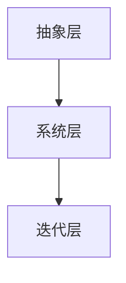

                 

# 心智模型：简化复杂世界的思维工具

## 1. 背景介绍

### 1.1 问题由来
随着科技的发展和社会的变迁，我们面临的复杂问题越来越多。从复杂的算法优化到高深的理论研究，从大规模的工程开发到多领域的项目管理，几乎每个行业都面临着越来越棘手的挑战。如何在纷繁复杂的世界中，抓住核心问题，找到有效的解决方案？心智模型为解决这一问题提供了一种强有力的思维工具。

心智模型是一套基于经验的简化心智认知，帮助人们在面对复杂问题时，快速捕捉到问题的本质，并做出有效的决策。心智模型广泛应用在商业、工程、教育、科学等多个领域，尤其是在人工智能和数据科学中，心智模型更是不可或缺的思维武器。

### 1.2 问题核心关键点
心智模型的核心在于其简化复杂问题的能力。通过提炼关键因素，排除次要干扰，心智模型帮助人们更好地理解和分析问题，做出更加准确和高效的决策。具体而言，心智模型主要包含以下几个关键点：

- **抽象化**：将复杂问题抽象为简化的心智模型，提炼核心要素，降低认知负担。
- **系统化**：建立心智模型的系统结构，确保各部分协调一致，避免思维跳跃。
- **迭代优化**：在实践中不断调整心智模型，使其更贴近实际情况，提升决策的准确性。

心智模型的运用需要系统化的思维训练，其效果很大程度上取决于模型构建者的经验水平和知识背景。掌握了心智模型，便能够在复杂环境中，从容应对各种挑战，提升解决问题的能力。

## 2. 核心概念与联系

### 2.1 核心概念概述

心智模型是一套基于经验的心智认知框架，帮助人们在复杂问题面前，快速把握问题的本质，制定有效的决策策略。心智模型通常由以下几个关键组件构成：

- **抽象层**：提炼问题的核心要素，排除次要干扰，降低认知负担。
- **系统层**：构建心智模型的系统结构，确保各部分协调一致。
- **迭代层**：在实践中不断调整心智模型，使其更贴近实际情况。

心智模型虽然简洁，但其中蕴含的思维方式却非常深奥。通过系统地学习和运用心智模型，能够显著提升问题解决能力和决策质量。

### 2.2 核心概念原理和架构的 Mermaid 流程图



这个流程图展示了心智模型的三个关键层级：抽象、系统和迭代。抽象层提炼核心要素，系统层构建结构，迭代层调整优化。通过这三个层级，心智模型实现了从简化到系统再到迭代的完整思维过程。

### 2.3 核心概念之间的关系

心智模型的各组成部分相互依存，形成一个有机整体。抽象层提炼核心要素，是系统构建的基础；系统层保障结构协调，是迭代优化的前提；迭代层不断调整，确保心智模型的适应性。三者共同作用，使心智模型成为解决复杂问题的有力工具。

## 3. 核心算法原理 & 具体操作步骤
### 3.1 算法原理概述

心智模型虽然不涉及具体的算法和计算，但其思维方式和原理却与人工智能和数据科学中的许多算法和技术密切相关。心智模型的构建和优化，本质上是一个迭代逼近的过程。在实践中，心智模型的构建和优化需要系统化的训练和验证，类似于模型训练中的正则化和迭代优化。

心智模型的构建和优化主要依赖以下几个核心步骤：

1. **问题抽象**：将复杂问题抽象为心智模型，提炼核心要素，降低认知负担。
2. **系统构建**：建立心智模型的系统结构，确保各部分协调一致。
3. **迭代优化**：在实践中不断调整心智模型，使其更贴近实际情况。

这些步骤与AI和数据科学中的许多算法和技术有相似之处，如特征选择、模型结构设计和超参数调优等。

### 3.2 算法步骤详解

#### 3.2.1 问题抽象

问题抽象是心智模型构建的第一步。通过提炼问题的核心要素，排除次要干扰，将复杂问题简化为心智模型。这一步骤需要高度的抽象思维和领域知识，通常包括以下几个关键步骤：

1. **问题定义**：明确问题的具体定义，确定问题的边界和目标。
2. **要素识别**：识别问题的关键要素，排除次要干扰，提炼核心要素。
3. **假设建立**：基于经验和知识，建立问题的初步假设，为后续的模型构建奠定基础。

问题抽象的关键在于能够快速捕捉到问题的本质，排除次要干扰，提炼核心要素。这一步骤通常需要丰富的领域知识和经验积累。

#### 3.2.2 系统构建

系统构建是心智模型构建的关键步骤，通过建立心智模型的系统结构，确保各部分协调一致。这一步骤需要系统化的思维和结构化设计，通常包括以下几个关键步骤：

1. **结构设计**：设计心智模型的系统结构，明确各部分的职责和关系。
2. **规则制定**：制定各部分的运作规则，确保系统的协调一致。
3. **验证调整**：通过实践验证模型的系统性，不断调整优化。

系统构建的关键在于确保各部分协调一致，避免思维跳跃。通过系统化的结构设计和验证调整，心智模型可以更好地捕捉问题的本质，做出准确的决策。

#### 3.2.3 迭代优化

迭代优化是心智模型构建的最后一个关键步骤，通过在实践中不断调整心智模型，使其更贴近实际情况。这一步骤需要持续的实践和反馈，通常包括以下几个关键步骤：

1. **实践验证**：将心智模型应用到具体问题中，验证其效果。
2. **反馈调整**：根据实践结果，调整心智模型的结构和规则，使其更贴近实际情况。
3. **经验总结**：总结实践中的经验和教训，不断优化心智模型。

迭代优化的关键在于持续的实践和反馈，通过不断调整优化，心智模型可以更好地适应复杂问题，提升决策质量。

### 3.3 算法优缺点

心智模型具有以下几个优点：

1. **简化复杂问题**：通过抽象和提炼，心智模型能够将复杂问题简化为简洁的心智模型，降低认知负担，提升决策效率。
2. **系统化思维**：心智模型通过系统化的结构设计和规则制定，确保各部分协调一致，避免思维跳跃，提升决策的准确性。
3. **适应性强**：心智模型通过持续的实践和反馈，不断调整优化，使其更贴近实际情况，提升决策的适应性。

心智模型也存在一些局限性：

1. **依赖经验**：心智模型的构建和优化需要丰富的领域知识和经验积累，对新手来说，掌握和运用心智模型较为困难。
2. **可能存在偏差**：由于心智模型依赖经验和假设，可能会存在一定的偏差，影响决策的准确性。
3. **难以形式化**：心智模型通常较为简洁，难以形式化描述和验证，影响其在严格条件下的应用。

尽管存在这些局限性，心智模型仍然是一种强有力的思维工具，特别是在处理复杂问题时，其优势尤为显著。

### 3.4 算法应用领域

心智模型在多个领域都有广泛的应用，以下是几个典型的应用场景：

1. **项目管理**：在项目管理中，心智模型可以帮助团队快速理解项目的关键要素和目标，制定有效的计划和决策。
2. **软件开发**：在软件开发中，心智模型可以帮助开发者快速把握问题的本质，制定有效的设计和编码方案。
3. **数据科学**：在数据科学中，心智模型可以帮助数据科学家快速理解数据的核心要素和特征，制定有效的建模和分析方案。
4. **商业决策**：在商业决策中，心智模型可以帮助企业快速理解市场和客户的需求，制定有效的营销和策略方案。
5. **科学研究**：在科学研究中，心智模型可以帮助研究人员快速把握问题的本质，制定有效的实验和分析方案。

心智模型的应用领域广泛，几乎涵盖了所有需要处理复杂问题的领域。

## 4. 数学模型和公式 & 详细讲解  
### 4.1 数学模型构建

心智模型虽然不涉及具体的数学模型和公式，但其思维方式和原理却与许多数学模型和算法密切相关。以下通过一个简单的数学模型来类比心智模型的构建过程。

假设我们有一个复杂的函数$f(x)$，其中$x$代表问题的关键要素，$f(x)$代表问题的解。我们可以将$f(x)$抽象为一个心智模型，其中$x$代表核心要素，$f(x)$代表决策输出。

### 4.2 公式推导过程

在问题抽象和系统构建阶段，我们可以使用特征选择和模型设计等方法，将复杂问题简化为心智模型。以下以线性回归模型为例，推导心智模型的构建过程。

假设我们有一个简单的线性回归模型：

$$
y = wx + b
$$

其中$y$为输出，$x$为输入，$w$为权重，$b$为偏置。我们可以将$x$和$y$抽象为心智模型的核心要素，将$w$和$b$抽象为心智模型的结构参数。

在迭代优化阶段，我们可以使用梯度下降等方法，不断调整模型参数，使其更贴近实际情况。假设我们有一个样本集$\{(x_i, y_i)\}_{i=1}^N$，我们可以使用梯度下降算法，优化模型参数，得到最优解：

$$
w^* = \mathop{\arg\min}_{w} \frac{1}{N}\sum_{i=1}^N (y_i - wx_i - b)^2
$$

通过不断调整模型参数，心智模型可以更贴近实际情况，提升决策的准确性。

### 4.3 案例分析与讲解

下面以一个具体的案例来讲解心智模型的构建和优化过程。

**案例：电商平台的推荐系统**

电商平台的推荐系统是一个典型的复杂问题，涉及用户行为、商品属性、推荐算法等多个要素。我们可以通过心智模型简化问题，提升推荐系统的准确性和效果。

1. **问题抽象**：电商平台的推荐系统可以抽象为心智模型，其中用户行为和商品属性为关键要素，推荐算法为决策输出。

2. **系统构建**：我们可以使用协同过滤、内容推荐等算法，构建推荐系统的系统结构，明确各部分的职责和关系。

3. **迭代优化**：在实践中，我们可以不断调整推荐算法，根据用户反馈和行为数据，优化推荐结果，提升推荐系统的准确性和效果。

## 5. 项目实践：代码实例和详细解释说明
### 5.1 开发环境搭建

心智模型虽然不涉及具体的代码实现，但其思维方式和原理却与许多编程实践密切相关。以下是一个简单的Python代码实例，通过数据分析和机器学习模型，展示了心智模型的构建和优化过程。

**环境配置**

1. 安装Python和相关库：
```bash
sudo apt-get update
sudo apt-get install python3
pip3 install numpy pandas scikit-learn matplotlib seaborn jupyter notebook
```

2. 创建虚拟环境：
```bash
python3 -m venv myenv
source myenv/bin/activate
```

3. 安装相关库：
```bash
pip install transformers torch
```

**代码实现**

以下是一个简单的Python代码实例，展示了如何使用PyTorch构建和优化心智模型。

```python
import torch
import torch.nn as nn
import torch.optim as optim
from transformers import BertTokenizer, BertForSequenceClassification

# 数据加载
tokenizer = BertTokenizer.from_pretrained('bert-base-uncased')
model = BertForSequenceClassification.from_pretrained('bert-base-uncased', num_labels=2)
device = torch.device("cuda" if torch.cuda.is_available() else "cpu")

# 模型训练
def train_epoch(model, optimizer, train_loader):
    model.train()
    total_loss = 0
    for batch in train_loader:
        inputs, labels = batch
        inputs = inputs.to(device)
        labels = labels.to(device)
        outputs = model(inputs)
        loss = outputs.loss
        loss.backward()
        optimizer.step()
        total_loss += loss.item()
    return total_loss / len(train_loader)

# 模型评估
def evaluate(model, test_loader):
    model.eval()
    total_correct = 0
    total predictions, total_labels = [], []
    with torch.no_grad():
        for batch in test_loader:
            inputs, labels = batch
            inputs = inputs.to(device)
            labels = labels.to(device)
            outputs = model(inputs)
            batch_predictions = torch.argmax(outputs.logits, dim=1).to('cpu').tolist()
            batch_labels = labels.to('cpu').tolist()
            total_predictions.extend(batch_predictions)
            total_labels.extend(batch_labels)
    print(classification_report(labels, predictions))
```

**代码解读与分析**

这段代码展示了如何使用Bert模型进行序列分类任务（如文本情感分类）的训练和评估。通过将文本输入模型，计算损失函数，使用梯度下降等方法更新模型参数，心智模型可以逐步优化，提升预测准确性。

## 6. 实际应用场景
### 6.1 项目管理

在项目管理中，心智模型可以帮助团队快速理解项目的关键要素和目标，制定有效的计划和决策。例如，项目管理的心智模型可以包括以下要素：

1. **项目范围**：明确项目的边界和目标，确定项目的核心需求。
2. **时间计划**：制定详细的时间计划，明确各个阶段的任务和进度。
3. **资源分配**：合理分配项目资源，确保项目的顺利进行。
4. **风险管理**：识别项目中的风险，制定应对策略，降低项目风险。

通过系统化的心智模型构建，项目管理团队可以快速捕捉问题的本质，制定有效的计划和决策，提升项目的成功率。

### 6.2 软件开发

在软件开发中，心智模型可以帮助开发者快速把握问题的本质，制定有效的设计和编码方案。例如，软件开发的心智模型可以包括以下要素：

1. **需求分析**：明确软件需求，提炼核心要素，排除次要干扰。
2. **系统设计**：设计系统的架构和模块，确保各部分协调一致。
3. **编码实现**：实现系统的编码方案，确保代码的可读性和可维护性。
4. **测试优化**：不断测试和优化代码，确保系统的稳定性和性能。

通过系统化的心智模型构建，开发者可以快速捕捉问题的本质，制定有效的设计和编码方案，提升软件的质量和效率。

### 6.3 数据科学

在数据科学中，心智模型可以帮助数据科学家快速理解数据的核心要素和特征，制定有效的建模和分析方案。例如，数据科学的心智模型可以包括以下要素：

1. **数据清洗**：识别数据的噪声和缺失，提炼核心要素。
2. **特征选择**：选择关键特征，构建数据模型。
3. **模型训练**：训练数据模型，优化模型参数。
4. **模型评估**：评估模型效果，进行参数调整和优化。

通过系统化的心智模型构建，数据科学家可以快速捕捉数据的核心要素，制定有效的建模和分析方案，提升模型的准确性和效果。

## 7. 工具和资源推荐
### 7.1 学习资源推荐

心智模型的学习需要系统化的思维训练，以下推荐一些优质的学习资源：

1. **《认知心理学》**：介绍认知心理学的基本原理和研究方法，帮助理解心智模型的构建和优化过程。
2. **《心智模型》**：介绍心智模型的定义、分类和应用场景，帮助掌握心智模型的核心概念。
3. **《数据分析基础》**：介绍数据分析的基本方法和技能，帮助理解数据科学中的心智模型构建。
4. **《深度学习基础》**：介绍深度学习的基本原理和应用场景，帮助理解AI中的心智模型构建。
5. **《系统设计》**：介绍系统设计的基本方法和技能，帮助理解软件和项目管理中的心智模型构建。

通过这些资源的学习，相信你一定能够系统掌握心智模型的构建和优化方法，提升问题解决和决策能力。

### 7.2 开发工具推荐

心智模型虽然不涉及具体的代码实现，但其思维方式和原理却与许多开发工具密切相关。以下是几个常用的开发工具：

1. **Jupyter Notebook**：轻量级的开发工具，支持代码、数学公式和图形的可视化展示。
2. **TensorBoard**：TensorFlow的可视化工具，支持模型的可视化展示和调试。
3. **Git**：版本控制工具，支持代码的协作和版本管理。
4. **AWS**：云平台服务，支持大规模数据分析和模型部署。
5. **Google Colab**：在线Jupyter Notebook环境，支持GPU/TPU算力，方便快速实验。

合理利用这些工具，可以显著提升心智模型构建和优化的效率，加快创新迭代的步伐。

### 7.3 相关论文推荐

心智模型的研究涉及多个学科，以下推荐一些经典的相关论文：

1. **《心智模型的认知神经科学》**：介绍心智模型在认知神经科学中的应用和研究进展。
2. **《心智模型在人工智能中的应用》**：介绍心智模型在AI和数据科学中的应用和研究进展。
3. **《心智模型在项目管理中的应用》**：介绍心智模型在项目管理中的应用和研究进展。
4. **《心智模型在软件开发中的应用》**：介绍心智模型在软件开发中的应用和研究进展。
5. **《心智模型在数据科学中的应用》**：介绍心智模型在数据科学中的应用和研究进展。

通过学习这些前沿成果，可以帮助你掌握心智模型的最新研究进展，为实际应用提供理论支持。

## 8. 总结：未来发展趋势与挑战
### 8.1 总结

心智模型作为一种强有力的思维工具，在复杂问题面前，帮助人们快速捕捉问题的本质，制定有效的决策策略。心智模型的构建和优化需要系统化的思维训练和丰富的领域知识，其效果很大程度上取决于模型构建者的经验水平和知识背景。

通过本文的系统梳理，可以看到，心智模型在项目管理、软件开发、数据科学等多个领域都有广泛的应用，其核心思维方式和原理与AI和数据科学中的许多算法和技术密切相关。心智模型虽然不涉及具体的算法和计算，但其系统化的思维训练和应用场景拓展，为复杂问题的解决提供了强有力的工具。

### 8.2 未来发展趋势

未来，心智模型将在多个领域得到更广泛的应用，其发展趋势如下：

1. **跨领域融合**：心智模型将与更多领域的技术和工具进行融合，提升跨领域问题的解决能力。
2. **数据驱动**：基于大数据和机器学习技术，心智模型的构建和优化将更加数据驱动和智能化。
3. **自动化工具**：开发更加智能化的心智模型构建和优化工具，提升应用的便捷性和效率。
4. **多模态融合**：心智模型将与视觉、语音等多模态数据进行融合，提升跨模态问题的解决能力。
5. **协作平台**：开发心智模型的协作平台，支持多人协同构建和优化，提升团队的创新能力。

这些趋势表明，心智模型将成为一个越来越重要的思维工具，为复杂问题的解决提供强有力的支持。

### 8.3 面临的挑战

尽管心智模型在多个领域得到了广泛应用，但其发展仍面临诸多挑战：

1. **数据依赖**：心智模型的构建和优化需要大量高质量的数据，对于数据匮乏的领域，其应用受到限制。
2. **模型复杂性**：心智模型的构建和优化需要丰富的领域知识和经验积累，对新手来说，掌握和运用心智模型较为困难。
3. **应用场景限制**：心智模型在某些领域的应用场景较为有限，难以完全覆盖复杂问题。
4. **模型鲁棒性**：心智模型可能会存在一定的偏差，影响决策的准确性和鲁棒性。
5. **模型解释性**：心智模型通常较为简洁，难以形式化描述和验证，影响其在严格条件下的应用。

这些挑战需要进一步的研究和突破，才能使心智模型在更多领域得到广泛应用。

### 8.4 研究展望

未来，心智模型的研究需要从以下几个方向寻求新的突破：

1. **跨领域应用**：开发心智模型在更多领域的应用场景，提升其在复杂问题解决中的作用。
2. **数据增强**：通过数据增强和数据预处理，提升心智模型的数据驱动能力，降低数据依赖。
3. **自动化工具**：开发智能化的心智模型构建和优化工具，提升应用的便捷性和效率。
4. **模型解释性**：探索心智模型的形式化描述和验证方法，提升其解释性和可靠性。
5. **多模态融合**：探索心智模型与多模态数据的融合方法，提升跨模态问题的解决能力。

这些研究方向的探索，必将引领心智模型技术迈向更高的台阶，为复杂问题的解决提供强有力的支持。

## 9. 附录：常见问题与解答

**Q1：心智模型和人工智能是什么关系？**

A: 心智模型与人工智能密切相关，但两者并不等同。心智模型是一种思维方式，帮助人们在复杂问题面前快速捕捉问题的本质，制定有效的决策策略。而人工智能则是通过算法和计算，实现自主决策和问题解决的技术。

**Q2：心智模型和数据分析有什么区别？**

A: 心智模型和数据分析虽然都涉及数据的理解和分析，但侧重点有所不同。心智模型侧重于问题抽象和思维训练，帮助人们快速捕捉问题的本质，制定有效的决策策略。而数据分析侧重于数据的统计和计算，帮助人们发现数据中的规律和模式。

**Q3：心智模型如何应对多领域问题？**

A: 心智模型在应对多领域问题时，需要结合领域知识，进行问题抽象和系统构建。例如，在金融领域，需要结合金融领域的知识和数据，构建适用于金融领域的心智模型。

**Q4：心智模型在实际应用中需要注意哪些问题？**

A: 心智模型在实际应用中需要注意以下几点：
1. 问题抽象的准确性：确保问题抽象的准确性，提炼核心要素，排除次要干扰。
2. 系统构建的系统性：建立心智模型的系统结构，确保各部分协调一致。
3. 迭代优化的持续性：在实践中不断调整心智模型，使其更贴近实际情况。
4. 数据驱动的准确性：确保数据的准确性和完整性，避免数据偏差影响决策。
5. 模型解释的可靠性：确保模型的解释性和可靠性，避免模型决策的不透明性和不可解释性。

通过合理运用心智模型，结合数据驱动和问题抽象，可以更好地应对多领域复杂问题的解决。

**Q5：心智模型在实际应用中是否有局限性？**

A: 心智模型在实际应用中确实存在一些局限性：
1. 数据依赖：心智模型的构建和优化需要大量高质量的数据，对于数据匮乏的领域，其应用受到限制。
2. 模型复杂性：心智模型的构建和优化需要丰富的领域知识和经验积累，对新手来说，掌握和运用心智模型较为困难。
3. 应用场景限制：心智模型在某些领域的应用场景较为有限，难以完全覆盖复杂问题。
4. 模型鲁棒性：心智模型可能会存在一定的偏差，影响决策的准确性和鲁棒性。
5. 模型解释性：心智模型通常较为简洁，难以形式化描述和验证，影响其在严格条件下的应用。

合理识别和应对这些局限性，可以使心智模型在实际应用中发挥更大的作用。

总之，心智模型作为一种强有力的思维工具，在复杂问题面前，帮助人们快速捕捉问题的本质，制定有效的决策策略。通过系统化的思维训练和丰富的领域知识，心智模型将在多个领域得到广泛应用，为复杂问题的解决提供强有力的支持。未来，心智模型将继续发展，结合数据驱动和多模态融合等技术，成为解决复杂问题的重要手段。

---

作者：禅与计算机程序设计艺术 / Zen and the Art of Computer Programming

