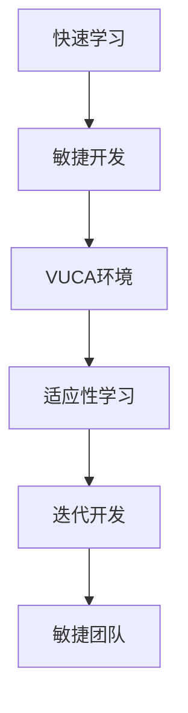

                 

# 快速学习:应对VUCA的制胜法宝

> 关键词：快速学习, VUCA, 动态环境, 敏捷开发, 适应性学习

## 1. 背景介绍

### 1.1 问题由来
在当今快速变化、竞争激烈、客户需求多样、信息泛滥的VUCA（Volatility、Uncertainty、Complexity、Ambiguity）环境中，企业需要不断地调整战略、产品和服务以应对变化，以保持竞争力。快速学习和敏捷开发成为了企业和组织应对VUCA环境的关键能力。

### 1.2 问题核心关键点
快速学习和敏捷开发的核心在于提高组织的适应性和反应速度。这要求组织具备高度的灵活性和自我调整能力，能够快速识别和应对环境变化，及时更新知识技能，以适应新的挑战和机遇。

### 1.3 问题研究意义
研究快速学习和敏捷开发，对于提升组织应对VUCA环境的能力，加速企业转型升级，提高市场竞争力和客户满意度具有重要意义：

1. **提高反应速度**：快速学习使组织能够更快地识别市场变化和客户需求，及时调整策略和产品。
2. **提升灵活性**：敏捷开发方法使组织能够更灵活地适应市场变化，快速推出新产品或改进现有产品。
3. **增强创新能力**：快速学习和敏捷开发鼓励创新和持续改进，使组织能够不断推出新的解决方案和产品。
4. **降低风险**：敏捷开发方法通过频繁迭代和快速反馈，降低项目风险和失败的概率。
5. **优化资源利用**：敏捷开发强调团队协作和资源共享，提高资源利用效率，减少浪费。

## 2. 核心概念与联系

### 2.1 核心概念概述

为更好地理解快速学习和敏捷开发方法，本节将介绍几个密切相关的核心概念：

- **快速学习（Learning at Speed）**：指在快速变化的环境下，通过快速获取、应用和更新知识，提升组织和个人的适应能力和反应速度。
- **敏捷开发（Agile Development）**：指在VUCA环境中，通过快速迭代、频繁反馈、团队协作等方式，以快速、高质量地交付软件产品。
- **VUCA环境**：指变化快速、不确定性高、复杂性强、模糊性大的环境，常见于科技创新、市场竞争、客户需求等方面。
- **适应性学习（Adaptive Learning）**：指根据环境变化，动态调整学习策略和内容，以更好地适应当前和未来的挑战。
- **迭代开发（Iterative Development）**：指将开发过程分为多个短期迭代周期，在每个周期内完成特定的功能模块，快速反馈和迭代，提升开发效率和产品质量。
- **敏捷团队（Agile Team）**：指具有高度自我组织和自我管理能力，能够快速响应变化、高效协作的团队。

这些核心概念之间的逻辑关系可以通过以下Mermaid流程图来展示：



这个流程图展示了几者之间的联系：

1. 在VUCA环境中，组织和个人需要通过快速学习提升适应能力。
2. 敏捷开发方法通过迭代开发和团队协作，快速响应变化，提升产品交付速度和质量。
3. 适应性学习根据环境变化调整学习策略，使组织和团队能够不断更新知识，适应新挑战。
4. 敏捷团队的高效协作和自我管理能力，是敏捷开发和快速学习的基础。

这些概念共同构成了快速学习和敏捷开发的方法论框架，帮助组织和个人在VUCA环境中保持竞争力和适应性。

## 3. 核心算法原理 & 具体操作步骤
### 3.1 算法原理概述

快速学习和敏捷开发方法的原理在于通过快速获取和应用知识，实现对变化环境的及时响应和适应。其核心思想是：

- 快速识别环境变化：通过持续监控市场、客户和技术变化，及时发现新的需求和挑战。
- 快速获取和更新知识：通过学习、培训、交流等方式，快速获取和更新组织和个人的知识。
- 快速响应和调整：通过敏捷开发和迭代开发，快速响应变化，调整策略和产品，交付高质量的解决方案。

### 3.2 算法步骤详解

快速学习和敏捷开发的具体操作步骤包括以下几个关键步骤：

**Step 1: 数据收集与监控**
- 收集市场、客户和技术变化的实时数据，通过监控工具和指标，如KPI、市场份额、客户反馈等，快速识别环境变化。
- 定期召开会议和汇报，讨论环境变化和潜在风险。

**Step 2: 知识获取与更新**
- 根据环境变化，快速识别并获取所需的新知识和技能，如新技术、新流程、新方法等。
- 通过在线课程、研讨会、培训、内部交流等方式，快速传播和更新知识。

**Step 3: 团队协作与沟通**
- 组建敏捷团队，通过定期站会、回顾会议等方式，促进团队协作和沟通。
- 使用敏捷开发工具，如Jira、Trello等，提高任务管理和协作效率。

**Step 4: 快速迭代与反馈**
- 采用迭代开发方法，将开发过程分为多个短期迭代周期，每个周期完成特定的功能模块，快速反馈和迭代。
- 每个迭代周期结束后，进行代码审查和性能评估，及时发现和解决问题。

**Step 5: 持续优化与改进**
- 定期对流程和方法进行回顾和优化，改进团队协作和开发效率。
- 根据客户反馈和市场变化，持续更新产品和服务，提升客户满意度和市场竞争力。

### 3.3 算法优缺点

快速学习和敏捷开发方法具有以下优点：
1. 快速响应变化：通过迭代开发和快速反馈，快速适应环境变化，及时调整策略和产品。
2. 提升团队协作：通过敏捷团队和定期站会，促进团队协作和知识共享，提升整体效率。
3. 灵活应对需求：通过快速学习和适应性学习，灵活应对客户需求变化，提高市场竞争力。
4. 降低项目风险：通过频繁迭代和快速反馈，降低项目失败的风险，提高产品质量。

同时，这些方法也存在一定的局限性：
1. 对资源要求高：快速学习和敏捷开发需要频繁的沟通和协作，对组织资源和团队能力要求较高。
2. 人员流动风险：敏捷开发依赖团队协作，团队成员的流动性可能导致知识传递和项目连续性问题。
3. 过程复杂：敏捷开发和快速学习需要频繁的迭代和反馈，过程复杂，对组织管理要求高。
4. 风险管理难度大：快速变化的环境增加了风险管理难度，需要更多经验和资源。

尽管存在这些局限性，但就目前而言，快速学习和敏捷开发仍然是企业和组织应对VUCA环境的主流方法。未来相关研究的重点在于如何进一步优化这些方法，使其更加灵活、高效，同时兼顾可控性和稳定性。

### 3.4 算法应用领域

快速学习和敏捷开发方法在多个领域得到了广泛应用，以下是几个典型应用案例：

- **软件开发**：软件开发领域的敏捷开发方法，如Scrum、Kanban等，已经在全球范围内广泛应用，推动了软件开发效率和质量的提升。
- **项目管理**：项目管理中的敏捷方法，如Scrum、Kanban等，通过快速迭代和频繁反馈，提高了项目管理的灵活性和响应速度。
- **运营管理**：敏捷运营方法通过快速反应和持续优化，提高了企业运营的效率和客户满意度。
- **产品创新**：快速学习和敏捷开发帮助企业快速识别市场机会，推出新产品和服务，保持市场竞争力。
- **人力资源管理**：敏捷HR方法通过快速获取和更新员工知识，提升组织的学习能力和适应性。

除了上述这些领域外，快速学习和敏捷开发也被创新性地应用到更多场景中，如医疗、教育、金融等，为组织变革和创新提供了新的思路。随着快速学习和敏捷开发方法的持续演进，相信将在更广阔的领域发挥更大的作用。

## 4. 数学模型和公式 & 详细讲解 & 举例说明
### 4.1 数学模型构建

为了更好地理解快速学习和敏捷开发方法的数学原理，本节将引入数学模型进行详细的讲解。

设环境变化率为 $\rho(t)$，组织的学习速度为 $v_{\text{learn}}$，团队协作效率为 $v_{\text{team}}$，客户反馈速度为 $v_{\text{feedback}}$。则组织在时刻 $t$ 的适应性学习速度 $v(t)$ 可以表示为：

$$
v(t) = v_{\text{learn}} + v_{\text{team}} + v_{\text{feedback}} + \alpha \rho(t)
$$

其中 $\alpha$ 为环境变化对适应性学习的影响系数。

组织在每个迭代周期内的学习效果 $E(t)$ 可以表示为：

$$
E(t) = \int_{t_i}^{t_{i+1}} v(t) \, \mathrm{d}t
$$

其中 $t_i$ 和 $t_{i+1}$ 为第 $i$ 次和第 $i+1$ 次迭代周期的时间点。

### 4.2 公式推导过程

以下我们通过具体案例来推导快速学习和敏捷开发方法的数学模型。

**案例分析**：一家软件公司采用敏捷开发方法，通过快速迭代和频繁反馈，实现了对市场变化的高效响应。公司每月收集市场变化数据，进行快速学习和知识更新，每两周进行一次敏捷迭代，每个迭代周期内完成5个新功能模块的开发和测试。

根据公式，我们可以计算公司每个迭代周期内的学习效果：

1. 每月学习速度 $v_{\text{learn}} = 30$ 次功能模块
2. 团队协作效率 $v_{\text{team}} = 10$ 次功能模块
3. 客户反馈速度 $v_{\text{feedback}} = 5$ 次功能模块
4. 环境变化影响系数 $\alpha = 0.1$，假设每月环境变化概率为 $0.05$

每个迭代周期内的学习效果 $E(t)$ 可以表示为：

$$
E(t) = (v_{\text{learn}} + v_{\text{team}} + v_{\text{feedback}} + \alpha \rho(t)) \times 2 \text{周}
$$

计算每个迭代周期内的学习效果：

$$
E(t) = (30 + 10 + 5 + 0.1 \times 0.05) \times 2 = 82.5
$$

公司每月可以完成 $4 \times 82.5 = 330$ 次功能模块的开发和测试，快速响应市场变化，提高产品质量和客户满意度。

### 4.3 案例分析与讲解

通过上述案例分析，可以看到快速学习和敏捷开发方法在实际应用中的数学模型和推导过程。以下是对这些案例的进一步讲解：

**案例讲解**：
- **数据收集与监控**：通过实时监控工具和市场变化数据，快速识别环境变化，如市场需求、技术趋势、竞争情况等。
- **知识获取与更新**：快速获取新知识和技能，如新技术、新流程、新方法等，通过培训、内部交流等方式，迅速传播和更新知识。
- **团队协作与沟通**：组建敏捷团队，定期召开站会和回顾会议，促进团队协作和沟通，使用敏捷开发工具提高任务管理和协作效率。
- **快速迭代与反馈**：采用迭代开发方法，每个迭代周期内完成特定功能模块，快速反馈和迭代，及时发现和解决问题。
- **持续优化与改进**：定期回顾和优化流程和方法，改进团队协作和开发效率，根据客户反馈和市场变化，持续更新产品和服务，提升客户满意度和市场竞争力。

## 5. 项目实践：代码实例和详细解释说明
### 5.1 开发环境搭建

在进行快速学习和敏捷开发实践前，我们需要准备好开发环境。以下是使用Python进行Scrum开发的环境配置流程：

1. 安装Scrum框架：通过安装Scrum类库，如ScrumPy等，实现敏捷开发的基础功能。
2. 创建Scrum板：在项目管理工具如Jira、Trello等创建Scrum板，记录任务和迭代进度。
3. 配置开发环境：安装必要的开发工具，如IDE、编译器、版本控制等，支持敏捷开发。
4. 配置CI/CD流水线：使用持续集成工具如Jenkins、Travis CI等，实现代码自动构建、测试和部署。

完成上述步骤后，即可在开发环境中开始敏捷开发实践。

### 5.2 源代码详细实现

下面我们以敏捷软件开发为例，给出使用ScrumPy库进行敏捷开发的软件项目实现。

首先，定义Scrum项目的基本信息：

```python
from scrumpy.project import Project
from scrumpy.team import Team

# 定义项目名称、迭代周期长度、团队成员等信息
project_name = "AgileProject"
iter_length = 2  # 两周
team_members = ["Alice", "Bob", "Charlie", "Dave"]

# 创建项目
project = Project(project_name, iter_length, team_members)
```

然后，定义敏捷任务和用户故事：

```python
from scrumpy.user_story import UserStory
from scrumpy.task import Task

# 定义用户故事和任务
user_story = UserStory("User Story Title", "As a user, I want to...")
task1 = Task("Task 1", "Implement feature A...")
task2 = Task("Task 2", "Implement feature B...")
task3 = Task("Task 3", "Implement feature C...")

# 将任务添加到用户故事
user_story.add_task(task1)
user_story.add_task(task2)
user_story.add_task(task3)
```

接着，定义敏捷开发过程：

```python
from scrumpy.iteration import Iteration

# 创建迭代
iteration = Iteration(iteration_number=1, project=project)

# 定义迭代任务和接受情况
iteration.add_task(task1)
iteration.add_task(task2)
iteration.add_task(task3)

# 定义迭代计划
iteration.plan_tasks()

# 执行迭代
iteration.execute_tasks()
```

最后，评估迭代结果并进行反馈：

```python
# 评估迭代结果
iteration.evaluate_tasks()

# 收集用户反馈
iteration.collect_feedback()

# 记录迭代回顾
iteration.review()
```

### 5.3 代码解读与分析

让我们再详细解读一下关键代码的实现细节：

**Scrum项目类**：
- `Project` 类：定义项目基本信息，包括项目名称、迭代周期长度、团队成员等。
- `iter_length`：迭代周期长度，设定为两周。
- `team_members`：团队成员列表。

**敏捷任务和用户故事类**：
- `UserStory` 类：定义用户故事，包括标题、描述、任务列表等。
- `Task` 类：定义敏捷任务，包括任务描述、依赖关系、状态等。

**敏捷开发过程类**：
- `Iteration` 类：定义迭代过程，包括迭代编号、项目、任务列表、计划任务、执行任务、评估任务、收集反馈、回顾等步骤。
- `iteration_number`：迭代编号。
- `project`：项目对象。
- `iteration.add_task(task)`：添加任务到迭代中。
- `iteration.plan_tasks()`：为迭代计划任务。
- `iteration.execute_tasks()`：执行迭代中的任务。
- `iteration.evaluate_tasks()`：评估迭代任务完成情况。
- `iteration.collect_feedback()`：收集用户反馈。
- `iteration.review()`：进行迭代回顾。

可以看到，ScrumPy库使得敏捷开发过程变得简单高效，开发者可以快速搭建敏捷项目，定义任务和用户故事，并通过迭代过程完成敏捷开发。

当然，工业级的系统实现还需考虑更多因素，如用户故事拆分、任务优先级排序、迭代复盘等。但核心的敏捷开发流程基本与此类似。

## 6. 实际应用场景
### 6.1 软件开发

敏捷开发在软件开发领域得到了广泛应用，特别是对于大型、复杂项目的开发。通过敏捷开发，团队可以快速响应变化，提高开发效率和产品质量，降低项目风险。

敏捷开发的具体实施包括：
- **迭代计划**：根据需求和优先级，制定迭代计划，确定每个迭代周期的任务。
- **迭代开发**：通过短周期、快速迭代的方式，实现功能的逐步交付和反馈。
- **持续集成**：使用CI/CD工具，实现代码自动构建、测试和部署，提高开发效率。
- **回顾与改进**：通过定期回顾会议，总结经验教训，持续改进开发流程和方法。

### 6.2 产品管理

敏捷方法在产品管理中也有广泛应用。通过敏捷方法，产品经理可以更加灵活地应对市场变化和客户需求，快速推出新产品和服务，提升市场竞争力。

敏捷产品管理的具体实施包括：
- **用户故事**：通过用户故事描述产品功能需求，确保产品设计符合用户期望。
- **迭代发布**：通过短周期迭代，逐步实现产品功能，快速反馈和迭代。
- **持续反馈**：通过市场反馈和用户调查，收集产品使用情况和改进建议，持续优化产品。
- **回顾与改进**：通过回顾会议，总结产品发布过程中的经验和教训，持续改进产品管理流程。

### 6.3 项目管理

敏捷方法在项目管理中同样有效。通过敏捷方法，项目管理团队可以快速响应变化，提高项目管理效率，降低项目风险。

敏捷项目管理的具体实施包括：
- **迭代计划**：根据项目需求和优先级，制定迭代计划，确定每个迭代周期的任务。
- **迭代执行**：通过短周期、快速迭代的方式，实现项目的逐步交付和反馈。
- **持续监控**：通过项目管理工具，实时监控项目进度和风险，及时发现和解决问题。
- **回顾与改进**：通过回顾会议，总结项目管理和执行过程中的经验和教训，持续改进项目管理流程。

### 6.4 未来应用展望

随着敏捷开发和快速学习方法的发展，其应用领域将进一步拓展。以下是对未来应用前景的展望：

- **跨领域应用**：敏捷开发和快速学习方法不仅限于软件开发，将在更多领域得到应用，如医疗、金融、教育等。
- **企业级应用**：敏捷方法和快速学习将成为企业级管理的重要手段，提升企业的市场响应速度和竞争力。
- **智能化应用**：结合人工智能和机器学习技术，通过数据分析和预测，进一步提升敏捷开发和快速学习的效率和效果。
- **混合方法应用**：敏捷开发与传统开发方法结合，形成混合方法，提升开发效率和产品质量。
- **远程协作应用**：在远程工作模式下，敏捷方法和快速学习将发挥更大的作用，提升远程团队的协作效率和灵活性。

## 7. 工具和资源推荐
### 7.1 学习资源推荐

为了帮助开发者系统掌握敏捷开发和快速学习方法，这里推荐一些优质的学习资源：

1. 《敏捷软件开发：原则、模式与实践》：Robert C. Martin所著的经典书籍，介绍了敏捷软件开发的核心原则和实践方法。
2. 《Scrum敏捷项目管理》：Ken Schwaber和Mike Beedle所著的Scrum经典书籍，详细介绍了Scrum方法的实践应用。
3. Coursera《敏捷开发》课程：由University of Virginia开设的Coursera课程，涵盖了敏捷开发的核心概念和方法。
4. Udemy《Scrum Master》课程：通过视频和练习，全面学习Scrum Master的实践应用。
5. Scrum Alliance官方文档：Scrum Alliance提供的官方文档和资源，包括Scrum指南、Scrum框架等。

通过对这些资源的学习实践，相信你一定能够快速掌握敏捷开发和快速学习的精髓，并用于解决实际的业务问题。

### 7.2 开发工具推荐

高效的开发离不开优秀的工具支持。以下是几款用于敏捷开发和快速学习的常用工具：

1. ScrumPy：ScrumPy是一个Python库，用于实现敏捷开发的基本功能，包括敏捷项目管理、用户故事、任务管理等。
2. Jira：Jira是一个常用的敏捷项目管理工具，支持敏捷开发的所有功能，包括迭代计划、任务管理、持续集成等。
3. Trello：Trello是一个可视化项目管理工具，通过看板的方式管理任务和迭代进度，支持敏捷开发。
4. Jenkins：Jenkins是一个常用的持续集成工具，支持代码自动构建、测试和部署，提高开发效率。
5. GitLab：GitLab是一个集成了持续集成和部署功能的Git仓库管理工具，支持敏捷开发和持续交付。

合理利用这些工具，可以显著提升敏捷开发和快速学习的效率，加快创新迭代的步伐。

### 7.3 相关论文推荐

敏捷开发和快速学习方法的发展源于学界的持续研究。以下是几篇奠基性的相关论文，推荐阅读：

1. "The Scrum Guide"：Scrum官方指南，详细介绍了Scrum方法的核心概念和实践方法。
2. "Agile Estimating and Planning"：James Shore和Sergey Berezin所著的经典书籍，介绍了敏捷估算和规划的方法。
3. "An Empirical Study of Agile Software Development"：Stephen M. Cooke等人的经典论文，通过实验验证了敏捷开发的优势和挑战。
4. "Adaptive Agile Development"：Jeff Sutherland和Jill Considine等人的论文，介绍了适应性敏捷开发的方法。
5. "Scrum: An Overview of the Scrum Framework"：Ken Schwaber等人的论文，介绍了Scrum框架的核心概念和方法。

这些论文代表了大敏捷开发和快速学习方法的发展脉络。通过学习这些前沿成果，可以帮助研究者把握学科前进方向，激发更多的创新灵感。

## 8. 总结：未来发展趋势与挑战
### 8.1 总结

本文对敏捷开发和快速学习方法进行了全面系统的介绍。首先阐述了敏捷开发和快速学习方法的研究背景和意义，明确了这些方法在应对VUCA环境中的独特价值。其次，从原理到实践，详细讲解了敏捷开发和快速学习的数学原理和关键步骤，给出了敏捷开发任务实现的完整代码实例。同时，本文还广泛探讨了敏捷开发方法在软件开发、产品管理、项目管理等多个领域的应用前景，展示了敏捷方法论的广阔前景。

通过本文的系统梳理，可以看到，敏捷开发和快速学习方法在VUCA环境中扮演着重要的角色，极大地提升了组织和团队的适应能力和响应速度。快速学习和敏捷开发将成为企业应对未来挑战的重要手段，推动企业实现数字化转型和智能化升级。

### 8.2 未来发展趋势

展望未来，敏捷开发和快速学习方法将呈现以下几个发展趋势：

1. 跨领域应用拓展：敏捷开发和快速学习方法不仅限于软件开发，将在更多领域得到应用，如医疗、金融、教育等。
2. 企业级应用普及：敏捷方法和快速学习将成为企业级管理的重要手段，提升企业的市场响应速度和竞争力。
3. 智能化融合应用：结合人工智能和机器学习技术，通过数据分析和预测，进一步提升敏捷开发和快速学习的效率和效果。
4. 混合方法结合应用：敏捷开发与传统开发方法结合，形成混合方法，提升开发效率和产品质量。
5. 远程协作支持：在远程工作模式下，敏捷方法和快速学习将发挥更大的作用，提升远程团队的协作效率和灵活性。
6. 敏捷文化推广：通过推广敏捷文化，提升团队成员的自我组织和自我管理能力，提高敏捷开发和快速学习的成效。

以上趋势凸显了敏捷开发和快速学习方法的未来发展方向，相信随着技术的不断进步和实践的不断积累，这些方法将能够更好地应对未来挑战，提升企业应对VUCA环境的能力。

### 8.3 面临的挑战

尽管敏捷开发和快速学习方法已经取得了显著成就，但在迈向更加智能化、普适化应用的过程中，仍然面临诸多挑战：

1. 资源管理难度大：敏捷开发需要频繁的沟通和协作，资源管理复杂，容易出现资源浪费和调配困难。
2. 团队协作难度大：敏捷开发依赖团队协作，团队成员的流动性可能导致知识传递和项目连续性问题。
3. 过程复杂度高：敏捷开发和快速学习方法涉及多个环节和角色，过程复杂，需要更多的组织和管理支持。
4. 风险管理难度大：敏捷开发和快速学习方法需要在快速变化的环境中快速迭代，风险管理难度大。
5. 结果评估难度大：敏捷开发和快速学习方法依赖频繁的反馈和迭代，结果评估和改进难度大。
6. 工具和框架依赖高：敏捷开发和快速学习需要依赖特定的工具和框架，切换成本高。

尽管存在这些挑战，但就目前而言，敏捷开发和快速学习仍然是企业和组织应对VUCA环境的主流方法。未来相关研究的重点在于如何进一步优化这些方法，使其更加灵活、高效，同时兼顾可控性和稳定性。

### 8.4 研究展望

面对敏捷开发和快速学习方法所面临的种种挑战，未来的研究需要在以下几个方面寻求新的突破：

1. 探索无监督和半监督方法：摆脱对大规模标注数据的依赖，利用自监督学习、主动学习等无监督和半监督范式，最大限度利用非结构化数据，实现更加灵活高效的敏捷开发。
2. 研究参数高效和计算高效的微调范式：开发更加参数高效的微调方法，在固定大部分预训练参数的同时，只更新极少量的任务相关参数。同时优化微调模型的计算图，减少前向传播和反向传播的资源消耗，实现更加轻量级、实时性的部署。
3. 引入更多先验知识：将符号化的先验知识，如知识图谱、逻辑规则等，与神经网络模型进行巧妙融合，引导敏捷开发过程学习更准确、合理的知识。同时加强不同模态数据的整合，实现视觉、语音等多模态信息与文本信息的协同建模。
4. 结合因果分析和博弈论工具：将因果分析方法引入敏捷开发模型，识别出模型决策的关键特征，增强输出解释的因果性和逻辑性。借助博弈论工具刻画人机交互过程，主动探索并规避模型的脆弱点，提高系统稳定性。
5. 纳入伦理道德约束：在敏捷开发目标中引入伦理导向的评估指标，过滤和惩罚有偏见、有害的输出倾向。同时加强人工干预和审核，建立模型行为的监管机制，确保输出符合人类价值观和伦理道德。

这些研究方向的探索，必将引领敏捷开发和快速学习方法迈向更高的台阶，为构建安全、可靠、可解释、可控的智能系统铺平道路。面向未来，敏捷开发和快速学习方法还需要与其他人工智能技术进行更深入的融合，如知识表示、因果推理、强化学习等，多路径协同发力，共同推动自然语言理解和智能交互系统的进步。只有勇于创新、敢于突破，才能不断拓展语言模型的边界，让智能技术更好地造福人类社会。

## 9. 附录：常见问题与解答
**Q1：敏捷开发和快速学习方法是否适用于所有组织和项目？**

A: 敏捷开发和快速学习方法在大多数情况下可以提升组织的响应速度和适应能力，但并不适合所有组织和项目。对于简单、短期的项目，传统开发方法可能更加高效；对于高度依赖专业知识或复杂需求的项目，敏捷方法可能需要更多的时间和资源。需要根据具体情况选择适合的开发方法和工具。

**Q2：敏捷开发中如何处理项目需求变更？**

A: 敏捷开发强调快速响应变化，对项目需求变更的处理包括以下步骤：
1. 在每日站会中识别变更需求，评估变更影响。
2. 通过产品负责人与客户沟通，确认变更需求。
3. 重新规划迭代计划，调整任务优先级。
4. 在敏捷迭代中逐步实现变更需求。
5. 通过迭代评审和客户反馈，验证变更效果。

**Q3：敏捷开发中如何进行风险管理？**

A: 敏捷开发中的风险管理包括：
1. 风险识别：在每日站会中识别潜在风险，评估风险影响。
2. 风险评估：通过风险登记表，记录和管理已识别风险。
3. 风险控制：制定风险应对策略，包括风险缓解、风险转移、风险接受等。
4. 风险监控：在每个迭代中监控风险变化，及时调整风险管理策略。
5. 风险复盘：在每个迭代结束后，总结风险管理效果，优化风险管理流程。

**Q4：敏捷开发中如何进行团队协作？**

A: 敏捷开发中的团队协作包括：
1. 站会：每天进行15分钟站会，更新任务进展、讨论问题和障碍。
2. 回顾会议：在每个迭代结束后，进行回顾会议，总结经验教训，优化团队协作和开发流程。
3. 迭代评审：在每个迭代结束后，进行迭代评审，展示开发成果，获取客户反馈。
4. 代码审查：通过代码审查工具，提高代码质量，促进团队协作。
5. 知识共享：通过知识库、文档、技术分享等方式，促进团队成员之间的知识共享和协作。

**Q5：敏捷开发中如何进行持续集成和持续交付？**

A: 敏捷开发中的持续集成和持续交付包括：
1. 持续集成：使用CI工具，如Jenkins、Travis CI等，实现代码自动构建、测试和部署。
2. 持续交付：通过自动化流程，将开发成果快速部署到生产环境，提高交付速度和效率。
3. 自动化测试：通过自动化测试工具，如Selenium、JUnit等，提高测试效率和覆盖率。
4. 部署流水线：通过CI/CD流水线，实现持续集成和持续交付，提高开发效率和交付质量。

这些建议和回答将帮助开发者更好地理解和应用敏捷开发和快速学习方法，提升组织和项目的响应速度和适应能力，更好地应对VUCA环境带来的挑战。

