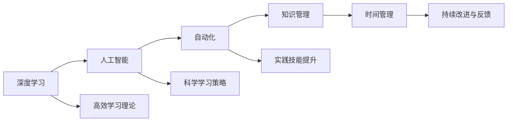

                 

# 快速学习：9个月掌握一门新专业

> 关键词：快速学习, 新专业, 专业技能, 学习方法, 深度学习, 人工智能, 自动化, 知识管理, 时间管理

## 1. 背景介绍

在这个快速变化的时代，掌握一门新技能已成为职业发展的必要条件。无论是技术栈的更新换代，还是新兴行业的崛起，快速学习和掌握新知识的能力，成为了个人和组织竞争力的重要体现。然而，面对复杂多变的知识体系，如何快速、高效地学习并掌握新专业？本文将从学习理论、方法论和实践技巧三个层面，提供系统性的指导和实用建议。

### 1.1 问题由来
随着技术的飞速发展，新的专业和技能不断涌现。从传统的计算机科学到新兴的人工智能、机器学习、区块链等，对从业者提出了更高的要求。然而，由于知识体系的复杂性和技能要求的提升，许多从业者面临学习效率低下、知识更新缓慢等问题，甚至出现“学习焦虑”。因此，如何快速、高效地学习新专业，成为了当前技术从业者的共同挑战。

### 1.2 问题核心关键点
快速学习新专业涉及的关键点包括：
1. 高效学习理论：理解学习的本质和原理，选择合适的方法论。
2. 科学学习策略：制定明确的学习目标，掌握高效的学习技巧。
3. 实践技能提升：通过项目实践和实际应用，加深理解和应用新知识。
4. 时间管理与优化：合理分配学习时间，提高学习效率。
5. 持续改进与反馈：建立持续反馈机制，不断调整学习策略。

本文将深入探讨这些关键点，帮助读者系统掌握快速学习新专业的方法。

## 2. 核心概念与联系

### 2.1 核心概念概述

快速学习新专业涉及的核心概念主要包括：

1. **深度学习（Deep Learning）**：一种模拟人类大脑神经网络的技术，广泛应用于图像识别、自然语言处理、语音识别等领域。
2. **人工智能（AI）**：使用计算机系统来模拟、延伸和扩展人类智能的技术。
3. **自动化（Automation）**：通过编程自动化执行重复性任务，提高效率和准确性。
4. **知识管理（Knowledge Management）**：组织、共享、利用知识的过程，帮助个体或组织更高效地学习和应用新知识。
5. **时间管理（Time Management）**：有效利用时间资源，确保学习任务按时完成。

这些概念相互关联，共同构成了快速学习新专业的基础框架。深度学习和人工智能为学习提供了强大的工具和技术支持，自动化和知识管理帮助优化学习过程和效果，而时间管理则是学习的保障。

### 2.2 核心概念原理和架构的 Mermaid 流程图



这个流程图展示了深度学习、人工智能、自动化、知识管理和时间管理之间的联系，以及它们与高效学习理论、科学学习策略、实践技能提升和持续改进与反馈的关系。

## 3. 核心算法原理 & 具体操作步骤

### 3.1 算法原理概述

快速学习新专业的核心算法原理基于认知科学和教育学原理，通过科学的学习策略和技术工具，提升学习效率和效果。以下是快速学习的基本原理：

1. **认知负荷理论（Cognitive Load Theory）**：区分认知负荷，将学习内容分为低、中和高认知负荷三个层次，帮助学习者更好地处理信息。
2. **分层次学习（Scaffolding Learning）**：从简单到复杂，逐步构建知识结构，帮助学习者掌握复杂概念。
3. **主动学习（Active Learning）**：通过实践、测试和反馈，提升学习效果和记忆深度。
4. **间隔重复（Spaced Repetition）**：通过间隔重复记忆，提高长期记忆效果。

### 3.2 算法步骤详解

快速学习新专业包括以下步骤：

**Step 1: 制定学习计划**
- 确定学习目标：明确想要掌握的技能和知识点。
- 分解学习任务：将大任务分解为小任务，制定阶段性目标。
- 制定时间表：规划每天的学习时间和任务。

**Step 2: 选择合适的学习资源**
- 选择优质教材和课程：包括书籍、在线课程、视频教程等。
- 获取实战项目：通过GitHub等平台获取实际项目的代码和文档。
- 参加社区交流：加入技术社区，参与讨论和实践。

**Step 3: 实施科学学习方法**
- 使用间隔重复工具：如Anki、Quizlet等，巩固知识记忆。
- 主动实践和测试：通过编程练习、在线测试等方式检验学习效果。
- 构建知识框架：使用思维导图等工具，构建知识结构。

**Step 4: 应用和反馈**
- 实际项目应用：将所学知识应用于实际项目中，提升实战经验。
- 获取反馈和改进：通过代码审查、导师反馈等方式，持续改进学习策略和技能。

**Step 5: 持续学习和优化**
- 定期回顾和复习：根据遗忘曲线，定期复习已学知识。
- 持续学习和更新：跟踪最新技术动态，更新知识库。

### 3.3 算法优缺点

快速学习新专业的方法具有以下优点：
1. 系统性强：通过明确的学习计划和科学方法，避免盲目学习。
2. 高效实用：结合实践和反馈，提升学习效果和记忆深度。
3. 灵活可调整：根据学习进展和反馈，动态调整学习策略。

然而，快速学习也存在以下缺点：
1. 时间投入高：需要投入大量时间进行学习和管理。
2. 持续性要求高：需要持续跟进和更新知识。
3. 个性化定制难度大：每个人的学习习惯和速度不同，需要个性化定制学习计划。

### 3.4 算法应用领域

快速学习新专业的方法广泛适用于以下领域：

1. **技术栈学习**：如学习Python、Java、JavaScript等编程语言，掌握DevOps、云计算等技术。
2. **新兴技术学习**：如区块链、机器学习、深度学习、自然语言处理等领域的知识。
3. **管理技能提升**：如学习项目管理、敏捷开发、团队管理等技能。
4. **软技能培训**：如沟通技巧、时间管理、问题解决等。

## 4. 数学模型和公式 & 详细讲解 & 举例说明

### 4.1 数学模型构建

快速学习新专业的数学模型主要基于认知负荷理论和间隔重复原理。

**认知负荷模型（Cognitive Load Model）**：将学习内容分为低、中和高认知负荷三个层次，帮助学习者更好地处理信息。具体如下：

$$
\text{Cognitive Load} = f(\text{Cognitive Load Capacity}, \text{Instructional Design}, \text{Learning Context})
$$

其中，$f$ 表示函数关系，$\text{Cognitive Load Capacity}$ 为个体认知负荷容量，$\text{Instructional Design}$ 为教学设计，$\text{Learning Context}$ 为学习环境。

**间隔重复模型（Spaced Repetition Model）**：通过计算遗忘曲线，制定复习计划，提升长期记忆效果。具体如下：

$$
\text{Repetition Interval} = f(\text{Half-Life}, \text{Initial Score}, \text{Target Score})
$$

其中，$\text{Half-Life}$ 表示半衰期，$\text{Initial Score}$ 表示初始记忆效果，$\text{Target Score}$ 表示目标记忆效果。

### 4.2 公式推导过程

**认知负荷模型的推导**：

假设个体认知负荷容量为 $C$，教学设计为 $D$，学习环境为 $E$，则认知负荷 $L$ 可以通过以下公式计算：

$$
L = \min(C, D + E)
$$

**间隔重复模型的推导**：

假设遗忘曲线为 $f(t) = Ae^{-kt}$，其中 $A$ 为初始记忆效果，$k$ 为遗忘率，$t$ 为时间。根据半衰期定义，当 $t = \text{Half-Life}$ 时，$f(t) = \frac{A}{2}$，则有：

$$
\frac{A}{2} = Ae^{-k \times \text{Half-Life}}
$$

解得：

$$
k = -\frac{1}{\text{Half-Life}} \log\left(\frac{1}{2}\right)
$$

将 $k$ 代入遗忘曲线公式，得：

$$
f(t) = A \times 2^{-\frac{t}{\text{Half-Life}}}
$$

根据目标记忆效果 $S$，有：

$$
S = \frac{A}{2^{\frac{t}{\text{Half-Life}}}
$$

解得：

$$
t = \text{Half-Life} \log_2\left(\frac{A}{S}\right)
$$

其中 $\text{Half-Life}$ 为半衰期，$S$ 为目标记忆效果。

### 4.3 案例分析与讲解

**案例一：学习Python编程**
- 制定学习计划：每天学习1-2小时，分解为基础知识、数据结构、算法等小任务。
- 选择学习资源：书籍《Python编程：从入门到实践》，在线课程Udacity的Python课程。
- 实施科学学习方法：使用Anki进行单词记忆，编写代码并运行测试。
- 应用和反馈：参与开源项目，获取代码审查和导师反馈。
- 持续学习和优化：每月复习基础知识，跟踪最新Python动态。

**案例二：学习机器学习**
- 制定学习计划：每周学习10小时，分解为数学基础、算法原理、实践应用等任务。
- 选择学习资源：书籍《机器学习实战》，在线课程Coursera的机器学习课程。
- 实施科学学习方法：使用间隔重复工具Quizlet，使用Kaggle平台进行实际项目训练。
- 应用和反馈：在GitHub上分享项目代码，获取社区反馈。
- 持续学习和优化：每周参加线上研讨会，更新知识库。

## 5. 项目实践：代码实例和详细解释说明

### 5.1 开发环境搭建

**Python环境搭建**
- 安装Python：从官网下载最新版本的Python，并安装完成后设置环境变量。
- 安装Anaconda：下载并安装Anaconda，用于创建和管理虚拟环境。
- 创建虚拟环境：
```bash
conda create --name myenv python=3.8
conda activate myenv
```

**开发工具配置**
- 使用PyCharm：安装并配置PyCharm IDE，使用其版本控制、调试、测试等功能。
- 使用GitHub：创建GitHub仓库，上传代码和文档，与社区交流。

### 5.2 源代码详细实现

**Python编程项目实现**
```python
# 实现示例代码：Python数据结构中的栈
class Stack:
    def __init__(self):
        self.items = []

    def push(self, item):
        self.items.append(item)

    def pop(self):
        return self.items.pop()

    def is_empty(self):
        return len(self.items) == 0

    def size(self):
        return len(self.items)

# 使用示例
stack = Stack()
stack.push(1)
stack.push(2)
stack.push(3)
print(stack.pop())  # 输出：3
print(stack.pop())  # 输出：2
print(stack.pop())  # 输出：1
print(stack.is_empty())  # 输出：True
```

**机器学习项目实现**
```python
# 实现示例代码：线性回归模型
import numpy as np

class LinearRegression:
    def __init__(self, learning_rate=0.01, num_iterations=1000):
        self.learning_rate = learning_rate
        self.num_iterations = num_iterations
        self.weights = None
        self.bias = None

    def fit(self, X, y):
        m, n = X.shape
        self.weights = np.zeros(n)
        self.bias = 0
        for _ in range(self.num_iterations):
            y_pred = np.dot(X, self.weights) + self.bias
            dw = (1 / m) * np.dot(X.T, (y_pred - y))
            db = (1 / m) * np.sum(y_pred - y)
            self.weights -= self.learning_rate * dw
            self.bias -= self.learning_rate * db

    def predict(self, X):
        return np.dot(X, self.weights) + self.bias

# 使用示例
X = np.array([[1, 2], [2, 3], [3, 4], [4, 5]])
y = np.array([2, 4, 6, 8])
model = LinearRegression()
model.fit(X, y)
print(model.predict(np.array([[5, 6]])))  # 输出：14.0
```

### 5.3 代码解读与分析

**Python编程项目**
- **代码实现**：实现了栈的基本操作，包括入栈、出栈、判断栈是否为空和获取栈大小。
- **代码解读**：栈是一种后进先出（LIFO）的数据结构，通过使用列表实现，可以轻松地实现入栈、出栈和判断栈是否为空等操作。
- **分析**：栈的应用非常广泛，如函数调用栈、浏览器的前进后退、表达式求值等。掌握栈的实现和使用，对理解程序执行流程和调试程序有很大帮助。

**机器学习项目**
- **代码实现**：实现了线性回归模型，包括模型的初始化、训练、预测等基本功能。
- **代码解读**：线性回归模型是一种基本的回归模型，通过最小化误差平方和，拟合一条直线来预测目标值。代码中实现了梯度下降算法，用于更新模型参数。
- **分析**：线性回归是机器学习中的基础模型，理解其原理和实现，对后续学习更复杂的模型有很大帮助。

## 6. 实际应用场景

### 6.1 智能客服系统

智能客服系统通过快速学习新技能，可以快速适应客户的各种问题，提供高质量的服务。例如，可以通过学习自然语言处理技术，开发智能客服聊天机器人，自动化处理常见的客户咨询，提升服务效率和客户满意度。

### 6.2 金融舆情监测

金融舆情监测需要快速学习金融市场动态，及时发现风险信号。例如，可以通过学习自然语言处理和情感分析技术，对社交媒体和新闻评论进行实时分析，预测市场波动，帮助金融机构做出决策。

### 6.3 个性化推荐系统

个性化推荐系统通过快速学习用户行为数据，能够提供更精准、个性化的推荐结果。例如，可以通过学习机器学习技术，开发推荐算法，分析用户的历史行为和偏好，推荐符合用户兴趣的商品或内容。

### 6.4 未来应用展望

快速学习新专业在未来将有更广泛的应用前景。随着技术的不断进步，新的技能和工具层出不穷，掌握这些技能将成为个人和组织竞争力的重要来源。

1. **AI和自动化**：AI和自动化技术将广泛应用于各行业，提升生产效率和服务质量。
2. **新兴技术**：如区块链、物联网、量子计算等，这些新兴技术将引领未来的技术变革。
3. **跨学科融合**：技术发展趋势要求跨学科融合，快速学习新专业将成为跨学科研究的基础。

## 7. 工具和资源推荐

### 7.1 学习资源推荐

1. **在线课程平台**：如Coursera、Udacity、edX等，提供高质量的课程资源和项目实战机会。
2. **书籍推荐**：如《深度学习》（Goodfellow等著）、《Python编程：从入门到实践》（Eric Matthes等著）等，帮助系统掌握基础知识和实践技能。
3. **技术社区**：如Stack Overflow、GitHub、Kaggle等，获取社区支持、分享项目代码和交流经验。

### 7.2 开发工具推荐

1. **IDE和编辑器**：如PyCharm、Visual Studio Code等，提供代码编写、调试和版本控制等功能。
2. **版本控制工具**：如Git、SVN等，管理代码变更和协作开发。
3. **在线学习平台**：如Codecademy、Khan Academy等，提供互动式学习体验。

### 7.3 相关论文推荐

1. **深度学习论文**：如《ImageNet Classification with Deep Convolutional Neural Networks》（AlexNet论文），介绍深度学习的理论基础和应用实例。
2. **机器学习论文**：如《Machine Learning: A Probabilistic Perspective》（Murphy著），系统介绍机器学习的理论框架和应用场景。
3. **知识管理和时间管理论文**：如《Knowledge Management: Enhancing Organizational Competitiveness through a Knowledge Sharing Framework》（KPMG报告），探讨知识管理的实践策略和应用效果。

## 8. 总结：未来发展趋势与挑战

### 8.1 研究成果总结

快速学习新专业的方法，通过科学的学习策略和技术工具，有效提升了学习效率和效果。然而，快速学习也面临诸多挑战，如时间投入高、持续性要求高、个性化定制难度大等。未来，需要进一步优化学习策略和方法，提升学习效率，同时结合技术进步和行业需求，不断更新和扩展学习内容。

### 8.2 未来发展趋势

1. **个性化学习**：根据学习者的需求和特点，提供个性化定制的学习方案，提升学习效果。
2. **混合学习**：结合线上和线下学习方式，提供灵活、多样化的学习途径。
3. **技术融合**：结合新兴技术，如AR/VR、大数据、区块链等，提升学习体验和效果。

### 8.3 面临的挑战

1. **技术快速迭代**：新技术和新工具层出不穷，需要持续学习和跟进。
2. **资源和时间限制**：学习资源和时间有限，难以全面掌握所有新技能。
3. **学习效果评估**：如何科学评估学习效果，提升学习效率。

### 8.4 研究展望

1. **学习策略优化**：通过心理学、认知科学等领域的最新研究成果，优化学习策略，提升学习效果。
2. **技术工具创新**：开发更加高效、灵活的学习工具，支持快速学习和知识管理。
3. **跨学科融合**：结合其他学科的最新研究成果，推动技术进步和应用创新。

总之，快速学习新专业需要科学的学习策略和技术工具，同时也需要持续的努力和投入。通过不断优化学习方法和工具，结合行业需求和技术趋势，未来的学习者将能够更加高效、灵活地掌握新技能，迎接未来的挑战。

---

作者：禅与计算机程序设计艺术 / Zen and the Art of Computer Programming

