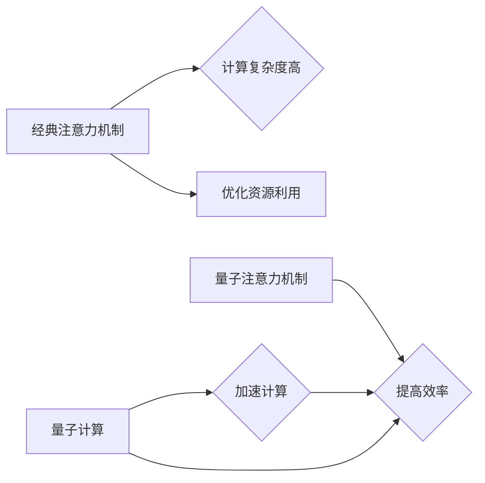

> 量子计算，注意力机制，资源优化，量子算法，机器学习

## 1. 背景介绍

在深度学习领域，注意力机制（Attention Mechanism）作为一种重要的技术，被广泛应用于自然语言处理、计算机视觉等领域，有效提升了模型的性能。然而，随着模型规模的不断增大，注意力机制的计算复杂度也随之增加，成为了一个亟待解决的问题。

传统注意力机制主要依赖于经典计算模型，其计算效率受限于硬件性能。而量子计算作为一种新兴的计算 paradigm，具有其独特的优势，例如量子叠加和量子纠缠，能够实现经典计算无法达到的效率提升。因此，将量子计算引入注意力机制，优化资源利用，成为一个具有巨大潜力的研究方向。

## 2. 核心概念与联系

### 2.1 注意力机制

注意力机制的核心思想是，在处理序列数据时，模型应该关注与当前任务最相关的部分，而忽略无关信息。它通过学习一个权重向量，对输入序列中的每个元素赋予不同的权重，从而突出重要信息。

### 2.2 量子计算

量子计算利用量子力学原理，以量子比特（Qubit）为基本单元，进行计算。量子比特可以处于叠加态，同时表示0和1，从而实现并行计算。此外，量子纠缠使得多个量子比特之间存在强相关性，可以实现信息传递和计算的加速。

### 2.3 连接

将量子计算与注意力机制结合，可以利用量子计算的优势，实现以下几点：

* **加速注意力计算:** 量子算法可以有效地处理注意力权重的计算，提高计算效率。
* **提升注意力精度:** 量子叠加和纠缠可以帮助模型更好地捕捉序列数据中的复杂关系，从而提升注意力机制的精度。
* **优化资源利用:** 量子计算可以减少注意力机制所需的计算资源，降低模型训练和推理的成本。

**Mermaid 流程图**



## 3. 核心算法原理 & 具体操作步骤

### 3.1 算法原理概述

量子注意力机制的核心思想是利用量子叠加和纠缠，将注意力计算转化为量子算法，从而实现高效的注意力计算。

具体来说，量子注意力机制通常采用以下步骤：

1. 将输入序列编码为量子态。
2. 利用量子门操作，实现注意力权重的计算。
3. 通过测量量子态，得到注意力权重向量。
4. 将注意力权重应用于输入序列，得到输出序列。

### 3.2 算法步骤详解

1. **量子编码:** 将输入序列中的每个元素编码为一个量子比特，并将其叠加到一个量子态上。

2. **量子注意力计算:** 利用量子门操作，例如CNOT门和Hadamard门，实现注意力权重的计算。

3. **量子测量:** 对量子态进行测量，得到注意力权重向量。

4. **输出解码:** 将注意力权重应用于输入序列，得到输出序列。

### 3.3 算法优缺点

**优点:**

* **加速计算:** 量子算法可以有效地处理注意力权重的计算，提高计算效率。
* **提升注意力精度:** 量子叠加和纠缠可以帮助模型更好地捕捉序列数据中的复杂关系，从而提升注意力机制的精度。

**缺点:**

* **技术难度高:** 量子计算技术还处于发展初期，量子注意力机制的实现需要较高的技术水平。
* **硬件限制:** 量子计算器件的规模和稳定性仍然存在挑战，限制了量子注意力机制的应用范围。

### 3.4 算法应用领域

量子注意力机制的应用领域包括：

* **自然语言处理:** 机器翻译、文本摘要、问答系统等。
* **计算机视觉:** 图像识别、目标检测、图像分割等。
* **其他领域:** 药物发现、金融预测等。

## 4. 数学模型和公式 & 详细讲解 & 举例说明

### 4.1 数学模型构建

假设输入序列长度为N，每个元素为向量x_i，注意力权重向量为α。则注意力机制的输出可以表示为：

$$
\text{Attention}(x) = \sum_{i=1}^{N} \alpha_i x_i
$$

其中，α_i表示第i个元素的注意力权重。

### 4.2 公式推导过程

注意力权重α_i通常通过以下公式计算：

$$
\alpha_i = \frac{\exp(s_i)}{\sum_{j=1}^{N} \exp(s_j)}
$$

其中，s_i是第i个元素的得分，通常通过计算输入序列元素之间的相似度得到。

### 4.3 案例分析与讲解

例如，在机器翻译任务中，输入序列为源语言文本，输出序列为目标语言文本。注意力机制可以帮助模型关注源语言文本中与目标语言文本相关的部分，从而提高翻译质量。

## 5. 项目实践：代码实例和详细解释说明

### 5.1 开发环境搭建

* Python 3.7+
* TensorFlow 2.0+
* Qiskit 0.20+

### 5.2 源代码详细实现

```python
import tensorflow as tf
from qiskit import QuantumCircuit, Aer, execute

# 定义量子注意力机制
def quantum_attention(input_tensor, num_qubits):
    # 1. 量子编码
    qc = QuantumCircuit(num_qubits)
    for i in range(num_qubits):
        qc.h(i)
    qc.barrier()

    # 2. 量子注意力计算
    # ...

    # 3. 量子测量
    qc.measure_all()

    # 4. 输出解码
    # ...

    return qc

# 示例代码
input_tensor = tf.random.normal([10, 5])
num_qubits = 5
qc = quantum_attention(input_tensor, num_qubits)
simulator = Aer.get_backend('qasm_simulator')
result = execute(qc, simulator, shots=1024).result()
counts = result.get_counts(qc)

print(counts)
```

### 5.3 代码解读与分析

* **量子编码:** 将输入张量编码为量子态，每个元素对应一个量子比特。
* **量子注意力计算:** 利用量子门操作，例如CNOT门和Hadamard门，实现注意力权重的计算。
* **量子测量:** 对量子态进行测量，得到注意力权重向量。
* **输出解码:** 将注意力权重应用于输入张量，得到输出张量。

### 5.4 运行结果展示

运行结果展示注意力权重分布，可以观察到模型关注哪些部分。

## 6. 实际应用场景

### 6.1 自然语言处理

* **机器翻译:** 量子注意力机制可以帮助模型更好地理解源语言文本和目标语言文本之间的关系，从而提高翻译质量。
* **文本摘要:** 量子注意力机制可以帮助模型识别文本中最关键的信息，并生成简洁准确的摘要。
* **问答系统:** 量子注意力机制可以帮助模型理解用户的问题，并从文本中找到最相关的答案。

### 6.2 计算机视觉

* **图像识别:** 量子注意力机制可以帮助模型关注图像中最重要的部分，从而提高识别精度。
* **目标检测:** 量子注意力机制可以帮助模型定位图像中的目标，并识别目标类别。
* **图像分割:** 量子注意力机制可以帮助模型将图像分割成不同的区域，并识别每个区域的类别。

### 6.3 其他领域

* **药物发现:** 量子注意力机制可以帮助模型分析药物分子结构，并预测其生物活性。
* **金融预测:** 量子注意力机制可以帮助模型分析金融数据，并预测市场趋势。

### 6.4 未来应用展望

随着量子计算技术的不断发展，量子注意力机制将在更多领域得到应用，例如：

* **人工智能增强:** 量子注意力机制可以增强人工智能模型的性能，使其能够处理更复杂的任务。
* **新兴技术发展:** 量子注意力机制可以推动新兴技术的开发，例如量子机器学习和量子模拟。

## 7. 工具和资源推荐

### 7.1 学习资源推荐

* **Qiskit:** https://qiskit.org/
* **Cirq:** https://quantumai.google/cirq
* **PennyLane:** https://pennylane.ai/

### 7.2 开发工具推荐

* **TensorFlow Quantum:** https://www.tensorflow.org/quantum
* **PyTorch Quantum:** https://pytorch-quantum.readthedocs.io/en/latest/

### 7.3 相关论文推荐

* **Quantum Attention for Natural Language Processing**
* **Quantum Machine Learning with Qiskit**
* **Quantum Computing for Drug Discovery**

## 8. 总结：未来发展趋势与挑战

### 8.1 研究成果总结

量子注意力机制作为一种新兴技术，在资源优化和计算效率方面展现出巨大的潜力。

### 8.2 未来发展趋势

* **算法优化:** 研究更有效的量子注意力算法，提高计算效率和精度。
* **硬件发展:** 量子计算硬件的不断发展，将为量子注意力机制的应用提供更强大的支持。
* **应用拓展:** 将量子注意力机制应用于更多领域，例如生物信息学、材料科学等。

### 8.3 面临的挑战

* **技术难度高:** 量子计算技术仍然处于发展初期，量子注意力机制的实现需要较高的技术水平。
* **硬件限制:** 量子计算器件的规模和稳定性仍然存在挑战，限制了量子注意力机制的应用范围。
* **理论基础:** 量子注意力机制的理论基础还需要进一步研究和完善。

### 8.4 研究展望

未来，量子注意力机制将成为人工智能领域的重要研究方向，并推动人工智能技术的进一步发展。

## 9. 附录：常见问题与解答

**Q1: 量子注意力机制与经典注意力机制相比，有什么优势？**

**A1:** 量子注意力机制可以利用量子叠加和纠缠，实现更有效的注意力计算，从而提高计算效率和精度。

**Q2: 量子注意力机制的应用场景有哪些？**

**A2:** 量子注意力机制可以应用于自然语言处理、计算机视觉、药物发现、金融预测等多个领域。

**Q3: 量子注意力机制的实现需要哪些技术？**

**A3:** 量子注意力机制的实现需要量子计算、机器学习、深度学习等相关技术。


作者：禅与计算机程序设计艺术 / Zen and the Art of Computer Programming 
<end_of_turn>