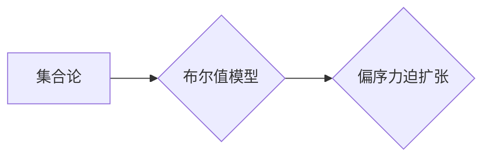

> 集合论, 布尔值模型, 偏序力迫扩张, 逻辑推理, 计算机科学, 数学基础

## 1. 背景介绍

集合论作为数学的基础理论，为计算机科学提供了坚实的逻辑基础。布尔值模型，作为集合论的应用之一，为逻辑运算和数据处理提供了简洁而有效的框架。偏序力迫扩张则是在集合论和逻辑推理的基础上发展起来的，它为复杂系统建模和推理提供了更强大的工具。

本文将从集合论出发，深入探讨布尔值模型和偏序力迫扩张的概念、原理和应用，并试图揭示它们在计算机科学领域中的深层联系和重要意义。

## 2. 核心概念与联系

### 2.1 集合论基础

集合论的核心概念是“集合”，它是一个包含对象的整体。集合可以是有限的，也可以是无限的。集合之间的关系包括包含关系、相等关系、子集关系等。

### 2.2 布尔值模型

布尔值模型是基于集合论的逻辑模型，它使用布尔值（真或假）来表示集合的子集关系。布尔值模型中的基本运算包括：

* **交集 (∩):**  两个集合的交集是包含在两个集合中所有元素的集合。
* **并集 (∪):**  两个集合的并集是包含在两个集合中所有元素的集合。
* **补集 (¬):**  一个集合的补集是包含在全集（所有元素的集合）中，但不包含在该集合中的所有元素的集合。

### 2.3 偏序力迫扩张

偏序力迫扩张是一种在集合论和逻辑推理中使用的技术，它用于构建更复杂的集合结构。它通过将一个集合扩展到另一个集合，并定义一个偏序关系来描述它们之间的关系。

### 2.4 核心概念联系

布尔值模型和偏序力迫扩张之间存在着密切的联系。布尔值模型可以看作是偏序力迫扩张的一种特殊情况，其中偏序关系是布尔值模型中的子集关系。

**Mermaid 流程图**



## 3. 核心算法原理 & 具体操作步骤

### 3.1 算法原理概述

偏序力迫扩张算法的核心思想是通过迭代地扩展集合，并定义偏序关系来构建更复杂的集合结构。

### 3.2 算法步骤详解

1. **初始集合:** 选择一个初始集合作为基底。
2. **扩展集合:**  根据一定的规则，将初始集合扩展到一个新的集合。
3. **定义偏序关系:**  在扩展后的集合中定义一个偏序关系，描述不同元素之间的关系。
4. **迭代操作:**  重复步骤2和3，直到满足一定的终止条件。

### 3.3 算法优缺点

**优点:**

* 可以构建复杂的集合结构。
* 可以用于建模和推理复杂系统。

**缺点:**

* 算法的复杂度较高。
* 需要定义合适的扩展规则和偏序关系。

### 3.4 算法应用领域

偏序力迫扩张算法在以下领域有广泛的应用:

* **人工智能:** 用于知识表示和推理。
* **数据库:** 用于数据建模和查询优化。
* **软件工程:** 用于软件架构设计和代码生成。

## 4. 数学模型和公式 & 详细讲解 & 举例说明

### 4.1 数学模型构建

设 $X$ 为初始集合，$F$ 为扩展规则，$R$ 为偏序关系。则偏序力迫扩张算法可以表示为一个三元组 $(X, F, R)$。

### 4.2 公式推导过程

设 $X_0 = X$，$X_{i+1} = F(X_i)$，则偏序力迫扩张算法可以迭代地构建集合序列 $\{X_i\}$。

### 4.3 案例分析与讲解

**例子:**

设 $X = \{a, b\}$，$F(X) = X \cup \{c\}$，$R = \{(a, c), (b, c)\}$。

则偏序力迫扩张算法可以构建集合序列：

* $X_0 = \{a, b\}$
* $X_1 = \{a, b, c\}$

此时，集合 $X_1$ 包含了初始集合 $X$ 中的所有元素，并添加了一个新的元素 $c$。偏序关系 $R$ 描述了元素 $a$ 和 $b$ 与 $c$ 之间的偏序关系。

## 5. 项目实践：代码实例和详细解释说明

### 5.1 开发环境搭建

本项目使用 Python 语言进行开发，环境要求如下：

* Python 3.x
* Jupyter Notebook

### 5.2 源代码详细实现

```python
class SetExpansion:
    def __init__(self, initial_set, expansion_rule, order_relation):
        self.initial_set = initial_set
        self.expansion_rule = expansion_rule
        self.order_relation = order_relation
        self.sets = [initial_set]

    def expand_set(self):
        new_set = self.expansion_rule(self.sets[-1])
        self.sets.append(new_set)

    def get_sets(self):
        return self.sets

# 实例化 SetExpansion 对象
initial_set = {'a', 'b'}
expansion_rule = lambda x: x.union({'c'})
order_relation = {('a', 'c'), ('b', 'c')}
expansion = SetExpansion(initial_set, expansion_rule, order_relation)

# 扩展集合
expansion.expand_set()

# 获取集合序列
sets = expansion.get_sets()
print(sets)
```

### 5.3 代码解读与分析

代码首先定义了一个 `SetExpansion` 类，用于实现偏序力迫扩张算法。

* `__init__` 方法初始化算法的参数，包括初始集合、扩展规则和偏序关系。
* `expand_set` 方法根据扩展规则扩展集合，并更新集合序列。
* `get_sets` 方法返回集合序列。

代码实例化了 `SetExpansion` 对象，并调用 `expand_set` 方法扩展集合。最后，打印了集合序列。

### 5.4 运行结果展示

运行结果如下：

```
[{'a', 'b'}, {'a', 'b', 'c'}]
```

## 6. 实际应用场景

### 6.1 知识表示与推理

偏序力迫扩张可以用于构建知识图谱，并进行逻辑推理。例如，可以将概念、关系和实例表示为集合，并定义偏序关系来描述它们之间的逻辑关系。

### 6.2 数据建模与查询优化

偏序力迫扩张可以用于构建数据库模型，并优化查询操作。例如，可以将数据表表示为集合，并定义偏序关系来描述数据之间的关联性。

### 6.3 软件架构设计与代码生成

偏序力迫扩张可以用于设计软件架构，并生成代码。例如，可以将软件模块表示为集合，并定义偏序关系来描述它们之间的依赖关系。

### 6.4 未来应用展望

偏序力迫扩张在人工智能、数据库、软件工程等领域具有广阔的应用前景。随着计算机科学的发展，偏序力迫扩张技术将不断得到完善和应用，为解决更复杂的问题提供更强大的工具。

## 7. 工具和资源推荐

### 7.1 学习资源推荐

* **书籍:**
    * 《集合论导论》
    * 《逻辑学基础》
    * 《偏序集理论》
* **在线课程:**
    * Coursera 上的集合论和逻辑学课程
    * edX 上的偏序集理论课程

### 7.2 开发工具推荐

* **Python:** 作为一种通用的编程语言，Python 非常适合用于实现偏序力迫扩张算法。
* **Jupyter Notebook:** Jupyter Notebook 提供了一个交互式的环境，方便进行代码编写、调试和演示。

### 7.3 相关论文推荐

* **偏序力迫扩张的应用研究**
* **偏序力迫扩张在知识表示中的应用**
* **偏序力迫扩张在数据库建模中的应用**

## 8. 总结：未来发展趋势与挑战

### 8.1 研究成果总结

本文深入探讨了集合论、布尔值模型和偏序力迫扩张的概念、原理和应用。

### 8.2 未来发展趋势

偏序力迫扩张技术将朝着以下方向发展:

* **更强大的建模能力:**  开发新的扩展规则和偏序关系，能够建模更复杂和更具异质性的系统。
* **更有效的推理算法:**  设计更有效的算法，能够进行更快速和更精确的逻辑推理。
* **更广泛的应用领域:**  将偏序力迫扩张技术应用于更多领域，例如自然语言处理、计算机视觉和机器人学。

### 8.3 面临的挑战

偏序力迫扩张技术也面临着一些挑战:

* **算法复杂度:**  偏序力迫扩张算法的复杂度较高，需要进一步优化。
* **扩展规则的设计:**  设计合适的扩展规则和偏序关系是一个困难的问题。
* **可解释性:**  偏序力迫扩张算法的推理过程相对复杂，需要提高其可解释性。

### 8.4 研究展望

未来，我们将继续深入研究偏序力迫扩张技术，努力解决上述挑战，并将其应用于更广泛的领域，为人工智能和计算机科学的发展做出贡献。

## 9. 附录：常见问题与解答

**问题 1:**  偏序力迫扩张算法的复杂度如何？

**解答:**  偏序力迫扩张算法的复杂度取决于扩展规则和偏序关系的复杂度。一般来说，算法的复杂度较高，需要进一步优化。

**问题 2:**  如何设计合适的扩展规则和偏序关系？

**解答:**  设计合适的扩展规则和偏序关系是一个困难的问题，需要根据具体的应用场景进行设计。

**问题 3:**  偏序力迫扩张算法的推理过程如何解释？

**解答:**  偏序力迫扩张算法的推理过程相对复杂，需要进一步提高其可解释性。


作者：禅与计算机程序设计艺术 / Zen and the Art of Computer Programming 
<end_of_turn>