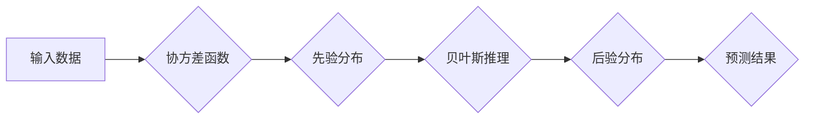

# 高斯过程 (Gaussian Processes) 原理与代码实例讲解

> 关键词：

> 高斯过程，贝叶斯推理，回归，分类，非参数模型，机器学习

## 1. 背景介绍

在机器学习领域，高斯过程 (Gaussian Processes, GP) 是一种强大的非参数模型，广泛应用于回归和分类任务。它基于贝叶斯推理，能够对模型参数和预测结果进行概率性建模，从而提供更可靠和可解释的预测结果。

传统的机器学习模型，例如线性回归和支持向量机，通常假设数据服从特定的分布，并使用参数估计来拟合数据。然而，现实世界的数据往往具有复杂性和非线性特征，这些模型难以捕捉这些复杂性。

高斯过程则通过假设数据点之间的函数关系服从高斯分布，从而避免了对数据分布的强假设。它可以灵活地处理非线性关系，并提供对预测结果的不确定性估计，使其在许多实际应用场景中表现出色。

## 2. 核心概念与联系

高斯过程的核心概念是将函数视为随机变量。

**核心概念:**

* **函数空间:**  高斯过程将函数视为随机变量，并将其定义在函数空间中。
* **协方差函数:** 协方差函数描述了函数空间中不同函数之间的相关性。它决定了高斯过程的平滑度和范围。
* **先验分布:** 高斯过程假设函数在训练数据之前服从一个先验分布，通常是高斯分布。
* **后验分布:** 在观测到训练数据后，高斯过程利用贝叶斯推理更新先验分布，得到后验分布。后验分布描述了函数在训练数据上的概率分布。

**Mermaid 流程图:**



## 3. 核心算法原理 & 具体操作步骤

### 3.1  算法原理概述

高斯过程回归的核心思想是利用贝叶斯推理来学习一个函数，该函数能够拟合训练数据。

1. **定义协方差函数:** 选择一个协方差函数来描述函数空间中不同函数之间的相关性。常见的协方差函数包括平方指数函数、径向基函数等。
2. **设定先验分布:** 假设函数在训练数据之前服从一个高斯分布，作为先验分布。
3. **观测训练数据:** 观测到训练数据后，利用贝叶斯推理更新先验分布，得到后验分布。
4. **预测新数据:**  对于新的输入数据，利用后验分布计算预测结果的概率分布。

### 3.2  算法步骤详解

1. **数据准备:** 将训练数据预处理，例如标准化或归一化。
2. **选择协方差函数:** 根据数据的特性选择合适的协方差函数。
3. **设定超参数:** 协方差函数和先验分布通常包含一些超参数，需要通过交叉验证等方法进行调优。
4. **训练模型:** 利用训练数据和选择的协方差函数和先验分布，训练高斯过程模型。
5. **预测新数据:**  对于新的输入数据，利用训练好的模型计算预测结果的概率分布。

### 3.3  算法优缺点

**优点:**

* **非参数模型:** 高斯过程不需要事先假设数据的分布，能够灵活地处理复杂数据。
* **概率性建模:** 高斯过程提供对预测结果的不确定性估计，能够量化预测的可靠性。
* **可解释性:** 高斯过程的预测结果可以解释为函数在训练数据上的概率分布。

**缺点:**

* **计算复杂度:** 高斯过程的计算复杂度较高，尤其是在处理大规模数据时。
* **超参数调优:** 高斯过程的性能依赖于协方差函数和先验分布的选择，需要进行仔细的超参数调优。

### 3.4  算法应用领域

高斯过程广泛应用于以下领域:

* **回归分析:** 预测连续变量，例如股票价格、房价等。
* **分类问题:**  分类非连续变量，例如图像识别、文本分类等。
* **时间序列预测:** 预测时间序列数据，例如天气预报、销售预测等。
* **优化问题:**  寻找最优解，例如机器学习模型参数的调优。

## 4. 数学模型和公式 & 详细讲解 & 举例说明

### 4.1  数学模型构建

高斯过程模型的核心是假设函数 $f(x)$ 在函数空间中服从高斯分布。

**数学模型:**

$$
f(x) \sim GP(m(x), k(x, x'))
$$

其中:

* $f(x)$ 是函数值
* $m(x)$ 是均值函数，描述函数在每个输入点的平均值
* $k(x, x')$ 是协方差函数，描述函数在输入点 $x$ 和 $x'$ 处的相关性

### 4.2  公式推导过程

在观测到训练数据 $(x_1, y_1), (x_2, y_2), ..., (x_n, y_n)$ 后，高斯过程模型的预测结果服从以下高斯分布:

$$
f^* (x^*) | D \sim N(m^*(x^*), k^*(x^*))
$$

其中:

* $f^* (x^*)$ 是对新输入点 $x^*$ 的预测值
* $D$ 是训练数据
* $m^*(x^*)$ 是预测值的均值
* $k^*(x^*)$ 是预测值的方差

### 4.3  案例分析与讲解

**举例说明:**

假设我们想要预测房屋价格，输入特征包括房屋面积、房间数量等。我们可以使用高斯过程模型来学习房屋价格与输入特征之间的关系。

1. **选择协方差函数:**  我们可以选择平方指数函数作为协方差函数，因为它能够捕捉到非线性关系。
2. **设定超参数:**  需要通过交叉验证等方法来确定协方差函数和先验分布的超参数。
3. **训练模型:**  利用训练数据和选择的协方差函数和先验分布，训练高斯过程模型。
4. **预测新数据:**  对于新的房屋，我们可以利用训练好的模型预测其价格，并获得价格的概率分布。

## 5. 项目实践：代码实例和详细解释说明

### 5.1  开发环境搭建

* Python 3.6+
* scikit-learn
* numpy
* matplotlib

### 5.2  源代码详细实现

```python
import numpy as np
from sklearn.gaussian_process import GaussianProcessRegressor
from sklearn.gaussian_process.kernels import RBF, ConstantKernel as C

# 生成训练数据
X = np.random.rand(10, 1)
y = np.sin(X * 5) + np.random.randn(10, 1) * 0.1

# 定义协方差函数
kernel = C(1.0, (1e-3, 1e3)) * RBF(10, (1e-2, 1e2))

# 创建高斯过程回归模型
gp = GaussianProcessRegressor(kernel=kernel, n_restarts_optimizer=9)

# 训练模型
gp.fit(X, y)

# 预测新数据
X_new = np.array([[0.5]])
y_pred, sigma = gp.predict(X_new, return_std=True)

# 可视化结果
import matplotlib.pyplot as plt
plt.scatter(X, y, color='blue')
plt.plot(X_new, y_pred, color='red')
plt.fill_between(X_new.flatten(), y_pred - 1.96 * sigma, y_pred + 1.96 * sigma, alpha=0.5, color='green')
plt.show()
```

### 5.3  代码解读与分析

* **数据生成:**  代码首先生成一些随机数据，用于训练高斯过程模型。
* **协方差函数定义:**  选择一个协方差函数来描述函数之间的相关性。
* **模型创建:**  创建高斯过程回归模型，并指定协方差函数。
* **模型训练:**  使用训练数据训练高斯过程模型。
* **预测新数据:**  利用训练好的模型预测新数据的输出值。
* **可视化结果:**  绘制训练数据和预测结果的图形，展示高斯过程模型的性能。

### 5.4  运行结果展示

运行代码后，会生成一个图形，展示训练数据和预测结果。图形中，蓝色点表示训练数据，红色线表示预测结果，绿色区域表示预测结果的不确定性估计。

## 6. 实际应用场景

高斯过程在许多实际应用场景中表现出色，例如:

* **药物发现:**  预测药物的活性，加速药物研发过程。
* **材料科学:**  预测材料的性能，例如强度、导电性等。
* **金融预测:**  预测股票价格、汇率等金融指标。
* **遥感图像分析:**  预测图像中的目标位置和类别。

### 6.4  未来应用展望

随着机器学习技术的不断发展，高斯过程的应用场景将会更加广泛。

* **大规模数据处理:**  研究更高效的算法和数据结构，能够处理更大规模的数据。
* **多任务学习:**  研究如何将高斯过程应用于多任务学习，提高模型的泛化能力。
* **深度学习结合:**  将高斯过程与深度学习模型结合，发挥各自的优势。

## 7. 工具和资源推荐

### 7.1  学习资源推荐

* **书籍:**
    * Gaussian Processes for Machine Learning by Carl Edward Rasmussen and Christopher K. I. Williams
    * Gaussian Processes: A Tutorial by David Barber
* **在线课程:**
    * Coursera: Gaussian Processes
    * edX: Machine Learning with Gaussian Processes

### 7.2  开发工具推荐

* **scikit-learn:**  Python机器学习库，包含高斯过程回归模块。
* **GPy:**  Python高斯过程库，提供更丰富的功能和灵活性的高斯过程模型。

### 7.3  相关论文推荐

* **Gaussian Processes for Machine Learning** by Carl Edward Rasmussen and Christopher K. I. Williams
* **A Tutorial on Gaussian Processes** by David Barber
* **Gaussian Processes: A Review** by John D. Lee

## 8. 总结：未来发展趋势与挑战

### 8.1  研究成果总结

高斯过程是一种强大的非参数模型，在回归和分类任务中表现出色。它能够灵活地处理复杂数据，并提供对预测结果的不确定性估计。

### 8.2  未来发展趋势

高斯过程的研究方向包括:

* **大规模数据处理:**  研究更高效的算法和数据结构，能够处理更大规模的数据。
* **多任务学习:**  研究如何将高斯过程应用于多任务学习，提高模型的泛化能力。
* **深度学习结合:**  将高斯过程与深度学习模型结合，发挥各自的优势。

### 8.3  面临的挑战

高斯过程也面临一些挑战:

* **计算复杂度:**  高斯过程的计算复杂度较高，尤其是在处理大规模数据时。
* **超参数调优:**  高斯过程的性能依赖于协方差函数和先验分布的选择，需要进行仔细的超参数调优。

### 8.4  研究展望

未来，高斯过程的研究将继续深入，并应用于更多领域。随着计算能力的提升和算法的改进，高斯过程将发挥更大的作用，推动机器学习技术的进步。

## 9. 附录：常见问题与解答

**常见问题:**

* **高斯过程和线性回归的区别是什么？**

**解答:**

线性回归假设数据服从线性关系，而高斯过程是一种非参数模型，可以处理非线性关系。高斯过程通过协方差函数来描述数据点之间的关系，而不是假设特定的函数形式。

* **高斯过程如何处理大规模数据？**

**解答:**

对于大规模数据，可以采用以下方法:
1. 稀疏近似方法：如完全独立训练条件(FITC)和变分推断(VI)等。
2. 随机近似方法：如随机傅里叶特征(RFF)。
3. 分布式计算：将数据分割到多个计算节点上并行处理。

* **高斯过程如何选择合适的协方差函数？**

**解答:**

选择协方差函数的一般步骤:
1. 根据数据特性初步选择几个候选函数。
2. 使用交叉验证等方法评估不同协方差函数的性能。
3. 考虑模型的可解释性和计算复杂度。
4. 可以尝试组合多个基本协方差函数。

* **高斯过程和神经网络的优缺点比较？**

**解答:**

高斯过程优点:
- 提供预测的不确定性估计
- 需要的训练数据较少
- 可解释性较强

神经网络优点:
- 可以处理非常大的数据集
- 能学习复杂的非线性关系
- 在某些任务(如图像识别)上表现优异

选择取决于具体任务、数据规模和对模型可解释性的要求。

* **如何解释高斯过程的预测结果？**

**解答:**

高斯过程的预测结果包含均值和方差:
- 均值表示最可能的预测值
- 方差表示预测的不确定性

可以通过可视化预测结果的概率分布来直观理解。此外，分析协方差函数的参数也能提供关于数据特征的洞察。

* **高斯过程在时间序列预测中如何应用？**

**解答:**

在时间序列预测中，高斯过程可以:
1. 使用特定的时间序列协方差函数(如Matérn核)
2. 将时间作为输入特征之一
3. 处理周期性和趋势
4. 提供预测的置信区间

高斯过程特别适合处理具有不确定性的时间序列数据。

* **高斯过程如何处理多维输入？**

**解答:**

高斯过程可以自然地扩展到多维输入:
1. 使用多维协方差函数(如多维RBF核)
2. 对每个维度使用单独的长度尺度参数
3. 可以使用自动相关性确定(ARD)来学习每个维度的重要性

处理高维数据时，需要注意维度灾难问题，可能需要使用降维技术或特征选择。

* **高斯过程和支持向量机(SVM)的区别是什么？**

**解答:**

主要区别:
1. 高斯过程是概率模型，提供预测的不确定性估计；SVM是确定性模型。
2. 高斯过程可以直接用于回归问题；SVM主要用于分类，需要特殊处理才能用于回归。
3. 高斯过程的计算复杂度通常高于SVM，特别是对于大数据集。
4. 高斯过程的超参数优化通常更容易，可以使用边缘似然最大化。

选择取决于具体任务需求和计算资源。

* **如何评估高斯过程模型的性能？**

**解答:**

评估高斯过程模型性能的方法:
1. 均方误差(MSE)或平均绝对误差(MAE)：评估点预测的准确性
2. 负对数似然(NLL)：同时考虑预测的准确性和不确定性估计
3. 置信区间覆盖率：评估模型的校准程度
4. 交叉验证：评估模型的泛化能力
5. 可视化预测结果：直观了解模型性能

综合使用这些指标可以全面评估高斯过程模型的性能。

作者：禅与计算机程序设计艺术 / Zen and the Art of Computer Programming