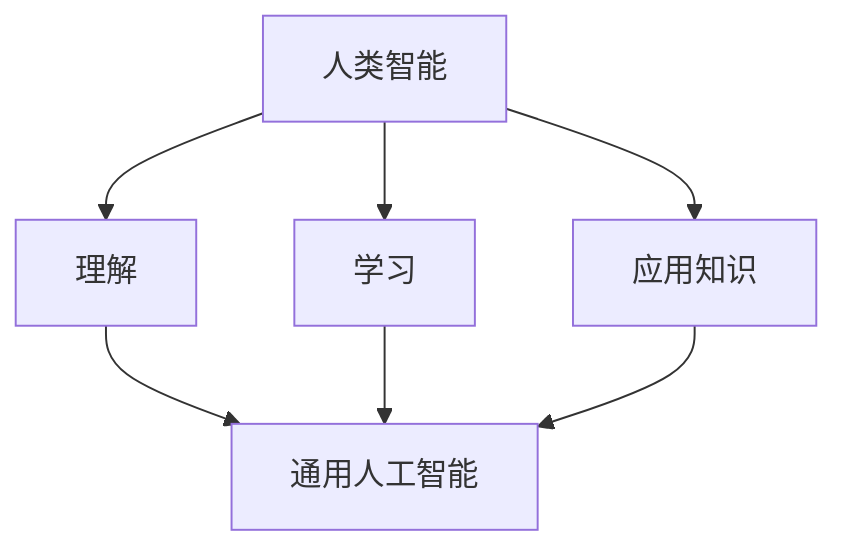
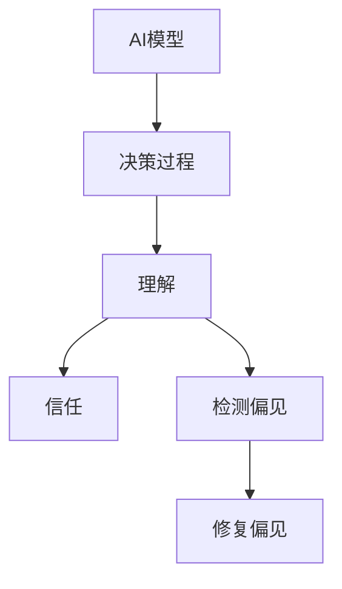
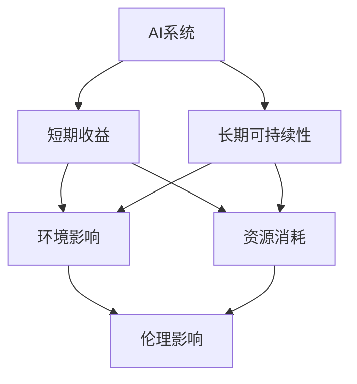
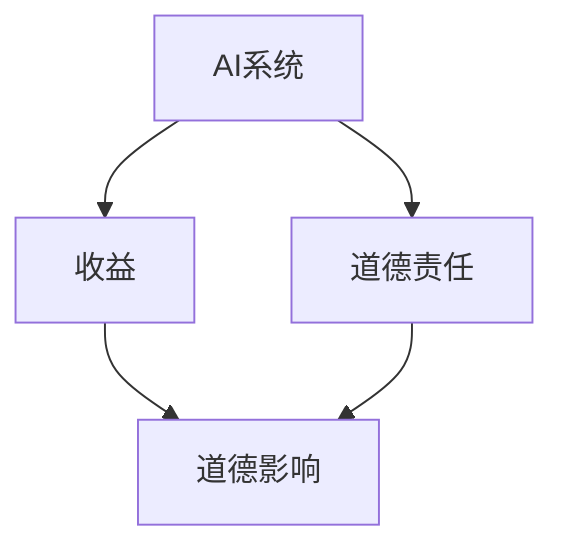

                 

**AI 2.0 时代的未来世界**

> 关键词：AI 2.0, 通用人工智能, 解释性 AI, 可持续 AI, 伦理人工智能, AI 伦理, AI 道德, AI 监管

## 1. 背景介绍

当前，我们正处于人工智能（AI）的第二个十年，也称为AI 2.0时代。第一个十年见证了深度学习和神经网络的兴起，带来了图像识别、语音识别和自然语言处理等领域的重大突破。然而，AI 2.0时代的特点是对通用人工智能（AGI）的追求，以及对解释性AI、可持续AI和伦理人工智能的关注。

## 2. 核心概念与联系

### 2.1 通用人工智能（AGI）

AGI指的是一种能够理解、学习和应用知识的智能，与人类智能相似。AGI将能够处理任何智能任务，而不仅仅是特定领域的任务。



### 2.2 解释性AI

解释性AI（XAI）侧重于使AI模型的决策过程更易于理解。XAI有助于建立信任，帮助人们理解AI系统的决策过程，并有助于检测和修复偏见。



### 2.3 可持续AI

可持续AI（SAI）关注AI系统的长期影响，包括环境影响、资源消耗和伦理影响。SAI寻求平衡AI系统的短期收益和长期可持续性。



### 2.4 伦理人工智能

伦理人工智能（Ethical AI）关注AI系统的道德和伦理影响。伦理人工智能寻求平衡AI系统的收益和道德责任。



## 3. 核心算法原理 & 具体操作步骤

### 3.1 算法原理概述

解释性AI的核心是理解AI模型的决策过程。这可以通过各种技术来实现，包括局部解释、全局解释和对比解释。

### 3.2 算法步骤详解

1. **局部解释**：使用局部解释方法，如LIME（本地解释方法），来理解模型的单个预测。LIME生成模型的局部近似模型，并使用该模型解释预测。
2. **全局解释**：使用全局解释方法，如SHAP（树提升的解释），来理解模型的全局行为。SHAP使用树提升方法来解释模型的预测。
3. **对比解释**：使用对比解释方法，如对比LIME，来理解模型的决策过程。对比解释方法比较模型在两种情况下的行为，从而解释模型的决策过程。

### 3.3 算法优缺点

**优点**：

* 使AI模型的决策过程更易于理解。
* 有助于建立信任。
* 有助于检测和修复偏见。

**缺点**：

* 解释方法的有效性取决于模型的复杂性。
* 解释方法可能会导致模型性能下降。
* 解释方法的结果可能会受到解释方法本身的限制。

### 3.4 算法应用领域

解释性AI在金融、医疗保健、司法和公共政策等领域有广泛的应用。例如，在金融领域，解释性AI有助于检测和修复信贷偏见。在医疗保健领域，解释性AI有助于理解和改进疾病诊断模型。

## 4. 数学模型和公式 & 详细讲解 & 举例说明

### 4.1 数学模型构建

解释性AI的数学模型基于机器学习模型。例如，神经网络模型可以表示为：

$$y = f(x; \theta)$$

其中，$y$是模型的预测，$x$是输入，$f$是模型的激活函数，$\theta$是模型的权重和偏置。

### 4.2 公式推导过程

解释性AI的数学模型基于模型的局部或全局行为。例如，LIME的数学模型基于模型的局部行为，可以表示为：

$$y = f(x; \theta) + \epsilon$$

其中，$\epsilon$是模型的误差。SHAP的数学模型基于模型的全局行为，可以表示为：

$$y = \phi(x) + \epsilon$$

其中，$\phi(x)$是模型的解释。

### 4.3 案例分析与讲解

例如，在信贷评分模型中，解释性AI可以帮助理解模型的决策过程。使用LIME，我们可以理解模型为什么拒绝某个申请人的贷款。使用SHAP，我们可以理解模型的全局行为，从而检测和修复偏见。

## 5. 项目实践：代码实例和详细解释说明

### 5.1 开发环境搭建

要实现解释性AI，需要安装Python、Scikit-learn、XGBoost和SHAP等库。可以使用Anaconda或Miniconda来管理依赖关系。

### 5.2 源代码详细实现

以下是使用SHAP解释XGBoost模型的示例代码：

```python
import xgboost as xgb
import shap

# 加载数据
X, y = shap.datasets.adult()

# 训练模型
model = xgb.XGBClassifier(use_label_encoder=False, eval_metric='mlogloss')
model.fit(X, y)

# 解释模型
explainer = shap.Explainer(model)
shap_values = explainer(X)

# 可视化解释结果
shap.plots.bar(shap_values)
```

### 5.3 代码解读与分析

在上述代码中，我们首先加载数据集，然后训练XGBoost模型。接着，我们使用SHAP的`Explainer`类来解释模型。最后，我们使用SHAP的`plots.bar`函数来可视化解释结果。

### 5.4 运行结果展示

运行上述代码后，我们可以看到模型的解释结果，包括每个特征的重要性和每个实例的解释。

## 6. 实际应用场景

### 6.1 当前应用

解释性AI当前在金融、医疗保健、司法和公共政策等领域有广泛的应用。例如，在金融领域，解释性AI有助于检测和修复信贷偏见。在医疗保健领域，解释性AI有助于理解和改进疾病诊断模型。

### 6.2 未来应用展望

未来，解释性AI将在自动驾驶、人机交互和虚拟现实等领域有广泛的应用。例如，在自动驾驶领域，解释性AI有助于理解和改进自动驾驶模型的决策过程。在人机交互领域，解释性AI有助于理解和改进人机交互模型的决策过程。

## 7. 工具和资源推荐

### 7.1 学习资源推荐

* "Explainable AI (XAI) - A Survey"：<https://arxiv.org/abs/1906.02250>
* "Why Should I Trust You?": Explaining the Predictions of Any Classifier: <https://arxiv.org/abs/1606.06372>
* "A Unified Approach to Interpreting Model Predictions": <https://christophm.github.io/interpretable-ml-book/>

### 7.2 开发工具推荐

* Scikit-learn：<https://scikit-learn.org/>
* XGBoost：<https://xgboost.readthedocs.io/en/latest/>
* SHAP：<https://shap.readthedocs.io/en/latest/>

### 7.3 相关论文推荐

* "A Unified Approach to Interpreting Model Predictions": <https://arxiv.org/abs/1602.04938>
* "LIME: Explaining the Predictions of Any Classifier": <https://arxiv.org/abs/1602.04938>

## 8. 总结：未来发展趋势与挑战

### 8.1 研究成果总结

本文介绍了解释性AI的核心概念、算法原理、数学模型和应用场景。我们还提供了代码实例和工具推荐。

### 8.2 未来发展趋势

未来，解释性AI将继续发展，以满足通用人工智能和可持续人工智能的需求。解释性AI将在更多领域得到应用，并与其他人工智能技术结合使用。

### 8.3 面临的挑战

解释性AI面临的挑战包括解释方法的有效性、模型复杂性和解释结果的可靠性。此外，解释性AI的伦理和道德影响也需要进一步研究。

### 8.4 研究展望

未来的研究将关注解释性AI的通用性、可解释性和可持续性。此外，研究还将关注解释性AI的伦理和道德影响，以及解释性AI与其他人工智能技术的结合。

## 9. 附录：常见问题与解答

**Q1：解释性AI与可解释AI有何区别？**

A1：解释性AI（XAI）侧重于使AI模型的决策过程更易于理解，而可解释AI（EI）侧重于使AI模型的内部结构更易于理解。XAI和EI是相关但不同的概念。

**Q2：解释性AI的局限性是什么？**

A2：解释性AI的局限性包括解释方法的有效性、模型复杂性和解释结果的可靠性。此外，解释性AI的伦理和道德影响也需要进一步研究。

**Q3：解释性AI的未来发展方向是什么？**

A3：未来，解释性AI将继续发展，以满足通用人工智能和可持续人工智能的需求。解释性AI将在更多领域得到应用，并与其他人工智能技术结合使用。

## 作者：禅与计算机程序设计艺术 / Zen and the Art of Computer Programming

