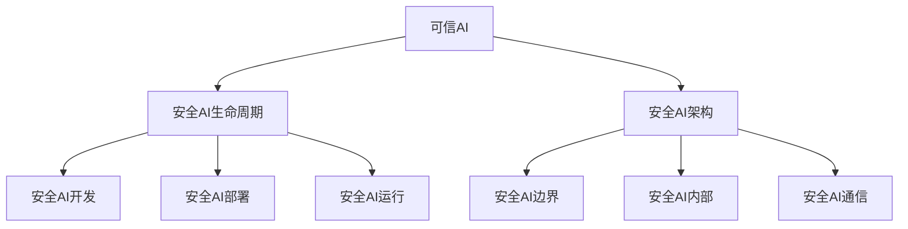

                 

**AI 2.0 时代：安全基础设施的演进**

**作者：禅与计算机程序设计艺术 / Zen and the Art of Computer Programming**

## 1. 背景介绍

随着人工智能（AI）的飞速发展，我们已经进入了AI 2.0时代。在这个新时代，AI不再只是一个单一的技术，而是成为了一种基础设施，渗透到各个行业和领域。然而，伴随着AI的广泛应用，安全问题也日益凸显。本文将探讨AI 2.0时代安全基础设施的演进，包括核心概念、算法原理、数学模型、项目实践，以及未来发展趋势。

## 2. 核心概念与联系

在AI 2.0时代，安全基础设施的核心概念包括可信AI、安全AI生命周期、安全AI架构等。这些概念是相互联系的，共同构成了AI安全基础设施的框架。



## 3. 核心算法原理 & 具体操作步骤

### 3.1 算法原理概述

在AI 2.0时代，安全算法的核心原理包括异常检测、模型安全、差分隐私等。这些算法旨在保护AI系统免受各种安全威胁。

### 3.2 算法步骤详解

1. **异常检测算法**：使用机器学习技术，如支持向量机（SVM）或自动编码器（AE），检测系统中的异常行为。
2. **模型安全算法**：使用模型压缩、模型加密等技术，保护AI模型免受窃取和篡改。
3. **差分隐私算法**：使用随机噪声机制，保护隐私数据的安全。

### 3.3 算法优缺点

- **异常检测算法**：优点是可以检测各种异常行为，缺点是可能出现误报或漏报。
- **模型安全算法**：优点是可以保护模型免受窃取和篡改，缺点是可能会导致模型精度下降。
- **差分隐私算法**：优点是可以保护隐私数据的安全，缺点是可能会导致数据精度下降。

### 3.4 算法应用领域

这些安全算法可以应用于各种AI系统，包括自动驾驶、金融风控、医疗诊断等。

## 4. 数学模型和公式 & 详细讲解 & 举例说明

### 4.1 数学模型构建

在AI 2.0时代，安全基础设施的数学模型可以使用博弈论、信息论等理论构建。

### 4.2 公式推导过程

例如，在差分隐私算法中，数据加噪声的过程可以使用以下公式表示：

$$y = x + \mathcal{N}(0, \sigma^2)$$

其中，$x$是原始数据，$y$是加噪声后的数据，$\mathcal{N}(0, \sigma^2)$是服从正态分布的随机噪声，$\sigma$是噪声强度。

### 4.3 案例分析与讲解

例如，在自动驾驶系统中，可以使用异常检测算法检测系统中的异常行为，如突然的加速或刹车。如果检测到异常行为，系统可以采取相应的措施，如发出警报或自动控制车辆。

## 5. 项目实践：代码实例和详细解释说明

### 5.1 开发环境搭建

在开始项目实践之前，需要搭建开发环境。推荐使用Python和相关的AI库，如TensorFlow或PyTorch。

### 5.2 源代码详细实现

以下是一个简单的异常检测算法的Python实现：

```python
import numpy as np
from sklearn.svm import OneClassSVM

# 生成数据
X = np.concatenate([np.random.randn(200, 2), np.random.uniform(low=-4, high=4, size=(20, 2))])

# 训练异常检测模型
clf = OneClassSVM(gamma='scale')
clf.fit(X)

# 检测异常
y_pred = clf.predict(X)
print("Number of outliers:", np.sum(y_pred == -1))
```

### 5.3 代码解读与分析

在代码中，我们首先生成了一个包含正常数据和异常数据的数据集。然后，我们使用支持向量机（SVM）训练了一个异常检测模型。最后，我们使用模型检测数据集中的异常数据。

### 5.4 运行结果展示

运行代码后，输出的结果应该是异常数据的数量。

## 6. 实际应用场景

### 6.1 当前应用

在当前的AI 2.0时代，安全基础设施已经广泛应用于各个行业，包括金融、医疗、交通等。

### 6.2 未来应用展望

未来，安全基础设施将会更加智能化，能够自动检测和响应安全威胁。此外，安全基础设施也将更加集成化，能够与其他基础设施无缝集成。

## 7. 工具和资源推荐

### 7.1 学习资源推荐

推荐阅读相关的学术论文和书籍，如"Artificial Intelligence: A Modern Approach"和"Deep Learning"。

### 7.2 开发工具推荐

推荐使用Python和相关的AI库，如TensorFlow或PyTorch。此外，也可以使用专门的安全AI平台，如Trusted AI。

### 7.3 相关论文推荐

推荐阅读以下论文：

- "Differential Privacy: A Survey of Results" (Nissim et al., 2007)
- "Robust and Efficient Outlier Detection via One-Class SVM" (Schölkopf et al., 2001)

## 8. 总结：未来发展趋势与挑战

### 8.1 研究成果总结

本文总结了AI 2.0时代安全基础设施的核心概念、算法原理、数学模型、项目实践等。

### 8.2 未来发展趋势

未来，安全基础设施将会更加智能化、集成化，能够自动检测和响应安全威胁。

### 8.3 面临的挑战

然而，安全基础设施的发展也面临着挑战，包括安全算法的有效性、数据隐私保护等。

### 8.4 研究展望

未来的研究方向包括安全算法的优化、安全AI生命周期的管理、安全AI架构的设计等。

## 9. 附录：常见问题与解答

**Q：什么是AI 2.0时代？**

A：AI 2.0时代是指AI不再只是一个单一的技术，而是成为了一种基础设施，渗透到各个行业和领域的时代。

**Q：什么是安全基础设施？**

A：安全基础设施是指保护系统免受安全威胁的基础设施，包括安全算法、安全AI生命周期、安全AI架构等。

**Q：什么是可信AI？**

A：可信AI是指能够保证系统安全和可靠的AI系统。可信AI包括安全AI生命周期、安全AI架构等。

**Q：什么是差分隐私？**

A：差分隐私是一种保护隐私数据安全的技术，通过添加随机噪声来实现。

**Q：什么是异常检测算法？**

A：异常检测算法是一种检测系统中的异常行为的算法，常用于安全基础设施中。

**Q：什么是模型安全算法？**

A：模型安全算法是一种保护AI模型免受窃取和篡改的算法，常用于安全基础设施中。

**Q：什么是安全AI生命周期？**

A：安全AI生命周期是指AI系统从开发、部署到运行的整个生命周期，包括安全AI开发、安全AI部署、安全AI运行等。

**Q：什么是安全AI架构？**

A：安全AI架构是指保护AI系统免受安全威胁的架构，包括安全AI边界、安全AI内部、安全AI通信等。

**Q：什么是博弈论？**

A：博弈论是一种研究决策的数学理论，常用于构建安全基础设施的数学模型。

**Q：什么是信息论？**

A：信息论是一种研究信息传输的数学理论，常用于构建安全基础设施的数学模型。

**Q：什么是支持向量机（SVM）？**

A：支持向量机（SVM）是一种常用于异常检测算法的机器学习技术。

**Q：什么是自动编码器（AE）？**

A：自动编码器（AE）是一种常用于异常检测算法的机器学习技术。

**Q：什么是正态分布？**

A：正态分布是一种常见的概率分布，常用于差分隐私算法中。

**Q：什么是噪声强度？**

A：噪声强度是差分隐私算法中的一个参数，表示添加到数据中的随机噪声的强度。

**Q：什么是自动驾驶系统？**

A：自动驾驶系统是一种使用AI技术实现的交通工具控制系统。

**Q：什么是金融风控？**

A：金融风控是指金融机构对风险的识别、评估、监测和管理的过程。

**Q：什么是医疗诊断？**

A：医疗诊断是指医生根据病人的症状和检查结果，对病人的病情进行判断和诊断的过程。

**Q：什么是Python？**

A：Python是一种广泛使用的编程语言，常用于AI开发。

**Q：什么是TensorFlow？**

A：TensorFlow是一种广泛使用的AI库，常用于AI开发。

**Q：什么是PyTorch？**

A：PyTorch是一种广泛使用的AI库，常用于AI开发。

**Q：什么是Trusted AI？**

A：Trusted AI是一种专门的安全AI平台，常用于安全AI开发。

**Q：什么是异常数据？**

A：异常数据是指不符合正常分布的数据，常用于异常检测算法中。

**Q：什么是误报？**

A：误报是指将正常数据错误地检测为异常数据的情况。

**Q：什么是漏报？**

A：漏报是指将异常数据错误地检测为正常数据的情况。

**Q：什么是模型精度？**

A：模型精度是指模型预测结果的准确性，常用于评估模型安全算法的性能。

**Q：什么是数据精度？**

A：数据精度是指数据的准确性，常用于评估差分隐私算法的性能。

**Q：什么是智能化？**

A：智能化是指系统能够自动学习和适应的特性，常用于描述未来安全基础设施的发展趋势。

**Q：什么是集成化？**

A：集成化是指系统能够无缝集成到其他系统中的特性，常用于描述未来安全基础设施的发展趋势。

**Q：什么是安全算法的有效性？**

A：安全算法的有效性是指安全算法能够有效地保护系统免受安全威胁的能力。

**Q：什么是数据隐私保护？**

A：数据隐私保护是指保护数据不被非法访问和泄露的技术和措施。

**Q：什么是未来研究方向？**

A：未来研究方向是指未来需要进行研究和开发的领域，常用于描述未来安全基础设施的发展方向。

**Q：什么是安全AI开发？**

A：安全AI开发是指在AI系统的开发过程中考虑安全因素的过程。

**Q：什么是安全AI部署？**

A：安全AI部署是指在AI系统的部署过程中考虑安全因素的过程。

**Q：什么是安全AI运行？**

A：安全AI运行是指在AI系统的运行过程中考虑安全因素的过程。

**Q：什么是安全AI边界？**

A：安全AI边界是指保护AI系统免受外部安全威胁的措施。

**Q：什么是安全AI内部？**

A：安全AI内部是指保护AI系统免受内部安全威胁的措施。

**Q：什么是安全AI通信？**

A：安全AI通信是指保护AI系统免受通信安全威胁的措施。

**Q：什么是信息传输？**

A：信息传输是指信息从一个地方传输到另一个地方的过程。

**Q：什么是决策？**

A：决策是指根据一定的目标和条件，选择最优方案的过程。

**Q：什么是数学模型？**

A：数学模型是指使用数学语言描述系统的模型。

**Q：什么是公式推导过程？**

A：公式推导过程是指使用数学推导得出公式的过程。

**Q：什么是案例分析与讲解？**

A：案例分析与讲解是指使用实际案例来说明数学模型和公式的过程。

**Q：什么是学术论文？**

A：学术论文是指在学术期刊上发表的研究成果。

**Q：什么是书籍？**

A：书籍是指印刷或电子形式的出版物。

**Q：什么是专门的安全AI平台？**

A：专门的安全AI平台是指专门用于安全AI开发的平台。

**Q：什么是未来展望？**

A：未来展望是指对未来发展趋势的预测和展望。

**Q：什么是研究成果总结？**

A：研究成果总结是指对研究成果的总结和回顾。

**Q：什么是面临的挑战？**

A：面临的挑常是指研究和开发过程中遇到的困难和问题。

**Q：什么是研究展望？**

A：研究展望是指对未来研究方向的展望和建议。

**Q：什么是常见问题与解答？**

A：常见问题与解答是指对常见问题的回答和解答。

**Q：什么是AI 2.0时代？**

A：AI 2.0时代是指AI不再只是一个单一的技术，而是成为了一种基础设施，渗透到各个行业和领域的时代。

**Q：什么是安全基础设施？**

A：安全基础设施是指保护系统免受安全威胁的基础设施，包括安全算法、安全AI生命周期、安全AI架构等。

**Q：什么是可信AI？**

A：可信AI是指能够保证系统安全和可靠的AI系统。可信AI包括安全AI生命周期、安全AI架构等。

**Q：什么是差分隐私？**

A：差分隐私是一种保护隐私数据安全的技术，通过添加随机噪声来实现。

**Q：什么是异常检测算法？**

A：异常检测算法是一种检测系统中的异常行为的算法，常用于安全基础设施中。

**Q：什么是模型安全算法？**

A：模型安全算法是一种保护AI模型免受窃取和篡改的算法，常用于安全基础设施中。

**Q：什么是安全AI生命周期？**

A：安全AI生命周期是指AI系统从开发、部署到运行的整个生命周期，包括安全AI开发、安全AI部署、安全AI运行等。

**Q：什么是安全AI架构？**

A：安全AI架构是指保护AI系统免受安全威胁的架构，包括安全AI边界、安全AI内部、安全AI通信等。

**Q：什么是博弈论？**

A：博弈论是一种研究决策的数学理论，常用于构建安全基础设施的数学模型。

**Q：什么是信息论？**

A：信息论是一种研究信息传输的数学理论，常用于构建安全基础设施的数学模型。

**Q：什么是支持向量机（SVM）？**

A：支持向量机（SVM）是一种常用于异常检测算法的机器学习技术。

**Q：什么是自动编码器（AE）？**

A：自动编码器（AE）是一种常用于异常检测算法的机器学习技术。

**Q：什么是正态分布？**

A：正态分布是一种常见的概率分布，常用于差分隐私算法中。

**Q：什么是噪声强度？**

A：噪声强度是差分隐私算法中的一个参数，表示添加到数据中的随机噪声的强度。

**Q：什么是自动驾驶系统？**

A：自动驾驶系统是一种使用AI技术实现的交通工具控制系统。

**Q：什么是金融风控？**

A：金融风控是指金融机构对风险的识别、评估、监测和管理的过程。

**Q：什么是医疗诊断？**

A：医疗诊断是指医生根据病人的症状和检查结果，对病人的病情进行判断和诊断的过程。

**Q：什么是Python？**

A：Python是一种广泛使用的编程语言，常用于AI开发。

**Q：什么是TensorFlow？**

A：TensorFlow是一种广泛使用的AI库，常用于AI开发。

**Q：什么是PyTorch？**

A：PyTorch是一种广泛使用的AI库，常用于AI开发。

**Q：什么是Trusted AI？**

A：Trusted AI是一种专门的安全AI平台，常用于安全AI开发。

**Q：什么是异常数据？**

A：异常数据是指不符合正常分布的数据，常用于异常检测算法中。

**Q：什么是误报？**

A：误报是指将正常数据错误地检测为异常数据的情况。

**Q：什么是漏报？**

A：漏报是指将异常数据错误地检测为正常数据的情况。

**Q：什么是模型精度？**

A：模型精度是指模型预测结果的准确性，常用于评估模型安全算法的性能。

**Q：什么是数据精度？**

A：数据精度是指数据的准确性，常用于评估差分隐私算法的性能。

**Q：什么是智能化？**

A：智能化是指系统能够自动学习和适应的特性，常用于描述未来安全基础设施的发展趋势。

**Q：什么是集成化？**

A：集成化是指系统能够无缝集成到其他系统中的特性，常用于描述未来安全基础设施的发展趋势。

**Q：什么是安全算法的有效性？**

A：安全算法的有效性是指安全算法能够有效地保护系统免受安全威胁的能力。

**Q：什么是数据隐私保护？**

A：数据隐私保护是指保护数据不被非法访问和泄露的技术和措施。

**Q：什么是未来研究方向？**

A：未来研究方向是指未来需要进行研究和开发的领域，常用于描述未来安全基础设施的发展方向。

**Q：什么是安全AI开发？**

A：安全AI开发是指在AI系统的开发过程中考虑安全因素的过程。

**Q：什么是安全AI部署？**

A：安全AI部署是指在AI系统的部署过程中考虑安全因素的过程。

**Q：什么是安全AI运行？**

A：安全AI运行是指在AI系统的运行过程中考虑安全因素的过程。

**Q：什么是安全AI边界？**

A：安全AI边界是指保护AI系统免受外部安全威胁的措施。

**Q：什么是安全AI内部？**

A：安全AI内部是指保护AI系统免受内部安全威胁的措施。

**Q：什么是安全AI通信？**

A：安全AI通信是指保护AI系统免受通信安全威胁的措施。

**Q：什么是信息传输？**

A：信息传输是指信息从一个地方传输到另一个地方的过程。

**Q：什么是决策？**

A：决策是指根据一定的目标和条件，选择最优方案的过程。

**Q：什么是数学模型？**

A：数学模型是指使用数学语言描述系统的模型。

**Q：什么是公式推导过程？**

A：公式推导过程是指使用数学推导得出公式的过程。

**Q：什么是案例分析与讲解？**

A：案例分析与讲解是指使用实际案例来说明数学模型和公式的过程。

**Q：什么是学术论文？**

A：学术论文是指在学术期刊上发表的研究成果。

**Q：什么是书籍？**

A：书籍是指印刷或电子形式的出版物。

**Q：什么是专门的安全AI平台？**

A：专门的安全AI平台是指专门用于安全AI开发的平台。

**Q：什么是未来展望？**

A：未来展望是指对未来发展趋势的预测和展望。

**Q：什么是研究成果总结？**

A：研究成果总结是指对研究成果的总结和回顾。

**Q：什么是面临的挑战？**

A：面临的挑常是指研究和开发过程中遇到的困难和问题。

**Q：什么是研究展望？**

A：研究展望是指对未来研究方向的展望和建议。

**Q：什么是常见问题与解答？**

A：常见问题与解答是指对常见问题的回答和解答。

