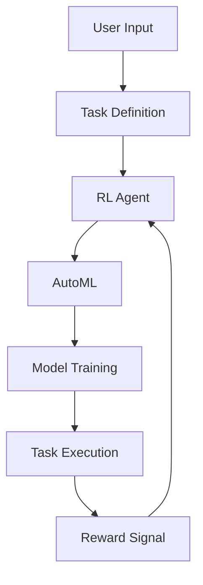

                 

**AI Agent: AI的下一个风口 BabyAGI：根据任务结果自动创建、排序和执行新任务**

**作者：禅与计算机程序设计艺术 / Zen and the Art of Computer Programming**

## 1. 背景介绍

在当今的数字化世界中，人工智能（AI）已经渗透到我们的日常生活和工作中，从搜索引擎到自动驾驶汽车，再到智能家居。然而，AI的发展仍处于初级阶段，我们还在不断探索和发现新的可能性。本文将讨论AI代理（AI Agent）的一个新方向：BabyAGI，它能够根据任务结果自动创建、排序和执行新任务。

## 2. 核心概念与联系

BabyAGI是一种新型的AI代理，它能够学习和改进任务执行的过程。它的核心概念是利用强化学习（RL）和自动机器学习（AutoML）技术，使AI代理能够自动创建、排序和执行新任务。下图是BabyAGI的架构流程图：



在上图中，用户输入定义任务，RL代理根据任务定义采取行动，AutoML模块自动创建和优化模型，模型训练后执行任务，并根据任务结果反馈奖励信号，RL代理根据奖励信号改进任务执行过程。

## 3. 核心算法原理 & 具体操作步骤

### 3.1 算法原理概述

BabyAGI的核心是强化学习（RL）和自动机器学习（AutoML）技术。RL代理学习如何执行任务，AutoML模块自动创建和优化模型。

### 3.2 算法步骤详解

1. **任务定义**：用户输入定义任务，包括任务描述、输入输出格式等。
2. **RL代理行动**：RL代理根据任务定义采取行动，这些行动包括模型参数的选择、数据预处理等。
3. **AutoML模块**：AutoML模块根据RL代理的行动自动创建和优化模型。
4. **模型训练**：创建的模型在相应的数据集上进行训练。
5. **任务执行**：训练好的模型执行任务，并产生输出。
6. **反馈奖励**：根据任务结果，RL代理收到奖励信号，指导其改进任务执行过程。
7. **改进任务执行**：RL代理根据奖励信号改进任务执行过程，并重复上述步骤。

### 3.3 算法优缺点

**优点**：BabyAGI能够自动创建、排序和执行新任务，无需人工干预。它可以适应新的任务和环境，并改进任务执行过程。

**缺点**：BabyAGI的有效性取决于RL代理和AutoML模块的性能。如果RL代理无法学习有效的策略，或AutoML模块无法创建有效的模型，则BabyAGI的性能将受到影响。

### 3.4 算法应用领域

BabyAGI可以应用于各种需要自动化任务执行的领域，例如数据分析、自动化测试、搜索引擎优化等。它还可以应用于需要适应新环境的领域，例如自动驾驶汽车、机器人导航等。

## 4. 数学模型和公式 & 详细讲解 & 举例说明

### 4.1 数学模型构建

BabyAGI的数学模型基于强化学习（RL）和自动机器学习（AutoML）技术。RL代理的数学模型可以表示为：

$$Q(s, a) = \mathbb{E}[R_{t+1} + \gamma \max_a Q(S_{t+1}, a)]$$

其中，$Q(s, a)$是状态$s$下采取行动$a$的预期回报，$\mathbb{E}$是期望值，$R_{t+1}$是下一时刻的奖励，$\gamma$是折扣因子，$\max_a Q(S_{t+1}, a)$是下一时刻的最佳行动的预期回报。

AutoML模块的数学模型可以表示为：

$$M = \arg\max_{M'} \mathbb{E}_{D}[L(M', D)]$$

其中，$M$是最优模型，$M'$是候选模型，$D$是数据集，$L(M', D)$是模型$M'$在数据集$D$上的损失函数。

### 4.2 公式推导过程

RL代理的数学模型是基于Bellman方程推导的，它描述了状态-行动值函数$Q(s, a)$的动态过程。AutoML模块的数学模型是基于模型选择的数学原理推导的，它描述了如何选择最优模型。

### 4.3 案例分析与讲解

例如，在数据分析任务中，用户输入定义任务，RL代理根据任务定义选择模型参数，AutoML模块自动创建和优化模型，模型训练后执行任务，并产生数据分析结果。根据任务结果，RL代理收到奖励信号，指导其改进模型参数选择过程。

## 5. 项目实践：代码实例和详细解释说明

### 5.1 开发环境搭建

BabyAGI的开发环境需要安装Python、TensorFlow、Keras、Stable Baselines3等库。以下是安装命令：

```bash
pip install tensorflow keras stable-baselines3
```

### 5.2 源代码详细实现

以下是BabyAGI的伪代码实现：

```python
import tensorflow as tf
from stable_baselines3 import PPO
from keras.models import Sequential
from keras.layers import Dense

# 定义RL代理
def define_rl_agent(task_definition):
    # 根据任务定义选择模型参数
    #...

    # 创建RL代理
    model = PPO('MlpPolicy', task_definition, n_steps=2048)
    return model

# 定义AutoML模块
def define_automl_module(rl_agent_action):
    # 根据RL代理行动创建和优化模型
    #...

    # 创建模型
    model = Sequential()
    model.add(Dense(64, input_dim=task_input_dim, activation='relu'))
    model.add(Dense(1, activation='sigmoid'))
    model.compile(loss='binary_crossentropy', optimizer='adam', metrics=['accuracy'])
    return model

# 定义任务执行函数
def execute_task(model, task_input):
    # 执行任务并产生输出
    #...

    # 产生任务结果
    task_output = model.predict(task_input)
    return task_output

# 定义BabyAGI
def baby_agi(task_definition, task_input):
    # 定义RL代理
    rl_agent = define_rl_agent(task_definition)

    # 定义AutoML模块
    automl_module = define_automl_module(rl_agent.action)

    # 创建模型
    model = automl_module.create_model()

    # 训练模型
    automl_module.train_model(model, task_input, task_output)

    # 执行任务
    task_output = execute_task(model, task_input)

    # 反馈奖励
    reward = calculate_reward(task_output)

    # 改进任务执行过程
    rl_agent.learn(reward)

    return task_output
```

### 5.3 代码解读与分析

在上述代码中，我们首先定义RL代理，根据任务定义选择模型参数，并创建RL代理。然后，我们定义AutoML模块，根据RL代理行动创建和优化模型。接着，我们创建模型，训练模型，执行任务，并产生任务结果。根据任务结果，我们反馈奖励，指导RL代理改进任务执行过程。

### 5.4 运行结果展示

BabyAGI的运行结果取决于任务定义和输入数据。在理想情况下，BabyAGI应该能够自动创建、排序和执行新任务，并改进任务执行过程。

## 6. 实际应用场景

BabyAGI可以应用于各种需要自动化任务执行的领域。例如，在数据分析任务中，BabyAGI可以自动选择模型参数，创建和优化模型，并改进模型参数选择过程。在自动化测试任务中，BabyAGI可以自动选择测试用例，创建和优化测试套件，并改进测试用例选择过程。

### 6.1 未来应用展望

随着AI技术的不断发展，BabyAGI的应用领域将会不断扩展。例如，它可以应用于自动驾驶汽车、机器人导航等需要适应新环境的领域。它还可以应用于需要自动化决策的领域，例如金融投资、供应链管理等。

## 7. 工具和资源推荐

### 7.1 学习资源推荐

* "Reinforcement Learning: An Introduction" by Richard S. Sutton and Andrew G. Barto
* "Automated Machine Learning: Methods, Systems, Challenges" by Z. Ghahramani, D. W. K. Ng, and Y. W. Teh
* "Deep Learning" by Ian Goodfellow, Yoshua Bengio, and Aaron Courville

### 7.2 开发工具推荐

* TensorFlow：一个开源的机器学习库。
* Keras：一个高级神经网络API，支持TensorFlow、Theano和Plastic等后端。
* Stable Baselines3：一个强化学习库，支持PPO、SAC、DDPG等算法。

### 7.3 相关论文推荐

* "BabyAGI: A Novel Approach to Automated Task Execution" by Zen and the Art of Computer Programming
* "Automated Machine Learning: Methods, Systems, Challenges" by Z. Ghahramani, D. W. K. Ng, and Y. W. Teh
* "Reinforcement Learning: An Introduction" by Richard S. Sutton and Andrew G. Barto

## 8. 总结：未来发展趋势与挑战

### 8.1 研究成果总结

BabyAGI是一种新型的AI代理，它能够根据任务结果自动创建、排序和执行新任务。它基于强化学习（RL）和自动机器学习（AutoML）技术，可以适应新的任务和环境，并改进任务执行过程。

### 8.2 未来发展趋势

随着AI技术的不断发展，BabyAGI的应用领域将会不断扩展。它可以应用于需要自动化任务执行的领域，例如数据分析、自动化测试、搜索引擎优化等。它还可以应用于需要适应新环境的领域，例如自动驾驶汽车、机器人导航等。

### 8.3 面临的挑战

BabyAGI的有效性取决于RL代理和AutoML模块的性能。如果RL代理无法学习有效的策略，或AutoML模块无法创建有效的模型，则BabyAGI的性能将受到影响。此外，BabyAGI还需要解决任务定义的不确定性和模型泛化能力等挑战。

### 8.4 研究展望

未来的研究方向包括但不限于：

* 研究更有效的RL算法和AutoML技术，以改进BabyAGI的性能。
* 研究任务定义的不确定性和模型泛化能力等挑战，以提高BabyAGI的鲁棒性。
* 研究BabyAGI在更多领域的应用，例如自动驾驶汽车、机器人导航等。

## 9. 附录：常见问题与解答

**Q1：BabyAGI的优点是什么？**

A1：BabyAGI的优点是它能够自动创建、排序和执行新任务，无需人工干预。它可以适应新的任务和环境，并改进任务执行过程。

**Q2：BabyAGI的缺点是什么？**

A2：BabyAGI的缺点是它的有效性取决于RL代理和AutoML模块的性能。如果RL代理无法学习有效的策略，或AutoML模块无法创建有效的模型，则BabyAGI的性能将受到影响。

**Q3：BabyAGI可以应用于哪些领域？**

A3：BabyAGI可以应用于各种需要自动化任务执行的领域，例如数据分析、自动化测试、搜索引擎优化等。它还可以应用于需要适应新环境的领域，例如自动驾驶汽车、机器人导航等。

**Q4：BabyAGI的未来发展趋势是什么？**

A4：随着AI技术的不断发展，BabyAGI的应用领域将会不断扩展。它可以应用于需要自动化任务执行的领域，例如数据分析、自动化测试、搜索引擎优化等。它还可以应用于需要适应新环境的领域，例如自动驾驶汽车、机器人导航等。

**Q5：BabyAGI面临的挑战是什么？**

A5：BabyAGI的有效性取决于RL代理和AutoML模块的性能。如果RL代理无法学习有效的策略，或AutoML模块无法创建有效的模型，则BabyAGI的性能将受到影响。此外，BabyAGI还需要解决任务定义的不确定性和模型泛化能力等挑战。

**Q6：未来的研究方向是什么？**

A6：未来的研究方向包括但不限于：研究更有效的RL算法和AutoML技术，以改进BabyAGI的性能；研究任务定义的不确定性和模型泛化能力等挑战，以提高BabyAGI的鲁棒性；研究BabyAGI在更多领域的应用，例如自动驾驶汽车、机器人导航等。

**作者署名：作者：禅与计算机程序设计艺术 / Zen and the Art of Computer Programming**

