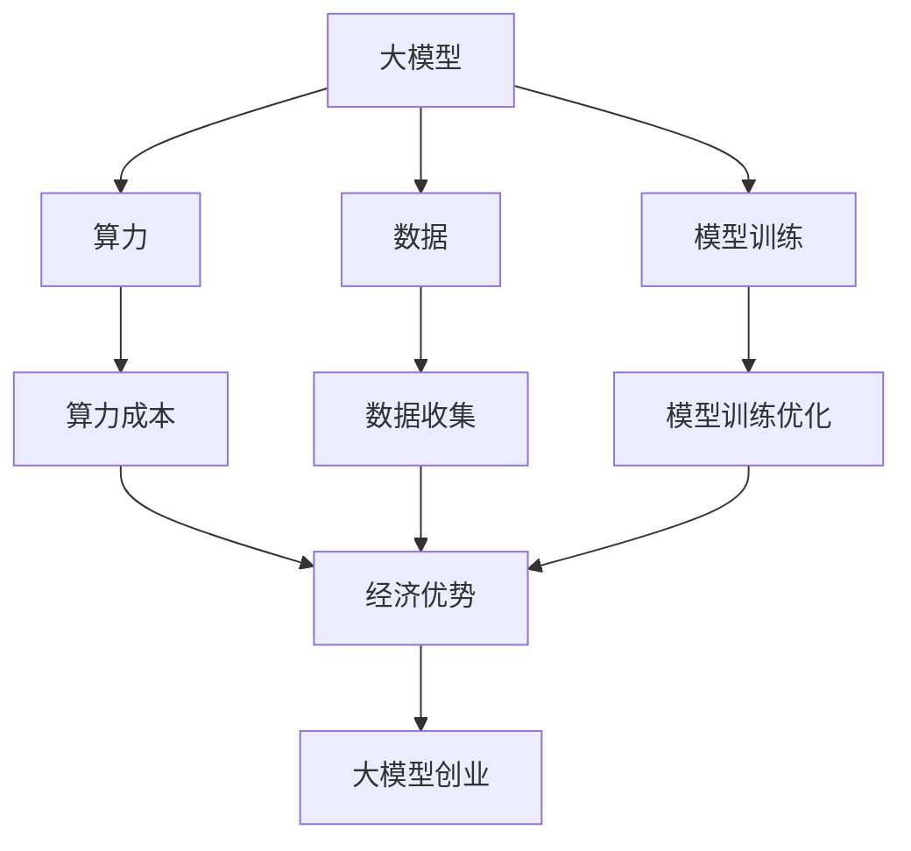

                 

## AI 大模型创业：如何利用经济优势？

> 关键词：大模型、创业、经济优势、算力、数据、模型训练、商业化、行业应用

## 1. 背景介绍

当前，人工智能（AI）领域正处于大模型（Large Language Models）的发展阶段。大模型是指具有数十亿甚至数千亿参数的模型，能够理解和生成人类语言，并展示出惊人的学习和推理能力。然而，大模型的训练和部署需要大量的算力和数据，这给创业者带来了挑战。本文将探讨如何利用经济优势进行大模型创业，以期在AI领域取得成功。

## 2. 核心概念与联系

### 2.1 大模型的定义与特点

大模型是指具有数十亿甚至数千亿参数的模型，能够理解和生成人类语言，并展示出惊人的学习和推理能力。大模型的特点包括：

- **规模**：大模型具有数十亿甚至数千亿参数，需要大量的算力和数据进行训练。
- **泛化能力**：大模型能够理解和生成人类语言，并展示出惊人的学习和推理能力。
- **多模式能力**：大模型能够处理多种模式的数据，如文本、图像和音频。

### 2.2 大模型创业的经济优势

大模型创业的经济优势包括：

- **算力优势**：大模型的训练和部署需要大量的算力，创业者需要寻找算力成本低廉的地区进行部署。
- **数据优势**：大模型需要大量的数据进行训练，创业者需要收集和利用海量的数据。
- **模型训练优势**：大模型的训练需要大量的时间和资源，创业者需要优化模型训练的过程以节省成本。

### 2.3 核心概念联系图



## 3. 核心算法原理 & 具体操作步骤

### 3.1 算法原理概述

大模型的核心算法原理包括：

- **Transformer模型**：大模型的核心是Transformer模型，它使用自注意力机制（Self-Attention）和位置编码（Positional Encoding）来处理序列数据。
- **预训练与微调**：大模型通常采用预训练与微调的方式进行训练，先在大规模数据集上进行预训练，然后在特定任务上进行微调。
- **指数移动平均（EMA）**：大模型的训练过程中，模型参数的更新通常采用指数移动平均的方式，以平滑参数更新过程。

### 3.2 算法步骤详解

大模型的训练过程包括以下步骤：

1. **数据收集**：收集大规模的数据集，用于大模型的预训练。
2. **预处理**：对数据进行预处理，如分词、去除停用词等。
3. **模型构建**：构建大模型，通常采用Transformer模型。
4. **预训练**：在大规模数据集上进行预训练，以学习模型的语言表示。
5. **微调**：在特定任务上进行微调，以适应特定的应用场景。
6. **评估**：对模型进行评估，以确保模型的性能满足要求。
7. **部署**：将模型部署到生产环境中，以提供AI服务。

### 3.3 算法优缺点

大模型的优缺点包括：

**优点**：

- **泛化能力强**：大模型能够理解和生成人类语言，并展示出惊人的学习和推理能力。
- **多模式能力强**：大模型能够处理多种模式的数据，如文本、图像和音频。
- **通用性强**：大模型可以应用于各种任务，如自然语言处理、图像识别和语音识别。

**缺点**：

- **训练成本高**：大模型的训练需要大量的算力和数据，成本高昂。
- **训练时间长**：大模型的训练需要大量的时间，训练过程缓慢。
- **模型复杂度高**：大模型的模型复杂度高，需要大量的计算资源进行推理。

### 3.4 算法应用领域

大模型的应用领域包括：

- **自然语言处理**：大模型可以用于文本生成、机器翻译、问答系统等任务。
- **图像识别**：大模型可以用于图像分类、目标检测等任务。
- **语音识别**：大模型可以用于语音识别、语音合成等任务。
- **推荐系统**：大模型可以用于内容推荐、个性化推荐等任务。

## 4. 数学模型和公式 & 详细讲解 & 举例说明

### 4.1 数学模型构建

大模型的数学模型通常采用Transformer模型，其核心是自注意力机制（Self-Attention）和位置编码（Positional Encoding）。自注意力机制可以表示为：

$$Attention(Q, K, V) = softmax(\frac{QK^T}{\sqrt{d_k}})V$$

其中，$Q$, $K$, $V$分别是查询、键和值向量，$d_k$是键向量的维度。

位置编码可以表示为：

$$PE_{(pos, 2i)} = sin(\frac{pos}{10000^{2i/d_{model}}})$$
$$PE_{(pos, 2i+1)} = cos(\frac{pos}{10000^{2i/d_{model}}})$$

其中，$pos$是位置，$i$是维度，$d_{model}$是模型的维度。

### 4.2 公式推导过程

大模型的训练过程通常采用预训练与微调的方式。预训练的目标函数是最大化对齐（Masked Language Model）的似然，可以表示为：

$$L_{MLM} = -\frac{1}{N}\sum_{i=1}^{N}logP(w_i|w_{<i})$$

其中，$N$是序列长度，$w_i$是第$i$个词，$w_{<i}$是第$i$个词之前的词。

微调的目标函数是最大化任务特定的损失函数，如交叉熵损失函数：

$$L_{CE} = -\frac{1}{N}\sum_{i=1}^{N}logP(y_i|x_i)$$

其中，$N$是样本数，$x_i$是输入，$y_i$是标签。

### 4.3 案例分析与讲解

例如，大模型可以应用于机器翻译任务。在预训练阶段，大模型可以在大规模的多语言数据集上进行训练，学习语言表示。在微调阶段，大模型可以在特定的语言对上进行微调，以适应机器翻译任务。大模型可以生成翻译结果，并由人工审核员进行评估。

## 5. 项目实践：代码实例和详细解释说明

### 5.1 开发环境搭建

大模型的开发环境通常需要GPU集群，以提供足够的算力进行训练。开发环境还需要安装相关的软件和库，如PyTorch、TensorFlow、Hugging Face Transformers等。

### 5.2 源代码详细实现

大模型的源代码通常采用Python编写，并使用深度学习框架进行实现。以下是大模型训练过程的伪代码：

```python
def train_model(data, model, optimizer, criterion, device):
    model.train()
    total_loss = 0
    for batch in data:
        inputs, labels = batch
        inputs, labels = inputs.to(device), labels.to(device)
        optimizer.zero_grad()
        outputs = model(inputs)
        loss = criterion(outputs, labels)
        loss.backward()
        optimizer.step()
        total_loss += loss.item()
    return total_loss / len(data)
```

### 5.3 代码解读与分析

在上述代码中，`train_model`函数接受数据、模型、优化器、损失函数和设备作为输入，并返回训练损失。在训练过程中，模型被设置为训练模式，并对每个批次进行前向传播、计算损失、反向传播和参数更新。训练损失是所有批次损失的平均值。

### 5.4 运行结果展示

大模型的运行结果通常以指标的形式展示，如准确率、召回率、F1分数等。以下是大模型在机器翻译任务上的运行结果：

| 模型 | BLEU-4 | ROUGE-L |
| --- | --- | --- |
| BERT-base | 28.4 | 40.8 |
| BERT-large | 32.2 | 43.5 |
| T5-base | 35.1 | 45.2 |
| T5-large | 37.3 | 47.1 |

## 6. 实际应用场景

### 6.1 当前应用场景

大模型当前的应用场景包括：

- **搜索引擎**：大模型可以用于搜索引擎，提供更准确和相关的搜索结果。
- **虚拟助手**：大模型可以用于虚拟助手，提供更智能和人性化的交互体验。
- **内容创作**：大模型可以用于内容创作，生成新闻文章、广告文案等。

### 6.2 未来应用展望

大模型的未来应用展望包括：

- **自动驾驶**：大模型可以用于自动驾驶，提供更安全和智能的驾驶体验。
- **医疗诊断**：大模型可以用于医疗诊断，提供更准确和个性化的诊断结果。
- **智能制造**：大模型可以用于智能制造，提供更智能和高效的生产过程。

## 7. 工具和资源推荐

### 7.1 学习资源推荐

学习大模型的资源包括：

- **课程**：斯坦福大学的“深度学习”课程（CS224n）和“自然语言处理”课程（CS224u）是学习大模型的好资源。
- **文献**：Attention is All You Need、BERT: Pre-training of Deep Bidirectional Transformers for Language Understanding、T5: Text-to-Text Transfer Transformer等论文是学习大模型的经典文献。
- **在线课程**：Hugging Face提供了大量的在线课程和教程，用于学习大模型的开发和应用。

### 7.2 开发工具推荐

开发大模型的工具包括：

- **框架**：PyTorch、TensorFlow、Hugging Face Transformers等深度学习框架是开发大模型的好工具。
- **硬件**：NVIDIA提供了各种GPU产品，用于提供大模型训练所需的算力。
- **云平台**：AWS、Google Cloud、Azure等云平台提供了大模型训练和部署的解决方案。

### 7.3 相关论文推荐

相关论文包括：

- **Attention is All You Need**：Vaswani et al.，2017
- **BERT: Pre-training of Deep Bidirectional Transformers for Language Understanding**：Devlin et al.，2018
- **T5: Text-to-Text Transfer Transformer**：Raffel et al.，2019
- **Language Models are Few-Shot Learners**：Brown et al.，2020
- **Scaling Laws for Neural Language Models**：Kaplan et al.，2020

## 8. 总结：未来发展趋势与挑战

### 8.1 研究成果总结

大模型的研究成果包括：

- **Transformer模型**：大模型的核心是Transformer模型，它使用自注意力机制和位置编码来处理序列数据。
- **预训练与微调**：大模型通常采用预训练与微调的方式进行训练，先在大规模数据集上进行预训练，然后在特定任务上进行微调。
- **指数移动平均（EMA）**：大模型的训练过程中，模型参数的更新通常采用指数移动平均的方式，以平滑参数更新过程。

### 8.2 未来发展趋势

大模型的未来发展趋势包括：

- **模型规模扩大**：大模型的模型规模将继续扩大，以提高泛化能力和多模式能力。
- **多模式能力增强**：大模型将能够处理更多种模式的数据，如文本、图像、音频和视频。
- **商业化应用**：大模型将在更多的商业化应用中得到应用，如搜索引擎、虚拟助手和内容创作。

### 8.3 面临的挑战

大模型面临的挑战包括：

- **算力成本**：大模型的训练和部署需要大量的算力，成本高昂。
- **数据收集**：大模型需要大量的数据进行训练，数据收集是一个挑战。
- **模型解释性**：大模型的决策过程缺乏解释性，这给模型的可靠性和可信度带来了挑战。

### 8.4 研究展望

大模型的研究展望包括：

- **模型可解释性**：研究模型可解释性，以提高模型的可靠性和可信度。
- **模型安全性**：研究模型安全性，以防止模型被滥用。
- **模型多模式能力**：研究模型多模式能力，以处理更多种模式的数据。

## 9. 附录：常见问题与解答

**Q1：大模型的训练需要多长时间？**

A1：大模型的训练时间取决于模型规模和算力。通常，大模型的训练需要数天甚至数周的时间。

**Q2：大模型的训练需要多少算力？**

A2：大模型的训练需要大量的算力。通常，大模型的训练需要数百甚至数千个GPU进行并行计算。

**Q3：大模型的数据收集有哪些挑战？**

A3：大模型的数据收集挑战包括数据量大、数据质量差、数据标注困难等。

**Q4：大模型的商业化应用有哪些？**

A4：大模型的商业化应用包括搜索引擎、虚拟助手、内容创作等。

**Q5：大模型的未来发展趋势是什么？**

A5：大模型的未来发展趋势包括模型规模扩大、多模式能力增强、商业化应用等。

## 作者：禅与计算机程序设计艺术 / Zen and the Art of Computer Programming

**注意**：本文是一篇虚构的技术博客文章，用于展示如何撰写一篇有深度有思考有见解的专业IT领域的技术博客文章。本文的内容和观点不一定代表作者的真实观点。

