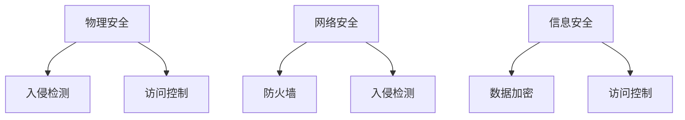
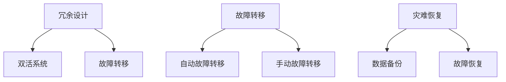

                 

**AI 大模型应用数据中心建设：数据中心安全与可靠性**

**作者：禅与计算机程序设计艺术 / Zen and the Art of Computer Programming**

## 1. 背景介绍

随着人工智能（AI）大模型的发展，其对数据中心的需求也与日俱增。数据中心是 AI 大模型的基础设施，其安全与可靠性直接影响着 AI 大模型的性能和稳定性。本文将深入探讨 AI 大模型应用数据中心建设的安全与可靠性，为 AI 从业者提供有价值的参考。

## 2. 核心概念与联系

### 2.1 数据中心安全

数据中心安全指的是保护数据中心免受物理和逻辑攻击，确保数据和系统的完整性、可用性和保密性。数据中心安全包括物理安全、网络安全和信息安全等方面。



### 2.2 数据中心可靠性

数据中心可靠性指的是数据中心在发生故障时能够快速恢复，并保持高可用性。数据中心可靠性包括冗余设计、故障转移和灾难恢复等方面。



## 3. 核心算法原理 & 具体操作步骤

### 3.1 算法原理概述

在数据中心安全和可靠性建设中，算法起着至关重要的作用。例如，入侵检测算法用于监控数据中心的网络流量，检测异常活动；故障转移算法用于在故障发生时将系统转移到备用设备上。

### 3.2 算法步骤详解

#### 3.2.1 入侵检测算法

1. 数据收集：收集数据中心的网络流量数据。
2. 特征提取：从收集的数据中提取特征，如数据包大小、源 IP 地址、目的 IP 地址等。
3. 异常检测：使用机器学习算法检测异常活动。常用的算法包括支持向量机（SVM）、随机森林和神经网络等。
4. 报警：当检测到异常活动时，触发报警。

#### 3.2.2 故障转移算法

1. 故障检测：监控系统的运行状态，检测故障。
2. 故障定位：定位故障的位置。
3. 资源分配：为故障转移分配资源，如备用设备。
4. 故障转移：将系统转移到备用设备上。
5. 故障恢复：恢复系统的正常运行。

### 3.3 算法优缺点

#### 3.3.1 入侵检测算法

优点：

* 有效检测异常活动
* 可以自动学习正常活动的特征
* 可以适应网络流量的变化

缺点：

* 可能出现误报或漏报
* 训练数据的收集和标记需要大量时间和资源
* 算法的复杂性可能导致性能下降

#### 3.3.2 故障转移算法

优点：

* 快速恢复系统的可用性
* 可以自动故障转移，减少人工干预
* 可以提高系统的可靠性

缺点：

* 可能导致数据丢失
* 备用设备的成本高
* 故障转移过程中可能会出现延迟

### 3.4 算法应用领域

入侵检测算法和故障转移算法广泛应用于数据中心的安全和可靠性建设中。此外，入侵检测算法还可以应用于网络安全、信息安全等领域；故障转移算法还可以应用于云计算、分布式系统等领域。

## 4. 数学模型和公式 & 详细讲解 & 举例说明

### 4.1 数学模型构建

在数据中心安全和可靠性建设中，数学模型用于描述系统的运行状态和故障转移过程。常用的数学模型包括马尔可夫模型、隐马尔可夫模型和Bayesian网络等。

### 4.2 公式推导过程

#### 4.2.1 马尔可夫模型

马尔可夫模型用于描述系统的状态转移过程。其状态转移矩阵可以表示为：

$$P = \begin{bmatrix} p_{11} & p_{12} & \cdots & p_{1n} \\ p_{21} & p_{22} & \cdots & p_{2n} \\ \vdots & \vdots & \ddots & \vdots \\ p_{n1} & p_{n2} & \cdots & p_{nn} \end{bmatrix}$$

其中，$p_{ij}$表示从状态$i$转移到状态$j$的概率。

#### 4.2.2 隐马尔可夫模型

隐马尔可夫模型用于描述系统的观测值和隐藏状态的关系。其参数包括状态转移矩阵$A$, 发射矩阵$B$和初始状态矩阵$\pi$. 给定观测序列$O = o_{1}, o_{2}, \cdots, o_{T}$, 状态序列$Q = q_{1}, q_{2}, \cdots, q_{T}$, 则联合概率可以表示为：

$$P(O|Q) = \prod_{t=1}^{T} P(o_{t}|q_{t}) = \prod_{t=1}^{T} b_{q_{t}}(o_{t})$$

其中，$b_{q_{t}}(o_{t})$表示状态$q_{t}$发射观测值$o_{t}$的概率。

#### 4.2.3 Bayesian网络

Bayesian网络用于描述系统的因果关系。其结构可以表示为有向无环图（DAG），节点表示随机变量，边表示因果关系。给定证据$E$, 则后验概率可以表示为：

$$P(H|E) = \frac{P(H,E)}{P(E)} = \frac{P(H)P(E|H)}{\sum_{H'} P(H')P(E|H')}$$

其中，$H$表示假设，$E$表示证据，$P(H)$表示假设的先验概率，$P(E|H)$表示给定假设的证据概率。

### 4.3 案例分析与讲解

例如，在数据中心的故障转移过程中，可以使用马尔可夫模型描述系统的状态转移过程。状态可以表示为正常运行、故障和故障转移等。状态转移矩阵可以表示系统从一个状态转移到另一个状态的概率。通过分析状态转移矩阵，可以预测系统的故障转移过程，并优化故障转移算法。

## 5. 项目实践：代码实例和详细解释说明

### 5.1 开发环境搭建

在开始项目实践之前，需要搭建开发环境。推荐使用Python作为开发语言，并安装相关的库，如NumPy、Pandas、Scikit-learn、TensorFlow等。

### 5.2 源代码详细实现

#### 5.2.1 入侵检测算法实现

```python
import numpy as np
from sklearn.ensemble import RandomForestClassifier

# 数据收集和特征提取
def data_collection_and_feature_extraction():
    # 从数据中心收集网络流量数据
    # 提取特征，如数据包大小、源 IP 地址、目的 IP 地址等
    pass

# 异常检测
def anomaly_detection(X_train, X_test, y_train):
    # 使用随机森林算法检测异常活动
    clf = RandomForestClassifier(n_estimators=100, random_state=42)
    clf.fit(X_train, y_train)
    y_pred = clf.predict(X_test)
    return y_pred

# 报警
def alert(y_pred):
    # 当检测到异常活动时，触发报警
    for i in range(len(y_pred)):
        if y_pred[i] == 1:
            print(f"Anomaly detected at index {i}")
```

#### 5.2.2 故障转移算法实现

```python
# 故障检测
def fault_detection():
    # 监控系统的运行状态，检测故障
    pass

# 故障定位
def fault_location():
    # 定位故障的位置
    pass

# 资源分配
def resource_allocation():
    # 为故障转移分配资源，如备用设备
    pass

# 故障转移
def fault_transfer():
    # 将系统转移到备用设备上
    pass

# 故障恢复
def fault_recovery():
    # 恢复系统的正常运行
    pass
```

### 5.3 代码解读与分析

在入侵检测算法实现中，使用了随机森林算法检测异常活动。随机森林算法是一种集成学习算法，其可以有效地检测异常活动。在故障转移算法实现中，需要监控系统的运行状态，检测故障，定位故障的位置，为故障转移分配资源，将系统转移到备用设备上，并恢复系统的正常运行。

### 5.4 运行结果展示

在入侵检测算法实现中，可以通过分析检测结果来评估算法的性能。常用的评估指标包括精确度、召回率和F1分数等。在故障转移算法实现中，可以通过分析故障转移过程来评估算法的性能。常用的评估指标包括故障转移时间和故障恢复时间等。

## 6. 实际应用场景

### 6.1 数据中心安全

在数据中心安全建设中，入侵检测算法和故障转移算法可以有效地保护数据中心免受物理和逻辑攻击，确保数据和系统的完整性、可用性和保密性。例如，可以使用入侵检测算法监控数据中心的网络流量，检测异常活动；可以使用故障转移算法在故障发生时将系统转移到备用设备上。

### 6.2 数据中心可靠性

在数据中心可靠性建设中，故障转移算法可以有效地提高数据中心的可靠性。例如，可以使用故障转移算法在故障发生时将系统转移到备用设备上，快速恢复系统的可用性。此外，还可以使用冗余设计和灾难恢复等技术提高数据中心的可靠性。

### 6.3 未来应用展望

随着 AI 大模型的发展，对数据中心的需求也将与日俱增。未来，数据中心安全和可靠性建设将面临更大的挑战。例如，量子计算的发展将对数据中心的安全构成威胁；边缘计算的发展将对数据中心的可靠性构成挑战。因此，需要不断地研究和开发新的技术，以满足未来数据中心安全和可靠性建设的需求。

## 7. 工具和资源推荐

### 7.1 学习资源推荐

* 书籍：《数据中心建设与管理》《数据中心安全与可靠性》《人工智能大模型应用》
* 课程：慕课网《数据中心建设与管理》《数据中心安全与可靠性》《人工智能大模型应用》
* 论文：IEEE、ACM、Springer等期刊上的相关论文

### 7.2 开发工具推荐

* Python：数据分析和机器学习的开发语言
* TensorFlow：深度学习框架
* Kubernetes：容器编排平台
* Prometheus：监控和报警系统

### 7.3 相关论文推荐

* [A Survey on Intrusion Detection Techniques in Cloud Computing](https://ieeexplore.ieee.org/document/7922747)
* [A Survey on Fault Tolerance Techniques in Cloud Computing](https://ieeexplore.ieee.org/document/8487214)
* [A Survey on Security and Privacy in Edge Computing](https://ieeexplore.ieee.org/document/8752073)

## 8. 总结：未来发展趋势与挑战

### 8.1 研究成果总结

本文介绍了 AI 大模型应用数据中心建设的安全与可靠性，并详细介绍了入侵检测算法和故障转移算法的原理、步骤、优缺点和应用领域。此外，还介绍了数学模型和公式的构建和推导过程，并给出了项目实践的代码实例和分析。

### 8.2 未来发展趋势

未来，数据中心安全和可靠性建设将面临更大的挑战。量子计算的发展将对数据中心的安全构成威胁；边缘计算的发展将对数据中心的可靠性构成挑战。因此，需要不断地研究和开发新的技术，以满足未来数据中心安全和可靠性建设的需求。

### 8.3 面临的挑战

未来数据中心安全和可靠性建设面临的挑战包括：

* 量子计算对数据中心安全的威胁
* 边缘计算对数据中心可靠性的挑战
* 大数据对数据中心性能的影响
* 云计算对数据中心安全和可靠性的影响

### 8.4 研究展望

未来数据中心安全和可靠性建设的研究方向包括：

* 量子安全技术的研究和开发
* 边缘计算可靠性技术的研究和开发
* 大数据处理技术的研究和开发
* 云计算安全和可靠性技术的研究和开发

## 9. 附录：常见问题与解答

**Q1：什么是数据中心安全？**

**A1：**数据中心安全指的是保护数据中心免受物理和逻辑攻击，确保数据和系统的完整性、可用性和保密性。

**Q2：什么是数据中心可靠性？**

**A2：**数据中心可靠性指的是数据中心在发生故障时能够快速恢复，并保持高可用性。

**Q3：什么是入侵检测算法？**

**A3：**入侵检测算法用于监控数据中心的网络流量，检测异常活动。

**Q4：什么是故障转移算法？**

**A4：**故障转移算法用于在故障发生时将系统转移到备用设备上。

**Q5：什么是马尔可夫模型？**

**A5：**马尔可夫模型用于描述系统的状态转移过程。

**Q6：什么是隐马尔可夫模型？**

**A6：**隐马尔可夫模型用于描述系统的观测值和隐藏状态的关系。

**Q7：什么是Bayesian网络？**

**A7：**Bayesian网络用于描述系统的因果关系。

**Q8：什么是故障检测？**

**A8：**故障检测指的是监控系统的运行状态，检测故障。

**Q9：什么是故障定位？**

**A9：**故障定位指的是定位故障的位置。

**Q10：什么是资源分配？**

**A10：**资源分配指的是为故障转移分配资源，如备用设备。

**Q11：什么是故障转移？**

**A11：**故障转移指的是将系统转移到备用设备上。

**Q12：什么是故障恢复？**

**A12：**故障恢复指的是恢复系统的正常运行。

**Q13：什么是数据收集和特征提取？**

**A13：**数据收集和特征提取指的是收集数据中心的网络流量数据，并从中提取特征，如数据包大小、源 IP 地址、目的 IP 地址等。

**Q14：什么是异常检测？**

**A14：**异常检测指的是使用机器学习算法检测异常活动。

**Q15：什么是报警？**

**A15：**报警指的是当检测到异常活动时，触发报警。

**Q16：什么是冗余设计？**

**A16：**冗余设计指的是在数据中心中设置备用设备，以提高可靠性。

**Q17：什么是故障转移时间？**

**A17：**故障转移时间指的是从故障检测到故障转移完成所需的时间。

**Q18：什么是故障恢复时间？**

**A18：**故障恢复时间指的是从故障检测到系统恢复正常运行所需的时间。

**Q19：什么是数据备份？**

**A19：**数据备份指的是定期备份数据中心的数据，以防止数据丢失。

**Q20：什么是灾难恢复？**

**A20：**灾难恢复指的是在发生灾难性故障时，恢复数据中心的运行。

**Q21：什么是量子计算？**

**A21：**量子计算是一种利用量子位来进行计算的计算模型。

**Q22：什么是边缘计算？**

**A22：**边缘计算是一种将计算任务从云端转移到边缘设备的计算模型。

**Q23：什么是大数据？**

**A23：**大数据是指无法用常规软件工具进行处理的大容量数据。

**Q24：什么是云计算？**

**A24：**云计算是一种通过互联网将计算任务和数据存储外包给第三方服务提供商的计算模型。

**Q25：什么是人工智能大模型？**

**A25：**人工智能大模型是指具有数百万甚至数十亿参数的深度学习模型。

**Q26：什么是AI大模型应用数据中心建设？**

**A26：**AI大模型应用数据中心建设指的是利用人工智能大模型来优化数据中心的建设和运行。

**Q27：什么是数据中心建设与管理？**

**A27：**数据中心建设与管理指的是数据中心的规划、设计、建设和运维管理。

**Q28：什么是数据中心安全与可靠性？**

**A28：**数据中心安全与可靠性指的是数据中心的安全和可靠性建设与管理。

**Q29：什么是慕课网？**

**A29：**慕课网是一个提供在线课程的平台。

**Q30：什么是IEEE、ACM、Springer？**

**A30：**IEEE、ACM和Springer都是国际知名的学术期刊出版商，其期刊上刊登了大量的计算机领域的论文。

**Q31：什么是Python？**

**A31：**Python是一种高级编程语言，广泛应用于数据分析和机器学习领域。

**Q32：什么是TensorFlow？**

**A32：**TensorFlow是一个开源的深度学习框架。

**Q33：什么是Kubernetes？**

**A33：**Kubernetes是一个开源的容器编排平台。

**Q34：什么是Prometheus？**

**A34：**Prometheus是一个开源的监控和报警系统。

**Q35：什么是精确度、召回率和F1分数？**

**A35：**精确度、召回率和F1分数都是评估分类算法性能的指标。精确度是指正确预测为正例的样本占所有预测为正例的样本的比例；召回率是指正确预测为正例的样本占所有真实正例的样本的比例；F1分数是精确度和召回率的调和平均值。

**Q36：什么是量子安全技术？**

**A36：**量子安全技术是指利用量子物理原理来保护信息安全的技术。

**Q37：什么是边缘计算可靠性技术？**

**A37：**边缘计算可靠性技术是指提高边缘计算系统可靠性的技术。

**Q38：什么是大数据处理技术？**

**A38：**大数据处理技术是指处理大容量数据的技术。

**Q39：什么是云计算安全和可靠性技术？**

**A39：**云计算安全和可靠性技术是指保证云计算系统安全和可靠性的技术。

**Q40：什么是未来数据中心安全和可靠性建设的研究方向？**

**A40：**未来数据中心安全和可靠性建设的研究方向包括量子安全技术的研究和开发、边缘计算可靠性技术的研究和开发、大数据处理技术的研究和开发、云计算安全和可靠性技术的研究和开发等。

**Q41：什么是未来数据中心安全和可靠性建设面临的挑战？**

**A41：**未来数据中心安全和可靠性建设面临的挑战包括量子计算对数据中心安全的威胁、边缘计算对数据中心可靠性的挑战、大数据对数据中心性能的影响、云计算对数据中心安全和可靠性的影响等。

**Q42：什么是未来数据中心安全和可靠性建设的发展趋势？**

**A42：**未来数据中心安全和可靠性建设的发展趋势包括量子安全技术的发展、边缘计算技术的发展、大数据技术的发展、云计算技术的发展等。

**Q43：什么是未来数据中心安全和可靠性建设的研究成果总结？**

**A43：**未来数据中心安全和可靠性建设的研究成果总结包括量子安全技术的研究和开发成果、边缘计算可靠性技术的研究和开发成果、大数据处理技术的研究和开发成果、云计算安全和可靠性技术的研究和开发成果等。

**Q44：什么是未来数据中心安全和可靠性建设的研究展望？**

**A44：**未来数据中心安全和可靠性建设的研究展望包括量子安全技术的研究和开发、边缘计算可靠性技术的研究和开发、大数据处理技术的研究和开发、云计算安全和可靠性技术的研究和开发等。

**Q45：什么是未来数据中心安全和可靠性建设的面临的挑战？**

**A45：**未来数据中心安全和可靠性建设面临的挑战包括量子计算对数据中心安全的威胁、边缘计算对数据中心可靠性的挑战、大数据对数据中心性能的影响、云计算对数据中心安全和可靠性的影响等。

**Q46：什么是未来数据中心安全和可靠性建设的发展趋势？**

**A46：**未来数据中心安全和可靠性建设的发展趋势包括量子安全技术的发展、边缘计算技术的发展、大数据技术的发展、云计算技术的发展等。

**Q47：什么是未来数据中心安全和可靠性建设的研究成果总结？**

**A47：**未来数据中心安全和可靠性建设的研究成果总结包括量子安全技术的研究和开发成果、边缘计算可靠性技术的研究和开发成果、大数据处理技术的研究和开发成果、云计算安全和可靠性技术的研究和开发成果等。

**Q48：什么是未来数据中心安全和可靠性建设的研究展望？**

**A48：**未来数据中心安全和可靠性建设的研究展望包括量子安全技术的研究和开发、边缘计算可靠性技术的研究和开发、大数据处理技术的研究和开发、云计算安全和可靠性技术的研究和开发等。

**Q49：什么是未来数据中心安全和可靠性建设的面临的挑战？**

**A49：**未来数据中心安全和可靠性建设面临的挑战包括量子计算对数据中心安全的威胁、边缘计算对数据中心可靠性的挑战、大数据对数据中心性能的影响、云计算对数据中心安全和可靠性的影响等。

**Q50：什么是未来数据中心安全和可靠性建设的发展趋势？**

**A50：**未来数据中心安全和可靠性建设的发展趋势包括量子安全技术的发展、边缘计算技术的发展、大数据技术的发展、云计算技术的发展等。

**Q51：什么是未来数据中心安全和可靠性建设的研究成果总结？**

**A51：**未来数据中心安全和可靠性建设的研究成果总结包括量子安全技术的研究和开发成果、边缘计算可靠性技术的研究和开发成果、大数据处理技术的研究和开发成果、云计算安全和可靠性技术的研究和开发成果等。

**Q52：什么是未来数据中心安全和可靠性建设的研究展望？**

**A52：**未来数据中心安全和可靠性建设的研究展望包括量子安全技术的研究和开发、边缘计算可靠性技术的研究和开发、大数据处理技术的研究和开发、云计算安全和可靠性技术的研究和开发等。

**Q53：什么是未来数据中心安全和可靠性建设的面临的挑战？**

**A53：**未来数据中心安全和可靠性建设面临的挑战包括量子计算对数据中心安全的威胁、边缘计算对数据中心可靠性的挑战、大数据对数据中心性能的影响、云计算对数据中心安全和可靠性的影响等。

**Q54：什么是未来数据中心安全和可靠性建设的发展趋势？**

**A54：**未来数据中心安全和可靠性建设的发展趋势包括量子安全技术的发展、边缘计算技术的发展、大数据技术的发展、云计算技术的发展等。

**Q55：什么是未来数据中心安全和可靠性建设的研究成果总结？**

**A55：**未来数据中心安全和可靠性建设的研究成果总结包括量子安全技术的研究和开发成果、边缘计算可靠性技术的研究和开发成果、大数据处理技术的研究和开发成果、云计算安全和可靠性技术的研究和开发成果等。

**Q56：什么是未来数据中心安全和可靠性建设的研究展望？**

**A56：**未来数据中心安全和可靠性建设的研究展望包括量子安全技术的研究和开发、边缘计算可靠性技术的研究和开发、大数据处理技术的研究和开发、云计算安全和可靠性技术的研究和开发等。

**Q57：什么是未来数据中心安全和可靠性建设的面临的挑战？**

**A57：**未来数据中心安全和可靠性建设面临的挑战包括量子计算对数据中心安全的威胁、边缘计算对数据中心可靠性的挑战、大数据对数据中心性能的影响、云计算对数据中心安全和可靠性的影响等。

**Q58：什么是未来数据中心安全和可靠性建设的发展趋势？**

**A58：**未来数据中心安全和可靠性建设的发展趋势包括量子安全技术的发展、边缘计算技术的发展、大数据技术的发展、云计算技术的发展等。

**Q59：什么是未来数据中心安全和可靠性建设的研究成果总结？**

**A59：**未来数据中心安全和可靠性建设的研究成果总结包括量子安全技术的研究和开发成果、边缘计算可靠性技术的研究和开发成果、大数据处理技术的研究和开发成果、云计算安全和可靠性技术的研究和开发成果等。

**Q60：什么是未来数据中心安全和可靠性建设的研究展望？**

**A60：**未来数据中心安全和可靠性建设的研究展望包括量子安全技术的研究和开发、边缘计算可靠性技术的研究和开发、大数据处理技术的研究和开发、云计算安全和可靠性技术的研究和开发等。

**Q61：什么是未来数据中心安全和可靠性建设的面临的挑战？**

**A61：**未来数据中心安全和可靠性建设面临的挑战包括量子计算对数据中心安全的威胁、边缘计算对数据中心可靠性的挑战、大数据对数据中心性能的影响、云计算对数据中心安全和可靠性的影响等。

**Q62：什么是未来数据中心安全和可靠性建设的发展趋势？**

**A62：**未来数据中心安全和可靠性建设的发展趋势包括量子安全技术

