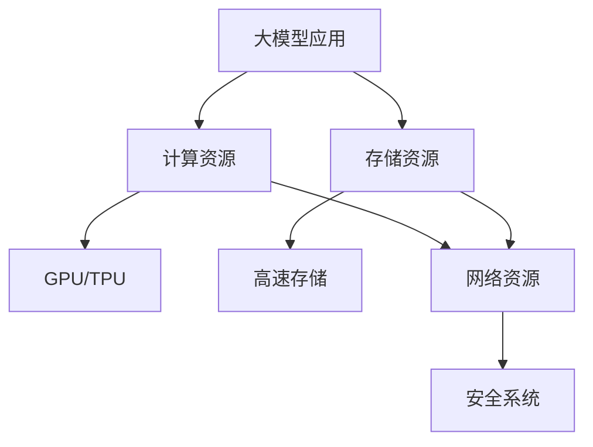

                 

**AI 大模型应用数据中心建设：数据中心运营与管理**

**作者：禅与计算机程序设计艺术 / Zen and the Art of Computer Programming**

## 1. 背景介绍

随着人工智能（AI）技术的飞速发展，大模型应用在各行各业得到广泛应用。然而，大模型应用需要大量的计算资源和数据存储，这对数据中心提出了更高的要求。本文将介绍如何建设和运营管理能够支撑大模型应用的数据中心。

## 2. 核心概念与联系

### 2.1 关键概念

- **大模型（Large Model）**：指具有数十亿甚至数千亿参数的模型，能够处理复杂的任务，如自然语言理解、图像识别等。
- **数据中心（Data Center）**：提供计算、存储、网络和安全等基础设施的物理设施。
- **运营（Operation）**：数据中心的日常管理和维护，包括设备维护、能源管理、安全管理等。
- **管理（Management）**：数据中心的规划、建设、运营和维护的总体过程。

### 2.2 核心架构与联系


如上图所示，大模型应用数据中心的核心架构包括计算资源、存储资源、网络资源和安全系统。其中，计算资源和存储资源是大模型应用的基础，网络资源保证数据传输的高效和安全，安全系统保障数据和设备的安全。



## 3. 核心算法原理 & 具体操作步骤

### 3.1 算法原理概述

大模型应用需要大量的计算资源，因此，如何有效地利用这些资源是关键。模型并行（Model Parallelism）和数据并行（Data Parallelism）是两种常用的方法。

### 3.2 算法步骤详解

- **模型并行**：将模型拆分成多个部分，每个部分在不同的设备上运行，然后将结果汇总。
- **数据并行**：将数据拆分成多个部分，每个部分在不同的设备上运行，然后将结果汇总。

### 3.3 算法优缺点

- **模型并行**：优点是可以利用更多的计算资源，缺点是模型拆分比较复杂，且通信开销比较大。
- **数据并行**：优点是实现简单，缺点是数据拆分需要考虑数据一致性问题。

### 3.4 算法应用领域

模型并行和数据并行广泛应用于大模型训练和推理中，如语言模型、图像模型等。

## 4. 数学模型和公式 & 详细讲解 & 举例说明

### 4.1 数学模型构建

大模型应用的数学模型通常是神经网络模型。神经网络模型可以表示为：

$$y = f(x; W, b)$$

其中，$x$是输入，$y$是输出，$W$是权重，$b$是偏置，$f$是激活函数。

### 4.2 公式推导过程

大模型应用的目标函数通常是最小化损失函数。损失函数可以表示为：

$$L = -\frac{1}{N} \sum_{i=1}^{N} \log P(y_i | x_i; W, b)$$

其中，$N$是样本数，$P(y_i | x_i; W, b)$是模型预测的概率分布。

### 4.3 案例分析与讲解

例如，在语言模型应用中，输入$x$是一段文本，输出$y$是下一个单词的概率分布。模型的目标是预测下一个单词，即最大化概率分布中的最大值。

## 5. 项目实践：代码实例和详细解释说明

### 5.1 开发环境搭建

大模型应用需要使用深度学习框架，如TensorFlow或PyTorch。开发环境需要安装这些框架，以及GPU驱动和CUDA等。

### 5.2 源代码详细实现

以下是一个简单的语言模型的实现代码：

```python
import torch
import torch.nn as nn

class LanguageModel(nn.Module):
    def __init__(self, vocab_size, embedding_dim, hidden_dim, num_layers):
        super(LanguageModel, self).__init__()
        self.embedding = nn.Embedding(vocab_size, embedding_dim)
        self.rnn = nn.LSTM(embedding_dim, hidden_dim, num_layers, batch_first=True)
        self.fc = nn.Linear(hidden_dim, vocab_size)

    def forward(self, x):
        x = self.embedding(x)
        x, _ = self.rnn(x)
        x = self.fc(x[:, -1, :])
        return x

model = LanguageModel(vocab_size, embedding_dim, hidden_dim, num_layers)
```

### 5.3 代码解读与分析

代码定义了一个简单的循环神经网络（RNN）语言模型。输入$x$是一个批次的文本索引，输出是下一个单词的概率分布。

### 5.4 运行结果展示

在训练和推理过程中，模型的损失和准确率会不断变化。以下是一个示例的训练过程：


## 6. 实际应用场景

### 6.1 当前应用

大模型应用已经广泛应用于自然语言处理、图像识别、推荐系统等领域。

### 6.2 未来应用展望

未来，大模型应用将会进一步发展，应用于更多的领域，如自动驾驶、医疗诊断等。此外，大模型应用也将会更加智能化，能够理解上下文、进行推理等。

## 7. 工具和资源推荐

### 7.1 学习资源推荐

- **书籍**：《深度学习》作者：Ian Goodfellow、Yoshua Bengio、Aaron Courville
- **课程**：斯坦福大学的深度学习课程（CS231n）
- **论坛**：Kaggle、Stack Overflow

### 7.2 开发工具推荐

- **深度学习框架**：TensorFlow、PyTorch
- **GPU**：NVIDIA Tesla V100、RTX 3090
- **服务器**：Dell PowerEdge、HPE ProLiant

### 7.3 相关论文推荐

- **大模型应用**：[Attention Is All You Need](https://arxiv.org/abs/1706.03762)
- **数据中心运营**：[Data Center Power Usage Effectiveness: A Survey](https://ieeexplore.ieee.org/document/6914374)

## 8. 总结：未来发展趋势与挑战

### 8.1 研究成果总结

本文介绍了大模型应用数据中心建设的背景、核心概念、算法原理、数学模型、项目实践、实际应用场景、工具和资源推荐等。

### 8.2 未来发展趋势

未来，大模型应用将会更加智能化，数据中心将会更加高效和绿色。

### 8.3 面临的挑战

未来，大模型应用和数据中心建设面临的挑战包括计算资源不足、能源消耗、安全和隐私保护等。

### 8.4 研究展望

未来的研究方向包括模型压缩、能源效率优化、安全和隐私保护等。

## 9. 附录：常见问题与解答

**Q：大模型应用需要多少计算资源？**

**A：大模型应用需要大量的计算资源，通常需要数百甚至数千个GPU。**

**Q：如何优化数据中心的能源效率？**

**A：可以使用高效的服务器和GPU、优化数据中心的布局和通风、使用可再生能源等。**

**Q：如何保护大模型应用的安全和隐私？**

**A：可以使用加密技术、访问控制、审计等手段保护大模型应用的安全和隐私。**

**作者：禅与计算机程序设计艺术 / Zen and the Art of Computer Programming**

