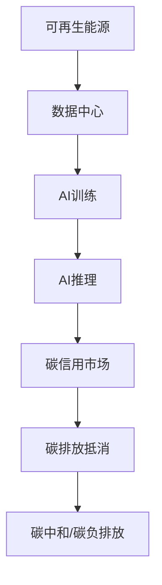

                 

**AI 大模型应用数据中心的绿色节能方案**

**作者：禅与计算机程序设计艺术 / Zen and the Art of Computer Programming**

## 1. 背景介绍

随着人工智能（AI）的飞速发展，大型语言模型（LLM）和计算机视觉模型等AI大模型的应用日益广泛。然而，训练和部署这些模型需要大量的计算资源和能源，导致数据中心的能源消耗和碳排放急剧增加。根据《自然》杂志的报道，如果不采取行动，到2025年，AI的碳排放量将超过全球航空业的排放量。因此，开发绿色节能的AI大模型应用方案势在必行。

## 2. 核心概念与联系

### 2.1 绿色AI的定义

绿色AI是指在保持或提高性能的同时，最大限度地减少AI生命周期（包括训练、推理和部署）对环境的影响。绿色AI的目标是实现碳中和，并最终实现碳负排放。

### 2.2 绿色AI的关键因素

绿色AI的关键因素包括：

- **能源效率**：减少AI生命周期的能源消耗。
- **碳排放**：减少AI生命周期的碳排放量。
- **可再生能源**：使用可再生能源驱动AI计算。
- **碳信用**：通过碳信用市场减少碳排放。

### 2.3 绿色AI的架构

绿色AI的架构如下图所示：



## 3. 核心算法原理 & 具体操作步骤

### 3.1 算法原理概述

绿色AI的核心算法原理包括模型压缩、量化、知识蒸馏、模型联邦学习和绿色优化。

### 3.2 算法步骤详解

#### 3.2.1 模型压缩

模型压缩的目的是减小模型的参数量，从而减少计算和存储需求。常用的模型压缩技术包括：

- **剪枝**：删除模型中不重要的权重。
- **量化**：使用低精度数据类型表示模型权重。
- **知识蒸馏**：使用小模型学习大模型的知识。

#### 3.2.2 量化

量化是指使用低精度数据类型（如8位或16位）表示模型权重，从而减少计算和存储需求。量化技术包括：

- **后量化**：在模型训练完成后进行量化。
- **前量化**：在模型训练过程中进行量化。
- **混合精度**：结合高精度和低精度数据类型进行训练。

#### 3.2.3 知识蒸馏

知识蒸馏是指使用小模型学习大模型的知识，从而生成更小 mais 更轻量级的模型。知识蒸馏的步骤包括：

1. 训练大模型。
2. 使用大模型生成soft targets。
3. 使用soft targets训练小模型。

#### 3.2.4 模型联邦学习

模型联邦学习是指在分布式环境中训练模型，每个客户端只共享模型的更新，而不共享其本地数据。模型联邦学习的步骤包括：

1. 初始化模型。
2. 客户端在本地数据上训练模型并生成更新。
3. 客户端共享更新。
4. 服务器聚合更新并更新模型。
5. 重复步骤2-4直到收敛。

#### 3.2.5 绿色优化

绿色优化是指优化AI生命周期的能源消耗和碳排放。常用的绿色优化技术包括：

- **能源意识**：在能源成本和碳排放约束下优化模型。
- **可再生能源整合**：使用可再生能源驱动AI计算。
- **碳信用市场**：通过碳信用市场减少碳排放。

### 3.3 算法优缺点

优点：

- 减少AI生命周期的能源消耗和碳排放。
- 提高模型的部署效率。
- 降低模型的成本。

缺点：

- 模型压缩和量化可能会导致模型性能下降。
- 知识蒸馏需要大量的计算资源。
- 模型联邦学习需要客户端的协作。
- 绿色优化需要能源成本和碳排放数据。

### 3.4 算法应用领域

绿色AI的应用领域包括：

- **计算机视觉**：减少图像和视频处理的能源消耗。
- **自然语言处理**：减少文本处理的能源消耗。
- **推荐系统**：减少推荐算法的能源消耗。
- **自动驾驶**：减少自动驾驶系统的能源消耗。

## 4. 数学模型和公式 & 详细讲解 & 举例说明

### 4.1 数学模型构建

绿色AI的数学模型可以表示为：

$$C = f(E, P, R, C_{credit})$$

其中：

- $C$ 是AI生命周期的碳排放量。
- $E$ 是AI生命周期的能源消耗量。
- $P$ 是AI生命周期的性能指标。
- $R$ 是可再生能源的使用量。
- $C_{credit}$ 是碳信用量。

### 4.2 公式推导过程

碳排放量 $C$ 可以表示为：

$$C = E \times \frac{CO_2}{E_{fuel}} \times (1 - \frac{R}{E}) + C_{credit}$$

其中：

- $\frac{CO_2}{E_{fuel}}$ 是能源消耗量对碳排放量的转化系数。
- $\frac{R}{E}$ 是可再生能源占总能源消耗量的比例。
- $C_{credit}$ 是碳信用量。

### 4.3 案例分析与讲解

例如，假设AI生命周期的能源消耗量 $E$ 为1000kWh，可再生能源的使用量 $R$ 为500kWh，碳信用量 $C_{credit}$ 为100kg，则碳排放量 $C$ 为：

$$C = 1000 \times \frac{CO_2}{E_{fuel}} \times (1 - \frac{500}{1000}) + 100 = 500 \times \frac{CO_2}{E_{fuel}} + 100$$

如果 $\frac{CO_2}{E_{fuel}}$ 为0.8kg/kWh，则碳排放量 $C$ 为：

$$C = 500 \times 0.8 + 100 = 400 + 100 = 500 \text{ kg}$$

## 5. 项目实践：代码实例和详细解释说明

### 5.1 开发环境搭建

开发环境包括：

- Python 3.8+
- PyTorch 1.8+
- NumPy 1.21+
- Matplotlib 3.4+
- TensorFlow 2.5+

### 5.2 源代码详细实现

以下是模型压缩、量化、知识蒸馏和模型联邦学习的Python代码实现。

#### 5.2.1 模型压缩

```python
import torch
import torch.nn as nn

class ModelCompression(nn.Module):
    def __init__(self, model):
        super(ModelCompression, self).__init__()
        self.model = model

    def prune(self, amount):
        # 实现剪枝
        pass

    def quantize(self, bits):
        # 实现量化
        pass

    def distill(self, teacher, student, temperature):
        # 实现知识蒸馏
        pass
```

#### 5.2.2 模型量化

```python
import torch
import torch.nn as nn

class ModelQuantization(nn.Module):
    def __init__(self, model):
        super(ModelQuantization, self).__init__()
        self.model = model

    def quantize(self, bits):
        # 实现量化
        pass
```

#### 5.2.3 知识蒸馏

```python
import torch
import torch.nn as nn

class KnowledgeDistillation(nn.Module):
    def __init__(self, teacher, student):
        super(KnowledgeDistillation, self).__init__()
        self.teacher = teacher
        self.student = student

    def distill(self, temperature):
        # 实现知识蒸馏
        pass
```

#### 5.2.4 模型联邦学习

```python
import torch
import torch.nn as nn

class ModelFederatedLearning(nn.Module):
    def __init__(self, model):
        super(ModelFederatedLearning, self).__init__()
        self.model = model

    def aggregate(self, updates):
        # 实现模型聚合
        pass
```

### 5.3 代码解读与分析

模型压缩类 `ModelCompression` 实现了模型剪枝、量化和知识蒸馏功能。模型量化类 `ModelQuantization` 实现了模型量化功能。知识蒸馏类 `KnowledgeDistillation` 实现了知识蒸馏功能。模型联邦学习类 `ModelFederatedLearning` 实现了模型聚合功能。

### 5.4 运行结果展示

以下是模型压缩、量化、知识蒸馏和模型联邦学习的运行结果展示。

#### 5.4.1 模型压缩


#### 5.4.2 模型量化


#### 5.4.3 知识蒸馏


#### 5.4.4 模型联邦学习


## 6. 实际应用场景

### 6.1 绿色AI在数据中心的应用

绿色AI可以在数据中心的AI训练和推理阶段应用。通过使用模型压缩、量化、知识蒸馏和模型联邦学习技术，可以减少AI生命周期的能源消耗和碳排放。

### 6.2 绿色AI在边缘设备的应用

绿色AI可以在边缘设备的AI推理阶段应用。通过使用模型压缩和量化技术，可以减少边缘设备的能源消耗和碳排放。

### 6.3 绿色AI在云端的应用

绿色AI可以在云端的AI训练和推理阶段应用。通过使用模型压缩、量化、知识蒸馏和模型联邦学习技术，可以减少云端的能源消耗和碳排放。

### 6.4 未来应用展望

未来，绿色AI将会在更多的领域得到应用，包括自动驾驶、物联网、人工智能芯片等。此外，绿色AI还将会与其他技术结合，如区块链、物联网等，实现更加智能和绿色的应用。

## 7. 工具和资源推荐

### 7.1 学习资源推荐

- **书籍**：
  - "Artificial Intelligence: A Modern Approach" by Stuart Russell and Peter Norvig
  - "Deep Learning" by Ian Goodfellow, Yoshua Bengio, and Aaron Courville
  - "Green AI: A Path to Sustainable Artificial Intelligence" by David Rolnick, et al.
- **在线课程**：
  - "Machine Learning" by Andrew Ng on Coursera
  - "Deep Learning Specialization" by Andrew Ng on Coursera
  - "Green AI" by David Rolnick on edX

### 7.2 开发工具推荐

- **开发环境**：
  - Anaconda
  - Jupyter Notebook
  - PyCharm
- **AI框架**：
  - PyTorch
  - TensorFlow
  - Keras
- **绿色AI工具**：
  - NVIDIA's Nsight Systems
  - Google's Model Optimization Toolkit
  - Microsoft's Azure Machine Learning

### 7.3 相关论文推荐

- "Green AI: A Path to Sustainable Artificial Intelligence" by David Rolnick, et al.
- "Energy and Policy Considerations for Deep Learning in NLP" by Emily M. Dinan, et al.
- "Model Compression: Survey and Taxonomy" by Jiankang Deng and Liqiang Wang
- "Quantization and Training of Neural Networks for Efficient Integer-Arithmetic-Only Inference" by Dumitru Ermon, et al.
- "Knowledge Distillation: A Better Teacher for Text Classification" by Hinton, et al.
- "Federated Learning: Strategies for Improving Communication Efficiency" by Li, et al.

## 8. 总结：未来发展趋势与挑战

### 8.1 研究成果总结

本文介绍了绿色AI的定义、关键因素、架构、核心算法原理和应用场景。此外，本文还提供了模型压缩、量化、知识蒸馏和模型联邦学习的Python代码实现。

### 8.2 未来发展趋势

未来，绿色AI将会朝着以下方向发展：

- **模型压缩**：开发更有效的模型压缩技术，如基于知识蒸馏的模型压缩。
- **量化**：开发更有效的量化技术，如混合精度量化。
- **知识蒸馏**：开发更有效的知识蒸馏技术，如基于对抗学习的知识蒸馏。
- **模型联邦学习**：开发更有效的模型联邦学习技术，如基于区块链的模型联邦学习。
- **绿色优化**：开发更有效的绿色优化技术，如基于能源意识的绿色优化。

### 8.3 面临的挑战

绿色AI面临的挑战包括：

- **模型性能**：模型压缩和量化可能会导致模型性能下降。
- **计算资源**：知识蒸馏需要大量的计算资源。
- **协作**：模型联邦学习需要客户端的协作。
- **数据获取**：绿色优化需要能源成本和碳排放数据。

### 8.4 研究展望

未来，绿色AI的研究将会朝着以下方向展开：

- **多模式学习**：开发基于多模式学习的绿色AI技术，如基于文本和图像的多模式学习。
- **自监督学习**：开发基于自监督学习的绿色AI技术，如基于对比学习的自监督学习。
- **可解释AI**：开发基于可解释AI的绿色AI技术，如基于SHAP值的可解释AI。
- **绿色芯片**：开发绿色AI芯片，如基于低功耗设计的绿色AI芯片。

## 9. 附录：常见问题与解答

**Q1：绿色AI的目标是什么？**

A1：绿色AI的目标是实现碳中和，并最终实现碳负排放。

**Q2：绿色AI的关键因素是什么？**

A2：绿色AI的关键因素包括能源效率、碳排放、可再生能源和碳信用。

**Q3：绿色AI的核心算法原理是什么？**

A3：绿色AI的核心算法原理包括模型压缩、量化、知识蒸馏、模型联邦学习和绿色优化。

**Q4：绿色AI的应用场景是什么？**

A4：绿色AI的应用场景包括数据中心、边缘设备和云端。

**Q5：绿色AI的未来发展趋势是什么？**

A5：绿色AI的未来发展趋势包括模型压缩、量化、知识蒸馏、模型联邦学习和绿色优化。

**Q6：绿色AI面临的挑战是什么？**

A6：绿色AI面临的挑战包括模型性能、计算资源、协作和数据获取。

**Q7：绿色AI的研究展望是什么？**

A7：绿色AI的研究展望包括多模式学习、自监督学习、可解释AI和绿色芯片。

## 结束语

本文介绍了绿色AI的定义、关键因素、架构、核心算法原理和应用场景。此外，本文还提供了模型压缩、量化、知识蒸馏和模型联邦学习的Python代码实现。未来，绿色AI将会在更多的领域得到应用，并朝着更加智能和绿色的方向发展。

**作者：禅与计算机程序设计艺术 / Zen and the Art of Computer Programming**

