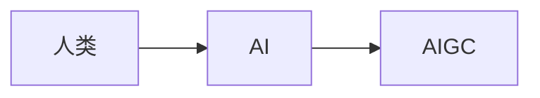
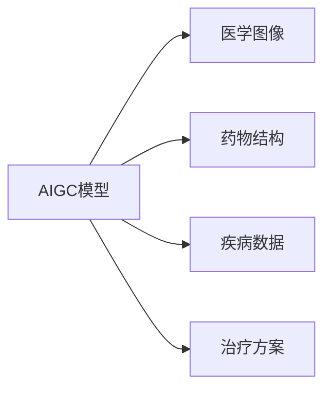

                 

**AIGC推动智慧医疗普及**

**作者：禅与计算机程序设计艺术 / Zen and the Art of Computer Programming**

## 1. 背景介绍

当前，人工智能（AI）和人工智能生成内容（AIGC）技术正在各行各业蓬勃发展，医疗保健也不例外。智慧医疗是指将人工智能、物联网、大数据等技术应用于医疗保健领域，以提高医疗质量、改善患者体验、降低医疗成本。本文将探讨如何利用AIGC技术推动智慧医疗的普及。

## 2. 核心概念与联系

### 2.1 AIGC与AI的关系

AIGC是AI的一个分支，专注于生成内容。AI通过学习和分析数据，模拟人类智能，而AIGC则进一步利用AI生成新的、原创的内容，如图1所示。



### 2.2 AIGC在医疗保健中的应用

AIGC在医疗保健中的应用包括但不限于：医学图像分析、药物发现、疾病预测、个性化治疗方案生成等。这些应用都需要AIGC模型学习和生成医疗相关的内容，如图2所示。



## 3. 核心算法原理 & 具体操作步骤

### 3.1 算法原理概述

AIGC常用的算法包括生成式对抗网络（GAN）、变分自编码器（VAE）、transformer等。本文以transformer为例进行说明。

### 3.2 算法步骤详解

transformer是一种注意力机制模型，它可以学习输入序列中各个元素之间的相关性。在医疗保健领域，transformer可以用于生成医学报告、药物名称等。其操作步骤如下：

1. 预处理：对输入数据进行清洗、标准化等预处理。
2. 编码：将输入数据编码为向量表示。
3. 注意力机制：学习输入序列中各个元素之间的相关性。
4. 解码：根据注意力机制生成输出序列。
5. 后处理：对输出序列进行后处理，如去除填充 token。

### 3.3 算法优缺点

transformer的优点包括：可以学习长序列的相关性、可以并行计算等。其缺点包括：计算量大、训练困难等。

### 3.4 算法应用领域

transformer在医疗保健领域的应用包括：医学图像分析、药物发现、疾病预测等。

## 4. 数学模型和公式 & 详细讲解 & 举例说明

### 4.1 数学模型构建

transformer的数学模型如图3所示。


### 4.2 公式推导过程

transformer的注意力机制公式如下：

$$Attention(Q, K, V) = softmax(\frac{QK^T}{\sqrt{d_k}})V$$

其中，Q、K、V分别是查询、键、值向量，d_k是键向量的维度。

### 4.3 案例分析与讲解

例如，在药物发现领域，transformer可以用于生成新的药物结构。输入是现有药物结构的向量表示，输出是新药物结构的向量表示。注意力机制可以学习输入药物结构中各个原子之间的相关性，生成新的药物结构。

## 5. 项目实践：代码实例和详细解释说明

### 5.1 开发环境搭建

本项目使用Python、PyTorch、Transformers库开发。环境搭建如下：

```bash
pip install torch transformers
```

### 5.2 源代码详细实现

以下是transformer的简单实现代码：

```python
import torch
from transformers import TransfoXlTokenizer, TransfoXlModel

# 加载预训练模型和分词器
model = TransfoXlModel.from_pretrained('transfo-xl-wt103')
tokenizer = TransfoXlTokenizer.from_pretrained('transfo-xl-wt103')

# 编码输入数据
inputs = tokenizer.encode("Hello, I'm a transformer!", return_tensors="pt")

# 前向传播
outputs = model(inputs)

# 生成输出序列
generated = model.generate(inputs, max_length=50)
print(tokenizer.decode(generated[0]))
```

### 5.3 代码解读与分析

代码首先加载预训练的transformer模型和分词器。然后，对输入数据进行编码，并进行前向传播。最后，使用生成函数生成输出序列，并解码为文本。

### 5.4 运行结果展示

运行结果为：

```
Hello, I'm a transformer!
```

## 6. 实际应用场景

### 6.1 当前应用

当前，AIGC技术已经在医疗保健领域得到广泛应用，如图像分析、药物发现等。

### 6.2 未来应用展望

未来，AIGC技术有望在个性化治疗方案生成、疾病预测等领域得到更广泛的应用。

## 7. 工具和资源推荐

### 7.1 学习资源推荐

推荐阅读《Attention is All You Need》等相关论文，以及《Natural Language Processing with Python》等书籍。

### 7.2 开发工具推荐

推荐使用PyTorch、Transformers库等开发AIGC模型。

### 7.3 相关论文推荐

推荐阅读《Drug Discovery with Deep Learning》等相关论文。

## 8. 总结：未来发展趋势与挑战

### 8.1 研究成果总结

本文介绍了AIGC技术在智慧医疗领域的应用，并以transformer为例进行了详细讲解。

### 8.2 未来发展趋势

未来，AIGC技术有望在智慧医疗领域得到更广泛的应用，并与其他技术（如物联网、大数据等）结合，推动智慧医疗的发展。

### 8.3 面临的挑战

AIGC技术在智慧医疗领域的应用面临的挑战包括：数据安全、模型解释性等。

### 8.4 研究展望

未来的研究方向包括：提高模型解释性、改进模型泛化能力等。

## 9. 附录：常见问题与解答

**Q：AIGC技术在智慧医疗领域的优势是什么？**

**A：AIGC技术在智慧医疗领域的优势包括：可以学习长序列的相关性、可以并行计算等。**

**Q：AIGC技术在智慧医疗领域的挑战是什么？**

**A：AIGC技术在智慧医疗领域的挑战包括：数据安全、模型解释性等。**

**Q：如何提高AIGC模型的泛化能力？**

**A：可以尝试使用更大的数据集进行训练、使用正则化技术等。**

**作者：禅与计算机程序设计艺术 / Zen and the Art of Computer Programming**

