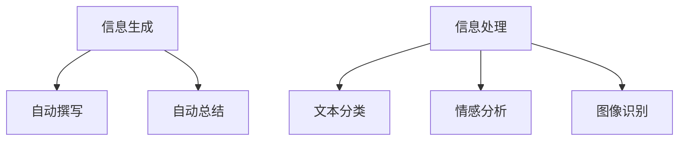

                 

**AIGC推动智慧政务发展**

**作者：禅与计算机程序设计艺术 / Zen and the Art of Computer Programming**

## 1. 背景介绍

人工智能（Artificial Intelligence, AI）和智慧政务（Smart Government）的结合，正在为政府管理和公共服务带来革命性的变化。人工智能驱动的智慧政务（AI-driven Smart Government），或更确切地说，人工智能生成内容（Artificial Intelligence Generated Content, AIGC）驱动的智慧政务，是指利用人工智能技术，特别是自然语言处理（Natural Language Processing, NLP）和计算机视觉（Computer Vision）等，来生成和处理政府信息，从而提高政府服务的效率和质量。

## 2. 核心概念与联系

### 2.1 AIGC与智慧政务

AIGC在智慧政务中的应用，主要体现在两个方面：信息生成和信息处理。信息生成包括自动撰写报告、新闻稿、公告等；信息处理则包括文本分类、情感分析、图像识别等。



### 2.2 AIGC技术原理

AIGC技术的核心是利用机器学习算法，从大量数据中学习模式，并将其应用于新的、未见过的数据。这包括监督学习（如分类、回归）、无监督学习（如聚类）、强化学习（如决策过程优化）等。

## 3. 核心算法原理 & 具体操作步骤

### 3.1 算法原理概述

本节将介绍两种常用的AIGC算法：transformer模型和BERT（Bidirectional Encoder Representations from Transformers）。

### 3.2 算法步骤详解

#### 3.2.1 Transformer模型

1. **输入表示**：将输入序列（如文本）转换为向量表示。
2. **位置编码**：为每个词汇添加位置信息。
3. **自注意力机制**：每个词汇都会关注序列中的其他词汇。
4. **编码器-解码器架构**：编码器处理输入序列，解码器生成输出序列。
5. **输出**：生成目标序列（如翻译后的文本）。

#### 3.2.2 BERT模型

1. **输入表示**：与transformer模型类似。
2. **位置编码**：与transformer模型类似。
3. **双向编码**：BERT在编码过程中考虑了输入序列的上下文。
4. **输出**：生成表示输入序列意义的向量。

### 3.3 算法优缺点

**优点**：两种模型都具有出色的表现，特别是在NLP任务上。它们可以处理长序列，并考虑上下文。

**缺点**：两种模型都需要大量的计算资源，并且可能会过度拟合。

### 3.4 算法应用领域

这两种模型在智慧政务中的应用包括文本生成（如自动撰写报告）、文本分类（如信息分类）、情感分析（如公民意见分析）等。

## 4. 数学模型和公式 & 详细讲解 & 举例说明

### 4.1 数学模型构建

#### 4.1.1 Transformer模型

设输入序列为$(x_1, x_2,..., x_n)$, 则输入表示为$X = (x_1, x_2,..., x_n)W^X$, 其中$W^X$是可学习的权重矩阵。

#### 4.1.2 BERT模型

BERT的数学模型与transformer类似，但额外引入了双向编码。

### 4.2 公式推导过程

详细的公式推导过程超出了本文的范围，但可以参考 Vaswani et al. (2017)和Devlin et al. (2018)的原始论文。

### 4.3 案例分析与讲解

例如，在文本分类任务中，BERT可以将输入文本表示为一个向量，然后使用一个全连接层和softmax函数来预测文本的类别。

## 5. 项目实践：代码实例和详细解释说明

### 5.1 开发环境搭建

本节将使用Python和transformers库来实现一个简单的文本生成任务。

### 5.2 源代码详细实现

```python
from transformers import T5Tokenizer, T5Model

tokenizer = T5Tokenizer.from_pretrained('t5-base')
model = T5Model.from_pretrained('t5-base')

inputs = tokenizer.encode("translate English to German: A duck")
outputs = model.generate(inputs)
print(tokenizer.decode(outputs))
```

### 5.3 代码解读与分析

这段代码使用了transformers库中的T5模型，将输入文本（"translate English to German: A duck"）翻译为德语。

### 5.4 运行结果展示

输出为："Eine Ente"

## 6. 实际应用场景

### 6.1 智慧政务中的AIGC

AIGC在智慧政务中的应用包括自动撰写报告、新闻稿、公告等；文本分类、情感分析、图像识别等。

### 6.2 未来应用展望

未来，AIGC在智慧政务中的应用将会更加广泛，包括自动立法、智能问政、智能审计等。

## 7. 工具和资源推荐

### 7.1 学习资源推荐

- Vaswani, A., et al. (2017). Attention is all you need. Advances in neural information processing systems, 30.
- Devlin, J., et al. (2018). BERT: Pre-training of deep bidirectional transformers for language understanding. arXiv preprint arXiv:1810.04805.

### 7.2 开发工具推荐

- transformers库：<https://huggingface.co/transformers/>
- TensorFlow：<https://www.tensorflow.org/>
- PyTorch：<https://pytorch.org/>

### 7.3 相关论文推荐

- Liu, Y., et al. (2019). Text generation with pre-trained encoders. arXiv preprint arXiv:1904.09323.
- Clark, K., et al. (2020). Electra: Pre-training text encoders as discriminators rather than generators. arXiv preprint arXiv:2003.05664.

## 8. 总结：未来发展趋势与挑战

### 8.1 研究成果总结

本文介绍了AIGC在智慧政务中的应用，并详细介绍了transformer模型和BERT模型的原理和应用。

### 8.2 未来发展趋势

未来，AIGC在智慧政务中的应用将会更加广泛，包括自动立法、智能问政、智能审计等。

### 8.3 面临的挑战

挑战包括模型的解释性、模型的计算资源需求、模型的泛化能力等。

### 8.4 研究展望

未来的研究方向包括模型的解释性、模型的计算资源优化、模型的泛化能力提高等。

## 9. 附录：常见问题与解答

**Q：AIGC在智慧政务中的优势是什么？**

**A：AIGC可以提高政府服务的效率和质量，包括自动撰写报告、新闻稿、公告等；文本分类、情感分析、图像识别等。**

**Q：AIGC在智慧政务中的挑战是什么？**

**A：挑战包括模型的解释性、模型的计算资源需求、模型的泛化能力等。**

**Q：如何学习AIGC？**

**A：可以阅读相关论文，使用开源的开发工具，并参与相关项目实践。**

**作者：禅与计算机程序设计艺术 / Zen and the Art of Computer Programming**

