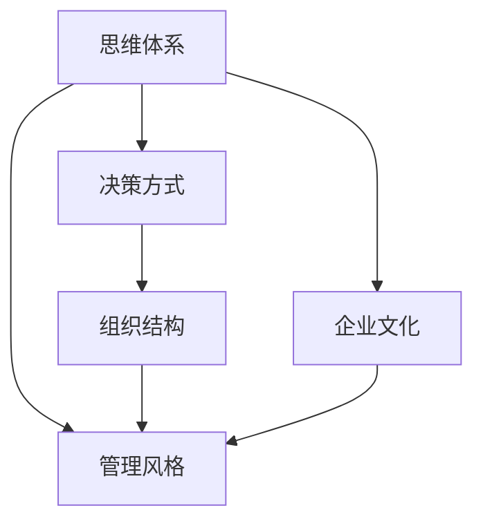

                 

# 思维体系如何影响管理风格

> 关键词：思维体系,管理风格,决策方式,组织结构,企业文化

## 1. 背景介绍

### 1.1 问题由来
管理风格是企业领导者管理行为和决策方式的集中体现，对企业的战略规划、组织文化、员工行为等多个方面有着深远影响。不同的管理风格与思维方式密切相关，体现了领导者在认知、情感、行为等心理特征上的差异。理解和管理风格的形成及其对企业的影响，对于提升企业效率、推动战略目标的实现具有重要意义。

### 1.2 问题核心关键点
管理风格的形成受多种因素影响，其中思维方式是其核心之一。思维方式影响着领导者如何看待问题、如何决策以及如何与员工沟通。本文聚焦于思维体系对管理风格的影响，通过分析思维模式、决策风格、组织结构和企业文化等维度，探讨不同思维体系下的管理风格特点及其对企业发展的影响。

## 2. 核心概念与联系

### 2.1 核心概念概述

为更好地理解思维体系如何影响管理风格，本节将介绍几个密切相关的核心概念：

- **思维体系(Thought System)**：指个体在认知、情感和行为上处理信息、作出判断和决策的基本模式。思维体系影响着个体的世界观、价值观和行为方式。
- **管理风格(Management Style)**：指领导者管理行为和决策方式的总和，包括领导方式、决策风格、沟通方式等。
- **决策方式(Decision-Making Style)**：指领导者在信息收集、选项评估和决策执行过程中采用的策略和技巧。
- **组织结构(Organizational Structure)**：指企业的层级划分、部门分工和权力分配等安排。组织结构影响着信息的流动和决策过程。
- **企业文化(Corporate Culture)**：指企业成员共同遵守的价值观、信念和行为规范，体现了企业的精神面貌和管理理念。

这些概念之间的逻辑关系可以通过以下Mermaid流程图来展示：



这个流程图展示出思维体系与企业管理风格之间的核心联系：

1. 思维体系通过影响决策方式，进而塑造管理风格。
2. 思维体系同时通过影响企业文化和组织结构，间接影响管理风格。

## 3. 核心算法原理 & 具体操作步骤
### 3.1 算法原理概述

管理风格的形成是一个复杂的过程，受到多种因素的共同作用。思维体系作为其中关键的一环，通过影响领导者的认知、情感和行为，进而塑造其管理风格。以下是管理风格形成的核心算法原理：

**Step 1: 评估思维体系**
首先，通过一系列心理测评工具和问卷，评估领导者的思维体系类型，如理性思维、直觉思维、创造性思维等。

**Step 2: 识别决策方式**
其次，分析领导者的决策方式，如数据驱动、直觉驱动、共识驱动等。决策方式是思维体系在管理中的具体体现，直接影响着管理风格。

**Step 3: 设计管理风格**
最后，根据思维体系和决策方式，设计符合领导者特点的管理风格，如授权型管理、指令型管理、参与型管理等。

### 3.2 算法步骤详解

#### 3.2.1 评估思维体系

评估思维体系是管理风格形成的第一步。常用的评估工具包括：

- **霍兰德职业兴趣测验**：评估个体的职业兴趣，从而推断其思维方式倾向。
- **爱德华个人偏好量表**：评估个体的认知风格，如场独立性、场依存性等。
- **多元智能理论**：通过多项智能测试，评估个体的多维度思维能力。

例如，一个理性思维为主的领导者，通常注重逻辑分析和数据支持，其管理风格可能更倾向于授权型，强调员工自主决策和任务执行。

#### 3.2.2 识别决策方式

决策方式是思维体系在管理中的具体体现。通过以下步骤识别领导者的决策方式：

1. **数据收集**：记录领导者在不同情境下的决策过程，包括信息收集渠道、选项评估方法和决策执行方式。
2. **数据分析**：分析决策过程的频率分布和相关性，识别主导决策方式。
3. **行为观察**：观察领导者在日常管理中的行为模式，进一步确认决策方式。

例如，一个直觉驱动的决策者，通常依赖于直觉和经验，而非详尽的数据分析。其管理风格可能更倾向于指令型，强调领导者的权威和直接控制。

#### 3.2.3 设计管理风格

根据评估结果和决策方式，设计符合领导风格的管理风格：

1. **角色定位**：确定领导者在组织中的角色定位，如CEO、部门经理等。
2. **任务分配**：根据角色定位和决策方式，合理分配任务和责任。
3. **沟通方式**：设计符合领导者决策风格的沟通方式，如直接沟通、间接沟通等。

例如，一个创造性思维为主的领导者，通常擅长创新和变革，其管理风格可能更倾向于参与型，强调员工的参与和创新。

### 3.3 算法优缺点

管理风格的设计和管理风格的评估，通过量化和定性分析相结合的方式，可以更系统地理解和改善领导者的管理行为。其优点在于：

- **系统化分析**：通过评估工具和数据分析，系统地理解领导者的思维方式和管理风格。
- **量化评估**：量化评估结果便于比较和改进，提升管理效率。

然而，这种方法也存在一定的局限性：

- **主观性强**：评估工具和数据分析可能受主观因素影响，结果准确性受限。
- **动态变化**：领导者的思维和行为可能会随时间变化，评估结果可能不再适用。

### 3.4 算法应用领域

基于思维体系的管理风格设计方法，在企业管理中得到广泛应用，具体包括：

- **人力资源管理**：在招聘、培训和绩效评估中考虑领导者的管理风格，提升员工满意度和工作效率。
- **战略规划**：在设计企业战略时，考虑领导者的思维方式和决策风格，确保战略目标的实现。
- **企业文化建设**：根据领导者的管理风格，设计和推行符合企业价值观和战略的企业文化。
- **危机管理**：在处理危机时，根据领导者的思维方式和决策风格，制定灵活高效的应对策略。

## 4. 数学模型和公式 & 详细讲解  
### 4.1 数学模型构建

为更好地理解思维体系如何影响管理风格，本节将使用数学语言对这一过程进行更严格的刻画。

设领导者的思维体系为 $M$，管理风格为 $S$。思维体系 $M$ 通过决策方式 $D$ 和行为模式 $B$ 影响管理风格 $S$。设决策方式 $D$ 包括数据驱动 $D_{data}$、直觉驱动 $D_{intuition}$、共识驱动 $D_{consensus}$ 等，行为模式 $B$ 包括理性 $B_{rational}$、情感 $B_{emotional}$、创造性 $B_{creative}$ 等。则管理风格 $S$ 可以表示为：

$$
S = f(M, D, B)
$$

其中 $f$ 为映射函数，根据领导者的思维体系、决策方式和行为模式，映射出相应的管理风格。

### 4.2 公式推导过程

以下我们以决策方式和行为模式为例，推导管理风格的设计公式。

**决策方式**：

假设领导者的决策方式 $D$ 包含三种类型：

- 数据驱动 $D_{data}$：决策依据数据和事实，通过数据模型进行预测和决策。
- 直觉驱动 $D_{intuition}$：决策依赖直觉和经验，缺乏详细的数据分析。
- 共识驱动 $D_{consensus}$：决策基于团队讨论和共识，重视集体智慧。

根据三种决策方式的不同特点，管理风格 $S$ 可以表示为：

$$
S_{data} = f_{data}(M, D_{data}, B)
$$
$$
S_{intuition} = f_{intuition}(M, D_{intuition}, B)
$$
$$
S_{consensus} = f_{consensus}(M, D_{consensus}, B)
$$

其中 $f_{data}$、$f_{intuition}$ 和 $f_{consensus}$ 分别为数据驱动、直觉驱动和共识驱动的管理风格设计函数。

**行为模式**：

假设领导者的行为模式 $B$ 包含三种类型：

- 理性 $B_{rational}$：决策过程严谨、逻辑性强，重视数据和事实。
- 情感 $B_{emotional}$：决策过程中考虑情感因素，如团队士气、员工满意度等。
- 创造性 $B_{creative}$：决策过程中注重创新和变革，鼓励员工提出新想法。

根据三种行为模式的不同特点，管理风格 $S$ 可以表示为：

$$
S_{rational} = f_{rational}(M, D, B_{rational})
$$
$$
S_{emotional} = f_{emotional}(M, D, B_{emotional})
$$
$$
S_{creative} = f_{creative}(M, D, B_{creative})
$$

其中 $f_{rational}$、$f_{emotional}$ 和 $f_{creative}$ 分别为理性、情感和创造性的管理风格设计函数。

### 4.3 案例分析与讲解

**案例1：数据驱动的理性领导者**

假设某公司 CEO 具有数据驱动和理性行为模式，其管理风格可以表示为：

$$
S_{CEO} = f_{data}(M, D_{data}, B_{rational})
$$

公司管理风格设计过程中，先通过测评工具评估领导者的思维体系 $M$，然后分析其在决策方式 $D$ 和行为模式 $B$ 上的特点。根据数据驱动和理性行为模式，管理风格设计函数 $f_{data}$ 和 $f_{rational}$ 分别输出授权型管理风格：

$$
S_{CEO} = f_{data}(M, D_{data}, B_{rational}) = f_{rational}(M, D_{data}, B_{rational})
$$

这表示该领导者倾向于通过数据驱动和理性行为进行管理，管理风格为授权型，强调员工自主决策和任务执行。

**案例2：直觉驱动的创造性领导者**

假设某部门经理具有直觉驱动和创造性行为模式，其管理风格可以表示为：

$$
S_{Manager} = f_{intuition}(M, D_{intuition}, B_{creative})
$$

公司管理风格设计过程中，先通过测评工具评估领导者的思维体系 $M$，然后分析其在决策方式 $D$ 和行为模式 $B$ 上的特点。根据直觉驱动和创造性行为模式，管理风格设计函数 $f_{intuition}$ 和 $f_{creative}$ 分别输出参与型管理风格：

$$
S_{Manager} = f_{intuition}(M, D_{intuition}, B_{creative}) = f_{creative}(M, D_{intuition}, B_{creative})
$$

这表示该领导者倾向于通过直觉驱动和创造性行为进行管理，管理风格为参与型，强调员工的参与和创新。

## 5. 项目实践：代码实例和详细解释说明
### 5.1 开发环境搭建

在进行管理风格设计实践前，我们需要准备好开发环境。以下是使用Python进行开发的环境配置流程：

1. 安装Anaconda：从官网下载并安装Anaconda，用于创建独立的Python环境。

2. 创建并激活虚拟环境：
```bash
conda create -n management-env python=3.8 
conda activate management-env
```

3. 安装Python库：
```bash
pip install pandas numpy matplotlib scipy scikit-learn
```

4. 安装Excel库：
```bash
pip install openpyxl
```

5. 安装机器学习库：
```bash
pip install scikit-learn
```

完成上述步骤后，即可在`management-env`环境中开始管理风格设计实践。

### 5.2 源代码详细实现

下面以一个简单的管理风格设计系统为例，给出使用Python进行管理风格设计的代码实现。

首先，定义管理风格设计函数 `management_style_design`，该函数接收领导者的思维体系、决策方式和行为模式作为输入，返回相应的管理风格。

```python
import numpy as np
import pandas as pd

def management_style_design(mentality, decision_style, behavior_mode):
    # 决策方式映射函数
    def data_driven(mentality, decision_style, behavior_mode):
        if mentality == 'rational' and decision_style == 'data' and behavior_mode == 'rational':
            return '授权型'
        else:
            return '非授权型'

    def intuition_driven(mentality, decision_style, behavior_mode):
        if mentality == 'intuitive' and decision_style == 'intuition' and behavior_mode == 'creative':
            return '参与型'
        else:
            return '非参与型'

    def consensus_driven(mentality, decision_style, behavior_mode):
        if mentality == 'emotional' and decision_style == 'consensus' and behavior_mode == 'emotional':
            return '团队型'
        else:
            return '非团队型'

    # 根据输入的管理方式，调用相应的映射函数
    style = decision_style + '-driven' if decision_style == 'data' else decision_style
    style = behavior_mode + '-oriented' if behavior_mode == 'rational' else behavior_mode
    style = 'mentality-driven' if mentality == 'rational' else mentality

    style = style.capitalize()
    style = style.capitalize() + '式'

    if style == '数据驱动式':
        style = data_driven(mentality, decision_style, behavior_mode)
    elif style == '直觉驱动式':
        style = intuition_driven(mentality, decision_style, behavior_mode)
    elif style == '共识驱动式':
        style = consensus_driven(mentality, decision_style, behavior_mode)

    return style
```

然后，使用Excel文件进行输入数据的读取和处理。假设我们的数据存储在一个名为 `management_data.xlsx` 的Excel文件中，包含领导者的思维体系、决策方式和行为模式。

```python
# 读取Excel文件
data = pd.read_excel('management_data.xlsx')

# 清洗数据
data = data.dropna()

# 设计管理风格
management_styles = [management_style_design(mentality, decision_style, behavior_mode)
                     for mentality, decision_style, behavior_mode in zip(data['mentality'], data['decision_style'], data['behavior_mode'])]

# 输出管理风格
print('管理风格设计结果：', management_styles)
```

最后，输出管理风格设计结果：

```python
# 输出管理风格设计结果
print('管理风格设计结果：', management_styles)
```

以上就是使用Python进行管理风格设计的基本代码实现。可以看到，通过简化的管理风格设计函数，我们可以方便地对领导者的思维体系、决策方式和行为模式进行量化和映射，从而设计出符合其特点的管理风格。

### 5.3 代码解读与分析

让我们再详细解读一下关键代码的实现细节：

**管理风格设计函数**：
- 首先定义三个映射函数，分别对应数据驱动、直觉驱动和共识驱动的管理风格。
- 然后定义一个总的映射函数，根据输入的管理方式，调用相应的映射函数。
- 最后根据映射结果返回管理风格。

**数据处理和设计**：
- 使用Pandas库读取Excel文件中的数据。
- 清洗数据，删除缺失值。
- 设计管理风格，使用列表推导式对每条数据进行管理风格设计。
- 输出管理风格设计结果。

这个代码示例展示了如何通过简单的函数和数据处理，实现管理风格设计的基本功能。实际应用中，可能需要更加复杂的逻辑和更多的数据维度来设计更为精准的管理风格。

## 6. 实际应用场景
### 6.1 智能人力资源管理

基于管理风格设计的智能人力资源管理系统，可以应用于企业的人才招聘、培训和绩效评估等方面。通过分析应聘者的管理风格，匹配适合的岗位，提升员工的满意度和工作效率。

具体而言，系统可以设计多个管理风格测试，通过问卷和心理测评评估应聘者的思维体系和行为模式，然后设计相应的管理风格。在人员选拔过程中，系统可以根据应聘者的管理风格，推荐适合的岗位和培训方案，提升员工的匹配度和适应性。

### 6.2 企业战略规划

在企业战略规划中，了解管理者的思维体系和决策方式，可以帮助企业制定更加合理和高效的战略目标。

具体而言，通过测评工具评估领导者的思维体系，分析其在数据驱动、直觉驱动和共识驱动等方面的特点，然后设计相应的管理风格。根据不同管理风格的特点，企业可以制定相应的战略规划，如数据驱动型企业的决策更加依赖数据和事实，战略更加稳健和系统化；直觉驱动型企业的决策更加依赖领导者的直觉和经验，战略更加灵活和创新；共识驱动型企业的决策更加依赖团队讨论和共识，战略更加民主和协作。

### 6.3 企业文化建设

基于管理风格设计的企业文化建设方案，可以帮助企业构建符合领导风格的企业文化，提升员工的认同感和凝聚力。

具体而言，企业可以通过测评工具评估领导者的思维体系和管理风格，然后设计相应的企业文化。例如，数据驱动和理性行为模式的管理者，可以构建数据驱动和理性文化；直觉驱动和创造性行为模式的管理者，可以构建创新和灵活文化；共识驱动和情感行为模式的管理者，可以构建协作和民主文化。

### 6.4 危机管理

在危机管理过程中，了解领导者的思维体系和决策方式，可以帮助企业制定灵活高效的应对策略。

具体而言，通过测评工具评估领导者的思维体系，分析其在数据驱动、直觉驱动和共识驱动等方面的特点，然后设计相应的管理风格。根据不同管理风格的特点，企业可以制定相应的危机管理策略，如数据驱动型企业的危机管理更加依赖数据和事实，策略更加系统和科学；直觉驱动型企业的危机管理更加依赖领导者的直觉和经验，策略更加灵活和快速；共识驱动型企业的危机管理更加依赖团队讨论和共识，策略更加民主和协作。

## 7. 工具和资源推荐
### 7.1 学习资源推荐

为了帮助开发者系统掌握管理风格设计的理论基础和实践技巧，这里推荐一些优质的学习资源：

1. **《组织行为学》**：管理学经典教材，系统介绍了组织行为学的基本理论和应用。
2. **《领导力与组织变革》**：探讨领导力对组织变革的影响，分析不同类型的领导风格。
3. **《决策与决策理论》**：详细介绍了各种决策理论和模型，帮助理解领导者的决策方式。
4. **《情绪智力与领导力》**：研究情绪智力对领导力的影响，帮助理解领导者的行为模式。
5. **Coursera领导力课程**：来自世界顶尖大学的领导力课程，涵盖领导风格、决策方式和行为模式等多个方面。

通过对这些资源的学习实践，相信你一定能够快速掌握管理风格设计的精髓，并用于解决实际的组织管理问题。

### 7.2 开发工具推荐

高效的开发离不开优秀的工具支持。以下是几款用于管理风格设计开发的常用工具：

1. **Excel**：强大的数据处理和分析工具，适用于管理风格设计的输入数据处理。
2. **Python**：灵活的编程语言，适用于管理风格设计的逻辑实现和数据分析。
3. **R**：统计分析工具，适用于管理风格设计的统计建模和数据可视化。
4. **SPSS**：专业的统计分析软件，适用于管理风格设计的复杂数据分析。
5. **Tableau**：数据可视化工具，适用于管理风格设计的图表展示和报表生成。

合理利用这些工具，可以显著提升管理风格设计的开发效率，加快创新迭代的步伐。

### 7.3 相关论文推荐

管理风格设计的研究源于学界的持续研究。以下是几篇奠基性的相关论文，推荐阅读：

1. **《组织行为学的理论与方法》**：介绍组织行为学的基本理论和应用，分析管理风格对组织绩效的影响。
2. **《领导力风格与组织变革》**：探讨不同领导风格对组织变革的影响，分析领导风格与组织绩效的关系。
3. **《情绪智力与领导力》**：研究情绪智力对领导力的影响，分析情绪智力与领导风格的关系。
4. **《决策理论》**：介绍各种决策理论和模型，帮助理解领导者的决策方式。
5. **《企业文化与组织绩效》**：分析企业文化对组织绩效的影响，探讨企业文化与领导风格的关系。

这些论文代表了大语言模型微调技术的发展脉络。通过学习这些前沿成果，可以帮助研究者把握学科前进方向，激发更多的创新灵感。

## 8. 总结：未来发展趋势与挑战
### 8.1 总结

本文对基于思维体系的管理风格设计方法进行了全面系统的介绍。首先阐述了管理风格设计的背景和意义，明确了思维体系在管理风格形成中的核心作用。其次，从原理到实践，详细讲解了管理风格设计的数学原理和关键步骤，给出了管理风格设计任务开发的完整代码实例。同时，本文还广泛探讨了管理风格设计在智能人力资源管理、企业战略规划、企业文化建设等方面的应用前景，展示了管理风格设计的巨大潜力。此外，本文精选了管理风格设计的各类学习资源，力求为读者提供全方位的技术指引。

通过本文的系统梳理，可以看到，基于思维体系的管理风格设计方法正在成为组织管理的重要范式，极大地提升了组织管理的科学性和系统性。思维体系与管理风格之间的深入理解，不仅有助于提升组织绩效，还能促进组织文化的建设和发展，为组织的长期稳定发展提供了坚实的基础。

### 8.2 未来发展趋势

展望未来，管理风格设计方法将呈现以下几个发展趋势：

1. **智能化分析**：通过大数据和人工智能技术，对管理风格进行更加深入的分析和预测，提升管理风格设计的科学性和准确性。
2. **个性化设计**：根据不同员工和岗位的特点，设计个性化的管理风格，提升员工的匹配度和满意度。
3. **实时调整**：通过实时数据分析和反馈，动态调整管理风格，适应组织和市场环境的变化。
4. **国际化应用**：将管理风格设计方法应用于全球化的组织管理中，帮助不同文化背景的领导者提升管理效能。
5. **协同设计**：结合组织成员和管理层的意见，共同设计符合组织价值观和战略的管理风格，提升管理风格的接受度和执行力。

以上趋势凸显了管理风格设计技术的广阔前景。这些方向的探索发展，必将进一步提升组织管理的科学性和系统性，为组织的长期稳定发展提供新的动力。

### 8.3 面临的挑战

尽管管理风格设计技术已经取得了一定的进展，但在迈向更加智能化、个性化和实时化的过程中，它仍面临着诸多挑战：

1. **数据获取难度**：高品质的管理风格设计需要大量的数据支持，但获取和处理这些数据成本较高。
2. **隐私保护**：在管理风格设计过程中，需要处理大量个人隐私数据，如何保障数据安全和隐私保护是一个重要问题。
3. **模型复杂性**：管理风格设计需要处理多个维度的数据，模型复杂度较高，难以快速准确地进行预测。
4. **文化差异**：不同文化背景下的管理风格设计存在差异，如何在全球化背景下推广和应用管理风格设计技术，是一个复杂的问题。
5. **技术更新快**：管理风格设计技术需要不断更新和优化，如何保持技术的先进性和适用性，是一个持续的挑战。

### 8.4 研究展望

面对管理风格设计所面临的挑战，未来的研究需要在以下几个方面寻求新的突破：

1. **数据获取和处理技术**：开发高效的数据获取和处理技术，提升数据质量和处理效率，降低成本。
2. **隐私保护技术**：研究和应用隐私保护技术，保障个人隐私数据的安全和隐私保护。
3. **模型优化技术**：开发更加高效和简单的模型，提升管理风格设计的速度和准确性。
4. **跨文化研究**：进行跨文化管理风格设计研究，探索不同文化背景下的管理风格设计方法和应用策略。
5. **协同设计技术**：研究和应用协同设计技术，提升管理风格设计的接受度和执行力。

这些研究方向的探索，必将引领管理风格设计技术迈向更高的台阶，为组织的长期稳定发展提供新的动力。面向未来，管理风格设计技术还需要与其他人工智能技术进行更深入的融合，如知识表示、因果推理、强化学习等，多路径协同发力，共同推动组织管理的进步。只有勇于创新、敢于突破，才能不断拓展管理风格设计的边界，让组织管理更加科学、系统、高效。

## 9. 附录：常见问题与解答
**Q1：管理风格设计是否适用于所有组织？**

A: 管理风格设计在大多数组织中都能取得一定的效果，特别是对于需要进行精细化管理的企业。但对于一些传统、保守的组织，可能需要更多的时间和努力来适应这种新的管理方式。

**Q2：管理风格设计如何与现有组织文化结合？**

A: 管理风格设计需要与现有组织文化进行有机结合，才能取得最佳效果。可以通过组织文化测评和分析，找出组织文化的特点和优势，然后设计符合组织文化的管理风格。例如，对于注重团队协作的企业，可以设计团队型的管理风格；对于强调创新和变革的企业，可以设计灵活和创新的管理风格。

**Q3：管理风格设计是否需要频繁调整？**

A: 管理风格设计需要根据组织和市场环境的变化，进行适时的调整和优化。频繁调整可能导致员工的不适应和组织的不稳定，需要根据实际情况进行动态调整。例如，在市场环境变化时，可以根据新的市场趋势和员工特点，重新设计管理风格，提升组织的适应性和竞争力。

**Q4：管理风格设计如何提高员工满意度？**

A: 管理风格设计需要关注员工的实际需求和反馈，通过灵活和人性化的管理，提高员工的满意度和归属感。例如，对于注重员工自主性的管理风格，可以设计授权型管理风格；对于注重员工参与度的管理风格，可以设计参与型管理风格。通过个性化的管理风格，提升员工的匹配度和满意度，从而提高组织的整体绩效。

**Q5：管理风格设计如何应用于全球化组织管理？**

A: 管理风格设计需要考虑不同文化背景下的管理差异，结合本地化的管理实践，进行全球化的管理风格设计。例如，在跨文化团队管理中，可以设计符合不同文化特点的管理风格，提升团队协作和沟通效率。在跨国公司管理中，可以根据不同国家和地区的文化特点，设计符合当地市场和员工特点的管理风格。

这些问题的解答，有助于进一步理解管理风格设计的实际应用和优化，帮助组织在实践中更好地应用管理风格设计方法。

---

作者：禅与计算机程序设计艺术 / Zen and the Art of Computer Programming

