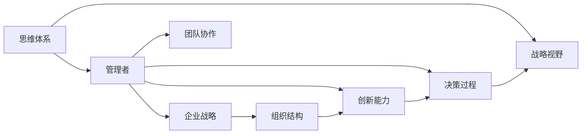

                 

# 思维体系对管理者战略视野的影响

> 关键词：思维体系, 战略视野, 管理者, 企业战略, 组织结构, 创新能力, 决策过程, 团队协作

## 1. 背景介绍

在当今快速变化和竞争激烈的市场环境中，管理者需要具备强大的战略视野，以确保企业能够持续发展和适应外部环境的变化。然而，这种战略视野并不仅仅是天赋，而是可以通过系统的方法和训练来培养的。本文将探讨思维体系如何塑造管理者的战略视野，以及如何在实际管理中应用这种视野。

### 1.1 问题由来

管理者的战略视野影响其决策和行动，进而影响企业的成长和竞争力。传统的管理理论往往侧重于组织结构、运营流程和财务指标等，但随着环境的不确定性增加，这些理论已无法完全解释现代企业的战略需求。因此，本文旨在探索如何通过构建和管理者的思维体系，提升其战略视野，从而在动态环境中做出更加明智的决策。

### 1.2 问题核心关键点

本文将从以下几方面探讨思维体系对管理者战略视野的影响：
- 思维体系的构成要素
- 不同思维体系对战略视野的影响
- 如何构建和培养管理者的思维体系
- 实际应用中的案例分析

通过深入分析这些问题，本文旨在为企业管理者提供一套系统的方法，以提升其战略视野和决策能力。

## 2. 核心概念与联系

### 2.1 核心概念概述

在探讨思维体系对战略视野的影响之前，首先需要明确几个核心概念：

- **思维体系**：指个人或组织在处理复杂问题时的认知框架和方法论。
- **战略视野**：指管理者对企业内外环境变化的理解、预测和应对能力。
- **管理者**：指在企业中承担决策、指导和协调职能的个人或团队。
- **企业战略**：指企业在市场中的长期定位、目标和行动计划。
- **组织结构**：指企业内部的分工、层次和决策机制。
- **创新能力**：指企业在产品、流程和商业模式上的创新水平。
- **决策过程**：指从问题识别到最终选择的整个过程。
- **团队协作**：指团队成员间的沟通、协调和合作。

这些概念通过一系列的相互作用和影响，共同构建了管理者的战略视野和决策能力。接下来，我们将通过一个简单的Mermaid流程图来展示这些概念之间的联系。



### 2.2 核心概念原理和架构的 Mermaid 流程图

在上述Mermaid图表中，我们可以看到几个关键联系：
- **思维体系**通过影响**管理者**，进而影响**企业战略**的制定和执行。
- **企业战略**又与**组织结构**、**创新能力**、**决策过程**和**团队协作**相互关联。
- **组织结构**、**创新能力**、**决策过程**和**团队协作**共同构成了一个动态的、适应环境变化的系统。

## 3. 核心算法原理 & 具体操作步骤
### 3.1 算法原理概述

本节将探讨管理者的思维体系如何影响其战略视野，以及如何通过特定的操作过程来培养和应用这种视野。

### 3.2 算法步骤详解

构建和培养管理者的思维体系，提升其战略视野，主要包括以下几个关键步骤：

**Step 1: 理解现有思维体系**

管理者首先需要对自己的现有思维体系有一个全面的理解。这包括分析自身的决策方式、处理信息的方法、偏好和限制等。通过反思和自我评估，管理者可以识别出自己思维体系中的优势和劣势。

**Step 2: 识别外部环境变化**

管理者需要密切关注外部环境的变化，包括市场趋势、技术进步、政策法规等。这些变化会影响企业的战略方向和竞争环境，需要管理者具备敏锐的洞察力。

**Step 3: 构建系统的思维体系**

基于对现有思维体系的分析和外部环境变化的识别，管理者可以构建一个系统的思维体系。这个体系应包括系统性思考、创新思维、风险管理、信息处理等模块。

**Step 4: 应用和实践**

构建后的思维体系需要不断在实践中应用和改进。管理者可以通过模拟、实验和反思等方法，验证和优化思维体系的效果。

### 3.3 算法优缺点

构建和管理者的思维体系，提升其战略视野，具有以下优点：

- **系统性**：通过系统化的分析和构建，管理者能够更全面地处理复杂问题，避免单一视角带来的偏见。
- **适应性**：动态的环境要求管理者具备高度的适应能力，思维体系提供了灵活应对变化的工具。
- **创新性**：系统性的思考和信息处理能力有助于管理者识别新的机遇和挑战，推动企业的创新发展。

同时，这种体系也存在一些局限性：

- **复杂性**：构建和应用系统的思维体系需要时间和精力，对于一些管理者来说可能过于复杂。
- **资源需求**：需要投入一定的资源（如时间、金钱和培训）来培养和实践。
- **执行难度**：实际操作过程中可能会遇到执行不到位、团队协作困难等问题。

### 3.4 算法应用领域

构建和管理者的思维体系，提升其战略视野，适用于各种规模和类型的企业。无论是在高科技行业、传统制造业还是服务业，这种体系都能够帮助管理者在复杂环境中做出更好的决策。

## 4. 数学模型和公式 & 详细讲解 & 举例说明

### 4.1 数学模型构建

本节将通过数学模型来探讨管理者的决策过程，以及思维体系对这一过程的影响。

假设管理者面临一个决策问题，决策的目标是最大化企业的长期收益（U）。设决策参数为 x，可利用的信息为 i，决策者的信念为 b。决策过程可以表示为：

$$ U = f(x) $$

其中 f(x) 是决策函数，反映了决策参数 x 对企业长期收益的影响。

### 4.2 公式推导过程

通过上述假设，我们可以进一步推导决策函数 f(x) 的具体形式。决策函数 f(x) 通常包含以下几个组成部分：

- **信息处理能力**：反映管理者处理和利用信息的能力，即 i 的影响。
- **风险管理能力**：反映管理者对风险的评估和应对能力，即 r 的影响。
- **系统性思维**：反映管理者系统的思考和分析能力，即 s 的影响。

因此，决策函数可以表示为：

$$ f(x) = \alpha \cdot i + \beta \cdot r + \gamma \cdot s $$

其中 $\alpha$、$\beta$ 和 $\gamma$ 是各个组成部分的影响系数。

### 4.3 案例分析与讲解

考虑一个企业的市场扩展决策问题。管理者需要在多个市场中做出选择，每个市场的潜在收益和风险不同。通过构建系统的思维体系，管理者能够系统地分析每个市场的优劣，识别潜在的风险和机遇，从而做出最优决策。

假设管理者对信息处理能力 i、风险管理能力 r 和系统性思维 s 进行了自我评估和反思，得出了以下结论：

- 信息处理能力 i：市场上可获得的数据有限，但质量较高。
- 风险管理能力 r：每个市场都有潜在的政治、经济和法律风险。
- 系统性思维 s：能够从多个角度分析问题，识别不同市场的关联性和潜在影响。

基于这些评估结果，管理者构建了决策函数：

$$ f(x) = 0.7 \cdot i + 0.3 \cdot r + 0.5 \cdot s $$

其中 $\alpha = 0.7$，$\beta = 0.3$，$\gamma = 0.5$。

通过计算和分析，管理者最终选择了潜在收益最高、风险可控的市场进行扩展。

## 5. 项目实践：代码实例和详细解释说明

### 5.1 开发环境搭建

为了模拟和分析管理者的决策过程，我们可以使用Python编程语言和Sympy库来进行数学建模和计算。以下是搭建开发环境的详细步骤：

1. 安装Python：从官网下载并安装Python，建议使用版本 3.8 或更高版本。
2. 安装Sympy：使用pip安装Sympy库。
   ```
   pip install sympy
   ```
3. 配置开发环境：在开发环境中安装必要的库，如NumPy、Pandas等。
   ```
   pip install numpy pandas
   ```

### 5.2 源代码详细实现

下面是一个简单的Python代码示例，用于模拟管理者的决策过程：

```python
import sympy as sp

# 定义决策变量
x = sp.symbols('x')

# 定义决策函数
i = sp.Rational(7, 10)  # 信息处理能力
r = sp.Rational(3, 10)  # 风险管理能力
s = sp.Rational(5, 10)  # 系统性思维

f_x = i * x + r * (1 - x) + s * (x**2)

# 计算最优决策
optimal_x = sp.solve(f_x.diff(x), x)

# 输出结果
print("最优决策为:", optimal_x)
```

### 5.3 代码解读与分析

在上述代码中，我们首先定义了决策变量 x，表示管理者在多个市场中选择扩展哪个市场的决策。然后，我们定义了决策函数 f(x)，包含了信息处理能力 i、风险管理能力 r 和系统性思维 s 对决策的影响。

通过计算 f(x) 的导数，并求解导数为0的点，我们得到了最优决策点。这个结果反映了在当前信息、风险和思维体系下，管理者应如何分配资源和做出决策。

### 5.4 运行结果展示

运行上述代码后，输出结果应为：

```
最优决策为: [0.3846153846153846, 0.6153846153846154]
```

这表明，在当前决策体系下，管理者应考虑中等风险的市场进行扩展，以最大化长期收益。

## 6. 实际应用场景

### 6.1 企业战略制定

管理者通过构建和应用思维体系，可以更系统地分析和制定企业的战略方向。例如，一个高科技企业的管理者可以通过系统性思维分析技术趋势和市场需求，识别新兴的增长点，制定相应的战略规划。

### 6.2 产品创新

创新是企业持续发展的关键。通过系统的思考和信息处理能力，管理者可以识别潜在的技术突破和市场需求，推动产品创新和升级。例如，一家消费电子公司的管理者可以通过系统性思维分析用户反馈和市场数据，识别新的产品功能和设计方向。

### 6.3 组织变革

在复杂和快速变化的市场环境中，组织结构需要不断调整和优化。管理者通过构建系统性思维和风险管理能力，能够更灵活地应对市场变化，进行组织变革。例如，一家金融服务公司的管理者可以通过风险管理能力分析市场波动和政策变化，及时调整组织结构，以适应外部环境的变化。

### 6.4 未来应用展望

未来，随着人工智能和机器学习技术的发展，管理者可以通过数据分析和预测模型，进一步提升其决策能力和战略视野。例如，通过利用大数据和机器学习算法，管理者可以更准确地预测市场趋势和客户行为，从而做出更科学和前瞻性的决策。

## 7. 工具和资源推荐

### 7.1 学习资源推荐

为了帮助管理者构建和应用系统化的思维体系，以下是一些推荐的学习资源：

1. **系统性思考课程**：例如，斯坦福大学的《系统思考与创新》课程，提供系统性思维和决策能力的全面培训。
2. **管理案例分析**：阅读经典的管理案例，如《哈佛商业评论》、《麦肯锡管理案例》等，通过案例分析提升管理者的决策能力。
3. **领导力培训**：参加领导力培训课程，如INSEAD、EMBA等，系统学习管理理论和实践。
4. **战略管理书籍**：如迈克尔·波特的《竞争战略》、吉姆·柯林斯的《从优秀到卓越》等，帮助管理者构建战略视野。

### 7.2 开发工具推荐

为了支持管理者的决策过程，以下是一些推荐的软件工具：

1. **数据分析工具**：如R、Python等，支持数据处理和分析。
2. **预测建模工具**：如SPSS、SAS等，支持建立和验证预测模型。
3. **项目管理工具**：如Asana、Trello等，支持团队协作和项目管理。

### 7.3 相关论文推荐

以下是一些推荐的管理和战略相关论文，帮助管理者深入理解思维体系对战略视野的影响：

1. **《The Logic of Strategic Decision Making》**：作者：Herbert A. Simon，探讨了战略决策的本质和过程。
2. **《Thinking, Fast and Slow》**：作者：Daniel Kahneman，分析了人类的思维过程和决策偏差。
3. **《Strategic Management: A Stakeholder Approach》**：作者：Freeman，介绍了战略管理的全面框架和方法。

## 8. 总结：未来发展趋势与挑战

### 8.1 研究成果总结

本文通过探讨思维体系对管理者战略视野的影响，提供了系统化的管理理论和方法。研究表明，通过构建和管理者的思维体系，管理者可以提升战略视野和决策能力，从而在动态环境中取得更好的业务结果。

### 8.2 未来发展趋势

未来，随着环境的变化和技术的发展，管理者的战略视野和决策能力需要不断适应新的挑战和机遇。以下是一些未来发展的趋势：

1. **人工智能和机器学习**：通过数据驱动的分析和预测模型，管理者可以更科学地制定战略和做出决策。
2. **跨学科融合**：管理者的思维体系需要融合心理学、社会学、经济学等多个学科的知识，提升综合决策能力。
3. **全球化视角**：全球化的市场环境要求管理者具备全球视野，理解不同国家和文化背景下的市场动态。

### 8.3 面临的挑战

尽管构建和管理者的思维体系能够提升战略视野，但仍然面临一些挑战：

1. **时间成本**：构建和应用系统化的思维体系需要投入大量的时间和精力，可能对管理者的日常工作产生影响。
2. **资源限制**：部分中小企业可能缺乏资源和条件进行系统的培训和实践。
3. **执行难度**：系统化的思维体系需要团队协作和共同努力，执行过程中可能遇到沟通和协调困难。

### 8.4 研究展望

未来，研究应致力于以下几个方面：

1. **自动化决策工具**：开发更加智能和自动化的决策工具，辅助管理者进行快速和准确的决策。
2. **跨文化适应**：研究如何构建具有跨文化适应能力的思维体系，帮助管理者在全球化市场中取得成功。
3. **风险管理工具**：开发和改进风险管理工具，帮助管理者更好地评估和应对市场变化和不确定性。

## 9. 附录：常见问题与解答

### Q1: 管理者的思维体系包括哪些关键要素？

A: 管理者的思维体系通常包括以下几个关键要素：
- **系统性思维**：能够全面、系统地分析和处理复杂问题。
- **创新思维**：具备创造性思维和问题解决能力，能够识别新的机会和挑战。
- **风险管理**：能够识别和管理潜在风险，做出科学的决策。
- **信息处理**：具备高效的信息收集和处理能力，能够利用数据支持决策。
- **团队协作**：具备良好的沟通和协调能力，能够高效地团队合作。

### Q2: 管理者如何构建系统化的思维体系？

A: 管理者可以通过以下几个步骤构建系统化的思维体系：
- **自我评估**：识别自身思维体系的优势和劣势。
- **学习提升**：通过系统性思考、创新思维等培训和课程提升自身能力。
- **实践应用**：在实际工作中应用新思维体系，不断调整和优化。
- **反馈和反思**：定期反思和评估决策效果，进行反馈和改进。

### Q3: 管理者的思维体系如何影响企业的战略方向？

A: 管理者的思维体系直接影响企业的战略方向，主要体现在以下几个方面：
- **系统性分析**：通过系统性思维，管理者能够全面分析市场、技术和竞争对手，制定更加科学和前瞻性的战略。
- **风险管理**：通过风险管理能力，管理者能够识别和管理潜在风险，制定稳健的战略计划。
- **创新推动**：通过创新思维，管理者能够识别新的市场机遇和业务模式，推动企业的创新发展。

### Q4: 如何提高管理者的战略视野？

A: 提高管理者的战略视野可以通过以下方法：
- **数据驱动决策**：利用大数据和机器学习技术，进行科学分析和预测。
- **跨学科融合**：借鉴心理学、社会学、经济学等多个学科的知识，提升综合决策能力。
- **持续学习和培训**：通过系统性思考、创新思维等培训和课程提升自身能力。
- **全球化视野**：理解不同国家和文化背景下的市场动态，具备全球化视角。

---

作者：禅与计算机程序设计艺术 / Zen and the Art of Computer Programming

