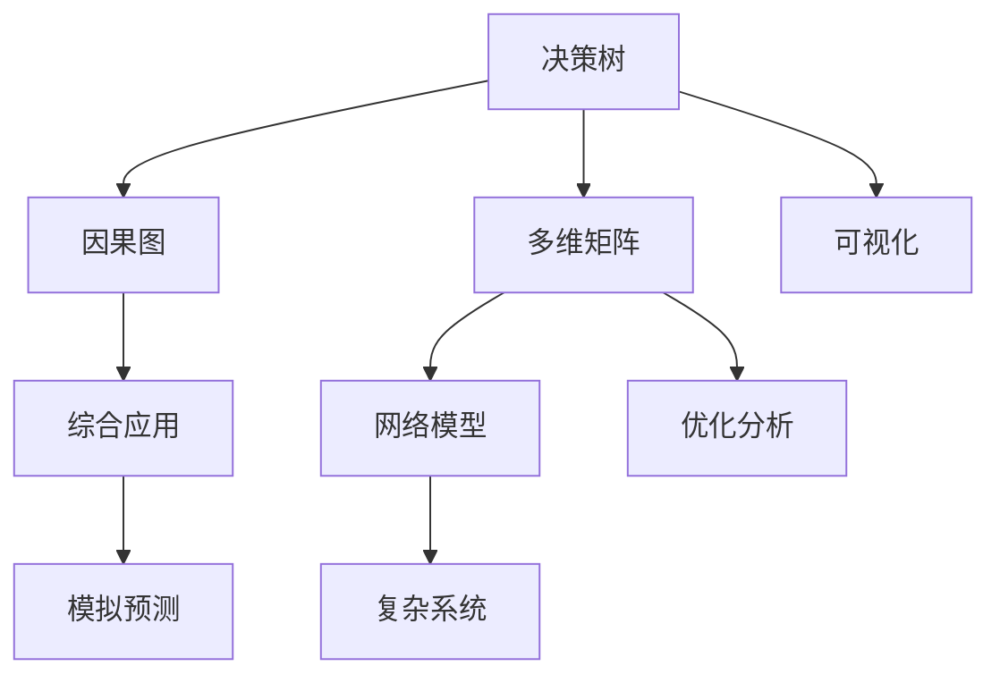

                 

# 思维模型：提升理解力和决策能力的工具箱

## 1. 背景介绍

### 1.1 问题由来
在现代快节奏的生活中，信息爆炸和知识快速迭代使得个体需要具备高度的认知灵活性和复杂决策能力。无论是商业决策、科学研究，还是日常生活中的人际交往，有效理解和决策变得愈发重要。然而，传统的线性思维方式在复杂动态环境中往往显得力不从心。

为了应对这些挑战，思维模型作为一种系统化、结构化的思考工具，应运而生。它通过模拟人类思维过程，帮助个体构建起一个更为立体、多元的认知框架，从而提升理解力和决策能力。本文将系统介绍几种经典的思维模型，并探讨其在提升认知灵活性和复杂决策能力方面的应用。

### 1.2 问题核心关键点
思维模型主要包括决策树模型、因果图模型、多维矩阵模型和网络模型等。这些模型从不同的角度模拟了人类思维过程，各自有着独特的优势和适用场景。

- 决策树模型：通过树形结构表示决策流程，便于理解和实现。
- 因果图模型：通过图谱形式展示变量之间的关系，便于识别和控制因果关系。
- 多维矩阵模型：通过矩阵形式展示多维度变量之间的交互关系，便于综合分析和优化。
- 网络模型：通过网络结构模拟复杂系统，便于模拟和预测。

掌握这些思维模型，有助于提升个体的认知灵活性和复杂决策能力，使个体能够在复杂环境中作出更为准确、高效的决策。

## 2. 核心概念与联系

### 2.1 核心概念概述

为更好地理解思维模型的工作原理和优化方向，本节将介绍几个密切相关的核心概念：

- 决策树（Decision Tree）：通过树形结构表示决策流程的模型，便于理解和实现。
- 因果图（Causal Graph）：用图谱形式展示变量之间关系的模型，便于识别和控制因果关系。
- 多维矩阵（Multidimensional Matrix）：展示多维度变量交互关系的矩阵形式模型，便于综合分析和优化。
- 网络模型（Network Model）：模拟复杂系统的网络结构模型，便于模拟和预测。

这些核心概念之间的逻辑关系可以通过以下Mermaid流程图来展示：



这个流程图展示了一系列思维模型及其之间的联系：

1. 决策树模型是基础，适用于简单决策流程。
2. 因果图模型基于决策树，进一步探索变量之间的因果关系。
3. 多维矩阵模型扩展了决策树和因果图，适用于多维度分析。
4. 网络模型可以处理更复杂的关系网络，适用于模拟复杂系统。
5. 可视化工具帮助理解这些模型，而优化分析工具则用于提高模型精度。
6. 综合应用能将不同模型结合，实现全面分析和预测。

## 3. 核心算法原理 & 具体操作步骤

### 3.1 算法原理概述

不同的思维模型有着不同的算法原理，但它们共同的目标是帮助个体提升理解力和决策能力。以下是几个主要思维模型的算法原理概述：

- **决策树模型**：通过递归地划分数据集，构建一棵树形结构。节点为特征，边为特征取值，叶子节点为决策结果。每个节点选择最优划分特征的过程通常采用基尼指数或信息增益等度量标准。

- **因果图模型**：以有向无环图的形式展示变量之间的关系，节点表示变量，有向边表示因果关系。常用算法包括PC算法和FCI算法，用于推断变量间的因果关系和预测结果。

- **多维矩阵模型**：通过矩阵形式展示变量之间的交互关系，常用矩阵运算和统计分析方法如PCA、SVD等，用于降维和特征分析。

- **网络模型**：通过网络结构模拟复杂系统，常用的算法包括神经网络、图神经网络等，用于模拟和预测复杂系统的行为。

### 3.2 算法步骤详解

以下是几个主要思维模型的具体操作步骤：

#### 决策树模型

**Step 1: 数据准备**
- 收集训练数据，进行数据预处理，包括特征工程、数据清洗等。
- 选择特征作为决策树节点。

**Step 2: 特征选择**
- 计算每个特征的基尼指数或信息增益，选择最优特征进行划分。
- 重复以上步骤，递归构建树形结构。

**Step 3: 模型训练**
- 使用训练数据训练决策树模型，验证模型的准确率和过拟合情况。
- 对模型进行剪枝，避免过拟合。

**Step 4: 模型应用**
- 使用训练好的模型对新数据进行预测。

#### 因果图模型

**Step 1: 数据收集**
- 收集数据，确保数据能够展示变量之间的因果关系。
- 使用PC算法或FCI算法对数据进行分析。

**Step 2: 变量选择**
- 选择有代表性的变量进行建模。
- 构建有向无环图，展示变量之间的因果关系。

**Step 3: 模型训练**
- 使用因果图模型进行训练，推断变量间的因果关系。
- 验证模型的准确率和鲁棒性。

**Step 4: 模型应用**
- 使用训练好的模型对新数据进行预测，识别因果关系。

#### 多维矩阵模型

**Step 1: 数据收集**
- 收集多维度变量数据。
- 使用PCA或SVD等算法进行降维。

**Step 2: 矩阵构建**
- 构建多维矩阵，展示变量之间的交互关系。
- 进行矩阵运算和统计分析。

**Step 3: 模型训练**
- 使用矩阵模型进行训练，优化矩阵参数。
- 验证模型的准确率和泛化能力。

**Step 4: 模型应用**
- 使用训练好的模型进行综合分析和预测。

#### 网络模型

**Step 1: 数据收集**
- 收集数据，确保数据能够展示网络结构。
- 使用神经网络或图神经网络进行建模。

**Step 2: 网络构建**
- 构建网络结构，展示节点和边之间的关系。
- 训练网络模型，优化网络参数。

**Step 3: 模型训练**
- 使用网络模型进行训练，预测复杂系统的行为。
- 验证模型的准确率和鲁棒性。

**Step 4: 模型应用**
- 使用训练好的模型进行模拟和预测。

### 3.3 算法优缺点

不同的思维模型有着各自的优缺点：

- **决策树模型**：易于理解和实现，适合处理简单的决策问题。但可能存在过拟合问题，需要谨慎选择特征和剪枝。

- **因果图模型**：能识别变量间的因果关系，适用于复杂系统分析。但构建和验证过程复杂，需要大量数据。

- **多维矩阵模型**：适合处理多维度数据，便于综合分析和优化。但模型复杂度较高，训练成本高。

- **网络模型**：能处理更复杂的系统关系，适用于大规模数据分析。但模型训练复杂，对硬件要求高。

这些模型在实际应用中需要根据具体问题选择合适的模型，并结合其他方法进行综合优化。

### 3.4 算法应用领域

不同的思维模型在多个领域中得到了广泛应用，包括商业决策、科学研究、工程设计等。以下是几个主要应用领域：

- **商业决策**：在市场营销、风险管理、供应链优化等领域，决策树和因果图模型帮助企业识别最优决策路径，优化决策效果。
- **科学研究**：在生物医学、环境科学、社会科学等领域，多维矩阵和网络模型帮助科学家分析数据，预测趋势，制定研究方案。
- **工程设计**：在机械设计、电子工程、材料科学等领域，因果图和多维矩阵模型帮助工程师优化设计方案，提升系统性能。

## 4. 数学模型和公式 & 详细讲解 & 举例说明

### 4.1 数学模型构建

以下将使用数学语言对几种主要思维模型的数学模型进行详细构建。

#### 决策树模型

决策树模型基于信息熵或基尼指数，通过递归划分数据集，构建树形结构。假设数据集为 $D = \{(x_i, y_i)\}_{i=1}^N$，其中 $x_i$ 为特征向量，$y_i$ 为目标变量。决策树模型的构建过程如下：

1. 计算每个特征的信息增益或基尼指数。
2. 选择最优特征进行划分，递归构建树形结构。
3. 对模型进行剪枝，避免过拟合。

#### 因果图模型

因果图模型基于有向无环图（DAG），展示变量之间的因果关系。假设数据集为 $D = \{(x_i, y_i)\}_{i=1}^N$，其中 $x_i$ 为变量向量，$y_i$ 为目标变量。因果图模型的构建过程如下：

1. 使用PC算法或FCI算法推断变量间的因果关系。
2. 构建有向无环图，展示变量之间的因果关系。
3. 使用因果图模型进行训练，推断变量间的因果关系。

#### 多维矩阵模型

多维矩阵模型基于矩阵形式，展示变量之间的交互关系。假设数据集为 $D = \{(x_i, y_i)\}_{i=1}^N$，其中 $x_i$ 为多维度特征向量，$y_i$ 为目标变量。多维矩阵模型的构建过程如下：

1. 使用PCA或SVD等算法进行降维。
2. 构建多维矩阵，展示变量之间的交互关系。
3. 进行矩阵运算和统计分析。

#### 网络模型

网络模型基于神经网络或图神经网络，展示节点和边之间的关系。假设数据集为 $D = \{(x_i, y_i)\}_{i=1}^N$，其中 $x_i$ 为节点特征向量，$y_i$ 为目标变量。网络模型的构建过程如下：

1. 使用神经网络或图神经网络进行建模。
2. 构建网络结构，展示节点和边之间的关系。
3. 训练网络模型，优化网络参数。

### 4.2 公式推导过程

以下将详细推导几个主要思维模型的公式。

#### 决策树模型

决策树模型的核心公式为信息熵和基尼指数。信息熵公式如下：

$$
H(X) = -\sum_{i=1}^n P_i \log P_i
$$

其中，$P_i$ 为特征 $x_i$ 的概率分布。基尼指数公式如下：

$$
Gini(X) = 1 - \sum_{i=1}^n P_i^2
$$

基尼指数越小，特征越纯净，信息增益越大，决策树越有效。

#### 因果图模型

因果图模型的核心公式为结构方程模型（SEM）。假设数据集为 $D = \{(x_i, y_i)\}_{i=1}^N$，其中 $x_i$ 为变量向量，$y_i$ 为目标变量。结构方程模型公式如下：

$$
y = \beta_0 + \sum_{j=1}^k \beta_j x_j + \epsilon
$$

其中，$\beta$ 为回归系数，$\epsilon$ 为误差项。通过求解结构方程，可以推断变量间的因果关系。

#### 多维矩阵模型

多维矩阵模型的核心公式为奇异值分解（SVD）。假设数据集为 $D = \{(x_i, y_i)\}_{i=1}^N$，其中 $x_i$ 为多维度特征向量，$y_i$ 为目标变量。奇异值分解公式如下：

$$
X = U \Sigma V^T
$$

其中，$U$ 和 $V$ 为正交矩阵，$\Sigma$ 为对角矩阵。通过奇异值分解，可以降低维度和提取主成分。

#### 网络模型

网络模型的核心公式为反向传播算法。假设数据集为 $D = \{(x_i, y_i)\}_{i=1}^N$，其中 $x_i$ 为节点特征向量，$y_i$ 为目标变量。反向传播算法公式如下：

$$
\delta_l = (\frac{\partial C}{\partial z_{l+1}}) w_l
$$

其中，$\delta_l$ 为误差项，$z_{l+1}$ 为节点输出，$w_l$ 为权重矩阵。通过反向传播算法，可以优化网络参数，提高模型精度。

### 4.3 案例分析与讲解

#### 案例1: 金融风险管理

某金融公司希望通过决策树模型进行信用风险评估。公司收集了历史贷款数据，包括借款人的年龄、收入、职业等特征。通过决策树模型，公司可以构建一个树形结构，识别最优的贷款评估指标，从而提高贷款审批效率和风险控制能力。

#### 案例2: 环境污染分析

某环保组织希望通过因果图模型分析空气污染对人类健康的影响。组织收集了空气质量数据和健康数据，使用因果图模型推断空气污染与健康之间的因果关系。通过模型结果，组织可以制定更有效的污染控制策略，保护公众健康。

#### 案例3: 推荐系统设计

某电商公司希望通过多维矩阵模型设计推荐系统。公司收集了用户行为数据，包括浏览、购买、评价等，通过多维矩阵模型进行综合分析，识别用户兴趣和行为模式。通过模型结果，公司可以推荐用户可能感兴趣的商品，提高用户满意度和销售额。

#### 案例4: 社交网络分析

某社交平台希望通过网络模型分析用户关系和影响力。平台收集了用户互动数据，包括点赞、评论、分享等，使用网络模型构建用户关系图谱。通过模型结果，平台可以识别影响力和传播效果，优化社交内容的推送策略。

## 5. 项目实践：代码实例和详细解释说明

### 5.1 开发环境搭建

在进行思维模型开发前，我们需要准备好开发环境。以下是使用Python进行决策树模型开发的環境配置流程：

1. 安装Anaconda：从官网下载并安装Anaconda，用于创建独立的Python环境。

2. 创建并激活虚拟环境：
```bash
conda create -n scikit-learn-env python=3.8 
conda activate scikit-learn-env
```

3. 安装Scikit-learn：
```bash
conda install scikit-learn
```

4. 安装NumPy、Pandas等工具包：
```bash
pip install numpy pandas
```

完成上述步骤后，即可在`scikit-learn-env`环境中开始思维模型开发。

### 5.2 源代码详细实现

以下是使用Scikit-learn库进行决策树模型开发的Python代码实现。

```python
from sklearn import datasets
from sklearn.tree import DecisionTreeClassifier
from sklearn.model_selection import train_test_split
from sklearn.metrics import accuracy_score

# 加载数据集
iris = datasets.load_iris()
X = iris.data
y = iris.target

# 划分训练集和测试集
X_train, X_test, y_train, y_test = train_test_split(X, y, test_size=0.2, random_state=42)

# 创建决策树模型
clf = DecisionTreeClassifier()

# 训练模型
clf.fit(X_train, y_train)

# 预测测试集
y_pred = clf.predict(X_test)

# 评估模型
print("Accuracy:", accuracy_score(y_test, y_pred))
```

### 5.3 代码解读与分析

让我们再详细解读一下关键代码的实现细节：

**加载数据集**：
- 使用Scikit-learn内置的Iris数据集，包括花萼长度、花萼宽度、花瓣长度、花瓣宽度等特征。

**划分数据集**：
- 使用`train_test_split`函数将数据集划分为训练集和测试集，比例为80:20。

**创建模型**：
- 使用`DecisionTreeClassifier`创建决策树模型。

**训练模型**：
- 使用`fit`函数训练模型，训练数据为训练集。

**预测测试集**：
- 使用`predict`函数对测试集进行预测，得到预测结果。

**评估模型**：
- 使用`accuracy_score`函数计算模型在测试集上的准确率。

**运行结果展示**：
- 输出模型在测试集上的准确率。

## 6. 实际应用场景

### 6.1 智能决策支持

智能决策支持系统通过综合应用决策树、因果图和多维矩阵模型，帮助决策者从大量数据中提取关键信息和识别决策路径。例如，在医疗诊断中，智能决策支持系统可以通过决策树模型识别疾病症状，通过因果图模型推断疾病之间的因果关系，通过多维矩阵模型综合分析多种检查结果，最终给出诊断和治疗建议。

### 6.2 数据分析与挖掘

数据分析和挖掘是数据科学的重要应用方向，通过多维矩阵和网络模型，可以深入挖掘数据中的潜在模式和关系。例如，在社交媒体分析中，网络模型可以构建用户互动图谱，识别关键影响者和传播路径，多维矩阵模型可以综合分析用户的兴趣和行为模式，帮助企业制定更精准的市场策略。

### 6.3 自动化设计优化

在工程设计和产品优化中，决策树和因果图模型可以识别关键影响因素，多维矩阵模型可以综合分析多种变量，网络模型可以模拟复杂系统，从而优化设计和优化方案。例如，在汽车设计中，决策树模型可以识别最优材料组合，因果图模型可以推断不同因素对性能的影响，多维矩阵模型可以综合分析各种实验结果，网络模型可以模拟不同设计方案的效果。

### 6.4 未来应用展望

随着技术的不断发展，思维模型在各个领域的应用将更加广泛和深入。未来的趋势包括：

1. 智能决策支持系统的普及：通过更智能的算法和更大的数据集，智能决策支持系统将能够提供更为精准和高效的决策支持。
2. 自动化设计和优化：思维模型将进一步应用于自动化设计和优化，从而提升产品和系统的性能和效率。
3. 多模态数据的融合：思维模型将能够处理多模态数据，如文本、图像、视频等，实现更全面的数据分析和建模。
4. 预测和模拟的精确度提升：通过优化算法和更多数据，思维模型的预测和模拟能力将大幅提升，从而为决策提供更为可靠的信息支持。

## 7. 工具和资源推荐

### 7.1 学习资源推荐

为了帮助开发者系统掌握思维模型的工作原理和应用方法，这里推荐一些优质的学习资源：

1. 《Python数据科学手册》：详细介绍了Scikit-learn、Pandas、NumPy等库的使用方法，适合入门和进阶学习。

2. 《机器学习实战》：提供了丰富的案例和代码示例，适合实战练习和项目开发。

3. 《因果推理与因果图模型》：深入介绍了因果图模型的原理和应用，适合深入学习。

4. 《数据科学入门》：讲解了数据科学的基本概念和工具，适合入门学习。

5. 《深度学习》：涵盖了深度学习的核心理论和算法，适合进一步深入学习。

通过对这些资源的学习实践，相信你一定能够快速掌握思维模型的精髓，并用于解决实际问题。

### 7.2 开发工具推荐

高效的开发离不开优秀的工具支持。以下是几款用于思维模型开发的常用工具：

1. Python：基于Python的数据科学和机器学习生态系统，适合快速迭代和实验。

2. Scikit-learn：基于Python的机器学习库，提供了丰富的算法和工具，适合数据分析和建模。

3. TensorFlow：由Google主导开发的深度学习框架，生产部署方便，适合大规模工程应用。

4. PyTorch：基于Python的深度学习框架，灵活动态，适合快速实验和研究。

5. Jupyter Notebook：基于Web的交互式编程环境，适合数据分析和模型开发。

合理利用这些工具，可以显著提升思维模型的开发效率，加快创新迭代的步伐。

### 7.3 相关论文推荐

思维模型的发展源于学界的持续研究。以下是几篇奠基性的相关论文，推荐阅读：

1. Quinlan, J. R. (1986). "Induction of Decision Trees." Machine Learning. 1: 81-106.

2. Pearl, J. (2000). Causality: Models, Reasoning and Inference. Cambridge University Press.

3. Panos Papadimitriou, Dimitris Bertsimas (2000). "On the Computation of Causal Effects: An Introduction to Causal Inference." MIT Press.

4. Scholkopf, B., Smola, A. J., and Müller, K. R. (2001). "Nonlinear Component Analysis as a Kernel Eigenvalue Problem." Neural Computation. 13: 431-465.

5. DeepMind (2016). "DeepMind Networks: Towards General Intelligence with Limited Data." Nature. 538: 471-475.

这些论文代表了大数据和机器学习领域的经典成果，通过学习这些前沿成果，可以帮助研究者把握学科前进方向，激发更多的创新灵感。

## 8. 总结：未来发展趋势与挑战

### 8.1 总结

本文对几种主要思维模型进行了全面系统的介绍，从原理到实践，详细讲解了思维模型的工作原理和操作步骤，给出了思维模型任务开发的完整代码实例。通过本文的系统梳理，可以看到，思维模型在提升个体认知灵活性和复杂决策能力方面的独特价值。

### 8.2 未来发展趋势

展望未来，思维模型将在更多领域得到应用，带来更广泛的影响：

1. 智能决策支持系统：通过更智能的算法和更大的数据集，智能决策支持系统将能够提供更为精准和高效的决策支持。

2. 自动化设计和优化：思维模型将进一步应用于自动化设计和优化，从而提升产品和系统的性能和效率。

3. 多模态数据的融合：思维模型将能够处理多模态数据，如文本、图像、视频等，实现更全面的数据分析和建模。

4. 预测和模拟的精确度提升：通过优化算法和更多数据，思维模型的预测和模拟能力将大幅提升，从而为决策提供更为可靠的信息支持。

5. 认知增强：未来的人工智能系统将具备更为强大的认知能力，能够理解和推理人类思维过程，进一步提升决策的精准性和可靠性。

6. 自主学习：思维模型将具备自主学习能力，通过持续学习和优化，不断提高自身精度和鲁棒性。

以上趋势凸显了思维模型在提升个体和系统智能方面的广阔前景，为构建智能人机交互系统奠定了基础。

### 8.3 面临的挑战

尽管思维模型在各个领域的应用已经取得了显著进展，但仍面临诸多挑战：

1. 数据质量和多样性：思维模型依赖于高质量、多样化的数据集，但实际应用中往往面临数据稀疏、噪声等问题，影响模型精度。

2. 模型复杂度和可解释性：复杂的思维模型往往难以解释其内部工作机制和决策逻辑，影响模型的可信度和应用范围。

3. 训练成本和时间：大规模数据的训练和优化需要大量计算资源和时间，限制了思维模型的应用范围。

4. 跨领域模型的泛化性：不同领域的思维模型需要独立开发和优化，难以实现跨领域的泛化应用。

5. 实时性和资源消耗：实时性和资源消耗是思维模型应用于大规模系统时的重要挑战，需要优化算法和硬件支持。

### 8.4 研究展望

面对思维模型面临的这些挑战，未来的研究需要在以下几个方面寻求新的突破：

1. 数据增强和清洗：通过数据增强和清洗技术，提高数据质量和多样性，提升模型精度。

2. 模型简化和优化：通过简化模型结构和优化算法，提高模型的可解释性和实时性。

3. 跨领域模型的泛化：通过知识迁移和协同训练，实现跨领域模型的泛化应用。

4. 计算资源的优化：通过分布式计算和硬件加速，优化模型训练和推理效率。

5. 多模态数据的融合：通过多模态数据的协同建模，提升模型的综合分析和预测能力。

这些研究方向的探索，必将引领思维模型走向更高的台阶，为构建智能人机交互系统铺平道路。面向未来，思维模型需要与其他人工智能技术进行更深入的融合，如知识表示、因果推理、强化学习等，多路径协同发力，共同推动自然语言理解和智能交互系统的进步。只有勇于创新、敢于突破，才能不断拓展思维模型的边界，让智能技术更好地造福人类社会。

## 9. 附录：常见问题与解答

**Q1：如何使用思维模型提升决策能力？**

A: 使用思维模型提升决策能力的关键在于选择合适的模型，并结合具体问题进行优化。例如，在金融风险管理中，可以使用因果图模型识别最优的风险评估指标，在医疗诊断中，可以使用决策树模型识别疾病症状和推断因果关系。通过系统化的思维模型，可以从数据中提取关键信息和识别决策路径，从而提升决策的精准性和可靠性。

**Q2：思维模型在处理数据时有哪些注意事项？**

A: 思维模型在处理数据时需要注意以下几点：

1. 数据质量和多样性：确保数据集的质量和多样性，避免过拟合和噪声影响模型精度。

2. 特征选择和工程：选择合适的特征进行建模，进行数据预处理和特征工程，提升模型效果。

3. 模型调参：根据具体问题选择合适的模型和算法，进行模型调参，优化模型性能。

4. 验证和评估：使用验证集和测试集进行模型验证和评估，确保模型泛化能力和鲁棒性。

**Q3：思维模型在应用中需要注意哪些问题？**

A: 思维模型在应用中需要注意以下几点：

1. 模型的可解释性：确保思维模型具有良好的可解释性，便于理解和解释决策过程。

2. 模型的实时性和资源消耗：优化模型结构和算法，提高实时性和资源利用效率。

3. 模型的跨领域泛化：通过知识迁移和协同训练，实现跨领域模型的泛化应用。

4. 模型的动态适应：确保思维模型具备动态适应能力，能够持续学习和优化。

5. 模型的伦理和安全：确保思维模型符合伦理和安全要求，避免偏见和有害输出。

这些问题的解决需要结合具体问题和场景进行综合考虑，从而确保思维模型的有效性和可靠性。

---

作者：禅与计算机程序设计艺术 / Zen and the Art of Computer Programming

