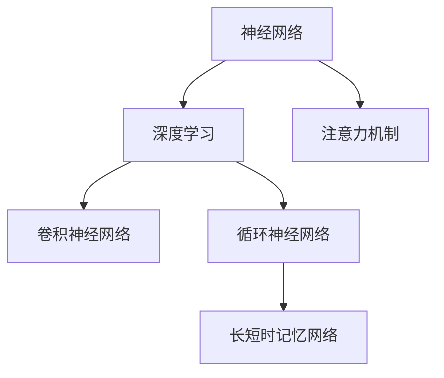

                 

# 思维的地图：认知科学如何解析人类理解过程

## 1. 背景介绍

### 1.1 问题由来
人类大脑是一个复杂的认知系统，长期以来一直是认知科学家、神经科学家和计算机科学家关注的热点。理解人类大脑的工作机制，不仅有助于揭示人类认知的本质，还能够为人工智能的发展提供有益的借鉴。

随着脑科学研究的深入，人们逐渐认识到，人类大脑的信息处理机制并不是简单的“黑盒”。大脑通过一系列的神经网络结构和算法，对输入的信息进行编码、解码、加工和存储。这些神经网络结构和算法，构成了大脑处理信息的“地图”。通过解析这些“地图”，我们可以更深入地理解人类大脑的工作原理。

### 1.2 问题核心关键点
理解人类大脑的信息处理机制，关键在于揭示其神经网络结构和算法原理。这不仅需要借助神经科学的实验手段，还需要运用计算机科学的方法，构建数学模型和算法框架，对大脑的信息处理过程进行模拟和解释。

现代认知科学研究已经发展出一系列工具和技术，如功能磁共振成像(fMRI)、事件相关电位(ERP)、脑磁图(MEG)等，能够非侵入性地记录大脑的活动，获取海量的神经活动数据。这些数据为研究大脑的认知过程提供了丰富的材料，同时也提出了对算法和模型的新要求。

## 2. 核心概念与联系

### 2.1 核心概念概述

为了更好地理解认知科学如何解析人类理解过程，我们需要掌握几个关键概念：

- **神经网络(Neural Networks)**：由大量神经元组成的计算模型，用于模拟大脑神经元之间的信息传递和处理。神经网络的结构和参数决定了其信息处理能力。
- **深度学习(Deep Learning)**：一种基于多层神经网络的机器学习方法，能够自动从数据中学习特征表示，适用于复杂的模式识别和决策任务。
- **卷积神经网络(CNN)**：一种广泛应用于图像处理的深度学习模型，通过卷积操作提取图像中的特征。
- **循环神经网络(RNN)**：一种适用于序列数据处理的深度学习模型，能够对时间序列进行建模。
- **长短时记忆网络(LSTM)**：一种特殊的RNN，通过门控机制有效解决了传统RNN的梯度消失和梯度爆炸问题。
- **注意力机制(Attention Mechanism)**：一种能够动态选择信息重要性的机制，广泛用于机器翻译、图像描述生成等任务。

这些概念之间的逻辑关系可以通过以下Mermaid流程图来展示：



这个流程图展示了神经网络、深度学习、卷积神经网络、循环神经网络、长短时记忆网络和注意力机制之间的关系：

1. 神经网络是深度学习和卷积神经网络的基础。
2. 循环神经网络和长短时记忆网络是深度学习中的特殊形式，适用于序列数据处理。
3. 注意力机制是深度学习中的一种重要机制，用于动态选择信息。

这些概念共同构成了认知科学解析人类理解过程的理论基础，为理解和模拟人类大脑的信息处理机制提供了重要工具。

## 3. 核心算法原理 & 具体操作步骤
### 3.1 算法原理概述

认知科学解析人类理解过程的核心算法原理，主要包括神经网络结构和深度学习算法。以下详细介绍这些算法的基本原理：

- **前馈神经网络(Feedforward Neural Network)**：最简单的神经网络结构，由输入层、隐藏层和输出层组成。信息从前向传递，每层通过激活函数进行非线性变换，最终输出结果。前馈神经网络广泛应用于图像识别、语音识别等任务。
- **卷积神经网络(CNN)**：在图像识别等任务中表现出色，通过卷积操作提取局部特征，并通过池化操作降低特征维度。CNN的参数共享特性使得其对噪声具有一定的不变性。
- **循环神经网络(RNN)**：适用于序列数据的处理，能够通过内部状态记忆历史信息。RNN通过反向传播算法进行训练，但其梯度消失和梯度爆炸问题限制了其应用范围。
- **长短时记忆网络(LSTM)**：一种改进的RNN，通过门控机制有效解决了梯度消失和梯度爆炸问题，适用于时间序列数据的建模。LSTM的内部状态单元包含输入门、遗忘门和输出门，能够动态调整信息传递。
- **注意力机制(Attention Mechanism)**：一种能够动态选择重要信息的机制，通过计算注意力权重，使模型聚焦于重要信息。注意力机制广泛应用于机器翻译、图像描述生成等任务。

### 3.2 算法步骤详解

以下详细介绍认知科学解析人类理解过程的详细步骤：

**Step 1: 数据准备**
- 收集和标注相关领域的数据，如语言理解、图像分类、视频分析等。
- 将数据划分为训练集、验证集和测试集，以评估模型性能。

**Step 2: 模型选择**
- 根据任务特点选择合适的神经网络结构，如卷积神经网络、循环神经网络或长短时记忆网络。
- 确定模型的参数和超参数，如隐藏层大小、激活函数、学习率等。

**Step 3: 模型训练**
- 使用训练集数据对模型进行前向传播和反向传播，计算损失函数。
- 通过优化算法(如梯度下降、Adam等)更新模型参数，最小化损失函数。
- 周期性在验证集上评估模型性能，根据性能指标调整超参数。
- 重复上述步骤直至模型收敛。

**Step 4: 模型评估**
- 在测试集上评估模型的性能，使用评估指标(如准确率、召回率、F1值等)衡量模型效果。
- 分析模型的错误类型和性能瓶颈，进行模型优化。

**Step 5: 模型应用**
- 将模型部署到实际应用中，对新的数据进行预测或推理。
- 持续收集反馈数据，对模型进行迭代优化。

### 3.3 算法优缺点

认知科学解析人类理解过程的算法具有以下优点：
1. 灵活性高。神经网络结构和深度学习算法能够适应多种任务类型，如图像识别、语音识别、自然语言处理等。
2. 性能优异。深度学习算法在许多任务中表现出色，能够处理复杂的模式识别和决策问题。
3. 可解释性强。神经网络结构和深度学习算法具有很强的解释性，能够揭示数据的特征表示和关系。

同时，这些算法也存在一些缺点：
1. 计算资源消耗大。大规模神经网络需要大量的计算资源，尤其是深度学习模型。
2. 参数量巨大。神经网络结构和深度学习算法通常具有大量的参数，需要更多的数据进行训练。
3. 训练时间长。深度学习模型的训练时间较长，对计算资源和数据量的要求较高。

尽管存在这些局限性，但深度学习算法仍然是大数据时代的代表性方法，为解析人类理解过程提供了强大的技术支持。

### 3.4 算法应用领域

认知科学解析人类理解过程的算法已经在多个领域得到应用：

- 自然语言处理(NLP)：如机器翻译、语音识别、情感分析等。
- 计算机视觉(Computer Vision)：如图像分类、目标检测、图像生成等。
- 语音识别(Speech Recognition)：如语音转文本、说话人识别、语音情感分析等。
- 医疗诊断(Medical Diagnosis)：如图像诊断、病历分析、基因组学等。
- 金融分析(Financial Analysis)：如股票预测、风险评估、信用评分等。

这些应用场景展示了深度学习算法在解析人类理解过程方面的强大能力，为各个领域的技术创新和产业发展提供了有力支持。

## 4. 数学模型和公式 & 详细讲解 & 举例说明

### 4.1 数学模型构建

认知科学解析人类理解过程的算法，通常基于神经网络和深度学习模型。以下详细介绍这些模型的一般形式和构建过程：

- **前馈神经网络**：由输入层、隐藏层和输出层组成，模型的一般形式如下：

$$
h = \sigma(W_1 x + b_1)
$$
$$
y = \sigma(W_2 h + b_2)
$$

其中 $x$ 为输入数据，$W_1$ 和 $W_2$ 为权重矩阵，$b_1$ 和 $b_2$ 为偏置向量，$\sigma$ 为激活函数。

- **卷积神经网络**：由卷积层、池化层和全连接层组成，模型的一般形式如下：

$$
h = \sigma(W \ast x + b)
$$
$$
y = \sigma(W_2 h + b_2)
$$

其中 $x$ 为输入数据，$W$ 为卷积核，$b$ 为偏置向量，$\ast$ 为卷积操作，$\sigma$ 为激活函数。

- **循环神经网络**：由循环层和全连接层组成，模型的一般形式如下：

$$
h = \sigma(W_1 h_{t-1} + W_2 x + b)
$$
$$
y = \sigma(W_2 h + b_2)
$$

其中 $x$ 为输入数据，$h_{t-1}$ 为前一时刻的状态，$W_1$ 和 $W_2$ 为权重矩阵，$b$ 为偏置向量，$\sigma$ 为激活函数。

- **长短时记忆网络**：由循环层和全连接层组成，模型的一般形式如下：

$$
h = \sigma(W_1 h_{t-1} + W_2 x + b)
$$
$$
i = \sigma(W_3 h_{t-1} + W_4 x + b)
$$
$$
f = \sigma(W_5 h_{t-1} + W_6 x + b)
$$
$$
o = \sigma(W_7 h_{t-1} + W_8 x + b)
$$
$$
g = \tanh(W_9 h_{t-1} + W_{10} x + b)
$$
$$
c = f \odot c_{t-1} + i \odot g
$$
$$
h = o \odot \tanh(c)
$$

其中 $x$ 为输入数据，$h_{t-1}$ 为前一时刻的状态，$W_1$ 到 $W_{10}$ 为权重矩阵，$b$ 为偏置向量，$i$、$f$、$o$ 为门控函数，$\sigma$ 为激活函数，$\odot$ 为Hadamard乘积。

- **注意力机制**：模型的一般形式如下：

$$
e = \sigma(W_1 q + W_2 k + b)
$$
$$
a = \sigma(e)
$$
$$
\alpha = softmax(a)
$$
$$
y = \sum_{i} \alpha_i q_i
$$

其中 $q$ 为查询向量，$k$ 为键向量，$b$ 为偏置向量，$W_1$ 和 $W_2$ 为权重矩阵，$\sigma$ 为激活函数，$\alpha$ 为注意力权重，$softmax$ 为归一化函数。

### 4.2 公式推导过程

以下以卷积神经网络为例，推导其卷积操作和池化操作的数学公式：

**卷积操作**：

$$
y_{i,j} = \sum_{m,n} W_{m,n} x_{i+m,j+n}
$$

其中 $W_{m,n}$ 为卷积核，$x_{i+m,j+n}$ 为输入数据，$y_{i,j}$ 为输出数据。

**池化操作**：

$$
y_{i,j} = max_{m,n} x_{i+m,j+n}
$$

其中 $x_{i+m,j+n}$ 为输入数据，$y_{i,j}$ 为输出数据。

### 4.3 案例分析与讲解

**案例分析：图像分类任务**

在图像分类任务中，卷积神经网络通过卷积操作提取图像特征，再通过池化操作降低特征维度。具体步骤如下：

1. 数据准备：收集并标注图像数据集，将图像数据划分为训练集、验证集和测试集。
2. 模型选择：选择卷积神经网络作为模型架构。
3. 模型训练：使用训练集数据对模型进行前向传播和反向传播，计算损失函数。
4. 模型评估：在验证集上评估模型性能，根据性能指标调整超参数。
5. 模型应用：将模型部署到实际应用中，对新的图像数据进行分类预测。

**举例说明**：图像分类任务中的LeNet模型

LeNet是一种经典的卷积神经网络模型，用于手写数字识别。其网络结构如下：


LeNet模型由两个卷积层、两个池化层和三个全连接层组成。每个卷积层和池化层之间，以及全连接层之间，都通过激活函数进行非线性变换。

## 5. 项目实践：代码实例和详细解释说明

### 5.1 开发环境搭建

在进行认知科学解析人类理解过程的算法实践时，我们需要准备好开发环境。以下是使用Python进行PyTorch开发的环境配置流程：

1. 安装Anaconda：从官网下载并安装Anaconda，用于创建独立的Python环境。

2. 创建并激活虚拟环境：
```bash
conda create -n pytorch-env python=3.8 
conda activate pytorch-env
```

3. 安装PyTorch：根据CUDA版本，从官网获取对应的安装命令。例如：
```bash
conda install pytorch torchvision torchaudio cudatoolkit=11.1 -c pytorch -c conda-forge
```

4. 安装TensorFlow：
```bash
pip install tensorflow
```

5. 安装各类工具包：
```bash
pip install numpy pandas scikit-learn matplotlib tqdm jupyter notebook ipython
```

完成上述步骤后，即可在`pytorch-env`环境中开始算法实践。

### 5.2 源代码详细实现

这里我们以图像分类任务为例，给出使用PyTorch实现卷积神经网络的代码实现。

```python
import torch
import torch.nn as nn
import torch.optim as optim
import torchvision
import torchvision.transforms as transforms
import torch.nn.functional as F

class ConvNet(nn.Module):
    def __init__(self):
        super(ConvNet, self).__init__()
        self.conv1 = nn.Conv2d(3, 6, 5)
        self.pool = nn.MaxPool2d(2, 2)
        self.conv2 = nn.Conv2d(6, 16, 5)
        self.fc1 = nn.Linear(16 * 5 * 5, 120)
        self.fc2 = nn.Linear(120, 84)
        self.fc3 = nn.Linear(84, 10)

    def forward(self, x):
        x = self.pool(F.relu(self.conv1(x)))
        x = self.pool(F.relu(self.conv2(x)))
        x = x.view(-1, 16 * 5 * 5)
        x = F.relu(self.fc1(x))
        x = F.relu(self.fc2(x))
        x = self.fc3(x)
        return x

model = ConvNet()
criterion = nn.CrossEntropyLoss()
optimizer = optim.SGD(model.parameters(), lr=0.001, momentum=0.9)
```

### 5.3 代码解读与分析

让我们再详细解读一下关键代码的实现细节：

**ConvNet类**：
- `__init__`方法：定义模型的各层结构，包括卷积层、池化层和全连接层。
- `forward`方法：定义模型的前向传播过程，通过卷积和全连接层输出最终结果。

**criterion、optimizer**：
- 定义损失函数和优化器，分别用于计算模型预测与真实标签之间的差距和更新模型参数。

**训练流程**：
- 在训练集上训练模型，使用前向传播计算损失函数，反向传播更新模型参数，并周期性在验证集上评估模型性能。
- 重复上述步骤直至模型收敛。

## 6. 实际应用场景
### 6.1 智能医疗系统

认知科学解析人类理解过程的算法，在智能医疗系统中具有重要应用。传统的医疗诊断依赖于医生的经验和知识，容易出现误诊和漏诊。通过解析人类理解过程，我们可以构建基于模型的医疗诊断系统，辅助医生进行诊断和治疗。

具体而言，可以将患者的病历、影像和实验室数据作为输入，使用卷积神经网络和长短时记忆网络进行特征提取和处理，最终输出诊断结果。通过不断的训练和优化，模型可以逐步提升其诊断准确性和鲁棒性。

### 6.2 自动驾驶系统

自动驾驶系统需要实时解析道路环境中的各种信息，如交通信号、行人、车辆等。通过解析人类理解过程，我们可以构建基于认知科学的自动驾驶系统，使其能够更好地理解道路环境，做出合理的决策。

在自动驾驶系统中，卷积神经网络和循环神经网络可以用于解析道路环境中的视觉和听觉信息，长短时记忆网络可以用于处理时间序列数据，注意力机制可以用于动态选择重要信息。通过不断的训练和优化，模型可以逐步提升其驾驶能力和安全性。

### 6.3 机器人导航系统

机器人导航系统需要实时解析周围环境中的各种信息，如地图、地形、障碍物等。通过解析人类理解过程，我们可以构建基于认知科学的机器人导航系统，使其能够更好地理解周围环境，做出合理的导航决策。

在机器人导航系统中，卷积神经网络和循环神经网络可以用于解析地图和地形信息，长短时记忆网络可以用于处理时间序列数据，注意力机制可以用于动态选择重要信息。通过不断的训练和优化，模型可以逐步提升其导航能力和准确性。

### 6.4 未来应用展望

随着认知科学解析人类理解过程的算法不断发展，其应用场景将不断扩展，为人类社会的各个领域带来变革性影响：

- 医疗领域：通过构建基于模型的医疗诊断系统，可以提高诊断准确性和效率，降低医疗成本。
- 自动驾驶领域：通过构建基于认知科学的自动驾驶系统，可以提高驾驶安全和舒适度，减少交通事故。
- 机器人领域：通过构建基于认知科学的机器人导航系统，可以提高机器人导航能力和准确性，推动机器人应用的发展。
- 金融领域：通过构建基于模型的金融分析系统，可以预测市场趋势，降低金融风险。
- 教育领域：通过构建基于模型的教育系统，可以提高教学质量和效率，实现个性化教育。

未来，认知科学解析人类理解过程的算法将不断演进，为人类社会的各个领域带来更多创新和突破。

## 7. 工具和资源推荐
### 7.1 学习资源推荐

为了帮助开发者系统掌握认知科学解析人类理解过程的理论基础和实践技巧，这里推荐一些优质的学习资源：

1. 《深度学习》书籍：由Goodfellow等人撰写，全面介绍了深度学习的基本原理和应用。
2. 《神经网络与深度学习》书籍：由Michael Nielsen撰写，介绍了神经网络的基本概念和深度学习的实现方法。
3. 《认知科学》课程：由MIT提供，介绍了认知科学的基本理论和应用。
4. CS231n《卷积神经网络》课程：由斯坦福大学提供，详细讲解了卷积神经网络的实现方法和应用。
5. Udacity《深度学习基础》课程：提供了从基础到高级的深度学习知识，适合初学者和进阶者。

通过对这些资源的学习实践，相信你一定能够快速掌握认知科学解析人类理解过程的精髓，并用于解决实际的认知问题。
###  7.2 开发工具推荐

高效的开发离不开优秀的工具支持。以下是几款用于认知科学解析人类理解过程开发的常用工具：

1. PyTorch：基于Python的开源深度学习框架，灵活动态的计算图，适合快速迭代研究。
2. TensorFlow：由Google主导开发的开源深度学习框架，生产部署方便，适合大规模工程应用。
3. Keras：基于Python的高层深度学习框架，易于使用，适合快速原型开发。
4. Jupyter Notebook：开源的交互式笔记本，支持代码、文本、数学公式等的混合展示。
5. Visual Studio Code：开源的代码编辑器，支持Python和深度学习框架的集成开发。

合理利用这些工具，可以显著提升认知科学解析人类理解过程的开发效率，加快创新迭代的步伐。

### 7.3 相关论文推荐

认知科学解析人类理解过程的发展源于学界的持续研究。以下是几篇奠基性的相关论文，推荐阅读：

1. A New Framework of Neural Network and Deep Learning（《神经网络和深度学习新框架》）：介绍神经网络和深度学习的基本原理和应用。
2. Convolutional Neural Networks for Image Classification（《卷积神经网络在图像分类中的应用》）：介绍卷积神经网络的实现方法和应用。
3. Recurrent Neural Network（《循环神经网络》）：介绍循环神经网络的实现方法和应用。
4. Long Short-Term Memory（《长短时记忆网络》）：介绍长短时记忆网络的实现方法和应用。
5. Attention Mechanism in Neural Machine Translation（《神经机器翻译中的注意力机制》）：介绍注意力机制的实现方法和应用。

这些论文代表了大模型微调技术的发展脉络。通过学习这些前沿成果，可以帮助研究者把握学科前进方向，激发更多的创新灵感。

## 8. 总结：未来发展趋势与挑战

### 8.1 研究成果总结

本文对认知科学解析人类理解过程的算法进行了全面系统的介绍。首先阐述了算法的基本原理和应用场景，明确了认知科学解析人类理解过程的重要性。其次，从原理到实践，详细讲解了认知科学解析人类理解过程的数学模型和算法步骤，给出了算法实践的完整代码实例。同时，本文还广泛探讨了算法在智能医疗、自动驾驶、机器人导航等多个领域的应用前景，展示了算法的广泛适用性。此外，本文精选了算法相关的学习资源和开发工具，力求为读者提供全方位的技术指引。

通过本文的系统梳理，可以看到，认知科学解析人类理解过程的算法正在成为人工智能发展的重要方向，极大地拓展了人工智能的应用范围，催生了更多的落地场景。未来，随着算法和技术的发展，认知科学解析人类理解过程的算法必将在各个领域发挥更大的作用，为人类社会的各个领域带来深远影响。

### 8.2 未来发展趋势

展望未来，认知科学解析人类理解过程的算法将呈现以下几个发展趋势：

1. 算法性能不断提升。随着算法和技术的发展，认知科学解析人类理解过程的算法将在准确性、鲁棒性和效率等方面不断提升，为人类社会的各个领域带来更多的创新和突破。
2. 算法应用领域不断扩展。随着算法和技术的进步，认知科学解析人类理解过程的算法将在更多的领域得到应用，如医疗、金融、教育等。
3. 算法可解释性不断增强。随着算法的发展，认知科学解析人类理解过程的算法将具有更强的可解释性，能够更好地解释其内部工作机制和决策逻辑。
4. 算法与外部知识结合。未来，认知科学解析人类理解过程的算法将更好地与外部知识结合，如知识图谱、逻辑规则等，实现更加全面和准确的认知解析。

以上趋势展示了认知科学解析人类理解过程的算法的广阔前景。这些方向的探索发展，必将进一步提升算法的性能和应用范围，为人类社会的各个领域带来更多的创新和突破。

### 8.3 面临的挑战

尽管认知科学解析人类理解过程的算法已经取得了瞩目成就，但在迈向更加智能化、普适化应用的过程中，它仍面临诸多挑战：

1. 数据获取和标注成本高。认知科学解析人类理解过程的算法需要大量的数据进行训练和验证，而数据获取和标注成本较高。如何降低数据成本，提高数据质量，将是未来的重要研究方向。
2. 算法鲁棒性不足。认知科学解析人类理解过程的算法在面对复杂和多样化的输入时，鲁棒性往往不足。如何提高算法的鲁棒性和泛化能力，将是未来的重要研究方向。
3. 算法可解释性差。认知科学解析人类理解过程的算法通常是一个黑盒系统，难以解释其内部工作机制和决策逻辑。如何提高算法的可解释性，将是未来的重要研究方向。
4. 算法安全性和隐私保护。认知科学解析人类理解过程的算法可能存在安全隐患和隐私保护问题，如何确保算法的安全性和隐私保护，将是未来的重要研究方向。

### 8.4 研究展望

面向未来，认知科学解析人类理解过程的算法需要在以下几个方面寻求新的突破：

1. 探索更多算法和模型。探索新的算法和模型，如生成对抗网络(Generative Adversarial Networks, GANs)、变分自编码器(Variational Autoencoders, VAEs)等，进一步提升算法的性能和应用范围。
2. 开发更多应用场景。开发更多的应用场景，如智能医疗、自动驾驶、机器人导航等，为人类社会的各个领域带来更多的创新和突破。
3. 增强算法可解释性。增强算法的可解释性，使其能够更好地解释其内部工作机制和决策逻辑，提高算法的可信度和可靠性。
4. 结合外部知识。结合外部知识，如知识图谱、逻辑规则等，实现更加全面和准确的认知解析。

这些研究方向的探索，必将引领认知科学解析人类理解过程的算法迈向更高的台阶，为构建安全、可靠、可解释、可控的智能系统铺平道路。面向未来，认知科学解析人类理解过程的算法还需要与其他人工智能技术进行更深入的融合，如知识表示、因果推理、强化学习等，多路径协同发力，共同推动认知智能的发展。只有勇于创新、敢于突破，才能不断拓展算法的边界，让智能技术更好地造福人类社会。

## 9. 附录：常见问题与解答

**Q1：认知科学解析人类理解过程的算法是否适用于所有任务？**

A: 认知科学解析人类理解过程的算法在许多任务上表现出色，如图像分类、语音识别、自然语言处理等。但对于一些特定领域的任务，如医学、法律等，仅仅依靠通用语料预训练的模型可能难以很好地适应。此时需要在特定领域语料上进一步预训练，再进行微调，才能获得理想效果。

**Q2：如何选择适合任务的算法和模型？**

A: 选择适合任务的算法和模型，需要根据任务的性质和数据的特点进行综合考虑。一般来说，如果任务涉及图像处理，可以选择卷积神经网络；如果任务涉及时间序列数据，可以选择循环神经网络和长短时记忆网络；如果任务涉及多模态数据的融合，可以选择注意力机制。

**Q3：如何提高认知科学解析人类理解过程的算法的鲁棒性和泛化能力？**

A: 提高算法的鲁棒性和泛化能力，可以从以下几个方面进行优化：
1. 数据增强：通过数据增强技术，扩充训练数据集，增加数据多样性，提高模型的泛化能力。
2. 正则化：通过L2正则、Dropout等技术，避免模型过拟合，提高模型的鲁棒性。
3. 对抗训练：通过对抗样本训练，增强模型的鲁棒性和泛化能力。
4. 模型集成：通过模型集成技术，将多个模型的预测结果进行融合，提高模型的泛化能力。

这些技术措施需要根据具体任务和数据特点进行灵活组合。只有在数据、算法、训练、推理等各环节进行全面优化，才能最大限度地发挥算法的性能。

**Q4：如何提高认知科学解析人类理解过程的算法的可解释性？**

A: 提高算法的可解释性，可以从以下几个方面进行优化：
1. 模型简化：通过简化模型结构，降低模型的复杂度，使其更容易解释。
2. 可视化技术：通过可视化技术，展示模型的内部工作机制和决策逻辑，提高模型的可解释性。
3. 模型融合：将符号化的先验知识，如知识图谱、逻辑规则等，与神经网络模型进行巧妙融合，提高模型的可解释性。

这些技术措施需要根据具体任务和数据特点进行灵活组合。只有在数据、算法、训练、推理等各环节进行全面优化，才能最大限度地提高算法的可解释性。

**Q5：如何构建基于认知科学的智能系统？**

A: 构建基于认知科学的智能系统，需要以下几个步骤：
1. 数据准备：收集和标注相关领域的数据，将数据划分为训练集、验证集和测试集。
2. 模型选择：根据任务特点选择合适的算法和模型。
3. 模型训练：使用训练集数据对模型进行前向传播和反向传播，计算损失函数。
4. 模型评估：在验证集上评估模型性能，根据性能指标调整超参数。
5. 模型应用：将模型部署到实际应用中，对新的数据进行预测或推理。
6. 模型优化：根据实际应用中的反馈数据，对模型进行迭代优化。

这些步骤需要根据具体任务和数据特点进行灵活组合。只有在数据、算法、训练、推理等各环节进行全面优化，才能构建出高效、准确、可靠的智能系统。

总之，认知科学解析人类理解过程的算法正在成为人工智能发展的重要方向，极大地拓展了人工智能的应用范围，催生了更多的落地场景。未来，随着算法和技术的发展，认知科学解析人类理解过程的算法必将在各个领域发挥更大的作用，为人类社会的各个领域带来深远影响。

