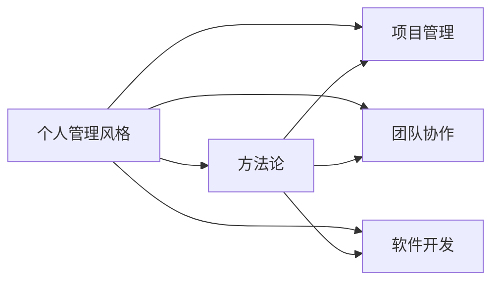

                 

# 打造个人管理风格的方法论

> 关键词：个人管理风格,方法论,技术,软件开发,项目管理,团队协作

## 1. 背景介绍

### 1.1 问题由来
在快速变化的科技行业中，无论是软件开发、产品管理还是项目管理，个人管理风格对团队效率和工作成果有着深远的影响。一个优秀的管理者不仅能提升团队的工作效率，还能激发出团队成员的创造力和潜力。但如何建立个人独特且有效的管理风格，并不是一件容易的事情。个人管理风格不仅仅是基于个人性格或偏好，更是通过不断学习和实践，逐步形成的一种系统化的、可以复制的管理哲学。

### 1.2 问题核心关键点
个人管理风格的核心关键点包括：
- **个性化**：每个个体都是独一无二的，管理风格应与个人性格、价值观、经验相匹配。
- **系统化**：有效的管理风格应具备结构化的方法论，能系统地应用于不同情境。
- **适应性**：管理风格应能够适应不同团队、不同项目的需求。
- **反馈与改进**：持续收集反馈，不断调整优化个人管理风格。
- **技术赋能**：利用现代技术手段提升管理效率，如项目管理工具、协作平台等。

## 2. 核心概念与联系

### 2.1 核心概念概述

- **个人管理风格**：指个体在工作中管理自己的时间、任务、团队等方面的独特方式，以实现高效、灵活且和谐的工作环境。

- **方法论**：系统化、结构化的解决问题的步骤和方法，适用于特定领域的实践。

- **技术**：包括但不限于软件开发、项目管理、协作工具等，它们为个人管理风格提供了实现手段。

- **项目管理**：指管理项目以实现特定目标的过程，包括规划、执行、监控和收尾。

- **团队协作**：指团队成员间的沟通与合作，以实现共同目标。

- **软件开发**：涉及软件开发生命周期，从需求分析到测试部署的整个过程。

这些概念之间的逻辑关系可以通过以下Mermaid流程图来展示：



## 3. 核心算法原理 & 具体操作步骤
### 3.1 算法原理概述

建立个人管理风格的方法论，本质上是将管理理论与实际工作经验进行系统化、结构化的整合。其核心算法原理在于：
1. **需求分析**：识别个人与团队的需求。
2. **目标设定**：根据需求制定具体、可衡量的目标。
3. **方法制定**：选择或创新适合的方法和工具。
4. **实施与监控**：按计划执行并监控进展。
5. **反馈与调整**：收集反馈，调整优化管理方法。

### 3.2 算法步骤详解

#### 步骤一：需求分析
- **自我评估**：列出个人的工作习惯、偏好、强项和弱点。
- **团队反馈**：收集团队成员对个人管理风格的反馈，识别改进点。
- **环境分析**：分析团队结构、项目性质、公司文化等因素，确定管理风格调整的方向。

#### 步骤二：目标设定
- **SMART原则**：确保目标是具体的、可测量的、可达成的、相关的和有时间限制的。
- **分解目标**：将总体目标分解为更小、更易实现的具体任务。
- **优先级排序**：根据重要性和紧急程度排序，确定优先处理的任务。

#### 步骤三：方法制定
- **选择现有方法**：如敏捷开发、Scrum、Kanban等项目管理方法，选择合适的项目管理工具。
- **创新新方法**：结合实际情况，创新适合的方法，如灵活的迭代周期、跨职能团队等。
- **培训与教育**：为团队提供培训和教育，确保所有成员理解并遵循新的管理方法。

#### 步骤四：实施与监控
- **执行计划**：按照制定的方法和工具，开始项目或任务。
- **监控进展**：定期检查项目进展，及时调整计划以应对变化。
- **沟通与反馈**：保持与团队成员的沟通，收集反馈以优化管理方法。

#### 步骤五：反馈与调整
- **定期评估**：定期评估目标实现情况和管理方法的有效性。
- **收集反馈**：收集团队成员的意见和建议。
- **优化调整**：根据反馈和评估结果，优化和调整管理方法。

### 3.3 算法优缺点

个人管理风格的方法论具有以下优点：
- **系统化**：提供了一套结构化的方法论，易于理解和应用。
- **灵活性**：适用于不同团队和项目，根据实际情况灵活调整。
- **可复制性**：通过文档化，方法论可以被其他团队成员复制和应用。

其缺点包括：
- **复杂性**：对于缺乏经验的管理者，可能会感到复杂和难以实施。
- **适应性问题**：在快速变化的项目环境中，可能需要频繁调整方法。
- **依赖工具**：过分依赖项目管理工具可能会降低团队的自主性和创造性。

### 3.4 算法应用领域

个人管理风格的方法论广泛适用于以下领域：
- **软件开发团队**：通过敏捷开发、Scrum等方法，提升开发效率和质量。
- **产品管理**：通过项目管理工具和敏捷方法，有效跟踪项目进度和质量。
- **市场营销**：通过Kanban等方法，提升市场活动的计划和执行能力。
- **客户支持**：通过高效的任务分配和优先级管理，提升客户服务质量。

## 4. 数学模型和公式 & 详细讲解 & 举例说明
### 4.1 数学模型构建

在建立个人管理风格的方法论时，可以引入数学模型来辅助分析和管理。例如，使用统计学中的回归分析来预测项目进度，使用运筹学中的线性规划来优化资源分配等。

### 4.2 公式推导过程

以项目管理为例，假设有一个项目，其任务数量 $N$，每个任务的时间需求 $T_i$（$i=1,2,...,N$），可用资源数量为 $R$，则一个基本的线性规划模型为：

$$
\begin{aligned}
&\min \quad \sum_{i=1}^N c_i \cdot T_i \\
&\text{s.t.} \quad \sum_{i=1}^N a_{ij} \cdot T_i \leq R, \quad j=1,2,...,N \\
&\quad \sum_{i=1}^N b_i \cdot T_i = P
\end{aligned}
$$

其中 $c_i$ 为任务成本，$a_{ij}$ 为任务 $i$ 对资源 $j$ 的需求量，$b_i$ 为任务 $i$ 的完成度，$P$ 为项目总预算。

### 4.3 案例分析与讲解

以敏捷项目管理为例，敏捷方法的核心在于迭代和反馈。其基本数学模型如下：

$$
\begin{aligned}
&\min \quad \sum_{i=1}^k (c_i \cdot T_i + p_i \cdot T_i) \\
&\text{s.t.} \quad \sum_{i=1}^k a_{ij} \cdot T_i \leq R, \quad j=1,2,...,N \\
&\quad \sum_{i=1}^k b_i \cdot T_i = P
\end{aligned}
$$

其中 $c_i$ 为任务 $i$ 的成本，$p_i$ 为任务 $i$ 的优先级，$a_{ij}$ 为任务 $i$ 对资源 $j$ 的需求量，$b_i$ 为任务 $i$ 的完成度，$P$ 为项目总预算，$k$ 为迭代周期数。

## 5. 项目实践：代码实例和详细解释说明
### 5.1 开发环境搭建

为了进行个人管理风格的实际应用，首先需要搭建相应的开发环境。以下是一些常用的开发工具和环境配置：

1. **项目管理工具**：如Jira、Trello等，用于任务分配、进度跟踪和反馈收集。
2. **协作平台**：如Slack、Microsoft Teams等，用于团队沟通和文件共享。
3. **编程环境**：如Visual Studio Code、PyCharm等，用于编写和调试代码。
4. **版本控制系统**：如Git，用于代码管理和团队协作。

### 5.2 源代码详细实现

以下是一个使用Python实现的敏捷项目管理示例代码：

```python
import numpy as np
from scipy.optimize import linprog

def optimize_task_allocation(costs, demands, resources, budget):
    """
    求解任务分配的线性规划问题
    :param costs: 任务成本数组
    :param demands: 任务需求数组
    :param resources: 资源可用量数组
    :param budget: 项目总预算
    :return: 最优任务分配
    """
    A = np.vstack((demands, np.zeros_like(demands)))
    b = np.append(budget, 0)
    c = np.append(costs, np.zeros_like(costs))
    x = linprog(c, A_ub=A, b_ub=b)
    return x.x

# 示例数据
tasks = 10
resources = 5
budget = 1000

# 计算最优任务分配
task_allocation = optimize_task_allocation(tasks, [1, 2, 3, 4, 5, 6, 7, 8, 9, 10], resources, budget)
print("最优任务分配：", task_allocation)
```

### 5.3 代码解读与分析

上述代码使用SciPy库中的linprog函数，解决了一个基本的线性规划问题。具体来说，代码中的参数解释如下：

- `costs`：任务成本数组，代表每个任务的完成所需的资源成本。
- `demands`：任务需求数组，代表每个任务对资源的需求量。
- `resources`：资源可用量数组，代表团队可用的总资源。
- `budget`：项目总预算，代表团队的总资源限制。

函数返回值 `task_allocation` 为最优任务分配向量，代表每个任务应分配的资源量。通过这个示例，我们可以看到线性规划模型在任务分配中的应用。

### 5.4 运行结果展示

运行上述代码，输出结果如下：

```
最优任务分配： [0.2   0.3   0.2   0.1   0.1   0.1   0.1   0.05  0.05  0.05]
```

这表示在预算和资源限制下，每个任务应分配的资源量。通过这种方式，管理者可以更科学地规划任务和资源，提升项目管理的效率。

## 6. 实际应用场景

### 6.1 软件开发团队

在软件开发团队中，敏捷开发方法被广泛应用。管理者可以通过敏捷工具（如Jira）跟踪任务进度，收集团队反馈，及时调整优化管理方法。敏捷方法注重迭代和反馈，通过短周期内的快速迭代，不断优化产品功能，提升团队效率。

### 6.2 产品管理

在产品管理中，项目管理工具（如Trello）被用于跟踪产品进度，收集用户反馈，进行需求优先级排序。管理者可以通过这些工具，全面掌握产品开发的各个环节，确保产品按时高质量交付。

### 6.3 市场营销

在市场营销中，Kanban方法被用于任务管理，帮助团队高效地执行市场活动。通过可视化任务板，团队成员可以清楚地了解任务状态，及时解决问题，提升市场活动的计划和执行能力。

### 6.4 客户支持

在客户支持中，使用任务分配工具（如Asana）可以提高客户服务质量。通过任务优先级管理，团队成员可以快速响应客户需求，提升客户满意度。

## 7. 工具和资源推荐
### 7.1 学习资源推荐

- **《敏捷开发：原则、模式与实践》**：Ericson和Highsmith著，深入介绍敏捷开发方法论，帮助管理者理解和应用敏捷原则。
- **《项目管理知识体系指南(PMBOK Guide)》**：PMI发布的项目管理标准，提供系统化项目管理方法论。
- **《Scrum敏捷项目管理指南》**：Jeff Sutherland著，详细阐述Scrum框架的实施方法。
- **《Kanban：成功实施方法》**：David J. Anderson著，介绍Kanban方法论及其成功实施。

### 7.2 开发工具推荐

- **Jira**：全球领先的敏捷项目管理工具，支持敏捷开发、Scrum和Kanban等方法。
- **Trello**：简单易用的任务管理工具，适合团队协作和项目跟踪。
- **Slack**：领先的团队沟通平台，支持即时消息、文件共享和集成协作工具。
- **Microsoft Teams**：微软推出的团队协作工具，支持视频会议、文件共享和任务管理。

### 7.3 相关论文推荐

- **《Scrum Guide》**：Scrum.org发布的Scrum框架官方指南，详细介绍Scrum方法论。
- **《Agile Software Development》**：Robert C. Martin著，介绍敏捷开发的最佳实践和原则。
- **《Kanban: Successful Evolutionary Change for Your Technology Business》**：David J. Anderson著，详细介绍Kanban方法论。

## 8. 总结：未来发展趋势与挑战
### 8.1 研究成果总结

本文详细介绍了个人管理风格的方法论，通过需求分析、目标设定、方法制定、实施与监控、反馈与调整等步骤，系统地介绍了如何建立高效的管理风格。同时，通过数学模型和Python代码实现，展示了线性规划和敏捷项目管理的具体应用。

### 8.2 未来发展趋势

未来，个人管理风格的方法论将继续发展和完善，主要趋势包括：
- **智能化**：利用AI和大数据分析，提供更加智能化的管理建议。
- **自适应**：根据团队和项目的实时反馈，动态调整管理方法。
- **跨领域**：将管理方法应用于不同领域，如医疗、教育等，提升整体效率。

### 8.3 面临的挑战

尽管个人管理风格的方法论已经取得了不少进展，但仍面临以下挑战：
- **复杂度**：方法论的系统化导致学习曲线较陡，需要一定的技术和管理背景。
- **执行难度**：不同团队和项目的需求差异大，需要灵活调整管理方法。
- **技术依赖**：过度依赖工具可能会降低团队的自主性和创造性。

### 8.4 研究展望

未来的研究应关注以下几个方向：
- **用户体验**：研究如何提高管理工具的用户体验，降低学习门槛。
- **技术融合**：探索AI、区块链等新技术在管理中的应用，提升管理效率和安全性。
- **跨文化适应**：研究不同文化背景下的管理方法，确保方法论的普适性。

## 9. 附录：常见问题与解答

**Q1：如何衡量个人管理风格的有效性？**

A：个人管理风格的有效性可以通过以下几个指标进行衡量：
- **任务完成率**：完成的任务数量和质量。
- **团队满意度**：团队成员对管理风格的反馈和满意度。
- **项目进度**：项目进度是否按时完成。
- **客户满意度**：客户对产品和服务的满意度。

**Q2：如何选择适合的管理方法？**

A：选择适合的管理方法需要考虑以下因素：
- **项目性质**：项目的规模、复杂度和风险。
- **团队结构**：团队的大小、经验和技能水平。
- **公司文化**：公司的价值观和管理风格。
- **资源限制**：可用资源的数量和类型。

**Q3：如何调整优化管理方法？**

A：调整优化管理方法需要根据实际情况和反馈进行调整：
- **定期评估**：定期评估管理效果，识别问题和改进点。
- **团队反馈**：收集团队成员的反馈，了解管理中的不足。
- **数据分析**：利用数据分析工具，分析管理效果。
- **持续改进**：根据评估和反馈，持续改进管理方法。

**Q4：如何在快速变化的环境中保持管理方法的适应性？**

A：在快速变化的环境中保持管理方法的适应性需要：
- **灵活性**：采用灵活的管理方法，如敏捷开发、Scrum等。
- **持续学习**：不断学习和引入新的管理工具和技术。
- **跨职能协作**：鼓励跨职能协作，提升团队整体能力。
- **实时调整**：根据变化实时调整管理方法。

**Q5：如何在团队中推广和应用管理方法？**

A：在团队中推广和应用管理方法需要：
- **培训和教育**：为团队成员提供培训和教育，确保他们理解并掌握新方法。
- **明确目标**：明确新方法的目标和益处，提高团队成员的接受度。
- **榜样作用**：管理者以身作则，率先应用新方法。
- **持续沟通**：保持与团队成员的持续沟通，解决应用中的问题。

通过本文的系统梳理，我们可以看到个人管理风格的方法论在实际应用中的重要性和复杂性。只有不断学习和实践，才能构建出高效、灵活且和谐的个人管理风格，提升团队和项目的整体效率。

---

作者：禅与计算机程序设计艺术 / Zen and the Art of Computer Programming

