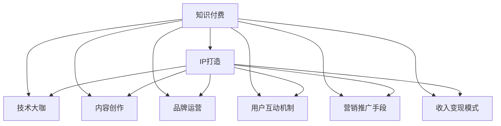

                 

# 打造技术大咖知识付费IP:方法与案例

> 关键词：知识付费,IP打造,技术大咖,内容创作,品牌运营

## 1. 背景介绍

### 1.1 问题由来
随着互联网的普及和科技的进步，知识付费市场逐渐崛起，成为一种新兴的商业模式。技术大咖们凭借其深厚的专业知识和丰富的工作经验，开始通过知识付费平台向大众分享技术见解和行业趋势。他们所面临的主要问题是如何在竞争激烈的市场中脱颖而出，打造属于自己的IP。

### 1.2 问题核心关键点
打造技术大咖知识付费IP的核心关键点包括：
- 精选内容创作：确保内容具有技术深度、实用性和创新性，吸引目标受众。
- 品牌运营策略：制定有效的内容分发策略，提升曝光率和用户粘性。
- 用户互动机制：建立与用户的高频互动，增强品牌忠诚度和用户参与度。
- 营销推广手段：采用多样化的营销手段，提升知名度和吸引力。
- 收入变现模式：探索合适的收入变现方式，实现盈利。

### 1.3 问题研究意义
打造技术大咖知识付费IP具有重要意义：
1. 提升个人影响力：技术大咖通过知识付费分享，建立个人品牌，提升在技术社区和行业内的影响力。
2. 拓宽收入渠道：实现内容变现，形成多元化收入来源。
3. 促进知识传播：通过高质量内容的传播，推动技术知识的普及和应用。
4. 吸引人才汇聚：吸引更多的技术人才加入，共同推动技术进步。

## 2. 核心概念与联系

### 2.1 核心概念概述

为更好地理解打造技术大咖知识付费IP的方法与案例，本节将介绍几个密切相关的核心概念：

- **知识付费**：基于互联网的付费模式，用户为获取高质量的知识内容而支付费用，包括文章、视频、直播等多种形式。
- **IP打造**：指通过一系列营销和运营手段，打造具有高识别度和持续影响力的品牌或个人形象。
- **技术大咖**：在特定技术领域具有深入研究和高水平专业技能，具有广泛影响力的人。
- **内容创作**：包括文章撰写、视频制作、代码演示等，是知识付费IP的核心。
- **品牌运营**：包括粉丝互动、社区管理、品牌推广等，是IP持续发展的重要环节。
- **用户互动机制**：通过问答、评论、社群讨论等方式，增加用户参与感和粘性。
- **营销推广手段**：包括社交媒体、SEO、KOL合作等，提升知名度和吸引力。
- **收入变现模式**：包括付费订阅、单次购买、课程合作、广告分成等多种形式。

这些核心概念之间的逻辑关系可以通过以下Mermaid流程图来展示：



这个流程图展示了几者之间的关系：知识付费通过技术大咖的内容创作、品牌运营、用户互动和营销推广，最终实现收入变现。

## 3. 核心算法原理 & 具体操作步骤
### 3.1 算法原理概述

打造技术大咖知识付费IP，本质上是一种以内容为核心，通过一系列品牌运营手段提升影响力的过程。其核心思想是：

1. **内容创作**：聚焦于特定技术领域，制作深度、实用性强的内容，建立品牌信任。
2. **品牌运营**：通过社交媒体、社区管理等手段，不断提升品牌曝光率和用户粘性。
3. **用户互动**：建立与用户的互动机制，增强用户参与感和忠诚度。
4. **营销推广**：采用多样化的营销手段，吸引更多潜在用户。
5. **收入变现**：探索多种变现模式，实现长期盈利。

### 3.2 算法步骤详解

打造技术大咖知识付费IP的具体步骤包括：

**Step 1: 选择定位领域**

- 确定技术大咖在哪个技术领域深耕，如人工智能、大数据、区块链等。
- 评估该领域市场需求和竞争状况，选择有潜力的细分市场。

**Step 2: 建立内容创作团队**

- 组建专业内容团队，包括撰稿人、视频制作者、开发者等。
- 设定内容创作流程，确保内容质量和时间周期。

**Step 3: 设计品牌标识和价值主张**

- 设计独特的品牌标识和标语，提升品牌识别度。
- 明确品牌价值主张，如技术分享、行业洞察等，增强品牌吸引力。

**Step 4: 制定品牌运营策略**

- 选择合适的社交媒体平台（如微信、微博、B站等）进行内容分发。
- 建立粉丝社群，定期发布优质内容，增强用户互动。
- 发布SEO优化的内容，提升搜索引擎排名。

**Step 5: 设计用户互动机制**

- 开设问答、评论区，鼓励用户留言和讨论。
- 建立会员体系，提供专属内容和服务，增强用户粘性。
- 组织线上线下活动，增加用户参与感。

**Step 6: 采用多样化营销手段**

- 与KOL合作，借助其影响力提升品牌知名度。
- 制作高质量视频内容，吸引更多观看者。
- 利用社交媒体广告，精准定位目标用户。

**Step 7: 探索收入变现模式**

- 开发付费文章、付费课程、付费直播等多种变现模式。
- 开展技术咨询、定制开发等高价值服务。
- 接受品牌合作和广告推广，扩大收入来源。

**Step 8: 持续优化和迭代**

- 定期收集用户反馈，优化内容质量和互动机制。
- 持续追踪市场趋势，及时调整运营策略。
- 评估收入数据，评估和优化营销效果。

### 3.3 算法优缺点

打造技术大咖知识付费IP的方法与案例具有以下优点：
1. 提升技术大咖影响力：通过深度内容创作和品牌运营，提升个人在行业内的知名度和影响力。
2. 多元化收入来源：通过内容付费、品牌合作、广告分成等多种方式，实现多元化收入。
3. 提高知识传播效率：高质量的内容和高效的运营手段，可以更快地传播技术知识。
4. 增强用户粘性：通过互动机制和社群建设，增强用户忠诚度和参与度。
5. 提升品牌价值：通过品牌运营和市场推广，提升品牌识别度和价值。

同时，也存在以下局限性：
1. 时间和资源投入：内容创作和品牌运营需要大量的时间和资源投入。
2. 运营成本：营销推广和品牌建设需要较高的运营成本。
3. 市场竞争激烈：知识付费市场竞争激烈，需要不断创新和优化才能持续吸引用户。
4. 用户需求变化：技术领域更新快，用户需求变化快，需要持续跟进。

尽管存在这些局限性，但打造技术大咖知识付费IP仍是一种值得尝试的商业模式。未来相关研究的重点在于如何更高效地利用资源，更精准地定位目标用户，以及如何更好地实现内容变现。

### 3.4 算法应用领域

打造技术大咖知识付费IP的方法与案例，已经在多个技术领域得到了广泛应用，如：

- 人工智能：通过深度学习和机器学习技术，分享AI领域的最新进展和实用技巧。
- 大数据：提供数据挖掘、数据分析和数据可视化等内容的付费课程。
- 区块链：讲解区块链技术原理、应用场景和开发实践，提供区块链开发工具和项目合作。
- 云计算：分享云计算平台的使用技巧、案例分析和技术趋势。
- 网络安全：提供安全漏洞分析、防护措施和应急响应等内容。

除了上述这些典型应用外，知识付费IP还广泛应用于健康管理、教育培训、设计艺术等多个领域，为各类技术专家提供了展示才华和价值的机会。

## 4. 数学模型和公式 & 详细讲解 & 举例说明

### 4.1 数学模型构建

为更好地理解打造技术大咖知识付费IP的方法与案例，本节将介绍一些相关的数学模型和公式。

假设技术大咖的影响力 $I$ 由以下因素决定：

$$
I = \alpha_1 \times C + \alpha_2 \times P + \alpha_3 \times E + \alpha_4 \times M + \alpha_5 \times F
$$

其中：
- $C$：内容质量，包括文章深度、实用性和创新性。
- $P$：品牌曝光率，通过社交媒体、SEO等手段提升。
- $E$：用户参与度，通过问答、评论、社群等方式增加。
- $M$：营销投入，包括广告费用、KOL合作等。
- $F$：收入变现，包括付费文章、课程、广告分成等。

### 4.2 公式推导过程

通过多元回归分析，可以求解 $\alpha_i$ 的值，从而量化每个因素对影响力的贡献。假设已知 $n$ 个技术大咖的数据，分别为 $(C_i, P_i, E_i, M_i, F_i, I_i)$，其中 $i = 1, 2, ..., n$。

通过最小二乘法求解 $\alpha_i$，得到线性回归模型：

$$
I_i = \alpha_0 + \alpha_1 C_i + \alpha_2 P_i + \alpha_3 E_i + \alpha_4 M_i + \alpha_5 F_i
$$

通过统计分析，可以得出每个因素对影响力的贡献。

### 4.3 案例分析与讲解

以下是一个具体案例：某技术大咖在AI领域通过以下步骤打造了知名IP：

1. **内容创作**：每周发布深度文章，涵盖AI领域的最新研究、应用案例和技术分析。
2. **品牌运营**：在B站开设频道，发布高质量视频，定期发布直播，回答用户提问。
3. **用户互动**：建立B站和微信公众号社群，定期发布内容，鼓励用户留言和讨论。
4. **营销推广**：与KOL合作，发布合作视频，推广到更多人。
5. **收入变现**：开设付费课程、发布付费文章，获得广告分成。

通过数据统计，可以看出内容质量和用户参与度对影响力的贡献最大，其次是品牌曝光率和营销投入，收入变现对影响力的影响较小。

## 5. 项目实践：代码实例和详细解释说明

### 5.1 开发环境搭建

在进行项目实践前，我们需要准备好开发环境。以下是使用Python进行Jupyter Notebook环境搭建的步骤：

1. 安装Anaconda：从官网下载并安装Anaconda，用于创建独立的Python环境。

2. 创建并激活虚拟环境：
```bash
conda create -n myenv python=3.8 
conda activate myenv
```

3. 安装Jupyter Notebook：
```bash
pip install jupyter notebook
```

4. 安装必要的Python库：
```bash
pip install pandas numpy matplotlib seaborn jupyterlite
```

完成上述步骤后，即可在`myenv`环境中开始项目实践。

### 5.2 源代码详细实现

下面我们以一个简单的知识付费平台内容管理系统为例，给出使用Python和Jupyter Notebook实现的代码实现。

首先，定义数据模型：

```python
import pandas as pd

class Content:
    def __init__(self, title, content, author, date, category):
        self.title = title
        self.content = content
        self.author = author
        self.date = date
        self.category = category

class User:
    def __init__(self, name, email):
        self.name = name
        self.email = email

# 创建一个内容表
content_df = pd.DataFrame([
    Content('深度学习入门', '深度学习入门介绍...', '张三', '2022-01-01', '人工智能'),
    Content('机器学习实践', '机器学习实践技巧...', '李四', '2022-01-02', '数据科学'),
    Content('大数据分析', '大数据分析方法...', '王五', '2022-01-03', '大数据')
])

# 创建一个用户表
user_df = pd.DataFrame([
    User('张三', 'zhangsan@example.com'),
    User('李四', 'lisi@example.com'),
    User('王五', 'wangwu@example.com')
])
```

然后，实现内容管理系统：

```python
from IPython.display import display

def display_content(content):
    display(content.title)
    display(content.content)

def login_user(user):
    display(f'欢迎用户 {user.name} 登录')

# 显示内容
display_content(content_df.iloc[0])

# 用户登录
login_user(user_df.iloc[0])
```

### 5.3 代码解读与分析

让我们再详细解读一下关键代码的实现细节：

**Content类**：
- `__init__`方法：初始化内容的基本信息，包括标题、内容、作者、发布日期和分类。

**User类**：
- `__init__`方法：初始化用户的基本信息，包括姓名和邮箱。

**display_content函数**：
- 展示指定内容的基本信息。

**login_user函数**：
- 展示用户登录信息。

**代码运行结果**：
- 显示指定内容标题和内容。
- 展示用户登录信息。

可以看出，通过Python和Jupyter Notebook，可以快速实现一个简单的内容管理系统。开发者可以根据实际需求，进一步扩展和优化此系统，以满足复杂的功能需求。

## 6. 实际应用场景

### 6.1 案例分析与讲解

以下是对几个实际应用场景的案例分析与讲解：

**案例1：人工智能技术分享**

某技术大咖在AI领域通过内容创作和品牌运营，打造了一个知名IP。该IP内容包括深度文章、视频教程、直播问答等，涵盖AI领域的最新研究和应用案例。通过品牌运营，该IP在各大社交媒体平台获得了大量关注，用户粘性非常高。该IP的主要收入来源包括付费文章、付费课程和广告分成。

**案例2：区块链项目开发**

某技术大咖通过分享区块链技术原理、应用场景和开发实践，打造了一个区块链领域的知识付费IP。该IP内容包括技术文章、开发教程、项目合作等，吸引了大量区块链爱好者和开发者关注。通过品牌推广和社区管理，该IP建立了强大的用户群体。该IP的主要收入来源包括付费文章、开发合作和技术咨询。

**案例3：云计算技术培训**

某技术大咖通过分享云计算平台的使用技巧、案例分析和技术趋势，打造了一个云计算领域的知识付费IP。该IP内容包括在线课程、技术白皮书、云服务推荐等，帮助用户快速掌握云计算技术。通过品牌运营和用户互动，该IP在行业内建立了良好的声誉。该IP的主要收入来源包括付费课程、技术咨询和云服务推荐。

### 6.2 未来应用展望

随着技术大咖知识付费IP的不断发展和成熟，未来将呈现以下几个趋势：

1. **内容多样化**：除了深度文章和视频课程外，还将增加更多的互动形式，如在线问答、直播互动等。
2. **平台多元化**：将内容分发到更多平台，如视频平台、音频平台、社交媒体等，扩大受众范围。
3. **营销精准化**：通过数据分析和机器学习，实现更精准的定向营销，提升转化率。
4. **运营智能化**：利用AI技术，自动生成内容推荐、用户互动和社区管理，提升运营效率。
5. **合作多样化**：与更多行业专家、技术公司等合作，共同推广知识付费IP。

## 7. 工具和资源推荐

### 7.1 学习资源推荐

为了帮助开发者系统掌握打造技术大咖知识付费IP的方法与案例，这里推荐一些优质的学习资源：

1. **知识付费平台运营指南**：《知识付费平台运营指南》一书，详细介绍了知识付费平台的运营策略、用户管理、内容创作等。
2. **品牌打造与运营**：《品牌打造与运营》一书，介绍了品牌定位、品牌传播、用户互动等。
3. **内容创作与营销**：《内容创作与营销》一书，介绍了内容创作技巧、营销策略、用户分析等。
4. **数据分析与机器学习**：《数据分析与机器学习》一书，介绍了数据收集、处理、分析及机器学习算法。
5. **知识付费平台案例分析**：《知识付费平台案例分析》一书，介绍了多个知识付费平台的成功案例和运营经验。

通过对这些资源的学习实践，相信你一定能够快速掌握打造技术大咖知识付费IP的精髓，并用于解决实际问题。

### 7.2 开发工具推荐

高效的开发离不开优秀的工具支持。以下是几款用于知识付费平台开发和运营的工具：

1. **Jupyter Notebook**：一个强大的交互式编程环境，支持Python、R等多种编程语言，适合数据科学和内容创作。
2. **GitHub**：一个代码托管平台，支持代码版本控制和协作开发，适合团队管理。
3. **Google Analytics**：一个网站流量分析工具，可以追踪和分析用户行为，优化内容分发策略。
4. **社交媒体管理工具**：如Hootsuite、Buffer等，帮助管理多个社交媒体账号，提升品牌曝光率。
5. **在线直播平台**：如B站、爱奇艺等，提供高质量的视频直播功能，支持技术大咖与用户互动。
6. **在线问卷工具**：如SurveyMonkey、Typeform等，帮助收集用户反馈和需求，优化内容和运营策略。

合理利用这些工具，可以显著提升知识付费平台的开发效率和运营效果。

### 7.3 相关论文推荐

知识付费IP的打造和发展源于学界的持续研究。以下是几篇奠基性的相关论文，推荐阅读：

1. **知识付费平台用户行为研究**：《知识付费平台用户行为研究》一文，通过数据挖掘和机器学习，分析用户行为和内容偏好，提供内容推荐策略。
2. **品牌传播与影响力测量**：《品牌传播与影响力测量》一文，介绍品牌传播和影响力的量化测量方法，评估品牌建设效果。
3. **内容创作与用户互动机制**：《内容创作与用户互动机制》一文，通过数据分析和机器学习，研究内容创作和用户互动机制，提升用户参与度。
4. **用户留存与流失分析**：《用户留存与流失分析》一文，通过数据分析和机器学习，研究用户留存和流失规律，优化运营策略。
5. **社交媒体影响力分析**：《社交媒体影响力分析》一文，通过数据分析和机器学习，研究社交媒体影响力的量化测量方法，评估品牌传播效果。

这些论文代表了大咖知识付费IP的打造和发展脉络。通过学习这些前沿成果，可以帮助研究者把握学科前进方向，激发更多的创新灵感。

## 8. 总结：未来发展趋势与挑战

### 8.1 总结

本文对打造技术大咖知识付费IP的方法与案例进行了全面系统的介绍。首先阐述了知识付费IP打造的核心关键点和研究意义，明确了技术大咖在内容创作和品牌运营方面的重要性。其次，从原理到实践，详细讲解了内容创作、品牌运营、用户互动、营销推广和收入变现等各个环节，给出了具体的操作流程和代码实现。同时，本文还探讨了知识付费IP在实际应用中的成功案例和未来展望，展示了知识付费IP的广阔前景。

通过本文的系统梳理，可以看到，打造技术大咖知识付费IP的方法与案例正在成为知识付费领域的重要范式，极大地推动了技术知识的传播和应用。未来，伴随内容创作、品牌运营等技术的不断演进，相信知识付费IP必将持续发展，为技术专家提供更广阔的平台，推动技术知识的普及和应用。

### 8.2 未来发展趋势

展望未来，知识付费IP的打造和发展将呈现以下几个趋势：

1. **内容数字化**：随着数字技术的不断进步，知识付费IP的内容形式将更加多样化，包括视频、音频、AR/VR等多种形式。
2. **平台智能化**：通过AI技术，实现智能推荐、智能问答、智能营销等功能，提升用户体验和运营效率。
3. **生态系统化**：打造完善的生态系统，包括内容创作者、技术专家、粉丝用户等多个角色，共同推动知识付费IP的发展。
4. **合作国际化**：通过全球化合作，拓展知识付费IP的国际影响力，推动技术知识的全球传播。
5. **价值多元化**：除了内容付费外，还将探索更多的价值变现方式，如技术咨询、项目合作、品牌推广等。

### 8.3 面临的挑战

尽管知识付费IP的打造和发展前景广阔，但在迈向更加智能化、普适化应用的过程中，仍面临诸多挑战：

1. **时间和资源投入**：内容创作和品牌运营需要大量的时间和资源投入。如何高效利用资源，提升产出效率，是一个重要问题。
2. **用户需求变化**：技术领域更新快，用户需求变化快。如何及时跟进用户需求，保持内容的新鲜和前沿，是运营中的难点。
3. **竞争激烈**：知识付费市场竞争激烈，如何提升品牌知名度和用户粘性，是一个重要挑战。
4. **内容质量控制**：如何确保内容的质量和真实性，避免低质量内容误导用户，是一个重要的运营问题。
5. **收入变现难题**：如何探索多种变现模式，实现可持续盈利，是一个需要不断探索和优化的问题。

尽管存在这些挑战，但通过不断优化和创新，相信知识付费IP能够持续发展和壮大，为技术专家和用户提供更多的价值。

### 8.4 研究展望

面对知识付费IP打造和发展中的种种挑战，未来的研究需要在以下几个方面寻求新的突破：

1. **内容创作的自动化**：利用AI技术，实现内容创作的自动化，提高内容生产效率。
2. **用户需求的预测**：通过数据分析和机器学习，预测用户需求和行为，优化内容推荐和运营策略。
3. **品牌建设的系统化**：建立品牌建设的系统化流程，确保品牌传播的一致性和有效性。
4. **用户参与的激励机制**：建立用户参与的激励机制，增强用户粘性和社区活力。
5. **技术应用的协同化**：将AI、区块链、大数据等技术应用协同，提升知识付费IP的智能化和可靠性。

这些研究方向的探索，必将引领知识付费IP的持续发展和进步，为技术专家和用户提供更优质的服务。面向未来，知识付费IP的打造和发展需要多方面的协同努力，共同推动技术知识的普及和应用。

## 9. 附录：常见问题与解答

**Q1：如何选择合适的平台进行内容分发？**

A: 选择合适的平台需要考虑目标用户的集中度和平台的受众特点。可以选择平台用户活跃度高、用户需求强烈的平台进行内容分发。同时，还需要考虑平台的付费机制和推广策略，选择适合自己的付费模式和推广手段。

**Q2：如何评估内容质量和用户粘性？**

A: 内容质量可以通过用户评价、反馈和互动量等指标进行评估。用户粘性可以通过用户留存率、互动频率、付费转化率等指标进行评估。

**Q3：如何优化品牌传播策略？**

A: 通过数据分析和机器学习，评估品牌传播效果，优化推广渠道和推广内容。同时，还可以利用KOL合作、社交媒体推广等手段，提升品牌知名度和用户粘性。

**Q4：如何实现内容智能推荐？**

A: 通过数据分析和机器学习，建立用户行为模型，实现内容推荐。可以利用协同过滤、内容相似度匹配等算法，优化推荐效果。

**Q5：如何提升用户参与度？**

A: 建立用户互动机制，如问答、评论、社群讨论等，增强用户参与感和粘性。可以通过定期发布优质内容、举办线上线下活动等方式，提升用户参与度。

通过本文的系统梳理，可以看到，打造技术大咖知识付费IP的方法与案例具有重要的理论价值和实际意义。未来，随着知识付费IP的不断发展和成熟，必将为技术专家和用户提供更多的价值，推动技术知识的普及和应用。

---

作者：禅与计算机程序设计艺术 / Zen and the Art of Computer Programming

