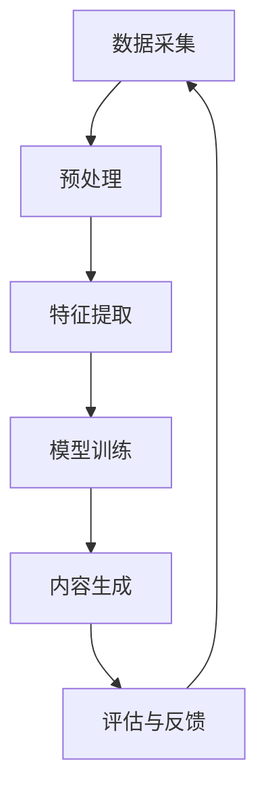

                 

**AIGC重新定义游戏体验**

**作者：禅与计算机程序设计艺术 / Zen and the Art of Computer Programming**

## 1. 背景介绍

人工智能游戏内容（AIGC）是指利用人工智能技术自动生成游戏内容的过程。随着深度学习和强化学习等人工智能技术的发展，AIGC在游戏行业引发了革命性的变化。本文将探讨AIGC如何重新定义游戏体验，从核心概念到实际应用，再到未来展望。

## 2. 核心概念与联系

### 2.1 AIGC的定义与分类

AIGC可以分为两大类：一类是基于规则的AIGC，另一类是基于学习的AIGC。

- **基于规则的AIGC**：使用预定义的规则和算法生成游戏内容，如关卡设计、NPC行为等。
- **基于学习的AIGC**：利用机器学习算法从数据中学习规律，自动生成游戏内容，如游戏对话、音乐等。

### 2.2 AIGC架构

AIGC系统的核心架构如下：



## 3. 核心算法原理 & 具体操作步骤

### 3.1 算法原理概述

本节将介绍两种常用的AIGC算法：基于生成对抗网络（GAN）的内容生成和基于强化学习的自动关卡设计。

### 3.2 算法步骤详解

#### 3.2.1 基于GAN的内容生成

1. **数据预处理**：收集并预处理游戏内容数据，如关卡布局、NPC对话等。
2. **特征提取**：使用卷积神经网络（CNN）等模型提取数据的特征。
3. **模型训练**：使用GAN训练生成器和判别器网络，生成新的游戏内容。
4. **内容生成**：使用训练好的生成器网络生成新的游戏内容。

#### 3.2.2 基于强化学习的自动关卡设计

1. **环境建模**：建立关卡设计的环境模型，如地图、道具等。
2. **定义奖励函数**：根据设计目标定义奖励函数，如关卡难度、玩法多样性等。
3. **训练智能体**：使用强化学习算法（如DQN、PPO）训练智能体，学习关卡设计策略。
4. **关卡生成**：使用训练好的智能体生成新的关卡。

### 3.3 算法优缺点

- **GAN**：优点是可以生成多样化的高质量内容，缺点是训练困难，易陷入模式崩溃。
- **强化学习**：优点是可以学习复杂的策略，缺点是训练时间长，结果不确定性高。

### 3.4 算法应用领域

- **GAN**：适用于生成音乐、对话、关卡布局等需要创造力的任务。
- **强化学习**：适用于需要学习复杂策略的任务，如关卡设计、NPC行为等。

## 4. 数学模型和公式 & 详细讲解 & 举例说明

### 4.1 数学模型构建

#### 4.1.1 GAN数学模型

GAN的数学模型可以表示为：

- **生成器**：$G(z;\theta_g)$, 其中$z$是输入噪声，$θ_g$是生成器参数。
- **判别器**：$D(x;\theta_d)$, 其中$x$是输入数据，$θ_d$是判别器参数。

#### 4.1.2 强化学习数学模型

强化学习的数学模型可以表示为：

- **状态-动作值函数**：$Q(s,a;\theta)$, 其中$s$是状态，$a$是动作，$θ$是参数。
- **策略**：$\pi(a|s;\theta)$, 其中$a$是动作，$s$是状态，$θ$是参数。

### 4.2 公式推导过程

#### 4.2.1 GAN公式推导

GAN的目标是最大化判别器的正确率，同时最小化生成器的错误率。其对抗过程可以表示为：

$$min_G max_D V(D,G) = \mathbb{E}_{x\sim p_{data}(x)}[\log D(x)] + \mathbb{E}_{z\sim p_z(z)}[\log(1-D(G(z)))]$$

#### 4.2.2 强化学习公式推导

强化学习的目标是学习最优策略，其动态规划方程可以表示为：

$$Q^*(s,a) = \mathbb{E}_{s'}[r + \gamma \max_a Q^*(s',a)]$$

### 4.3 案例分析与讲解

#### 4.3.1 GAN生成音乐

使用GAN生成音乐时，可以将音乐表示为谱表，使用CNN提取音乐特征，然后使用GAN生成新的音乐。

#### 4.3.2 强化学习设计关卡

使用强化学习设计关卡时，可以将关卡表示为地图，使用智能体学习关卡设计策略，如放置敌人、道具等。

## 5. 项目实践：代码实例和详细解释说明

### 5.1 开发环境搭建

- **硬件**：GPU加速的计算机。
- **软件**：Python、TensorFlow、PyTorch、Stable Baselines3等。

### 5.2 源代码详细实现

本节将提供GAN生成音乐和强化学习设计关卡的简化代码示例。

#### 5.2.1 GAN生成音乐

```python
import numpy as np
import tensorflow as tf
from tensorflow.keras import layers

# 定义生成器
def make_generator_model():
    model = tf.keras.Sequential()
    model.add(layers.Dense(256, use_bias=False, input_shape=(100,)))
    model.add(layers.BatchNormalization())
    model.add(layers.LeakyReLU())

    # 省略其他层...

    return model

# 定义判别器
def make_discriminator_model():
    model = tf.keras.Sequential()
    model.add(layers.Dense(256, input_dim=784, use_bias=False))
    model.add(layers.LeakyReLU())

    # 省略其他层...

    return model
```

#### 5.2.2 强化学习设计关卡

```python
import gym
from stable_baselines3 import PPO
from stable_baselines3.common.policies import MlpPolicy
from stable_baselines3.common.vec_env import DummyVecEnv

# 定义环境
env = gym.make('CartPole-v0')
env = DummyVecEnv([lambda: env])

# 定义模型
model = PPO(MlpPolicy, env, n_steps=2048)

# 训练模型
model.learn(total_timesteps=25000)

# 生成关卡
done = False
obs = env.reset()
while not done:
    action, _states = model.predict(obs)
    obs, rewards, done, info = env.step(action)
```

### 5.3 代码解读与分析

- **GAN生成音乐**：生成器和判别器使用CNN网络，生成器输入噪声，判别器输入音乐谱表。
- **强化学习设计关卡**：使用PPO算法训练智能体，智能体学习关卡设计策略，如放置敌人、道具等。

### 5.4 运行结果展示

- **GAN生成音乐**：生成的音乐与真实音乐具有相似的特征，但可能不完美。
- **强化学习设计关卡**：生成的关卡可能不如人工设计的关卡好玩，但可以学习到策略，如放置敌人、道具等。

## 6. 实际应用场景

### 6.1 AIGC在游戏行业的应用

- **关卡自动生成**：使用强化学习自动生成关卡，节省人力成本。
- **NPC自动设计**：使用GAN生成NPC对话，提高游戏互动性。
- **音乐自动创作**：使用GAN生成音乐，丰富游戏音效。

### 6.2 AIGC在其他行业的应用

- **虚拟人**：使用GAN生成虚拟人形象，应用于直播、广告等领域。
- **数字艺术**：使用GAN生成数字艺术，应用于设计、美术等领域。

### 6.3 未来应用展望

- **元宇宙**：AIGC可以帮助构建元宇宙的内容，如虚拟世界、虚拟人等。
- **游戏元智能**：AIGC可以帮助游戏实现元智能，如自适应难度、个性化内容等。

## 7. 工具和资源推荐

### 7.1 学习资源推荐

- **书籍**："Generative Deep Learning"、 "Reinforcement Learning: An Introduction"。
- **课程**：Stanford CS224n、UC Berkeley Deep Reinforcement Learning。

### 7.2 开发工具推荐

- **框架**：TensorFlow、PyTorch、Stable Baselines3。
- **库**：Keras、Pytorch Lightning、Gym。

### 7.3 相关论文推荐

- **GAN**："Generative Adversarial Networks"、 "Deep Convolutional Generative Adversarial Networks"。
- **强化学习**："Deep Q-Network"、 "Proximal Policy Optimization Algorithms"。

## 8. 总结：未来发展趋势与挑战

### 8.1 研究成果总结

本文介绍了AIGC的核心概念、算法原理、数学模型、项目实践等，展示了AIGC在游戏行业的应用。

### 8.2 未来发展趋势

- **多模式学习**：结合多种学习模式，如监督学习、无监督学习、强化学习等。
- **元学习**：学习如何学习，提高AIGC的泛化能力。
- **自适应学习**：根据环境变化自适应调整学习策略。

### 8.3 面临的挑战

- **训练困难**：AIGC的训练需要大量的计算资源和数据。
- **结果不确定性**：AIGC的结果可能不确定，需要人工审核。
- **道德和伦理问题**：AIGC生成的内容可能涉及道德和伦理问题，需要谨慎应用。

### 8.4 研究展望

- **跨模态学习**：结合视觉、听觉、语言等多模态信息，提高AIGC的表达能力。
- **解释性AI**：研究AIGC的决策过程，提高可解释性。
- **可持续AI**：研究AIGC的能源消耗和碳排放，提高可持续性。

## 9. 附录：常见问题与解答

**Q：AIGC需要大量的数据吗？**

A：是的，AIGC需要大量的数据来训练模型。数据的质量和多样性会影响AIGC的性能。

**Q：AIGC可以生成高质量的内容吗？**

A：AIGC可以生成高质量的内容，但结果可能不如人工创作。AIGC的目标是提高创作的效率和多样性。

**Q：AIGC会取代人工创作吗？**

A：AIGC不会取代人工创作，而是辅助人工创作。AIGC可以帮助人工创作提高效率和多样性，但人工创作仍然是AIGC的指导者。

**作者：禅与计算机程序设计艺术 / Zen and the Art of Computer Programming**

