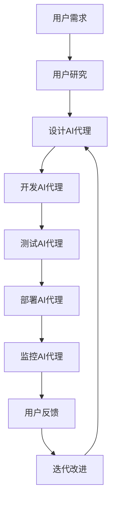

                 

人工智能代理、用户体验设计、AI工作流、人机交互、用户中心设计

## 1. 背景介绍

随着人工智能（AI）技术的不断发展，AI代理已经成为各种应用中的关键组成部分。AI代理是一种软件系统，它能够感知环境、做出决策并采取行动，以实现特定的目标。然而，设计出高效、用户友好的AI代理并非易事。本文将介绍AI代理工作流（AI Agent WorkFlow），这是一种将人工智能代理与用户体验设计相结合的方法，旨在创建更好的AI系统。

## 2. 核心概念与联系

### 2.1 AI代理与用户体验设计

AI代理工作流的核心是将AI代理与用户体验设计相结合。用户体验设计（UX Design）是一种设计方法，旨在创建用户友好的产品和服务。将UX Design与AI代理结合，可以创建更用户友好的AI系统，提高用户满意度和系统的有效性。

### 2.2 AI代理工作流架构

AI代理工作流的架构如下图所示：



### 2.3 AI代理工作流的目标

AI代理工作流的目标是创建高效、用户友好的AI代理。具体目标包括：

- 理解用户需求和期望
- 设计出高效的AI代理
- 创建用户友好的AI代理接口
- 确保AI代理的可靠性和安全性
- 监控AI代理的性能并进行迭代改进

## 3. 核心算法原理 & 具体操作步骤

### 3.1 算法原理概述

AI代理工作流的核心是一种迭代的设计和开发过程。它基于用户研究、设计、开发、测试、部署和监控等步骤，不断改进AI代理。

### 3.2 算法步骤详解

#### 3.2.1 用户研究

用户研究是AI代理工作流的第一步。它旨在理解用户需求、期望和行为。常用的用户研究方法包括访谈、调查问卷和观察等。

#### 3.2.2 设计AI代理

在设计AI代理时，需要考虑AI代理的功能、性能和用户体验。常用的设计方法包括用户故事、用户流程图和原型设计等。

#### 3.2.3 开发AI代理

在开发AI代理时，需要选择合适的技术栈，并编写高质量的代码。常用的开发方法包括敏捷开发和水fall开发等。

#### 3.2.4 测试AI代理

测试是确保AI代理可靠性和安全性的关键步骤。常用的测试方法包括单元测试、集成测试和系统测试等。

#### 3.2.5 部署AI代理

部署AI代理时，需要考虑系统的可扩展性和可用性。常用的部署方法包括云部署和本地部署等。

#### 3.2.6 监控AI代理

监控AI代理是确保系统性能和用户满意度的关键步骤。常用的监控方法包括日志分析和性能监控等。

#### 3.2.7 迭代改进

迭代改进是AI代理工作流的最后一步。它基于用户反馈和系统性能，不断改进AI代理。

### 3.3 算法优缺点

AI代理工作流的优点包括：

- 可以创建高效、用户友好的AI代理
- 可以提高用户满意度和系统的有效性
- 可以确保AI代理的可靠性和安全性

其缺点包括：

- 需要大量的用户研究和设计工作
- 需要持续的监控和改进
- 需要合适的技术栈和开发团队

### 3.4 算法应用领域

AI代理工作流可以应用于各种领域，包括但不限于：

- 客户服务：AI代理可以提供24/7的客户服务，提高客户满意度
- 电子商务：AI代理可以帮助用户搜索商品、比价和下单
- 智能家居：AI代理可以控制家居设备，提高居住体验
- 自动驾驶：AI代理可以控制汽车的行驶和决策

## 4. 数学模型和公式 & 详细讲解 & 举例说明

### 4.1 数学模型构建

在设计AI代理时，需要构建数学模型来描述系统的行为。常用的数学模型包括马尔可夫决策过程（MDP）和部分可观察马尔可夫决策过程（POMDP）等。

### 4.2 公式推导过程

例如，在MDP中，系统的状态转移概率可以表示为：

$$P(s_{t+1} = s' | s_t = s, a_t = a) = P(s' | s, a)$$

其中，$s_t$和$s_{t+1}$分别是当前状态和下一状态，$a_t$是当前动作，$P(s' | s, a)$是状态转移概率。

### 4.3 案例分析与讲解

例如，在自动驾驶系统中，可以使用MDP来描述汽车的行驶行为。状态可以表示为汽车的位置、速度和方向等，动作可以表示为加速、减速和转向等。状态转移概率可以表示为汽车根据动作行驶的概率。

## 5. 项目实践：代码实例和详细解释说明

### 5.1 开发环境搭建

在开发AI代理时，需要搭建合适的开发环境。常用的开发环境包括Python、TensorFlow和PyTorch等。

### 5.2 源代码详细实现

以下是一个简单的AI代理示例，使用Python和TensorFlow实现了一个简单的MDP：

```python
import numpy as np
import tensorflow as tf

# 状态空间
num_states = 10

# 动作空间
num_actions = 3

# 状态转移概率
transition_probabilities = np.array([
    [0.2, 0.5, 0.3],
    [0.4, 0.3, 0.3],
    [0.3, 0.4, 0.3],
    #...
])

# 奖励函数
reward_function = lambda s: -s

# Q函数
Q = tf.Variable(tf.random.normal([num_states, num_actions]))

# 学习率
learning_rate = 0.1

# 更新Q函数
def update_Q(s, a, r, s_next):
    y = r + np.max(Q[s_next, :])
    loss = tf.square(y - Q[s, a])
    optimizer = tf.train.GradientDescentOptimizer(learning_rate)
    gradients = optimizer.compute_gradients(loss)
    optimizer.apply_gradients(gradients)

# 训练AI代理
for episode in range(1000):
    s = np.random.randint(0, num_states)
    while s!= num_states - 1:
        a = np.argmax(Q[s, :])
        s_next = np.random.choice(num_states, p=transition_probabilities[s, a])
        r = reward_function(s)
        update_Q(s, a, r, s_next)
        s = s_next
```

### 5.3 代码解读与分析

在上述代码中，我们首先定义了状态空间、动作空间、状态转移概率和奖励函数。然后，我们定义了Q函数并使用梯度下降法更新Q函数。最后，我们使用随机策略训练AI代理。

### 5.4 运行结果展示

在训练结束后，我们可以查看Q函数的值，它应该能够表示出在每个状态下采取哪个动作能够获得最大的奖励。

## 6. 实际应用场景

AI代理工作流可以应用于各种实际应用场景，以下是一些例子：

### 6.1 客户服务

AI代理可以提供24/7的客户服务，帮助用户解决问题并提高客户满意度。例如，在电商平台上，AI代理可以帮助用户搜索商品、比价和下单。

### 6.2 智能家居

AI代理可以控制家居设备，提高居住体验。例如，在智能家居系统中，AI代理可以根据用户的习惯自动调节灯光、空调和音乐等。

### 6.3 自动驾驶

AI代理可以控制汽车的行驶和决策，实现自动驾驶。例如，在自动驾驶系统中，AI代理可以根据路况和车辆状态做出决策，实现安全和高效的行驶。

### 6.4 未来应用展望

未来，AI代理工作流将会应用于更多的领域，例如医疗、金融和交通等。随着AI技术的不断发展，AI代理将会变得更加智能和用户友好。

## 7. 工具和资源推荐

### 7.1 学习资源推荐

以下是一些学习AI代理工作流的推荐资源：

- 书籍：《人工智能：一种现代方法》作者：斯图尔特·拉塞尔和彼得·诺维格
- 课程：Stanford University的“Artificial Intelligence: Principles and Techniques”课程
- 在线资源：[AI代理工作流教程](https://www.udacity.com/course/ai-agent-workflow--nd889)

### 7.2 开发工具推荐

以下是一些开发AI代理的推荐工具：

- 编程语言：Python
- 深度学习框架：TensorFlow和PyTorch
- AI代理框架：RLlib和Stable Baselines3

### 7.3 相关论文推荐

以下是一些相关论文推荐：

- [Deep Reinforcement Learning for Continuous Control](https://arxiv.org/abs/1509.02971)
- [Human-level control through deep reinforcement learning](https://arxiv.org/abs/1507.01474)
- [Mastering Chess and Shogi by Self-Play with a General Reinforcement Learning Algorithm](https://arxiv.org/abs/1712.01815)

## 8. 总结：未来发展趋势与挑战

### 8.1 研究成果总结

本文介绍了AI代理工作流，这是一种将AI代理与用户体验设计相结合的方法。我们讨论了AI代理工作流的核心概念、算法原理、数学模型和实际应用场景。我们还提供了一个简单的AI代理示例，使用Python和TensorFlow实现了一个简单的MDP。

### 8.2 未来发展趋势

未来，AI代理工作流将会应用于更多的领域，例如医疗、金融和交通等。随着AI技术的不断发展，AI代理将会变得更加智能和用户友好。此外，AI代理工作流也将会与其他人工智能技术相结合，例如自然语言处理和计算机视觉等。

### 8.3 面临的挑战

然而，AI代理工作流也面临着一些挑战。首先，设计出高效、用户友好的AI代理需要大量的用户研究和设计工作。其次，AI代理需要持续的监控和改进，以确保系统的性能和用户满意度。最后，AI代理需要合适的技术栈和开发团队。

### 8.4 研究展望

未来的研究将会关注以下几个方向：

- 如何设计出更用户友好的AI代理接口
- 如何确保AI代理的可靠性和安全性
- 如何监控AI代理的性能并进行迭代改进
- 如何将AI代理工作流与其他人工智能技术相结合

## 9. 附录：常见问题与解答

**Q1：什么是AI代理工作流？**

AI代理工作流是一种将AI代理与用户体验设计相结合的方法，旨在创建更好的AI系统。

**Q2：AI代理工作流的核心概念是什么？**

AI代理工作流的核心概念包括AI代理与用户体验设计、AI代理工作流架构和AI代理工作流的目标等。

**Q3：AI代理工作流的算法原理是什么？**

AI代理工作流的算法原理是一种迭代的设计和开发过程，基于用户研究、设计、开发、测试、部署和监控等步骤，不断改进AI代理。

**Q4：AI代理工作流的数学模型是什么？**

AI代理工作流的数学模型包括马尔可夫决策过程（MDP）和部分可观察马尔可夫决策过程（POMDP）等。

**Q5：AI代理工作流的实际应用场景是什么？**

AI代理工作流的实际应用场景包括客户服务、智能家居、自动驾驶等。

**Q6：AI代理工作流的未来发展趋势是什么？**

AI代理工作流的未来发展趋势包括应用于更多领域、与其他人工智能技术相结合等。

**Q7：AI代理工作流面临的挑战是什么？**

AI代理工作流面临的挑战包括设计出高效、用户友好的AI代理需要大量的用户研究和设计工作、需要持续的监控和改进、需要合适的技术栈和开发团队等。

**Q8：未来的研究将会关注哪些方向？**

未来的研究将会关注如何设计出更用户友好的AI代理接口、如何确保AI代理的可靠性和安全性、如何监控AI代理的性能并进行迭代改进、如何将AI代理工作流与其他人工智能技术相结合等方向。

## 作者：禅与计算机程序设计艺术 / Zen and the Art of Computer Programming

