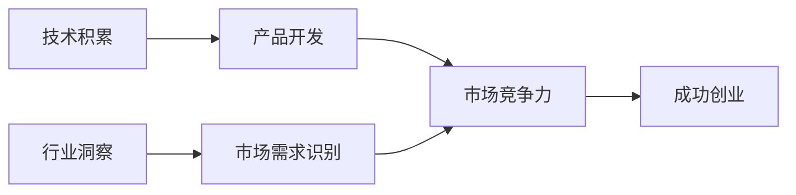
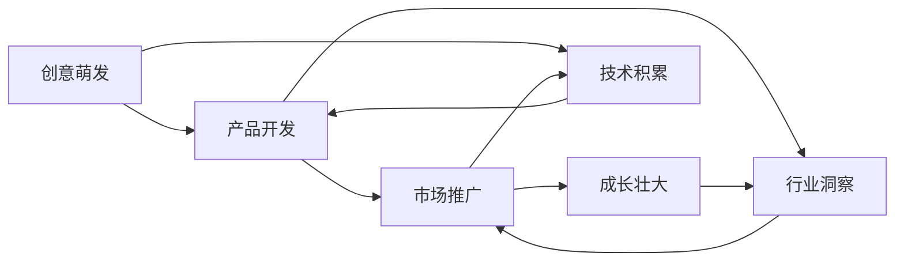

                 

**AI创业团队成长之路：技术积累与行业洞察并重**

**作者：禅与计算机程序设计艺术 / Zen and the Art of Computer Programming**

## 1. 背景介绍

随着人工智能（AI）技术的飞速发展，AI创业已然成为当今创业浪潮中的一股主要力量。然而，AI创业并非易事，成功的AI创业团队需要在技术积累和行业洞察两方面并重。本文将深入探讨AI创业团队的成长之路，为AI创业者提供技术和行业洞察的指南。

## 2. 核心概念与联系

### 2.1 技术积累与行业洞察的关系

技术积累和行业洞察是AI创业成功的两个关键因素，它们密切相关，缺一不可。技术积累为AI创业提供了核心竞争力，而行业洞察则帮助AI创业团队找到市场需求，避免盲目创业。二者的关系如下图所示：



### 2.2 AI创业的生命周期

AI创业的生命周期可以分为四个阶段：创意萌发、产品开发、市场推广和成长壮大。技术积累和行业洞察在每个阶段都至关重要，如下图所示：



## 3. 核心算法原理 & 具体操作步骤

### 3.1 算法原理概述

AI创业团队需要掌握多种AI算法，以开发出具有竞争力的产品。本节将简要介绍几种常用的AI算法原理。

#### 3.1.1 机器学习算法

机器学习算法旨在从数据中学习，并用于预测或决策。常用的机器学习算法包括线性回归、逻辑回归、支持向量机（SVM）、决策树和随机森林等。

#### 3.1.2 深度学习算法

深度学习算法是机器学习的一个子集，它使用神经网络模型来学习数据。常用的深度学习算法包括卷积神经网络（CNN）、循环神经网络（RNN）和长短期记忆网络（LSTM）等。

#### 3.1.3 无监督学习算法

无监督学习算法旨在从未标记的数据中学习，常用的无监督学习算法包括聚类算法（如K-means）和自动编码器等。

### 3.2 算法步骤详解

#### 3.2.1 机器学习算法步骤

1. 数据收集：收集与问题相关的数据。
2. 数据预处理：清洗、标记和规范化数据。
3. 特征选择：选择最相关的特征。
4. 模型选择：选择适合问题的机器学习算法。
5. 模型训练：使用训练数据训练模型。
6. 模型评估：评估模型的性能。
7. 模型优化：优化模型的性能。
8. 模型部署：将模型部署到生产环境中。

#### 3.2.2 深度学习算法步骤

1. 数据收集：收集与问题相关的数据。
2. 数据预处理：清洗、标记和规范化数据。
3. 模型架构设计：设计神经网络模型的架构。
4. 模型训练：使用训练数据训练模型。
5. 模型评估：评估模型的性能。
6. 模型优化：优化模型的性能。
7. 模型部署：将模型部署到生产环境中。

#### 3.2.3 无监督学习算法步骤

1. 数据收集：收集与问题相关的数据。
2. 数据预处理：清洗和规范化数据。
3. 模型选择：选择适合问题的无监督学习算法。
4. 模型训练：使用训练数据训练模型。
5. 模型评估：评估模型的性能。
6. 模型优化：优化模型的性能。
7. 模型部署：将模型部署到生产环境中。

### 3.3 算法优缺点

每种算法都有其优缺点，AI创业团队需要根据问题的特点选择合适的算法。表1总结了几种常用AI算法的优缺点。

**表1：常用AI算法优缺点**

| 算法 | 优点 | 缺点 |
| --- | --- | --- |
| 线性回归 | 简单易懂，计算快速 | 只适用于线性可分问题，对特征选择敏感 |
| 逻辑回归 | 简单易懂，计算快速 | 只适用于二元分类问题，对特征选择敏感 |
| SVM | 可以处理高维数据，泛化能力强 | 训练时间长，对核函数选择敏感 |
| 决策树 | 可解释性强，可以处理混合数据类型 | 易过拟合，对噪声数据敏感 |
| 随机森林 | 可以处理高维数据，泛化能力强，可解释性强 | 训练时间长，对参数选择敏感 |
| CNN | 可以处理图像数据，泛化能力强 | 训练时间长，对参数选择敏感 |
| RNN/LSTM | 可以处理序列数据，泛化能力强 | 训练时间长，易出现梯度消失/爆炸问题 |
| K-means | 简单易懂，计算快速 | 对初始聚类中心敏感，易出现局部最优解 |
| 自动编码器 | 可以用于特征学习和数据重构 | 训练时间长，对参数选择敏感 |

### 3.4 算法应用领域

AI算法在各个领域都有广泛的应用，AI创业团队需要根据市场需求选择合适的算法。表2总结了几种常用AI算法的应用领域。

**表2：常用AI算法应用领域**

| 算法 | 应用领域 |
| --- | --- |
| 线性回归 | 回归问题，如预测房价 |
| 逻辑回归 | 二元分类问题，如垃圾邮件过滤 |
| SVM | 多分类问题，如图像分类 |
| 决策树 | 可解释性强的分类问题，如信用评分 |
| 随机森林 | 多分类问题，如病情诊断 |
| CNN | 图像识别，如人脸识别 |
| RNN/LSTM | 自然语言处理，如机器翻译 |
| K-means | 数据聚类，如客户细分 |
| 自动编码器 | 特征学习，如图像重构 |

## 4. 数学模型和公式 & 详细讲解 & 举例说明

### 4.1 数学模型构建

数学模型是AI算法的基础，AI创业团队需要掌握构建数学模型的方法。本节将介绍几种常用的数学模型。

#### 4.1.1 线性回归模型

线性回归模型用于预测连续变量，其数学模型为：

$$y = \beta_0 + \beta_1x_1 + \beta_2x_2 + \ldots + \beta_nx_n + \epsilon$$

其中，$y$是目标变量，$x_1, x_2, \ldots, x_n$是特征变量，$\beta_0, \beta_1, \ldots, \beta_n$是模型参数，$\epsilon$是误差项。

#### 4.1.2 逻辑回归模型

逻辑回归模型用于预测二元变量，其数学模型为：

$$P(y=1) = \frac{1}{1 + e^{-(\beta_0 + \beta_1x_1 + \beta_2x_2 + \ldots + \beta_nx_n)}}$$

其中，$P(y=1)$是目标变量为1的概率，$x_1, x_2, \ldots, x_n$是特征变量，$\beta_0, \beta_1, \ldots, \beta_n$是模型参数。

#### 4.1.3 支持向量机模型

支持向量机模型用于多分类问题，其数学模型为：

$$f(x) = \text{sgn}(\sum_{i=1}^{n}\alpha_iy_iK(x,x_i) + b)$$

其中，$f(x)$是模型的预测结果，$x$是输入数据，$y_i$是标签，$K(x,x_i)$是核函数，$\alpha_i$和$b$是模型参数。

### 4.2 公式推导过程

本节将简要介绍几种常用AI算法的公式推导过程。

#### 4.2.1 线性回归公式推导

线性回归模型的公式推导过程如下：

1. 假设目标变量$y$与特征变量$x_1, x_2, \ldots, x_n$之间的关系为：

$$y = \beta_0 + \beta_1x_1 + \beta_2x_2 + \ldots + \beta_nx_n + \epsilon$$

其中，$\epsilon$是误差项，假设其期望值为0，方差为$\sigma^2$。

2. 使用最小二乘法估计模型参数$\beta_0, \beta_1, \ldots, \beta_n$：

$$\hat{\beta} = (X^TX)^{-1}X^Ty$$

其中，$X$是特征矩阵，$y$是目标变量向量。

3. 使用估计的模型参数预测目标变量：

$$\hat{y} = \hat{\beta}_0 + \hat{\beta}_1x_1 + \hat{\beta}_2x_2 + \ldots + \hat{\beta}_nx_n$$

#### 4.2.2 逻辑回归公式推导

逻辑回归模型的公式推导过程如下：

1. 假设目标变量$y$与特征变量$x_1, x_2, \ldots, x_n$之间的关系为：

$$P(y=1) = \frac{1}{1 + e^{-(\beta_0 + \beta_1x_1 + \beta_2x_2 + \ldots + \beta_nx_n)}}$$

2. 使用极大似然估计法估计模型参数$\beta_0, \beta_1, \ldots, \beta_n$：

$$\hat{\beta} = \text{argmax}_{\beta} \prod_{i=1}^{n}P(y_i|\beta)^{y_i}(1-P(y_i|\beta))^{1-y_i}$$

3. 使用估计的模型参数预测目标变量：

$$\hat{P}(y=1) = \frac{1}{1 + e^{-(\hat{\beta}_0 + \hat{\beta}_1x_1 + \hat{\beta}_2x_2 + \ldots + \hat{\beta}_nx_n)}}$$

### 4.3 案例分析与讲解

本节将通过案例分析说明数学模型的构建和公式推导过程。

**案例：预测房价**

假设我们想要预测房价，并使用线性回归模型来建模。我们收集了以下数据：

| 房屋面积（平方米） | 房龄（年） | 房价（万元） |
| --- | --- | --- |
| 120 | 5 | 2.5 |
| 100 | 3 | 2.2 |
| 150 | 8 | 3.2 |
| 90 | 2 | 1.9 |
| 130 | 6 | 2.8 |

1. 数据预处理：将数据标准化，并将房价作为目标变量，房屋面积和房龄作为特征变量。
2. 数学模型构建：使用线性回归模型建模，数学模型为：

$$y = \beta_0 + \beta_1x_1 + \beta_2x_2 + \epsilon$$

其中，$y$是房价，$x_1$是房屋面积，$x_2$是房龄。

3. 公式推导过程：使用最小二乘法估计模型参数，并使用估计的模型参数预测房价。
4. 结果分析：使用预测的房价与实际房价进行比较，并计算模型的误差。

## 5. 项目实践：代码实例和详细解释说明

本节将提供一个项目实践案例，并使用Python语言实现。

### 5.1 开发环境搭建

本项目使用Python语言开发，需要安装以下库：

* NumPy：数值计算库
* Pandas：数据处理库
* Matplotlib：数据可视化库
* Scikit-learn：机器学习库

可以使用以下命令安装这些库：

```bash
pip install numpy pandas matplotlib scikit-learn
```

### 5.2 源代码详细实现

本节将提供一个使用线性回归模型预测房价的项目实践案例。

**房价预测.py**

```python
import numpy as np
import pandas as pd
import matplotlib.pyplot as plt
from sklearn.linear_model import LinearRegression
from sklearn.model_selection import train_test_split
from sklearn.metrics import mean_squared_error

# 加载数据
data = pd.read_csv('house_prices.csv')

# 数据预处理
X = data[['square_feet', 'age']]
y = data['price']

# 将数据标准化
X = (X - X.mean()) / X.std()
y = (y - y.mean()) / y.std()

# 将数据分为训练集和测试集
X_train, X_test, y_train, y_test = train_test_split(X, y, test_size=0.2, random_state=42)

# 创建线性回归模型
model = LinearRegression()

# 训练模型
model.fit(X_train, y_train)

# 预测测试集数据
y_pred = model.predict(X_test)

# 计算模型的误差
mse = mean_squared_error(y_test, y_pred)
print('Mean Squared Error:', mse)

# 绘制预测结果与实际结果的对比图
plt.scatter(y_test, y_pred)
plt.xlabel('Actual Price')
plt.ylabel('Predicted Price')
plt.title('Actual vs Predicted Price')
plt.show()
```

### 5.3 代码解读与分析

本节将对项目实践案例的代码进行解读和分析。

1. 数据加载：使用Pandas库加载房价数据。
2. 数据预处理：将房屋面积和房龄作为特征变量，房价作为目标变量。然后将数据标准化，以便于模型训练。
3. 数据分割：将数据分为训练集和测试集，用于模型训练和评估。
4. 模型创建：创建线性回归模型。
5. 模型训练：使用训练集数据训练模型。
6. 模型预测：使用测试集数据预测房价。
7. 模型评估：计算模型的误差，并绘制预测结果与实际结果的对比图。

### 5.4 运行结果展示

运行项目实践案例的代码后，将输出模型的误差，并显示预测结果与实际结果的对比图。图中，理想情况下，所有点应位于对角线上。图中点的分布情况可以反映模型的性能。

## 6. 实际应用场景

本节将介绍AI创业团队需要关注的几个实际应用场景。

### 6.1 产品开发

AI创业团队需要关注产品开发，确保产品满足市场需求，并具有竞争力。在产品开发过程中，需要考虑以下因素：

* 产品功能：确保产品具有足够的功能，满足市场需求。
* 产品性能：确保产品性能良好，能够满足用户需求。
* 产品可靠性：确保产品可靠性高，不会出现故障。
* 产品可用性：确保产品可用性高，用户可以轻松访问和使用产品。

### 6.2 市场推广

AI创业团队需要关注市场推广，确保产品能够被市场接受，并具有竞争力。在市场推广过程中，需要考虑以下因素：

* 市场需求：确保产品满足市场需求，并具有市场潜力。
* 竞争对手：分析竞争对手的优缺点，找到产品的差异化优势。
* 市场策略：确定市场策略，包括定价策略、渠道策略和推广策略。
* 客户关系：建立良好的客户关系，确保客户满意度高。

### 6.3 成长壮大

AI创业团队需要关注成长壮大，确保企业能够持续发展，并保持竞争力。在成长壮大过程中，需要考虑以下因素：

* 资金筹集：筹集资金，确保企业有足够的资金支持。
* 团队建设：建设优秀的团队，确保企业具有足够的技术和管理能力。
* 战略合作：寻找战略合作伙伴，扩大企业的影响力和市场份额。
* 并购整合：通过并购整合，扩大企业的规模和市场份额。

### 6.4 未来应用展望

AI技术正在快速发展，AI创业团队需要关注未来的应用展望，以保持竞争力。未来的应用展望包括：

* 智能制造：AI技术在制造业的应用，包括质量控制、设备维护和生产优化等。
* 智能交通：AI技术在交通领域的应用，包括智能驾驶、交通路网优化和交通预测等。
* 智能医疗：AI技术在医疗领域的应用，包括疾病诊断、药物研发和个性化治疗等。
* 智能金融：AI技术在金融领域的应用，包括风险评估、信用评分和交易预测等。

## 7. 工具和资源推荐

本节将推荐一些有用的工具和资源，帮助AI创业团队提高工作效率和技术水平。

### 7.1 学习资源推荐

* 书籍：
	+ "机器学习"（Tom Mitchell著）
	+ "深度学习"（Ian Goodfellow、Yoshua Bengio和Aaron Courville著）
	+ "统计学习方法"（周志华著）
* 在线课程：
	+ Coursera：机器学习、深度学习和自然语言处理等课程
	+ Udacity：机器学习和自动驾驶等课程
	+ edX：人工智能和机器学习等课程

### 7.2 开发工具推荐

* Python：通用的编程语言，广泛应用于AI开发
* TensorFlow：深度学习框架，由Google开发
* PyTorch：深度学习框架，由Facebook开发
* Keras：深度学习框架，由Google开发
* Scikit-learn：机器学习库，由Inria开发
* Jupyter Notebook：交互式计算环境，由Project Jupyter开发

### 7.3 相关论文推荐

* "Attention Is All You Need"（Vaswani et al.）
* "Generative Adversarial Networks"（Goodfellow et al.）
* "ImageNet Classification with Deep Convolutional Neural Networks"（Krizhevsky et al.）
* "Support Vector Machines"（Vapnik）
* "The Elements of Statistical Learning"（Hastie et al.）

## 8. 总结：未来发展趋势与挑战

本节将总结AI创业团队的研究成果，并展望未来的发展趋势和挑战。

### 8.1 研究成果总结

AI创业团队需要在技术积累和行业洞察两方面并重，以开发出具有竞争力的产品。在技术积累方面，需要掌握多种AI算法，并能够根据问题的特点选择合适的算法。在行业洞察方面，需要关注市场需求，并找到产品的差异化优势。此外，AI创业团队需要关注产品开发、市场推广和成长壮大等方面，以确保企业的成功。

### 8.2 未来发展趋势

未来AI技术将继续发展，AI创业团队需要关注以下发展趋势：

* 解释性AI：AI模型需要能够解释其预测结果，以提高可信度和可靠性。
* 多模式学习：AI模型需要能够处理多模式数据，包括文本、图像和语音等。
* 端到端学习：AI模型需要能够端到端地学习，无需人工特征工程。
* 可持续AI：AI模型需要考虑可持续性，包括能源消耗和碳排放等。

### 8.3 面临的挑战

AI创业团队面临着以下挑战：

* 数据获取：获取高质量的数据是AI开发的关键，但数据获取往往面临着隐私和安全等挑战。
* 模型泛化：AI模型需要能够泛化，即能够在未见过的数据上做出准确的预测。然而，模型泛化往往是一个挑战。
* 算法解释：AI模型需要能够解释其预测结果，但算法解释往往是一个挑战。
* 伦理和道德：AI技术的发展带来了伦理和道德挑战，AI创业团队需要考虑其产品的伦理和道德影响。

### 8.4 研究展望

未来AI创业团队需要关注以下研究方向：

* 多模式学习：开发能够处理多模式数据的AI模型。
* 端到端学习：开发能够端到端地学习的AI模型。
* 可持续AI：开发考虑可持续性的AI模型。
* 算法解释：开发能够解释其预测结果的AI模型。
* 伦理和道德：研究AI技术的伦理和道德影响，并开发相应的解决方案。

## 9. 附录：常见问题与解答

本节将回答一些常见的问题，帮助AI创业团队更好地理解AI创业之路。

**Q1：什么是AI创业？**

A1：AI创业是指利用人工智能技术开发产品或服务，并将其商业化的创业活动。

**Q2：为什么AI创业如此受欢迎？**

A2：AI技术的飞速发展带来了巨大的商业机会，AI创业可以开发出具有竞争力的产品，并创造巨大的商业价值。

**Q3：什么是技术积累？**

A3：技术积累是指AI创业团队在AI算法和技术方面的积累，包括掌握多种AI算法，并能够根据问题的特点选择合适的算法。

**Q4：什么是行业洞察？**

A4：行业洞察是指AI创业团队对市场需求和竞争对手的理解，包括找到产品的差异化优势，并满足市场需求。

**Q5：什么是成功的AI创业团队？**

A5：成功的AI创业团队需要在技术积累和行业洞察两方面并重，并关注产品开发、市场推广和成长壮大等方面，以确保企业的成功。

**Q6：未来AI技术将如何发展？**

A6：未来AI技术将继续发展，包括解释性AI、多模式学习、端到端学习和可持续AI等发展趋势。

**Q7：AI创业团队面临着哪些挑战？**

A7：AI创业团队面临着数据获取、模型泛化、算法解释和伦理和道德等挑战。

**Q8：未来AI创业团队需要关注哪些研究方向？**

A8：未来AI创业团队需要关注多模式学习、端到端学习、可持续AI、算法解释和伦理和道德等研究方向。

## 结束语

AI创业是一条充满挑战和机遇的道路，成功的AI创业团队需要在技术积累和行业洞察两方面并重。本文提供了AI创业团队的成长之路的指南，希望能够帮助AI创业者更好地理解AI创业之路，并取得成功。

**作者署名：作者：禅与计算机程序设计艺术 / Zen and the Art of Computer Programming**

