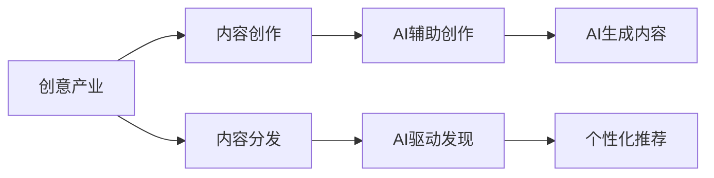

                 

**AI在创意产业中的应用探索**

**作者：禅与计算机程序设计艺术 / Zen and the Art of Computer Programming**

## 1. 背景介绍

人工智能（AI）自诞生以来，已渗透到各行各业，创意产业也不例外。创意产业涉及音乐、视觉艺术、文学、电影、设计等领域，其核心是创造力和独特性。AI如何在保持创意产业本质的同时，赋能其发展？本文将探讨AI在创意产业中的应用，从核心概念到具体算法，再到项目实践和实际应用场景。

## 2. 核心概念与联系

### 2.1 创意产业与AI的关系

创意产业和AI的关系可以用下图表示：



### 2.2 AI在创意产业的作用

AI在创意产业的作用包括：

- **辅助创作**：AI可以帮助创作者提高工作效率，提供创意灵感。
- **内容生成**：AI可以独立创作内容，如音乐、图像、文章等。
- **内容发现与推荐**：AI可以帮助用户发现和推荐个性化内容。

## 3. 核心算法原理 & 具体操作步骤

### 3.1 算法原理概述

AI在创意产业的应用涉及多种算法，包括生成式对抗网络（GAN）、变分自编码器（VAE）、循环神经网络（RNN）、transformer等。

### 3.2 算法步骤详解

以GAN为例，其训练步骤如下：

1. **数据预处理**：收集并预处理创意产品数据。
2. **生成器训练**：训练生成器网络，使其学习数据分布。
3. **判别器训练**：训练判别器网络，使其学习真假样本的区分。
4. **对抗训练**：生成器和判别器交替训练，直到生成器能生成真实的样本。

### 3.3 算法优缺点

- **优点**：AI算法可以学习和模仿创意产品的风格和特征，提高创作效率。
- **缺点**：AI生成的内容可能缺乏原创性和独特性，且训练过程需要大量数据和计算资源。

### 3.4 算法应用领域

AI算法在创意产业的应用领域包括音乐、视觉艺术、文学、电影、设计等。

## 4. 数学模型和公式 & 详细讲解 & 举例说明

### 4.1 数学模型构建

在创意产业中，AI通常使用生成模型构建数学模型。生成模型的目标是学习数据分布，并生成新的样本。

### 4.2 公式推导过程

生成式对抗网络的数学模型可以表示为：

$$G(z;\theta_g), D(x;\theta_d)$$

其中，$G$是生成器，$D$是判别器，$z$是输入噪声，$x$是生成的样本，$θ_g$和$θ_d$是网络参数。

### 4.3 案例分析与讲解

例如，在音乐创作中，AI可以学习音乐风格，并生成新的音乐片段。数学模型可以表示为：

$$G(z;\theta_g), D(x;\theta_d) = P(x|y=1)$$

其中，$y=1$表示真实音乐，$y=0$表示生成的音乐。

## 5. 项目实践：代码实例和详细解释说明

### 5.1 开发环境搭建

在开始项目实践之前，需要搭建开发环境。环境包括Python、TensorFlow或PyTorch、Jupyter Notebook等。

### 5.2 源代码详细实现

以下是GAN在音乐创作中的简单实现：

```python
import numpy as np
import tensorflow as tf
from tensorflow.keras import layers

# 定义生成器
def make_generator_model():
    model = tf.keras.Sequential()
    #...
    return model

# 定义判别器
def make_discriminator_model():
    model = tf.keras.Sequential()
    #...
    return model

# 定义GAN
def make_gan_model(generator, discriminator):
    model = tf.keras.Sequential([generator, discriminator])
    return model
```

### 5.3 代码解读与分析

代码首先定义生成器和判别器，然后组成GAN模型。生成器和判别器的结构可以根据需要进行调整。

### 5.4 运行结果展示

运行GAN模型后，可以生成新的音乐片段。结果可以通过听觉或视觉方式展示。

## 6. 实际应用场景

### 6.1 当前应用

AI在创意产业的当前应用包括：

- **音乐创作**：AI可以帮助作曲家创作音乐，如IBM的AI作曲家。
- **视觉艺术**：AI可以生成图像和绘画，如DeepArt。
- **文学创作**：AI可以帮助作家创作小说，如BetaWriter。

### 6.2 未来应用展望

未来，AI在创意产业的应用将更加广泛，如：

- **个性化内容创作**：AI可以根据用户偏好创作个性化内容。
- **虚拟现实内容创作**：AI可以帮助创作虚拟现实内容，如建筑、景观等。

## 7. 工具和资源推荐

### 7.1 学习资源推荐

- **在线课程**：Coursera、Udacity、edX等平台上的AI和创意产业相关课程。
- **书籍**："Art and Artificial Intelligence"、 "Generative Design: Parametric Architecture in the Computational Age"等。

### 7.2 开发工具推荐

- **开发环境**：Anaconda、Jupyter Notebook等。
- **AI框架**：TensorFlow、PyTorch等。
- **创意产业软件**：Ableton Live、Adobe Photoshop等。

### 7.3 相关论文推荐

- "A Neural Algorithm of Artistic Style"、 "DeepArt"、 "The Next Rembrandt"等。

## 8. 总结：未来发展趋势与挑战

### 8.1 研究成果总结

AI在创意产业的应用取得了显著成果，如AI作曲家、AI绘画等。

### 8.2 未来发展趋势

未来，AI在创意产业的应用将更加广泛，且AI将更多地参与到创意产品的整个生命周期中。

### 8.3 面临的挑战

AI在创意产业的应用面临的挑战包括：

- **原创性**：AI生成的内容是否原创，是否侵犯了人类创作者的权利。
- **伦理道德**：AI在创意产业的应用涉及伦理道德问题，如AI是否应该参与创意产品的评判等。

### 8.4 研究展望

未来的研究方向包括：

- **AI与人类创作者的协作**：研究AI如何与人类创作者协作，共同创作内容。
- **AI创意产品的评判标准**：研究AI创意产品的评判标准，如美学标准等。

## 9. 附录：常见问题与解答

**Q：AI在创意产业的应用会取代人类创作者吗？**

**A：不会。AI在创意产业的应用更多的是辅助人类创作者，而不是取代他们。AI可以帮助创作者提高工作效率，提供创意灵感，但创意产品的最终判断权还是在人类创作者手中。**

**Q：AI创作的内容是否原创？**

**A：AI创作的内容是否原创是一个复杂的问题。AI学习了大量的人类创作，其创作结果可能是对人类创作的模仿或组合。因此，AI创作的内容是否原创取决于具体情况。**

**Q：AI在创意产业的应用有哪些伦理道德问题？**

**A：AI在创意产业的应用涉及伦理道德问题包括AI是否应该参与创意产品的评判、AI创作的内容是否侵犯了人类创作者的权利等。这些问题需要在AI在创意产业的应用过程中不断探讨和解决。**

**作者：禅与计算机程序设计艺术 / Zen and the Art of Computer Programming**

