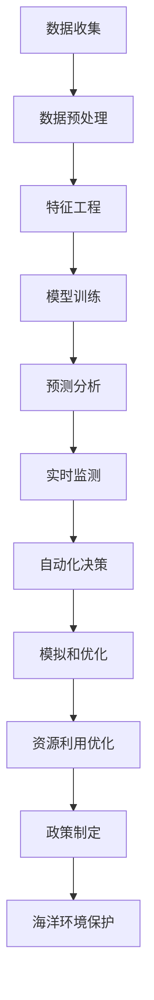

                 

**AI在智能海洋资源管理中的应用：保护海洋生态**

**作者：禅与计算机程序设计艺术 / Zen and the Art of Computer Programming**

## 1. 背景介绍

海洋是地球上最大的生态系统，为人类提供了丰富的资源和服务。然而，由于人类活动和气候变化，海洋生态面临着严重的挑战，如过度捕捞、污染、气候变化导致的海平面上升和酸化等。智能海洋资源管理是一种综合方法，旨在保护和可持续利用海洋资源。人工智能（AI）技术在智能海洋资源管理中发挥着越来越重要的作用，为保护海洋生态提供了新的工具和手段。

## 2. 核心概念与联系

### 2.1 智能海洋资源管理

智能海洋资源管理是一种基于数据驱动的方法，旨在实时监测和预测海洋环境，优化资源利用，并支持决策者制定政策。它涉及多个学科，包括海洋学、计算机科学、物联网、遥感和人工智能等。

### 2.2 AI在智能海洋资源管理中的作用

AI技术在智能海洋资源管理中有多种应用，包括：

- **预测分析**：使用机器学习算法预测海洋环境变化，如气候模式、鱼类迁徙和海洋污染等。
- **实时监测**：利用物联网和传感器收集海洋数据，并使用AI技术实时分析和监测海洋环境。
- **自动化决策**：使用规则引擎和决策支持系统帮助决策者做出更明智的决策。
- **模拟和优化**：使用数学模型和优化算法模拟海洋环境，并优化资源利用。

### 2.3 核心架构

下图是智能海洋资源管理的核心架构，展示了AI技术在其中的作用：



## 3. 核心算法原理 & 具体操作步骤

### 3.1 算法原理概述

在智能海洋资源管理中，常用的AI算法包括：

- **机器学习算法**：用于预测分析，如回归算法、决策树、随机森林、支持向量机（SVM）和神经网络等。
- **深度学习算法**：用于图像和语音处理，如卷积神经网络（CNN）和循环神经网络（RNN）等。
- **规则引擎**：用于自动化决策，如基于规则的系统和专家系统等。
- **优化算法**：用于模拟和优化，如遗传算法、模拟退火算法和粒子群算法等。

### 3.2 算法步骤详解

以机器学习算法为例，其操作步骤如下：

1. **数据收集**：收集相关的海洋环境数据，如温度、盐度、pH值、鱼类迁徙等。
2. **数据预处理**：清洗数据，处理缺失值，并将数据转换为适合机器学习算法的格式。
3. **特征工程**：选择相关特征，并进行特征缩放和特征选择。
4. **模型训练**：使用训练数据训练机器学习模型。
5. **模型评估**：使用验证数据评估模型性能，并调整模型参数。
6. **预测分析**：使用测试数据对模型进行评估，并进行预测分析。

### 3.3 算法优缺点

机器学习算法的优点包括：

- **自动化**：可以自动学习和预测，无需人工干预。
- **高效**：可以处理大量数据，并快速做出预测。
- **灵活**：可以适应不同的数据集和任务。

其缺点包括：

- **数据依赖**：模型性能取决于数据质量和数量。
- **解释性**：模型的决策过程可能难以解释。
- **过拟合**：模型可能过于复杂，导致过拟合。

### 3.4 算法应用领域

机器学习算法在智能海洋资源管理中的应用领域包括：

- **预测分析**：预测海洋环境变化，如气候模式、鱼类迁徙和海洋污染等。
- **实时监测**：实时监测海洋环境，如水质监测和鱼类监测等。
- **自动化决策**：帮助决策者做出更明智的决策，如资源配置和政策制定等。

## 4. 数学模型和公式 & 详细讲解 & 举例说明

### 4.1 数学模型构建

在智能海洋资源管理中，常用的数学模型包括：

- **回归模型**：用于预测连续变量，如线性回归和多项式回归等。
- **分类模型**：用于预测离散变量，如逻辑回归和决策树等。
- **时间序列模型**：用于预测时间序列数据，如自回归模型和ARIMA模型等。

### 4.2 公式推导过程

以线性回归为例，其公式推导过程如下：

1. **目标函数**：最小化误差平方和，即：

   $$J(\theta) = \frac{1}{2m}\sum_{i=1}^{m}(h_{\theta}(x^{(i)}) - y^{(i)})^2$$

   其中，$h_{\theta}(x^{(i)})$是预测值，$y^{(i)}$是真实值，$m$是数据集大小。

2. **梯度下降**：使用梯度下降算法最小化目标函数，即：

   $$\theta_j := \theta_j - \alpha\frac{1}{m}\sum_{i=1}^{m}(h_{\theta}(x^{(i)}) - y^{(i)})x^{(i)}_j$$

   其中，$\alpha$是学习率，$x^{(i)}_j$是特征值。

3. **正则化**：为防止过拟合，引入正则化项，即：

   $$J(\theta) = \frac{1}{2m}\sum_{i=1}^{m}(h_{\theta}(x^{(i)}) - y^{(i)})^2 + \frac{\lambda}{2m}\sum_{j=1}^{n}\theta_j^2$$

   其中，$\lambda$是正则化参数，$n$是特征数。

### 4.3 案例分析与讲解

例如，使用线性回归预测鱼类迁徙。假设鱼类迁徙与水温和盐度有关，则特征向量为$x = [1, \text{water\_temperature}, \text{salinity}]^T$，目标变量为$y = \text{whale\_migration}$。

使用梯度下降算法训练模型，并使用正则化项防止过拟合。然后，使用测试数据评估模型性能，并进行预测分析。

## 5. 项目实践：代码实例和详细解释说明

### 5.1 开发环境搭建

本项目使用Python作为编程语言，并使用Anaconda创建虚拟环境。以下是安装所需库的命令：

```bash
conda create -n sea python=3.8
conda activate sea
pip install numpy pandas scikit-learn matplotlib
```

### 5.2 源代码详细实现

以下是使用线性回归预测鱼类迁徙的源代码：

```python
import numpy as np
import pandas as pd
from sklearn.model_selection import train_test_split
from sklearn.linear_model import Ridge
from sklearn.metrics import mean_squared_error
import matplotlib.pyplot as plt

# 加载数据
data = pd.read_csv('whale_migration.csv')
X = data[['water_temperature','salinity']]
y = data['whale_migration']

# 划分数据集
X_train, X_test, y_train, y_test = train_test_split(X, y, test_size=0.2, random_state=42)

# 训练模型
model = Ridge(alpha=1.0)
model.fit(X_train, y_train)

# 评估模型
y_pred = model.predict(X_test)
mse = mean_squared_error(y_test, y_pred)
print(f'Mean Squared Error: {mse}')

# 绘制预测结果
plt.scatter(X_test['water_temperature'], y_test, color='blue', label='Actual')
plt.scatter(X_test['water_temperature'], y_pred, color='red', label='Predicted')
plt.xlabel('Water Temperature')
plt.ylabel('Whale Migration')
plt.legend()
plt.show()
```

### 5.3 代码解读与分析

代码首先加载数据，并将其分为特征向量$X$和目标变量$y$。然后，使用`train_test_split`函数将数据集划分为训练集和测试集。接着，使用`Ridge`类训练线性回归模型，并使用`mean_squared_error`函数评估模型性能。最后，绘制预测结果，并使用`legend`函数添加图例。

### 5.4 运行结果展示

运行代码后，输出的均方误差（MSE）值表示模型的性能。图中蓝色点表示实际值，红色点表示预测值。图例显示了实际值和预测值的区别。

## 6. 实际应用场景

### 6.1 海洋污染监测

AI技术可以帮助实时监测海洋污染，如石油泄漏和化学物质泄漏等。使用传感器收集数据，并使用机器学习算法预测污染扩散。决策者可以根据预测结果采取措施，并优化清理工作。

### 6.2 鱼类监测

AI技术可以帮助监测鱼类迁徙和繁殖。使用声学传感器收集数据，并使用机器学习算法预测鱼类迁徙路线。决策者可以根据预测结果优化渔业活动，并保护鱼类资源。

### 6.3 海洋气候预测

AI技术可以帮助预测海洋气候变化，如海平面上升和酸化等。使用气象数据和海洋数据训练机器学习模型，并预测气候变化趋势。决策者可以根据预测结果制定政策，并保护海洋生态。

### 6.4 未来应用展望

未来，AI技术在智能海洋资源管理中的应用将会越来越广泛。例如，无人机和自主水下航行器可以收集更多的海洋数据，并帮助实时监测海洋环境。此外，边缘计算技术可以帮助在海洋环境中实时处理数据，并做出更快的决策。

## 7. 工具和资源推荐

### 7.1 学习资源推荐

- **书籍**：推荐阅读《机器学习》和《深度学习》等经典著作。
- **在线课程**：推荐学习 Coursera 和 Udacity 上的机器学习和深度学习课程。
- **文献**：推荐阅读相关学术文献，如IEEE和ACM等期刊上的文章。

### 7.2 开发工具推荐

- **编程语言**：推荐使用Python、R和MATLAB等编程语言。
- **开发环境**：推荐使用Anaconda、Jupyter Notebook和Visual Studio Code等开发环境。
- **库和框架**：推荐使用NumPy、Pandas、Scikit-learn和TensorFlow等库和框架。

### 7.3 相关论文推荐

- [AI for Ocean: A Survey of Artificial Intelligence Applications in Ocean Science](https://arxiv.org/abs/2003.05674)
- [Deep Learning for Ocean Science: A Review](https://ieeexplore.ieee.org/document/8975853)
- [Machine Learning for Marine Ecosystem Modeling and Management](https://www.sciencedirect.com/science/article/pii/S0967581718301087)

## 8. 总结：未来发展趋势与挑战

### 8.1 研究成果总结

本文介绍了AI技术在智能海洋资源管理中的应用，包括预测分析、实时监测、自动化决策和模拟优化等。通过项目实践，展示了如何使用线性回归预测鱼类迁徙。此外，还介绍了AI技术在实际应用场景中的应用，如海洋污染监测、鱼类监测和海洋气候预测等。

### 8.2 未来发展趋势

未来，AI技术在智能海洋资源管理中的应用将会越来越广泛。无人机和自主水下航行器等新技术的发展，将帮助收集更多的海洋数据。边缘计算技术的发展，将帮助在海洋环境中实时处理数据。此外，多模式学习和 Explainable AI 等新技术的发展，将帮助提高模型的性能和可解释性。

### 8.3 面临的挑战

然而，AI技术在智能海洋资源管理中的应用也面临着挑战。数据质量和数量是关键挑战之一。海洋环境复杂，数据收集困难，且数据往往不完整和不准确。此外，模型的可解释性和可靠性也是关键挑战。模型的决策过程可能难以解释，且模型的性能可能受到数据分布的影响。

### 8.4 研究展望

未来的研究将关注以下几个方向：

- **新技术的开发**：开发新的传感器和无人机技术，帮助收集更多的海洋数据。
- **多模式学习**：开发多模式学习算法，帮助处理不同类型的海洋数据。
- **Explainable AI**：开发可解释的AI模型，帮助决策者理解模型的决策过程。
- **可持续发展**：开发可持续的AI模型，帮助保护海洋生态和资源。

## 9. 附录：常见问题与解答

**Q1：AI技术在智能海洋资源管理中的优势是什么？**

**A1：AI技术在智能海洋资源管理中的优势包括：**

- **自动化**：可以自动学习和预测，无需人工干预。
- **高效**：可以处理大量数据，并快速做出预测。
- **灵活**：可以适应不同的数据集和任务。
- **实时**：可以实时监测和预测海洋环境。

**Q2：AI技术在智能海洋资源管理中的挑战是什么？**

**A2：AI技术在智能海洋资源管理中的挑战包括：**

- **数据质量和数量**：海洋环境复杂，数据收集困难，且数据往往不完整和不准确。
- **模型的可解释性和可靠性**：模型的决策过程可能难以解释，且模型的性能可能受到数据分布的影响。

**Q3：未来AI技术在智能海洋资源管理中的发展趋势是什么？**

**A3：未来AI技术在智能海洋资源管理中的发展趋势包括：**

- **新技术的开发**：开发新的传感器和无人机技术，帮助收集更多的海洋数据。
- **多模式学习**：开发多模式学习算法，帮助处理不同类型的海洋数据。
- **Explainable AI**：开发可解释的AI模型，帮助决策者理解模型的决策过程。
- **可持续发展**：开发可持续的AI模型，帮助保护海洋生态和资源。

## 结束语

本文介绍了AI技术在智能海洋资源管理中的应用，包括预测分析、实时监测、自动化决策和模拟优化等。通过项目实践，展示了如何使用线性回归预测鱼类迁徙。此外，还介绍了AI技术在实际应用场景中的应用，如海洋污染监测、鱼类监测和海洋气候预测等。未来，AI技术在智能海洋资源管理中的应用将会越来越广泛，为保护海洋生态和资源做出贡献。

**作者：禅与计算机程序设计艺术 / Zen and the Art of Computer Programming**

（完）

