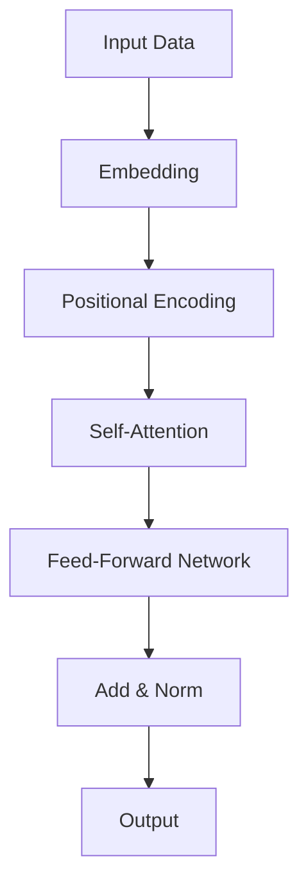

                 

**AI大模型创业：如何应对未来技术挑战？**

**作者：禅与计算机程序设计艺术 / Zen and the Art of Computer Programming**

## 1. 背景介绍

当前，人工智能（AI）正处于快速发展的时期，其中大模型（Large Language Models）的出现和应用引起了广泛关注。大模型的能力和潜力已经超越了传统的AI系统，为各行各业带来了颠覆性的变化。然而，创业者和企业家面临着如何有效地应对未来技术挑战的问题。本文将深入探讨大模型创业的机遇和挑战，并提供指南帮助读者应对未来技术挑战。

## 2. 核心概念与联系

### 2.1 大模型的定义

大模型是指具有数十亿甚至数千亿参数的深度学习模型，能够理解和生成人类语言，并展示出类似人类的推理和理解能力。大模型的核心是Transformer架构，它使用自注意力机制（Self-Attention）来处理序列数据。



### 2.2 大模型的能力

大模型的能力包括：

- 理解和生成人类语言
- 进行推理和理解
- 学习新任务和领域
- 进行多模式学习（如文本和图像）

## 3. 核心算法原理 & 具体操作步骤

### 3.1 算法原理概述

大模型的核心是Transformer架构，它使用自注意力机制来处理序列数据。自注意力机制允许模型关注输入序列的不同部分，从而理解上下文和进行推理。

### 3.2 算法步骤详解

1. **Embedding**：将输入数据（如文本）转换为数值表示。
2. **Positional Encoding**：为序列数据添加位置信息。
3. **Self-Attention**：关注输入序列的不同部分，理解上下文。
4. **Feed-Forward Network**：对每个位置进行非线性变换。
5. **Add & Norm**：残差连接和层归一化。
6. **Output**：生成输出序列。

### 3.3 算法优缺点

**优点**：

- 理解和生成人类语言的能力
- 进行推理和理解的能力
- 学习新任务和领域的能力

**缺点**：

- 训练和推理的高成本
- 缺乏解释性
- 存在偏见和不准确性

### 3.4 算法应用领域

大模型的应用领域包括：

- 自然语言处理（NLP）：文本生成、翻译、问答系统等。
- 计算机视觉：图像和文本的多模式学习。
- 科学研究：发现新的科学规律和模式。
- 创意行业：创作音乐、诗歌和小说等。

## 4. 数学模型和公式 & 详细讲解 & 举例说明

### 4.1 数学模型构建

大模型的数学模型是基于Transformer架构的，可以表示为：

$$h_{i} = \text{FFN}(h_{i-1}) + h_{i-1}$$

其中，$h_{i}$是第$i$层的输出，$\text{FFN}$是Feed-Forward Network。

### 4.2 公式推导过程

自注意力机制的数学表达式为：

$$ \text{Attention}(Q, K, V) = \text{softmax}\left(\frac{QK^T}{\sqrt{d_k}}\right)V $$

其中，$Q$, $K$, $V$分别是查询、键和值，$\sqrt{d_k}$是缩放因子，用于控制梯度消失。

### 4.3 案例分析与讲解

例如，在文本生成任务中，大模型需要预测下一个单词。给定上下文$C$, 模型需要计算每个单词的概率分布$P(w|C)$, 并选择概率最高的单词作为输出。

## 5. 项目实践：代码实例和详细解释说明

### 5.1 开发环境搭建

大模型的开发需要强大的硬件资源，包括GPU和TPU。推荐使用如下软件和框架：

- Python：大模型的开发通常使用Python语言。
- PyTorch或TensorFlow：用于构建和训练模型的深度学习框架。
- Hugging Face Transformers：提供预训练的大模型和工具。

### 5.2 源代码详细实现

以下是一个简单的大模型（如BERT）的实现示例：

```python
from transformers import BertForMaskedLM, BertTokenizer

model = BertForMaskedLM.from_pretrained('bert-base-uncased')
tokenizer = BertTokenizer.from_pretrained('bert-base-uncased')

inputs = tokenizer("Hello, I'm a [MASK] model.", return_tensors="pt")
outputs = model(**inputs)
predicted_token_id = outputs.logits.argmax(-1)
predicted_token = tokenizer.decode(predicted_token_id)
```

### 5.3 代码解读与分析

在上述示例中，我们使用预训练的BERT模型进行掩码语言模型任务。我们首先对输入文本进行编码，然后使用模型进行推理。模型输出每个位置的可能单词分布，我们选择概率最高的单词作为预测结果。

### 5.4 运行结果展示

在上述示例中，预测的单词可能是"language"或"model"等与上下文相关的单词。

## 6. 实际应用场景

### 6.1 当前应用

大模型已经在各行各业得到广泛应用，包括：

- 搜索引擎：改善搜索结果的相关性。
- 客户服务：提供智能客服和聊天机器人。
- 创意行业：协助创作音乐、诗歌和小说等。

### 6.2 未来应用展望

未来，大模型有望在以下领域取得突破：

- 科学研究：发现新的科学规律和模式。
- 自动驾驶：理解和生成语音指令。
- 智能制造：协助设计和优化生产流程。

## 7. 工具和资源推荐

### 7.1 学习资源推荐

- "Attention is All You Need"：大模型的开创性论文。
- "Language Models are Few-Shot Learners"：大模型的新能力的论文。
- Hugging Face Transformers：提供预训练的大模型和工具。

### 7.2 开发工具推荐

- Google Colab：免费的Jupyter notebook环境，支持GPU和TPU。
- Hugging Face Spaces：共享和部署大模型的平台。
- Weights & Biases：跟踪和可视化大模型训练的工具。

### 7.3 相关论文推荐

- "BERT: Pre-training of Deep Bidirectional Transformers for Language Understanding"：BERT模型的论文。
- "T5: Text-to-Text Transfer Transformer"：T5模型的论文。
- "PaLM: Pathways Language Model"：Google的大模型PaLM的论文。

## 8. 总结：未来发展趋势与挑战

### 8.1 研究成果总结

大模型已经取得了显著的成就，包括理解和生成人类语言，进行推理和理解，学习新任务和领域等。

### 8.2 未来发展趋势

未来，大模型的发展趋势包括：

- 模型规模的进一步扩大。
- 多模式学习的发展（如文本和图像）。
- 解释性AI的发展。

### 8.3 面临的挑战

大模型面临的挑战包括：

- 训练和推理的高成本。
- 缺乏解释性。
- 存在偏见和不准确性。

### 8.4 研究展望

未来的研究方向包括：

- 降低大模型的训练和推理成本。
- 提高大模型的解释性。
- 解决大模型的偏见和不准确性问题。

## 9. 附录：常见问题与解答

**Q：大模型需要多少资源？**

**A：大模型需要大量的计算资源，包括GPU和TPU。例如，训练一个千亿级别的大模型需要数千个GPU节点。**

**Q：大模型是如何学习的？**

**A：大模型是通过自监督学习预训练的，然后通过监督学习微调的。**

**Q：大模型是否会取代人类？**

**A：大模型不会取代人类，但会改变人类的工作方式。大模型可以协助人类完成任务，但也会带来新的挑战和问题。**

## 结束语

大模型是当前AI领域最具前途的方向之一，为各行各业带来了颠覆性的变化。然而，创业者和企业家面临着如何有效地应对未来技术挑战的问题。本文提供了指南，帮助读者理解大模型的原理和应用，并应对未来技术挑

