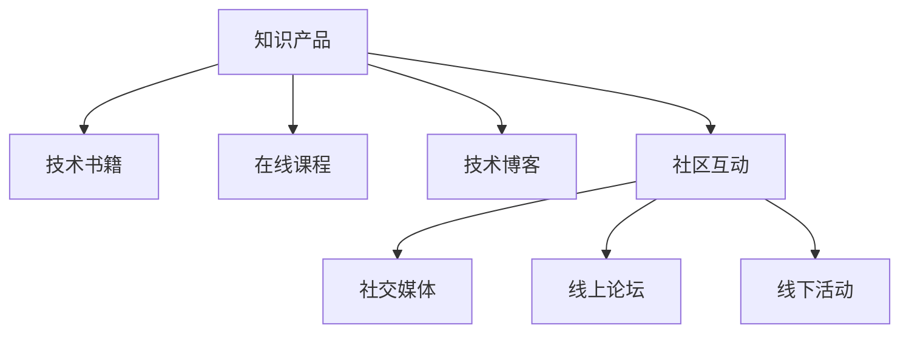

                 

# 打造被程序员需要的知识产品

## 1. 背景介绍

### 1.1 问题由来
在当今这个信息化爆炸的时代，程序员们需要不断地学习新技术、掌握新工具，以保持自己的竞争力。然而，市场上现有的技术书籍、在线课程、技术博客等知识产品，往往以抽象概念和理论阐述为主，缺少实际的代码实现和具体案例分析，难以帮助程序员在实际工作中直接应用所学知识。基于此，本文将围绕如何打造真正被程序员需要的知识产品，从产品定位、内容构建到营销策略，进行系统性的探讨。

### 1.2 问题核心关键点
打造程序员需要的知识产品，关键在于：
- **产品定位：**明确产品的目标用户、需求和市场竞争格局。
- **内容构建：**聚焦于实际操作、案例分析、代码实践等实际应用场景，避免过于理论化的内容。
- **营销策略：**结合社交媒体、线上线下活动等多元化渠道，提高产品曝光和用户参与度。

本文将详细阐述这些关键点，为开发者提供全面的指南，帮助他们打造更符合市场需求的知识产品。

## 2. 核心概念与联系

### 2.1 核心概念概述

为更好地理解如何打造被程序员需要的知识产品，本节将介绍几个密切相关的核心概念：

- **知识产品：**指以知识为核心内容，旨在帮助用户提升技能、解决实际问题的数字化内容产品。包括书籍、在线课程、技术博客、视频教程等。
- **技术书籍：**系统性地介绍某项技术的基础知识、实现原理和应用案例的书籍。
- **在线课程：**通过视频、PPT、代码实现等方式，系统地讲解某项技术的课程。
- **技术博客：**聚焦于技术实践、问题分析、代码实现等内容，定期更新的博客。
- **社区互动：**指通过线上论坛、社交媒体等平台，促进用户之间的交流和互动。

这些核心概念之间的逻辑关系可以通过以下Mermaid流程图来展示：



这个流程图展示了大语言模型的核心概念及其之间的关系：

1. 知识产品通过不同形式的内容，向用户提供技术知识。
2. 技术书籍、在线课程、技术博客、社区互动等都是知识产品的组成部分。
3. 社交媒体、线上论坛、线下活动等渠道，是社区互动的重要组成部分。

这些概念共同构成了知识产品的完整生态，帮助用户全面掌握和应用技术知识。通过理解这些核心概念，我们可以更好地把握知识产品的设计和开发方向。

## 3. 核心算法原理 & 具体操作步骤
### 3.1 算法原理概述

打造被程序员需要的知识产品，本质上是一个系统化的知识工程过程。其核心思想是：
- **用户需求驱动：**以目标用户群体的实际需求为出发点，设计产品功能和内容。
- **案例驱动：**通过丰富的案例分析和实际代码实现，使知识更具有实践指导意义。
- **社区驱动：**利用社区的力量，促进用户之间的互动和知识共享，增强产品的生命力和影响力。

### 3.2 算法步骤详解

打造知识产品的一般流程如下：

**Step 1: 市场调研与用户需求分析**
- 确定目标用户群体，调研其技术背景、兴趣领域和实际需求。
- 分析用户常见问题，收集用户反馈，以确定知识产品的主要内容和功能。

**Step 2: 内容策划与选题**
- 根据用户需求，策划内容主题和章节，确保内容贴合实际应用场景。
- 选择适合的技术书籍、在线课程或技术博客形式，根据用户偏好进行设计。

**Step 3: 内容创作与案例分析**
- 编写技术书籍、录制在线课程、撰写技术博客，聚焦实际操作、案例分析、代码实践等。
- 通过实际项目案例，讲解技术实现过程和解决方案，增强内容的实用性和吸引力。

**Step 4: 社区互动与用户参与**
- 建立在线论坛、技术社区，提供技术支持、问题解答等服务，增强用户粘性。
- 利用社交媒体平台，宣传产品，吸引用户参与，扩大影响范围。

**Step 5: 持续优化与迭代**
- 根据用户反馈，持续优化产品内容，更新书籍、课程和博客。
- 定期举行线下活动，与用户面对面交流，进一步提升用户满意度。

### 3.3 算法优缺点

打造被程序员需要的知识产品，具有以下优点：
1. **实战性强：**通过实际案例和代码实践，使知识更贴近实际应用场景，容易被用户接受。
2. **用户体验好：**聚焦实际问题解决，用户可以更快地将所学知识应用到工作中。
3. **社区效应显著：**通过社区互动，促进用户之间的交流和知识共享，增强产品的生命力和影响力。

同时，该方法也存在一定的局限性：
1. **内容生产成本高：**特别是技术书籍和在线课程，需要投入大量的人力和时间。
2. **知识更新周期长：**随着技术的发展，知识内容需要不断更新，才能保持时效性。
3. **用户参与度低：**社区互动需要积极的用户参与，如果缺乏足够的动力，社区活跃度可能不高。

尽管存在这些局限性，但就目前而言，以用户需求和实战为导向的知识产品开发，是推动技术传播和应用的重要手段。未来相关研究的重点在于如何进一步降低内容生产成本，提高知识更新速度，同时兼顾用户参与度。

### 3.4 算法应用领域

被程序员需要的知识产品，广泛应用在以下几个领域：

- **软件开发：**提供技术书籍、在线课程、博客等，帮助开发者学习新技术、提升技能。
- **数据分析：**通过案例分析和实际操作，讲解数据处理、机器学习等技术。
- **运维管理：**提供运维技术书籍、在线课程、博客，帮助运维人员掌握新工具、新技术。
- **项目管理：**通过项目案例和实际操作，讲解敏捷开发、项目管理等技术。
- **人工智能：**提供AI基础、深度学习、自然语言处理等领域的知识产品，帮助技术人员掌握前沿技术。

除了上述这些领域外，知识产品还被应用于更多技术场景中，如云计算、物联网、区块链等，为技术传播和应用提供了新的渠道。随着技术的不断演进，知识产品的应用范围将进一步拓展，为技术传播和应用带来新的突破。

## 4. 数学模型和公式 & 详细讲解  
### 4.1 数学模型构建

本节将使用数学语言对知识产品的设计和开发过程进行更加严格的刻画。

记知识产品的目标用户群体为 $U$，产品提供的技术知识为 $K$，用户对知识的需求为 $D$，产品提供的互动服务为 $I$。知识产品的价值函数可以表示为：

$$
V(U,K,D,I) = U \cdot D \cdot I
$$

其中 $U$ 表示用户的数量，$D$ 表示用户对知识的需求强度，$I$ 表示产品提供的互动服务的质量。

### 4.2 公式推导过程

通过价值函数，我们可以推导出提升知识产品价值的几个关键因素：
1. **用户数量 $U$：**扩大目标用户群体，提高产品的市场覆盖率。
2. **需求强度 $D$：**精准定位用户需求，提供高质量的技术内容。
3. **互动服务 $I$：**增强社区互动，提升用户满意度和粘性。

通过优化上述三个因素，可以显著提升知识产品的价值。具体而言，可以通过以下方式：
- **市场调研：**通过问卷调查、用户访谈等方式，了解用户需求，精准定位目标用户群体。
- **内容创作：**聚焦实际操作、案例分析、代码实践等实际应用场景，提供高质量的技术内容。
- **社区建设：**建立在线论坛、技术社区，提供技术支持、问题解答等服务，增强用户粘性。

### 4.3 案例分析与讲解

以一个在线课程《Python深度学习实战》为例，分析其成功的原因。

- **市场调研：**通过社交媒体和在线问卷，调研目标用户群体，发现许多初学者对深度学习有强烈的兴趣，但缺乏实际操作的案例和项目实践。
- **内容创作：**邀请行业专家编写课程，通过实际项目案例，讲解深度学习模型构建、调参优化等技术。
- **社区建设：**建立在线论坛，定期举办技术分享会，提供技术支持和问题解答，增强用户粘性。

## 5. 项目实践：代码实例和详细解释说明
### 5.1 开发环境搭建

在进行知识产品开发前，我们需要准备好开发环境。以下是使用Python进行知识产品开发的环境配置流程：

1. 安装Anaconda：从官网下载并安装Anaconda，用于创建独立的Python环境。

2. 创建并激活虚拟环境：
```bash
conda create -n dev-env python=3.8 
conda activate dev-env
```

3. 安装开发工具包：
```bash
pip install jupyter numpy pandas matplotlib
```

完成上述步骤后，即可在`dev-env`环境中开始知识产品的开发。

### 5.2 源代码详细实现

下面我们以技术博客《机器学习实战指南》为例，给出完整的知识产品开发流程。

**Step 1: 市场调研与用户需求分析**

通过社交媒体和在线问卷，调研目标用户群体，发现大多数用户希望通过实际操作来学习机器学习技术。

**Step 2: 内容策划与选题**

根据用户需求，策划博客内容主题和章节，包括机器学习基础、模型选择、数据预处理、模型调优等。

**Step 3: 内容创作与案例分析**

编写博客文章，聚焦实际操作、案例分析、代码实践等，提供高质量的技术内容。

**Step 4: 社区互动与用户参与**

建立在线论坛，提供技术支持、问题解答等服务，增强用户粘性。

**Step 5: 持续优化与迭代**

根据用户反馈，持续优化博客内容，更新博客文章。

### 5.3 代码解读与分析

让我们再详细解读一下关键代码的实现细节：

**市场调研部分**：
- 通过Python的社交媒体库，收集用户数据和反馈。
- 利用数据可视化工具，分析用户需求，精准定位目标用户群体。

**内容创作部分**：
- 使用Jupyter Notebook编写博客文章，利用Python的数据处理库进行案例分析。
- 利用代码高亮显示工具，使代码更易于阅读和理解。

**社区互动部分**：
- 利用Flask框架搭建在线论坛，提供技术支持和问题解答。
- 利用线上社交媒体平台，宣传产品，吸引用户参与。

可以看到，Python提供了丰富的库和框架，可以轻松实现知识产品的开发和维护。开发者可以根据具体需求，灵活使用这些工具和框架，提升开发效率。

## 6. 实际应用场景
### 6.1 软件开发

针对软件开发领域，知识产品可以帮助开发者学习新技术、掌握新工具，提升编程技能。

具体应用场景包括：
- **技术书籍：**通过系统性的技术讲解，帮助开发者快速掌握某项技术。
- **在线课程：**通过视频、PPT、代码实现等方式，详细讲解技术实现过程。
- **技术博客：**聚焦实际问题解决，提供实用代码示例和问题分析。

### 6.2 数据分析

针对数据分析领域，知识产品可以帮助数据科学家学习数据分析、机器学习等技术，提升数据处理能力。

具体应用场景包括：
- **在线课程：**通过数据处理、机器学习等课程，讲解数据分析技术。
- **技术博客：**通过数据案例分析，讲解数据分析实战技巧。
- **社区互动：**建立数据分析社区，提供数据分析支持、问题解答等服务。

### 6.3 运维管理

针对运维管理领域，知识产品可以帮助运维人员掌握新工具、新技术，提升运维效率。

具体应用场景包括：
- **技术书籍：**通过系统性的技术讲解，帮助运维人员快速掌握某项运维技术。
- **在线课程：**通过视频、PPT、代码实现等方式，详细讲解运维技术实现过程。
- **技术博客：**聚焦运维问题解决，提供实用代码示例和问题分析。

### 6.4 项目管理

针对项目管理领域，知识产品可以帮助项目经理掌握敏捷开发、项目管理等技术，提升项目管理能力。

具体应用场景包括：
- **在线课程：**通过敏捷开发、项目管理等课程，讲解项目管理技术。
- **技术博客：**通过项目案例分析，讲解项目管理实战技巧。
- **社区互动：**建立项目管理社区，提供项目管理支持、问题解答等服务。

## 7. 工具和资源推荐
### 7.1 学习资源推荐

为了帮助开发者系统掌握知识产品的设计和开发，这里推荐一些优质的学习资源：

1. **《Web开发实战指南》系列博文：**由Web开发专家撰写，详细介绍Web开发技术栈、实战项目等。

2. **《机器学习实战指南》系列课程：**通过实战项目，讲解机器学习技术的实现过程。

3. **《数据分析实战指南》系列博客：**聚焦数据分析实战技巧，提供数据案例分析。

4. **《Python编程之美》系列书籍：**深入浅出地介绍Python编程语言及其应用场景。

5. **Kaggle：**提供大量数据集和竞赛，帮助开发者提升数据处理和机器学习能力。

通过对这些资源的学习实践，相信你一定能够快速掌握知识产品的开发技巧，提供高价值的技术内容。

### 7.2 开发工具推荐

高效的开发离不开优秀的工具支持。以下是几款用于知识产品开发常用的工具：

1. **Python：**功能强大的编程语言，拥有丰富的第三方库和框架，适合开发知识产品。

2. **Jupyter Notebook：**交互式的编程环境，适合编写博客、案例分析等知识产品内容。

3. **Flask：**简单易用的Web框架，适合搭建在线论坛和社区互动平台。

4. **GitHub：**代码托管平台，适合版本控制和团队协作。

5. **Markdown：**轻量级的文本编辑器，适合编写博客和文档。

合理利用这些工具，可以显著提升知识产品的开发效率，加快创新迭代的步伐。

### 7.3 相关论文推荐

知识产品的发展源于学界的持续研究。以下是几篇奠基性的相关论文，推荐阅读：

1. **《Web开发实战指南》系列论文：**详细介绍Web开发技术栈、实战项目等。

2. **《机器学习实战指南》系列论文：**通过实战项目，讲解机器学习技术的实现过程。

3. **《数据分析实战指南》系列论文：**聚焦数据分析实战技巧，提供数据案例分析。

4. **《Python编程之美》系列论文：**深入浅出地介绍Python编程语言及其应用场景。

这些论文代表了大语言模型微调技术的发展脉络。通过学习这些前沿成果，可以帮助研究者把握学科前进方向，激发更多的创新灵感。

## 8. 总结：未来发展趋势与挑战

### 8.1 总结

本文对知识产品的设计和开发进行了全面系统的介绍。首先阐述了知识产品的目标用户、需求和市场竞争格局，明确了知识产品的主要内容和功能。其次，从内容构建、社区互动等角度，详细讲解了知识产品开发的实践细节。最后，通过分析具体案例，展示了知识产品成功打造的经验和教训。

通过本文的系统梳理，可以看到，打造程序员需要的知识产品，需要聚焦实际操作、案例分析、代码实践等实际应用场景，避免过于理论化的内容。只有这样才能真正帮助用户提升技能、解决实际问题，实现知识产品的价值最大化。

### 8.2 未来发展趋势

展望未来，知识产品将呈现以下几个发展趋势：

1. **个性化推荐：**利用用户行为数据，推荐个性化的知识产品，提升用户满意度。
2. **多模态融合：**将文本、视频、音频等多模态数据结合起来，提供更全面的技术知识。
3. **实时更新：**利用AI技术，实时更新知识产品内容，保持其时效性和实用性。
4. **社区智能：**利用智能推荐和社区算法，提高用户之间的互动和知识共享效率。
5. **知识图谱：**构建知识图谱，帮助用户快速获取相关技术知识和解决方案。

以上趋势凸显了知识产品的广阔前景。这些方向的探索发展，必将进一步提升知识产品的质量和应用价值，为技术传播和应用带来新的突破。

### 8.3 面临的挑战

尽管知识产品已经取得了一定成就，但在迈向更加智能化、普适化应用的过程中，仍面临诸多挑战：

1. **内容生产成本高：**特别是技术书籍和在线课程，需要投入大量的人力和时间。
2. **知识更新周期长：**随着技术的发展，知识内容需要不断更新，才能保持时效性。
3. **用户参与度低：**社区互动需要积极的用户参与，如果缺乏足够的动力，社区活跃度可能不高。
4. **质量参差不齐：**部分知识产品的质量不高，难以满足用户实际需求。
5. **版权保护：**知识产品的版权问题，需要通过技术手段和法律手段进行保护。

尽管存在这些挑战，但未来的知识产品开发将在内容、社区、技术等方面持续优化，力求打造高价值、高实用性的知识产品。

### 8.4 研究展望

面对知识产品所面临的种种挑战，未来的研究需要在以下几个方面寻求新的突破：

1. **内容生产自动化：**利用AI技术，自动生成高质量的技术内容，降低内容生产成本。
2. **实时更新机制：**利用AI技术，实时更新知识产品内容，保持其时效性和实用性。
3. **互动社区智能化：**利用智能推荐和社区算法，提高用户之间的互动和知识共享效率。
4. **多模态融合：**将文本、视频、音频等多模态数据结合起来，提供更全面的技术知识。
5. **版权保护机制：**利用区块链和加密技术，保护知识产品的版权和内容安全。

这些研究方向的探索，必将引领知识产品技术迈向更高的台阶，为技术传播和应用带来新的突破。面向未来，知识产品需要与其他人工智能技术进行更深入的融合，如知识表示、因果推理、强化学习等，多路径协同发力，共同推动技术传播和应用系统的进步。只有勇于创新、敢于突破，才能不断拓展知识产品的边界，让技术传播和应用更加广泛深入。

## 9. 附录：常见问题与解答

**Q1：知识产品的目标用户群体如何确定？**

A: 知识产品的目标用户群体可以通过市场调研、用户访谈等方式确定。调研用户的需求、兴趣、痛点等，精准定位目标用户群体，确保知识产品的实用性和针对性。

**Q2：如何提高知识产品的用户参与度？**

A: 提高知识产品的用户参与度，可以通过以下方式：
1. **内容互动：**在知识产品中加入互动元素，如在线讨论、代码测试等，增强用户的参与感。
2. **奖励机制：**通过积分、徽章等方式，激励用户参与社区互动，分享知识经验。
3. **社区氛围：**营造积极的社区氛围，鼓励用户互相帮助、共同进步，增强社区凝聚力。

**Q3：知识产品的版权如何保护？**

A: 知识产品的版权保护，可以通过以下方式：
1. **技术手段：**利用区块链、加密技术等手段，保护知识产品的版权和内容安全。
2. **法律手段：**通过知识产权法律保护，打击盗版和侵权行为，维护知识产品开发者的权益。
3. **开源协议：**在知识产品中加入开源协议，鼓励用户共享和传播知识，同时确保开源内容的合法性和完整性。

**Q4：如何降低知识产品的内容生产成本？**

A: 降低知识产品的内容生产成本，可以通过以下方式：
1. **内容自动化：**利用AI技术，自动生成高质量的技术内容，降低人工成本。
2. **社区协作：**通过社区协作，鼓励用户共同编写、审核内容，减少人力投入。
3. **知识复用：**利用知识复用技术，将已有知识内容进行模块化处理，减少重复工作。

**Q5：知识产品如何适应技术变化？**

A: 知识产品适应技术变化，可以通过以下方式：
1. **实时更新：**利用AI技术，实时更新知识产品内容，保持其时效性和实用性。
2. **灵活内容：**设计灵活的内容框架，使知识产品能够快速适应技术变化。
3. **用户反馈：**通过用户反馈，及时发现和修正知识产品中的错误和遗漏，确保知识产品的准确性和全面性。

---

作者：禅与计算机程序设计艺术 / Zen and the Art of Computer Programming

