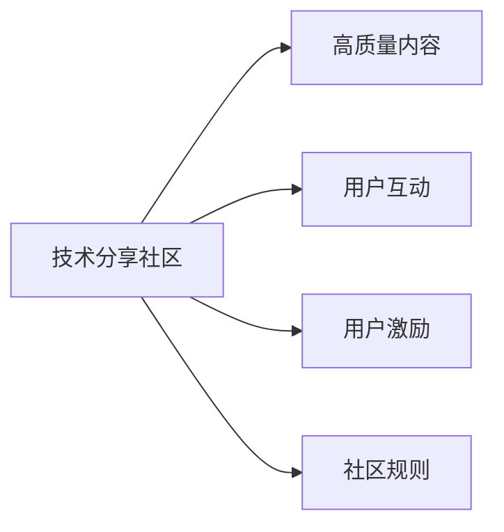

                 

# 打造高质量的技术分享社区:运营技巧

## 1. 背景介绍

### 1.1 问题由来
在当下快速发展的互联网时代，技术分享社区成为了连接开发者、工程师、科研人员等专业人士的桥梁。通过分享交流，技术社区不仅帮助解决了实际问题，还推动了知识与经验的传播。然而，随着社区规模的扩大，内容质量参差不齐、低效信息泛滥、用户粘性下降等问题日益突出。这不仅影响了社区的健康发展，还削弱了其价值和影响力。

### 1.2 问题核心关键点
为解决上述问题，技术社区运营者亟需掌握高质量内容筛选与推广的方法，构建高效互动机制，提升用户体验，激发用户活跃度。具体而言，可以从以下几个方面进行优化：

- 高质量内容管理：严格审核和筛选社区内容，确保发布内容的技术准确性和实用性。
- 用户互动机制设计：引入评论、点赞、问答等互动形式，增强用户间的互动与交流。
- 用户激励体系构建：通过积分、徽章、专属特权等手段，激发用户积极参与社区活动。
- 社区规则制度建设：制定明确清晰的社区行为准则，维护良好的社区氛围。

### 1.3 问题研究意义
高质量技术分享社区的建设，对于推动技术进步、促进知识共享、培养行业人才具有重要意义：

- 加速知识传播：高质量内容可以加速技术知识在行业内的传播，缩短技术迭代周期。
- 提升用户体验：良好的互动机制和用户激励可以显著提升用户满意度和忠诚度。
- 构建社区文化：规范的社区规则和激励机制有助于构建积极健康、良性互动的社区文化。
- 发掘人才潜力：技术社区为新手和专家提供了展示才华的舞台，发掘和培养技术人才。

## 2. 核心概念与联系

### 2.1 核心概念概述

为更好理解如何运营高质量技术分享社区，本节将介绍几个关键概念及其相互联系：

- **技术分享社区**：以技术交流和分享为目的的在线平台，涵盖编程、算法、数据科学等多个技术领域。
- **高质量内容**：技术准确、实用性强、易于理解的内容，能够帮助用户解决问题或提升技术水平。
- **用户互动**：通过评论、点赞、问答等方式，用户之间的交流与合作。
- **用户激励**：以积分、徽章、专属特权等为手段，激发用户参与社区活动的行为。
- **社区规则**：为维护社区秩序和安全，制定的一系列行为准则和规范。

这些概念之间的关系可以通过以下Mermaid流程图来展示：



这个流程图展示出技术分享社区的运营要素及其相互关联：

1. 高质量内容是社区的核心资产，需要严格管理和审核。
2. 用户互动是社区的活跃驱动，促进内容传播和用户粘性。
3. 用户激励是保持用户活跃的重要手段，提升社区参与度。
4. 社区规则是维护社区秩序的基础，保障社区健康发展。

## 3. 核心算法原理 & 具体操作步骤

### 3.1 算法原理概述

技术分享社区的运营策略，本质上是多目标优化问题。运营者需要平衡内容质量、用户互动、用户激励和社区规则等多个因素，以最大化社区的整体价值。目标函数可以表示为：

$$
Maximize(V) = Q \times C + I + D - R
$$

其中 $V$ 表示社区的整体价值，$Q$ 为内容质量，$C$ 为用户互动，$I$ 为用户激励，$D$ 为用户活跃度，$R$ 为社区规则成本。运营者需要通过一系列算法和策略，优化这些指标，以提升社区的整体价值。

### 3.2 算法步骤详解

基于以上原理，运营技术分享社区可以采用以下步骤：

**Step 1: 内容审核与筛选**
- 建立内容审核团队，设定审核标准和流程。
- 引入自动化工具辅助内容筛选，如垃圾过滤、关键词检测、语义分析等。
- 设置内容评价指标，如问题清晰度、答案准确性、创新性等。

**Step 2: 互动机制设计**
- 引入评论、点赞、问答等功能，增强用户之间的交流。
- 优化算法，推荐高质量内容给活跃用户，提升内容曝光率。
- 设立专题讨论区，聚焦热点话题，增强用户参与。

**Step 3: 用户激励体系构建**
- 设计积分、徽章等激励机制，奖励优质内容发布。
- 引入排行榜、直播等功能，提升用户参与感。
- 提供专属特权，如管理权限、优先发布等，吸引专家入驻。

**Step 4: 社区规则制度建设**
- 制定明确的用户行为规范，如内容版权、言辞礼貌等。
- 设立举报机制，及时处理违规行为。
- 定期评估和优化规则，保持社区规范性和开放性。

### 3.3 算法优缺点

高质量技术分享社区运营算法具有以下优点：

1. 多样化目标优化：能够综合考虑内容质量、用户互动、用户激励等多个维度，提升社区整体价值。
2. 可扩展性强：算法可以根据社区规模和需求灵活调整。
3. 提高用户参与度：通过激励和互动机制，增加用户黏性，促进内容生成和传播。

然而，也存在一些缺点：

1. 运营成本高：需要建立专门的内容审核团队和互动机制设计团队，成本较高。
2. 依赖人工：算法需要人类监督和规则优化，无法完全自动化。
3. 激励效果有限：单纯依靠积分、徽章等激励手段，难以长期保持用户活跃。
4. 规则制定难度：社区规则需要适应不同用户和文化背景，制定和执行难度较大。

尽管如此，通过精心设计和优化这些算法和策略，可以显著提升技术分享社区的质量和用户粘性，为其健康发展提供有力保障。

### 3.4 算法应用领域

基于以上算法，技术分享社区可以应用于多个领域，包括但不限于：

- 编程与开发：帮助开发者解决编程难题，分享最新技术趋势。
- 数据科学与机器学习：提供数据集、算法实现、模型评估等资源。
- 算法竞赛：组织线上线下的算法竞赛，激励用户学习与创新。
- 学术研究：提供科研论文、实验数据和合作机会，促进学术交流。
- 开源社区：促进开源项目和贡献者的交流，推动开源文化。

这些领域的技术分享社区，都需要综合运用高质量内容管理、用户互动机制、用户激励和社区规则等策略，才能更好地服务于社区用户，推动技术进步。

## 4. 数学模型和公式 & 详细讲解 & 举例说明

### 4.1 数学模型构建

在技术分享社区运营中，可以通过以下数学模型来描述上述运营要素及其相互关系：

$$
V = Q \times C + I + D - R
$$

其中：
- $Q$ 为内容质量，可以通过内容评价指标 $q$ 来表示，如用户评分、编辑评分等。
- $C$ 为内容曝光率，可以通过模型 $f$ 来表示，如基于用户行为的推荐算法。
- $I$ 为用户激励，可以通过激励因子 $i$ 来表示，如积分奖励、徽章奖励等。
- $D$ 为用户活跃度，可以通过用户互动指标 $d$ 来表示，如评论数、点赞数等。
- $R$ 为社区规则成本，可以通过规则复杂度 $r$ 来表示，如规则数量、维护成本等。

### 4.2 公式推导过程

基于上述模型，我们可以推导出优化社区价值 $V$ 的策略：

$$
\max_{Q, C, I, D, R} V = \max_{Q} Q \times f(Q) + I + d(Q) - r(Q)
$$

其中，$f(Q)$ 为内容曝光率的函数，$d(Q)$ 为用户活跃度的函数，$r(Q)$ 为社区规则成本的函数。

为了优化社区价值，需要最大化 $Q$，即发布高质量的内容，并合理设置 $C$、$I$、$D$ 和 $R$，以最大化社区的整体价值。

### 4.3 案例分析与讲解

**案例一：高质量内容管理**

假设某技术分享社区包含 $n$ 个高质量内容 $Q_i$，每个内容的质量为 $q_i$，发布量为 $c_i$。为了最大化社区价值，可以设定目标函数：

$$
\max_{Q} \sum_{i=1}^n q_i \times c_i
$$

其中 $q_i$ 表示内容的质量评分，$c_i$ 表示内容的曝光量。为实现此目标，可以通过以下算法步骤：

1. 设定内容质量标准 $q^*$，筛选高质量内容。
2. 引入推荐算法 $f$，提升高质量内容的曝光量 $c_i$。
3. 设定曝光量上限 $c^*$，控制内容数量。

**案例二：用户激励设计**

假设某社区设定了积分系统 $I_i$ 和徽章系统 $B_i$，分别表示用户 $i$ 获得的积分和徽章数量。为了最大化社区价值，可以设定目标函数：

$$
\max_{I, B} \sum_{i=1}^n (I_i + B_i)
$$

其中 $I_i$ 和 $B_i$ 分别表示用户 $i$ 的积分和徽章数量。为实现此目标，可以通过以下算法步骤：

1. 设定积分和徽章奖励规则，针对高质量内容发布进行奖励。
2. 设计排行榜机制，展示积分和徽章前几名的用户。
3. 设定激励上限 $I^*$ 和 $B^*$，控制激励数量。

**案例三：互动机制优化**

假设某社区的用户互动指标 $D_i$ 包括评论数 $d_{i1}$、点赞数 $d_{i2}$ 和提问数 $d_{i3}$。为了最大化社区价值，可以设定目标函数：

$$
\max_{D} \sum_{i=1}^n (d_{i1} + d_{i2} + d_{i3})
$$

其中 $d_{i1}$、$d_{i2}$ 和 $d_{i3}$ 分别表示用户 $i$ 的评论、点赞和提问数量。为实现此目标，可以通过以下算法步骤：

1. 引入评论、点赞和问答功能，提升互动指标。
2. 设定互动激励规则，针对积极互动用户进行奖励。
3. 设计专题讨论区，聚焦热点话题，增强用户参与。

## 5. 项目实践：代码实例和详细解释说明

### 5.1 开发环境搭建

在进行技术分享社区开发前，需要进行以下环境搭建：

1. 选择技术栈：如使用React、Vue等前端框架，Node.js、Python等后端语言，MongoDB、PostgreSQL等数据库。
2. 搭建开发环境：如安装Docker、Kubernetes等容器化工具，搭建Git仓库。
3. 配置开发工具：如安装Git、Visual Studio Code、Jupyter Notebook等开发工具。

### 5.2 源代码详细实现

以下是一个基于React的前端技术分享社区示例：

**前端代码**

```javascript
import React, { useState, useEffect } from 'react';
import axios from 'axios';

function Post({ post }) {
  const [ likes, setLikes ] = useState(0);
  const [ comments, setComments ] = useState([]);
  const [ newComment, setNewComment ] = useState('');

  useEffect(() => {
    axios.get(`/api/posts/${post.id}/likes`)
      .then(response => setLikes(response.data.likes));
    axios.get(`/api/posts/${post.id}/comments`)
      .then(response => setComments(response.data.comments));
  }, []);

  const handleLike = () => {
    axios.post(`/api/posts/${post.id}/likes`)
      .then(response => setLikes(response.data.likes));
  };

  const handleComment = () => {
    if (newComment) {
      axios.post(`/api/posts/${post.id}/comments`, { comment: newComment })
        .then(response => {
          setNewComment('');
          setComments([...comments, response.data.comment]);
        });
    }
  };

  return (
    <div>
      <h2>{post.title}</h2>
      <p>{post.content}</p>
      <p>Likes: {likes}</p>
      <button onClick={handleLike}>Like</button>
      <input value={newComment} onChange={e => setNewComment(e.target.value)} />
      <button onClick={handleComment}>Comment</button>
      {comments.map(comment => (
        <p key={comment.id}>{comment.text}</p>
      ))}
    </div>
  );
}

export default Post;
```

**后端代码**

```javascript
const express = require('express');
const app = express();
const axios = require('axios');

app.get('/api/posts/:id/likes', async (req, res) => {
  const postId = req.params.id;
  const response = await axios.get(`https://example.com/api/posts/${postId}/likes`);
  res.json(response.data.likes);
});

app.post('/api/posts/:id/likes', async (req, res) => {
  const postId = req.params.id;
  const response = await axios.post(`https://example.com/api/posts/${postId}/likes`);
  res.json(response.data.likes);
});

app.get('/api/posts/:id/comments', async (req, res) => {
  const postId = req.params.id;
  const response = await axios.get(`https://example.com/api/posts/${postId}/comments`);
  res.json(response.data.comments);
});

app.post('/api/posts/:id/comments', async (req, res) => {
  const postId = req.params.id;
  const comment = req.body.comment;
  const response = await axios.post(`https://example.com/api/posts/${postId}/comments`, { comment });
  res.json(response.data.comment);
});

app.listen(3000, () => {
  console.log('Server started on port 3000');
});
```

### 5.3 代码解读与分析

上述代码展示了使用React和Axios实现的技术分享社区前端和后端代码。

**前端代码解读：**

- `Post` 组件展示了单个技术分享帖子，包括标题、内容、点赞数、评论列表和评论输入框。
- 使用 `useState` 和 `useEffect` 管理组件状态和异步请求。
- 通过 `axios` 发送 HTTP 请求，获取和提交点赞、评论数据。

**后端代码解读：**

- 使用 `express` 框架搭建后端服务。
- 使用 `axios` 发送 HTTP 请求，调用外部 API 获取和提交点赞、评论数据。
- 实现基本的 CRUD 操作，支持点赞、评论的提交和查询。

**运行结果展示：**

通过上述代码，用户可以在技术分享社区上查看、点赞和评论技术分享帖子，形成良好的互动氛围。

## 6. 实际应用场景

### 6.1 社区讨论区

技术分享社区可以设立专门的讨论区，聚焦特定技术话题。例如，可以设立“Python编程”、“机器学习”、“数据科学”等讨论区，邀请行业专家定期参与讨论。通过引入高权重用户和话题管理机制，提升讨论质量，吸引更多用户参与。

### 6.2 技术直播

技术分享社区可以定期举办技术直播活动，邀请专家分享技术经验、讲解项目案例、解答技术问题。通过直播平台和互动工具，增强观众的参与感和体验感。同时，将直播内容录制并上传社区，方便用户随时观看和分享。

### 6.3 技术文章与书籍

技术分享社区可以设立文章与书籍板块，收集和分享高质量的技术文章和书籍。通过编辑团队审核，保证内容的专业性和准确性。同时，设立排行榜和推荐系统，推荐高质量内容给用户。

### 6.4 未来应用展望

未来，技术分享社区可以进一步拓展其应用场景，如：

- 社区电商：在社区中引入电商功能，销售技术书籍、工具、课程等。通过内容推荐和用户评价，提升电商转化率。
- 技术合作：社区成员可以组建项目团队，合作开发和发布技术项目，共享技术和资源。
- 技术培训：设立在线培训课程，邀请专家授课，提升社区成员的技术水平。

## 7. 工具和资源推荐

### 7.1 学习资源推荐

1. **《构建高质量在线社区》**（Build Quality Online Communities）：作者：Emily Allard，详细介绍了如何构建和运营成功的在线社区。
2. **《社区运营指南》**（Community Operations Handbook）：作者：Evan Bloom，涵盖社区运营的各个方面，包括内容管理、用户互动、激励机制等。
3. **《用户行为分析》**（User Behavior Analysis）：作者：Russell Holmes，介绍了用户行为分析的理论和实践，帮助运营者提升用户体验。
4. **《数据分析实战》**（Data Analytics in Action）：作者：Jerry Zhang，讲解数据分析的实际应用，帮助运营者优化社区数据。
5. **《社区管理工具》**（Community Management Tools）：总结了常用的社区管理工具和插件，帮助运营者提升管理效率。

### 7.2 开发工具推荐

1. **React**：流行的前端框架，适合构建动态用户界面。
2. **Vue**：另一个流行的前端框架，适合构建单页面应用。
3. **Axios**：HTTP客户端库，支持跨浏览器请求。
4. **Express**：轻量级 Node.js 框架，适合构建后端服务。
5. **MongoDB**：NoSQL 数据库，适合存储大量非结构化数据。
6. **Git**：版本控制系统，适合团队协作开发。

### 7.3 相关论文推荐

1. **《高质量社区构建》**（Building High-Quality Online Communities）：作者：Zhou Haowen，探讨了社区质量管理的方法和策略。
2. **《用户激励设计》**（Designing User Incentives）：作者：Tian Jin，介绍了用户激励系统的设计方法和效果评估。
3. **《社区互动优化》**（Optimizing Community Interactions）：作者：Yan Li，讨论了社区互动机制的设计和优化。
4. **《内容审核算法》**（Content Moderation Algorithms）：作者：Li Wei，介绍了内容审核算法的实现和应用。

## 8. 总结：未来发展趋势与挑战

### 8.1 总结

本文对技术分享社区的运营技巧进行了全面系统的介绍。通过深入探讨高质量内容管理、用户互动设计、用户激励体系和社区规则制度等关键要素，提供了构建成功社区的策略和工具。

通过本文的系统梳理，可以看到，技术分享社区的运营不仅需要先进的技术支撑，还需要深刻理解用户需求和行为模式。只有在内容质量、用户互动、用户激励和社区规则等各个环节进行全面优化，才能打造高质量的技术分享社区，为技术创新和知识传播提供有力支持。

### 8.2 未来发展趋势

展望未来，技术分享社区的发展趋势包括：

1. **智能化运营**：引入AI技术，自动化管理社区内容、用户互动和激励，提升运营效率。
2. **个性化推荐**：基于用户行为数据，提供个性化的内容推荐和互动建议。
3. **多模态交互**：引入视频、音频等多种互动形式，增强用户体验。
4. **社区文化建设**：通过定期举办活动和专题讨论，培育积极健康的社区文化。
5. **全球化拓展**：扩展到国际市场，吸引全球用户和专家参与，提升社区影响力。

### 8.3 面临的挑战

尽管技术分享社区的运营取得了一定成果，但仍面临以下挑战：

1. **内容审核**：高质量内容的筛选和管理难度较大，容易陷入“人海战术”。
2. **用户激励**：如何设计有效的激励机制，持续吸引和保持用户活跃度。
3. **互动机制**：如何设计互动机制，提升用户之间的交流和合作。
4. **社区规则**：社区规则的制定和执行需要考虑到不同文化和用户的需求。
5. **技术工具**：需要不断更新技术栈和开发工具，提升运营效率和用户体验。

### 8.4 研究展望

未来，技术分享社区的运营需要在内容管理、用户互动、激励体系和规则制度等方面进行更深入的研究和探索。主要研究方向包括：

1. **AI辅助内容审核**：引入自然语言处理和机器学习技术，自动化管理社区内容。
2. **个性化互动设计**：基于用户行为数据，设计个性化的互动机制，提升用户体验。
3. **多模态互动模型**：构建多模态互动模型，增强社区互动形式的多样性。
4. **社区文化培育**：通过社区活动和专题讨论，培育积极健康的社区文化。
5. **全球化运营策略**：制定全球化运营策略，吸引全球用户和专家参与。

通过这些研究和探索，技术分享社区必将在未来的发展中继续发光发热，为技术创新和知识共享提供更加广阔的舞台。

## 9. 附录：常见问题与解答

**Q1: 如何管理高质量内容？**

A: 高质量内容的管理需要建立一套完整的内容审核流程，包括内容提交、审核、发布和反馈。可以通过自动化工具辅助内容筛选，如垃圾过滤、关键词检测、语义分析等。设定明确的内容质量标准和编辑评价指标，确保发布内容的技术准确性和实用性。

**Q2: 如何设计用户激励机制？**

A: 用户激励机制设计需要综合考虑积分、徽章、专属特权等多个维度，设定合理的激励规则和标准。引入排行榜和直播等功能，展示激励成果，增强用户参与感。同时，定期评估激励效果，优化激励机制，保持用户活跃度。

**Q3: 如何设计互动机制？**

A: 互动机制设计需要引入评论、点赞、问答等功能，增强用户之间的交流与合作。优化算法，推荐高质量内容给活跃用户，提升内容曝光率。设计专题讨论区，聚焦热点话题，增强用户参与。

**Q4: 如何构建社区规则？**

A: 社区规则建设需要制定明确的用户行为规范，如内容版权、言辞礼貌等。设立举报机制，及时处理违规行为。定期评估和优化规则，保持社区规范性和开放性。

通过解答这些常见问题，帮助技术分享社区运营者更好地理解运营技巧，提升社区质量和管理效率。

