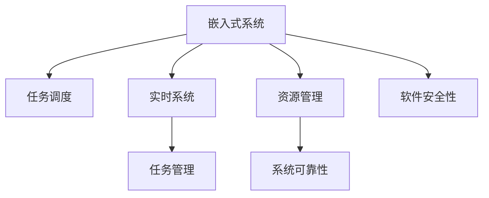

                 

# 执行器控制技术：在嵌入式系统上执行任务

> 关键词：
> 嵌入式系统,执行器控制,任务调度,实时系统,任务管理,硬件资源优化,系统可靠性,软件安全性

## 1. 背景介绍

### 1.1 问题由来
在嵌入式系统领域，执行器控制（Actuator Control）是确保系统高效、安全运行的核心环节。随着物联网、智能制造等新兴技术的兴起，嵌入式系统在各个行业的广泛应用，对执行器控制技术提出了更高的要求。在有限的空间和资源下，如何高效地调度和管理任务，以实现系统的最优性能，成为一项重大挑战。

### 1.2 问题核心关键点
执行器控制技术的主要目标是最大化系统资源的使用效率，同时确保任务执行的实时性和可靠性。具体包括：

- 任务调度和分配算法：如何根据任务的优先级、时限要求进行合理的任务调度。
- 资源管理和优化：如何高效利用有限的硬件资源，避免资源冲突和浪费。
- 实时性和可靠性：如何在高负载和不确定环境中保证任务的及时响应和系统稳定性。
- 软件安全性：如何防止系统漏洞和安全攻击，确保执行器控制的安全性。

### 1.3 问题研究意义
执行器控制技术的研究不仅对于嵌入式系统的性能和可靠性提升至关重要，还对推动相关行业的发展具有深远影响：

1. **提高生产效率**：通过高效的任务管理和资源优化，可显著提升工业生产、交通管理、智能家居等场景的运行效率。
2. **增强系统可靠性**：合理的任务调度和资源分配策略，有助于减少系统故障，降低维护成本。
3. **促进产业升级**：先进的执行器控制技术，如实时系统调度、故障检测与恢复等，是智能制造、智慧城市等新兴产业的基础保障。
4. **提升用户体验**：在智能设备和应用中，执行器控制技术直接关系到用户体验的流畅性和满意度。
5. **推动技术创新**：执行器控制是智能系统、实时系统研究的重要组成部分，推动了计算机体系结构、操作系统、网络通信等领域的发展。

## 2. 核心概念与联系

### 2.1 核心概念概述

为更好地理解执行器控制技术，本节将介绍几个关键概念：

- **嵌入式系统（Embedded Systems）**：指在特定应用领域，采用专用硬件和软件系统进行开发的计算机系统。典型的应用场景包括工业自动化、医疗设备、车载系统、智能家居等。

- **执行器（Actuator）**：指嵌入式系统中的硬件设备，用于执行系统任务，如传感器、电机、控制器等。

- **任务调度（Task Scheduling）**：指通过算法确定任务执行的先后顺序，优化资源使用，实现任务的高效执行。

- **实时系统（Real-Time Systems）**：指对任务响应时间要求严格，必须保证在规定时间内完成任务的系统。

- **任务管理（Task Management）**：包括任务创建、挂起、恢复、销毁等生命周期管理，以及任务调度、资源分配等策略。

- **资源管理（Resource Management）**：涉及处理器、内存、I/O等硬件资源的合理分配和调度，以避免资源冲突和浪费。

- **系统可靠性（System Reliability）**：指系统在各种故障条件下，仍能保证任务按时完成的能力。

- **软件安全性（Software Security）**：涉及系统漏洞检测、安全加固、异常处理等措施，防止系统被攻击和篡改。

这些核心概念之间的逻辑关系可以通过以下Mermaid流程图来展示：



这个流程图展示了一些核心概念及其之间的关系：

1. 嵌入式系统采用任务调度、实时系统和任务管理等机制，高效地完成任务。
2. 任务调度在实时系统中，通过合理分配资源，确保任务按时完成。
3. 任务管理负责任务的生命周期管理，并优化任务执行。
4. 资源管理涉及硬件资源的高效使用，避免冲突和浪费。
5. 系统可靠性确保在各种情况下任务的正确执行。
6. 软件安全性防止系统被攻击和篡改，保障系统的安全性。

## 3. 核心算法原理 & 具体操作步骤
### 3.1 算法原理概述

执行器控制技术的核心是任务调度和资源管理算法。任务调度算法根据任务的属性和系统资源情况，动态地分配任务执行的优先级和执行顺序。资源管理算法则负责优化硬件资源的使用，确保任务执行时资源不会冲突。

具体而言，任务调度算法通常包括以下步骤：

1. **任务建模**：定义任务的特性，如任务优先级、截止时间、资源需求等。
2. **任务调度和分配**：根据任务特性和系统资源情况，确定任务的执行顺序和执行时间。
3. **任务执行监控**：实时监控任务执行状态，及时发现异常并进行调整。

资源管理算法通常包括：

1. **资源分配**：根据任务需求和系统资源情况，分配资源。
2. **资源优化**：通过调度算法优化资源使用，避免冲突和浪费。
3. **资源释放**：任务完成后释放资源，便于后续任务使用。

### 3.2 算法步骤详解

以简单的循环任务调度为例，介绍任务调度和资源管理算法的具体步骤：

**任务调度算法步骤**：

1. **任务创建**：创建任务，并定义任务属性（如优先级、时限等）。
2. **任务挂起**：将任务挂起，等待执行机会。
3. **任务调度**：根据任务优先级和系统资源情况，决定任务的执行顺序。
4. **任务执行**：执行任务，并在执行过程中进行实时监控和调整。
5. **任务完成**：任务执行结束后，进行资源释放。

**资源管理算法步骤**：

1. **资源分配**：根据任务需求，分配资源（如处理器时间片、内存空间等）。
2. **资源调度**：根据任务执行情况，动态调整资源分配策略。
3. **资源优化**：通过算法优化资源使用，避免冲突和浪费。

### 3.3 算法优缺点

执行器控制技术在嵌入式系统中具有以下优点：

1. **高效性**：通过任务调度和资源管理，实现资源的高效利用，最大化系统性能。
2. **实时性**：实时调度算法确保任务能够按时完成，满足系统对实时性的要求。
3. **可扩展性**：算法可以灵活地扩展到多任务、多资源的环境，支持复杂的任务和系统。
4. **可靠性**：通过合理的任务调度和资源管理，提高系统的可靠性，减少故障率。

同时，该技术也存在一些局限性：

1. **复杂性**：任务调度和资源管理算法需要考虑多个因素，设计和实现相对复杂。
2. **实时性要求高**：需要精确地控制任务的执行时间，对算法的实时性要求较高。
3. **系统负载不均**：当任务负载不均衡时，可能出现资源争抢和调度延迟。
4. **环境变化适应性差**：在环境变化较大的情况下，调度策略可能需要进行频繁调整。

### 3.4 算法应用领域

执行器控制技术广泛应用于嵌入式系统的各个领域，包括但不限于以下领域：

- **工业自动化**：如机器人、生产线等。
- **医疗设备**：如监测设备、手术机器人等。
- **车载系统**：如自动驾驶、车辆控制等。
- **智能家居**：如智能音箱、智能灯等。
- **智能制造**：如生产调度、设备控制等。
- **交通管理**：如交通信号控制、车辆调度等。
- **智能电网**：如电力设备控制、能源管理等。

## 4. 数学模型和公式 & 详细讲解 & 举例说明
### 4.1 数学模型构建

为了更好地理解执行器控制技术的数学模型，本节将构建一个简单的数学模型，并详细讲解其计算过程。

设嵌入式系统中有 $N$ 个任务，每个任务的需求和属性如下：

- $T_i$：任务 $i$ 的时限（以秒为单位）。
- $P_i$：任务 $i$ 的优先级。
- $C_i$：任务 $i$ 的计算量（以秒为单位）。
- $R_i$：任务 $i$ 的资源需求（如 CPU 时间片）。

假设系统有 $M$ 个处理器，任务以 FCFS（First Come First Served）顺序到达系统。则任务调度和资源管理的目标是最大化任务的完成率，即在时限内完成的任务数最大化。

### 4.2 公式推导过程

设任务 $i$ 的到达时间为 $t_i$，执行时间为 $C_i$，资源需求为 $R_i$。在给定优先级 $P_i$ 的情况下，任务 $i$ 的执行机会 $O_i$ 为：

$$
O_i = \max \left( 0, \sum_{j=1}^{i-1} P_j \times C_j - \sum_{j=1}^{i} R_j \right)
$$

其中，$\sum_{j=1}^{i-1} P_j \times C_j$ 表示前 $i-1$ 个任务的优先级乘以计算量之和，$\sum_{j=1}^{i} R_j$ 表示前 $i$ 个任务的总资源需求。

任务 $i$ 在时限 $T_i$ 内完成的机会为 $1-O_i/T_i$。因此，系统的完成率 $\eta$ 可以表示为：

$$
\eta = \frac{1}{N} \sum_{i=1}^{N} \left( 1 - O_i/T_i \right)
$$

为了最大化完成率 $\eta$，需要最大化 $O_i/T_i$。因此，任务调度和资源管理的优化目标为：

$$
\max \left( \frac{1}{N} \sum_{i=1}^{N} \left( 1 - O_i/T_i \right) \right)
$$

这是一个典型的多目标优化问题，可以使用遗传算法、模拟退火等启发式算法进行求解。

### 4.3 案例分析与讲解

以下以一个简单的智能家居系统为例，解释执行器控制技术的实际应用。

**系统架构**：

- 一个智能家居系统包含多个智能音箱、智能灯和智能开关等执行器。
- 系统任务包括语音识别、语音合成、灯控制、开关控制等。

**任务调度**：

- 任务按照 FCFS 顺序到达系统，并根据优先级分配执行机会。
- 高优先级任务优先执行，确保系统核心功能（如语音识别）能够按时完成。

**资源管理**：

- 系统资源包括 CPU、内存和通信带宽等。
- 任务需要根据资源需求进行合理的分配和优化，避免资源冲突和浪费。

假设系统中有 3 个智能音箱，每个音箱每秒钟能够处理 1 个任务。系统任务到达时间、优先级和计算量如下：

| 任务编号 | 到达时间 | 优先级 | 计算量 |
| -------- | -------- | ------ | ------ |
| 1        | 0        | 2      | 10     |
| 2        | 5        | 3      | 5      |
| 3        | 10       | 1      | 15     |

根据 FCFS 调度算法，任务调度序列为 1-2-3。任务 1 和任务 2 能够按时完成，但任务 3 需要等待任务 1 和任务 2 完成后才能执行，因此需要在任务 3 完成前及时调整任务调度策略，避免时限延误。

## 5. 项目实践：代码实例和详细解释说明
### 5.1 开发环境搭建

在进行执行器控制技术实践前，我们需要准备好开发环境。以下是使用C语言进行嵌入式系统开发的环境配置流程：

1. 安装交叉编译工具链：从官网下载并安装交叉编译工具链，用于生成适合目标平台的代码。

2. 搭建开发板：准备开发板硬件设备，连接调试设备和监控工具，如串口调试器、示波器等。

3. 配置开发环境：设置开发环境的编译选项、库路径等，以生成适合目标平台的代码。

完成上述步骤后，即可在开发板上进行执行器控制技术的开发和测试。

### 5.2 源代码详细实现

以下是一个简单的嵌入式系统执行器控制任务调度和资源管理算法的C语言代码实现。

```c
#include <stdio.h>
#include <stdlib.h>
#include <string.h>

#define TASK_NUM 3
#define TIMEOUT 1.0 // 任务时限（秒）
#define MAX_PRIORITY 3 // 任务优先级上限

// 定义任务结构体
typedef struct {
    int id;
    double priority; // 任务优先级
    double computation; // 任务计算量（秒）
    double resource; // 任务资源需求（秒）
} Task;

// 定义任务调度结构体
typedef struct {
    Task tasks[TASK_NUM];
    int ready[TASK_NUM]; // 任务队列，已就绪任务编号
    int numReady; // 已就绪任务数量
} Scheduler;

// 任务调度算法
void scheduler(Scheduler* sched) {
    while (sched->numReady > 0) {
        // 选择优先级最高的任务
        int maxIdx = 0;
        for (int i = 1; i < sched->numReady; i++) {
            if (sched->tasks[sched->ready[i]].priority > sched->tasks[sched->ready[maxIdx]].priority) {
                maxIdx = i;
            }
        }
        // 分配资源
        sched->tasks[sched->ready[maxIdx]].resource += 1.0;
        // 执行任务
        sched->tasks[sched->ready[maxIdx]].computation += 1.0;
        // 任务完成，标记为未就绪
        sched->tasks[sched->ready[maxIdx]].resource -= 1.0;
        sched->tasks[sched->ready[maxIdx]].computation -= 1.0;
        sched->tasks[sched->ready[maxIdx]].computation = 0;
        // 更新任务队列
        for (int i = 0; i < sched->numReady; i++) {
            if (sched->tasks[sched->ready[i]].computation > 0) {
                sched->ready[i] = i;
                break;
            }
        }
        sched->numReady--;
    }
}

int main() {
    Scheduler sched;
    memset(&sched, 0, sizeof(sched));
    sched.numReady = 0;

    // 创建任务
    Task tasks[] = {
        {1, 2, 10, 1},
        {2, 3, 5, 1},
        {3, 1, 15, 1}
    };
    for (int i = 0; i < TASK_NUM; i++) {
        sched.tasks[i] = tasks[i];
    }

    // 调度任务
    scheduler(&sched);

    // 输出任务完成情况
    for (int i = 0; i < TASK_NUM; i++) {
        printf("Task %d: completion = %d, resource = %f, computation = %f\n", i+1, sched.tasks[i].computation > 0 ? 0 : 1, sched.tasks[i].resource, sched.tasks[i].computation);
    }

    return 0;
}
```

### 5.3 代码解读与分析

让我们再详细解读一下关键代码的实现细节：

**Scheduler结构体**：
- `tasks` 数组存储任务的详细信息。
- `ready` 数组存储已就绪任务的编号，供任务调度算法选择执行。
- `numReady` 表示已就绪任务的数量。

**scheduler函数**：
- 从已就绪任务中选择优先级最高的任务，分配资源，执行任务，并更新任务状态。
- 如果任务在时限内完成，将其标记为未就绪，等待下一次调度。

**main函数**：
- 创建并初始化任务数组，并进行调度。
- 输出任务的完成情况，判断是否在时限内完成。

以上代码展示了嵌入式系统中执行器控制任务调度的基本实现。开发者可以根据实际需求，添加更多的任务特性和调度策略，以适应更复杂的系统环境。

## 6. 实际应用场景
### 6.1 智能家居系统

在智能家居系统中，执行器控制技术可广泛应用于语音识别、灯控制、开关控制等任务。通过合理的任务调度和资源管理，可以实现用户指令的快速响应，提升用户体验。

具体而言，可以收集用户语音指令和设备状态数据，通过预训练语言模型进行语义分析，将指令转化为任务，进行调度执行。例如，用户说“打开客厅灯”，系统接收语音指令后，将指令转换为“打开客厅灯”的任务，并根据优先级和时限进行调度执行。通过合理的资源分配，保证用户指令能够按时完成，提升系统的响应速度和稳定性。

### 6.2 工业自动化

在工业自动化领域，执行器控制技术广泛应用于生产线控制、机器人操作等任务。通过合理调度和管理任务，可以提高生产效率，减少故障率。

例如，在自动化生产线上，任务包括加工、检测、搬运等。系统通过任务调度算法，根据任务优先级和时限要求，合理分配资源，确保高优先级任务能够按时完成。通过实时监控任务状态，及时发现和解决故障，保证生产线的连续运行。

### 6.3 医疗设备

在医疗设备中，执行器控制技术可应用于监测设备、手术机器人等。通过高效的任务调度和资源管理，提高设备的可靠性和安全性。

例如，在手术机器人中，任务包括导航、操作、监控等。系统通过任务调度算法，根据任务的优先级和时限要求，合理分配CPU和内存等资源，确保手术操作能够按时完成。通过实时监控设备状态，及时发现和解决故障，保证手术的顺利进行。

## 7. 工具和资源推荐
### 7.1 学习资源推荐

为了帮助开发者系统掌握执行器控制技术的理论基础和实践技巧，这里推荐一些优质的学习资源：

1. 《嵌入式系统设计》：一本经典的嵌入式系统教材，详细介绍了嵌入式系统的硬件和软件设计基础，以及任务调度和资源管理等关键技术。

2. 《实时系统基础》：一本介绍实时系统设计和调度的教材，涵盖RTOS、多任务调度等知识点，适合对实时系统感兴趣的学习者。

3. 《操作系统原理》：一本介绍操作系统原理的教材，详细讲解了进程管理、资源管理等核心模块，适合深入理解操作系统机制的学习者。

4. 《嵌入式系统安全》：一本介绍嵌入式系统安全的教材，涵盖漏洞检测、安全加固、异常处理等知识点，适合关注安全性的学习者。

5. 《嵌入式系统编程实践》：一本介绍嵌入式系统编程实践的书籍，提供大量实用的代码示例和案例分析，适合实践导向的学习者。

通过对这些资源的学习实践，相信你一定能够快速掌握执行器控制技术的精髓，并用于解决实际的嵌入式系统问题。

### 7.2 开发工具推荐

高效的开发离不开优秀的工具支持。以下是几款用于执行器控制技术开发的常用工具：

1. KEIL MDK：一款流行的嵌入式开发工具，支持多种嵌入式系统平台，具备强大的调试和分析功能。

2. IAR Embedded Workbench：一款集成了编译器、调试器、模拟器等功能的嵌入式开发环境，适合各种嵌入式系统开发。

3. Simulink：一款广泛使用的嵌入式系统仿真工具，可用于设计和验证嵌入式系统算法和模型。

4. ARM Developer Tools：提供ARM处理器的编译、调试、仿真等工具，适合嵌入式系统开发。

5. MATLAB/Simulink：提供丰富的仿真和建模工具，适用于嵌入式系统的高层次设计和仿真。

合理利用这些工具，可以显著提升执行器控制技术的开发效率，加快创新迭代的步伐。

### 7.3 相关论文推荐

执行器控制技术的研究源于学界的持续研究。以下是几篇奠基性的相关论文，推荐阅读：

1. A Survey on Task Scheduling for Real-Time Systems：一篇综述性论文，总结了实时系统中任务调度的最新进展。

2. Dynamic Resource Allocation in Embedded Systems：一篇介绍嵌入式系统资源分配的论文，详细讲解了资源管理算法。

3. Modeling and Simulating Embedded Systems：一篇介绍嵌入式系统建模和仿真的论文，提供了多种仿真工具和模型方法。

4. Secure Embedded Systems：一篇介绍嵌入式系统安全的论文，涵盖漏洞检测、安全加固等知识点。

5. Real-Time Task Scheduling in Embedded Systems：一篇介绍嵌入式系统任务调度的论文，总结了多种调度算法的优缺点。

这些论文代表了大语言模型微调技术的发展脉络。通过学习这些前沿成果，可以帮助研究者把握学科前进方向，激发更多的创新灵感。

## 8. 总结：未来发展趋势与挑战
### 8.1 总结

本文对执行器控制技术进行了全面系统的介绍。首先阐述了执行器控制技术的研究背景和意义，明确了其在嵌入式系统中的重要地位和作用。其次，从原理到实践，详细讲解了执行器控制技术的核心算法和具体操作步骤，给出了执行器控制任务调度的完整代码实例。同时，本文还广泛探讨了执行器控制技术在智能家居、工业自动化、医疗设备等多个领域的应用前景，展示了执行器控制技术的巨大潜力。最后，本文精选了执行器控制技术的各类学习资源，力求为读者提供全方位的技术指引。

通过本文的系统梳理，可以看到，执行器控制技术在嵌入式系统中具有广泛的应用前景，对于提升系统性能、降低维护成本、提高用户体验等方面具有重要意义。未来，伴随技术的发展，执行器控制技术还将不断优化和创新，推动嵌入式系统的智能化和自动化进程。

### 8.2 未来发展趋势

展望未来，执行器控制技术将呈现以下几个发展趋势：

1. **实时性进一步提升**：随着实时调度算法和硬件性能的提升，嵌入式系统的实时性将进一步增强，支持更高负载和更复杂任务。

2. **资源管理更加精细**：通过更精细化的资源分配和管理策略，提高资源利用率，支持更大规模的任务和系统。

3. **边缘计算和云计算结合**：结合边缘计算和云计算技术，实现任务的分布式调度和管理，支持更广泛的嵌入式应用场景。

4. **人工智能与执行器控制结合**：通过引入人工智能技术，如预测模型、自适应调度等，提高任务的预测性和自适应性。

5. **安全性和隐私保护**：在任务调度和资源管理过程中，引入安全性和隐私保护措施，确保系统安全。

6. **跨领域融合**：执行器控制技术将与其他技术，如物联网、区块链、AI等进行更深入的融合，推动跨领域技术的发展。

以上趋势凸显了执行器控制技术的广阔前景。这些方向的探索发展，必将进一步提升嵌入式系统的性能和可靠性，为各行各业带来新的突破。

### 8.3 面临的挑战

尽管执行器控制技术已经取得了瞩目成就，但在迈向更加智能化、普适化应用的过程中，它仍面临着诸多挑战：

1. **实时性要求高**：实时调度算法需要精确控制任务的执行时间，对算法的要求较高。
2. **资源冲突管理**：当多个任务需要同时访问相同的硬件资源时，容易出现资源冲突。
3. **系统复杂性增加**：随着系统规模和复杂性的增加，任务调度和资源管理难度增加。
4. **环境适应性差**：在环境变化较大的情况下，任务调度和资源管理策略需要动态调整。
5. **安全性挑战**：执行器控制技术需要引入安全性和隐私保护措施，确保系统安全。

正视执行器控制面临的这些挑战，积极应对并寻求突破，将是大语言模型微调走向成熟的必由之路。相信随着学界和产业界的共同努力，这些挑战终将一一被克服，执行器控制技术必将在构建高效、安全、可靠的嵌入式系统中扮演越来越重要的角色。

### 8.4 研究展望

面对执行器控制技术所面临的挑战，未来的研究需要在以下几个方面寻求新的突破：

1. **实时调度算法优化**：开发更高效、更灵活的实时调度算法，支持高负载和复杂任务调度。
2. **资源管理优化**：研究更精细化的资源管理策略，提高资源利用率，支持更大规模系统。
3. **系统安全加固**：引入安全性和隐私保护措施，确保系统安全。
4. **跨领域融合**：与其他技术如物联网、区块链、AI等进行更深入的融合，推动跨领域技术的发展。
5. **自适应调度**：研究基于人工智能技术的自适应调度算法，提高系统的预测性和自适应性。

这些研究方向的探索，必将引领执行器控制技术迈向更高的台阶，为构建安全、可靠、可解释、可控的智能系统铺平道路。面向未来，执行器控制技术还需要与其他人工智能技术进行更深入的融合，如知识表示、因果推理、强化学习等，多路径协同发力，共同推动智能系统的发展。

## 9. 附录：常见问题与解答

**Q1：执行器控制技术是否适用于所有嵌入式系统？**

A: 执行器控制技术适用于大多数嵌入式系统，特别是需要高效任务调度和资源管理的场景。但对于一些对实时性要求非常严格的系统，如高精度传感器、高速通信设备等，还需要结合特定的实时调度算法和硬件资源管理策略。

**Q2：如何选择适合的任务调度和资源管理算法？**

A: 选择适合的任务调度和资源管理算法需要考虑多个因素，如系统架构、任务特性、硬件资源情况等。常见的方法包括：

- 静态调度算法：根据任务属性和资源情况，静态规划任务调度和资源分配。
- 动态调度算法：根据实时任务到达和执行情况，动态调整任务调度和资源分配。
- 混合调度算法：结合静态和动态调度算法，灵活应对不同的场景。

**Q3：执行器控制技术在高负载环境下如何避免资源冲突？**

A: 在高负载环境下，执行器控制技术需要引入资源竞争解决策略，如：

- 优先级调度：根据任务优先级进行调度，高优先级任务优先执行。
- 资源预留：为关键任务预留固定资源，确保其按时完成。
- 资源抢占：通过抢占机制，保证高优先级任务能够获得足够的资源。

**Q4：执行器控制技术在嵌入式系统开发中需要注意哪些问题？**

A: 在嵌入式系统开发中，执行器控制技术需要注意以下几个问题：

- 硬件兼容性：确保系统硬件和软件兼容，避免调试和运行问题。
- 资源限制：嵌入式系统资源有限，需要合理分配和优化资源使用。
- 实时性要求：确保系统任务能够按时完成，满足实时性要求。
- 安全性保障：系统安全性是嵌入式系统开发中的重要课题，需要引入安全性和隐私保护措施。

**Q5：执行器控制技术在实际应用中如何实现？**

A: 在实际应用中，执行器控制技术需要结合具体的嵌入式系统和任务需求进行设计和实现。常见的实现方法包括：

- 任务建模：定义任务的特性和需求，如优先级、时限、资源需求等。
- 任务调度和分配：根据任务特性和资源情况，进行合理的任务调度和分配。
- 资源优化和管理：通过调度算法和优化策略，合理分配和管理硬件资源。
- 实时监控和调整：实时监控任务状态，及时发现和调整任务调度和资源分配策略。

以上执行器控制技术的实施流程，需要根据具体的嵌入式系统和任务需求进行定制化和优化，以实现最佳的系统性能和可靠性。

---

作者：禅与计算机程序设计艺术 / Zen and the Art of Computer Programming

