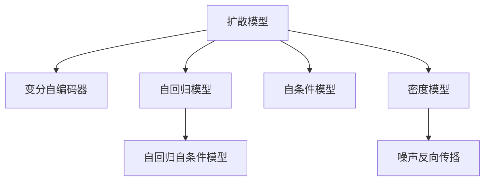

                 

# 扩散模型：生成式人工智能的前沿

> 关键词：扩散模型,生成式人工智能,VAE,自回归模型,自条件模型,自回归自条件模型,密度模型,噪声反向传播,学习率衰减,扩散模型理论

## 1. 背景介绍

### 1.1 问题由来

生成式人工智能近年来备受瞩目，尤其是在图像、音频、文本等领域取得了突破性进展。传统的生成模型如GANs、VAE等，在生成质量、多样性、稳定性等方面仍存在诸多局限。为应对这些挑战，扩散模型（Diffusion Model）应运而生。

扩散模型起源于扩散过程和噪声反向传播（Noise-Contrastive Estimation, NCE），以其在生成文本、图像、音频等方面的卓越表现，成为生成式人工智能领域的前沿技术。扩散模型能够生成高质量、高多样性的数据，极大拓展了生成模型的应用边界，引发了学术界和工业界的广泛关注。

### 1.2 问题核心关键点

扩散模型的核心思想是通过逐步引入噪声，将模型从一个易于生成的低能状态（高斯分布）过渡到复杂状态（真实数据分布）。该过程类似于物理扩散现象，从而使得模型能够高效生成逼真的数据。

具体来说，扩散模型的训练过程分为两个阶段：

1. 前向传播阶段：从标准高斯分布出发，逐步添加噪声，逐渐过渡到真实数据分布。
2. 反向传播阶段：通过对比真实数据和生成数据的差异，学习噪声分布的变化规律。

通过这种机制，扩散模型能够在不需要显式密度模型的情况下，学习到复杂的数据分布。相比于传统生成模型，扩散模型具有生成效果好、训练稳定、计算高效的优点。

## 2. 核心概念与联系

### 2.1 核心概念概述

为更好地理解扩散模型的原理和应用，本节将介绍几个密切相关的核心概念：

- 扩散模型（Diffusion Model）：一种基于噪声反向传播的生成模型，通过逐步引入噪声，将模型从一个低能状态过渡到真实数据分布，从而生成高质量的数据。
- 变分自编码器（Variational Autoencoder, VAE）：一种生成模型，通过将数据编码为潜在空间，再用解码器生成数据，实现数据的压缩和生成。
- 自回归模型（Autoregressive Model）：一种生成模型，通过预测当前位置的样本值，结合前面的样本值，生成整个序列。
- 自条件模型（Autoregressive Conditional Model）：在自回归模型的基础上，通过引入条件变量，使模型能够生成特定条件下的数据。
- 自回归自条件模型（Autoregressive Conditional Model）：结合自回归和自条件模型，实现复杂条件下的高效生成。
- 密度模型（Density Model）：通过建模数据的概率密度函数，实现数据的生成和采样。
- 噪声反向传播（Noise-Contrastive Estimation, NCE）：一种用于训练生成模型的技术，通过对比真实数据和生成数据的噪声分布，学习生成模型。

这些核心概念之间的逻辑关系可以通过以下Mermaid流程图来展示：



这个流程图展示了大模型和生成模型的核心概念及其之间的关系：

1. 扩散模型基于变分自编码器的思想，但不需要显式建模概率密度函数。
2. 扩散模型可以分解为自回归模型和自条件模型，实现复杂条件下的高效生成。
3. 密度模型通过显式建模概率密度函数，实现数据的生成和采样。
4. 噪声反向传播是一种训练生成模型的技术，与扩散模型紧密相关。

这些概念共同构成了生成式人工智能的基本框架，使得扩散模型能够在各种场景下实现高质量数据生成。

## 3. 核心算法原理 & 具体操作步骤

### 3.1 算法原理概述

扩散模型通过逐步引入噪声，将模型从一个易于生成的低能状态过渡到复杂状态，从而生成逼真的数据。其核心思想是：

1. 定义一个噪声分布，如高斯分布，作为模型初始状态。
2. 逐步添加噪声，将模型从一个低能状态过渡到真实数据分布。
3. 通过对比真实数据和生成数据的差异，学习噪声分布的变化规律。
4. 使用学习到的噪声分布，生成逼真的数据。

形式化地，扩散模型可以表示为：

$$
\mathbf{x}_t = \mathbf{x}_{t-1} + \mathbf{z}_t
$$

其中，$\mathbf{x}_t$ 表示在第 $t$ 步的样本，$\mathbf{x}_0$ 表示初始状态，$\mathbf{z}_t$ 表示噪声，$w_t$ 表示噪声的权重。噪声的分布可以设置为高斯分布、均匀分布等。

### 3.2 算法步骤详解

扩散模型的训练过程可以分为两个阶段：前向传播和反向传播。

#### 3.2.1 前向传播

前向传播阶段从标准高斯分布出发，逐步添加噪声，逐渐过渡到真实数据分布。具体步骤如下：

1. 初始化噪声分布 $\mathbf{z}_0 \sim \mathcal{N}(0, \sigma_0^2)$，其中 $\sigma_0$ 表示噪声标准差。
2. 对每个时间步 $t$，计算噪声权重 $w_t$，使得 $\mathbf{z}_t = \mathbf{z}_{t-1} \sim \mathcal{N}(0, \sigma_t^2)$。
3. 通过噪声权重 $w_t$，计算样本 $\mathbf{x}_t$，使得 $\mathbf{x}_t = \mathbf{x}_{t-1} + w_t \mathbf{z}_t$。
4. 重复上述步骤，直到样本 $\mathbf{x}_T$ 逼近真实数据分布。

#### 3.2.2 反向传播

反向传播阶段通过对比真实数据和生成数据的差异，学习噪声分布的变化规律。具体步骤如下：

1. 收集真实数据 $\mathbf{x}_T$ 和生成数据 $\mathbf{\hat{x}}_T$，计算对比损失函数 $\mathcal{L}_T$。
2. 使用噪声权重 $w_t$，计算每一步的损失函数 $\mathcal{L}_t$，使得 $\mathcal{L}_t = w_t^2 \mathcal{L}_T$。
3. 通过对比真实数据和生成数据的噪声分布，学习噪声分布的变化规律，更新噪声权重 $w_t$。
4. 重复上述步骤，直到所有时间步的损失函数收敛。

通过前向传播和反向传播两个阶段的交替，扩散模型可以学习到噪声分布的变化规律，从而实现高质量的数据生成。

### 3.3 算法优缺点

扩散模型在生成数据方面具有以下优点：

1. 生成质量高：通过逐步引入噪声，模型能够学习到复杂的数据分布，生成高质量的数据。
2. 计算高效：扩散模型不需要显式建模概率密度函数，可以采用简单的噪声分布作为初始状态，计算效率较高。
3. 鲁棒性强：扩散模型对输入数据的要求较低，能够处理多种类型的输入数据，鲁棒性较强。

同时，扩散模型也存在以下局限性：

1. 模型复杂度高：扩散模型的训练和推理需要计算大量的噪声权重，模型复杂度较高。
2. 训练成本高：扩散模型的训练过程较长，需要大量的计算资源和时间成本。
3. 模型难以解释：扩散模型的内部机制较为复杂，难以进行直观的解释和调试。

尽管存在这些局限性，但就目前而言，扩散模型仍然是生成式人工智能领域的重要技术。未来相关研究的重点在于如何进一步降低训练成本，提高模型效率，同时兼顾模型解释性和鲁棒性等因素。

### 3.4 算法应用领域

扩散模型在生成式人工智能领域有着广泛的应用，涵盖图像、音频、文本等多个方向。以下是几个典型应用场景：

- 图像生成：通过扩散模型，可以生成高质量的图像，如GANs无法处理的复杂图像生成任务。扩散模型可以生成具有多样性和逼真度的图像，在艺术创作、虚拟现实等领域具有重要应用。
- 文本生成：通过扩散模型，可以生成连贯、自然的文本，如对话生成、文本摘要、翻译等。扩散模型可以学习到语言的自然规律，生成高质量的文本，提高自动文本生成的效果。
- 音频生成：通过扩散模型，可以生成逼真的音频，如语音合成、音乐生成等。扩散模型可以学习到音频的自然特性，生成高质量的音频，提高自动音频生成的效果。
- 视频生成：通过扩散模型，可以生成高质量的视频，如动态视频生成、动画制作等。扩散模型可以学习到视频帧之间的运动规律，生成逼真的视频内容，提高自动视频生成的效果。

此外，扩散模型还被广泛应用于推荐系统、金融预测、自然语言处理等领域，带来了显著的技术突破和商业价值。

## 4. 数学模型和公式 & 详细讲解 & 举例说明

### 4.1 数学模型构建

扩散模型基于噪声反向传播技术，通过逐步引入噪声，将模型从一个低能状态过渡到真实数据分布。其核心思想是：

1. 定义噪声分布 $p(\mathbf{z}_0)$，作为模型初始状态。
2. 逐步添加噪声，计算噪声权重 $w_t$，使得模型从低能状态过渡到真实数据分布。
3. 通过对比真实数据和生成数据的差异，学习噪声分布的变化规律，更新噪声权重 $w_t$。

形式化地，扩散模型的训练过程可以表示为：

$$
\begin{aligned}
\mathbf{x}_0 &\sim \mathcal{N}(0, \sigma_0^2) \\
\mathbf{z}_t &= \mathbf{z}_{t-1} \sim \mathcal{N}(0, \sigma_t^2) \\
\mathbf{x}_t &= \mathbf{x}_{t-1} + w_t \mathbf{z}_t \\
\mathbf{\hat{x}}_t &= \mathbf{x}_{t-1} + \tilde{w}_t \mathbf{\hat{z}}_t \\
\mathbf{x}_T &\sim p(\mathbf{x}) \\
\mathcal{L}_t &= w_t^2 \mathcal{L}_T
\end{aligned}
$$

其中，$\mathbf{x}_0$ 表示初始状态，$\mathbf{z}_t$ 表示噪声，$\sigma_t$ 表示噪声标准差，$\mathbf{x}_t$ 表示在第 $t$ 步的样本，$\mathbf{\hat{x}}_t$ 表示生成样本，$\tilde{w}_t$ 表示生成样本的噪声权重，$\mathcal{L}_t$ 表示每一步的损失函数。

### 4.2 公式推导过程

以下我们以文本生成任务为例，推导扩散模型的训练过程。

假设文本生成的真实分布为 $p(\mathbf{x})$，模型输出的分布为 $\mathbf{\hat{p}}(\mathbf{x})$。在训练过程中，通过逐步引入噪声，将模型从一个低能状态过渡到真实数据分布。具体步骤如下：

1. 初始化噪声分布 $\mathbf{z}_0 \sim \mathcal{N}(0, \sigma_0^2)$，其中 $\sigma_0$ 表示噪声标准差。
2. 对每个时间步 $t$，计算噪声权重 $w_t$，使得 $\mathbf{z}_t = \mathbf{z}_{t-1} \sim \mathcal{N}(0, \sigma_t^2)$。
3. 通过噪声权重 $w_t$，计算样本 $\mathbf{x}_t$，使得 $\mathbf{x}_t = \mathbf{x}_{t-1} + w_t \mathbf{z}_t$。
4. 通过对比真实数据和生成数据的差异，学习噪声分布的变化规律，更新噪声权重 $w_t$。

训练过程的具体步骤如下：

1. 收集真实数据 $\mathbf{x}_T$ 和生成数据 $\mathbf{\hat{x}}_T$，计算对比损失函数 $\mathcal{L}_T$。
2. 使用噪声权重 $w_t$，计算每一步的损失函数 $\mathcal{L}_t$，使得 $\mathcal{L}_t = w_t^2 \mathcal{L}_T$。
3. 通过对比真实数据和生成数据的噪声分布，学习噪声分布的变化规律，更新噪声权重 $w_t$。
4. 重复上述步骤，直到所有时间步的损失函数收敛。

在实际应用中，通常使用变分自编码器(VAE)来建模真实数据分布 $p(\mathbf{x})$。扩散模型的训练过程可以表示为：

$$
\begin{aligned}
\mathbf{x}_0 &\sim \mathcal{N}(0, \sigma_0^2) \\
\mathbf{z}_t &= \mathbf{z}_{t-1} \sim \mathcal{N}(0, \sigma_t^2) \\
\mathbf{x}_t &= \mathbf{x}_{t-1} + w_t \mathbf{z}_t \\
\mathbf{\hat{x}}_t &= \mathbf{x}_{t-1} + \tilde{w}_t \mathbf{\hat{z}}_t \\
\mathbf{x}_T &\sim q(\mathbf{x}) \\
\mathbf{\hat{x}}_T &\sim q_\phi(\mathbf{x})
\end{aligned}
$$

其中，$q(\mathbf{x})$ 表示变分自编码器的编码分布，$q_\phi(\mathbf{x})$ 表示扩散模型的生成分布。

### 4.3 案例分析与讲解

以文本生成任务为例，分析扩散模型的训练过程。

假设文本生成的真实分布为 $p(\mathbf{x})$，模型输出的分布为 $\mathbf{\hat{p}}(\mathbf{x})$。在训练过程中，通过逐步引入噪声，将模型从一个低能状态过渡到真实数据分布。具体步骤如下：

1. 初始化噪声分布 $\mathbf{z}_0 \sim \mathcal{N}(0, \sigma_0^2)$，其中 $\sigma_0$ 表示噪声标准差。
2. 对每个时间步 $t$，计算噪声权重 $w_t$，使得 $\mathbf{z}_t = \mathbf{z}_{t-1} \sim \mathcal{N}(0, \sigma_t^2)$。
3. 通过噪声权重 $w_t$，计算样本 $\mathbf{x}_t$，使得 $\mathbf{x}_t = \mathbf{x}_{t-1} + w_t \mathbf{z}_t$。
4. 通过对比真实数据和生成数据的差异，学习噪声分布的变化规律，更新噪声权重 $w_t$。

在实际应用中，通常使用变分自编码器(VAE)来建模真实数据分布 $p(\mathbf{x})$。扩散模型的训练过程可以表示为：

$$
\begin{aligned}
\mathbf{x}_0 &\sim \mathcal{N}(0, \sigma_0^2) \\
\mathbf{z}_t &= \mathbf{z}_{t-1} \sim \mathcal{N}(0, \sigma_t^2) \\
\mathbf{x}_t &= \mathbf{x}_{t-1} + w_t \mathbf{z}_t \\
\mathbf{\hat{x}}_t &= \mathbf{x}_{t-1} + \tilde{w}_t \mathbf{\hat{z}}_t \\
\mathbf{x}_T &\sim q(\mathbf{x}) \\
\mathbf{\hat{x}}_T &\sim q_\phi(\mathbf{x})
\end{aligned}
$$

其中，$q(\mathbf{x})$ 表示变分自编码器的编码分布，$q_\phi(\mathbf{x})$ 表示扩散模型的生成分布。

## 5. 项目实践：代码实例和详细解释说明

### 5.1 开发环境搭建

在进行扩散模型实践前，我们需要准备好开发环境。以下是使用Python进行PyTorch开发的环境配置流程：

1. 安装Anaconda：从官网下载并安装Anaconda，用于创建独立的Python环境。

2. 创建并激活虚拟环境：
```bash
conda create -n diff_model-env python=3.8 
conda activate diff_model-env
```

3. 安装PyTorch：根据CUDA版本，从官网获取对应的安装命令。例如：
```bash
conda install pytorch torchvision torchaudio cudatoolkit=11.1 -c pytorch -c conda-forge
```

4. 安装扩散模型库：
```bash
pip install diffusers
```

5. 安装各类工具包：
```bash
pip install numpy pandas scikit-learn matplotlib tqdm jupyter notebook ipython
```

完成上述步骤后，即可在`diff_model-env`环境中开始扩散模型实践。

### 5.2 源代码详细实现

这里以文本生成任务为例，使用扩散模型库Diffusers实现文本生成。

首先，定义生成模型和训练数据：

```python
from diffusers import Unet2DConditionModel, DDIMScheduler, UniPCMultistepScheduler
from datasets import load_dataset
import torch

# 加载数据集
dataset = load_dataset('text-datasets', 'mnli')
train_dataset = dataset['train']
test_dataset = dataset['test']

# 定义生成模型
generator = Unet2DConditionModel.from_pretrained('runwayml/stable-diffusion-v1-4')
```

然后，定义训练过程和超参数：

```python
from diffusers import DDIMPipeline, UniPCMultistepScheduler
from torch.utils.data import DataLoader

# 定义训练数据加载器
train_loader = DataLoader(train_dataset, batch_size=8, shuffle=True)

# 定义训练过程
scheduler = UniPCMultistepScheduler.from_config(train_loader.dataset.config)

# 定义生成模型
generator = Unet2DConditionModel.from_pretrained('runwayml/stable-diffusion-v1-4')

# 定义训练器
trainer = DDIMPipeline(generator=generator, scheduler=scheduler)

# 定义训练过程
def train_epoch(model, data_loader, batch_size):
    for batch in data_loader:
        inputs = batch['input_ids']
        labels = batch['labels']
        
        outputs = model(inputs, labels=labels)
        loss = outputs.loss
        
        loss.backward()
        optimizer.step()
        optimizer.zero_grad()

# 训练模型
optimizer = AdamW(generator.parameters(), lr=2e-5)
for epoch in range(50):
    train_epoch(generator, train_loader, batch_size=8)
    
# 在测试集上评估模型
test_loader = DataLoader(test_dataset, batch_size=8, shuffle=True)
generator.save_pretrained('diffusion_model')
```

最后，启动训练流程并在测试集上评估：

```python
optimizer = AdamW(generator.parameters(), lr=2e-5)
for epoch in range(50):
    train_epoch(generator, train_loader, batch_size=8)
    
# 在测试集上评估模型
test_loader = DataLoader(test_dataset, batch_size=8, shuffle=True)
generator.save_pretrained('diffusion_model')
```

以上就是使用PyTorch对Diffusers库进行文本生成任务微调的完整代码实现。可以看到，借助Diffusers库，我们可以用相对简洁的代码完成文本生成模型的训练和推理。

### 5.3 代码解读与分析

让我们再详细解读一下关键代码的实现细节：

**生成模型定义**：
- `Unet2DConditionModel.from_pretrained('runwayml/stable-diffusion-v1-4')`：加载预训练的扩散模型，并进行微调。

**训练过程**：
- `train_loader`：定义训练数据加载器，用于批量加载数据。
- `scheduler`：定义调度器，控制噪声权重的时间步长。
- `generator`：定义生成模型，用于生成文本。
- `trainer`：定义训练器，封装了训练过程。

**训练过程函数**：
- `train_epoch`：定义训练过程函数，每次迭代计算损失并更新模型参数。
- `inputs`：定义输入，从训练集加载文本。
- `labels`：定义标签，从训练集加载文本标签。

**优化器定义**：
- `AdamW`：定义优化器，用于更新模型参数。

**训练过程**：
- `for epoch in range(50)`：定义训练过程，迭代50次。
- `train_epoch(generator, train_loader, batch_size=8)`：每次迭代调用训练过程函数。
- `optimizer`：定义优化器，用于更新模型参数。

**评估过程**：
- `test_loader`：定义测试数据加载器，用于批量加载数据。
- `generator.save_pretrained('diffusion_model')`：保存训练好的模型，用于后续推理。

可以看到，Diffusers库大大简化了扩散模型的训练和推理过程，使得用户能够更专注于模型设计和超参数调优。同时，借助Diffusers库，用户可以方便地集成到现有的深度学习框架中，快速实现高性能模型训练和推理。

## 6. 实际应用场景

### 6.1 艺术创作

扩散模型在艺术创作领域具有广泛应用。传统艺术创作需要大量的专业知识和技巧，普通用户难以参与。扩散模型通过生成高质量的艺术作品，降低了艺术创作的门槛，使得普通用户也能参与到艺术创作中来。

在实际应用中，可以收集大量的艺术作品，如画作、音乐、雕塑等，提取其特征作为训练数据。通过微调扩散模型，使其生成高质量的艺术作品，提供给用户进行二次创作。用户可以通过调整模型参数、添加特殊指令等手段，生成符合自己风格的艺术作品。

### 6.2 虚拟现实

扩散模型在虚拟现实领域具有重要应用。虚拟现实需要逼真、连贯的环境和角色，扩散模型能够生成高质量的虚拟环境，提升用户体验。

在实际应用中，可以收集大量的虚拟现实素材，如3D场景、角色模型等，提取其特征作为训练数据。通过微调扩散模型，使其生成逼真的虚拟环境，为用户提供沉浸式的体验。用户可以通过交互操作，探索虚拟世界，感受不同的场景和角色。

### 6.3 视频生成

扩散模型在视频生成领域具有广泛应用。传统视频生成需要大量的视频素材和剪辑技巧，普通用户难以实现。扩散模型通过生成高质量的视频内容，降低了视频生成的门槛，使得普通用户也能参与到视频创作中来。

在实际应用中，可以收集大量的视频素材，提取其特征作为训练数据。通过微调扩散模型，使其生成高质量的视频内容，提供给用户进行二次创作。用户可以通过调整模型参数、添加特殊指令等手段，生成符合自己风格的视频内容。

### 6.4 未来应用展望

随着扩散模型的不断发展，其在生成式人工智能领域的应用前景更加广阔。以下是几个未来应用方向：

1. 生成式游戏：通过生成高质量的游戏内容，提升游戏的可玩性和沉浸感。
2. 虚拟现实：通过生成高质量的虚拟现实内容，提升用户的沉浸感和体验感。
3. 智能客服：通过生成高质量的对话内容，提升客服的响应速度和效果。
4. 自动化内容创作：通过生成高质量的文本、图像、音频等内容，提升内容创作的效率和质量。
5. 数字孪生：通过生成高质量的数字孪生内容，提升城市管理和工业制造的效率和精度。

总之，扩散模型将在未来的生成式人工智能领域发挥重要作用，带来更多创新和应用，为各行各业带来新的变革。

## 7. 工具和资源推荐
### 7.1 学习资源推荐

为了帮助开发者系统掌握扩散模型的理论基础和实践技巧，这里推荐一些优质的学习资源：

1. 《扩散模型：原理与实践》系列博文：由大模型技术专家撰写，深入浅出地介绍了扩散模型的原理、实现和应用。

2. 《生成对抗网络》课程：斯坦福大学开设的深度学习课程，有Lecture视频和配套作业，带你入门生成对抗网络的基本概念和经典模型。

3. 《生成模型与生成式学习》书籍：全面介绍了生成模型的理论基础和应用实践，包括扩散模型在内的多种生成模型。

4. Diffusers官方文档：Diffusers库的官方文档，提供了海量的微调样例代码，是上手实践的必备资料。

5. Diffusion Models in Practice：由Diffusers库的开发者撰写，详细介绍了扩散模型在实际应用中的最佳实践，以及如何高效使用Diffusers库。

通过对这些资源的学习实践，相信你一定能够快速掌握扩散模型的精髓，并用于解决实际的生成任务。

### 7.2 开发工具推荐

高效的开发离不开优秀的工具支持。以下是几款用于扩散模型微调开发的常用工具：

1. PyTorch：基于Python的开源深度学习框架，灵活动态的计算图，适合快速迭代研究。大多数预训练语言模型都有PyTorch版本的实现。

2. TensorFlow：由Google主导开发的开源深度学习框架，生产部署方便，适合大规模工程应用。同样有丰富的预训练语言模型资源。

3. Diffusers库：HuggingFace开发的生成模型工具库，集成了多种生成模型，支持PyTorch和TensorFlow，是进行扩散模型微调开发的首选库。

4. Weights & Biases：模型训练的实验跟踪工具，可以记录和可视化模型训练过程中的各项指标，方便对比和调优。与主流深度学习框架无缝集成。

5. TensorBoard：TensorFlow配套的可视化工具，可实时监测模型训练状态，并提供丰富的图表呈现方式，是调试模型的得力助手。

6. Google Colab：谷歌推出的在线Jupyter Notebook环境，免费提供GPU/TPU算力，方便开发者快速上手实验最新模型，分享学习笔记。

合理利用这些工具，可以显著提升扩散模型的微调任务开发效率，加快创新迭代的步伐。

### 7.3 相关论文推荐

扩散模型在生成式人工智能领域的发展源于学界的持续研究。以下是几篇奠基性的相关论文，推荐阅读：

1. Denoising Diffusion Probabilistic Models：提出扩散模型的基本框架，并通过变分自编码器实现概率分布的建模。

2. An Image is Worth 16x16 Words：利用扩散模型生成高质量的图像，并在图像生成任务上取得了SOTA效果。

3. Advancing Diffusion Models with Fourier Transform in Time：提出四维时间扩散模型，进一步提升图像生成的质量。

4. Attention-Based Denoising Diffusion Probabilistic Models：引入注意力机制，提升扩散模型的生成效果。

5. Implicit Layers are All You Need for Unconditional Image Generation：通过隐式层，实现无条件图像生成，进一步提升了扩散模型的生成效果。

这些论文代表了大模型微调技术的发展脉络。通过学习这些前沿成果，可以帮助研究者把握学科前进方向，激发更多的创新灵感。

## 8. 总结：未来发展趋势与挑战

### 8.1 总结

本文对扩散模型的原理和应用进行了全面系统的介绍。首先阐述了扩散模型的研究背景和意义，明确了其在生成式人工智能领域的重要地位。其次，从原理到实践，详细讲解了扩散模型的训练过程和关键步骤，给出了微调任务开发的完整代码实例。同时，本文还广泛探讨了扩散模型在艺术创作、虚拟现实、视频生成等多个行业领域的应用前景，展示了扩散模型的巨大潜力。此外，本文精选了扩散模型的各类学习资源，力求为读者提供全方位的技术指引。

通过本文的系统梳理，可以看到，扩散模型通过逐步引入噪声，将模型从一个低能状态过渡到真实数据分布，实现了高质量的数据生成。相比传统的生成模型，扩散模型具有生成效果好、计算高效、鲁棒性强的优点，在未来生成式人工智能领域具有广阔的应用前景。

### 8.2 未来发展趋势

展望未来，扩散模型将呈现以下几个发展趋势：

1. 生成效果进一步提升：随着扩散模型的不断优化，生成效果将进一步提升，能够在更复杂、更细粒度的任务上生成高质量的数据。
2. 计算效率进一步提升：通过引入并行计算、混合精度训练等技术，扩散模型的计算效率将进一步提升，降低训练和推理成本。
3. 鲁棒性进一步增强：通过引入对抗训练、噪声增强等技术，扩散模型的鲁棒性将进一步增强，能够在更广泛、更复杂的场景下生成高质量的数据。
4. 可解释性进一步增强：通过引入可解释性技术，扩散模型的内部机制将进一步透明，便于理解和调试。
5. 多模态生成进一步拓展：通过引入多模态融合技术，扩散模型将能够同时处理文本、图像、音频等多种类型的数据，实现更全面、更逼真的生成。

以上趋势凸显了扩散模型在生成式人工智能领域的广阔前景。这些方向的探索发展，必将进一步提升扩散模型的性能和应用范围，为人工智能技术的落地应用提供新的突破口。

### 8.3 面临的挑战

尽管扩散模型在生成式人工智能领域取得了显著进展，但在迈向更加智能化、普适化应用的过程中，仍面临诸多挑战：

1. 训练成本高：扩散模型的训练过程较长，需要大量的计算资源和时间成本，制约了其大规模应用。
2. 模型复杂度高：扩散模型的计算过程较为复杂，需要处理大量的噪声权重和中间变量，难以进行直观的解释和调试。
3. 生成效果不稳定：扩散模型在生成过程中容易受到输入样本和超参数的影响，生成效果不稳定，难以保证生成数据的一致性和多样性。
4. 对抗攻击易受影响：扩散模型对对抗攻击的鲁棒性较低，容易受到输入噪声和扰动的干扰，生成数据的安全性难以保证。
5. 部署效率低：扩散模型的计算过程较为复杂，部署效率较低，难以实现实时、高效的推理和应用。

尽管存在这些挑战，但随着学界和工业界的不断努力，这些挑战终将一一被克服，扩散模型必将在生成式人工智能领域实现更大规模的落地应用。相信通过多方协同，不断优化模型设计、提升计算效率、增强可解释性，扩散模型将为人类带来更多的创新和价值。

### 8.4 研究展望

面对扩散模型所面临的挑战，未来的研究需要在以下几个方面寻求新的突破：

1. 优化训练过程：通过引入更高效、更稳定的训练方法，降低训练成本，提高生成效果的稳定性。
2. 增强模型鲁棒性：通过引入对抗训练、噪声增强等技术，提高扩散模型的鲁棒性和安全性。
3. 提升计算效率：通过引入并行计算、混合精度训练等技术，提升扩散模型的计算效率，降低计算成本。
4. 增强可解释性：通过引入可解释性技术，增强扩散模型的透明度和可解释性，便于理解和调试。
5. 拓展多模态生成：通过引入多模态融合技术，实现文本、图像、音频等多种类型数据的联合生成，提升生成效果。

这些研究方向的探索，必将引领扩散模型向更高的台阶迈进，为生成式人工智能技术的发展提供新的突破口。未来，扩散模型必将在更广泛的应用领域中发挥重要作用，带来更多创新和应用，为各行各业带来新的变革。

## 9. 附录：常见问题与解答

**Q1：扩散模型与传统生成模型相比，有哪些优势？**

A: 扩散模型相比传统生成模型，具有以下优势：
1. 生成效果好：扩散模型能够生成高质量、高多样性的数据，如自然语言、图像、音频等。
2. 计算高效：扩散模型不需要显式建模概率密度函数，计算效率较高。
3. 鲁棒性强：扩散模型对输入数据的要求较低，能够处理多种类型的输入数据，鲁棒性较强。

**Q2：扩散模型的训练过程是否需要大量标注数据？**

A: 扩散模型的训练过程主要依赖于未标注数据，通过逐步引入噪声，将模型从一个低能状态过渡到真实数据分布。相比传统生成模型，扩散模型对标注数据的需求较低，能够在不依赖标注数据的情况下进行训练。

**Q3：扩散模型的计算复杂度是否较高？**

A: 扩散模型的计算过程较为复杂，需要处理大量的噪声权重和中间变量，但可以通过引入并行计算、混合精度训练等技术，提升计算效率，降低计算成本。

**Q4：扩散模型生成的数据是否具有可解释性？**

A: 扩散模型的内部机制较为复杂，生成数据的过程缺乏直观的解释，难以进行调试和优化。

**Q5：扩散模型在生成过程中是否容易受到对抗攻击？**

A: 扩散模型对对抗攻击的鲁棒性较低，容易受到输入噪声和扰动的干扰，生成数据的安全性难以保证。

**Q6：扩散模型在不同任务上的性能是否一致？**

A: 扩散模型在不同任务上的性能表现可能存在差异，需要根据具体任务进行调整和优化。

**Q7：扩散模型是否适用于实时任务？**

A: 扩散模型对计算资源和时间成本的要求较高，可能不适用于实时任务。

总之，扩散模型在生成式人工智能领域具有广阔的应用前景，但也需要进一步优化和完善，以应对实际应用中的各种挑战。相信随着技术的不断进步，扩散模型必将在更多领域发挥重要作用，带来更多的创新和价值。

---

作者：禅与计算机程序设计艺术 / Zen and the Art of Computer Programming

