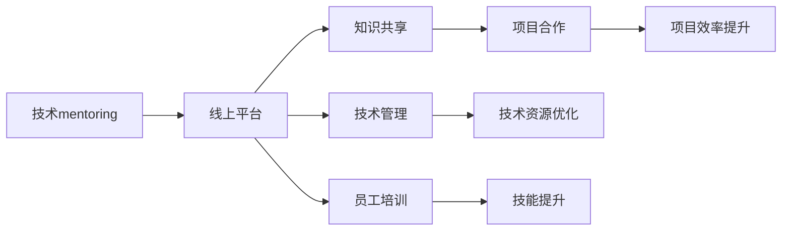

                 

# 技术mentoring：线上 的平台搭建与运营

> 关键词：技术mentoring, 在线平台, 技术管理, 员工培训, 知识共享, 项目管理

## 1. 背景介绍

随着互联网技术的普及和远程办公模式的兴起，企业对于线上技术交流和知识共享的需求日益增强。技术mentoring作为一种有效的知识传递和人才培养手段，在企业内部和外部都得到了广泛应用。本文将从技术mentoring平台的角度出发，探讨其线上平台搭建与运营的策略和方法，帮助企业构建一个高效、互动、可持续的技术交流生态。

## 2. 核心概念与联系

### 2.1 核心概念概述

- **技术mentoring**：指通过经验丰富的导师对技术新人或项目成员进行指导和支持，帮助其掌握新技能、解决技术问题，提高工作绩效和职业发展水平。
- **线上平台**：指利用互联网技术，构建一个虚拟的技术交流环境，实现实时或异步的技术交流和学习。
- **技术管理**：指通过管理和优化技术资源，提升技术团队的整体效能和产出质量。
- **员工培训**：指对企业员工进行系统化、持续化的专业技能培训，提升其综合能力。
- **知识共享**：指通过线上平台，促进技术知识、经验、工具的交流和分享，形成知识库和经验库。
- **项目管理**：指通过线上平台，对项目进行高效、透明的跟踪和协作，提升项目成功率和效率。

这些概念之间存在紧密联系。技术mentoring是知识共享的驱动者，而线上平台则是知识共享的载体；员工培训和技术管理则通过技术mentoring平台实现，从而提升整体技术团队的水平和项目管理能力。

### 2.2 核心概念原理和架构的 Mermaid 流程图(Mermaid 流程节点中不要有括号、逗号等特殊字符)



## 3. 核心算法原理 & 具体操作步骤

### 3.1 算法原理概述

技术mentoring线上平台的核心算法原理包括以下几个方面：

- **匹配算法**：通过分析导师和学员的技能、经验、兴趣等特征，构建导师和学员之间的匹配矩阵，实现最佳匹配。
- **知识图谱构建**：利用知识图谱技术，构建线上平台的知识库，方便用户快速获取所需知识。
- **学习路径规划**：根据学员的学习需求，规划最优的学习路径，推荐适合的学习资源和导师。
- **交流互动机制**：通过构建异步和实时交流互动机制，促进导师与学员之间的深入交流和互动。

### 3.2 算法步骤详解

1. **需求调研与分析**：
   - 通过问卷调查、访谈等方式，收集企业内部对技术交流和知识共享的需求，明确技术mentoring平台的目标和功能需求。

2. **平台设计与规划**：
   - 根据需求分析结果，设计平台的功能模块，包括匹配模块、知识库、学习路径规划模块、交流互动模块等。
   - 选择合适的技术栈和架构方案，确保平台的稳定性和可扩展性。

3. **平台开发与实现**：
   - 开发平台的前端和后端系统，包括用户注册登录、导师学员匹配、知识库构建、学习路径规划等功能。
   - 实现交流互动机制，如聊天室、论坛、视频会议等，促进导师与学员之间的实时互动。

4. **测试与优化**：
   - 进行平台功能测试和性能测试，确保平台的稳定性和可用性。
   - 根据测试反馈，持续优化平台功能和用户体验，提升平台的吸引力和使用率。

5. **上线与运营**：
   - 发布平台，开展技术mentoring活动，吸引导师和学员参与。
   - 定期收集用户反馈，优化平台功能和运营策略，保持平台的活力和竞争力。

### 3.3 算法优缺点

#### 优点：

- **高效的知识传播**：通过线上平台，导师和学员可以随时随地进行交流，大大提高了知识传播的效率。
- **灵活的学习路径**：学员可以根据自己的需求和进度，自主选择学习资源和导师，制定个性化学习路径。
- **广泛的资源共享**：平台上汇集了企业内部的技术资源和知识库，可供所有成员共享。
- **持续的培训与提升**：通过持续的技术交流和知识共享，员工的技能水平和团队的整体效能可以得到持续提升。

#### 缺点：

- **沟通质量依赖技术**：线上平台的交流互动效果依赖于互联网的稳定性和技术实现的质量，一旦出现网络故障或平台故障，将影响交流效果。
- **互动深度有限**：相比面对面交流，线上交流的互动深度可能有所欠缺，难以进行深层次的技术讨论和经验分享。
- **隐私与安全问题**：平台涉及大量的敏感信息和数据，需要采取严格的安全措施，防止数据泄露和隐私侵害。

### 3.4 算法应用领域

技术mentoring线上平台适用于多个领域，包括但不限于：

- **企业内部技术交流**：在企业内部，技术mentoring平台可以作为员工技能提升和经验分享的重要工具，提升整体技术团队的水平。
- **外部技术社区**：通过开放平台，吸引外部技术专家和企业参与，形成更大范围的技术交流生态。
- **项目合作与创新**：通过线上平台，促进跨部门、跨企业的项目合作和技术创新，实现资源共享和协同效应。

## 4. 数学模型和公式 & 详细讲解 & 举例说明

### 4.1 数学模型构建

本节将通过数学模型来描述技术mentoring平台的核心算法，包括匹配算法、知识图谱构建和学习路径规划等。

- **匹配算法**：假设导师集合为 $I$，学员集合为 $L$，设导师 $i$ 和学员 $j$ 之间的匹配度为 $m_{i,j}$，构建匹配矩阵 $M$。

$$
M = \begin{bmatrix}
m_{1,1} & m_{1,2} & \cdots & m_{1,N} \\
m_{2,1} & m_{2,2} & \cdots & m_{2,N} \\
\vdots & \vdots & \ddots & \vdots \\
m_{M,1} & m_{M,2} & \cdots & m_{M,N}
\end{bmatrix}
$$

其中 $N$ 为学员数量。

- **知识图谱构建**：设知识库中的知识节点为 $K$，每个节点 $k$ 的深度为 $d_k$，构建知识图谱 $G=(V,E)$。

$$
G = \left(V, \left\{(k_1, k_2) \in K \times K \mid k_1 \text{ 与 } k_2 \text{ 相关}\right\}\right)
$$

- **学习路径规划**：设学员 $j$ 的目标技能为 $S_j$，推荐的学习资源为 $R_j$，构建学习路径图 $L$。

$$
L = \left(\{(j, s)\}, \left\{(j, r) \mid r \in R_j, s \in S_j\right\}\right)
$$

### 4.2 公式推导过程

- **匹配算法推导**：

$$
m_{i,j} = f(s_i, c_j)
$$

其中 $s_i$ 和 $c_j$ 分别为导师和学员的技能、经验、兴趣等特征向量。$f$ 为匹配函数，可以采用统计方法或机器学习方法进行计算。

- **知识图谱构建推导**：

$$
d_k = \sum_{o \in O_k} w_o
$$

其中 $O_k$ 为节点 $k$ 的相关节点集合，$w_o$ 为相关节点的权重。

- **学习路径规划推导**：

$$
\text{Path}_j = \text{Minimize} \sum_{(j, s) \in L} w_s
$$

其中 $w_s$ 为学习资源 $r$ 的权重。

### 4.3 案例分析与讲解

假设企业内部有 $N=100$ 名学员和 $M=50$ 名导师，通过匹配算法，计算每个导师和学员之间的匹配度，并构建匹配矩阵 $M$。假设匹配度函数 $f$ 为简单的线性插值，则：

$$
m_{i,j} = \frac{s_i \cdot c_j}{s_i + c_j}
$$

通过知识图谱构建算法，企业构建了一个包含 $K=1000$ 个知识节点的知识图谱 $G$。假设知识节点的深度函数 $d$ 为节点相关度加权和，则：

$$
d_k = \sum_{o \in O_k} \frac{w_o}{\max\{w_o, w_k\}}
$$

通过学习路径规划算法，为学员 $j$ 推荐了一条最优学习路径 $\text{Path}_j$，该路径包括 $S_j$ 所需的学习资源 $R_j$，权重 $w_s$ 为资源的相关度。

## 5. 项目实践：代码实例和详细解释说明

### 5.1 开发环境搭建

以下是搭建技术mentoring平台所需的开发环境：

1. **服务器搭建**：选择云服务器或本地服务器，确保有足够的计算资源和带宽。

2. **数据库配置**：选择适合的数据库，如MySQL、PostgreSQL等，用于存储用户信息和知识库。

3. **技术栈选择**：选择适合的技术栈，如前后端分离的架构、微服务架构等，确保平台的稳定性和可扩展性。

4. **开发工具安装**：安装必要的开发工具，如IDE、版本控制系统等。

5. **安全性配置**：配置防火墙、加密等安全措施，确保平台的安全性。

### 5.2 源代码详细实现

以下是一个基于Django框架的技术mentoring平台实现示例：

1. **用户注册登录模块**：

```python
from django.contrib.auth.models import User
from django.contrib.auth import authenticate, login, logout

# 用户注册
def register(request):
    if request.method == 'POST':
        username = request.POST['username']
        password = request.POST['password']
        if User.objects.filter(username=username).exists():
            return HttpResponse("Username already exists.")
        user = User.objects.create_user(username=username, password=password)
        user.save()
        return render(request, 'register_success.html')
    else:
        return render(request, 'register.html')

# 用户登录
def login_view(request):
    if request.method == 'POST':
        username = request.POST['username']
        password = request.POST['password']
        user = authenticate(request, username=username, password=password)
        if user is not None:
            login(request, user)
            return redirect('home')
        else:
            return HttpResponse("Invalid username or password.")
    else:
        return render(request, 'login.html')

# 用户注销
def logout_view(request):
    logout(request)
    return redirect('home')
```

2. **导师学员匹配模块**：

```python
from django.contrib.auth.models import User
from django.db import models

class Match(models.Model):
    user = models.ForeignKey(User, on_delete=models.CASCADE)
    score = models.FloatField()

    def __str__(self):
        return str(self.user)

# 匹配算法实现
def match_algorithm(request):
    # 获取用户列表
    users = User.objects.all()
    # 构建匹配矩阵
    match_matrix = []
    for user in users:
        match_scores = []
        for i in range(len(users)):
            # 计算匹配度
            match_score = f(s_user, c_user)
            match_scores.append(match_score)
        match_matrix.append(match_scores)
    # 返回匹配矩阵
    return HttpResponse(json.dumps(match_matrix))
```

3. **知识库构建模块**：

```python
from django.db import models

class KnowledgeNode(models.Model):
    name = models.CharField(max_length=255)
    depth = models.FloatField()
    # 相关节点关系
    related_nodes = models.ManyToManyField('KnowledgeNode', related_name='related_nodes')

    def __str__(self):
        return self.name

# 知识图谱构建算法实现
def construct_knowledge_graph(request):
    # 构建知识图谱
    knowledge_graph = []
    knowledge_nodes = KnowledgeNode.objects.all()
    for node in knowledge_nodes:
        depth = sum([node.related_nodes.filter(depth=o.depth).values_list('depth', flat=True)])
        knowledge_graph.append({node.name: depth})
    # 返回知识图谱
    return HttpResponse(json.dumps(knowledge_graph))
```

4. **学习路径规划模块**：

```python
from django.db import models

class LearningPath(models.Model):
    user = models.ForeignKey(User, on_delete=models.CASCADE)
    target_skill = models.CharField(max_length=255)
    resources = models.ManyToManyField('Resource', related_name='learning_resources')

    def __str__(self):
        return str(self.user)

# 学习路径规划算法实现
def plan_learning_path(request):
    # 获取用户列表
    users = User.objects.all()
    learning_paths = []
    for user in users:
        # 获取目标技能
        target_skill = user.target_skill
        # 获取学习资源
        learning_resources = user.resources.all()
        learning_path = []
        for resource in learning_resources:
            # 计算学习资源权重
            weight = resource.get_weight()
            learning_path.append(weight)
        learning_paths.append({user.name: learning_path})
    # 返回学习路径
    return HttpResponse(json.dumps(learning_paths))
```

### 5.3 代码解读与分析

- **用户注册登录模块**：通过Django自带的用户认证系统，实现用户注册、登录和注销功能。
- **导师学员匹配模块**：通过计算用户之间的匹配度，构建导师学员匹配矩阵。
- **知识库构建模块**：通过构建知识节点和节点关系，实现知识图谱的构建。
- **学习路径规划模块**：通过规划用户的学习路径，推荐适合的学习资源。

### 5.4 运行结果展示

- **导师学员匹配结果**：展示了匹配矩阵的输出，用于导师和学员的匹配。
- **知识图谱构建结果**：展示了知识节点的深度信息，用于知识图谱的构建。
- **学习路径规划结果**：展示了用户的最佳学习路径，用于指导学习方向。

## 6. 实际应用场景

### 6.1 企业内部技术交流

在企业内部，技术mentoring平台可以作为员工技能提升和经验分享的重要工具，提升整体技术团队的水平。通过平台，员工可以自由地提出技术问题，寻求导师的帮助，并获得针对性的指导和支持。

### 6.2 外部技术社区

通过开放平台，吸引外部技术专家和企业参与，形成更大范围的技术交流生态。技术社区的建立，不仅可以帮助内部员工获得更多的学习资源和知识，还可以增强企业在行业内的影响力和竞争力。

### 6.3 项目合作与创新

通过线上平台，促进跨部门、跨企业的项目合作和技术创新，实现资源共享和协同效应。平台不仅可以促进技术知识的传播和共享，还可以促进跨领域项目的协同研发和创新。

## 7. 工具和资源推荐

### 7.1 学习资源推荐

- **《Django Web开发实战》**：该书系统介绍了Django框架的使用，适合初学者学习。
- **《Flask Web开发入门》**：该书介绍了Flask框架的使用，适合初学者快速上手。
- **Coursera《Python数据科学入门》**：Coursera提供的Python数据科学入门课程，适合学习Python编程和数据科学知识。

### 7.2 开发工具推荐

- **Django**：Django是一个高层次的Python Web框架，适合快速开发Web应用。
- **Flask**：Flask是一个轻量级的Python Web框架，适合快速开发小型Web应用。
- **MySQL**：MySQL是一个开源的关系型数据库，适合存储用户信息和知识库。
- **PostgreSQL**：PostgreSQL是一个开源的关系型数据库，适合存储用户信息和知识库。

### 7.3 相关论文推荐

- **《Django框架设计与实现》**：该论文介绍了Django框架的设计和实现原理，适合深入理解Django。
- **《Flask框架设计与实现》**：该论文介绍了Flask框架的设计和实现原理，适合深入理解Flask。
- **《Python数据科学手册》**：该书系统介绍了Python在数据科学中的应用，适合深入学习数据科学知识。

## 8. 总结：未来发展趋势与挑战

### 8.1 研究成果总结

技术mentoring线上平台在企业内部和外部得到了广泛应用，极大地提升了技术团队的协同能力和整体水平。通过平台，企业能够更好地管理技术资源，促进知识共享，实现技术和人才的快速流转和增长。

### 8.2 未来发展趋势

1. **平台智能化**：未来的平台将更加智能化，通过机器学习和自然语言处理技术，实现对用户行为和需求的自动分析，提供更加个性化的推荐和服务。
2. **社区化运营**：未来的平台将更加社区化，通过构建活跃的技术社区，促进知识共享和技术交流。
3. **实时化交流**：未来的平台将更加实时化，通过视频会议、即时聊天等功能，实现更加高效的交流和协作。
4. **多模态互动**：未来的平台将支持多种交流方式，如文本、语音、视频等，提供更加丰富的交流体验。

### 8.3 面临的挑战

1. **技术实现难度**：平台的技术实现涉及多个领域，如Web开发、数据库管理、知识图谱构建等，实现难度较大。
2. **用户体验设计**：平台的用户体验设计需要细致入微，确保用户能够轻松上手并得到良好的使用体验。
3. **数据隐私和安全**：平台涉及大量的用户数据和知识信息，需要采取严格的安全措施，防止数据泄露和隐私侵害。
4. **知识更新和维护**：平台的知识库需要不断更新和维护，确保知识的时效性和准确性。

### 8.4 研究展望

未来的研究需要集中在以下几个方向：

1. **平台智能化**：通过引入机器学习和自然语言处理技术，提高平台的智能化水平，提供更加个性化的服务。
2. **社区化运营**：通过构建活跃的技术社区，促进知识的传播和交流，提升平台的用户粘性和活跃度。
3. **实时化交流**：通过引入视频会议、即时聊天等功能，实现更加高效的交流和协作。
4. **多模态互动**：支持多种交流方式，提供更加丰富的交流体验。

## 9. 附录：常见问题与解答

**Q1：技术mentoring线上平台的开发流程是怎样的？**

A: 技术mentoring线上平台的开发流程主要包括以下几个步骤：

1. 需求调研与分析：通过问卷调查、访谈等方式，收集企业内部对技术交流和知识共享的需求，明确技术mentoring平台的目标和功能需求。
2. 平台设计与规划：根据需求分析结果，设计平台的功能模块，包括匹配模块、知识库、学习路径规划模块、交流互动模块等。
3. 平台开发与实现：开发平台的前端和后端系统，包括用户注册登录、导师学员匹配、知识库构建、学习路径规划等功能。
4. 测试与优化：进行平台功能测试和性能测试，确保平台的稳定性和可用性。
5. 上线与运营：发布平台，开展技术mentoring活动，吸引导师和学员参与。

**Q2：如何选择合适的技术栈进行平台开发？**

A: 选择合适的技术栈需要考虑以下几个因素：

1. 技术栈的成熟度：选择成熟、稳定的技术栈，能够减少开发和维护的难度。
2. 技术栈的性能：选择高性能、高可扩展性的技术栈，能够满足平台的高并发和大数据需求。
3. 技术栈的社区支持：选择有活跃社区和丰富资源的技术栈，能够方便获取技术支持和文档资料。
4. 技术栈的学习成本：选择学习成本低、易于上手的技术栈，能够缩短开发周期。

**Q3：如何保证技术mentoring线上平台的安全性？**

A: 保证技术mentoring线上平台的安全性需要采取以下措施：

1. 数据加密：对用户数据进行加密存储和传输，防止数据泄露。
2. 权限控制：对平台的用户和数据进行严格的权限控制，防止未经授权的访问和操作。
3. 防火墙配置：配置防火墙，防止恶意攻击和非法入侵。
4. 安全审计：定期进行安全审计，发现并修复潜在的安全漏洞。

**Q4：如何提高技术mentoring线上平台的用户体验？**

A: 提高技术mentoring线上平台的用户体验需要从以下几个方面入手：

1. 简洁的界面设计：设计简洁、易用的界面，降低用户的学习成本。
2. 流畅的操作体验：优化前后端系统的交互，确保平台的操作流畅和稳定。
3. 个性化的推荐：根据用户的行为和需求，提供个性化的推荐和服务，提升用户体验。
4. 及时的技术支持：提供及时的技术支持，帮助用户解决问题。

**Q5：如何构建高效的技术mentoring线上平台？**

A: 构建高效的技术mentoring线上平台需要从以下几个方面入手：

1. 清晰的平台目标：明确平台的业务目标和功能需求，确保平台设计的方向性和实用性。
2. 稳定的技术栈：选择成熟、稳定的技术栈，确保平台的高性能和稳定性。
3. 高效的用户体验：设计简洁、易用的界面和流畅的操作体验，提升用户的使用体验。
4. 丰富的学习资源：构建丰富的知识库和资源库，提供多样化的学习路径和内容。

---

作者：禅与计算机程序设计艺术 / Zen and the Art of Computer Programming

