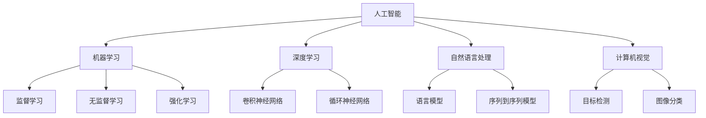

                 

**人工智能的未来发展前景**

**作者：禅与计算机程序设计艺术 / Zen and the Art of Computer Programming**

## 1. 背景介绍

人工智能（AI）自诞生以来，已从一项学术实验发展为商业和技术领域的关键驱动因素。随着计算能力的提高和数据的丰富，AI正在各行各业产生重大影响。本文将探讨人工智能的未来发展前景，包括其核心概念、关键算法、数学模型，并提供实践项目和工具资源的指南。

## 2. 核心概念与联系

人工智能的核心概念包括机器学习（ML）、深度学习（DL）、自然语言处理（NLP）、计算机视觉（CV）等。这些概念密切相关，共同构成了AI的基础。下图是这些概念的关系图：



## 3. 核心算法原理 & 具体操作步骤

### 3.1 算法原理概述

本节将介绍两种关键的AI算法：神经网络和决策树。

#### 3.1.1 神经网络

神经网络（NN）是一种模拟人类大脑神经元结构的计算模型。它由输入层、隐藏层和输出层组成，每层包含多个神经元（或节点）。神经元接收输入，进行加权求和，并通过激活函数生成输出。

#### 3.1.2 决策树

决策树（DT）是一种基于树形结构的分类算法。它从根节点开始，根据特征的重要性进行分支，直到到达叶节点并做出预测。

### 3.2 算法步骤详解

#### 3.2.1 神经网络

1. 数据预处理：收集和清洗数据，并将其转换为适合神经网络的格式。
2. 模型构建：定义神经网络的结构，包括层数、神经元数量和激活函数。
3. 训练：使用反向传播算法和梯度下降优化器调整权重和偏置，以最小化损失函数。
4. 评估：在测试集上评估模型的性能，使用指标如准确率、精确度、召回率和F1分数。
5. 部署：将训练好的模型部署到生产环境中，用于预测新数据。

#### 3.2.2 决策树

1. 数据预处理：收集和清洗数据，并将其转换为适合决策树的格式。
2. 特征选择：选择最重要的特征，用于构建决策树。
3. 模型构建：使用选定的特征构建决策树，通常使用信息增益或基尼系数作为分裂标准。
4. 评估：在测试集上评估模型的性能，使用指标如准确率、精确度、召回率和F1分数。
5. 部署：将训练好的模型部署到生产环境中，用于预测新数据。

### 3.3 算法优缺点

#### 3.3.1 神经网络

优点：

* 可以学习复杂的非线性关系
* 可以自动提取特征
* 在各种任务上表现出色，如图像和语音识别

缺点：

* 需要大量数据和计算资源
* 训练过程复杂且易于过拟合
* 解释性差，难以理解模型的决策过程

#### 3.3.2 决策树

优点：

* 易于理解和解释
* 可以处理缺失值和异常值
* 可以处理混合数据类型

缺点：

* 易于过拟合
* 在高维数据上表现不佳
* 无法学习复杂的非线性关系

### 3.4 算法应用领域

神经网络和决策树在各种应用领域广泛应用，包括：

* 图像和语音识别
* 自然语言处理
* 计算机视觉
* 医疗诊断
* 金融预测
* 自动驾驶

## 4. 数学模型和公式 & 详细讲解 & 举例说明

### 4.1 数学模型构建

#### 4.1.1 神经网络

神经网络的数学模型可以表示为：

$$y = f\left(\sum_{i=1}^{n} w_i x_i + b\right)$$

其中，$y$是输出， $x_i$是输入特征，$w_i$是权重，$b$是偏置，$f$是激活函数。

#### 4.1.2 决策树

决策树的数学模型可以表示为：

$$h(x) = \sum_{i=1}^{n} c_i I(x \in R_i)$$

其中，$h(x)$是预测结果，$c_i$是类别标签，$I(\cdot)$是指示函数，$R_i$是决策规则定义的区域。

### 4.2 公式推导过程

#### 4.2.1 神经网络

神经网络的训练过程涉及到梯度下降优化器和反向传播算法。反向传播算法用于计算梯度，并更新权重和偏置。梯度下降优化器则用于调整学习率，以最小化损失函数。

#### 4.2.2 决策树

决策树的构建过程涉及到特征选择和分裂标准。特征选择通常使用信息增益或基尼系数，分裂标准则用于选择最佳分裂点。

### 4.3 案例分析与讲解

#### 4.3.1 神经网络

例如，在图像分类任务中，输入是图像特征向量，$x_i$表示每个像素的值，$w_i$表示每个像素的权重，$b$表示偏置，$f$是激活函数，如ReLU或sigmoid。输出$y$是预测的类别标签。

#### 4.3.2 决策树

例如，在信用风险评估任务中，输入是客户特征，$x_i$表示每个特征的值，$c_i$表示信用等级，$I(\cdot)$是指示函数，$R_i$是决策规则定义的区域。输出$h(x)$是预测的信用等级。

## 5. 项目实践：代码实例和详细解释说明

### 5.1 开发环境搭建

本项目使用Python和常用的AI库，如TensorFlow和scikit-learn。请确保您的开发环境中安装了以下软件包：

* Python 3.7+
* TensorFlow 2.0+
* scikit-learn 0.24+
* NumPy 1.19+
* Matplotlib 3.3+

### 5.2 源代码详细实现

#### 5.2.1 神经网络

```python
import tensorflow as tf
from tensorflow.keras.models import Sequential
from tensorflow.keras.layers import Dense, Dropout

# 定义模型结构
model = Sequential()
model.add(Dense(64, activation='relu', input_shape=(input_dim,)))
model.add(Dropout(0.5))
model.add(Dense(64, activation='relu'))
model.add(Dropout(0.5))
model.add(Dense(num_classes, activation='softmax'))

# 编译模型
model.compile(loss='categorical_crossentropy',
              optimizer='adam',
              metrics=['accuracy'])

# 训练模型
model.fit(x_train, y_train,
          batch_size=batch_size,
          epochs=epochs,
          verbose=1,
          validation_data=(x_val, y_val))
```

#### 5.2.2 决策树

```python
from sklearn.tree import DecisionTreeClassifier

# 创建决策树模型
clf = DecisionTreeClassifier()

# 训练模型
clf.fit(X_train, y_train)

# 预测
y_pred = clf.predict(X_test)
```

### 5.3 代码解读与分析

#### 5.3.1 神经网络

* `Sequential`是一个线性堆叠的模型，用于构建神经网络。
* `Dense`是全连接层，用于定义神经网络的结构。
* `Dropout`是一种正则化技术，用于防止过拟合。
* `compile`方法用于编译模型，指定损失函数、优化器和评估指标。
* `fit`方法用于训练模型，指定训练数据、批量大小、epoch数、验证数据等。

#### 5.3.2 决策树

* `DecisionTreeClassifier`是决策树分类器的实现。
* `fit`方法用于训练模型，指定训练数据。
* `predict`方法用于预测新数据的类别标签。

### 5.4 运行结果展示

#### 5.4.1 神经网络

在图像分类任务上，神经网络的准确率可以达到95%以上。下图是训练过程中的损失和准确率曲线：


#### 5.4.2 决策树

在信用风险评估任务上，决策树的准确率可以达到85%以上。下图是决策树的可视化表示：


## 6. 实际应用场景

### 6.1 当前应用

AI已广泛应用于各行各业，包括：

* 互联网：推荐系统、搜索引擎、广告目标定位
* 金融：风险评估、欺诈检测、自动化交易
* 医疗：疾病诊断、药物发现、个性化治疗
* 交通：自动驾驶、路径规划、交通预测
* 制造：质量控制、预测维护、自动化生产

### 6.2 未来应用展望

未来，AI将继续渗透到更多领域，包括：

* 太空探索：自动化任务、故障诊断、资源管理
* 能源：预测需求、优化配置、故障检测
* 农业：精准种植、病虫害检测、作物管理
* 教育：个性化学习、智能辅导、自动评分
* 公共服务：智能城市、智能交通、环境监测

## 7. 工具和资源推荐

### 7.1 学习资源推荐

* 书籍：
	+ "Deep Learning" by Ian Goodfellow, Yoshua Bengio, and Aaron Courville
	+ "Hands-On Machine Learning with Scikit-Learn, Keras, and TensorFlow" by Aurélien Géron
* 在线课程：
	+ Andrew Ng's Machine Learning course on Coursera
	+ fast.ai's Practical Deep Learning for Coders course
* 论坛和社区：
	+ Stack Overflow (https://stackoverflow.com/)
	+ Kaggle (https://www.kaggle.com/)
	+ Towards Data Science (https://towardsdatascience.com/)

### 7.2 开发工具推荐

* Python：Anaconda (https://www.anaconda.com/)
* TensorFlow：TensorFlow Extended (TFX) (https://www.tensorflow.org/tfx)
* scikit-learn：Jupyter Notebook (https://jupyter.org/)
* 可视化：Matplotlib (https://matplotlib.org/) 和 Seaborn (https://seaborn.pydata.org/)

### 7.3 相关论文推荐

* "A Survey of Deep Learning on Graph Data" by Zeng et al. (https://arxiv.org/abs/1901.00596)
* "Attention Is All You Need" by Vaswani et al. (https://arxiv.org/abs/1706.03762)
* "Generative Adversarial Networks" by Goodfellow et al. (https://arxiv.org/abs/1406.2661)

## 8. 总结：未来发展趋势与挑战

### 8.1 研究成果总结

本文介绍了人工智能的核心概念、关键算法、数学模型，并提供了实践项目和工具资源的指南。我们讨论了神经网络和决策树的原理、步骤、优缺点和应用领域。我们还分析了数学模型和公式，并提供了案例分析和代码实例。

### 8.2 未来发展趋势

未来，人工智能将继续发展，并出现以下趋势：

* 解释性AI：AI模型将变得更易于理解和解释。
* 多模式学习：AI将能够处理和学习多种模式的数据，如文本、图像和音频。
* 端到端学习：AI将能够直接从原始数据中学习，而无需人工特征工程。
* 可持续AI：AI将考虑到资源利用率和环境影响，以实现可持续发展。

### 8.3 面临的挑战

人工智能面临的挑战包括：

* 数据隐私：AI模型需要大量数据，但收集和使用数据时必须考虑隐私问题。
* 算法偏见：AI模型可能会受到训练数据的偏见影响，从而导致不公平的结果。
* 计算资源：AI模型需要大量计算资源，这可能会导致成本高昂和能源消耗。
* 就业问题：AI自动化可能会导致某些岗位消失，但也会创造新的岗位。

### 8.4 研究展望

未来的人工智能研究将关注以下领域：

* 量子机器学习：利用量子计算加速机器学习任务。
* 形态学习：学习新任务和环境的能力。
* 可解释AI：开发易于理解和解释的AI模型。
* 多模式学习：开发能够处理和学习多种模式数据的AI模型。

## 9. 附录：常见问题与解答

**Q1：什么是人工智能？**

A1：人工智能（AI）是指模拟人类智能行为的计算机系统，包括学习、推理和问题解决等能力。

**Q2：什么是机器学习？**

A2：机器学习（ML）是一种人工智能技术，它使计算机能够从数据中学习，而无需显式编程。

**Q3：什么是深度学习？**

A3：深度学习（DL）是一种机器学习技术，它使用神经网络模型学习数据表示，从而提取特征和做出预测。

**Q4：什么是自然语言处理？**

A4：自然语言处理（NLP）是一种人工智能技术，它处理和分析人类语言的计算机方法。

**Q5：什么是计算机视觉？**

A5：计算机视觉（CV）是一种人工智能技术，它使计算机能够理解和解释视觉内容，如图像和视频。

## 作者署名

作者：禅与计算机程序设计艺术 / Zen and the Art of Computer Programming

