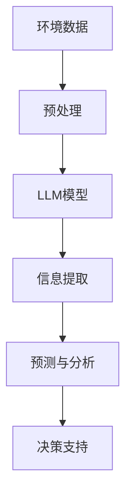

                 

**大型语言模型（LLM）在环境保护中的应用：数据分析与预测**

## 1. 背景介绍

当前，全球环境面临着严重的挑战，如气候变化、生物多样性丧失和资源枯竭。环境保护亟需创新的技术和方法，以帮助我们理解和应对这些挑战。大型语言模型（LLM）是一种强大的工具，可以用于环境保护领域的数据分析和预测，从而帮助我们更好地保护我们的星球。

## 2. 核心概念与联系

### 2.1 LLM原理

LLM是一种深度学习模型，能够理解和生成人类语言。它们通过处理大量文本数据来学习语言规则和模式。LLM可以用于各种自然语言处理（NLP）任务，包括文本分类、命名实体识别和文本生成。

### 2.2 LLM在环境保护中的应用

LLM可以在环境保护领域发挥作用，因为环境数据往往以文本形式存在，如报告、新闻文章和社交媒体帖子。LLM可以帮助我们从这些数据中提取有用的信息，并进行预测和分析。



## 3. 核心算法原理 & 具体操作步骤

### 3.1 算法原理概述

在环境保护领域，LLM通常用于文本分类、命名实体识别和文本生成任务。这些任务的目标是从环境相关文本中提取有用信息，并生成新的文本，如预测报告。

### 3.2 算法步骤详解

1. **数据收集**：收集与环境保护相关的文本数据，如新闻文章、报告和社交媒体帖子。
2. **数据预处理**：清洗数据，去除无用信息，并将文本转换为模型可以处理的格式。
3. **模型训练**：使用预处理后的数据训练LLM模型。这通常涉及到选择合适的模型架构，调整超参数，并监督模型的训练过程。
4. **信息提取**：使用训练好的模型从环境相关文本中提取信息。这可以通过文本分类或命名实体识别来实现。
5. **预测与分析**：使用提取的信息进行预测和分析。这可以是基于文本生成的预测报告，或是对环境趋势的分析。
6. **评估与优化**：评估模型的性能，并根据需要优化模型。

### 3.3 算法优缺点

**优点**：

* LLM可以处理大量文本数据，并从中提取有用信息。
* LLM可以生成新的文本，如预测报告，从而帮助决策者做出更明智的决策。
* LLM可以学习和理解复杂的语言模式，从而提高环境保护领域的数据分析能力。

**缺点**：

* LLM需要大量的计算资源，这可能会导致成本高昂。
* LLM可能会受到偏见和错误数据的影响，从而导致不准确的预测和分析。
* LLM可能会生成不真实或不相关的文本，这需要人类审核来确保准确性。

### 3.4 算法应用领域

LLM在环境保护领域的应用包括：

* 环境监测：监控环境变化，如气候变化和空气质量。
* 环境预测：预测环境趋势，如洪水和森林火灾。
* 环境决策支持：帮助决策者做出更明智的环境保护决策。
* 环境教育：通过生成环境相关文本来提高环境保护意识。

## 4. 数学模型和公式 & 详细讲解 & 举例说明

### 4.1 数学模型构建

LLM通常基于Transformer架构构建，该架构由自注意力机制组成。自注意力机制可以学习输入序列中各个位置之间的关系。数学上，自注意力机制可以表示为：

$$Attention(Q, K, V) = softmax(\frac{QK^T}{\sqrt{d_k}})V$$

其中，$Q$, $K$, $V$分别是查询、键和值向量，$d_k$是键向量的维度。

### 4.2 公式推导过程

自注意力机制的推导过程如下：

1. 将输入序列嵌入到查询、键和值向量中。
2. 计算查询、键和值向量的点积，并除以$\sqrt{d_k}$以进行规范化。
3. 使用softmax函数对点积结果进行归一化，得到注意力权重。
4. 将注意力权重与值向量相乘，得到自注意力输出。

### 4.3 案例分析与讲解

例如，假设我们想要使用LLM预测未来的气温。我们可以收集过去的气温数据，并使用LLM模型来预测未来的气温。数学上，我们可以表示为：

$$Temperature_{t+1} = f(Temperature_t,..., Temperature_{t-n}, Features_t)$$

其中，$f$是LLM模型，$n$是考虑的历史气温数据的数量，$Features_t$是其他相关特征，如湿度和风速。

## 5. 项目实践：代码实例和详细解释说明

### 5.1 开发环境搭建

要使用LLM进行环境保护相关的数据分析和预测，我们需要搭建一个开发环境。这通常包括安装Python、PyTorch或TensorFlow，并设置一个GPU环境以加速模型训练。

### 5.2 源代码详细实现

以下是一个简单的LLM模型实现示例，用于环境保护领域的文本分类任务。我们使用Transformers库来训练一个BERT模型。

```python
from transformers import BertForSequenceClassification, BertTokenizerFast, Trainer, TrainingArguments

# 加载预训练模型和分词器
model = BertForSequenceClassification.from_pretrained('bert-base-uncased', num_labels=2)
tokenizer = BertTokenizerFast.from_pretrained('bert-base-uncased')

# 准备数据
train_encodings = tokenizer(train_texts, truncation=True, padding=True)
val_encodings = tokenizer(val_texts, truncation=True, padding=True)

# 定义训练参数
training_args = TrainingArguments(
    output_dir='./results',
    num_train_epochs=3,
    per_device_train_batch_size=16,
    per_device_eval_batch_size=64,
    warmup_steps=500,
    weight_decay=0.01,
    logging_dir='./logs',
)

# 定义训练器
trainer = Trainer(
    model=model,
    args=training_args,
    train_dataset=train_encodings,
    eval_dataset=val_encodings,
)

# 训练模型
trainer.train()
```

### 5.3 代码解读与分析

在上述代码中，我们首先加载预训练的BERT模型和分词器。然后，我们准备训练数据，并定义训练参数。最后，我们定义训练器，并使用训练器来训练模型。

### 5.4 运行结果展示

训练完成后，我们可以使用训练好的模型来进行文本分类。例如，我们可以预测一段文本是否与环境保护相关。

## 6. 实际应用场景

### 6.1 环境监测

LLM可以用于监控环境变化，如气候变化和空气质量。通过分析环境相关文本，我们可以预测环境趋势，并及时采取行动。

### 6.2 环境预测

LLM可以用于预测环境趋势，如洪水和森林火灾。通过分析历史数据，我们可以使用LLM模型来预测未来的环境变化。

### 6.3 环境决策支持

LLM可以帮助决策者做出更明智的环境保护决策。通过分析环境相关文本，我们可以提供有用的信息，并帮助决策者做出更明智的决策。

### 6.4 未来应用展望

未来，LLM在环境保护领域的应用将会越来越广泛。随着环境数据的增加，我们可以使用LLM模型来进行更准确的预测和分析。此外，LLM还可以与其他技术结合使用，如物联网和卫星遥感，从而提供更全面的环境保护解决方案。

## 7. 工具和资源推荐

### 7.1 学习资源推荐

* "Natural Language Processing with Python" by Steven Bird, Ewan Klein, and Edward Loper
* "Hands-On Machine Learning with Scikit-Learn, Keras, and TensorFlow" by Aurélien Géron
* "Deep Learning Specialization" by Andrew Ng on Coursera

### 7.2 开发工具推荐

* Python：一个强大的编程语言，广泛用于NLP和深度学习。
* PyTorch：一个流行的深度学习框架，用于构建和训练LLM模型。
* Transformers：一个开源库，提供预训练的LLM模型和分词器。

### 7.3 相关论文推荐

* "BERT: Pre-training of Deep Bidirectional Transformers for Language Understanding" by Jacob Devlin, Ming-Wei Chang, and Kenton Lee
* "Environmental Impact of Deep Learning" by Timnit Gebru, Anna Goldbach, and Laura Marshall
* "Tackling Climate Change with Machine Learning" by Mark Z. Jacobsen

## 8. 总结：未来发展趋势与挑战

### 8.1 研究成果总结

LLM在环境保护领域的应用取得了显著成果。通过分析环境相关文本，我们可以进行更准确的预测和分析，从而帮助我们更好地保护我们的星球。

### 8.2 未来发展趋势

未来，LLM在环境保护领域的应用将会继续发展。随着环境数据的增加，我们可以使用更大、更复杂的LLM模型来进行更准确的预测和分析。此外，LLM还可以与其他技术结合使用，从而提供更全面的环境保护解决方案。

### 8.3 面临的挑战

然而，LLM在环境保护领域的应用也面临着挑战。这些挑战包括：

* **数据质量**：环境相关文本数据的质量可能会影响LLM模型的性能。
* **计算资源**：训练和部署LLM模型需要大量的计算资源。
* **偏见和错误数据**：LLM模型可能会受到偏见和错误数据的影响，从而导致不准确的预测和分析。

### 8.4 研究展望

未来的研究将需要解决这些挑战，并开发更先进的LLM模型和技术，以帮助我们更好地保护我们的星球。此外，我们还需要开发更好的评估方法，以确保LLM模型的准确性和可靠性。

## 9. 附录：常见问题与解答

**Q：LLM模型需要多少计算资源？**

**A**：训练和部署LLM模型需要大量的计算资源。通常，我们需要一个GPU环境来加速模型训练。此外，我们还需要大量的内存来存储模型参数和数据。

**Q：LLM模型是否会受到偏见和错误数据的影响？**

**A**：是的，LLM模型可能会受到偏见和错误数据的影响。因此，我们需要仔细审查我们的数据，并开发方法来减轻偏见和错误数据的影响。

**Q：LLM模型是否可以与其他技术结合使用？**

**A**：是的，LLM模型可以与其他技术结合使用，从而提供更全面的环境保护解决方案。例如，我们可以将LLM模型与物联网和卫星遥感结合使用，从而提供更全面的环境监测和预测。

## 作者：禅与计算机程序设计艺术 / Zen and the Art of Computer Programming

