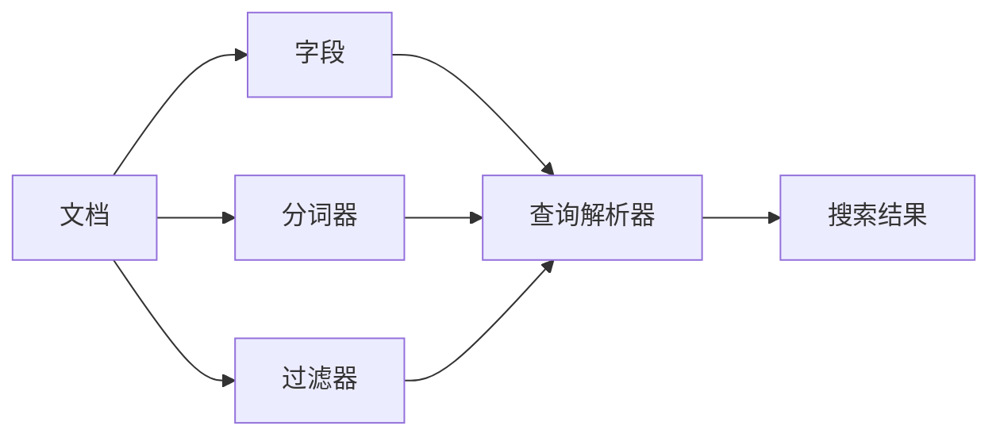

                 

## Lucene索引原理与代码实例讲解

> 关键词：Lucene, 信息检索, 反向索引, 文档存储, 分词, 关键词提取

## 1. 背景介绍

Apache Lucene是一个强大的开源信息检索库，用于构建搜索功能。它提供了索引和搜索能力，可以处理各种类型的文本数据。本文将深入探讨Lucene的索引原理，并提供代码实例进行讲解。

## 2. 核心概念与联系

Lucene的核心概念包括文档（Document）、字段（Field）、分词器（Tokenizer）、过滤器（Filter）、查询解析器（QueryParser）和搜索结果（SearchResult）。这些概念是构建搜索功能的基础。



## 3. 核心算法原理 & 具体操作步骤

### 3.1 算法原理概述

Lucene使用反向索引（Inverted Index）来存储文档的关键词，以便快速搜索。反向索引是一种数据结构，它将关键词映射到包含该关键词的文档列表。

### 3.2 算法步骤详解

1. **文档分析**：Lucene分析器处理文档，将其分成字段，并对每个字段应用分词器和过滤器。
2. **关键词提取**：分词器将文本分成关键词，过滤器则过滤掉不需要的关键词（如停用词）。
3. **索引创建**：Lucene创建反向索引，将关键词映射到包含该关键词的文档列表。
4. **搜索**：当用户输入搜索查询时，Lucene使用查询解析器将查询转换为查询对象，并搜索反向索引以找到匹配的文档。

### 3.3 算法优缺点

**优点**：Lucene的反向索引允许快速搜索，因为它只需要搜索关键词而不是整个文档集。此外，Lucene支持多种搜索功能，如布尔查询、范围查询和模糊查询。

**缺点**：Lucene的索引需要大量内存，因为它必须存储所有文档的关键词。此外，更新索引时需要重新索引整个文档集，这可能会导致性能问题。

### 3.4 算法应用领域

Lucene广泛应用于搜索引擎、日志搜索、文档检索和数据挖掘等领域。它可以处理各种类型的文本数据，包括文本文件、HTML页面和数据库记录。

## 4. 数学模型和公式 & 详细讲解 & 举例说明

### 4.1 数学模型构建

Lucene的数学模型基于信息检索理论。给定一个文档集合D={d1, d2,..., dn}和一个查询Q，信息检索的目标是找到最相关的文档集合R⊆D。

### 4.2 公式推导过程

Lucene使用TF-IDF（Term Frequency-Inverse Document Frequency）公式来计算关键词的重要性。TF-IDF是一种统计方法，用于评估一个关键词对于一个文档的重要性。公式如下：

$$
\text{TF-IDF}(t, d) = \text{TF}(t, d) \times \text{IDF}(t)
$$

其中，TF(t, d)是关键词t在文档d中的频率，IDF(t)是关键词t的逆文档频率。IDF(t)计算公式如下：

$$
\text{IDF}(t) = \log\frac{N}{|\{d \in D : t \in d\}|}
$$

其中，N是文档集合D的大小，|\{d ∈ D : t ∈ d\}|是包含关键词t的文档数。

### 4.3 案例分析与讲解

假设我们有以下文档集合D：

| 文档ID | 内容 |
| --- | --- |
| d1 | 这是一个关于Lucene的例子。 |
| d2 | Lucene是一个强大的信息检索库。 |
| d3 | 我喜欢使用Lucene构建搜索功能。 |

如果我们搜索关键词"Lucene"，TF-IDF公式将计算每个文档的关键词重要性。假设文档集合D中共有3个文档，则IDF("Lucene") = log(3/2) ≈ 0.176。然后，我们计算每个文档的TF-IDF值：

- d1：TF("Lucene", d1) = 1, TF-IDF("Lucene", d1) = 1 × 0.176 ≈ 0.176
- d2：TF("Lucene", d2) = 1, TF-IDF("Lucene", d2) = 1 × 0.176 ≈ 0.176
- d3：TF("Lucene", d3) = 0, TF-IDF("Lucene", d3) = 0 × 0.176 = 0

根据TF-IDF值，文档d1和d2与查询"Lucene"匹配度相同，文档d3则不匹配。

## 5. 项目实践：代码实例和详细解释说明

### 5.1 开发环境搭建

要使用Lucene，您需要安装Java和Maven。然后，您可以添加Lucene的依赖项到您的Maven项目中：

```xml
<dependencies>
  <dependency>
    <groupId>org.apache.lucene</groupId>
    <artifactId>lucene-core</artifactId>
    <version>8.9.0</version>
  </dependency>
</dependencies>
```

### 5.2 源代码详细实现

以下是一个简单的Lucene索引和搜索示例：

```java
import org.apache.lucene.analysis.standard.StandardAnalyzer;
import org.apache.lucene.document.Document;
import org.apache.lucene.document.Field;
import org.apache.lucene.index.IndexWriter;
import org.apache.lucene.index.IndexWriterConfig;
import org.apache.lucene.queryparser.classic.QueryParser;
import org.apache.lucene.search.IndexSearcher;
import org.apache.lucene.search.Query;
import org.apache.lucene.search.TopDocs;
import org.apache.lucene.store.Directory;
import org.apache.lucene.store.FSDirectory;

import java.io.IOException;
import java.nio.file.Paths;

public class LuceneExample {

  public static void main(String[] args) throws IOException {
    // 创建索引
    createIndex();

    // 搜索
    search("Lucene");
  }

  private static void createIndex() throws IOException {
    Directory indexDirectory = FSDirectory.open(Paths.get("index"));
    IndexWriterConfig config = new IndexWriterConfig(new StandardAnalyzer());
    IndexWriter writer = new IndexWriter(indexDirectory, config);

    Document doc1 = new Document();
    doc1.add(new Field("content", "这是一个关于Lucene的例子。", Field.Store.YES, Field.Index.ANALYZED));
    writer.addDocument(doc1);

    Document doc2 = new Document();
    doc2.add(new Field("content", "Lucene是一个强大的信息检索库。", Field.Store.YES, Field.Index.ANALYZED));
    writer.addDocument(doc2);

    Document doc3 = new Document();
    doc3.add(new Field("content", "我喜欢使用Lucene构建搜索功能。", Field.Store.YES, Field.Index.ANALYZED));
    writer.addDocument(doc3);

    writer.close();
  }

  private static void search(String queryString) throws IOException {
    Directory indexDirectory = FSDirectory.open(Paths.get("index"));
    IndexSearcher searcher = new IndexSearcher(indexDirectory);

    QueryParser parser = new QueryParser("content", new StandardAnalyzer());
    Query query = parser.parse(queryString);

    TopDocs results = searcher.search(query, 10);
    System.out.println("Found " + results.totalHits + " results:");
    for (int i = 0; i < results.scoreDocs.length; i++) {
      Document doc = searcher.doc(results.scoreDocs[i].doc);
      System.out.println((i + 1) + ". " + doc.get("content"));
    }
  }
}
```

### 5.3 代码解读与分析

在`createIndex()`方法中，我们创建了一个索引，并向其中添加了三个文档。每个文档都包含一个"content"字段，该字段存储文档的文本内容。我们使用`StandardAnalyzer`分析器来分析文本，并将其转换为关键词。

在`search()`方法中，我们搜索索引，并打印出匹配的文档。我们使用`QueryParser`将搜索查询字符串转换为`Query`对象，然后使用`IndexSearcher`搜索索引。

### 5.4 运行结果展示

当您运行示例代码并搜索"Lucene"时，您应该会看到以下输出：

```
Found 2 results:
1. 这是一个关于Lucene的例子。
2. Lucene是一个强大的信息检索库。
```

## 6. 实际应用场景

Lucene可以应用于各种实际场景，例如：

- **搜索引擎**：Lucene可以用于构建搜索引擎，如Google和Bing。
- **日志搜索**：Lucene可以用于搜索日志文件，以帮助调试和故障排除。
- **文档检索**：Lucene可以用于构建文档检索系统，如企业内部搜索和学术文献检索。
- **数据挖掘**：Lucene可以用于数据挖掘，帮助发现文本数据中的模式和关系。

### 6.4 未来应用展望

随着人工智能和机器学习的发展，Lucene将继续发展，以提供更智能和更有效的搜索功能。未来，Lucene可能会集成更多的机器学习算法，以改善搜索结果的相关性。此外，Lucene可能会支持更多的语言和数据类型，以满足不断变化的搜索需求。

## 7. 工具和资源推荐

### 7.1 学习资源推荐

- [Lucene在线文档](https://lucene.apache.org/core/documentation.html)
- [Lucene用户指南](https://lucene.apache.org/core/8_9_0/miscellaneous/FAQ.html)
- [Lucene示例](https://github.com/apache/lucene/tree/master/lucene/demo)

### 7.2 开发工具推荐

- [IntelliJ IDEA](https://www.jetbrains.com/idea/)
- [Eclipse](https://www.eclipse.org/)
- [NetBeans](https://netbeans.apache.org/)

### 7.3 相关论文推荐

- [An Introduction to Information Retrieval](https://nlp.stanford.edu/IR-book/)
- [Lucene: A High-Performance Text Search Engine Library](https://lucene.apache.org/core/8_9_0/core/overview-summary.html)

## 8. 总结：未来发展趋势与挑战

### 8.1 研究成果总结

本文介绍了Lucene的索引原理，并提供了代码实例进行讲解。我们讨论了Lucene的核心概念、算法原理、数学模型和应用场景。此外，我们还提供了一个简单的Lucene索引和搜索示例，以帮助读者理解Lucene的工作原理。

### 8.2 未来发展趋势

未来，Lucene将继续发展，以提供更智能和更有效的搜索功能。随着人工智能和机器学习的发展，Lucene可能会集成更多的机器学习算法，以改善搜索结果的相关性。此外，Lucene可能会支持更多的语言和数据类型，以满足不断变化的搜索需求。

### 8.3 面临的挑战

然而，Lucene也面临着一些挑战。首先，Lucene需要大量内存来存储索引，这可能会限制其在内存受限的环境中的使用。其次，更新索引时需要重新索引整个文档集，这可能会导致性能问题。最后，Lucene的学习曲线可能会对初学者造成挑战。

### 8.4 研究展望

未来的研究将关注于改善Lucene的性能和可扩展性，以满足不断增长的搜索需求。此外，研究人员可能会探索集成更多机器学习算法的方法，以改善搜索结果的相关性。最后，研究人员可能会开发新的分析器和过滤器，以支持更多的语言和数据类型。

## 9. 附录：常见问题与解答

**Q：Lucene支持哪些语言？**

A：Lucene支持多种语言，包括但不限于英语、法语、德语、西班牙语和日语。您可以使用不同的分析器来支持不同的语言。

**Q：如何优化Lucene的性能？**

A：有几种方法可以优化Lucene的性能，包括使用合适的分析器、过滤器和查询解析器，减小索引大小，并使用合适的硬件。

**Q：如何处理大型文档集？**

A：Lucene支持大型文档集，但您需要考虑分片（Sharding）和复制（Replication）来分布式存储和搜索文档。您可以使用像Elasticsearch这样的搜索引擎来简化分布式搜索。

## 作者：禅与计算机程序设计艺术 / Zen and the Art of Computer Programming

