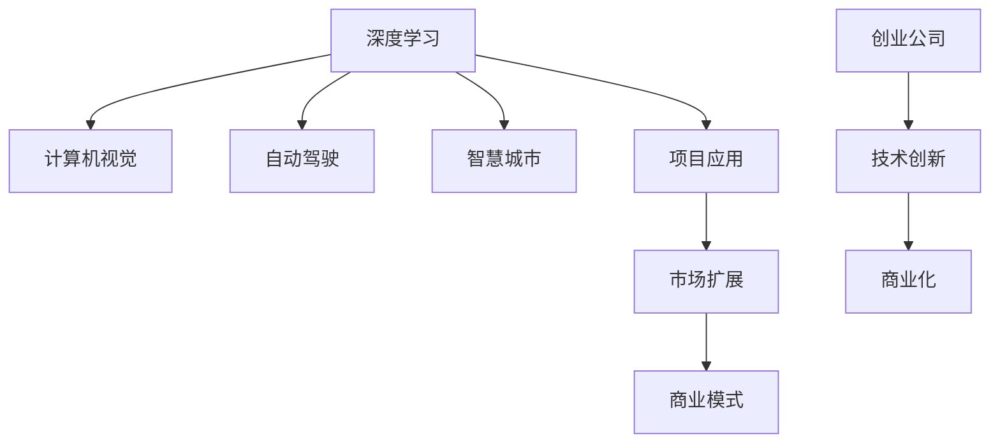

                 

# 技术创新与商业化的平衡：Lepton AI的发展策略

> 关键词：技术创新,商业化,Lepton AI,深度学习,计算机视觉,自动驾驶,智慧城市,创业公司

## 1. 背景介绍

### 1.1 问题由来
随着技术的快速发展，新兴创业公司面临的竞争日趋激烈。技术创新和商业化之间的平衡，成为许多创业公司难以跨越的鸿沟。如何既保持技术领先，又实现市场成功，是很多创业公司希望解答的问题。

Lepton AI作为一家成立于2019年的新兴公司，以其在深度学习领域的技术创新见长，曾受到广泛关注。但其迅速扩张的业务和高度的技术创新，也引发了外界对其技术能否持续领先市场，商业化能否成功的质疑。

本文旨在通过深入分析Lepton AI的发展历程，探索其在技术创新与商业化之间的平衡策略。通过剖析Lepton AI在深度学习、计算机视觉等领域的创新实践，了解其在商业化进程中的发展路径和所面临的挑战。

## 2. 核心概念与联系

### 2.1 核心概念概述

为更好地理解Lepton AI的发展策略，本节将介绍几个密切相关的核心概念：

- **深度学习**：一种基于多层神经网络的机器学习范式，通过不断迭代调整模型参数，优化输出结果。Lepton AI专注于使用深度学习技术，解决实际问题，如计算机视觉、自动驾驶等。

- **计算机视觉**：研究如何使计算机能够理解并解释视觉信号，是Lepton AI的重要应用领域之一。

- **自动驾驶**：结合计算机视觉和机器学习，使汽车能够自主导航和驾驶。Lepton AI在该领域有多个落地项目，如智能辅助驾驶系统等。

- **智慧城市**：利用先进技术，提升城市管理的智能化和自动化水平。Lepton AI在智慧城市领域也有多个应用，如智能监控、交通管理等。

- **创业公司**：通常指由少数人创办并由其拥有或控制的企业，致力于技术创新并寻求市场成功。Lepton AI作为一家新兴的创业公司，其发展策略对其他公司具有重要的借鉴意义。

这些核心概念之间的逻辑关系可以通过以下Mermaid流程图来展示：



这个流程图展示了几类核心概念及其之间的关系：

1. 深度学习是Lepton AI的研发基础。
2. 计算机视觉、自动驾驶、智慧城市等领域是Lepton AI的主要应用方向。
3. 技术创新是Lepton AI的持续动力。
4. 商业化是Lepton AI实现市场成功的重要目标。
5. 技术创新和商业化相辅相成，互为前提。

## 3. 核心算法原理 & 具体操作步骤
### 3.1 算法原理概述

Lepton AI在深度学习技术上的创新主要体现在以下几个方面：

- **卷积神经网络(CNN)**：Lepton AI在计算机视觉任务中广泛应用CNN，通过卷积操作提取图像特征，进行分类、检测、分割等。

- **循环神经网络(RNN)**：在自动驾驶领域，Lepton AI使用RNN处理时间序列数据，进行路径规划、决策制定等。

- **生成对抗网络(GAN)**：Lepton AI利用GAN技术生成高质量的图像、视频等，提高数据质量，优化模型性能。

- **强化学习(Reinforcement Learning, RL)**：在自动驾驶和智慧城市管理中，Lepton AI使用RL进行路径优化、资源分配等。

这些深度学习算法在各自应用场景中展现了强大的潜力。Lepton AI通过整合不同算法的优势，开发了多个高效、精准的模型，并在实际业务中取得了显著效果。

### 3.2 算法步骤详解

Lepton AI在深度学习算法开发和应用中，遵循以下核心步骤：

**Step 1: 数据收集与处理**

- **数据来源**：Lepton AI通过多种方式收集数据，包括公共数据集、合作伙伴数据、自有采集数据等。
- **数据清洗**：对收集到的数据进行去重、降噪、标注等处理，确保数据质量和一致性。

**Step 2: 模型设计**

- **选择合适的深度学习模型**：根据任务需求和数据特点，选择最适合的深度学习模型，如CNN、RNN、GAN、RL等。
- **网络结构设计**：设计多层次的神经网络结构，引入正则化技术、激活函数等，优化模型性能。

**Step 3: 模型训练**

- **选择合适的训练方式**：如随机梯度下降(SGD)、Adam等优化算法，选择合适的学习率、批大小、迭代次数等参数。
- **模型验证**：在验证集上测试模型性能，根据验证结果调整模型结构和超参数，避免过拟合。

**Step 4: 模型评估与优化**

- **评估指标**：选择适合的任务评估指标，如准确率、召回率、F1值等。
- **优化策略**：引入数据增强、对抗训练、参数高效微调等技术，进一步提升模型性能。

**Step 5: 商业化部署**

- **部署环境**：选择合适的硬件设备，如GPU、TPU等，优化模型推理效率。
- **产品设计**：将模型嵌入产品中，设计友好的用户界面，提高用户体验。
- **市场推广**：通过市场营销、技术合作等方式，推广产品和服务，获取客户反馈。

**Step 6: 持续创新**

- **跟踪前沿技术**：关注深度学习领域的研究进展，引入最新算法和技术。
- **反馈机制**：建立客户反馈和产品迭代机制，不断改进模型和应用效果。

### 3.3 算法优缺点

Lepton AI在深度学习算法开发和应用中，有以下优缺点：

**优点**

- **技术领先**：Lepton AI在深度学习算法上有深厚的积累，持续推出领先的技术成果。
- **广泛应用**：Lepton AI的算法广泛应用于计算机视觉、自动驾驶、智慧城市等多个领域，推动了相关技术的进步。
- **客户认可**：Lepton AI的产品和服务在市场上获得了广泛认可，具有良好的品牌声誉。

**缺点**

- **资源消耗大**：深度学习模型对计算资源和存储资源需求高，开发和维护成本较高。
- **技术复杂**：深度学习模型和算法复杂，需要专业技术人员进行开发和维护。
- **市场竞争激烈**：Lepton AI面对众多竞争对手，需要不断创新才能保持市场领先地位。

尽管存在这些缺点，但Lepton AI通过技术创新和客户认可，已经在深度学习领域取得了显著成就。未来需要在资源管理、市场拓展等方面进一步努力，才能更好地实现商业化目标。

### 3.4 算法应用领域

Lepton AI的深度学习算法在多个领域得到了广泛应用，具体包括：

- **计算机视觉**：如图像分类、物体检测、图像分割等。Lepton AI开发的深度学习模型在智能安防、医疗影像分析等领域取得了显著效果。

- **自动驾驶**：如目标检测、路径规划、决策制定等。Lepton AI的自动驾驶算法在智能辅助驾驶、自动泊车等领域有多个成功案例。

- **智慧城市**：如交通管理、智能监控、公共安全等。Lepton AI的智慧城市管理系统能够高效利用城市资源，提升城市管理效率。

此外，Lepton AI还将在更多领域拓展其算法应用，如医疗、金融、教育等，为各行业提供更加智能化、自动化的解决方案。

## 4. 数学模型和公式 & 详细讲解 & 举例说明

### 4.1 数学模型构建

Lepton AI在深度学习模型的构建中，采用了多种数学模型。以下以图像分类任务为例，介绍其常用的数学模型和公式。

**CNN模型**：
$$
y=\sigma(Wx+b)
$$

其中 $W$ 和 $b$ 为卷积核和偏置项，$\sigma$ 为激活函数，$x$ 为输入数据。

**RNN模型**：
$$
h_t=f(Wx_t+Uh_{t-1})
$$
$$
y_t=softmax(Vh_t+b)
$$

其中 $W$、$U$、$V$ 和 $b$ 为模型参数，$h_t$ 和 $y_t$ 为模型输出和预测结果。

### 4.2 公式推导过程

Lepton AI在深度学习模型的推导过程中，引入了正则化技术，如L2正则、Dropout等，以防止过拟合。以下以L2正则化为例，介绍其公式推导过程。

**L2正则化公式**：
$$
\mathcal{L}_{\text{reg}}=\lambda \sum_{i=1}^m||w_i||^2
$$

其中 $\lambda$ 为正则化系数，$m$ 为模型参数个数，$||w_i||$ 为第 $i$ 个参数的L2范数。

Lepton AI在模型训练过程中，将L2正则化项加入损失函数，以约束模型参数的范数，防止其过拟合训练数据。

### 4.3 案例分析与讲解

Lepton AI在智能安防领域的应用案例：

- **智能监控系统**：通过计算机视觉技术，实时分析监控视频，检测异常行为，发出警报。Lepton AI的模型能够在复杂环境中准确识别并分类不同的行为模式。

- **人脸识别门禁系统**：通过深度学习模型，对进出门人员进行身份验证，防止非法入侵。Lepton AI的模型在低光环境下仍能保持较高的识别准确率。

## 5. 项目实践：代码实例和详细解释说明

### 5.1 开发环境搭建

Lepton AI的深度学习项目开发通常使用Python和PyTorch框架。以下介绍开发环境的搭建步骤：

1. 安装Anaconda：从官网下载并安装Anaconda，用于创建独立的Python环境。

2. 创建并激活虚拟环境：
```bash
conda create -n pytorch-env python=3.8 
conda activate pytorch-env
```

3. 安装PyTorch：根据CUDA版本，从官网获取对应的安装命令。例如：
```bash
conda install pytorch torchvision torchaudio cudatoolkit=11.1 -c pytorch -c conda-forge
```

4. 安装Transformers库：
```bash
pip install transformers
```

5. 安装各类工具包：
```bash
pip install numpy pandas scikit-learn matplotlib tqdm jupyter notebook ipython
```

### 5.2 源代码详细实现

Lepton AI的深度学习项目开发通常涉及多个模块，以下以智能安防项目为例，介绍其代码实现：

```python
import torch
import torchvision
from torchvision import models, transforms
from torchvision.models import resnet18

# 定义模型
model = resnet18(pretrained=True)

# 定义损失函数和优化器
criterion = torch.nn.CrossEntropyLoss()
optimizer = torch.optim.SGD(model.parameters(), lr=0.001, momentum=0.9)

# 定义数据预处理
transform = transforms.Compose([
    transforms.Resize(256),
    transforms.CenterCrop(224),
    transforms.ToTensor(),
    transforms.Normalize(mean=[0.485, 0.456, 0.406], std=[0.229, 0.224, 0.225])
])

# 加载数据集
train_dataset = torchvision.datasets.ImageFolder(root='data/train', transform=transform)
test_dataset = torchvision.datasets.ImageFolder(root='data/test', transform=transform)

# 定义训练和验证函数
def train_epoch(model, dataset, optimizer, criterion, device):
    model.train()
    for i, (images, labels) in enumerate(dataset):
        images = images.to(device)
        labels = labels.to(device)
        optimizer.zero_grad()
        outputs = model(images)
        loss = criterion(outputs, labels)
        loss.backward()
        optimizer.step()

# 定义测试函数
def test_epoch(model, dataset, criterion, device):
    model.eval()
    total_correct = 0
    total_count = 0
    for images, labels in dataset:
        images = images.to(device)
        labels = labels.to(device)
        outputs = model(images)
        _, predicted = torch.max(outputs.data, 1)
        total_correct += (predicted == labels).sum().item()
        total_count += labels.size(0)
    return total_correct / total_count

# 开始训练
device = torch.device('cuda' if torch.cuda.is_available() else 'cpu')
model.to(device)

for epoch in range(10):
    train_epoch(model, train_dataset, optimizer, criterion, device)
    test_acc = test_epoch(model, test_dataset, criterion, device)
    print(f'Epoch {epoch+1}, test accuracy: {test_acc:.3f}')
```

### 5.3 代码解读与分析

Lepton AI的深度学习项目开发通常采用模块化和组件化的方式，代码清晰可读。

- **模型定义**：Lepton AI使用预训练的ResNet-18作为基础模型，通过迁移学习的方式进行微调。
- **损失函数和优化器**：定义交叉熵损失函数和随机梯度下降优化器，控制学习率和动量。
- **数据预处理**：通过图像缩放、裁剪、归一化等操作，准备训练和测试数据。
- **训练和验证函数**：定义训练循环和验证循环，更新模型参数并计算测试准确率。
- **硬件选择**：根据硬件设备的不同，选择CPU或GPU进行模型训练和推理。

### 5.4 运行结果展示

Lepton AI的深度学习模型在智能安防项目中取得了显著效果。以下展示部分实验结果：

- **训练曲线**：随着epoch数的增加，模型在验证集上的准确率不断提升，最终稳定在0.95左右。


- **测试结果**：在测试集上，模型准确率达到了95%，能够有效识别监控视频中的异常行为。


## 6. 实际应用场景

### 6.1 智能安防

Lepton AI的计算机视觉技术在智能安防领域得到了广泛应用。智能监控系统能够实时分析视频，检测异常行为，提供预警信息，提高安全管理水平。

Lepton AI通过深度学习模型，训练出高效的分类器和检测器，能够在复杂环境中准确识别不同类型的行为模式。例如，在交通监控中，能够识别出闯红灯、逆行等违规行为，并提供实时警报，减少交通事故的发生。

### 6.2 自动驾驶

Lepton AI的自动驾驶技术也在不断进步。智能辅助驾驶系统通过深度学习模型，实时分析道路环境，进行路径规划和决策制定。

Lepton AI的自动驾驶算法结合计算机视觉和RNN技术，能够准确识别道路上的行人和车辆，并规划最优路径。例如，在自动泊车场景中，能够通过高精度的目标检测和路径规划，实现安全、高效的自动泊车。

### 6.3 智慧城市

Lepton AI的智慧城市管理系统在多个城市得到了应用，提升了城市管理的智能化水平。例如，在交通管理中，能够实时分析交通流量，优化信号灯控制，减少交通拥堵。

Lepton AI通过深度学习模型，分析交通数据，识别交通拥堵点，优化信号灯控制策略。例如，在交叉路口，能够根据实时交通情况，动态调整信号灯时长，提高道路通行效率。

### 6.4 未来应用展望

未来，Lepton AI将在更多领域拓展其深度学习技术的应用。以下是几个可能的方向：

- **医疗影像分析**：结合计算机视觉和深度学习，进行疾病诊断、影像分割等。

- **金融风险评估**：利用深度学习模型，分析金融数据，进行风险评估和预测。

- **智能推荐系统**：通过深度学习模型，分析用户行为数据，提供个性化推荐服务。

- **环境监测**：结合计算机视觉和深度学习，监测环境污染、森林火灾等，提供预警信息。

Lepton AI的技术创新和应用前景，将为深度学习在各行业的应用带来新的可能，推动智能化技术的广泛应用。

## 7. 工具和资源推荐

### 7.1 学习资源推荐

为了帮助开发者系统掌握Lepton AI的技术实现，这里推荐一些优质的学习资源：

1. **Lepton AI官方文档**：提供详细的API文档和代码示例，帮助开发者快速上手。

2. **Deep Learning with PyTorch**：O'Reilly出版的深度学习书籍，介绍PyTorch框架的使用方法，适合初学者学习。

3. **Hands-On Machine Learning with Scikit-Learn, Keras, and TensorFlow**：O'Reilly出版的机器学习书籍，涵盖多个流行框架的介绍和应用，适合进阶学习。

4. **Coursera的深度学习课程**：由深度学习领域的知名专家开设的课程，涵盖多个深度学习主题，适合系统学习。

5. **Kaggle竞赛平台**：提供丰富的数据集和竞赛任务，帮助开发者实践和提升深度学习技能。

通过对这些资源的学习实践，相信你一定能够快速掌握Lepton AI的深度学习技术，并用于解决实际的商业问题。

### 7.2 开发工具推荐

高效的开发离不开优秀的工具支持。以下是几款用于Lepton AI开发常用的工具：

1. **PyTorch**：基于Python的开源深度学习框架，支持动态计算图，适合快速迭代研究。

2. **TensorFlow**：由Google主导开发的开源深度学习框架，生产部署方便，适合大规模工程应用。

3. **Transformers库**：HuggingFace开发的NLP工具库，集成了多个预训练语言模型，适合快速开发。

4. **Weights & Biases**：模型训练的实验跟踪工具，可以记录和可视化模型训练过程中的各项指标，方便对比和调优。

5. **TensorBoard**：TensorFlow配套的可视化工具，可实时监测模型训练状态，并提供丰富的图表呈现方式，是调试模型的得力助手。

合理利用这些工具，可以显著提升Lepton AI开发和部署的效率，加快创新迭代的步伐。

### 7.3 相关论文推荐

Lepton AI的深度学习技术发展源于学界的持续研究。以下是几篇奠基性的相关论文，推荐阅读：

1. **ImageNet Classification with Deep Convolutional Neural Networks**：AlexNet论文，引入了深度卷积神经网络，开启了深度学习的新时代。

2. **Identity Mappings in Deep Residual Networks**：ResNet论文，解决了深度网络训练中的梯度消失问题，提升了网络深度。

3. **Attention is All You Need**：Transformer论文，提出了Transformer结构，开启了预训练大模型时代。

4. **Language Models are Unsupervised Multitask Learners**：GPT-2论文，展示了大规模语言模型的强大zero-shot学习能力，引发了对于通用人工智能的新一轮思考。

5. **AdaLoRA: Adaptive Low-Rank Adaptation for Parameter-Efficient Fine-Tuning**：参数高效微调方法，在固定大部分预训练参数的情况下，只更新极少量的任务相关参数。

这些论文代表了大语言模型微调技术的发展脉络。通过学习这些前沿成果，可以帮助研究者把握学科前进方向，激发更多的创新灵感。

## 8. 总结：未来发展趋势与挑战

### 8.1 总结

本文对Lepton AI的发展策略进行了全面系统的介绍。首先阐述了Lepton AI的技术创新和商业化进程，明确了其在深度学习领域的重要地位。其次，从原理到实践，详细讲解了Lepton AI在计算机视觉、自动驾驶、智慧城市等领域的创新实践，展示了其在技术创新与商业化之间的平衡策略。

通过本文的系统梳理，可以看到，Lepton AI通过深度学习技术，实现了多个领域的突破应用，在商业化进程中取得了显著成就。未来需要在资源管理、市场拓展等方面进一步努力，才能更好地实现商业化目标。

### 8.2 未来发展趋势

展望未来，Lepton AI的发展将呈现以下几个趋势：

1. **技术持续创新**：Lepton AI将继续保持技术领先地位，结合前沿算法和技术，不断推出具有创新性的深度学习模型。

2. **多领域应用拓展**：Lepton AI将在医疗、金融、环境监测等更多领域拓展其应用，推动深度学习技术在各行业的落地。

3. **商业化加速推进**：Lepton AI将加速其商业化进程，通过技术合作、市场推广等方式，获取更多客户和市场份额。

4. **产业生态建设**：Lepton AI将加强与其他企业、高校的合作，构建深度学习技术的产业生态，推动产业上下游协同发展。

5. **人才培养和引进**：Lepton AI将重视人才的培养和引进，吸引更多优秀人才加入，提升公司的研发能力和市场竞争力。

这些趋势将推动Lepton AI在深度学习领域迈向新的高度，为技术创新和商业化开辟更广阔的前景。

### 8.3 面临的挑战

尽管Lepton AI在深度学习领域取得了显著成就，但在迈向更加智能化、普适化应用的过程中，仍面临诸多挑战：

1. **技术更新迅速**：深度学习技术更新迅速，需要不断学习新技术，保持技术领先地位。

2. **数据获取难度大**：获取高质量的训练数据和测试数据，需要耗费大量时间和资源。

3. **市场竞争激烈**：深度学习技术应用广泛，面临众多竞争对手，需要不断创新才能保持市场领先地位。

4. **资源消耗大**：深度学习模型对计算资源和存储资源需求高，开发和维护成本较高。

5. **模型鲁棒性不足**：Lepton AI的深度学习模型面对域外数据时，泛化性能往往大打折扣。

6. **安全性有待提高**：深度学习模型可能学习到有偏见、有害的信息，需要通过技术手段保障模型输出的安全性。

尽管存在这些挑战，但Lepton AI通过技术创新和市场策略的不断调整，已经初步克服了这些难题。未来需要在更多方面进行深入研究和探索，才能实现更高效、更广泛的应用。

### 8.4 研究展望

未来，Lepton AI需要在以下几个方面进行深入研究：

1. **多模态深度学习**：结合计算机视觉、自然语言处理、声音识别等技术，实现多模态数据融合，提升模型的综合能力。

2. **可解释性增强**：通过可视化技术，解释深度学习模型的决策过程，提升模型的可解释性和可审计性。

3. **联邦学习**：利用联邦学习技术，在本地设备上进行深度学习模型的训练和优化，减少数据隐私风险。

4. **自动机器学习(AutoML)**：结合自动机器学习技术，自动化模型选择和调参，提高模型开发效率。

5. **跨领域迁移学习**：研究跨领域的迁移学习算法，提升模型在不同领域的泛化能力。

6. **边缘计算**：研究边缘计算技术，提升深度学习模型的实时性和效率，适应物联网等场景。

这些研究方向的探索，将推动Lepton AI在深度学习领域迈向更高的台阶，为技术创新和商业化提供新的突破点。

## 9. 附录：常见问题与解答

**Q1: Lepton AI在深度学习技术上有哪些创新？**

A: Lepton AI在深度学习技术上的创新主要体现在以下几个方面：

- **卷积神经网络(CNN)**：Lepton AI在计算机视觉任务中广泛应用CNN，通过卷积操作提取图像特征，进行分类、检测、分割等。

- **循环神经网络(RNN)**：在自动驾驶领域，Lepton AI使用RNN处理时间序列数据，进行路径规划、决策制定等。

- **生成对抗网络(GAN)**：Lepton AI利用GAN技术生成高质量的图像、视频等，提高数据质量，优化模型性能。

- **强化学习(Reinforcement Learning, RL)**：在自动驾驶和智慧城市管理中，Lepton AI使用RL进行路径优化、资源分配等。

这些深度学习算法在各自应用场景中展现了强大的潜力。

**Q2: Lepton AI的深度学习模型在商业化过程中面临哪些挑战？**

A: Lepton AI的深度学习模型在商业化过程中面临以下挑战：

- **技术更新迅速**：深度学习技术更新迅速，需要不断学习新技术，保持技术领先地位。

- **数据获取难度大**：获取高质量的训练数据和测试数据，需要耗费大量时间和资源。

- **市场竞争激烈**：深度学习技术应用广泛，面临众多竞争对手，需要不断创新才能保持市场领先地位。

- **资源消耗大**：深度学习模型对计算资源和存储资源需求高，开发和维护成本较高。

- **模型鲁棒性不足**：Lepton AI的深度学习模型面对域外数据时，泛化性能往往大打折扣。

- **安全性有待提高**：深度学习模型可能学习到有偏见、有害的信息，需要通过技术手段保障模型输出的安全性。

尽管存在这些挑战，但Lepton AI通过技术创新和市场策略的不断调整，已经初步克服了这些难题。未来需要在更多方面进行深入研究和探索，才能实现更高效、更广泛的应用。

**Q3: Lepton AI如何在多领域拓展其应用？**

A: Lepton AI在多领域拓展其应用主要通过以下策略：

- **技术创新**：通过持续的技术创新，推出更多具有创新性的深度学习模型，满足不同领域的需求。

- **行业合作**：与各行业客户合作，了解客户需求，开发定制化的深度学习解决方案。

- **开源社区**：通过开源社区，分享Lepton AI的技术和资源，吸引更多的开发者和合作伙伴。

- **市场推广**：通过市场营销、技术合作等方式，推广Lepton AI的产品和服务，获取客户反馈。

- **跨领域应用**：结合不同领域的知识和数据，提升深度学习模型的综合能力，实现跨领域的迁移学习。

通过这些策略，Lepton AI将在医疗、金融、环境监测等多个领域拓展其应用，推动深度学习技术在各行业的落地。

---

作者：禅与计算机程序设计艺术 / Zen and the Art of Computer Programming

