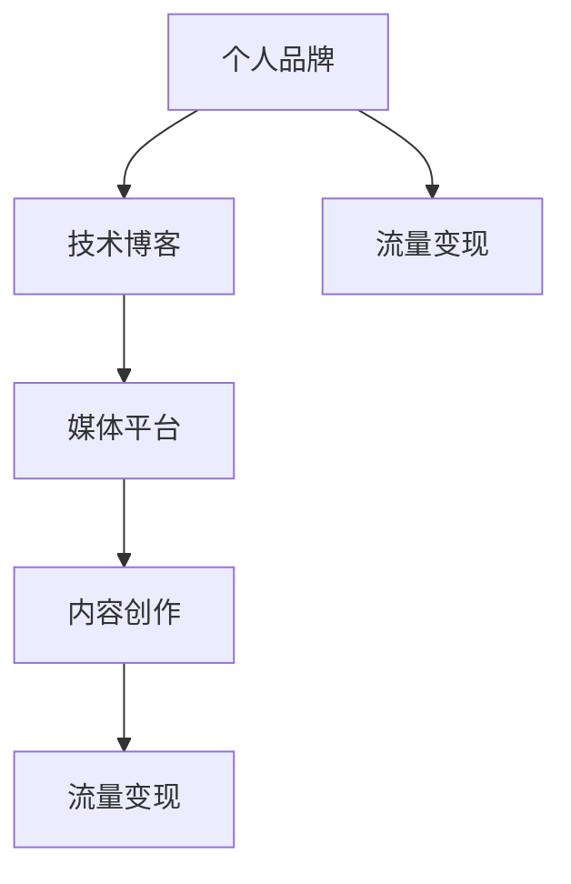

                 

# 技术博客：从个人品牌到技术媒体帝国的构建

> 关键词：个人品牌建设, 技术博客, 媒体平台, 内容创作, 流量变现

## 1. 背景介绍

### 1.1 问题由来

在信息技术高速发展的今天，个人品牌和技术媒体帝国已成为各行各业人才争夺的关键因素。尤其是在技术领域，个人品牌不仅能提升个人知名度和影响力，还能为技术媒体帝国打下坚实的基础。如何从零开始，逐步构建一个稳定、高效、具有广泛影响力的个人品牌和技术媒体帝国，成为了众多技术人才和媒体从业者的共同追求。

本文将从个人品牌建设、技术博客、媒体平台和内容创作四个方面出发，深入分析其核心原理和具体操作步骤，并探讨其在实际应用中的优缺点和未来发展趋势。同时，我们还将基于文章内容的梳理，总结相关工具和资源推荐，并阐述个人品牌和技术媒体帝国构建过程中的常见问题和解决方案。

## 2. 核心概念与联系

### 2.1 核心概念概述

本节将详细解释个人品牌、技术博客、媒体平台、内容创作和流量变现等核心概念及其相互关系。

**个人品牌**：通过在特定领域持续发布高质量内容，形成个人在行业内的专业形象和独特价值，从而获得广泛认知和尊重。

**技术博客**：作为个人品牌的重要组成部分，通过撰写技术文章分享专业知识，吸引技术社区的关注，提升个人影响力。

**媒体平台**：指各类技术论坛、社交媒体和博客平台，为技术内容提供展示和传播的渠道。

**内容创作**：包括技术文章、教程、案例分析、工具评测等内容形式，是个人品牌和技术媒体帝国的核心资源。

**流量变现**：通过广告、赞助、付费内容、会员订阅等方式，将个人品牌和技术媒体帝国的流量转化为实际收益。

这些概念之间的联系可以通过以下Mermaid流程图来展示：



这个流程图展示了个人品牌和技术媒体帝国构建的基本流程：通过撰写技术博客吸引媒体平台的关注，媒体平台提供内容展示和传播的渠道，通过内容创作吸引流量，再通过流量变现实现商业化。

## 3. 核心算法原理 & 具体操作步骤
### 3.1 算法原理概述

个人品牌和技术媒体帝国的构建，本质上是一个长期、系统性的内容创作和传播过程。其核心在于通过高质量的内容输出，持续提升个人或平台的知名度和影响力，最终实现流量变现的商业目标。

这一过程可以分为以下几个关键步骤：

1. **内容创作**：通过撰写高质量的技术文章、案例分析、教程等内容，展示个人或平台的专业能力和技术水平。
2. **媒体曝光**：利用各类技术论坛、社交媒体、博客平台等媒体渠道，广泛传播内容，吸引更多关注者。
3. **品牌塑造**：在传播过程中，逐步建立起个人或平台的品牌形象和独特价值，赢得行业内外的认可和尊重。
4. **流量变现**：通过广告、赞助、付费内容等方式，将积累的流量转换为实际收益。

### 3.2 算法步骤详解

以下将详细说明个人品牌和技术媒体帝国构建的具体操作步骤：

**Step 1: 内容创作**

1. **选题策划**：根据个人或平台的专业方向，确定技术文章和案例分析的主题和方向。
2. **调研学习**：深入研究相关技术领域，掌握最新的技术进展和应用实践。
3. **内容撰写**：利用一定的写作技巧，结合技术背景、应用场景、实践案例等内容，撰写高质量的文章。

**Step 2: 媒体曝光**

1. **选择合适的平台**：根据内容类型和目标受众，选择适合的技术论坛、社交媒体和博客平台。
2. **多平台发布**：在多个媒体平台上发布同一份内容，扩大曝光范围。
3. **互动交流**：在内容发布后，积极与读者互动，回答疑问，引导讨论，增强内容的影响力。

**Step 3: 品牌塑造**

1. **个人形象建设**：通过个性化的头像、签名等，打造独特的个人形象，增强识别度。
2. **品牌定位明确**：明确个人或平台的品牌定位，制定相应的品牌策略，保持一致性。
3. **持续创新**：不断推出新的内容，持续提升个人或平台的知名度和影响力。

**Step 4: 流量变现**

1. **选择合适的变现方式**：根据平台和受众特点，选择广告、赞助、付费内容、会员订阅等变现方式。
2. **运营管理**：通过合理的运营策略，最大化流量变现的效果，如优化内容质量、提高互动率等。

### 3.3 算法优缺点

个人品牌和技术媒体帝国的构建，具有以下优点：

1. **传播广泛**：通过多平台传播，内容可以快速覆盖大量受众，提升品牌知名度。
2. **商业价值高**：利用高质量内容吸引流量，通过各种变现方式获得实际收益。
3. **可持续性强**：通过持续的内容创作和品牌建设，形成长期稳定的影响力。

同时，该方法也存在一些局限性：

1. **成本较高**：高质量内容创作和媒体曝光需要投入大量时间和精力。
2. **市场竞争激烈**：技术领域人才众多，个人或平台在短时间内难以脱颖而出。
3. **品牌风险**：品牌形象一旦受损，恢复成本较高。

尽管存在这些局限性，但通过合理规划和策略调整，个人品牌和技术媒体帝国的构建依然可以成为技术和媒体从业者的重要职业发展方向。

### 3.4 算法应用领域

个人品牌和技术媒体帝国的构建方法，适用于各种技术领域和媒体平台。具体而言：

1. **软件开发**：通过技术博客分享编程技巧、项目经验、开源项目等内容，提升个人或平台的知名度。
2. **数据科学**：撰写数据分析案例、机器学习算法、数据可视化工具等内容，吸引行业内的关注。
3. **网络安全**：发布网络安全漏洞分析、安全防护策略、安全工具评测等内容，增强个人或平台的可信度。
4. **人工智能**：分享AI算法、模型应用、智能系统案例等内容，展示技术水平和创新能力。
5. **IT基础设施**：介绍云计算、服务器、存储等技术，提供行业洞察和实践指南。
6. **企业技术**：撰写企业级应用开发、架构设计、项目管理等内容，为企业提供技术支持。

## 4. 数学模型和公式 & 详细讲解 & 举例说明

### 4.1 数学模型构建

个人品牌和技术媒体帝国的构建，虽然不涉及复杂的数学模型，但仍然需要通过一些量化指标来衡量其效果和进展。

- **内容曝光量**：指内容在各媒体平台上的浏览量、阅读量等，可以量化为每篇文章的平均曝光量。
- **互动量**：指读者对内容的评论、点赞、转发等互动行为，可以量化为每篇文章的平均互动量。
- **品牌影响力**：可以通过社交媒体上的关注者数量、粉丝互动率等指标来衡量。
- **流量变现效果**：可以量化为广告收入、付费内容订阅费、会员费等各项收入的平均数。

### 4.2 公式推导过程

假设内容创作周期为 $T$ 天，每天发布一篇文章，每篇文章的平均曝光量为 $E$，平均互动量为 $I$，品牌关注者数量为 $F$，广告收入为 $A$，付费内容订阅费为 $S$，会员费为 $M$。

- **内容曝光量**：$TotalExposure = E \times T$
- **品牌影响力**：$BrandInfluence = \frac{F}{T}$
- **流量变现效果**：$Revenue = \frac{A + S + M}{T}$

通过这些指标，可以初步评估个人品牌和技术媒体帝国的构建效果，并根据实际情况进行调整和优化。

### 4.3 案例分析与讲解

**案例1: Google Developers博客**

Google Developers博客通过发布高质量的编程教程、开源项目、最新技术等内容，吸引了大量技术开发者的关注。通过与Google搜索引擎的深度整合，其内容曝光量显著提升，品牌影响力不断增强，最终通过广告和付费内容实现了可观的流量变现。

**案例2: Medium上的技术博主**

某技术博主通过撰写深度技术文章，分享自己的项目经验和研究进展，吸引了大量粉丝。通过与Medium平台的广告系统合作，实现了内容曝光量的快速增长，同时通过会员订阅和付费内容获取稳定收入。

## 5. 项目实践：代码实例和详细解释说明
### 5.1 开发环境搭建

在进行技术博客和品牌建设实践前，首先需要搭建开发环境。以下是基于Python和Jupyter Notebook的开发环境搭建流程：

1. **安装Python**：下载并安装Python 3.x版本，确保环境变量配置正确。
2. **安装Jupyter Notebook**：通过pip命令安装Jupyter Notebook。
3. **配置GitHub**：创建GitHub账号，并将本地项目仓库推送到GitHub上，以便协作和共享。

### 5.2 源代码详细实现

以下是一个简化的技术博客项目，通过GitHub Pages发布到互联网上，具体实现步骤如下：

1. **项目结构**：
   ```
   my-blog/
   ├── README.md
   ├── content/
   ├── templates/
   └── blog.py
   ```

2. **代码实现**：
   - **content**目录：存储博客文章内容。
   - **templates**目录：存储博客模板文件。
   - **blog.py**：处理博客文章生成和发布。

```python
from flask import Flask, render_template, request
import os

app = Flask(__name__)

# 静态文件目录
app.static_folder = 'static'

# 模板目录
app.templates_folder = 'templates'

# 文章内容目录
app.content_path = 'content/'

@app.route('/')
def home():
    # 读取最新文章列表
    articles = os.listdir(app.content_path)
    articles = [article.split('.')[0] for article in articles if article.endswith('.md')]
    articles.sort(reverse=True)
    # 渲染主页模板
    return render_template('index.html', articles=articles)

@app.route('/<article>')
def article(article):
    # 读取文章内容
    file_path = os.path.join(app.content_path, f'{article}.md')
    with open(file_path, 'r', encoding='utf-8') as f:
        content = f.read()
    # 渲染文章页面模板
    return render_template('article.html', content=content)

if __name__ == '__main__':
    app.run(debug=True, host='0.0.0.0', port=5000)
```

### 5.3 代码解读与分析

上述代码实现了一个简单的博客系统，通过Flask框架搭建，实现了文章浏览和发布功能。其中，`index.html`模板负责展示文章列表，`article.html`模板负责展示文章内容。

## 6. 实际应用场景
### 6.4 未来应用展望

个人品牌和技术媒体帝国的构建，未来将展现出更加广阔的发展前景。以下是几个主要趋势：

1. **多媒体融合**：通过视频、音频、图表等多媒体形式丰富内容表达，提升用户体验。
2. **社交媒体融合**：通过与各类社交媒体平台的深度整合，实现内容自动发布和传播。
3. **实时互动**：利用实时互动技术，增强读者参与度，提升品牌影响力。
4. **AI辅助创作**：引入AI技术，如自然语言处理、自动摘要等，提升内容创作效率和质量。
5. **元宇宙应用**：通过虚拟现实和增强现实技术，打造沉浸式内容体验，提升用户粘性。

## 7. 工具和资源推荐
### 7.1 学习资源推荐

为了帮助个人和平台快速掌握技术博客和品牌建设的技巧，以下是一些优质的学习资源：

1. **《内容营销策略》课程**：提供全面的内容营销知识，涵盖内容创作、SEO优化、社交媒体运营等。
2. **《数字营销实战》书籍**：涵盖数字营销的各个方面，包括内容创作、社交媒体营销、SEO优化等。
3. **Medium博客**：阅读和分析成功博客的内容策略，借鉴其成功经验。
4. **GitHub Pages**：了解如何使用GitHub Pages发布个人博客。
5. **Medium上的技术博主**：关注和分析成功技术博主的内容和策略，学习其成功的经验和教训。

### 7.2 开发工具推荐

技术博客和品牌建设的开发工具推荐如下：

1. **Jupyter Notebook**：Python编程的优秀工具，支持代码和数据分析的实时展示。
2. **GitHub Pages**：免费的博客托管服务，易于使用且稳定可靠。
3. **Flask**：轻量级的Web框架，适用于快速搭建个人博客系统。
4. **Markdown**：轻量级的文本标记语言，支持文本格式化和代码块。
5. **Hemingway**：语法和拼写检查工具，帮助提升文章质量。

### 7.3 相关论文推荐

以下几篇论文对技术博客和品牌建设具有重要的指导意义：

1. **《内容营销的心理学》**：研究内容创作的心理机制，帮助创作者更好地理解受众需求。
2. **《社交媒体内容策略》**：分析社交媒体内容传播的机制和策略，帮助品牌提升曝光量。
3. **《SEO优化技术》**：提供全面的SEO优化技巧，帮助提升博客内容在搜索引擎中的排名。
4. **《数字营销的未来》**：探讨数字营销的未来发展趋势，帮助品牌提前布局。

## 8. 总结：未来发展趋势与挑战

### 8.1 研究成果总结

本文从个人品牌和技术媒体帝国的构建角度出发，系统梳理了内容创作、媒体曝光、品牌塑造和流量变现的流程和策略。通过分析实际应用场景和未来发展趋势，为技术从业者提供了系统的技术指引和实践参考。

### 8.2 未来发展趋势

1. **内容多样化**：随着技术的发展，内容形式将更加多样，如视频、直播、社交媒体互动等。
2. **技术融合**：AI、AR/VR等技术将进一步融合到内容创作和传播中，提升用户体验和互动性。
3. **全球化布局**：品牌建设将逐步走向全球化，通过多语言内容和文化差异的考虑，扩大国际影响力。
4. **数据驱动**：通过数据分析和机器学习技术，优化内容创作和传播策略，提升效果和效率。
5. **社交媒体深度整合**：通过社交媒体平台的深度整合，实现内容自动发布和传播，提升曝光量。

### 8.3 面临的挑战

虽然个人品牌和技术媒体帝国构建的前景广阔，但也面临着一些挑战：

1. **竞争激烈**：技术领域竞争激烈，如何在众多竞争者中脱颖而出。
2. **内容创作难度高**：高质量内容创作需要投入大量时间和精力。
3. **品牌维护困难**：品牌形象一旦受损，恢复成本较高。
4. **流量变现难度大**：选择合适的变现方式，并最大化流量价值。

### 8.4 研究展望

未来的研究将在以下几个方面寻求新的突破：

1. **内容创作自动化**：通过AI技术，自动生成高质量的内容，提升创作效率。
2. **社交媒体算法优化**：研究社交媒体算法，提升内容曝光量和互动率。
3. **品牌管理策略**：制定科学的品牌管理策略，确保品牌形象的健康和稳定。
4. **流量变现模型优化**：优化流量变现模型，提升变现效果。

## 9. 附录：常见问题与解答

**Q1: 个人品牌和技术媒体帝国构建需要哪些关键资源？**

A: 构建个人品牌和技术媒体帝国需要以下关键资源：
- **时间**：高质量内容创作和媒体曝光需要大量时间投入。
- **技术**：掌握网站开发、数据分析、SEO优化等技术。
- **资金**：投入广告、赞助、付费内容等活动。
- **人脉**：建立和维护行业内外的合作关系。

**Q2: 如何提高个人博客的曝光量？**

A: 提高个人博客曝光量的关键在于：
- **优化SEO**：通过关键词优化、元数据设置等手段，提升搜索引擎排名。
- **多平台发布**：在多个社交媒体和博客平台上发布内容，扩大覆盖范围。
- **互动交流**：积极与读者互动，回答评论和提问，提升内容粘性。

**Q3: 如何选择适合自己的变现方式？**

A: 选择适合自己的变现方式需要考虑以下几点：
- **平台特点**：不同平台的变现方式有所不同，选择适合自己内容类型的变现方式。
- **受众特点**：了解受众的付费意愿和能力，选择适合的变现方式。
- **运营成本**：评估变现方式的成本和效果，选择性价比高的方式。

---

作者：禅与计算机程序设计艺术 / Zen and the Art of Computer Programming

