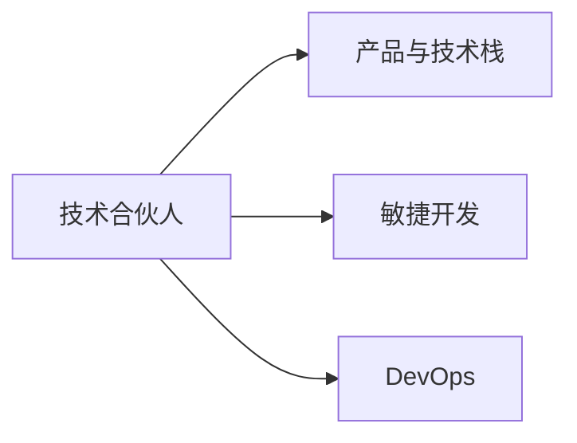

                 

# 技术合伙人：创业路上的角色

## 1. 背景介绍

在当今快速变化的科技和商业环境中，技术合伙人(Technical Co-founder)的角色变得越来越重要。从早期构思到产品上线，技术合伙人不仅是技术的推动者，更是创业团队不可或缺的核心成员。他们的专业技能、创新思维和项目管理能力，直接影响着公司的成功与否。本文将探讨技术合伙人在创业路上的关键角色，及其所需具备的技能和挑战。

## 2. 核心概念与联系

### 2.1 核心概念概述

在探讨技术合伙人的角色之前，首先要明确几个核心概念：

- **技术合伙人(Technical Co-founder)**：即技术联合创始人，负责公司的技术战略、产品开发和团队管理。他们通常在产品构思和原型设计阶段就加入创业团队，以确保技术路径的正确性和可扩展性。
- **产品与技术栈(Product and Tech Stack)**：产品栈（前端、后端、数据库等）和技术栈（编程语言、框架、工具等）是技术合伙人需要深入理解和选择的关键领域，直接影响产品的性能、稳定性和扩展性。
- **敏捷开发(Agile Development)**：一种以用户反馈驱动的软件开发方法，强调快速迭代、持续交付和客户参与。技术合伙人需要具备敏捷思维，能够灵活应对需求变化。
- **DevOps(DevOps)**：结合软件开发(Software Development)和运维(Operations)的文化和技术实践，注重自动化、协作和持续交付。技术合伙人需要推动DevOps文化，提升团队效率和产品质量。

这些概念之间的关系可以用以下Mermaid流程图表示：



### 2.2 核心概念原理和架构

技术合伙人作为创业团队的技术核心，其角色和职责可以概括为以下几个方面：

1. **技术选型与架构设计**：确定产品的技术栈和架构，设计可扩展、易维护的代码和系统结构，确保技术的先进性和未来的可持续性。
2. **项目管理与迭代开发**：运用敏捷开发和Scrum等方法，管理项目进度和团队资源，确保产品的快速迭代和持续交付。
3. **技术人才培养与团队建设**：识别和培养技术人才，构建高效协作的团队文化，推动技术团队持续成长。
4. **产品优化与性能提升**：通过性能测试、优化代码、监控系统等方式，不断提升产品的性能和用户体验。
5. **安全与合规性保障**：确保产品的安全性，遵守相关法规和标准，保护用户数据和隐私。

## 3. 核心算法原理 & 具体操作步骤

### 3.1 算法原理概述

技术合伙人需要掌握的不仅仅是具体技术实现，还包括从系统设计到团队管理的全局视角。以下是几个核心算法原理：

1. **系统设计原则**：遵循SOLID原则、DRY原则、KISS原则等，设计可维护、可扩展的系统架构。
2. **敏捷开发流程**：理解并运用Scrum、Kanban等敏捷开发方法，提高团队协作效率和响应市场变化的能力。
3. **持续集成与持续交付(CI/CD)**：掌握自动化测试、自动化部署等CI/CD工具和实践，实现快速迭代和高质量交付。
4. **DevOps文化**：推动DevOps文化，实现开发和运维的紧密结合，提升团队整体效率和交付质量。
5. **安全与隐私保护**：掌握数据加密、访问控制等安全技术，确保产品和服务的安全性和隐私保护。

### 3.2 算法步骤详解

技术合伙人通常会经历以下几个主要步骤：

1. **市场调研与需求分析**：与业务团队紧密合作，分析市场需求，确定产品的核心功能和用户痛点。
2. **技术选型与架构设计**：根据市场需求和技术趋势，选择适合的技术栈和架构，进行初步设计。
3. **原型开发与测试**：快速开发MVP（最小可行产品）原型，进行用户测试和反馈收集。
4. **产品迭代与优化**：根据用户反馈和市场变化，进行产品迭代和功能优化，提升产品竞争力。
5. **团队建设和人才培养**：招募和培养技术人才，构建高效的开发和运维团队。
6. **推广和市场营销**：与市场团队合作，制定推广策略，提升产品知名度和用户黏性。

### 3.3 算法优缺点

技术合伙人的角色具有以下优点和挑战：

**优点**：

1. **技术优势**：具备扎实的技术背景和专业技能，能够在产品开发和创新中提供关键支持。
2. **系统架构设计**：能够设计高效、可扩展的系统架构，确保产品的长期稳定性和可维护性。
3. **敏捷与创新**：具备敏捷开发和持续迭代的思维，能够快速响应市场变化和用户需求。

**挑战**：

1. **沟通协作**：需要与业务团队紧密合作，理解业务需求和市场变化，进行有效的沟通和协作。
2. **项目管理**：需要管理项目进度和团队资源，平衡技术开发和市场需求的优先级。
3. **技术栈选择**：需要在多样化的技术栈中选择适合的产品技术栈，避免技术债务。
4. **技术人才培养**：需要识别和培养技术人才，构建高效的技术团队。
5. **安全性与合规性**：需要确保产品的安全性，遵守相关法规和标准。

### 3.4 算法应用领域

技术合伙人不仅在创业初期发挥关键作用，其技术和管理能力在公司的各个阶段都至关重要。以下是技术合伙人常见应用领域：

1. **产品研发**：负责产品的技术选型、架构设计、开发和测试。
2. **团队管理**：负责技术团队的人才招募、培训和培养，提升团队效率和士气。
3. **技术创新**：推动技术创新和前沿技术的应用，提升产品的竞争力。
4. **安全与合规**：确保产品的安全性和合规性，保护用户数据和隐私。
5. **市场推广**：与市场团队合作，制定和执行市场推广策略，提升产品知名度和用户黏性。

## 4. 数学模型和公式 & 详细讲解 & 举例说明

在技术合伙人角色中，虽然数学模型和公式不是核心，但理解一些基本的数学概念和公式可以帮助更好地进行系统设计和优化。

### 4.1 数学模型构建

技术合伙人需要理解的基本数学模型包括：

- **线性回归模型**：用于预测连续变量的模型，广泛应用于推荐系统、广告投放等领域。
- **逻辑回归模型**：用于分类问题的模型，常用于用户行为分析、客户分类等。
- **决策树模型**：用于分类和回归问题的模型，具有可解释性强、易于理解的特点。

### 4.2 公式推导过程

以线性回归模型为例，其公式推导过程如下：

$$
\hat{y} = \theta_0 + \theta_1 x_1 + \theta_2 x_2 + \cdots + \theta_n x_n
$$

其中，$\hat{y}$ 表示预测值，$\theta_0, \theta_1, \theta_2, \cdots, \theta_n$ 为模型参数，$x_1, x_2, \cdots, x_n$ 为输入特征。

### 4.3 案例分析与讲解

假设我们要开发一个推荐系统，可以使用线性回归模型预测用户的购买行为。通过收集用户的浏览历史、购买记录、行为数据等特征，建立线性回归模型，预测用户是否会购买某商品。这个案例展示了技术合伙人在数据处理、模型选择和优化等方面的关键作用。

## 5. 项目实践：代码实例和详细解释说明

### 5.1 开发环境搭建

为了快速启动技术合伙人角色，我们需要搭建一个高效的项目开发环境。以下是一个简单的开发环境搭建步骤：

1. **安装开发环境**：选择合适的开发工具（如Visual Studio Code、PyCharm等），安装Python、Node.js等基础环境。
2. **版本控制**：使用Git进行版本控制，确保代码的稳定性和可追溯性。
3. **持续集成(CI)**：使用Jenkins、Travis CI等工具进行持续集成，自动测试和部署。
4. **环境管理**：使用Docker等容器化技术，管理开发和生产环境，确保环境的一致性。

### 5.2 源代码详细实现

以下是一个简单的Python项目示例，展示了技术合伙人如何设计和管理一个推荐系统的代码：

```python
import pandas as pd
from sklearn.linear_model import LinearRegression
from sklearn.model_selection import train_test_split

# 加载数据
data = pd.read_csv('user_behavior.csv')

# 特征工程
X = data[['click_rate', 'view_time', 'search_terms']]
y = data['purchase']

# 划分训练集和测试集
X_train, X_test, y_train, y_test = train_test_split(X, y, test_size=0.2)

# 训练模型
model = LinearRegression()
model.fit(X_train, y_train)

# 评估模型
score = model.score(X_test, y_test)
print('Model score:', score)
```

### 5.3 代码解读与分析

- **数据加载**：使用Pandas库加载用户行为数据，并进行初步清洗和处理。
- **特征工程**：选择和处理输入特征，构建训练集和测试集。
- **模型训练**：使用Scikit-learn库训练线性回归模型，并进行评估。

### 5.4 运行结果展示

通过上述代码，我们可以得到模型在测试集上的评分，评估模型的性能和准确性。

## 6. 实际应用场景

技术合伙人在实际应用场景中，需要处理各种技术和业务问题。以下是几个典型的应用场景：

### 6.1 移动应用开发

技术合伙人需要设计高效、可扩展的移动应用架构，确保应用的性能和用户体验。

### 6.2 云计算平台

技术合伙人需要设计和管理云计算平台，确保数据和服务的可靠性和安全性。

### 6.3 物联网(IoT)项目

技术合伙人需要设计和管理物联网系统，确保设备的互联互通和数据处理能力。

### 6.4 未来应用展望

随着技术的发展，技术合伙人的角色也在不断演变。未来，技术合伙人需要更多关注以下领域：

- **人工智能与机器学习**：应用AI技术提升产品的智能化水平。
- **区块链与去中心化**：探索区块链技术在产品中的应用，提升数据安全和透明度。
- **隐私与合规性**：确保产品的隐私保护和合规性，遵守相关法规和标准。

## 7. 工具和资源推荐

### 7.1 学习资源推荐

- **在线课程**：Coursera、edX等平台的计算机科学和软件工程课程，帮助技术合伙人掌握新技术和工具。
- **技术博客**：Medium、Towards Data Science等平台上的技术博客，分享最新的技术趋势和实践经验。
- **开源项目**：GitHub上的开源项目和代码库，学习最佳实践和代码规范。

### 7.2 开发工具推荐

- **IDE与代码编辑器**：Visual Studio Code、PyCharm、Sublime Text等工具，提供高效的代码编写和调试环境。
- **版本控制**：Git、GitHub、GitLab等版本控制工具，管理代码变更和协作开发。
- **持续集成与部署工具**：Jenkins、Travis CI、Docker等工具，确保代码的持续集成和高效部署。

### 7.3 相关论文推荐

- **《Agile Software Development: Principles, Patterns, and Practices》**：Eric R. Elisabeth和Tom Popendijk合著的经典书籍，深入讲解敏捷开发的原理和实践。
- **《Clean Code: A Handbook of Agile Software Craftsmanship》**：Robert C. Martin著，介绍编写高质量代码的实践和技巧。
- **《The Pragmatic Programmer》**：Andrew Hunt和David Thomas合著的经典书籍，分享软件开发中的实用技巧和最佳实践。

## 8. 总结：未来发展趋势与挑战

### 8.1 研究成果总结

技术合伙人作为创业团队的核心成员，其技能和角色在不断演变和发展。技术合伙人需要掌握全面的技术和管理能力，不断学习和适应新技术和市场变化。

### 8.2 未来发展趋势

技术合伙人的未来趋势包括：

- **技术栈的多样化**：随着新技术的发展，技术合伙人的技术栈需要更加多样化和灵活，能够应对各种技术和业务挑战。
- **敏捷与持续交付**：持续交付和敏捷开发将成为技术合伙人的重要工作内容，确保产品的快速迭代和高质量交付。
- **人工智能与机器学习**：技术合伙人需要掌握AI和ML技术，提升产品的智能化水平和竞争力。
- **区块链与去中心化**：探索区块链技术在产品中的应用，提升数据安全和透明度。
- **隐私与合规性**：确保产品的隐私保护和合规性，遵守相关法规和标准。

### 8.3 面临的挑战

技术合伙人面临的挑战包括：

- **技术栈的选择与维护**：需要不断更新和维护技术栈，确保技术的先进性和适用性。
- **敏捷与持续交付**：需要推动敏捷和持续交付文化，提升团队的协作效率和响应速度。
- **人工智能与机器学习**：需要掌握AI和ML技术，解决实际业务问题。
- **区块链与去中心化**：需要探索区块链技术在产品中的应用，提升数据安全和透明度。
- **隐私与合规性**：需要确保产品的隐私保护和合规性，遵守相关法规和标准。

### 8.4 研究展望

技术合伙人的未来研究方向包括：

- **云计算与大数据**：探索云计算和大数据技术在产品中的应用，提升数据的处理能力和业务决策能力。
- **物联网与边缘计算**：探索物联网和边缘计算技术在产品中的应用，提升设备的互联互通和数据处理能力。
- **自动化与AI运维**：探索自动化和AI运维技术，提升系统的稳定性和可靠性。

## 9. 附录：常见问题与解答

**Q1: 技术合伙人在创业初期需要关注哪些关键问题？**

A: 技术合伙人在创业初期需要关注的关键问题包括：

- **市场调研与需求分析**：与业务团队紧密合作，分析市场需求，确定产品的核心功能和用户痛点。
- **技术选型与架构设计**：根据市场需求和技术趋势，选择适合的技术栈和架构，进行初步设计。
- **团队建设与人才招募**：招募和培养技术人才，构建高效的技术团队。

**Q2: 技术合伙人在产品迭代过程中如何处理技术债务？**

A: 技术合伙人在产品迭代过程中，可以采取以下措施处理技术债务：

- **模块化设计**：将系统拆分为多个模块，独立设计和开发，减少技术债务的累积。
- **代码重构**：定期进行代码重构，优化代码结构和性能，提升系统可维护性。
- **持续集成与自动化测试**：使用持续集成和自动化测试工具，确保代码质量和稳定性，减少技术债务的积累。

**Q3: 技术合伙人在技术选型时需要注意哪些关键因素？**

A: 技术合伙人在技术选型时需要注意的关键因素包括：

- **技术栈的适应性**：选择与业务需求和技术趋势相适应的技术栈，确保技术的长期适用性和可扩展性。
- **社区和生态支持**：选择有活跃社区和丰富生态支持的技术栈，方便获取资源和解决问题。
- **成本与资源**：评估技术的成本和资源需求，确保项目在预算和时间范围内完成。

**Q4: 技术合伙人在产品设计时需要考虑哪些用户需求？**

A: 技术合伙人在产品设计时需要考虑的关键用户需求包括：

- **用户体验**：确保产品的界面友好、操作便捷，提升用户体验和满意度。
- **性能和稳定性**：确保产品的性能和稳定性，满足用户对速度和可靠性的要求。
- **安全性和隐私保护**：确保产品的安全性和隐私保护，避免数据泄露和隐私侵犯。

**Q5: 技术合伙人在团队管理中如何确保团队协作高效？**

A: 技术合伙人在团队管理中，可以采取以下措施确保团队协作高效：

- **明确目标与分工**：与团队成员明确项目目标和任务分工，确保每个人都清楚自己的职责和目标。
- **建立沟通机制**：建立高效的沟通机制，定期进行项目进展汇报和问题讨论，及时解决团队中的问题和障碍。
- **激励与奖励**：设立激励和奖励机制，鼓励团队成员积极参与项目，提升团队士气和凝聚力。

作者：禅与计算机程序设计艺术 / Zen and the Art of Computer Programming

