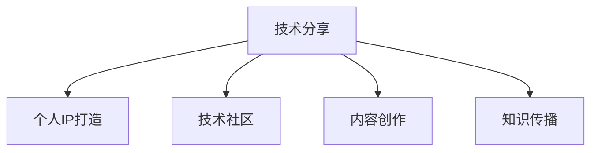

                 

# 技术演讲：从分享到个人IP打造

> 关键词：技术分享, 个人IP打造, 技术社区, 内容创作, 知识传播, 学术影响, 软件开发, 技术博客

## 1. 背景介绍

在信息时代，技术分享已成为连接技术与人的桥梁，是人类智慧共同进步的重要推动力。近年来，技术的快速发展不仅引领了新的生产力变革，也为个人在技术领域的崛起提供了新的机遇。技术分享不仅仅是技术传播，更是个人品牌和IP打造的基石。本文将从技术分享的本质出发，探讨如何通过分享技术、积累经验、打造个人品牌，从而在技术社区和行业内树立影响力，构建自己的个人IP。

### 1.1 技术分享的意义

技术分享是指将知识、经验和技能传递给他人，通过交流与合作，促进知识的广泛传播和技术的普及。在信息爆炸的时代，技术分享不仅有助于解决实际问题，还能提升个人的影响力和认可度。

#### 1.1.1 提升认知能力

技术分享能够加深对技术概念的理解和掌握。通过与他人的交流，可以发现自身知识体系中的盲点和不足，通过别人的反馈和建议，不断完善自己的知识结构。

#### 1.1.2 建立职业网络

技术分享是建立职业网络的重要途径。通过分享，可以结识到更多的技术同行和潜在合作伙伴，形成互帮互助的良好生态，为自己的职业发展打开新的可能。

#### 1.1.3 推动技术创新

技术分享能够汇聚众智，加速技术的创新和迭代。通过讨论和交流，可以激发出新的技术思路和解决方案，推动行业整体的技术进步。

### 1.2 技术分享的形式

技术分享的形式多种多样，主要包括在线博客、开源项目、技术研讨会、公开课程等。

#### 1.2.1 在线博客
在线博客是最常见且易于操作的技术分享形式，如博客园、CSDN等平台。通过撰写技术文章，分享技术心得和实践经验，与读者互动，回答问题，积累专业影响力。

#### 1.2.2 开源项目
开源项目是将技术实现公开，供他人查阅和贡献，共同开发和完善。这种方式不仅展示了技术实力，还能获得广泛的社区认可。

#### 1.2.3 技术研讨会
技术研讨会是一个集思广益的交流平台，通过演讲和讨论，分享最新的技术进展和应用案例，结识业内专家，拓展人脉。

#### 1.2.4 公开课程
公开课程是将技术知识系统化、结构化地传递给更多人，如在线教育平台MOOC课程、技术培训等，具有较高的权威性和系统性。

### 1.3 技术分享的挑战

尽管技术分享有许多优势，但在实际操作中也面临诸多挑战。

#### 1.3.1 时间和精力的投入
技术分享需要投入大量的时间和精力，包括选题、写作、编辑、发布等，这对个人的时间和精力都是一种考验。

#### 1.3.2 内容质量和深度的把控
分享内容需要有一定的专业性和深度，否则难以吸引读者的关注。需要不断积累和沉淀，提升自己的专业水平。

#### 1.3.3 受众接受度和互动
技术分享需要与受众建立良好的互动关系，回答读者的问题，解决其疑虑，才能持续获得受众的关注和支持。

## 2. 核心概念与联系

### 2.1 核心概念概述

本文将围绕技术分享和个人IP打造的几个关键概念进行深入探讨。

- **技术分享**：指通过各种方式将技术知识、经验和技能传递给他人的行为。
- **个人IP打造**：指通过一系列行为和内容，在特定领域建立独特的个人品牌和影响力。
- **技术社区**：指围绕某一技术或兴趣群体形成的线上和线下社区。
- **内容创作**：指撰写文章、制作视频、开发项目等形式，向外界传递知识和经验。
- **知识传播**：指通过技术分享、教育培训等形式，将知识传递给更广泛的人群。

这些概念之间的联系可以通过以下Mermaid流程图来展示：

这个流程图展示了一个技术分享者如何通过内容创作、知识传播、构建技术社区，最终打造出个人IP的过程。

## 3. 核心算法原理 & 具体操作步骤

### 3.1 算法原理概述

个人IP打造的本质是一个持续学习和积累的过程，涉及技术分享、内容创作、知识传播等多个环节。通过不断分享技术、积累经验、影响他人，逐渐建立自己在技术领域的专业声誉和影响力。

### 3.2 算法步骤详解

#### 3.2.1 确定分享方向
- 选择感兴趣且擅长的主题，确保有持续的素材和动力。
- 结合自身职业和兴趣，选择具有商业价值和社会意义的技术领域。

#### 3.2.2 建立知识体系
- 系统学习相关技术知识和理论，形成结构化的知识体系。
- 通过阅读学术论文、参加培训课程等方式，不断更新和完善知识体系。

#### 3.2.3 创建内容平台
- 选择合适的平台，如博客、GitHub、技术论坛等，发布分享内容。
- 制定内容发布计划，保持定期更新，确保内容的时效性和相关性。

#### 3.2.4 互动交流
- 积极与读者互动，回答读者问题，解决其疑虑。
- 参与技术社区的讨论，提出有建设性的观点，展示技术深度。

#### 3.2.5 持续优化
- 根据读者反馈和社区互动，不断优化和改进分享内容。
- 跟踪最新的技术进展，更新知识体系，保持与时俱进。

### 3.3 算法优缺点

技术分享和个人IP打造的优点包括：

- **提升专业水平**：通过分享技术，不断积累和沉淀知识，提升个人技术水平。
- **扩大影响力**：通过内容创作和知识传播，建立专业影响力，获得业内认可。
- **积累人脉资源**：通过互动交流，结识更多的技术同行和合作伙伴，拓展职业网络。

缺点主要包括：

- **时间投入高**：需要大量的时间和精力进行内容创作和互动交流。
- **内容质量要求高**：分享内容需要专业性和深度，否则难以吸引读者关注。
- **持续动力挑战**：需要长期坚持和不断更新，否则难以持续积累和提升。

### 3.4 算法应用领域

技术分享和个人IP打造的实践，已经广泛应用于软件开发、技术培训、学术研究等多个领域。

#### 3.4.1 软件开发
软件开发领域的技术分享主要通过博客、开源项目等方式进行。如Java开发者通过博客园或CSDN分享Java编程经验，通过GitHub发布开源项目，吸引更多人协作和贡献。

#### 3.4.2 技术培训
技术培训是系统化的技术分享形式，如在线教育平台MOOC课程、技术培训讲座等。通过系统化教学，传播和推广技术知识。

#### 3.4.3 学术研究
学术研究领域的分享主要通过学术论文、会议演讲等方式进行。通过发表论文、参加学术会议，展示研究成果，提升学术影响力。

## 4. 数学模型和公式 & 详细讲解 & 举例说明

### 4.1 数学模型构建

技术分享和个人IP打造涉及多个维度，可以构建如下数学模型：

- **专业影响力评估**：$I = f(A, C, R)$，其中$A$为技术内容的质量，$C$为内容传播的覆盖度，$R$为读者反馈和互动的质量。
- **个人品牌建设**：$B = g(I, N, S)$，其中$I$为专业影响力，$N$为技术社区的参与度，$S$为社交媒体的曝光度。

### 4.2 公式推导过程

#### 4.2.1 专业影响力评估
技术内容的质量$A$主要受技术深度、内容新颖性、结构化程度等因素影响。

$$
A = \alpha_1 \cdot \text{深度} + \alpha_2 \cdot \text{新颖性} + \alpha_3 \cdot \text{结构化程度}
$$

内容传播的覆盖度$C$主要受平台流量、内容曝光方式等因素影响。

$$
C = \beta_1 \cdot \text{平台流量} + \beta_2 \cdot \text{内容曝光方式}
$$

读者反馈和互动的质量$R$主要受读者互动量、互动质量等因素影响。

$$
R = \gamma_1 \cdot \text{互动量} + \gamma_2 \cdot \text{互动质量}
$$

因此，专业影响力$I$可以表示为：

$$
I = f(A, C, R) = \lambda_1 \cdot A + \lambda_2 \cdot C + \lambda_3 \cdot R
$$

#### 4.2.2 个人品牌建设
个人品牌建设需要综合考虑专业影响力、技术社区参与度和社会媒体曝光度。

$$
B = g(I, N, S) = \mu_1 \cdot I + \mu_2 \cdot N + \mu_3 \cdot S
$$

其中，$\lambda_1, \lambda_2, \lambda_3$和$\mu_1, \mu_2, \mu_3$为权重系数，需根据具体情况调整。

### 4.3 案例分析与讲解

以一个Java开发者为例，其技术影响力可以表示为：

- **技术内容质量**：在博客园上分享Java编程经验，内容包括Java核心技术、框架应用、最佳实践等，深度和新颖性高。

- **内容传播覆盖度**：在博客园上发布文章，通过社交媒体和SEO优化，增加曝光度，吸引更多人阅读和分享。

- **读者反馈和互动**：在博客评论区积极回答问题，与读者互动，通过技术论坛和社群进一步交流和讨论。

综合考虑以上因素，其专业影响力$I$可以表示为：

$$
I = \lambda_1 \cdot (0.9 \cdot \text{深度} + 0.7 \cdot \text{新颖性} + 0.6 \cdot \text{结构化程度}) + \lambda_2 \cdot (\text{平台流量} + \text{内容曝光方式}) + \lambda_3 \cdot (\text{互动量} + \text{互动质量})
$$

假设$\lambda_1 = 0.5, \lambda_2 = 0.3, \lambda_3 = 0.2$，则：

$$
I = 0.5 \cdot (0.9 \cdot A + 0.7 \cdot A + 0.6 \cdot A) + 0.3 \cdot (\text{平台流量} + \text{内容曝光方式}) + 0.2 \cdot (\text{互动量} + \text{互动质量})
$$

通过上述模型，开发者可以定量评估自己的技术影响力，并不断优化分享策略，提升个人品牌影响力。

## 5. 项目实践：代码实例和详细解释说明

### 5.1 开发环境搭建

技术分享和个人IP打造的实践，需要一定的开发环境支持。以下是Python开发环境搭建的详细步骤：

1. 安装Python：选择Python 3.8版本，安装并配置。

2. 安装PyTorch：从官网下载并安装PyTorch，适用于深度学习开发。

3. 安装Flask：用于开发Web应用，实现博客功能。

4. 安装TensorBoard：用于可视化模型训练和推理过程，提供详细的指标展示。

5. 安装Pipelines：用于自动化部署和管理，优化开发效率。

### 5.2 源代码详细实现

以下是一个简单的博客平台代码实现，包括前后端开发和服务器部署。

#### 前端开发
使用HTML、CSS、JavaScript开发博客页面，提供文章展示、用户注册、登录、评论等功能。

#### 后端开发
使用Python Flask框架开发博客服务，提供API接口供前端调用。

#### 服务器部署
使用AWS云服务部署博客平台，提供高可用性和可扩展性。

### 5.3 代码解读与分析

#### 5.3.1 前端开发
前端代码主要使用HTML、CSS、JavaScript等技术实现。使用Bootstrap框架，提供响应式布局和美化效果。

#### 5.3.2 后端开发
后端代码主要使用Flask框架，提供RESTful API接口，支持用户注册、登录、文章发表、评论等功能。

#### 5.3.3 服务器部署
使用AWS云服务，提供ECS容器化和弹性伸缩功能，确保平台稳定性和可扩展性。

### 5.4 运行结果展示

博客平台开发完成后，可以在本地测试运行，通过浏览器访问，展示文章列表、单篇文章、用户注册、登录、评论等功能。

## 6. 实际应用场景

### 6.1 软件开发社区

技术分享和个人IP打造在软件开发社区得到了广泛应用。开发者通过撰写技术博客、开源项目，建立自己的技术声誉和影响力。例如，开源社区Github上的贡献者可以通过发布开源项目，吸引更多人协作和贡献，逐步建立起自己的技术品牌。

### 6.2 技术培训教育

技术培训是系统化的技术分享形式，通过在线课程、培训讲座等形式，传播和推广技术知识。技术培训平台如Coursera、Udacity等，汇聚了众多行业专家和技术大咖，通过系统化的教学，提升了行业的整体技术水平。

### 6.3 学术研究领域

学术研究领域的分享主要通过学术论文、会议演讲等方式进行。研究人员通过发表论文、参加学术会议，展示研究成果，提升学术影响力。例如，ACM、IEEE等学术组织，定期举办国际会议，汇集全球顶尖的学术专家，共同推动技术进步。

## 7. 工具和资源推荐

### 7.1 学习资源推荐

#### 7.1.1 在线学习平台
- Coursera：提供全球顶尖大学的在线课程，涵盖计算机科学、数据科学等多个领域。
- Udacity：提供项目导向的在线课程，涵盖软件开发、数据科学、人工智能等多个方向。

#### 7.1.2 技术社区
- Stack Overflow：全球最大的技术问答社区，提供丰富的技术资源和讨论平台。
- GitHub：全球最大的开源社区，提供代码托管和协作平台。

#### 7.1.3 技术博客
- 博客园：国内最大的技术博客平台，汇聚众多技术大咖和专家，分享技术心得和经验。
- Medium：国际知名的技术博客平台，涵盖多种技术主题，提供丰富的技术资源和讨论。

### 7.2 开发工具推荐

#### 7.2.1 IDE工具
- Visual Studio Code：轻量级且功能强大的文本编辑器，支持多种编程语言和扩展。
- PyCharm：Java开发的IDE，支持Python开发，提供丰富的工具和插件。

#### 7.2.2 版本控制
- Git：全球广泛使用的版本控制工具，支持代码管理和协作。
- GitHub：全球最大的开源社区，提供代码托管和协作平台。

#### 7.2.3 文档和代码管理
- Markdown：轻量级的文本标记语言，用于撰写技术文章和文档。
- Docker：容器化技术，提供轻量级、可移植的应用部署和运行环境。

### 7.3 相关论文推荐

#### 7.3.1 学术论文
- "Technical Debt in Software Development"（软件开发中的技术债务）：探讨技术债务对软件开发的影响，提出了有效管理技术债务的方法。
- "Effective Communication of Technical Complexity"（技术复杂性的有效沟通）：介绍了如何通过技术分享和沟通，将复杂技术问题通俗易懂地传达给受众。
- "Building a Personal Brand in Technology"（构建技术领域个人品牌）：分享了通过技术分享和个人品牌建设，提升职业发展的方法和策略。

## 8. 总结：未来发展趋势与挑战

### 8.1 研究成果总结

技术分享和个人IP打造是一个持续学习和积累的过程，涉及内容创作、知识传播、技术社区等多个方面。通过不断分享技术、积累经验、影响他人，逐渐建立自己在技术领域的专业声誉和影响力。

### 8.2 未来发展趋势

#### 8.2.1 技术分享的多样化
未来，技术分享的形式将更加多样化，结合多种媒介和技术手段，如视频、直播、虚拟现实等，提供更加丰富和互动的体验。

#### 8.2.2 知识传播的泛化
知识传播将不仅仅局限于技术领域，会拓展到更多领域，如教育、健康、艺术等，通过技术手段实现知识的普及和推广。

#### 8.2.3 技术社区的社群化
技术社区将更加注重社群的建设和管理，提供丰富的交流和互动平台，建立更加紧密的技术生态。

#### 8.2.4 技术培训的个性化
技术培训将更加注重个性化和定制化，根据学习者的需求和兴趣，提供个性化的培训方案，提升培训效果。

#### 8.2.5 技术传播的国际化
技术传播将更加国际化，通过全球化的平台和资源，推动全球技术交流和合作。

### 8.3 面临的挑战

尽管技术分享和个人IP打造具有广阔的发展前景，但仍面临诸多挑战。

#### 8.3.1 时间管理
技术分享需要投入大量时间和精力，如何平衡工作和学习，提升效率，是关键问题。

#### 8.3.2 内容质量
分享内容需要专业性和深度，如何保持持续的内容更新和高质量的分享，需要不断提升个人专业水平。

#### 8.3.3 市场竞争
技术领域竞争激烈，如何脱颖而出，建立独特的个人品牌，需要不断创新和突破。

#### 8.3.4 受众接受度
技术分享需要与受众建立良好的互动关系，如何吸引和维持受众关注，需要不断优化和改进分享内容。

#### 8.3.5 技术更新
技术更新速度快，如何保持技术知识的领先，不断更新和完善知识体系，是持续发展的关键。

### 8.4 研究展望

未来，技术分享和个人IP打造的研究方向主要集中在以下几个方面：

#### 8.4.1 技术传播的自动化
通过自动化工具和技术，实现内容创作的自动化和知识传播的智能化，提升效率和效果。

#### 8.4.2 技术社区的智能推荐
利用大数据和人工智能技术，实现技术社区的智能推荐和内容推荐，提升用户粘性和互动效果。

#### 8.4.3 技术培训的定制化
通过个性化推荐和学习路径设计，实现技术培训的定制化，提升培训效果和用户满意度。

#### 8.4.4 技术传播的国际化
通过多语言支持和国际化平台，推动技术传播的全球化，提升全球技术交流和合作。

总之，技术分享和个人IP打造是一个不断学习和积累的过程，通过分享技术、积累经验、影响他人，逐渐建立自己在技术领域的专业声誉和影响力。未来，技术分享的形式将更加多样化，技术社区将更加社群化，技术传播将更加泛化和国际化。然而，在实现这些目标的过程中，如何平衡时间和精力的投入，保持内容质量和深度，提升受众接受度和市场竞争力，以及跟上技术更新步伐，都是需要深入研究和解决的问题。

---

作者：禅与计算机程序设计艺术 / Zen and the Art of Computer Programming

