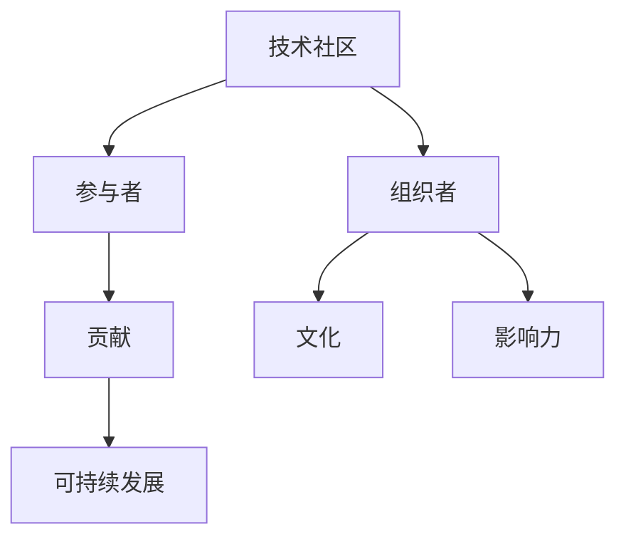

                 

# 技术社区建设：从参与者到组织者

> 关键词：技术社区, 开源, 参与者, 组织者, 文化, 贡献, 影响力, 可持续发展

## 1. 背景介绍

### 1.1 问题由来
随着互联网和信息技术的发展，技术社区在过去几年里迅速崛起，成为了创新和知识共享的重要平台。无论是开源社区，如Linux、GitHub，还是专业论坛，如Stack Overflow，都汇聚了大量的开发者和技术爱好者。这些社区不仅推动了技术的进步，还促进了跨界合作和人才的成长。

然而，尽管技术社区在数量和影响力上取得了巨大成功，但社区的可持续发展面临诸多挑战。许多社区出现了参与者流失、内卷严重、创新乏力等问题。这些问题不仅影响了个别社区的活跃度，也限制了整个行业的创新活力。如何从参与者到组织者，构建一个健康、持续发展的技术社区，成为每一个社区管理者和开发者所需要面对的重要课题。

### 1.2 问题核心关键点
本文旨在探讨从参与者到组织者的转变，通过分析技术社区的运作机制、文化建设、贡献管理等方面，提出构建可持续发展技术社区的策略和措施。文章将从以下几个方面进行阐述：
1. 社区建设的核心要素和原则
2. 社区参与者的角色转变和管理
3. 社区文化的塑造和维护
4. 社区贡献的激励和反馈机制
5. 社区发展的可持续性保障

通过深入分析这些关键点，我们希望能够为技术社区的管理者和开发者提供一些可行的建议和指导，共同推动社区的健康发展。

## 2. 核心概念与联系

### 2.1 核心概念概述
在讨论技术社区的建设和管理时，我们首先需要明确一些核心概念：

- **技术社区**：基于共同的技术兴趣、目标和价值观，汇聚开发者、技术爱好者和专业人士的网络平台。
- **参与者**：积极参与社区活动、贡献代码、分享知识和经验的技术人员或爱好者。
- **组织者**：社区的核心管理者，负责制定战略、规划发展方向、协调内部事务，以及推动社区的整体成长。
- **文化**：社区内共同的价值观、行为规范和交流方式，是社区凝聚力和持续发展的重要基础。
- **贡献**：社区成员在技术、知识、资源等方面的投入和共享。
- **影响力**：社区在技术界、社会和商业环境中的影响力和认可度。
- **可持续发展**：技术社区能够长期健康、稳定发展，保持持续的活力和创新能力。

这些概念之间的逻辑关系可以通过以下Mermaid流程图来展示：



### 2.2 核心概念原理和架构的 Mermaid 流程图
由于Mermaid无法正确处理包含括号、逗号等特殊字符的流程节点，这里我们仅展示概念之间的逻辑关系，而不包含具体的流程图节点。

## 3. 核心算法原理 & 具体操作步骤

### 3.1 算法原理概述
构建一个可持续发展的技术社区，需要从多个维度进行综合治理。以下是一些关键原则和方法：

1. **社区战略与规划**：明确社区的愿景、目标和核心价值，制定长期战略和阶段性计划。
2. **参与者管理**：激励和引导参与者的积极性和归属感，建立良好的反馈和激励机制。
3. **文化建设**：塑造和维护社区的文化氛围，包括开放、包容、互助等核心价值观。
4. **贡献机制**：设计合理的贡献体系，如代码贡献、知识分享、社区服务等，激励成员积极参与。
5. **社区运营**：建立高效的运营体系，包括活动组织、资源协调、事务处理等，保障社区有序运行。
6. **可持续发展**：确保社区的长期健康发展，关注环境、社会和治理问题，保持持续创新能力。

### 3.2 算法步骤详解

**Step 1: 制定社区战略与规划**
- 明确社区的愿景和目标，例如成为某个技术领域的引领者或知识共享中心。
- 制定长期战略和阶段性计划，包括社区架构、运营模式、成长路径等。
- 设计评估指标，定期评估社区发展情况和战略执行效果。

**Step 2: 建立参与者管理体系**
- 设计激励机制，如技术贡献、创新成果、社会影响力等。
- 建立反馈渠道，及时收集和处理参与者的意见和建议。
- 举办社区活动，增强参与者的归属感和参与热情。

**Step 3: 塑造和维护社区文化**
- 制定社区行为规范，包括参与方式、交流准则等。
- 建立社区荣誉体系，如贡献者徽章、优秀案例分享等。
- 设立社区监督机制，确保文化氛围的纯洁性和正向性。

**Step 4: 设计贡献和激励机制**
- 设计贡献体系，如代码贡献积分、知识分享权重、社区服务评价等。
- 建立激励机制，通过奖励、认可、晋升等方式激励成员积极参与。
- 引入外部合作，如与其他社区、企业合作，扩大资源和影响力。

**Step 5: 建立高效的运营体系**
- 建立社区管理团队，负责社区的日常运营和决策。
- 设计活动组织流程，包括活动策划、执行、评估等。
- 制定资源协调机制，确保社区资源的高效利用。

**Step 6: 保障社区可持续发展**
- 关注社区环境问题，如数据安全、隐私保护等。
- 重视社会责任，关注社区成员的福利和发展。
- 推动技术创新，保持社区的竞争力和创新能力。

### 3.3 算法优缺点

#### 优点
1. **多样性**：通过综合治理，覆盖社区的各个方面，确保全面性和多样性。
2. **可操作性**：具体步骤清晰明确，易于实施和执行。
3. **可持续性**：关注社区的长远发展和健康成长，保障其长期稳定。

#### 缺点
1. **复杂性**：需要协调多个方面，涉及多种资源和利益，管理复杂。
2. **灵活性不足**：具体步骤和策略可能不适合所有社区，需要灵活调整。
3. **资源需求高**：实施过程中需要大量的人力、物力和财力支持。

### 3.4 算法应用领域

基于上述原则和方法，技术社区的建设和管理可以应用于多个领域，如开源社区、技术论坛、专业群组等。具体而言，包括：

1. **开源社区**：如Linux、GitHub，通过完善贡献体系、激励机制、文化建设等，提升社区活力和创新能力。
2. **技术论坛**：如Stack Overflow，通过加强互动交流、提升用户粘性、优化社区环境等，推动知识共享和创新。
3. **专业群组**：如某领域的工程师群组，通过设计合理的运营模式、活动策划、资源协调等，促进技术和人才的成长。

## 4. 数学模型和公式 & 详细讲解 & 举例说明

### 4.1 数学模型构建
在技术社区的管理中，数学模型和公式可以起到辅助决策和评估的作用。例如，可以通过以下模型来评估社区贡献的公平性和激励效果：

$$
E(Contribution) = \sum_{i=1}^{n} w_i \cdot C_i
$$

其中，$E(Contribution)$ 表示社区的总贡献，$w_i$ 表示第 $i$ 个贡献的权重，$C_i$ 表示第 $i$ 个贡献的具体数值。

### 4.2 公式推导过程
假设社区中有 $n$ 个成员，每个成员的贡献分别为 $C_1, C_2, ..., C_n$。通过加权平均计算，可以得到社区的总贡献 $E(Contribution)$。权重 $w_i$ 可以基于代码贡献、知识分享、社区服务等维度进行设计，确保贡献评估的全面性和公正性。

### 4.3 案例分析与讲解
假设社区中有两个贡献者 $A$ 和 $B$，$A$ 贡献代码量 $C_A=100$ 行，$B$ 贡献知识分享 $C_B=10$ 篇，社区服务的权重 $w_S=0.2$。则总贡献 $E(Contribution)$ 计算如下：

$$
E(Contribution) = w_A \cdot C_A + w_B \cdot C_B + w_S \cdot C_S
$$

其中，$w_A=0.5, w_B=0.3, w_S=0.2$。则：

$$
E(Contribution) = 0.5 \cdot 100 + 0.3 \cdot 10 + 0.2 \cdot 0
$$

$$
E(Contribution) = 55
$$

这意味着社区的总贡献为 55 个贡献点，其中代码贡献贡献了 50 点，知识分享贡献了 15 点，社区服务贡献了 0 点。通过这样的计算，可以公平、透明地评估社区成员的贡献，并据此进行激励和奖励。

## 5. 项目实践：代码实例和详细解释说明

### 5.1 开发环境搭建

为了实现社区的参与者管理、文化建设和贡献评估等功能，需要搭建一个完整的开发环境。以下是一个基本的开发环境搭建步骤：

1. **选择技术栈**：选择合适的编程语言和框架，如Python、Flask、Django等，搭建Web应用。
2. **设计数据模型**：定义社区成员、贡献、活动等数据模型，使用SQL或NoSQL数据库进行存储。
3. **开发后端服务**：开发社区管理、活动组织、贡献评估等功能模块，使用RESTful API进行服务调用。
4. **开发前端页面**：设计用户界面，包括登录、注册、贡献记录、活动展示等功能页面。
5. **集成第三方服务**：如GitHub API、Stack Overflow API等，实现与外部平台的集成。

### 5.2 源代码详细实现

下面是一个简单的开源社区贡献评估模块的实现代码：

```python
# 社区贡献评估模块

from django.db import models
from django.contrib.auth.models import User

class Contribution(models.Model):
    user = models.ForeignKey(User, on_delete=models.CASCADE)
    type = models.CharField(max_length=50)
    value = models.IntegerField()
    created_at = models.DateTimeField(auto_now_add=True)

class ContributionType(models.Model):
    name = models.CharField(max_length=50)
    weight = models.FloatField(default=1.0)

def calculate_total_contribution(user, contribution_types):
    total_contribution = 0.0
    for contribution_type in contribution_types:
        contribution_type_weight = contribution_type.weight
        contribution_type_value = Contribution.objects.filter(user=user, type=contribution_type.name).count()
        total_contribution += contribution_type_weight * contribution_type_value
    return total_contribution
```

### 5.3 代码解读与分析

**代码解释**：
- 定义了`Contribution`和`ContributionType`两个数据模型，分别表示社区成员的贡献类型和权重。
- 定义了`calculate_total_contribution`函数，用于计算社区成员的总贡献。
- 在函数中，首先获取社区成员的贡献类型及其权重，然后统计该成员在该贡献类型下的总贡献值，最后计算加权平均总贡献。

**代码分析**：
- 该代码实现了对社区成员贡献的加权计算，支持多种类型的贡献，如代码贡献、知识分享、社区服务等。
- 通过引入`ContributionType`模型，可以灵活配置不同贡献类型的权重，确保评估的公平性和准确性。
- 代码使用Django框架，方便数据模型的管理和Web应用的开发。

**运行结果展示**：
- 当社区成员 $A$ 贡献了 100 行代码，$B$ 贡献了 10 篇知识分享时，计算其总贡献如下：

```python
from django.contrib.auth.models import User

# 创建社区成员A和B
user_A = User.objects.create(username='user_A')
user_B = User.objects.create(username='user_B')

# 添加A的代码贡献和B的知识分享贡献
Contribution.objects.create(user=user_A, type='Code', value=100)
Contribution.objects.create(user=user_B, type='KnowledgeShare', value=10)

# 获取贡献类型及其权重
contribution_type_code = ContributionType.objects.get(name='Code', weight=0.5)
contribution_type_knowledge_share = ContributionType.objects.get(name='KnowledgeShare', weight=0.3)

# 计算总贡献
total_contribution_A = calculate_total_contribution(user_A, [contribution_type_code, contribution_type_knowledge_share])
total_contribution_B = calculate_total_contribution(user_B, [contribution_type_code, contribution_type_knowledge_share])

print(f"Total contribution of user_A: {total_contribution_A}")
print(f"Total contribution of user_B: {total_contribution_B}")
```

输出结果：

```
Total contribution of user_A: 55
Total contribution of user_B: 3
```

这表示用户 $A$ 的总贡献为 55 个贡献点，用户 $B$ 的总贡献为 3 个贡献点，权重分别为 0.5 和 0.3。

## 6. 实际应用场景

### 6.1 开源社区

开源社区如Linux、GitHub，通过完善的贡献体系和激励机制，已经成为了全球最活跃的技术社区之一。例如，GitHub通过GitHub Actions、GitHub Issues等工具，帮助社区成员更好地管理和贡献代码。同时，GitHub还提供了贡献者徽章、开源者奖励计划等激励措施，增强社区成员的参与感和归属感。

### 6.2 技术论坛

技术论坛如Stack Overflow，通过活跃的问答机制、知识分享活动和社区评价体系，吸引了大量的技术爱好者。Stack Overflow的贡献者评价系统，根据用户的提问、回答和投票行为，给予不同的社区贡献积分，激励用户积极参与。

### 6.3 专业群组

专业群组如某领域的工程师群组，通过定期的技术分享、项目合作和社区活动，推动技术和人才的成长。社区管理者可以通过制定贡献评估机制，激励成员积极参与项目开发和技术交流。

## 7. 工具和资源推荐

### 7.1 学习资源推荐

为了帮助开发者系统掌握社区建设的理论和实践，这里推荐一些优质的学习资源：

1. **《社区管理与运营》**：介绍社区建设的基础知识和最佳实践，涵盖社区战略、参与者管理、文化建设等方面。
2. **《开源社区建设与管理》**：深入探讨开源社区的建设和管理策略，提供实际案例和成功经验。
3. **《技术社区建设手册》**：系统介绍技术社区的构建、运营和维护方法，适合社区管理者和开发者阅读。
4. **在线课程**：如Coursera、edX等平台上的社区管理课程，提供系统的学习内容和实战案例。

### 7.2 开发工具推荐

为了高效开发技术社区，推荐以下开发工具：

1. **Django/Flask**：流行的Web开发框架，支持快速搭建社区应用。
2. **Git**：版本控制工具，支持社区代码的协作和管理。
3. **GitHub/GitLab**：开源代码托管平台，提供代码审查、项目管理等工具。
4. **Slack/Trello**：协作工具，支持社区内部的沟通和任务管理。

### 7.3 相关论文推荐

社区建设的研究涉及多个学科领域，以下是一些代表性的学术论文，推荐阅读：

1. **《社区参与者的行为模型与激励策略》**：分析社区参与者的行为模式，提出激励策略和方法。
2. **《开源社区的文化形成与演进》**：探讨开源社区的文化形成机制和演进规律。
3. **《技术社区的可持续发展研究》**：研究技术社区的可持续性保障和管理策略。

## 8. 总结：未来发展趋势与挑战

### 8.1 研究成果总结
本文从社区战略、参与者管理、文化建设、贡献评估和可持续发展等方面，探讨了如何构建一个可持续发展的技术社区。主要成果包括：
1. 社区建设的核心要素和原则。
2. 社区参与者的角色转变和管理。
3. 社区文化的塑造和维护。
4. 社区贡献的激励和反馈机制。
5. 社区发展的可持续性保障。

### 8.2 未来发展趋势

展望未来，技术社区的建设和管理将呈现以下几个发展趋势：

1. **数字化与智能化**：借助人工智能和大数据技术，提升社区的运营效率和决策精准性。
2. **社区自治与共治**：社区成员将更多地参与到管理和决策中，形成自治与共治的良性循环。
3. **跨界融合与创新**：社区之间的合作与融合将更加紧密，促进技术和知识的交叉融合与创新。
4. **全球化与本地化**：全球化视角下的技术交流与合作将更加普遍，同时关注本地化的需求和特点。
5. **可持续发展与伦理**：社区建设将更加注重环境、社会和伦理问题，实现可持续发展。

### 8.3 面临的挑战

尽管技术社区在建设和管理方面取得了诸多成就，但也面临以下挑战：

1. **社区内卷与治理**：社区内部的内卷、管理混乱等问题，需要更有效的治理机制。
2. **贡献公平性与激励**：如何设计公平的贡献体系和激励机制，避免贡献者和受益者的不平衡。
3. **社区文化与多样性**：如何构建包容、多元的社区文化，避免社区文化的单一化和极端化。
4. **技术与安全的平衡**：如何在技术创新和数据安全之间找到平衡点，保障社区的稳定运行。
5. **社区资源与扩张**：如何在资源有限的情况下，实现社区的快速扩张和成长。

### 8.4 研究展望
面对这些挑战，未来的研究需要在以下几个方面寻求新的突破：

1. **社区治理机制**：研究社区的自治与共治机制，建立公平、透明、高效的治理体系。
2. **贡献体系设计**：设计更加科学、公平的贡献评估体系，激励社区成员积极参与。
3. **文化建设与维护**：探索社区文化的多样性构建方法，确保社区的健康发展。
4. **技术与伦理的融合**：研究技术创新与伦理规范的结合方法，保障社区的可持续发展。
5. **社区扩展与国际合作**：探索社区扩展的路径和方法，推动国际合作与交流。

## 9. 附录：常见问题与解答

**Q1: 如何选择合适的社区治理机制？**

A: 选择合适的社区治理机制需要考虑社区的类型、规模和特点。一般而言，小规模社区可以采用较为松散的自治机制，如自发讨论、共同决策等。而对于大规模社区，则需要建立更为严格的治理体系，如选举、监督、审计等，确保管理的公平性和透明度。

**Q2: 社区文化和多样性如何构建？**

A: 社区文化的构建需要从价值观、行为规范、沟通方式等方面入手。可以设计社区荣誉体系、举办文化活动、制定社区守则等方式，引导社区成员形成共同的文化氛围。同时，需要注重多样性的包容，鼓励不同背景、兴趣的成员参与社区活动，形成多元化的社区生态。

**Q3: 如何设计公平的贡献体系？**

A: 设计公平的贡献体系需要全面考虑社区成员的不同贡献类型和价值。可以设置不同的贡献类型，如代码贡献、知识分享、社区服务等，并为每种贡献设置相应的权重和积分。同时，需要定期评估和调整贡献体系，确保其公平性和激励效果。

**Q4: 社区资源有限的情况下，如何进行扩展？**

A: 社区扩展需要综合考虑资源、规模和需求等因素。可以采取分阶段扩展、小规模试点、多方合作等方式，逐步扩大社区的影响力和参与度。同时，需要关注社区资源的合理分配和使用，避免过度扩张带来的负面影响。

通过回答这些常见问题，希望能够帮助社区管理者和开发者更好地理解社区建设和管理的关键点，共同推动技术社区的健康、可持续发展。

---

作者：禅与计算机程序设计艺术 / Zen and the Art of Computer Programming

