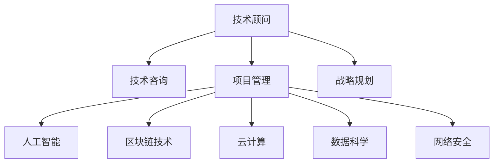

                 

# 技术顾问：高收入的职业选择

> 关键词：高收入, 技术顾问, 职业规划, 计算机科学与工程, 人工智能, 软件工程, 区块链技术, 云计算, 数据科学, 网络安全

## 1. 背景介绍

### 1.1 问题由来

在现代社会，技术职业以其高薪资、稳定发展前景和创新空间受到越来越多人的关注。特别是在人工智能、云计算、数据科学等新兴技术领域，技术顾问成为高收入、高社会地位的职业选择之一。本文将探讨技术顾问这一职业的兴起背景，深入分析其职业优势和发展路径，为有志于此方向的人提供规划和建议。

### 1.2 问题核心关键点

技术顾问主要聚焦于为企业提供技术咨询、项目管理和战略规划等服务。通过这一职业，个人不仅可以获取丰厚的收入，还能在技术前沿领域积累经验，推动企业技术发展。高收入的关键点在于专业技能、市场需求和个人品牌。

1. **专业技能**：掌握计算机科学与工程、人工智能、数据科学等核心技术。
2. **市场需求**：技术顾问服务的需求与企业数字化转型、智能化升级密切相关。
3. **个人品牌**：建立专业形象，增强市场竞争力。

## 2. 核心概念与联系

### 2.1 核心概念概述

为更好地理解技术顾问职业，本节将介绍几个关键概念及其联系：

- **技术顾问**：提供技术咨询、项目管理、战略规划等服务的职业角色。
- **技术咨询**：根据企业需求，提供专业技术和方案，帮助企业解决问题。
- **项目管理**：协调技术资源，确保项目按时、按预算完成。
- **战略规划**：为企业制定长期技术发展战略，指导技术方向和投资。
- **人工智能**：以数据为基础，通过机器学习、深度学习等技术解决复杂问题。
- **区块链技术**：一种去中心化的分布式账本技术，具有安全、透明的特点。
- **云计算**：提供按需计算资源，支持企业云计算项目。
- **数据科学**：利用数据处理、分析技术，发掘数据价值，驱动决策。
- **网络安全**：保护企业数据和网络安全，防止数据泄露和攻击。

这些概念之间的逻辑关系可以通过以下Mermaid流程图来展示：



这个流程图展示了一个技术顾问提供服务的主要领域及其核心概念的关联性：

1. 技术顾问通过提供技术咨询、项目管理、战略规划等专业服务，支撑企业发展。
2. 技术咨询利用人工智能、区块链、云计算等技术解决实际问题。
3. 项目管理涉及到数据科学和网络安全技术，保障项目顺利进行。

## 3. 核心算法原理 & 具体操作步骤

### 3.1 算法原理概述

技术顾问的核心工作是基于技术和市场分析，为企业提供专业咨询。这一过程涉及大量的数据分析和模型构建，其算法原理可以归结为以下几个关键步骤：

1. **数据收集与预处理**：从企业内部和外部收集相关数据，并进行清洗、归一化等预处理。
2. **模型构建与训练**：基于收集到的数据，构建和训练适合的技术模型，如机器学习模型、神经网络模型等。
3. **数据分析与解读**：对模型输出结果进行分析，提供基于数据的决策建议。
4. **方案设计与实施**：基于分析结果，设计并实施具体技术方案，并监控项目进展。

### 3.2 算法步骤详解

技术顾问的算法步骤主要包括以下几个方面：

1. **需求分析**：与企业沟通，明确需求和目标，确保项目方向与企业需求一致。
2. **数据收集**：收集相关数据，包括企业内部数据和行业公开数据。
3. **数据处理**：清洗数据，处理缺失值和异常值，进行特征工程。
4. **模型构建**：选择合适的算法和工具，构建和训练模型。
5. **结果验证**：对模型进行验证和调优，确保其准确性和鲁棒性。
6. **报告编制**：根据分析结果编制报告，提供决策建议。
7. **方案实施**：与企业合作，将分析结果应用于实际项目。
8. **项目监控**：持续监控项目进展，及时调整方案。

### 3.3 算法优缺点

技术顾问的算法步骤具有以下优点：

- **数据驱动**：利用数据分析和模型构建，提供基于数据的决策依据。
- **灵活性**：可以根据企业需求，快速调整方案，灵活应对市场变化。
- **准确性**：通过模型调优，提高分析和建议的准确性。

同时，也存在以下局限性：

- **数据质量依赖**：模型的准确性高度依赖于数据的质量和全面性。
- **技术复杂性**：需要具备较高的技术背景，对数据处理、模型构建有较深理解。
- **市场变化风险**：技术顾问的服务需求随市场变化而变化，存在不确定性。

### 3.4 算法应用领域

技术顾问的服务范围广泛，涉及多个领域，包括但不限于：

1. **金融科技**：提供金融行业技术咨询，包括区块链技术应用、大数据分析等。
2. **电子商务**：协助企业构建智能推荐系统，优化运营策略。
3. **医疗健康**：指导医疗机构应用人工智能技术，提高诊疗效率。
4. **制造业**：提供工业4.0解决方案，推动智能制造。
5. **教育科技**：帮助教育机构部署云计算、数据科学，提升教育质量。
6. **网络安全**：为企业提供安全防护和风险管理方案。

这些应用领域反映了技术顾问在各个行业中的广泛需求和巨大发展潜力。

## 4. 数学模型和公式 & 详细讲解

### 4.1 数学模型构建

技术顾问的数学模型构建主要围绕数据分析和预测建模。以下是一个典型的基于机器学习模型构建的框架：

1. **数据收集**：从企业内部和外部收集相关数据，包括用户行为数据、市场数据等。
2. **数据预处理**：对数据进行清洗、归一化等预处理，确保数据质量。
3. **特征工程**：构建和选择特征，提升模型的泛化能力。
4. **模型选择与训练**：选择合适的模型（如回归模型、分类模型、聚类模型等）进行训练。
5. **结果验证**：使用交叉验证、ROC曲线等方法验证模型性能。

### 4.2 公式推导过程

以一个简单的回归模型为例，其公式推导如下：

设 $y$ 为目标变量，$X$ 为特征向量，模型为线性回归模型：

$$
y = \beta_0 + \beta_1 x_1 + \beta_2 x_2 + \ldots + \beta_n x_n + \epsilon
$$

其中，$\beta$ 为回归系数，$\epsilon$ 为误差项。通过最小二乘法求解 $\beta$，使 $y$ 的预测值 $\hat{y}$ 与实际值 $y$ 的误差最小化：

$$
\min_{\beta} \sum_{i=1}^n (y_i - \hat{y}_i)^2
$$

求解得到 $\beta$ 的公式为：

$$
\beta = (X^TX)^{-1}X^Ty
$$

### 4.3 案例分析与讲解

假设某电商企业希望提高销售额，技术顾问使用历史销售数据进行回归模型预测：

1. **数据收集**：收集企业历史销售数据、促销活动数据、用户行为数据等。
2. **数据预处理**：清洗数据，处理缺失值和异常值。
3. **特征工程**：选择用户活跃度、促销活动频次等特征。
4. **模型训练**：使用线性回归模型训练，预测未来的销售量。
5. **结果验证**：使用交叉验证验证模型预测准确性，调整模型参数。
6. **报告编制**：分析模型结果，提出优化销售策略建议。

## 5. 项目实践：代码实例和详细解释说明

### 5.1 开发环境搭建

以下是使用Python进行数据分析和模型训练的环境配置流程：

1. 安装Anaconda：从官网下载并安装Anaconda，用于创建独立的Python环境。
2. 创建并激活虚拟环境：
```bash
conda create -n analysis-env python=3.8 
conda activate analysis-env
```

3. 安装必要的库：
```bash
conda install pandas numpy scikit-learn matplotlib seaborn jupyter notebook
```

完成上述步骤后，即可在`analysis-env`环境中进行数据分析和模型训练。

### 5.2 源代码详细实现

下面是一个简单的线性回归模型训练代码示例：

```python
import pandas as pd
from sklearn.linear_model import LinearRegression
from sklearn.model_selection import train_test_split
from sklearn.metrics import mean_squared_error

# 数据收集
df = pd.read_csv('sales_data.csv')

# 数据预处理
df = df.dropna()  # 删除缺失值

# 特征工程
X = df[['promo', 'active_users', 'customer_age']]
y = df['sales']

# 模型训练
X_train, X_test, y_train, y_test = train_test_split(X, y, test_size=0.2)
model = LinearRegression()
model.fit(X_train, y_train)

# 结果验证
y_pred = model.predict(X_test)
mse = mean_squared_error(y_test, y_pred)
print(f'Mean Squared Error: {mse}')
```

### 5.3 代码解读与分析

让我们详细解读一下关键代码的实现细节：

1. **数据收集与预处理**：使用`pandas`库读取CSV文件，删除缺失值。
2. **特征工程**：选择促销活动、用户活跃度、客户年龄等特征。
3. **模型训练**：使用`LinearRegression`模型进行训练，通过`train_test_split`将数据分为训练集和测试集。
4. **结果验证**：计算测试集的均方误差，评估模型预测准确性。

## 6. 实际应用场景

### 6.1 金融科技

在金融科技领域，技术顾问可以利用区块链技术、大数据分析等手段，为企业提供金融科技解决方案。例如，利用区块链技术实现智能合约，降低交易成本和风险；通过大数据分析，优化风险管理策略。

### 6.2 电子商务

电子商务领域的技术顾问可以帮助企业构建智能推荐系统，优化运营策略。通过分析用户行为数据，使用机器学习算法预测用户偏好，实现个性化推荐。

### 6.3 医疗健康

在医疗健康领域，技术顾问可以指导医疗机构应用人工智能技术，提高诊疗效率。例如，使用深度学习模型进行疾病诊断，使用自然语言处理技术分析医疗记录，提供诊断建议。

### 6.4 未来应用展望

未来，技术顾问在更多领域将发挥重要作用：

1. **人工智能与医疗结合**：推动AI在医疗诊断、治疗、健康管理中的应用。
2. **云计算与企业数字化转型**：通过云计算技术，推动企业数字化转型，提升运营效率。
3. **数据科学在金融领域的应用**：通过数据科学技术，优化金融产品设计，提高风险管理能力。
4. **网络安全与数字资产保护**：提供网络安全防护方案，保护企业数据和网络安全。

## 7. 工具和资源推荐

### 7.1 学习资源推荐

为了帮助技术顾问快速掌握相关技能，这里推荐一些优质的学习资源：

1. Coursera《机器学习》课程：由斯坦福大学提供，系统讲解机器学习算法和应用。
2. Udacity《数据科学与机器学习纳米学位》：涵盖数据科学、机器学习、深度学习等领域的知识。
3. Kaggle竞赛平台：提供大量数据集和竞赛，实践数据处理和模型构建技能。
4. GitHub开源项目：参与和贡献开源项目，积累实战经验。
5. Medium博客：阅读技术文章和论文，了解最新技术动态。

通过对这些资源的学习实践，相信技术顾问可以系统掌握相关技术和方法，提升个人竞争力。

### 7.2 开发工具推荐

高效的工具是技术顾问快速开发的保障。以下是几款常用的开发工具：

1. Python：灵活的编程语言，广泛应用于数据分析和机器学习。
2. Jupyter Notebook：交互式笔记本，便于数据处理和模型构建。
3. Matplotlib：可视化工具，用于绘制图表，分析数据。
4. Scikit-learn：机器学习库，提供多种模型和算法实现。
5. TensorFlow：深度学习框架，支持复杂的模型构建和训练。

合理利用这些工具，可以显著提升技术顾问的工作效率，加快技术创新迭代。

### 7.3 相关论文推荐

技术顾问的职业发展离不开持续的学习和研究。以下是几篇奠基性的相关论文，推荐阅读：

1. 《Linear Regression: Concepts, Applications, and Best Practices》：介绍线性回归模型的基本概念和应用。
2. 《Blockchain: Principles, Architecture, and Applications》：讲解区块链技术的基本原理和应用场景。
3. 《Machine Learning: A Probabilistic Perspective》：机器学习领域的经典教材，涵盖基本算法和应用。
4. 《Deep Learning》：深度学习领域的权威教材，讲解深度学习模型的原理和应用。
5. 《Data Science: Principles and Practices》：数据科学领域的教材，涵盖数据处理、分析和可视化技术。

这些论文代表了大数据、人工智能和区块链技术的发展脉络。通过学习这些前沿成果，可以帮助技术顾问把握学科前进方向，激发更多的创新灵感。

## 8. 总结：未来发展趋势与挑战

### 8.1 总结

本文对技术顾问这一高收入职业的兴起背景和职业优势进行了系统介绍。通过详细分析技术顾问的核心工作流程和数学模型，结合实际应用案例，揭示了技术顾问在各个领域中的广泛需求和发展潜力。同时，本文还推荐了丰富的学习资源和开发工具，为有志于此方向的人提供了全面的指导和建议。

通过本文的系统梳理，可以看到，技术顾问职业在现代社会中扮演着越来越重要的角色。其高收入和高社会地位得益于专业技能、市场需求和个人品牌的多重加持。未来，随着技术的不断进步，技术顾问的就业前景将更加广阔，成为更多有志之士的职业选择。

### 8.2 未来发展趋势

技术顾问的未来发展趋势包括：

1. **人工智能与医疗结合**：推动AI在医疗诊断、治疗中的应用，提升医疗服务水平。
2. **云计算与企业数字化转型**：通过云计算技术，推动企业数字化转型，提升运营效率。
3. **数据科学在金融领域的应用**：通过数据科学技术，优化金融产品设计，提高风险管理能力。
4. **网络安全与数字资产保护**：提供网络安全防护方案，保护企业数据和网络安全。

### 8.3 面临的挑战

尽管技术顾问的职业前景广阔，但也面临诸多挑战：

1. **数据质量**：高质量的数据是模型准确性的基础，但获取和处理高质量数据往往需要大量时间和资源。
2. **技术复杂性**：技术顾问需要具备较高的技术背景，对数据处理、模型构建有较深理解。
3. **市场变化**：技术顾问的服务需求随市场变化而变化，存在不确定性。
4. **道德与伦理**：技术顾问需遵守道德规范，避免技术滥用，确保技术应用符合伦理标准。

### 8.4 研究展望

未来，技术顾问的研究可以从以下几个方向寻求新的突破：

1. **跨领域技术融合**：将人工智能、大数据、区块链等技术结合，提供更加综合性的解决方案。
2. **自动化与智能决策**：开发自动化工具，提升技术顾问的工作效率，增强智能决策能力。
3. **多模态数据处理**：利用图像、语音、文本等多模态数据，提升数据分析和预测的准确性。
4. **模型解释性与可解释性**：增强模型的可解释性，提供透明的决策依据，提升用户信任度。

这些研究方向将推动技术顾问职业向更加智能化、普适化的方向发展，为技术顾问带来更广阔的应用空间和更多的机遇。

## 9. 附录：常见问题与解答

**Q1：如何成为技术顾问？**

A: 成为技术顾问需要具备以下条件：
1. 掌握计算机科学与工程、人工智能、数据科学等核心技术。
2. 具备良好的沟通和协调能力，能够理解企业需求。
3. 持续学习和实践，提升专业技能。

**Q2：技术顾问的职业发展路径是怎样的？**

A: 技术顾问的职业发展路径可以分为以下几个阶段：
1. 初级阶段：从数据分析、模型构建等基础工作开始，积累实战经验。
2. 中级阶段：承担项目管理和战略规划等高级职责，提升综合能力。
3. 高级阶段：成为行业专家，指导企业技术发展，参与战略决策。

**Q3：技术顾问需要掌握哪些工具和技能？**

A: 技术顾问需要掌握以下工具和技能：
1. Python、R等编程语言。
2. 数据分析工具如Pandas、NumPy。
3. 机器学习框架如Scikit-learn、TensorFlow。
4. 可视化工具如Matplotlib、Seaborn。
5. 项目管理工具如JIRA、Trello。

**Q4：技术顾问在职业发展过程中需要注意哪些问题？**

A: 技术顾问在职业发展过程中需要注意以下问题：
1. 持续学习和提升技能，保持技术前沿。
2. 建立个人品牌，增强市场竞争力。
3. 合理规划职业路径，定期评估和调整。
4. 关注行业动态，紧跟市场需求变化。

通过本文的系统梳理和建议，希望有志于技术顾问职业的读者能更好地规划和发展自己的职业生涯。不断提升自身专业技能和市场竞争力，最终实现职业目标。

---

作者：禅与计算机程序设计艺术 / Zen and the Art of Computer Programming

