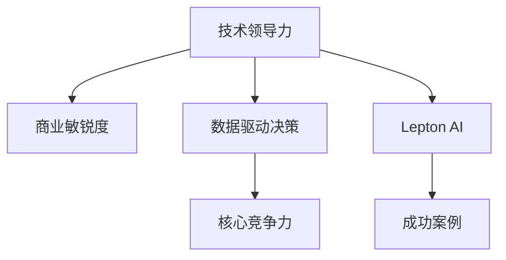

                 

# 技术领导力与商业敏锐度：Lepton AI的核心竞争力

> 关键词：技术领导力, 商业敏锐度, AI算法, 数据驱动决策, 核心竞争力, Lepton AI

## 1. 背景介绍

### 1.1 问题由来
随着人工智能(AI)技术的迅猛发展，科技企业逐渐成为各行各业的核心竞争力。然而，并非所有企业都能通过技术创新取得突破。尽管许多企业雇佣了顶级AI专家，研发了先进算法，但缺乏战略性规划和商业模式创新，难以形成强大的技术领导力和商业敏锐度，最终陷入技术困境。

### 1.2 问题核心关键点
Lepton AI作为业界顶尖的AI技术公司，其成功的关键在于打造了一支具备技术领导力和商业敏锐度的团队，并通过数据驱动决策实现战略性突破。Lepton AI的核心竞争力包括：

1. **强大的技术能力**：汇聚顶尖AI专家，掌握前沿技术，如深度学习、自然语言处理、计算机视觉等。
2. **精准的商业洞察**：具备敏锐的市场感知，精准捕捉客户需求，提供高度定制化解决方案。
3. **数据驱动决策**：通过大规模数据分析，发现技术趋势和商业机会，制定科学决策。
4. **高效的团队协作**：构建高效的团队和协作机制，促进技术创新和商业实践的深度融合。

### 1.3 问题研究意义
Lepton AI的成功案例对于科技企业具有重要的借鉴意义，尤其是在当前AI技术深度渗透各行各业的背景下，如何结合技术创新和商业洞察，提升整体竞争力，成为所有企业关注的焦点。本文将系统阐述Lepton AI如何通过技术领导力和商业敏锐度实现核心竞争力的构建，为科技企业提供实战性指导。

## 2. 核心概念与联系

### 2.1 核心概念概述

为更好地理解Lepton AI的成功路径，我们将介绍几个关键概念及其相互联系：

- **技术领导力(Technical Leadership)**：指企业内部AI专家或团队在技术研发和应用上的核心驱动力和创造力，具备行业领先的技术水平和持续创新能力。
- **商业敏锐度(Business Acumen)**：指企业在识别和把握市场机会、制定战略性决策、应用AI技术提升业务价值等方面的能力，具备市场洞察力和商业模式创新能力。
- **数据驱动决策(Data-Driven Decision Making)**：指基于大量数据进行分析，从而制定科学决策的过程，确保决策的准确性和有效性。
- **核心竞争力(Core Competency)**：指企业内部具有独特优势的核心技术、管理和运营能力，能够带来持续的竞争优势。
- **Lepton AI**：本文案例分析的AI技术公司，其成功经验具有高度可复制性和参考价值。

这些概念之间的逻辑关系可以通过以下Mermaid流程图来展示：



这个流程图展示了一支具备技术领导力和商业敏锐度的Lepton AI团队，通过数据驱动决策构建核心竞争力，并实现成功。

## 3. 核心算法原理 & 具体操作步骤
### 3.1 算法原理概述

Lepton AI的核心竞争力主要体现在以下几个关键算法和操作步骤上：

1. **数据挖掘和预处理**：从海量数据中挖掘有价值的信息，并进行数据清洗和特征提取，为模型训练提供高质量数据。
2. **模型选择和优化**：根据业务需求选择合适的AI模型，并通过优化算法提升模型性能，如深度学习模型、决策树、随机森林等。
3. **模型训练和验证**：通过大规模数据训练模型，并进行交叉验证，确保模型的泛化能力和鲁棒性。
4. **应用部署和迭代**：将训练好的模型部署到实际应用中，并根据反馈数据不断迭代优化模型，提升应用效果。

### 3.2 算法步骤详解

**Step 1: 数据收集与预处理**

- 使用网络爬虫和数据集成工具，如Python的requests、BeautifulSoup、Pandas等，收集相关的数据。
- 对数据进行清洗和预处理，包括去除无效数据、填充缺失值、标准化等，确保数据质量和一致性。

**Step 2: 数据探索与特征工程**

- 利用Python的Matplotlib、Seaborn、Pandas等工具，进行数据可视化，探索数据特征和分布规律。
- 根据业务需求和模型要求，设计合适的特征工程流程，提取关键特征。

**Step 3: 模型训练与验证**

- 使用Python的scikit-learn、TensorFlow、PyTorch等框架，构建和训练机器学习模型。
- 通过交叉验证评估模型性能，选择最优模型。

**Step 4: 模型应用与迭代**

- 将训练好的模型部署到实际应用中，如网站、应用程序、移动端等。
- 收集用户反馈数据，根据反馈不断调整和优化模型，进行持续迭代。

### 3.3 算法优缺点

Lepton AI在数据驱动决策过程中，遵循以下原则：

**优点**：
1. **精准决策**：数据驱动决策基于实证数据，减少主观偏差，提升决策精准性。
2. **市场洞察**：通过数据分析识别市场趋势和机会，实现差异化竞争。
3. **持续优化**：基于数据反馈持续优化模型，提升应用效果。

**缺点**：
1. **数据质量依赖**：数据驱动决策的效果高度依赖数据质量，数据偏差可能影响决策。
2. **计算成本高**：大规模数据分析和模型训练需要大量计算资源，成本较高。
3. **模型复杂性**：复杂模型可能难以解释，影响业务理解和决策部署。

### 3.4 算法应用领域

Lepton AI的技术领导力和商业敏锐度在多个领域得到了广泛应用，包括：

- **金融科技**：通过数据分析和机器学习模型，提升风险控制和欺诈检测能力。
- **电商零售**：通过用户行为分析，提升个性化推荐和营销效果。
- **医疗健康**：通过病历数据挖掘，辅助诊断和治疗决策。
- **智能制造**：通过设备数据实时监控和分析，优化生产流程和效率。

这些应用领域充分展示了Lepton AI的技术能力和商业敏锐度，为不同行业的数字化转型提供了有力支持。

## 4. 数学模型和公式 & 详细讲解  
### 4.1 数学模型构建

Lepton AI在数据驱动决策过程中，主要利用统计学和机器学习模型的数学模型进行建模和分析。

以回归分析为例，设随机变量$Y$为因变量，$X_1, X_2, ..., X_n$为自变量，回归模型可表示为：

$$
Y = \beta_0 + \beta_1X_1 + \beta_2X_2 + ... + \beta_nX_n + \epsilon
$$

其中$\beta_0$为截距，$\beta_1, \beta_2, ..., \beta_n$为系数，$\epsilon$为随机误差项。利用最小二乘法，通过求解$\sum_{i=1}^n (Y_i - \hat{Y}_i)^2$最小化，得到回归模型参数。

### 4.2 公式推导过程

以线性回归为例，回归模型的最小二乘法公式为：

$$
\hat{\beta} = (X^TX)^{-1}X^TY
$$

其中$\hat{\beta}$为回归系数，$X^TX$为矩阵，$X^TY$为矩阵乘法。

假设数据集为$(X_1, Y_1), (X_2, Y_2), ..., (X_n, Y_n)$，则：

$$
X = \begin{bmatrix}
1 & x_{11} & x_{12} & ... & x_{1n} \\
1 & x_{21} & x_{22} & ... & x_{2n} \\
... & ... & ... & ... & ... \\
1 & x_{n1} & x_{n2} & ... & x_{nn} 
\end{bmatrix}, 
Y = \begin{bmatrix}
y_1 \\
y_2 \\
... \\
y_n 
\end{bmatrix}, 
\epsilon = \begin{bmatrix}
\epsilon_1 \\
\epsilon_2 \\
... \\
\epsilon_n 
\end{bmatrix}
$$

其中$x_{ij}$为第$i$个样本的第$j$个自变量，$y_i$为第$i$个样本的因变量，$\epsilon_i$为第$i$个样本的随机误差。

### 4.3 案例分析与讲解

假设某电商平台希望通过用户历史行为数据预测其未来购买概率，可以选择线性回归模型进行建模。具体步骤如下：

1. **数据收集与预处理**：收集用户的历史购买记录、浏览记录、评价记录等数据，进行清洗和标准化处理。
2. **数据探索与特征工程**：通过可视化工具探索数据分布和特征关系，设计关键特征，如用户活跃度、购买频率、浏览时长等。
3. **模型训练与验证**：使用线性回归模型进行训练，并通过交叉验证评估模型性能。
4. **模型应用与迭代**：将训练好的模型部署到推荐系统中，根据用户实时行为数据预测其购买概率，并根据反馈不断调整和优化模型。

通过这一过程，电商平台能够实现更精准的个性化推荐，提升用户体验和销售转化率。

## 5. 项目实践：代码实例和详细解释说明
### 5.1 开发环境搭建

以下是使用Python进行数据驱动决策的开发环境配置流程：

1. 安装Anaconda：从官网下载并安装Anaconda，用于创建独立的Python环境。

2. 创建并激活虚拟环境：
```bash
conda create -n data-env python=3.8 
conda activate data-env
```

3. 安装Python依赖包：
```bash
pip install pandas numpy scikit-learn matplotlib seaborn
```

4. 安装数据分析工具：
```bash
pip install pyspark
```

5. 安装机器学习库：
```bash
pip install scikit-learn
```

完成上述步骤后，即可在`data-env`环境中进行数据驱动决策的开发实践。

### 5.2 源代码详细实现

下面以电商平台用户购买预测为例，给出使用Pandas和scikit-learn库进行数据驱动决策的PyTorch代码实现。

```python
import pandas as pd
from sklearn.model_selection import train_test_split
from sklearn.linear_model import LinearRegression
from sklearn.metrics import mean_squared_error
from sklearn.preprocessing import StandardScaler

# 读取数据
df = pd.read_csv('user_purchase_data.csv')

# 数据预处理
features = ['user_age', 'purchase_frequency', 'browsing_time']
target = 'purchase_probability'
X = df[features]
y = df[target]

# 数据标准化
scaler = StandardScaler()
X = scaler.fit_transform(X)

# 数据分割
X_train, X_test, y_train, y_test = train_test_split(X, y, test_size=0.2, random_state=42)

# 模型训练
model = LinearRegression()
model.fit(X_train, y_train)

# 模型评估
y_pred = model.predict(X_test)
mse = mean_squared_error(y_test, y_pred)
print(f"MSE: {mse}")

# 模型应用
user_features = [[28, 10, 60]]
user_features_scaled = scaler.transform(user_features.reshape(-1, 3))
predicted_probability = model.predict(user_features_scaled)[0]
print(f"Predicted Purchase Probability: {predicted_probability}")
```

### 5.3 代码解读与分析

让我们再详细解读一下关键代码的实现细节：

**数据预处理**：
- 使用`pd.read_csv`函数读取用户购买数据，并进行预处理，提取特征和目标变量。
- 使用`StandardScaler`对特征进行标准化处理，确保数据一致性。

**模型训练与评估**：
- 使用`LinearRegression`建立线性回归模型，并通过`fit`方法训练模型。
- 使用`mean_squared_error`计算模型预测值与真实值之间的均方误差，评估模型性能。

**模型应用**：
- 使用训练好的模型对新用户进行预测，利用`predict`方法计算预测值。

通过这一过程，电商平台能够实现基于用户行为的购买概率预测，提升个性化推荐效果。

## 6. 实际应用场景
### 6.1 电商零售

基于Lepton AI的技术领导力和商业敏锐度，电商零售企业在数据驱动决策方面取得了显著成效。具体应用包括：

- **用户行为分析**：通过数据分析和机器学习模型，识别用户购买模式和行为特征，实现精准营销。
- **库存管理**：根据历史销售数据和市场趋势，优化库存分配和补货策略，提升库存周转率。
- **价格优化**：结合需求预测和成本数据，制定动态定价策略，提高销售利润率。

### 6.2 金融科技

金融科技领域同样受益于Lepton AI的技术领导力和商业敏锐度。具体应用包括：

- **风险控制**：通过数据分析和机器学习模型，评估贷款申请人的信用风险，优化风险管理策略。
- **欺诈检测**：利用模型识别异常交易行为，实时监测和拦截欺诈行为，保护客户资产安全。
- **金融产品推荐**：基于用户历史行为和市场数据，推荐符合其需求和偏好的金融产品，提升客户满意度。

### 6.3 医疗健康

医疗健康领域的数字化转型也离不开Lepton AI的技术支持。具体应用包括：

- **疾病预测**：通过病历数据挖掘和机器学习模型，预测患者患病风险，提前进行预防和干预。
- **诊断辅助**：利用模型辅助医生进行疾病诊断，提高诊断准确率和效率。
- **治疗方案优化**：根据患者历史数据和最新研究，推荐个性化治疗方案，提升治疗效果。

### 6.4 智能制造

智能制造领域通过Lepton AI的数据驱动决策，提升了生产效率和质量。具体应用包括：

- **设备故障预测**：通过实时监控设备数据，预测设备故障发生概率，提前进行维护和检修。
- **生产流程优化**：利用数据分析优化生产流程，提高生产效率和产品质量。
- **资源管理**：结合市场需求和生产数据，优化资源分配和调度，降低生产成本。

## 7. 工具和资源推荐
### 7.1 学习资源推荐

为了帮助开发者系统掌握数据驱动决策的理论基础和实践技巧，这里推荐一些优质的学习资源：

1. 《Python数据分析与可视化》系列博文：深入浅出地介绍了Python在数据分析和可视化中的应用。
2. 《数据科学与机器学习》课程：Kaggle提供的数据科学入门课程，覆盖了数据预处理、特征工程、模型训练等关键环节。
3. 《数据驱动的商业决策》书籍：详细阐述了数据驱动决策的方法论和应用场景，适合进阶学习。
4. GitHub上Lepton AI的代码库：提供了大量的数据驱动决策项目，可供学习和参考。
5. Coursera上的《数据科学专业》课程：由多位知名数据科学家授课，涵盖数据驱动决策的各个方面。

通过对这些资源的学习实践，相信你一定能够快速掌握数据驱动决策的精髓，并用于解决实际的业务问题。

### 7.2 开发工具推荐

高效的开发离不开优秀的工具支持。以下是几款用于数据驱动决策开发的常用工具：

1. Python：Python作为数据科学的标准语言，支持大量数据分析和机器学习库，易于使用。
2. Jupyter Notebook：交互式编程环境，便于代码测试和数据可视化。
3. TensorBoard：TensorFlow配套的可视化工具，实时监测模型训练状态，提供丰富的图表呈现方式。
4. Weights & Biases：模型训练的实验跟踪工具，记录和可视化模型训练过程中的各项指标，方便对比和调优。
5. Pandas：Python的数据处理库，支持数据清洗、标准化和特征提取。

合理利用这些工具，可以显著提升数据驱动决策的开发效率，加快创新迭代的步伐。

### 7.3 相关论文推荐

数据驱动决策领域的研究源于学界的持续探索。以下是几篇奠基性的相关论文，推荐阅读：

1. 《数据挖掘的理论与实践》：详细介绍了数据挖掘的基本原理和应用场景，适合入门学习。
2. 《机器学习及其应用》：阐述了机器学习的基本算法和应用，涵盖监督学习、无监督学习和半监督学习等。
3. 《数据驱动决策的模型与算法》：深入探讨了数据驱动决策的模型选择和算法优化方法，适合高级学习。
4. 《人工智能驱动的商业决策》：展示了AI技术在商业决策中的实际应用，具备高度可操作性。
5. 《数据科学与商业洞察》：结合数据科学与商业洞察，探讨了如何利用数据提升企业竞争力。

这些论文代表了大数据驱动决策的发展脉络。通过学习这些前沿成果，可以帮助研究者把握学科前进方向，激发更多的创新灵感。

## 8. 总结：未来发展趋势与挑战

### 8.1 总结

本文对Lepton AI的成功案例进行了系统阐述，主要内容包括：

1. **数据驱动决策的重要性**：通过数据驱动决策，Lepton AI实现了精准商业洞察和科学决策，构建了强大的核心竞争力。
2. **技术领导力和商业敏锐度的结合**：Lepton AI通过技术专家和商业专家的协作，实现了技术创新和商业模式创新的有机结合。
3. **具体应用场景**：在金融科技、电商零售、医疗健康、智能制造等领域，Lepton AI展示了数据驱动决策的广泛应用。

通过本文的系统梳理，可以看到，数据驱动决策在大数据时代的重要性日益凸显，Lepton AI的成功经验为科技企业提供了宝贵的借鉴。

### 8.2 未来发展趋势

展望未来，数据驱动决策领域将呈现以下几个发展趋势：

1. **自动化决策**：利用AI和机器学习算法，实现自动化决策，减少人工干预，提高决策效率。
2. **多模态数据融合**：结合文本、图像、语音等多种数据源，进行综合分析，提升决策的全面性和准确性。
3. **实时数据分析**：利用大数据技术和流式处理框架，实现实时数据监控和分析，及时调整业务策略。
4. **边缘计算**：在物联网设备上部署数据分析模型，实现边缘计算，提升数据处理效率和安全性。
5. **联邦学习**：通过分布式计算，保护数据隐私，实现多机构联合建模，提升决策精度。

这些趋势将推动数据驱动决策进入新的发展阶段，进一步提升业务决策的科学性和智能化水平。

### 8.3 面临的挑战

尽管数据驱动决策领域前景广阔，但仍面临诸多挑战：

1. **数据隐私和安全**：数据驱动决策过程中，需要保护用户隐私和数据安全，防止数据泄露和滥用。
2. **数据质量问题**：数据驱动决策的效果高度依赖数据质量，数据偏差、缺失值等问题可能影响决策。
3. **模型复杂性**：复杂模型可能难以解释，影响业务理解和决策部署。
4. **计算资源限制**：大规模数据分析和模型训练需要大量计算资源，成本较高。
5. **业务适配性**：数据驱动决策模型需要与具体业务场景深度结合，才能实现最佳效果。

解决这些挑战需要技术、管理和商业等各方的共同努力，推动数据驱动决策技术走向成熟。

### 8.4 研究展望

面对数据驱动决策领域面临的挑战，未来的研究需要在以下几个方面寻求新的突破：

1. **数据隐私保护技术**：开发高效的数据隐私保护算法，如差分隐私、同态加密等，保障数据安全和隐私。
2. **自动化模型选择**：利用机器学习算法选择最优模型，减少人工干预，提升决策效率。
3. **多模态数据融合技术**：研究多模态数据融合方法，提升数据驱动决策的全面性和准确性。
4. **模型可解释性研究**：开发可解释性强的模型，增强决策透明度和业务理解。
5. **实时计算框架**：开发高效流式计算框架，实现实时数据分析和决策。

这些研究方向将进一步推动数据驱动决策技术的发展，为各行业的数字化转型提供有力支持。

## 9. 附录：常见问题与解答

**Q1：数据驱动决策的流程是怎样的？**

A: 数据驱动决策的流程主要包括以下步骤：

1. **数据收集与预处理**：收集相关数据，进行数据清洗和标准化处理。
2. **数据探索与特征工程**：通过可视化工具探索数据特征和分布规律，设计关键特征。
3. **模型选择与训练**：根据业务需求选择合适的模型，并利用数据进行训练。
4. **模型评估与优化**：通过交叉验证评估模型性能，根据反馈不断调整和优化模型。
5. **模型应用与迭代**：将训练好的模型部署到实际应用中，根据反馈不断迭代优化模型。

**Q2：如何提高数据驱动决策的效果？**

A: 提高数据驱动决策效果的关键在于数据质量和模型选择。具体措施包括：

1. **数据清洗与标准化**：去除无效数据，填充缺失值，标准化数据格式，确保数据质量和一致性。
2. **特征工程**：通过数据探索和业务理解，设计关键特征，提高模型性能。
3. **模型选择**：根据业务需求选择合适的模型，如线性回归、决策树、随机森林等。
4. **模型优化**：通过交叉验证评估模型性能，选择最优模型，并不断调整和优化模型。

**Q3：数据驱动决策在电商零售中的应用有哪些？**

A: 数据驱动决策在电商零售中的应用包括：

1. **用户行为分析**：通过数据分析和机器学习模型，识别用户购买模式和行为特征，实现精准营销。
2. **库存管理**：根据历史销售数据和市场趋势，优化库存分配和补货策略，提升库存周转率。
3. **价格优化**：结合需求预测和成本数据，制定动态定价策略，提高销售利润率。

**Q4：数据驱动决策的挑战有哪些？**

A: 数据驱动决策面临的挑战主要包括：

1. **数据隐私和安全**：数据驱动决策过程中，需要保护用户隐私和数据安全，防止数据泄露和滥用。
2. **数据质量问题**：数据驱动决策的效果高度依赖数据质量，数据偏差、缺失值等问题可能影响决策。
3. **模型复杂性**：复杂模型可能难以解释，影响业务理解和决策部署。
4. **计算资源限制**：大规模数据分析和模型训练需要大量计算资源，成本较高。
5. **业务适配性**：数据驱动决策模型需要与具体业务场景深度结合，才能实现最佳效果。

**Q5：如何提升数据驱动决策的可解释性？**

A: 提升数据驱动决策的可解释性需要从模型选择和算法设计入手。具体措施包括：

1. **选择可解释性强的模型**：如线性回归、逻辑回归、决策树等，易于理解和解释。
2. **特征重要性分析**：通过特征重要性分析，了解特征对决策的影响程度，增强决策透明度。
3. **模型可视化**：利用可视化工具展示模型决策过程，便于业务理解和决策部署。
4. **解释模型输出**：通过模型输出解释，说明决策依据，增强决策的可解释性。

这些措施有助于提升数据驱动决策的可解释性，增强业务理解和决策部署。

---

作者：禅与计算机程序设计艺术 / Zen and the Art of Computer Programming

