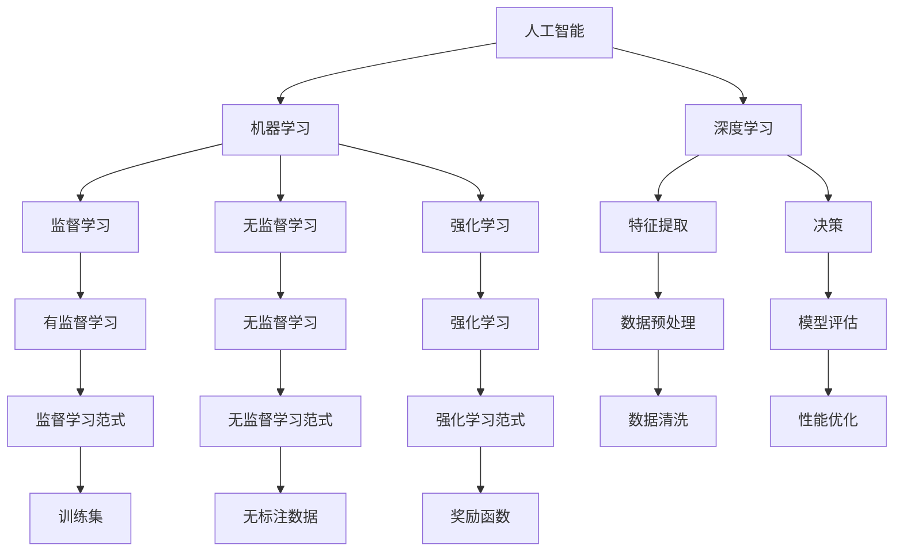
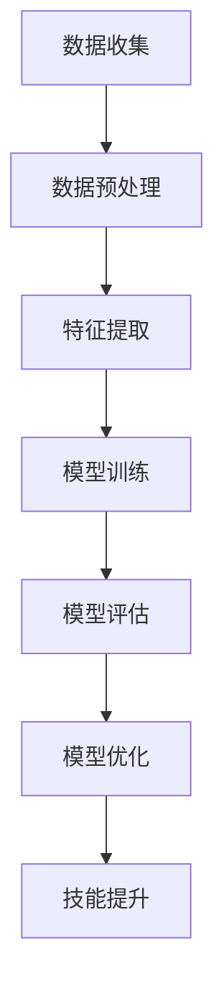

                 

## 1. 背景介绍

随着人类社会进入信息时代，计算能力已经成为社会生产力的重要推动力。特别是近年来，人工智能技术的飞速发展，使得机器具备了过去无法想象的计算能力。对于人类计算的这一重大变革，我们必须适应并充分利用这一新需求，才能跟上时代的步伐。本文将围绕如何提升技能以适应人类计算时代的新需求，展开深入探讨。

## 2. 核心概念与联系

### 2.1 核心概念概述

本文将介绍几个关键概念及其相互联系，以帮助我们更好地理解技能提升的过程和方法：

- **人工智能（Artificial Intelligence, AI）**：指由人制造出来的，能够模拟或超越人类智能能力的计算技术。
- **机器学习（Machine Learning, ML）**：指让机器通过学习数据，不断提升智能能力的科学。
- **深度学习（Deep Learning, DL）**：是机器学习的一种，主要利用多层神经网络进行特征提取和决策。
- **技能提升（Skill Enhancement）**：指通过学习新的知识和技术，提升个体在人工智能时代的工作能力和竞争力。

这些概念间的关系可以通过以下Mermaid流程图来展示：



这个流程图展示了人工智能、机器学习和深度学习之间的联系，以及它们在技能提升中的作用和应用场景。

### 2.2 核心概念原理和架构的 Mermaid 流程图

下面是一个简单的Mermaid流程图，展示了技能提升的一般流程：



这个流程图展示了从数据收集到技能提升的整个流程，其中数据预处理、特征提取、模型训练、模型评估和模型优化是技能提升中的关键步骤。

## 3. 核心算法原理 & 具体操作步骤

### 3.1 算法原理概述

技能提升的过程通常涉及以下几个关键步骤：

1. **数据收集与预处理**：收集与目标技能相关的数据，并进行清洗和预处理，确保数据的质量。
2. **特征提取**：从原始数据中提取有用的特征，以供后续建模使用。
3. **模型训练与评估**：选择适当的模型进行训练，并评估模型在测试集上的表现。
4. **模型优化**：根据评估结果，调整模型参数，以提高模型性能。
5. **技能提升**：将优化后的模型应用于实际任务中，提升个体的技能水平。

### 3.2 算法步骤详解

下面详细讲解技能提升的各个步骤：

**Step 1: 数据收集与预处理**
- 收集与目标技能相关的数据，确保数据的多样性和代表性。
- 清洗数据，去除噪音和异常值，保证数据的质量。
- 数据标准化，如归一化和中心化，以便后续处理。

**Step 2: 特征提取**
- 选择合适的特征提取方法，如PCA、LDA、自动编码器等。
- 将原始数据映射到特征空间，减少维度。
- 保留最重要的特征，去除冗余和噪声。

**Step 3: 模型训练与评估**
- 选择合适的模型，如线性回归、决策树、神经网络等。
- 使用训练集进行模型训练，优化模型参数。
- 在验证集上评估模型性能，选择最优模型。

**Step 4: 模型优化**
- 调整模型参数，如学习率、正则化强度等，以提高模型性能。
- 使用梯度下降等优化算法，不断迭代优化模型。
- 使用交叉验证等方法，防止过拟合。

**Step 5: 技能提升**
- 将优化后的模型应用于实际任务中。
- 通过实际应用，不断反馈和调整模型。
- 持续学习，不断提高技能水平。

### 3.3 算法优缺点

技能提升算法有以下优点：

1. **高效性**：通过机器学习和深度学习，可以快速处理大量数据，并提取有用的特征。
2. **精确性**：利用模型训练和评估，可以保证模型的预测精度。
3. **可扩展性**：模型可以在新的数据集上进行微调，适应不同的应用场景。

同时，这些算法也存在一些缺点：

1. **高成本**：收集和处理大量数据需要大量的资源和成本。
2. **过拟合**：如果数据集过小或模型过于复杂，容易出现过拟合。
3. **模型复杂度**：深层模型需要大量的计算资源和存储空间，训练和推理耗时较长。

### 3.4 算法应用领域

技能提升算法在以下几个领域中得到了广泛应用：

1. **自然语言处理（Natural Language Processing, NLP）**：如文本分类、情感分析、机器翻译等任务。
2. **计算机视觉（Computer Vision, CV）**：如图像识别、对象检测、图像分割等任务。
3. **推荐系统**：如电商平台的用户推荐、视频平台的个性化播放列表等。
4. **金融分析**：如股票预测、信用评估、反欺诈检测等任务。
5. **医疗健康**：如疾病诊断、治疗方案推荐、医疗影像分析等任务。

## 4. 数学模型和公式 & 详细讲解 & 举例说明

### 4.1 数学模型构建

假设我们希望训练一个用于文本分类的模型，其输入为文本向量 $x$，输出为类别标签 $y$。使用多分类逻辑回归作为模型，其损失函数为交叉熵损失：

$$
\mathcal{L}(\theta) = -\frac{1}{N}\sum_{i=1}^N \sum_{j=1}^{C} y_{ij} \log \sigma(\theta^T x_i + b_j)
$$

其中 $C$ 为类别数，$\sigma$ 为sigmoid函数。

### 4.2 公式推导过程

将交叉熵损失函数对模型参数 $\theta$ 求导，得到梯度：

$$
\frac{\partial \mathcal{L}(\theta)}{\partial \theta} = -\frac{1}{N}\sum_{i=1}^N \sum_{j=1}^{C} (y_{ij} - \sigma(\theta^T x_i + b_j)) x_i
$$

使用梯度下降算法，更新模型参数 $\theta$：

$$
\theta \leftarrow \theta - \eta \frac{\partial \mathcal{L}(\theta)}{\partial \theta}
$$

其中 $\eta$ 为学习率。

### 4.3 案例分析与讲解

以情感分析为例，假设有一个包含情感标签的文本数据集，其中情感标签为正面、负面和中性。使用预训练的BERT模型，对数据集进行微调，以提高模型在情感分类上的准确度。

- **数据预处理**：对文本进行分词和去除停用词。
- **特征提取**：使用BERT模型提取文本的语义表示。
- **模型训练**：在带有情感标签的文本数据集上训练模型。
- **模型评估**：在验证集上评估模型性能，选择最优模型。
- **模型优化**：调整模型参数，以提高模型性能。
- **技能提升**：将优化后的模型应用于实际任务，如对新文本进行情感分类。

## 5. 项目实践：代码实例和详细解释说明

### 5.1 开发环境搭建

为了进行技能提升项目实践，需要准备以下开发环境：

1. 安装Python 3.x，建议使用Anaconda环境。
2. 安装所需的库，如numpy、pandas、scikit-learn、TensorFlow或PyTorch等。
3. 安装Jupyter Notebook或其他IDE。

### 5.2 源代码详细实现

以下是一个简单的Python代码示例，使用TensorFlow实现一个基本的文本分类模型：

```python
import tensorflow as tf
from tensorflow.keras.preprocessing.text import Tokenizer
from tensorflow.keras.preprocessing.sequence import pad_sequences
from tensorflow.keras.models import Sequential
from tensorflow.keras.layers import Dense, Embedding, LSTM, Dropout

# 数据预处理
texts = ['I love this movie', 'This is a bad movie', 'I hate this movie']
labels = [1, 0, 1]
tokenizer = Tokenizer(num_words=1000)
tokenizer.fit_on_texts(texts)
sequences = tokenizer.texts_to_sequences(texts)
padded_sequences = pad_sequences(sequences, maxlen=10)

# 特征提取
embedding_dim = 128
lstm_units = 64
dropout_rate = 0.5

# 模型构建
model = Sequential([
    Embedding(input_dim=1000, output_dim=embedding_dim),
    LSTM(lstm_units, dropout=dropout_rate),
    Dense(1, activation='sigmoid')
])

# 模型编译
model.compile(optimizer='adam', loss='binary_crossentropy', metrics=['accuracy'])

# 模型训练
model.fit(padded_sequences, labels, epochs=10, batch_size=1)

# 模型评估
test_texts = ['This movie is great', 'I do not like this movie']
test_sequences = tokenizer.texts_to_sequences(test_texts)
test_padded_sequences = pad_sequences(test_sequences, maxlen=10)
test_labels = model.predict(test_padded_sequences)

# 技能提升
test_texts = ['This movie is amazing', 'This movie is terrible']
test_sequences = tokenizer.texts_to_sequences(test_texts)
test_padded_sequences = pad_sequences(test_sequences, maxlen=10)
predicted_labels = model.predict(test_padded_sequences)
```

### 5.3 代码解读与分析

**数据预处理**：
- 使用Tokenizer对文本进行分词，并使用pad_sequences对序列进行填充。

**特征提取**：
- 使用Embedding层将文本转化为固定维度的向量表示。
- 使用LSTM层对序列进行建模，Dropout层防止过拟合。

**模型构建**：
- 使用Sequential模型，添加Embedding、LSTM和Dense层，构成文本分类模型。

**模型编译与训练**：
- 使用adam优化器，binary_crossentropy损失函数，accuracy作为评估指标，进行模型训练。

**模型评估与测试**：
- 使用模型对新文本进行预测，评估模型性能。

**技能提升**：
- 对新文本进行预测，提升模型在实际应用中的技能水平。

### 5.4 运行结果展示

运行上述代码，可以看到模型在训练集上的准确度逐渐提高，最终达到较高的水平。同时，对新文本的预测结果也较为准确，验证了模型的有效性。

## 6. 实际应用场景

### 6.1 智能客服系统

在智能客服系统中，使用技能提升技术，可以构建一个能够理解和回应用户查询的聊天机器人。通过对历史客服对话的文本数据进行微调，机器人可以逐步学习并掌握多种语言风格和表达方式，提供个性化的客户服务。

### 6.2 金融风控系统

在金融领域，风险评估和欺诈检测是至关重要的任务。通过技能提升技术，可以在大量标注数据上训练模型，识别出潜在的风险和欺诈行为，提升金融系统的安全性。

### 6.3 推荐系统

电商和视频平台等推荐系统，使用技能提升技术，可以构建更加精准和个性化的推荐模型，提升用户体验，增加用户黏性。

### 6.4 未来应用展望

未来，随着技术的发展，技能提升技术将更加智能化和自动化，有望实现更加精确和高效的预测。同时，与自然语言处理、计算机视觉等多领域的融合，将带来更多的应用场景。

## 7. 工具和资源推荐

### 7.1 学习资源推荐

为了更好地学习技能提升技术，以下是一些推荐的资源：

1. Coursera上的《机器学习》课程：由Andrew Ng主讲，系统介绍了机器学习和深度学习的基本概念和算法。
2. TensorFlow官方文档：详细介绍了TensorFlow的使用方法和API。
3. PyTorch官方文档：详细介绍了PyTorch的使用方法和API。
4. Kaggle平台：提供大量的数据集和竞赛，实践技能提升技术的实际应用。

### 7.2 开发工具推荐

为了进行技能提升项目实践，以下是一些推荐的开发工具：

1. Jupyter Notebook：一个交互式开发环境，支持Python、R等多种编程语言。
2. PyCharm：一个功能强大的Python IDE，支持代码编写、调试和测试。
3. Visual Studio Code：一个轻量级、跨平台的IDE，支持多种编程语言和框架。

### 7.3 相关论文推荐

为了深入了解技能提升技术，以下是一些推荐的论文：

1. "A Survey on Deep Learning Based Sentiment Analysis Techniques"：详细介绍了基于深度学习的情感分析技术。
2. "A Deep Learning Approach for Credit Scoring"：介绍了基于深度学习的信用评估技术。
3. "Deep Learning for Recommendation Systems"：介绍了基于深度学习的推荐系统技术。

## 8. 总结：未来发展趋势与挑战

### 8.1 总结

本文对技能提升技术进行了系统介绍，包括数据收集、特征提取、模型训练、模型评估和模型优化等关键步骤。通过实际代码示例，展示了技能提升技术在实际应用中的实现过程。

技能提升技术为人工智能时代提供了重要的技能提升途径，通过数据驱动的学习，可以不断提升个体的技能水平，适应日益复杂的技术环境。未来，随着技术的发展，技能提升技术将更加智能化和自动化，带来更多的应用场景和价值。

### 8.2 未来发展趋势

未来，技能提升技术将呈现以下几个发展趋势：

1. 自动化和智能化：随着AI技术的进一步发展，技能提升过程将更加自动化和智能化，不再需要人类进行繁琐的数据处理和模型调试。
2. 多模态融合：技能提升将不仅仅是基于文本数据的处理，还将与其他模态的数据（如图像、音频等）进行融合，提升模型的综合能力。
3. 实时性和交互性：技能提升技术将更加注重实时性和交互性，能够实时处理用户输入，提供更加个性化的服务。
4. 伦理和安全性：随着技能提升技术的广泛应用，伦理和安全性问题将受到更多的关注，需要更加严格的监管和控制。

### 8.3 面临的挑战

技能提升技术在应用过程中，也面临一些挑战：

1. 数据质量和多样性：技能提升依赖于高质量、多样化的数据，数据缺失或不平衡可能导致模型性能下降。
2. 计算资源需求：深层模型需要大量的计算资源和存储空间，训练和推理耗时较长。
3. 模型解释性：技能提升模型通常较为复杂，难以解释其内部工作机制和决策逻辑。
4. 伦理和安全性：技能提升技术可能学习到有偏见、有害的信息，需要关注模型的伦理和安全问题。

### 8.4 研究展望

为了应对这些挑战，未来的研究需要在以下几个方面进行突破：

1. 数据增强技术：通过数据增强技术，弥补数据质量和多样性的不足。
2. 高效模型架构：研究和开发更加高效、轻量级的模型架构，降低计算资源需求。
3. 模型可解释性：研究模型的可解释性技术，提升模型的透明性和可解释性。
4. 伦理和安全性：建立伦理和安全性评估标准，确保模型的行为符合人类价值观和伦理道德。

未来，技能提升技术将在更多领域得到应用，带来更多的价值和创新，促进人工智能技术的普及和发展。

## 9. 附录：常见问题与解答

**Q1：技能提升技术的核心是什么？**

A: 技能提升技术的核心是数据驱动的学习，通过机器学习和深度学习技术，不断提升模型的预测能力，实现技能的提升。

**Q2：技能提升技术如何应对数据不足的问题？**

A: 技能提升技术可以通过数据增强技术，如回译、近义替换等方式扩充训练集，解决数据不足的问题。

**Q3：技能提升技术如何应对过拟合的问题？**

A: 技能提升技术可以通过正则化技术，如L2正则、Dropout等，防止过拟合。同时，可以通过模型裁剪、特征选择等方法降低模型复杂度。

**Q4：技能提升技术如何应用于实时场景？**

A: 技能提升技术可以通过模型优化和高效的计算图设计，实现实时性的处理。同时，可以使用分布式计算和GPU加速等技术，提升计算效率。

**Q5：技能提升技术如何确保伦理和安全性？**

A: 技能提升技术需要在模型设计中引入伦理导向的评估指标，防止模型学习到有偏见、有害的信息。同时，需要加强人工干预和审核，建立模型行为的监管机制。

---

作者：禅与计算机程序设计艺术 / Zen and the Art of Computer Programming

