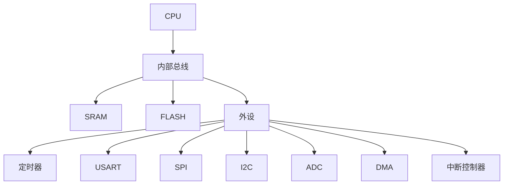
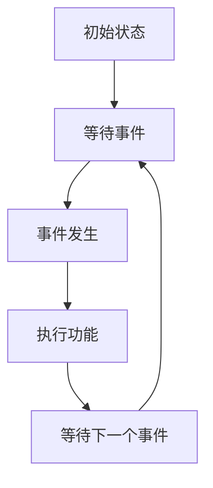

                 

STM32单片机、嵌入式系统、C语言、中断、定时器、外设、开发板

## 1. 背景介绍

STM32单片机是由STMicroelectronics推出的32位微控制器系列，广泛应用于嵌入式系统领域。STM32单片机具有高性能、低功耗、丰富的外设资源等优点，是嵌入式系统开发的首选平台之一。本文将介绍STM32单片机的应用开发，重点讲解其核心概念、算法原理、数学模型、项目实践等内容。

## 2. 核心概念与联系

STM32单片机内部结构如下图所示：



STM32单片机的核心是ARM Cortex-M3或Cortex-M4内核，具有32位RISC架构，支持Thumb-2指令集。STM32单片机还集成了丰富的外设资源，如定时器、USART、SPI、I2C、ADC等，可以满足各种嵌入式系统的需求。

## 3. 核心算法原理 & 具体操作步骤

### 3.1 算法原理概述

STM32单片机的算法原理主要包括中断处理、定时器驱动、外设控制等内容。中断是STM32单片机的核心机制之一，可以及时响应外部事件，提高系统的实时性能。定时器是STM32单片机的常用外设之一，可以产生定时中断，实现时间驱动的功能。外设控制则是STM32单片机的另一项核心功能，可以控制各种外设资源，实现系统的功能需求。

### 3.2 算法步骤详解

以定时器驱动为例，STM32单片机的定时器驱动算法步骤如下：

1. 初始化定时器外设，设置定时器的时钟源、分频因子、计数模式等参数。
2. 设置定时器的中断源，并使能定时器中断。
3. 启动定时器，开始计时。
4. 等待定时器中断发生。
5. 在定时器中断服务函数中，执行相应的功能代码。
6. 关闭定时器，结束计时。

### 3.3 算法优缺点

STM32单片机的算法优点包括：

* 实时性能好，可以及时响应外部事件。
* 资源利用率高，可以集成丰富的外设资源。
* 灵活性好，可以根据需求定制算法。

STM32单片机的算法缺点包括：

* 算法复杂度高，需要较高的编程技能。
* 算法调试困难，需要较多的时间和精力。

### 3.4 算法应用领域

STM32单片机的算法应用领域包括：

* 实时控制系统，如工业控制、汽车电子等。
* 嵌入式系统，如物联网、智能家居等。
* 仪器仪表，如医疗设备、测量仪器等。

## 4. 数学模型和公式 & 详细讲解 & 举例说明

### 4.1 数学模型构建

STM32单片机的数学模型可以用状态机来表示，状态机的状态转移图如下：



### 4.2 公式推导过程

STM32单片机的定时器计数公式为：

$$T_{count} = \frac{T_{prescale} \times (ARR + 1)}{PSC}$$

其中，$T_{count}$为定时器计数值，$T_{prescale}$为定时器时钟源频率，$ARR$为自动重装载寄存器值，$PSC$为预分频因子。

### 4.3 案例分析与讲解

例如，STM32单片机的定时器1以内部时钟源为时钟源，预分频因子为8，自动重装载寄存器值为65535，则定时器计数值为：

$$T_{count} = \frac{8MHz \times (65535 + 1)}{8} = 65536us$$

## 5. 项目实践：代码实例和详细解释说明

### 5.1 开发环境搭建

STM32单片机的开发环境包括开发板、开发工具、编译器等。常用的开发板包括STM32F4Discovery、STM32F103C8T6等，常用的开发工具包括Keil、IAR、Makefile等，常用的编译器包括GCC、IAR C/C++ Compiler等。

### 5.2 源代码详细实现

以下是STM32单片机定时器驱动的C语言源代码实现：

```c
#include "stm32f4xx.h"

void Timer_Init(void)
{
    // 使能定时器时钟
    RCC_APB1PeriphClockCmd(RCC_APB1Periph_TIM2, ENABLE);

    // 设置定时器时钟源、分频因子、计数模式等参数
    TIM_TimeBaseInitTypeDef TIM_TimeBaseInitStruct;
    TIM_TimeBaseInitStruct.TIM_Prescaler = 84 - 1;
    TIM_TimeBaseInitStruct.TIM_CounterMode = TIM_CounterMode_Up;
    TIM_TimeBaseInitStruct.TIM_Period = 65535;
    TIM_TimeBaseInitStruct.TIM_ClockDivision = TIM_CKD_DIV1;
    TIM_TimeBaseInit(TIM2, &TIM_TimeBaseInitStruct);

    // 设置定时器中断源
    TIM_ITConfig(TIM2, TIM_IT_Update, ENABLE);

    // 使能定时器
    TIM_Cmd(TIM2, ENABLE);
}

void TIM2_IRQHandler(void)
{
    if (TIM_GetITStatus(TIM2, TIM_IT_Update)!= RESET)
    {
        // 执行相应的功能代码
        TIM_ClearITPendingBit(TIM2, TIM_IT_Update);
    }
}
```

### 5.3 代码解读与分析

在`Timer_Init`函数中，首先使能定时器时钟，然后设置定时器时钟源、分频因子、计数模式等参数，最后设置定时器中断源并使能定时器。在`TIM2_IRQHandler`函数中，检测定时器中断标志位，如果中断发生，则执行相应的功能代码，最后清除中断标志位。

### 5.4 运行结果展示

定时器驱动代码运行后，定时器会产生定时中断，可以实现时间驱动的功能。例如，可以使用定时器驱动LED闪烁，实现LED闪烁的频率可以通过修改定时器参数来调节。

## 6. 实际应用场景

STM32单片机的实际应用场景包括：

* 智能家居，如智能插座、智能照明等。
* 物联网，如传感器网络、无线通信等。
* 工业控制，如PLC、伺服驱动等。
* 汽车电子，如车身控制、仪表盘等。

### 6.4 未来应用展望

STM32单片机的未来应用展望包括：

* 物联网领域的进一步拓展，如NB-IoT、LoRaWAN等低功耗广域网络。
* 人工智能领域的应用，如边缘计算、神经网络加速等。
* 5G通信领域的应用，如小基站、物联网网关等。

## 7. 工具和资源推荐

### 7.1 学习资源推荐

STM32单片机的学习资源包括：

* STMicroelectronics官方文档：<https://www.st.com/en/embedded-software/stm32-embedded-software.html>
* 官方示例代码：<https://github.com/STMicroelectronics/STM32CubeF4>
* 网络资源：<https://www.stm32f4-discovery.net/>

### 7.2 开发工具推荐

STM32单片机的开发工具包括：

* Keil：<https://www.keil.com/>
* IAR：<https://www.iar.com/>
* Makefile：<https://www.gnu.org/software/make/>

### 7.3 相关论文推荐

STM32单片机的相关论文包括：

* "STM32CubeMX: A Tool for Automatic STM32 Microcontroller Configuration and Code Generation"：<https://ieeexplore.ieee.org/document/7046364>
* "STM32F4xx Series Programming Manual"：<https://www.st.com/resource/en/user_manual/um1728-stm32f4xx-series-programming-manual-stmicroelectronics.pdf>

## 8. 总结：未来发展趋势与挑战

### 8.1 研究成果总结

STM32单片机的研究成果包括：

* STM32CubeMX：STM32单片机的配置和代码生成工具。
* STM32CubeF4：STM32F4系列单片机的软件开发包。
* STM32F4xx Series Programming Manual：STM32F4系列单片机的编程手册。

### 8.2 未来发展趋势

STM32单片机的未来发展趋势包括：

* 低功耗技术的进一步发展，如Power Saving Modes、Dynamic Voltage and Frequency Scaling等。
* 安全技术的进一步发展，如Secure Boot、Trusted Execution Environment等。
* 物联网技术的进一步发展，如NB-IoT、LoRaWAN等。

### 8.3 面临的挑战

STM32单片机面临的挑战包括：

* 低功耗和高性能的平衡。
* 安全和可靠性的保障。
* 物联网技术的快速发展。

### 8.4 研究展望

STM32单片机的研究展望包括：

* 低功耗和高性能的平衡优化。
* 安全和可靠性的保障机制研究。
* 物联网技术的进一步应用和开发。

## 9. 附录：常见问题与解答

### 9.1 如何选择STM32单片机？

选择STM32单片机时，需要考虑以下因素：

* 系统性能需求，如CPU频率、内存大小等。
* 外设资源需求，如定时器、USART、SPI、I2C、ADC等。
* 成本需求，如单价、封装大小等。
* 供应商支持和资源，如文档、示例代码、论坛等。

### 9.2 如何调试STM32单片机？

STM32单片机的调试方法包括：

* 使用调试器，如ST-LINK/V2、J-Link等。
* 使用串口调试，如USART、UART等。
* 使用SWD调试，如SWD-DP等。

### 9.3 如何学习STM32单片机？

学习STM32单片机时，需要掌握以下内容：

* C语言编程基础。
* ARM Cortex-M3或Cortex-M4内核原理。
* STM32单片机内部结构和外设资源。
* 中断处理、定时器驱动、外设控制等算法原理。
* 数学模型和公式推导。
* 项目实践和实际应用场景。

## 作者：禅与计算机程序设计艺术 / Zen and the Art of Computer Programming

