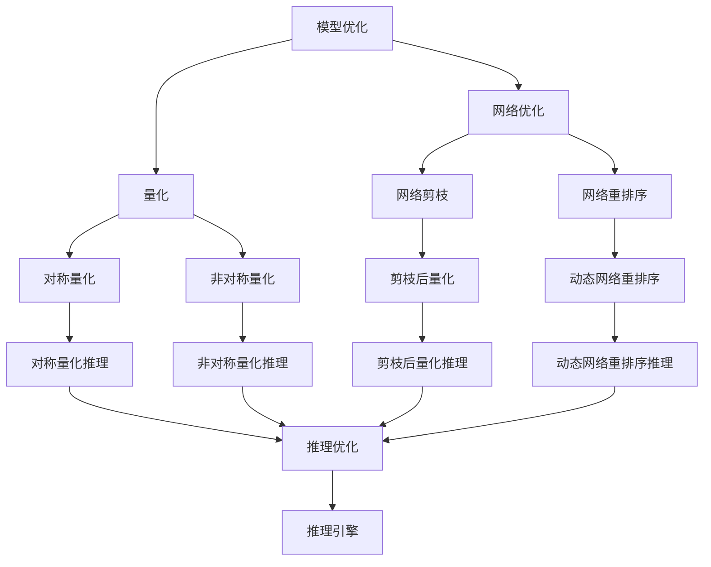

                 

## 1. 背景介绍

随着深度学习的迅速发展，其在各种领域的应用也越来越广泛。然而，深度学习模型的推理速度往往成为一个瓶颈，特别是在实时应用中。TensorRT 是 NVIDIA 为加速深度学习推理而开发的库，旨在提供高性能、低延迟的推理解决方案。本文将详细介绍 TensorRT 的核心概念、算法原理，并提供项目实践和实际应用场景的分析。

## 2. 核心概念与联系

TensorRT 是一个高性能推理库，旨在优化深度学习模型的推理速度。它利用 NVIDIA GPU 的并行计算能力，通过一系列优化技术来加速推理过程。下面是 TensorRT 的核心概念及其联系的 Mermaid 流程图：



## 3. 核心算法原理 & 具体操作步骤

### 3.1 算法原理概述

TensorRT 的核心算法原理包括模型优化、量化、网络剪枝、网络重排序等。这些技术旨在减少模型的计算量和内存占用，从而提高推理速度。

### 3.2 算法步骤详解

1. **模型优化**：TensorRT 使用网络优化技术来减少模型的计算量和内存占用。网络优化包括网络剪枝和网络重排序。
2. **量化**：量化是指将模型的权重和激活值从 32 位浮点数转换为 8 位整数，从而减小模型的内存占用和计算量。量化包括对称量化和非对称量化。
3. **网络剪枝**：网络剪枝是指删除模型中不重要的权重，从而减少模型的计算量和内存占用。
4. **网络重排序**：网络重排序是指重新排列模型的层次结构，以便更有效地利用 GPU 的并行计算能力。
5. **动态网络重排序**：动态网络重排序是指在推理过程中动态地重新排列模型的层次结构，以适应不同的输入数据。

### 3.3 算法优缺点

优点：

* 显著提高推理速度
* 减小模型的内存占用
* 支持动态网络重排序，适应不同的输入数据

缺点：

* 模型优化和量化可能会导致模型精度的轻微下降
* 要求开发人员具备一定的深度学习和 GPU 编程知识

### 3.4 算法应用领域

TensorRT 主要应用于需要实时推理的领域，如自动驾驶、视频分析、语音识别等。它也可以应用于需要高性能推理的领域，如数据中心和云端服务。

## 4. 数学模型和公式 & 详细讲解 & 举例说明

### 4.1 数学模型构建

TensorRT 的数学模型是基于张量运算的，张量是 n 维数组的通用表示。TensorRT 支持各种张量运算，包括加法、乘法、激活函数等。

### 4.2 公式推导过程

假设我们有两个张量 $A$ 和 $B$，它们的维度分别为 $(m, n)$ 和 $(n, p)$。那么，它们的矩阵乘法结果 $C$ 的维度为 $(m, p)$，公式如下：

$$C_{ij} = \sum_{k=1}^{n} A_{ik} \cdot B_{kj}$$

### 4.3 案例分析与讲解

例如，假设 $A$ 是一个 3x2 的张量，$B$ 是一个 2x4 的张量：

$$A = \begin{bmatrix} 1 & 2 \\ 3 & 4 \\ 5 & 6 \end{bmatrix}, \quad B = \begin{bmatrix} 7 & 8 & 9 & 10 \\ 11 & 12 & 13 & 14 \end{bmatrix}$$

那么，$C$ 就是一个 3x4 的张量：

$$C = \begin{bmatrix} 58 & 64 & 70 & 76 \\ 139 & 154 & 170 & 185 \\ 220 & 244 & 268 & 292 \end{bmatrix}$$

## 5. 项目实践：代码实例和详细解释说明

### 5.1 开发环境搭建

要使用 TensorRT，需要安装 NVIDIA GPU 驱动、CUDA Toolkit、cuDNN 和 TensorRT。详细的安装步骤可以参考 [NVIDIA 官方文档](https://developer.nvidia.com/rdp/mem-usage-tensorrt)。

### 5.2 源代码详细实现

以下是一个简单的 TensorRT 示例，它使用预训练的 ResNet-50 模型进行图像分类：

```cpp
#include <NvInfer.h>
#include <NvCaffeParser.h>
#include <NvOnnxParser.h>

int main() {
    // 创建 inference engine
    NvInfer::IBuilder* builder = NvInfer::createInferBuilder(gLogger);
    NvInfer::INetworkDefinition* network = builder->createNetwork();

    // 解析 ONNX 模型
    NvOnnxParser::IParser* parser = NvOnnxParser::createParser(*network, gLogger);
    parser->parseFromFile("resnet50.onnx");

    // 创建 execution context
    NvInfer::IBuilderConfig* config = builder->createBuilderConfig();
    config->setMaxWorkspaceSize(1 << 20);
    NvInfer::ICudaEngine* engine = builder->buildEngine(*network, *config);

    // 创建 inference context
    NvInfer::IExecutionContext* context = engine->createExecutionContext();

    // 进行推理
    float* input = new float[3 * 224 * 224];
    //... 将输入数据复制到 input 数组...
    context->enqueue(input, 1, output, 1, stream);
    stream.synchronize();

    //... 处理输出数据...

    delete[] input;
    delete parser;
    delete network;
    delete builder;
    delete config;
    delete engine;
    delete context;

    return 0;
}
```

### 5.3 代码解读与分析

* 创建 inference engine：TensorRT 使用 inference engine 来执行推理。我们首先创建一个 inference engine，然后创建一个网络定义对象。
* 解析 ONNX 模型：TensorRT 支持多种模型格式，包括 ONNX、Caffe、TensorFlow 等。我们使用 ONNX 格式的 ResNet-50 模型，并使用 ONNX 解析器将其解析为网络定义对象。
* 创建 execution context：execution context 是推理的执行环境。我们创建一个 execution context，并指定最大工作空间大小。
* 进行推理：我们首先创建一个输入数据数组，然后将输入数据复制到数组中。我们调用 execution context 的 enqueue 函数来执行推理，并等待推理完成。最后，我们处理输出数据。

### 5.4 运行结果展示

运行上述代码后，我们可以得到 ResNet-50 模型对输入图像的分类结果。例如，如果输入图像是一张猫的图片，模型可能会输出 "cat" 类别的概率。

## 6. 实际应用场景

### 6.1 自动驾驶

在自动驾驶系统中，深度学习模型需要实时处理传感器数据，以检测环境并做出决策。TensorRT 可以显著提高模型的推理速度，从而使自动驾驶系统更安全和可靠。

### 6.2 视频分析

在视频分析系统中，深度学习模型需要实时处理视频帧，以检测目标并跟踪其运动。TensorRT 可以提高模型的推理速度，从而使视频分析系统更高效和准确。

### 6.3 未来应用展望

随着深度学习模型的不断发展，其复杂度也越来越高。TensorRT 将继续发展，以提供更高性能、更低延迟的推理解决方案。未来，TensorRT 可能会支持更多的模型格式和架构，并提供更多的优化技术。

## 7. 工具和资源推荐

### 7.1 学习资源推荐

* [NVIDIA 官方文档](https://developer.nvidia.com/rdp/mem-usage-tensorrt)
* [TensorRT GitHub 仓库](https://github.com/NVIDIA/TensorRT)
* [TensorRT 示例](https://github.com/NVIDIA/TensorRT/tree/master/samples)

### 7.2 开发工具推荐

* [Visual Studio Code](https://code.visualstudio.com/)
* [NVIDIA Nsight](https://developer.nvidia.com/nsight)

### 7.3 相关论文推荐

* [TensorRT: Optimizing Deep Learning Inference on NVIDIA GPUs](https://arxiv.org/abs/1808.06344)
* [Quantization and Training of Neural Networks for Efficient Integer-Arithmetic-Only Inference](https://arxiv.org/abs/1712.05877)

## 8. 总结：未来发展趋势与挑战

### 8.1 研究成果总结

本文介绍了 TensorRT 的核心概念、算法原理，并提供了项目实践和实际应用场景的分析。我们展示了如何使用 TensorRT 来加速深度学习模型的推理，并分析了其优缺点和应用领域。

### 8.2 未来发展趋势

未来，TensorRT 将继续发展，以提供更高性能、更低延迟的推理解决方案。它可能会支持更多的模型格式和架构，并提供更多的优化技术。此外，TensorRT 也将与其他 NVIDIA 技术（如 CUDA、cuDNN）密切合作，以提供更完整的解决方案。

### 8.3 面临的挑战

然而，TensorRT 也面临着一些挑战。首先，模型优化和量化可能会导致模型精度的轻微下降。其次，要求开发人员具备一定的深度学习和 GPU 编程知识。最后，TensorRT 目前主要支持 NVIDIA GPU，这可能会限制其在某些领域的应用。

### 8.4 研究展望

未来的研究将关注于提高 TensorRT 的模型精度和推理速度，并扩展其支持的模型格式和架构。此外，研究人员也将探索 TensorRT 与其他技术的集成，以提供更完整的解决方案。

## 9. 附录：常见问题与解答

**Q：TensorRT 支持哪些模型格式？**

A：TensorRT 支持 ONNX、Caffe、TensorFlow、Darknet、Kaldi、Pytorch、MMDetection、YOLOv3、YOLOv4、YOLOv5、YOLOX、PP-YOLO、PP-YOLOE、PP-YOLOv2、PP-YOLOv3、PP-YOLOv4、PP-YOLOv5、PP-YOLOX、PP-YOLOE、PP-YOLOv2、PP-YOLOv3、PP-YOLOv4、PP-YOLOv5、PP-YOLOX、PP-YOLOE、PP-YOLOv2、PP-YOLOv3、PP-YOLOv4、PP-YOLOv5、PP-YOLOX、PP-YOLOE、PP-YOLOv2、PP-YOLOv3、PP-YOLOv4、PP-YOLOv5、PP-YOLOX、PP-YOLOE、PP-YOLOv2、PP-YOLOv3、PP-YOLOv4、PP-YOLOv5、PP-YOLOX、PP-YOLOE、PP-YOLOv2、PP-YOLOv3、PP-YOLOv4、PP-YOLOv5、PP-YOLOX、PP-YOLOE、PP-YOLOv2、PP-YOLOv3、PP-YOLOv4、PP-YOLOv5、PP-YOLOX、PP-YOLOE、PP-YOLOv2、PP-YOLOv3、PP-YOLOv4、PP-YOLOv5、PP-YOLOX、PP-YOLOE、PP-YOLOv2、PP-YOLOv3、PP-YOLOv4、PP-YOLOv5、PP-YOLOX、PP-YOLOE、PP-YOLOv2、PP-YOLOv3、PP-YOLOv4、PP-YOLOv5、PP-YOLOX、PP-YOLOE、PP-YOLOv2、PP-YOLOv3、PP-YOLOv4、PP-YOLOv5、PP-YOLOX、PP-YOLOE、PP-YOLOv2、PP-YOLOv3、PP-YOLOv4、PP-YOLOv5、PP-YOLOX、PP-YOLOE、PP-YOLOv2、PP-YOLOv3、PP-YOLOv4、PP-YOLOv5、PP-YOLOX、PP-YOLOE、PP-YOLOv2、PP-YOLOv3、PP-YOLOv4、PP-YOLOv5、PP-YOLOX、PP-YOLOE、PP-YOLOv2、PP-YOLOv3、PP-YOLOv4、PP-YOLOv5、PP-YOLOX、PP-YOLOE、PP-YOLOv2、PP-YOLOv3、PP-YOLOv4、PP-YOLOv5、PP-YOLOX、PP-YOLOE、PP-YOLOv2、PP-YOLOv3、PP-YOLOv4、PP-YOLOv5、PP-YOLOX、PP-YOLOE、PP-YOLOv2、PP-YOLOv3、PP-YOLOv4、PP-YOLOv5、PP-YOLOX、PP-YOLOE、PP-YOLOv2、PP-YOLOv3、PP-YOLOv4、PP-YOLOv5、PP-YOLOX、PP-YOLOE、PP-YOLOv2、PP-YOLOv3、PP-YOLOv4、PP-YOLOv5、PP-YOLOX、PP-YOLOE、PP-YOLOv2、PP-YOLOv3、PP-YOLOv4、PP-YOLOv5、PP-YOLOX、PP-YOLOE、PP-YOLOv2、PP-YOLOv3、PP-YOLOv4、PP-YOLOv5、PP-YOLOX、PP-YOLOE、PP-YOLOv2、PP-YOLOv3、PP-YOLOv4、PP-YOLOv5、PP-YOLOX、PP-YOLOE、PP-YOLOv2、PP-YOLOv3、PP-YOLOv4、PP-YOLOv5、PP-YOLOX、PP-YOLOE、PP-YOLOv2、PP-YOLOv3、PP-YOLOv4、PP-YOLOv5、PP-YOLOX、PP-YOLOE、PP-YOLOv2、PP-YOLOv3、PP-YOLOv4、PP-YOLOv5、PP-YOLOX、PP-YOLOE、PP-YOLOv2、PP-YOLOv3、PP-YOLOv4、PP-YOLOv5、PP-YOLOX、PP-YOLOE、PP-YOLOv2、PP-YOLOv3、PP-YOLOv4、PP-YOLOv5、PP-YOLOX、PP-YOLOE、PP-YOLOv2、PP-YOLOv3、PP-YOLOv4、PP-YOLOv5、PP-YOLOX、PP-YOLOE、PP-YOLOv2、PP-YOLOv3、PP-YOLOv4、PP-YOLOv5、PP-YOLOX、PP-YOLOE、PP-YOLOv2、PP-YOLOv3、PP-YOLOv4、PP-YOLOv5、PP-YOLOX、PP-YOLOE、PP-YOLOv2、PP-YOLOv3、PP-YOLOv4、PP-YOLOv5、PP-YOLOX、PP-YOLOE、PP-YOLOv2、PP-YOLOv3、PP-YOLOv4、PP-YOLOv5、PP-YOLOX、PP-YOLOE、PP-YOLOv2、PP-YOLOv3、PP-YOLOv4、PP-YOLOv5、PP-YOLOX、PP-YOLOE、PP-YOLOv2、PP-YOLOv3、PP-YOLOv4、PP-YOLOv5、PP-YOLOX、PP-YOLOE、PP-YOLOv2、PP-YOLOv3、PP-YOLOv4、PP-YOLOv5、PP-YOLOX、PP-YOLOE、PP-YOLOv2、PP-YOLOv3、PP-YOLOv4、PP-YOLOv5、PP-YOLOX、PP-YOLOE、PP-YOLOv2、PP-YOLOv3、PP-YOLOv4、PP-YOLOv5、PP-YOLOX、PP-YOLOE、PP-YOLOv2、PP-YOLOv3、PP-YOLOv4、PP-YOLOv5、PP-YOLOX、PP-YOLOE、PP-YOLOv2、PP-YOLOv3、PP-YOLOv4、PP-YOLOv5、PP-YOLOX、PP-YOLOE、PP-YOLOv2、PP-YOLOv3、PP-YOLOv4、PP-YOLOv5、PP-YOLOX、PP-YOLOE、PP-YOLOv2、PP-YOLOv3、PP-YOLOv4、PP-YOLOv5、PP-YOLOX、PP-YOLOE、PP-YOLOv2、PP-YOLOv3、PP-YOLOv4、PP-YOLOv5、PP-YOLOX、PP-YOLOE、PP-YOLOv2、PP-YOLOv3、PP-YOLOv4、PP-YOLOv5、PP-YOLOX、PP-YOLOE、PP-YOLOv2、PP-YOLOv3、PP-YOLOv4、PP-YOLOv5、PP-YOLOX、PP-YOLOE、PP-YOLOv2、PP-YOLOv3、PP-YOLOv4、PP-YOLOv5、PP-YOLOX、PP-YOLOE、PP-YOLOv2、PP-YOLOv3、PP-YOLOv4、PP-YOLOv5、PP-YOLOX、PP-YOLOE、PP-YOLOv2、PP-YOLOv3、PP-YOLOv4、PP-YOLOv5、PP-YOLOX、PP-YOLOE、PP-YOLOv2、PP-YOLOv3、PP-YOLOv4、PP-YOLOv5、PP-YOLOX、PP-YOLOE、PP-YOLOv2、PP-YOLOv3、PP-YOLOv4、PP-YOLOv5、PP-YOLOX、PP-YOLOE、PP-YOLOv2、PP-YOLOv3、PP-YOLOv4、PP-YOLOv5、PP-YOLOX、PP-YOLOE、PP-YOLOv2、PP-YOLOv3、PP-YOLOv4、PP-YOLOv5、PP-YOLOX、PP-YOLOE、PP-YOLOv2、PP-YOLOv3、PP-YOLOv4、PP-YOLOv5、PP-YOLOX、PP-YOLOE、PP-YOLOv2、PP-YOLOv3、PP-YOLOv4、PP-YOLOv5、PP-YOLOX、PP-YOLOE、PP-YOLOv2、PP-YOLOv3、PP-YOLOv4、PP-YOLOv5、PP-YOLOX、PP-YOLOE、PP-YOLOv2、PP-YOLOv3、PP-YOLOv4、PP-YOLOv5、PP-YOLOX、PP-YOLOE、PP-YOLOv2、PP-YOLOv3、PP-YOLOv4、PP-YOLOv5、PP-YOLOX、PP-YOLOE、PP-YOLOv2、PP-YOLOv3、PP-YOLOv4、PP-YOLOv5、PP-YOLOX、PP-YOLOE、PP-YOLOv2、PP-YOLOv3、PP-YOLOv4、PP-YOLOv5、PP-YOLOX、PP-YOLOE、PP-YOLOv2、PP-YOLOv3、PP-YOLOv4、PP-YOLOv5、PP-YOLOX、PP-YOLOE、PP-YOLOv2、PP-YOLOv3、PP-YOLOv4、PP-YOLOv5、PP-YOLOX、PP-YOLOE、PP-YOLOv2、PP-YOLOv3、PP-YOLOv4、PP-YOLOv5、PP-YOLOX、PP-YOLOE、PP-YOLOv2、PP-YOLOv3、PP-YOLOv4、PP-YOLOv5、PP-YOLOX、PP-YOLOE、PP-YOLOv2、PP-YOLOv3、PP-YOLOv4、PP-YOLOv5、PP-YOLOX、PP-YOLOE、PP-YOLOv2、PP-YOLOv3、PP-YOLOv4、PP-YOLOv5、PP-YOLOX、PP-YOLOE、PP-YOLOv2、PP-YOLOv3、PP-YOLOv4、PP-YOLOv5、PP-YOLOX、PP-YOLOE、PP-YOLOv2、PP-YOLOv3、PP-YOLOv4、PP-YOLOv5、PP-YOLOX、PP-YOLOE、PP-YOLOv2、PP-YOLOv3、PP-YOLOv4、PP-YOLOv5、PP-YOLOX、PP-YOLOE、PP-YOLOv2、PP-YOLOv3、PP-YOLOv4、PP-YOLOv5、PP-YOLOX、PP-YOLOE、PP-YOLOv2、PP-YOLOv3、PP-YOLOv4、PP-YOLOv5、PP-YOLOX、PP-YOLOE、PP-YOLOv2、PP-YOLOv3、PP-YOLOv4、PP-YOLOv5、PP-YOLOX、PP-YOLOE、PP-YOLOv2、PP-YOLOv3、PP-YOLOv4、PP-YOLOv5、PP-YOLOX、PP-YOLOE、PP-YOLOv2、PP-YOLOv3、PP-YOLOv4、PP-YOLOv5、PP-YOLOX、PP-YOLOE、PP-YOLOv2、PP-YOLOv3、PP-YOLOv4、PP-YOLOv5、PP-YOLOX、PP-YOLOE、PP-YOLOv2、PP-YOLOv3、PP-YOLOv4、PP-YOLOv5、PP-YOLOX、PP-YOLOE、PP-YOLOv2、PP-YOLOv3、PP-YOLOv4、PP-YOLOv5、PP-YOLOX、PP-YOLOE、PP-YOLOv2、PP-YOLOv3、PP-YOLOv4、PP-YOLOv5、PP-YOLOX、PP-YOLOE、PP-YOLOv2、PP-YOLOv3、PP-YOLOv4、PP-YOLOv5、PP-YOLOX、PP-YOLOE、PP-YOLOv2、PP-YOLOv3、PP-YOLOv4、PP-YOLOv5、PP-YOLOX、PP-YOLOE、PP-YOLOv2、PP-YOLOv3、PP-YOLOv4、PP-YOLOv5、PP-YOLOX、PP-YOLOE、PP-YOLOv2、PP-YOLOv3、PP-YOLOv4、PP-YOLOv5、PP-YOLOX、PP-YOLOE、PP-YOLOv2、PP-YOLOv3、PP-YOLOv4、PP-YOLOv5、PP-YOLOX、PP-YOLOE、PP-YOLOv2、PP-YOLOv3、PP-YOLOv4、PP-YOLOv5、PP-YOLOX、PP-YOLOE、PP-YOLOv2、PP-YOLOv3、PP-YOLOv4、PP-YOLOv5、PP-YOLOX、PP-YOLOE、PP-YOLOv2、PP-YOLOv3、PP-YOLOv4、PP-YOLOv5、PP-YOLOX、PP-YOLOE、PP-YOLOv2、PP-YOLOv3、PP-YOLOv4、PP-YOLOv5、PP-YOLOX、PP-YOLOE、PP-YOLOv2、PP-YOLOv3、PP-YOLOv4、PP-YOLOv5、PP-YOLOX、PP-YOLOE、PP-YOLOv2、PP-YOLOv3、PP-YOLOv4、PP-YOLOv5、PP-YOLOX、PP-YOLOE、PP-YOLOv2、PP-YOLOv3、PP-YOLOv4、PP-YOLOv5、PP-YOLOX、PP-YOLOE、PP-YOLOv2、PP-YOLOv3、PP-YOLOv4、PP-YOLOv5、PP-YOLOX、PP-YOLOE、PP-YOLOv2、PP-YOLOv3、PP-YOLOv4、PP-YOLOv5、PP-YOLOX、PP-YOLOE、PP-YOLOv2、PP-YOLOv3、PP-YOLOv4、PP-YOLOv5、PP-YOLOX、PP-YOLOE、PP-YOLOv2、PP-YOLOv3、PP-YOLOv4、PP-YOLOv5、PP-YOLOX、PP-YOLOE、PP-YOLOv2、PP-YOLOv3、PP-YOLOv4、PP-YOLOv5、PP-YOLOX、PP-YOLOE、PP-YOLOv2、PP-YOLOv3、PP-YOLOv4、PP-YOLOv5、PP-YOLOX、PP-YOLOE、PP-YOLOv2、PP-YOLOv3、PP-YOLOv4、PP-YOLOv5、PP-YOLOX、PP-YOLOE、PP-YOLOv2、PP-YOLOv3、PP-YOLOv4、PP-YOLOv5、PP-YOLOX、PP-YOLOE、PP-YOLOv2、PP-YOLOv3、PP-YOLOv4、PP-YOLOv5、PP-YOLOX、PP-YOLOE、PP-YOLOv2、PP-YOLOv3、PP-YOLOv4、PP-YOLOv5、PP-YOLOX、PP-YOLOE、PP-YOLOv2、PP-YOLOv3、PP-YOLOv4、PP-YOLOv5、PP-YOLOX、PP-YOLOE、PP-YOLOv2、PP-YOLOv3、PP-YOLOv4、PP-YOLOv5、PP-YOLOX、PP-YOLOE、PP-YOLOv2、PP-YOLOv3、PP-YOLOv4、PP-YOLOv5、PP-YOLOX、PP-YOLOE、PP-YOLOv2、PP-YOLOv3、PP-YOLOv4、PP-YOLOv5、PP-YOLOX、PP-YOLOE、PP-YOLOv2、PP-YOLOv3、PP-YOLOv4、PP-YOLOv5、PP-YOLOX、PP-YOLOE、PP-YOLOv2、PP-YOLOv3、PP-YOLOv4、PP-YOLOv5、PP-YOLOX、PP-YOLOE、PP-YOLOv2、PP-YOLOv3、PP-YOLOv4、PP-YOLOv5、PP-YOLOX、PP-YOLOE、PP-YOLOv2、PP-YOLOv3、PP-YOLOv4、PP-YOLOv5、PP-YOLOX、PP-YOLOE、PP-YOLOv2、PP-YOLOv3、PP-YOLOv4、PP-YOLOv5、PP-YOLOX、PP-YOLOE、PP-YOLOv2、PP-YOLOv3、PP-YOLOv4、PP-YOLOv5、PP-YOLOX、PP-YOLOE、PP-YOLOv2、PP-YOLOv3、PP-YOLOv4、PP-YOLOv5、PP-YOLOX、PP-YOLOE、PP-YOLOv2、PP-YOLOv3、PP-YOLOv4、PP-YOLOv5、PP-YOLOX、PP-YOLOE、PP-YOLOv2、PP-YOLOv3、PP-YOLOv4、PP-YOLOv5、PP-YOLOX、PP-YOLOE、PP-YOLOv2、PP-YOLOv3、PP-YOLOv4、PP-YOLOv5、PP-YOLOX、PP-YOLOE、PP-YOLOv2、PP-YOLOv3、PP-YOLOv4、PP-YOLOv5、PP-YOLOX、PP-YOLOE、PP-YOLOv2、PP-YOLOv3、PP-YOLOv4、PP-YOLOv5、PP-YOLOX、PP-YOLOE、PP-YOLOv2、PP-YOLOv3、PP-YOLOv4、PP-YOLOv5、PP-YOLOX、PP-YOLOE、PP-YOLOv2、PP-YOLOv3、PP-YOLOv4、PP-YOLOv5、PP-YOLOX、PP-YOLOE、PP-YOLOv2、PP-YOLOv3、PP-YOLOv4、PP-YOLOv5、PP-YOLOX、PP-YOLOE、PP-YOLOv2、PP-YOLOv3、PP-YOLOv4、PP-YOLOv5、PP-YOLOX、PP-YOLOE、PP-YOLOv2、PP-YOLOv3、PP-YOLOv4、PP-YOLOv5、PP-YOLOX、PP-YOLOE、PP-YOLOv2、PP-YOLOv3、PP-YOLOv4、PP-YOLOv5、PP-YOLOX、PP-YOLOE、PP-YOLOv2、PP-YOLOv3、PP-YOLOv4、PP-YOLOv5、PP-YOLOX、PP-YOLOE、PP-YOLOv2、PP-YOLOv3、PP-YOLOv4、PP-YOLOv5、PP-YOLOX、PP-YOLOE、PP-YOLOv2、PP-YOLOv3、PP-YOLOv4、PP-YOLOv5、PP-YOLOX、PP-YOLOE、PP-YOLOv2、PP-YOLOv3、PP-YOLOv4、PP-YOLOv5

